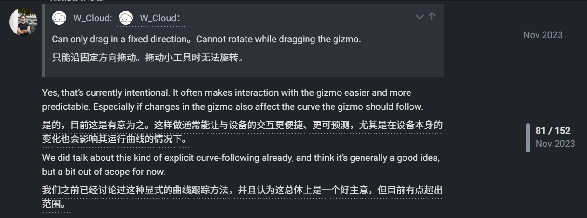
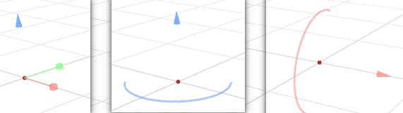
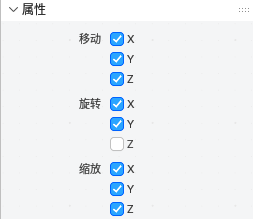
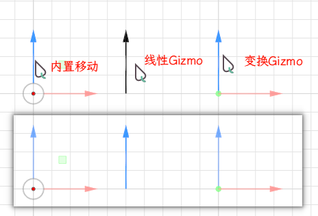

- [`NodeGizmos` 类中的三种虚函数](#nodegizmos-类中的三种虚函数)
  - [1. 虚析构函数 (Virtual Destructor)](#1-虚析构函数-virtual-destructor)
  - [2. 纯虚函数 (Pure Virtual Function)](#2-纯虚函数-pure-virtual-function)
  - [3. (普通)虚函数 (Regular Virtual Function)](#3-普通虚函数-regular-virtual-function)
- [总结与对比](#总结与对比)

---

[#112677 - Geometry Nodes: support attaching gizmos to input values - blender - Blender Projects](https://projects.blender.org/blender/blender/pulls/112677)

[Geometry Nodes Gizmos Feedback - Feature &amp; Design Feedback - Developer Forum](https://devtalk.blender.org/t/geometry-nodes-gizmos-feedback/32073/76)



> - [ ] 变换Gizmo存在问题:箭头的线段这些情况不应该消失
>   
> - [ ] 应该暴露到 `变换Gizmo`节点面板里新增九个接口
>   
> - [ ] 线宽和线段长度要能调节, 是否显示线段,屏幕空间布尔输入都要有
> - [ ] `Dial Gizmo`要能只绘制一半
> - [ ] 高亮和线宽不一致啊(中间线宽为2,为1时太细)
>  

[ED_gizmo_library.hh](..\source\blender\editors\include\ED_gizmo_library.hh)  所有可用Gizmo类型和风格

---

source\blender\editors\space_view3d\view3d_gizmo_geometry_nodes.cc

### `NodeGizmos` 类中的三种虚函数

#### 1. 虚析构函数 (Virtual Destructor)

```cpp
virtual ~NodeGizmos() = default;
```

* **语法**: `virtual ~ClassName()`. 这里的 `= default` 意味着让编译器自动生成一个标准的析构函数实现.
* **核心目的**: **确保通过基类指针删除派生类对象时, 能够正确地调用派生类的析构函数, 从而避免内存泄漏.**
* **为什么必须是 `virtual`?**
  想象一下这段代码:

  ```cpp
  NodeGizmos* gizmo = new LinearGizmo(); // 创建一个派生类对象, 但用基类指针指向它
  // ... 做一些事情 ...
  delete gizmo; // !! 问题在这里 !!
  ```

  * 如果 `~NodeGizmos()` **不是** `virtual` 的, `delete gizmo;` 只会调用 `NodeGizmos` 的析构函数. `LinearGizmo` 的析构函数 (以及它内部成员 `gizmo_`, `edit_data_` 的析构) 将**永远不会被调用**, 如果这些成员持有动态分配的资源, 就会导致**内存泄漏**! 😱
  * 如果 `~NodeGizmos()` **是** `virtual` 的, C++ 的多态机制会通过 `__vfptr` 查找到 "真正" 的析构函数, 也就是 `LinearGizmo` 的析构函数. 系统会先调用 `~LinearGizmo()`, 然后再自动调用基类的 `~NodeGizmos()`. 这样就保证了从派生类到基类的所有资源都被正确释放.
* **设计模式**: 任何时候, 只要你设计一个**打算作为基类**的类 (即你期望别人会继承它), 并且你可能会通过基类指针来 `delete` 它, 你就**必须**把它的析构函数声明为 `virtual`. 这是一个黄金法则. 👑

#### 2. 纯虚函数 (Pure Virtual Function)

```cpp
virtual void create_gizmos(wmGizmoGroup &gzgroup) = 0;
virtual Vector<wmGizmo *> get_all_gizmos() = 0;
```

* **语法**: `virtual ReturnType function_name(...) = 0;`. 末尾的 `= 0` 是关键, 它告诉编译器这个函数没有实现.
* **核心目的**: **强制所有派生类必须提供自己的实现. 它定义了一个不可或缺的"契约"或"接口".**
* **为什么需要?**
  * 一个拥有纯虚函数的类被称为**抽象类 (Abstract Class)**. 你**不能**创建抽象类的实例 (比如 `new NodeGizmos()` 会编译失败). 这很合理, 因为 `NodeGizmos` 本身并不知道具体要创建什么样子的 Gizmo.
  * 它向继承者声明: "嘿, 任何想成为 `NodeGizmos` 的类, 你**必须**告诉我**如何创建你的具体 Gizmo 实例** (`create_gizmos`) 和**如何把你拥有的所有 Gizmo 实例列表交给我** (`get_all_gizmos`). 如果你做不到, 你就不能算是一个完整的 Gizmo."
  * `create_gizmos` 是纯虚的, 因为 `LinearGizmo` 需要创建箭头 (`GIZMO_GT_arrow_3d`), 而 `DialGizmo` 需要创建圆盘 (`GIZMO_GT_dial_3d`). 基类无法为它们提供一个通用的实现.
  * `get_all_gizmos` 也是纯虚的, 因为 `LinearGizmo` 只拥有一个 `wmGizmo*`, 而 `TransformGizmos` 拥有九个. 它们的实现完全不同.
* **设计模式**: 这是典型的**接口继承 (Interface Inheritance)**. 基类只定义接口, 不提供实现, 将实现的责任完全委托给派生类. 这是构建灵活和可扩展框架的基础.

#### 3. (普通)虚函数 (Regular Virtual Function)

```cpp
virtual void update(GizmosUpdateParams & /*params*/) {}
```

* **语法**: `virtual ReturnType function_name(...) { /* 可选的默认实现 */ }`.
* **核心目的**: **提供一个可选的、可被派生类重写 (override) 的默认行为.**
* **为什么需要?**
  * 它向继承者声明: "我提供了一个默认的 `update` 行为 (在这里是**什么都不做**, 即空函数体 `{}`). 如果这个默认行为对你来说足够了, 你可以不用管它. 但如果你需要特殊的更新逻辑, 你**可以**重写 (override) 这个函数来实现你自己的版本."
  * 在这个具体的例子中, `update` 函数被定义为普通虚函数, 可能是因为**并非所有**的 Gizmo 类型都需要复杂的更新逻辑. 虽然 `LinearGizmo`, `DialGizmo` 等都重写了它, 但设计者可能预留了未来添加某种"静态"或"简单" Gizmo 的可能性, 这种 Gizmo 可能不需要每次 `refresh` 都更新, 那么它就可以直接使用基类的空实现.
  * 这提供了一种"**选择性加入 (Opt-in)**"的灵活性. 派生类可以根据自己的需要来决定是否要提供更复杂的行为.
* **设计模式**: 这被称为**实现继承 (Implementation Inheritance)** 的一种形式, 基类提供了一个(可能是空的)默认实现, 派生类可以继承并扩展或替换这个实现.

---

### 总结与对比

| 函数类型               | 语法                      | 目的                             | 基类是否有实现?          | 派生类必须实现吗? |
| :--------------------- | :------------------------ | :------------------------------- | :----------------------- | :---------------- |
| **虚析构函数**   | `virtual ~C() {}`       | ✅**安全地销毁**派生类对象 | 是 (可以是 `=default`) | 否 (但推荐)       |
| **纯虚函数**     | `virtual void f() = 0;` | 📜**强制定义接口** (契约)  | 否                       | **是!**     |
| **(普通)虚函数** | `virtual void f() {}`   | ✨**提供可重写的默认行为** | 是                       | 否 (可选)         |

在 `NodeGizmos` 这个类中, 设计者通过这三种虚函数的组合, 完美地构建了一个强大而灵活的框架:

* 用**虚析构函数**保证了内存安全.
* 用**纯虚函数** (`create_gizmos`, `get_all_gizmos`) 强制所有子类都具备最核心的功能.
* 用**普通虚函数** (`update`) 提供了一个可扩展点, 允许子类根据需要实现更复杂的逻辑.
