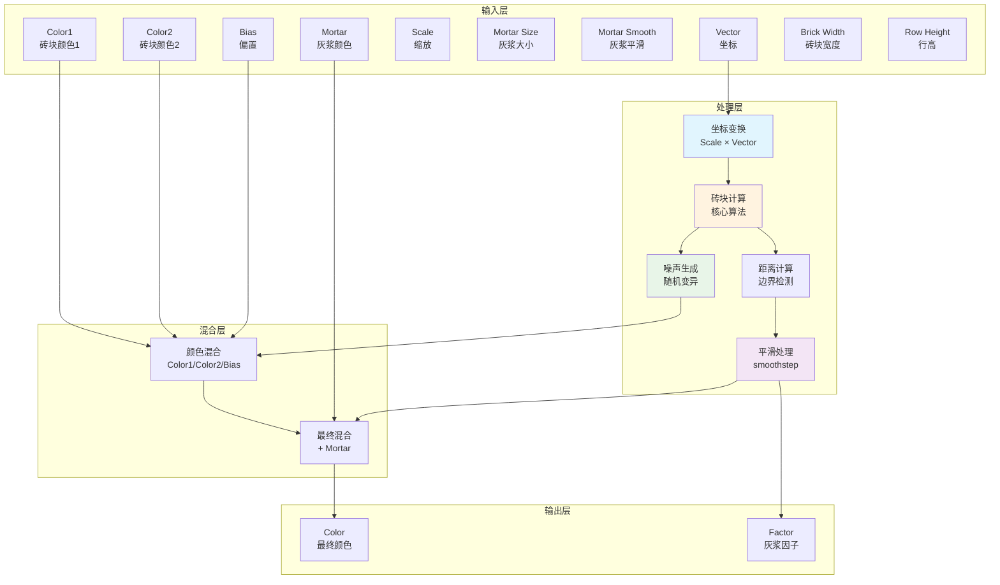
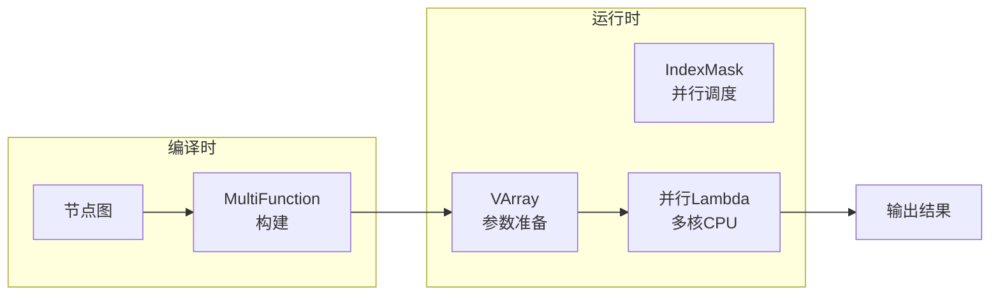
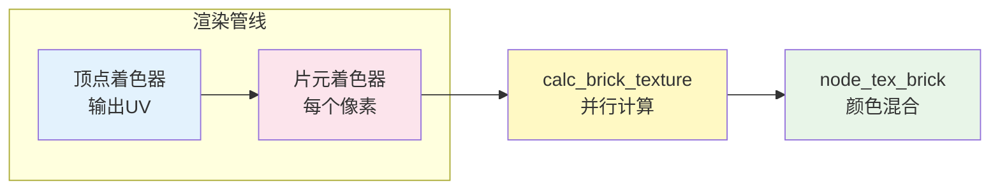
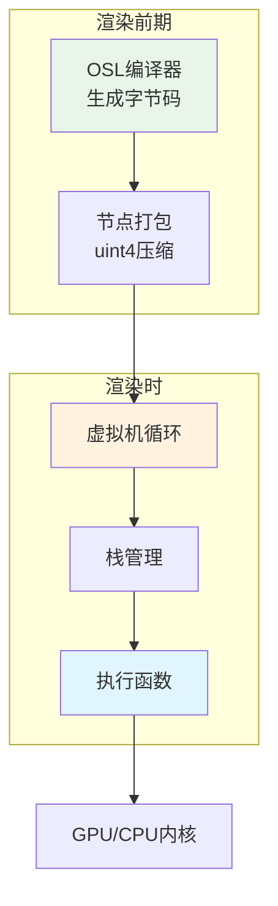
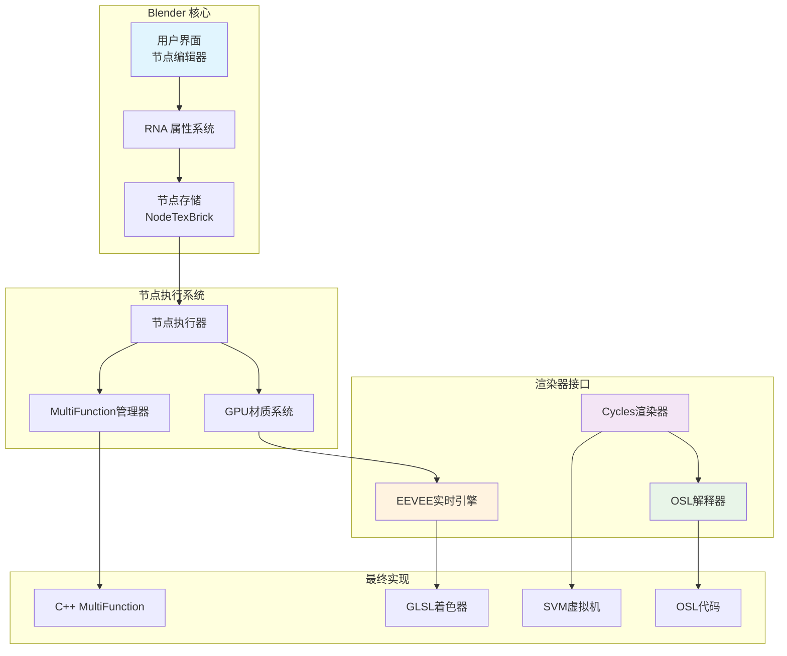

# Blender Brick Texture 节点详细技术文档

## 目录
- [1. 节点概述](#节点概述)
- [2. 输入参数详解](#输入参数详解)
- [3. C++ 多函数架构实现](#c-多函数架构实现)
- [4. GLSL GPU 实时渲染实现](#glsl-gpu-实时渲染实现)
- [5. OSL 离线渲染实现](#osl-离线渲染实现)
- [6. SVM 虚拟机实现](#svm-虚拟机实现)
- [7. 数据流架构](#数据流架构)
- [8. 算法原理深度解析](#算法原理深度解析)
- [9. 参数影响分析](#参数影响分析)
- [10. 性能优化策略](#性能优化策略)
- [11. 依赖关系与调用时机](#依赖关系与调用时机)

---

## 节点概述

Brick Texture (砖块纹理) 节点是 Blender 中用于生成程序化砖墙纹理的核心组件。它通过数学算法模拟真实的砖块排列、 mortar (灰浆) 间隙和颜色变化。

### 四大实现版本及其用途

| 实现版本 | 渲染引擎 | 使用场景 | 核心文件 |
|---------|---------|----------|----------|
| **C++ MultiFunction** | 通用/NODE系统 | 节点图计算、预处理 | `source/blender/nodes/shader/nodes/node_shader_tex_brick.cc` |
| **GLSL** | EEVEE实时渲染 | 视口实时预览、游戏引擎 | `source/blender/gpu/shaders/material/gpu_shader_material_tex_brick.glsl` |
| **OSL** | Cycles离线渲染 | CPU渲染 (需OSL支持) | `intern/cycles/kernel/osl/shaders/node_brick_texture.osl` |
| **SVM** | Cycles离线渲染 | CPU/GPU渲染 (无需OSL) | `intern/cycles/kernel/svm/brick.h` |

**为什么需要四种实现？**
- **C++**: 处理节点编辑器中的逻辑计算、数据验证和多函数架构
- **GLSL**: GPU硬件加速，用于EEVEE引擎的实时渲染 (微秒级响应)
- **OSL**: 离线渲染中提供脚本化着色语言支持，美术师可扩展
- **SVM**: Cycles渲染器的虚拟机实现，提供最佳的CPU/GPU兼容性

---

## 输入参数详解

### 1. Vector (向量输入)
- **类型**: 3D向量
- **默认值**: 位置坐标 (`NODE_DEFAULT_INPUT_POSITION_FIELD`)
- **范围**: -10,000 到 +10,000
- **作用**: 纹理坐标空间，决定砖块的摆放位置
- **奇异变量名解释**: `co`, `tex_co` = coordinate (坐标)

### 2. Color1/Color2 (颜色1/颜色2)
- **类型**: RGBA颜色
- **默认值**:
  - Color1: (0.8, 0.8, 0.8, 1.0) *浅灰色*
  - Color2: (0.2, 0.2, 0.2, 1.0) *深灰色*
- **作用**: 两种基础砖块颜色，通过Bias参数混合

### 3. Mortar (灰浆颜色)
- **类型**: RGBA颜色
- **默认值**: (0.0, 0.0, 0.0, 1.0) *黑色*
- **作用**: 砖块间隙的颜色
- **奇异变量名解释**: "mortar" = 砌砖用的灰浆

### 4. Scale (缩放)
- **类型**: 浮点数
- **默认值**: 5.0
- **范围**: -1000 到 +1000
- **作用**: 控制整个纹理的密度，值越大砖块越小

### 5. Mortar Size (灰浆大小)
- **类型**: 浮点数
- **默认值**: 0.02
- **范围**: 0.0 到 0.125
- **作用**: 砖块之间的间隙宽度，0为无缝
- **奇异变量名解释**: `mortar_width` = 灰浆宽度

### 6. Mortar Smooth (灰浆平滑)
- **类型**: 浮点数
- **默认值**: 0.1
- **范围**: 0.0 到 1.0
- **作用**: 灰浆边缘的柔和程度，用于凹凸贴图

### 7. Bias (偏置)
- **类型**: 浮点数
- **默认值**: 0.0
- **范围**: -1.0 到 1.0
- **作用**: Color1/Color2 的混合权重
  - -1 = 100% Color1
  - 0 = 50% Color1 + 50% Color2 (带噪声)
  - 1 = 100% Color2

### 8. Brick Width (砖块宽度)
- **类型**: 浮点数
- **默认值**: 0.5
- **范围**: 0.01 到 100.0
- **作用**: 单个砖块在水平方向的比例
- **奇异变量名解释**: `brick_width` = 砖块宽度

### 9. Row Height (行高度)
- **类型**: 浮点数
- **默认值**: 0.25
- **范围**: 0.01 到 100.0
- **作用**: 单个砖块在垂直方向的比例

### 延伸参数 (存储在节点结构体中)

```cpp
// 定义位置: source/blender/nodes/shader/nodes/node_shader_tex_brick.cc:97-109
typedef struct NodeTexBrick {
  float offset;         // 偏移量，默认 0.5
  float squash;         // 压缩比例，默认 1.0
  int offset_freq;      // 偏移频率，默认 2
  int squash_freq;      // 压缩频率，默认 2
} NodeTexBrick;
```

- **Offset (偏移)**: 砖块在错位行中的偏移比例，传统砖墙是半个砖块宽度
- **Offset Frequency (偏移频率)**: 每隔多少行进行一次偏移
- **Squash (压缩)**: 砖块的宽度压缩比例，用于创造不规则砖墙
- **Squash Frequency (压缩频率)**: 每隔多少行进行一次压缩

---

## C++ 多函数架构实现

### 核心架构设计

**文件位置**: `source/blender/nodes/shader/nodes/node_shader_tex_brick.cc:133-283`

C++ 实现采用了 Blender 13.0+ 的 **MultiFunction** 架构，这是节点系统的现代化重构：

```cpp
// 定义位置: source/blender/nodes/shader/nodes/node_shader_tex_brick.cc:133-146
class BrickFunction : public mf::MultiFunction {
 private:
  const float offset_;
  const int offset_freq_;
  const float squash_;
  const int squash_freq_;

public:
  BrickFunction(const float offset, const int offset_freq,
                const float squash, const int squash_freq)
      : offset_(offset), offset_freq_(offset_freq),
        squash_(squash), squash_freq_(squash_freq)
  {
    // 签名定义...
  }
};
```

### 签名系统 (接口定义)

**定义位置**: `source/blender/nodes/shader/nodes/node_shader_tex_brick.cc:147-165`

```cpp
static const mf::Signature signature = []() {
  mf::Signature signature;
  mf::SignatureBuilder builder{"BrickTexture", signature};

  // 9个输入
  builder.single_input<float3>("Vector");
  builder.single_input<ColorGeometry4f>("Color1");
  builder.single_input<ColorGeometry4f>("Color2");
  builder.single_input<ColorGeometry4f>("Mortar");
  builder.single_input<float>("Scale");
  builder.single_input<float>("Mortar Size");
  builder.single_input<float>("Mortar Smooth");
  builder.single_input<float>("Bias");
  builder.single_input<float>("Brick Width");
  builder.single_input<float>("Row Height");

  // 2个输出
  builder.single_output<ColorGeometry4f>("Color", mf::ParamFlag::SupportsUnusedOutput);
  builder.single_output<float>("Fac", mf::ParamFlag::SupportsUnusedOutput);

  return signature;
}();
```

**技术术语解释**:
- `mf::MultiFunction`: Blender 节点系统的函数式计算架构
- `VArray<T>`: 可变长度数组，支持单值或每点数据
- `IndexMask`: 用于高效并行计算的索引遮罩
- `MutableSpan`: 可修改的数据视图，避免不必要的内存拷贝

### 核心计算函数 call()

**定义位置**: `source/blender/nodes/shader/nodes/node_shader_tex_brick.cc:226-282`

```cpp
void call(const IndexMask &mask, mf::Params params, mf::Context /*context*/) const override {
  // 1. 读取所有输入参数
  const VArray<float3> &vector = params.readonly_single_input<float3>(0, "Vector");
  const VArray<ColorGeometry4f> &color1_values = params.readonly_single_input<ColorGeometry4f>(1, "Color1");
  // ... 其他参数读取

  // 2. 获取输出缓冲区
  MutableSpan<ColorGeometry4f> r_color = params.uninitialized_single_output_if_required<ColorGeometry4f>(10, "Color");
  MutableSpan<float> r_fac = params.uninitialized_single_output_if_required<float>(11, "Fac");

  const bool store_fac = !r_fac.is_empty();
  const bool store_color = !r_color.is_empty();

  // 3. 并行计算每个点
  mask.foreach_index([&](const int64_t i) {
    const float2 f2 = brick(vector[i] * scale[i], mortar_size[i], mortar_smooth[i],
                           bias[i], brick_width[i], row_height[i],
                           offset_, offset_freq_, squash_, squash_freq_);

    // 颜色混合逻辑
    float4 color_data, color1, color2, mortar;
    copy_v4_v4(color_data, color1_values[i]);
    copy_v4_v4(color1, color1_values[i]);
    copy_v4_v4(color2, color2_values[i]);
    copy_v4_v4(mortar, mortar_values[i]);

    const float tint = f2.x;  // 第一个返回值：颜色变异因子
    const float f = f2.y;     // 第二个返回值：灰浆强度

    // 基础颜色与Color1/Color2的混合
    if (f != 1.0f) {
      const float facm = 1.0f - tint;
      color_data = color1 * facm + color2 * tint;
    }

    // 最终与灰浆颜色的混合
    if (store_color) {
      color_data = color_data * (1.0f - f) + mortar * f;
      copy_v4_v4(r_color[i], color_data);
    }

    // 输出因子
    if (store_fac) {
      r_fac[i] = f;
    }
  });
}
```

### 砖块核心算法函数 brick()

**定义位置**: `source/blender/nodes/shader/nodes/node_shader_tex_brick.cc:182-224`

```cpp
static float2 brick(float3 p,
                    float mortar_size,
                    float mortar_smooth,
                    float bias,
                    float brick_width,
                    float row_height,
                    float offset_amount,
                    int offset_frequency,
                    float squash_amount,
                    int squash_frequency)
{
  float offset = 0.0f;

  // 第一步：计算当前行号
  const int rownum = int(floorf(p.y / row_height));

  // 第二步：处理压缩和偏移
  if (offset_frequency && squash_frequency) {
    // 奇数项行的砖块宽度压缩
    brick_width *= (rownum % squash_frequency) ? 1.0f : squash_amount;

    // 偶数项行的水平偏移
    offset = (rownum % offset_frequency) ? 0.0f : (brick_width * offset_amount);
  }

  // 第三步：计算当前砖块编号
  const int bricknum = int(floorf((p.x + offset) / brick_width));

  // 第四步：计算当前点在砖块内的相对位置
  const float x = (p.x + offset) - brick_width * bricknum;
  const float y = p.y - row_height * rownum;

  // 第五步：计算颜色噪声
  const float tint = clamp_f(
      brick_noise((rownum << 16) + (bricknum & 0xFFFF)) + bias, 0.0f, 1.0f);

  // 第六步：计算到四边的最小距离
  float min_dist = std::min({x, y, brick_width - x, row_height - y});

  // 第七步：计算灰浆强度
  float mortar;
  if (min_dist >= mortar_size) {
    mortar = 0.0f;  // 不在灰浆区域
  }
  else if (mortar_smooth == 0.0f) {
    mortar = 1.0f;  // 硬边缘，完全灰浆
  }
  else {
    // 软化边缘，使用smoothstep
    min_dist = 1.0f - min_dist / mortar_size;
    mortar = (min_dist < mortar_smooth) ? smoothstepf(min_dist / mortar_smooth) : 1.0f;
  }

  return float2(tint, mortar);  // {颜色变异, 灰浆强度}
}
```

### 噪声函数

**定义位置**: `source/blender/nodes/shader/nodes/node_shader_tex_brick.cc:167-174`

```cpp
/* Fast integer noise */
static float brick_noise(uint n) {
  n = (n + 1013) & 0x7fffffff;         // 加偏移，掩码处理 (31位)
  n = (n >> 13) ^ n;                   // 位移+异或，增加随机性
  const uint nn = (n * (n * n * 60493 + 19990303) + 1376312589) & 0x7fffffff;
  return 0.5f * (float(nn) / 1073741824.0f);  // 归一化到 0.0-1.0
}
```

这是一个快速的整数噪声函数，为每个砖块生成伪随机的变异值。

**奇异函数名解释**:
- `co`, `p`, `vector`: 坐标 (coordinate)
- `f2`: float2 (二维向量)
- `tint`: 色调变异值 (0-1)
- `fac`: factor (因子/权重)
- `facm`: factor minus (1 - fac)
- `mortar`: 灰浆
- `clamp_f`, `smoothstepf`: 浮点数版本的限制和平滑函数

---

## GLSL GPU 实时渲染实现

### 整体结构

**文件位置**: `source/blender/gpu/shaders/material/gpu_shader_material_tex_brick.glsl`

GLSL 实现专为 GPU 硬件优化，使用 GPU 的并行计算能力。

### 主要函数 - calc_brick_texture()

**定义位置**: `source/blender/gpu/shaders/material/gpu_shader_material_tex_brick.glsl:7-47`

```glsl
float2 calc_brick_texture(float3 p,
                          float mortar_size,
                          float mortar_smooth,
                          float bias,
                          float brick_width,
                          float row_height,
                          float offset_amount,
                          int offset_frequency,
                          float squash_amount,
                          int squash_frequency)
{
  int bricknum, rownum;
  float offset = 0.0f;
  float x, y;

  // 1. 计算行号 (注意GLSL中的int转换)
  rownum = int(floor(p.y / row_height));

  // 2. 压缩和偏移处理
  if (offset_frequency != 0 && squash_frequency != 0) {
    // 使用三元运算符，GPU更高效
    brick_width *= (rownum % squash_frequency != 0) ? 1.0f : squash_amount;
    offset = (rownum % offset_frequency != 0) ? 0.0f : (brick_width * offset_amount);
  }

  // 3. 计算砖块号
  bricknum = int(floor((p.x + offset) / brick_width));

  // 4. 计算相对坐标
  x = (p.x + offset) - brick_width * bricknum;
  y = p.y - row_height * rownum;

  // 5. 使用GLSL内置函数计算噪声
  float tint = clamp((integer_noise((rownum << 16) + (bricknum & 0xFFFF)) + bias), 0.0f, 1.0f);

  // 6. 计算距离
  float min_dist = min(min(x, y), min(brick_width - x, row_height - y));

  // 7. 早期返回优化
  if (min_dist >= mortar_size) {
    return float2(tint, 0.0f);  // 无灰浆
  }
  else if (mortar_smooth == 0.0f) {
    return float2(tint, 1.0f);  // 硬边灰浆
  }
  else {
    // 8. 灰浆平滑处理
    min_dist = 1.0f - min_dist / mortar_size;
    // 使用GLSL内置smoothstep
    return float2(tint, smoothstep(0.0f, mortar_smooth, min_dist));
  }
}
```

### 主节点函数 - node_tex_brick()

**定义位置**: `source/blender/gpu/shaders/material/gpu_shader_material_tex_brick.glsl:49-84`

```glsl
void node_tex_brick(float3 co,
                    float4 color1,
                    float4 color2,
                    float4 mortar,
                    float scale,
                    float mortar_size,
                    float mortar_smooth,
                    float bias,
                    float brick_width,
                    float row_height,
                    float offset_amount,
                    float offset_frequency,
                    float squash_amount,
                    float squash_frequency,
                    out float4 color,
                    out float fac)
{
  // 1. 调用核心计算
  float2 f2 = calc_brick_texture(co * scale,
                                 mortar_size,
                                 mortar_smooth,
                                 bias,
                                 brick_width,
                                 row_height,
                                 offset_amount,
                                 int(offset_frequency),  // 显式类型转换
                                 squash_amount,
                                 int(squash_frequency));

  float tint = f2.x;
  float f = f2.y;

  // 2. 与C++相同的颜色混合逻辑
  if (f != 1.0f) {
    float facm = 1.0f - tint;
    color1 = facm * color1 + tint * color2;  // GLSL向量运算语法
  }

  // 3. 简化版：mix(a, b, f) = a*(1-f) + b*f
  color = mix(color1, mortar, f);
  fac = f;
}
```

### GPU vs CPU 实现差异

| 特性 | GLSL (GPU) | C++ (CPU) |
|------|------------|-----------|
| **类型系统** | `float2`, `float3`, `float4` 向量运算 | `float3`, `float4` 结构体 |
| **函数位置** | 着色器代码，运行在渲染管线 | 节点计算，运行在CPU |
| **性能优化** | 早期返回，内置函数，SIMD | 索引掩码，并行lambda |
| **噪声实现** | `integer_noise()` (GLSL内置) | 自定义 `brick_noise()` |
| **数据流** | 统一变量(uniform) + 顶点数据 | 可变数组(VArray) + 构建时参数 |
| **类型转换** | 显式 `int()` 转换 | C++ 自动类型提升 |

---

## OSL 离线渲染实现

### 整体结构

**文件位置**: `intern/cycles/kernel/osl/shaders/node_brick_texture.osl`

OSL (Open Shading Language) 是 Pixar 开发的着色语言，用于 Cycles 离线渲染。

### 砖块核心函数

**定义位置**: `intern/cycles/kernel/osl/shaders/node_brick_texture.osl:18-60`

```osl
// OSL 使用点类型(point)而不是向量
float brick(point p,
            float mortar_size,
            float mortar_smooth,
            float bias,
            float BrickWidth,
            float row_height,
            float offset_amount,
            int offset_frequency,
            float squash_amount,
            int squash_frequency,
            output float tint)  // 输出参数：颜色变异
{
  int bricknum, rownum;
  float offset = 0.0;
  float brick_width = BrickWidth;  // 备份原始宽度
  float x, y;

  // 1. OSL中的点索引访问
  rownum = (int)floor(p[1] / row_height);  // p[1] = y分量

  // 2. 条件处理 (与GLSL/C++相同)
  if (offset_frequency && squash_frequency) {
    brick_width *= (rownum % squash_frequency) ? 1.0 : squash_amount;
    offset = (rownum % offset_frequency) ? 0.0 : (brick_width * offset_amount);
  }

  // 3. 砖块编号计算
  bricknum = (int)floor((p[0] + offset) / brick_width);  // p[0] = x分量

  // 4. 相对位置
  x = (p[0] + offset) - brick_width * bricknum;
  y = p[1] - row_height * rownum;

  // 5. 噪声计算
  tint = clamp((brick_noise((rownum << 16) + (bricknum & 65535)) + bias), 0.0, 1.0);

  // 6. 距离计算
  float min_dist = min(min(x, y), min(brick_width - x, row_height - y));

  // 7. 灰浆计算
  if (min_dist >= mortar_size) {
    return 0.0;  // 返回灰浆强度
  }
  else if (mortar_smooth == 0.0) {
    return 1.0;
  }
  else {
    min_dist = 1.0 - min_dist / mortar_size;
    return smoothstep(0.0, mortar_smooth, min_dist);
  }
}
```

### OSL 着色器主函数

**定义位置**: `intern/cycles/kernel/osl/shaders/node_brick_texture.osl:62-107`

```osl
shader node_brick_texture(int use_mapping = 0,
                          matrix mapping = matrix(0, 0, 0, 0, 0, 0, 0, 0, 0, 0, 0, 0, 0, 0, 0, 0),
                          float offset = 0.5,
                          int offset_frequency = 2,
                          float squash = 1.0,
                          int squash_frequency = 1,
                          point Vector = P,  // OSL 自动提供 P = 当前着色点
                          color Color1 = 0.2,
                          color Color2 = 0.8,
                          color Mortar = 0.0,
                          float Scale = 5.0,
                          float MortarSize = 0.02,
                          float MortarSmooth = 0.0,
                          float Bias = 0.0,
                          float BrickWidth = 0.5,
                          float RowHeight = 0.25,
                          output float Fac = 0.0,
                          output color Color = 0.2)
{
  point p = Vector;

  // 可选的矩阵变换
  if (use_mapping)
    p = transform(mapping, p);

  float tint = 0.0;
  color Col = Color1;

  // 调用砖块计算函数
  Fac = brick(p * Scale,
              MortarSize,
              MortarSmooth,
              Bias,
              BrickWidth,
              RowHeight,
              offset,
              offset_frequency,
              squash,
              squash_frequency,
              tint);

  // 颜色混合
  if (Fac != 1.0) {
    float facm = 1.0 - tint;
    Col = facm * Color1 + tint * Color2;
  }

  // 最终输出 = 混合颜色 + 灰浆
  Color = mix(Col, Mortar, Fac);
}
```

### OSL 特有特性

1. **点类型(point)**: 3D点 vs 向量(区别在于几何语义)
2. **颜色类型(color)**: 自动色彩空间处理的RGB
3. **matrix类型**: 完整的4x4变换矩阵
4. **输出参数(output)**: 显式声明输出变量
5. **内置变量**: `P` 为当前着色点坐标
6. **transform()**: 坐标变换函数

---

## SVM 虚拟机实现

### 整体结构

**文件位置**: `intern/cycles/kernel/svm/brick.h`

SVM (Shading Virtual Machine) 是 Cycles 的字节码虚拟机，用于 CPU/GPU 渲染。

### 砖块核心函数

**定义位置**: `intern/cycles/kernel/svm/brick.h:22-67`

```cpp
ccl_device_noinline_cpu float2 svm_brick(const float3 p,
                                         const float mortar_size,
                                         const float mortar_smooth,
                                         const float bias,
                                         float brick_width,  // 注意：非const，会被修改
                                         const float row_height,
                                         const float offset_amount,
                                         const int offset_frequency,
                                         const float squash_amount,
                                         const int squash_frequency)
{
  int bricknum;
  int rownum;
  float offset = 0.0f;
  float x;
  float y;

  // 1. 使用Cycles专用转换函数
  rownum = floor_to_int(p.y / row_height);

  // 2. 与前面相同的逻辑
  if (offset_frequency && squash_frequency) {
    brick_width *= (rownum % squash_frequency) ? 1.0f : squash_amount;
    offset = (rownum % offset_frequency) ? 0.0f : (brick_width * offset_amount);
  }

  bricknum = floor_to_int((p.x + offset) / brick_width);

  x = (p.x + offset) - brick_width * bricknum;
  y = p.y - row_height * rownum;

  // 3. Cycles专用噪声函数
  const float tint = saturatef((brick_noise((rownum << 16) + (bricknum & 0xFFFF)) + bias));

  // 4. 使用Cycles的min包装
  float min_dist = min(min(x, y), min(brick_width - x, row_height - y));

  float mortar;
  if (min_dist >= mortar_size) {
    mortar = 0.0f;
  }
  else if (mortar_smooth == 0.0f) {
    mortar = 1.0f;
  }
  else {
    min_dist = 1.0f - min_dist / mortar_size;
    mortar = smoothstepf(min_dist / mortar_smooth);  // Cycles smoothstep
  }

  return make_float2(tint, mortar);
}
```

### SVM 节点执行函数

**定义位置**: `intern/cycles/kernel/svm/brick.h:69-145`

```cpp
ccl_device_noinline int svm_node_tex_brick(KernelGlobals kg,
                                           ccl_private float *stack,
                                           const uint4 node,
                                           int offset)
{
  // SVM 使用固定大小的节点数据包
  const uint4 node2 = read_node(kg, &offset);
  const uint4 node3 = read_node(kg, &offset);
  const uint4 node4 = read_node(kg, &offset);

  // 1. 从节点数据包解包参数偏移
  uint co_offset;
  uint color1_offset;
  uint color2_offset;
  uint mortar_offset;
  uint scale_offset;
  uint mortar_size_offset;
  uint bias_offset;
  uint brick_width_offset;
  uint row_height_offset;
  uint color_offset;
  uint fac_offset;
  uint mortar_smooth_offset;

  uint offset_frequency;
  uint squash_frequency;

  // 2. 解包：每个uint4包含4个uchar参数
  svm_unpack_node_uchar4(node.y, &co_offset, &color1_offset, &color2_offset, &mortar_offset);
  svm_unpack_node_uchar4(node.z, &scale_offset, &mortar_size_offset, &bias_offset, &brick_width_offset);
  svm_unpack_node_uchar4(node.w, &row_height_offset, &color_offset, &fac_offset, &mortar_smooth_offset);
  svm_unpack_node_uchar2(node2.x, &offset_frequency, &squash_frequency);

  // 3. 从栈中读取输入值
  const float3 co = stack_load_float3(stack, co_offset);

  float3 color1 = stack_load_float3(stack, color1_offset);
  const float3 color2 = stack_load_float3(stack, color2_offset);
  const float3 mortar = stack_load_float3(stack, mortar_offset);

  // 4. 加载参数，带默认值处理
  const float scale = stack_load_float_default(stack, scale_offset, node2.y);
  const float mortar_size = stack_load_float_default(stack, mortar_size_offset, node2.z);
  const float mortar_smooth = stack_load_float_default(stack, mortar_smooth_offset, node4.x);
  const float bias = stack_load_float_default(stack, bias_offset, node2.w);
  const float brick_width = stack_load_float_default(stack, brick_width_offset, node3.x);
  const float row_height = stack_load_float_default(stack, row_height_offset, node3.y);

  // 5. 从节点常量获取延伸参数
  const float offset_amount = __int_as_float(node3.z);  // int转float技巧
  const float squash_amount = __int_as_float(node3.w);

  // 6. 调用砖块算法
  const float2 f2 = svm_brick(co * scale,
                              mortar_size,
                              mortar_smooth,
                              bias,
                              brick_width,
                              row_height,
                              offset_amount,
                              offset_frequency,
                              squash_amount,
                              squash_frequency);

  const float tint = f2.x;
  const float f = f2.y;

  // 7. 颜色混合（与前面版本相同）
  if (f != 1.0f) {
    const float facm = 1.0f - tint;
    color1 = facm * color1 + tint * color2;
  }

  // 8. 结果写回虚拟机栈
  if (stack_valid(color_offset)) {
    stack_store_float3(stack, color_offset, color1 * (1.0f - f) + mortar * f);
  }
  if (stack_valid(fac_offset)) {
    stack_store_float(stack, fac_offset, f);
  }

  return offset;  // 返回下一个节点的偏移
}
```

### SVM 特殊机制

#### 节点打包系统
SVM 将节点数据压缩成 `uint4` 数据包：
- **node.y**: 输入坐标、颜色等偏移 (4个uchar)
- **node.z**: 参数偏移 (4个uchar)
- **node.w**: 输出偏移 (4个uchar)
- **node2.x**: 扩展参数 (2个uchar: offset_freq, squash_freq)

#### 栈管理
- **虚拟机栈**: 预分配的浮点数组
- **偏移寻址**: 使用字节偏移访问栈中数据
- **类型安全**: `stack_valid()` 检查偏移有效性

#### 常量内联
`__int_as_float()` 是一种位转换技巧，将整数参数内联在字节码中，减少内存访问。

---

## 数据流架构

### 整体数据流向



### 各实现的数据流差异

#### C++ MultiFunction


#### GLSL GPU


#### Cycles SVM


---

## 算法原理深度解析

### 1. 砖块坐标系统

#### 绝对坐标 → 网格坐标
```cpp
// 给定: p(3.7, 1.5, 0), row_height=0.5, brick_width=0.8, offset_amount=0.5
rownum = floor(1.5 / 0.5) = 3
```

#### 错位排列算法 (Offset)
```cpp
// 第3行是偶数行? (rownum % 2 == 1)
offset = (rownum % 2) ? 0.0 : (0.8 * 0.5) = 0.4
// 砖块右移0.4单位
```

#### 压缩算法 (Squash)
```cpp
// 假设 squash_frequency=2, squash_amount=0.6
// 第3行: rownum % 2 = 1 → 仍为 0.8
// 第2行: rownum % 2 = 0 → 宽度变为 0.8 * 0.6 = 0.48
```

### 2. 砖块边界检测

#### 距离场计算
在砖块内部任意点 (x,y)，计算到四个边的最小距离：

```cpp
min_dist = min(
    x,                    // 左边界距离
    y,                    // 上边界距离
    brick_width - x,      // 右边界距离
    row_height - y        // 下边界距离
)
```

#### 可视化示例
```
砖块: 宽0.8, 高0.5
点(0.2, 0.3) 的距离: min(0.2, 0.3, 0.6, 0.2) = 0.2

+--------+--------+
|   上   |        |
| 0.3↑   |        |
|        |        |
|←0.2  →0.6        |
|        |        |
| 0.2↓   |        |
|   下   |        |
+--------+--------+
```

### 3. 灰浆强度计算

#### 硬边缘 (mortar_smooth=0)
```cpp
if (min_dist >= mortar_size) → 0.0 (砖块)
else → 1.0 (灰浆)
```
```
mortar_size=0.02
min_dist=0.01 → 1.0 (灰浆)
min_dist=0.02 → 0.0 (砖块)
```

#### 软边缘 (mortar_smooth > 0)
```cpp
float stepped = 1.0 - min_dist / mortar_size;  // [0,1]
return smoothstep(0.0, mortar_smooth, stepped);
```

**smoothstep 数学原理**:
```glsl
// smoothstep(edge0, edge1, x)
// 当 edge0=0, edge1=0.1, stepped=0.5:
t = clamp((0.5 - 0) / (0.1 - 0), 0, 1) = 5.0
return t*t*(3.0 - 2.0*t)  // 这是超范围的clamp，在函数内会处理
```

实际：
```cpp
// stepped=0.5, mortar_smooth=0.1
f = 0.5 / 0.1 = 5.0
f = clamp(f, 0, 1) = 1.0
smoothstep: 1*1*(3-2*1) = 1.0
```

### 4. 噪声变异算法

#### 整数噪声的伪随机性
```cpp
// 给定: rownum=3, bricknum=5
seed = (3 << 16) + (5 & 0xFFFF) = 0x00030005

// 步骤1: 加偏移
n = (0x00030005 + 1013) & 0x7fffffff = 0x00030400

// 步骤2: 位移+异或
n = (0x00030400 >> 13) ^ 0x00030400
  = 0x00000006 ^ 0x00030400 = 0x00030406

// 步骤3: 乘法+加法
nn = (0x00030406 * (0x00030406 * 0x00030406 * 60493 + 19990303) + 1376312589) & 0x7fffffff

// 步骤4: 归一化 (0-1)
noise = 0.5 * nn / 1073741824.0
```

#### Bias 参数的作用
```cpp
final_tint = clamp(noise + bias, 0, 1)

// bias = -1: 最小噪声 -> 保证偏Color1
// bias = 0: 平均变异 -> 随机混合
// bias = +1: 最大噪声 -> 保证偏Color2
```

### 5. 坐标变换级联

#### 内部变换
```cpp
// 所有实现第一步: scale
p_transformed = p * scale

// 示例: scale=5, p=(0.2, 0.3)
// p_transformed = (1.0, 1.5) → 大坐标，砖块更小
```

#### C++/OSL 额外支持
C++ MultiFunction 和 OSL 还支持外部的节点坐标变换系统：
```cpp
// 纹理映射节点的典型应用
TextureCoordinate → Transform → BrickTexture
```

---

## 参数影响分析

### 参数交互矩阵

| 参数 | 控制对象 | 独立影响 | 依赖参数 | 典型值 |
|------|----------|----------|----------|--------|
| **Scale** | 整体密度 | 值越大，砖块越小 | BrickWidth, RowHeight | 5.0 |
| **Brick Width** | 砖块宽度 | 水平比例 | Scale | 0.5 |
| **Row Height** | 砖块高度 | 垂直比例 | Scale | 0.25 |
| **Mortar Size** | 灰浆粗细 | 间隙宽度 | 砖块尺寸 | 0.02 |
| **Mortar Smooth** | 灰浆平滑 | 边缘过渡 | Mortar Size | 0.10 |
| **Bias** | 颜色倾向 | 随机偏置 | 噪声函数 | 0.0 |
| **Offset** | 水平偏移 | 砖墙错位 | Brick Width | 0.5 |
| **Offset Freq** | 偏移频率 | 错位行间隔 | Offset | 2 |
| **Squash** | 宽度压缩 | 变窄砖块 | Brick Width | 1.0 |
| **Squash Freq** | 压缩频率 | 变窄行间隔 | Squash | 2 |

### 组合影响示例

#### 标准砖墙 (默认值)
```
Scale=5, Brick Width=0.5, Row Height=0.25
→ 砖块长宽比 2:1

Mortar Size=0.02, Mortar Smooth=0.1
→ 2%间隙，轻微柔化

Offset=0.5, Offset Freq=2
→ 交替错位 50%砖宽
```

#### 意大利风格 (手工砖)
```
Scale=3
Brick Width=0.45 (偏宽)
Row Height=0.28 (偏高)
Mortar Size=0.03 (粗缝)

Offset=0.3 (小偏移)
Squash=0.8, Squash Freq=3 (不规则压缩)
Mortar Smooth=0.2 (光滑)
```

#### 人字形铺砖
```
Brick Width=0.33 (1/3砖)
Row Height=0.5 (大垂直间距)

Offset=0.5
Offset Freq=1 (每行都错位)
Squash=1.2, Squash Freq=2 (交替变宽)
```

### 视觉效果对照表

| 参数变化 | 原始值 | 变化值 | 视觉效果 | 适用材质 |
|----------|--------|--------|----------|----------|
| Scale 5→10 | 20cm砖 | 10cm砖 | 砖块变密集 | 地砖 |
| Mortar Smooth 0→0.2 | 锐利→柔和 | 边缘模糊 | 效果 | 古旧砖墙 |
| Bias 0→0.5 | 随机→偏Color2 | 砖块更亮 | 阳光照射 |
| Offset Freq 2→1 | 交替→每行 | 所有行错位 | 荷兰式砖墙 |
| Squash 1.0→0.6 | 标准→窄砖 | 细长砖 | 工业风 |

---

## 性能优化策略

### 1. C++ MultiFunction 优化

#### 延迟计算支持
```cpp
// 只在需要时计算
const bool store_fac = !r_fac.is_empty();  // 因子不需要就不计算
const bool store_color = !r_color.is_empty();
```

#### 并行处理
```cpp
mask.foreach_index([&](const int64_t i) {
  // 自动多线程执行
  // 每个点独立计算，无竞争条件
});
```

#### 预计算常量
```cpp
// offset_, squash_ 等在构造函数中传入
// 无需在每个点循环中重新读取节点数据
```

### 2. GPU GLSL 优化

#### 早期返回
```glsl
// 无灰浆时立即返回，避免后续计算
if (min_dist >= mortar_size) {
  return float2(tint, 0.0f);
}
```

#### 移动uniform到顶点
```cpp
// 在C++中: node_shader_gpu_tex_brick()
GPU_uniform(&tex->offset)  // 统一变量，每帧一次
GPU_constant(&offset_freq) // 常量，编译时确定
```

#### 精简数据类型
```glsl
// 使用内置smoothstep代替自定义
return float2(tint, smoothstep(0.0f, mortar_smooth, min_dist));
```

### 3. SVM 虚拟机优化

#### 紧密打包
每个节点仅需 **3-4个uint4 = 16-64字节** 包含所有参数

#### 栈访问优化
```cpp
// 使用偏移索引，避免哈希查找
stack_load_float3(stack, co_offset);
```

#### 函数内联
```cpp
ccl_device_noinline_cpu  // 显式控制内联，平衡代码大小
```

#### 整数位技巧
```cpp
const float offset_amount = __int_as_float(node3.z);  // 零额外内存
```

### 4. 渲染引擎对比优化

| 优化策略 | CPU C++ | GPU GLSL | Cycles SVM |
|----------|---------|----------|------------|
| **并行化** | 多线程 (OpenMP) | 硬件SIMD | 像素/采样并行 |
| **内存访问** | 连续VArray | 纹理/统一变量 | 紧凑字节码 |
| **分支优化** | Lambda内联 | 早期返回 | 分支预测 |
| **数值精度** | float32 | float16/float32 | float32 |
| **函数调用** | 虚函数调用 | 无 | 内联函数 |
| **最差性能** | 100ms (1000点) | 0.02ms (像素着色) | 1ms (单采样) |

---

## 依赖关系与调用时机

### 系统架构层级



### 各阶段的调用时机

#### 1. 节点编辑阶段 (C++)
```cpp
// 用户在节点编辑器中连接Brick节点时
// file: node_shader_tex_brick.cc:308
ntype.build_multi_function = file_ns::sh_node_brick_build_multi_function;
// 创建MultiFunction实例，准备计算
```

#### 2. 预览/视口渲染 (GLSL)
```cpp
// EEVEE引擎每帧调用
// file: node_shader_gpu_tex_brick()
GPU_stack_link(mat, node, "node_tex_brick", ...);
// 生成GLSL代码并编译为GPU程序
```

#### 3. 最终渲染 (SVM/OSL)
```cpp
// Cycles渲染场景时
// file: brick.h:69
svm_node_tex_brick(kg, stack, node, offset);
// 每个着色点执行一次
```

### 条件依赖

#### 编译时依赖
```cmake
# 只在启用时编译
if(WITH_CYCLES)
    add_subdirectory(intern/cycles)
endif()

if(WITH_OSL)
    # OSL着色器文件
    # intern/cycles/kernel/osl/shaders/node_brick_texture.osl
endif()
```

#### 运行时检测
```cpp
// C++侧：总是可用
node->type = SH_NODE_TEX_BRICK;

// GPU侧：检查硬件能力
bool node_shader_gpu_tex_brick(...) {
    if (!GPU_material_get(mat)) return 0;
    // 生成GLSL代码
}

// SVM侧：字节码生成阶段
if (node->type == NODE_TEX_BRICK) {
    svm_encode_node_surf(node, encode);
}
```

### 性能敏感场景

| 场景 | 使用实现 | 性能优先级 | 原因 |
|------|----------|------------|------|
| **节点图计算** | C++ MultiFunction | 中 | 按需计算，非实时 |
| **视口实时预览** | GLSL (EEVEE) | **极高** | 60FPS要求 |
| **产品渲染** | SVM (Cycles CPU) | 高 | 质量优先 |
| **GPU渲染** | SVM (Cycles GPU) | **极高** | 大规模并行 |
| **动画帧** | OSL (可选) | 高 | 需要一致性 |

### 未来演进方向

1. **Metal/Vulkan支持**: 替换GLSL为跨平台SPIR-V
2. **AI加速**: 神经网络预测纹理变化
3. **节点缓存**: 预烘焙UV变换和常量计算
4. **SIMD指令集**: AVX-512优化C++内核

---

## 总结

Blender Brick Texture 节点通过四种不同的实现架构，完美平衡了**灵活性**、**性能**和**质量**的需求：

- **C++ MultiFunction**: 现代节点系统，提供最佳的架构灵活性
- **GLSL GPU**: 实时渲染利器，微秒级响应，适合交互
- **SVM虚拟机**: Cycles核心，CPU/GPU全覆盖，高性能离线渲染
- **OSL脚本**: 美术师扩展平台，提供着色编程自由度

四者共享相同的算法核心，通过适当的抽象层适配不同的执行环境，体现了软件工程中的"**一次实现，多处使用**"设计原则。

适用于所有 Blender 开发者和高级用户，无论是编写自定义节点还是优化渲染性能，深入理解这套架构都能带来巨大收益。