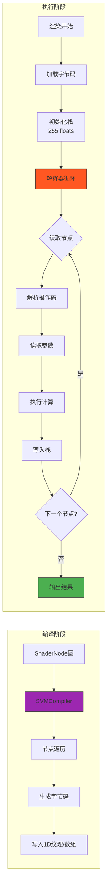
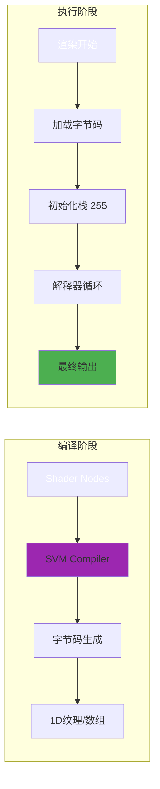
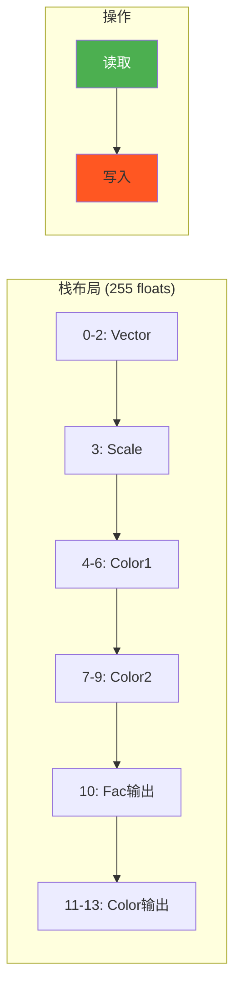
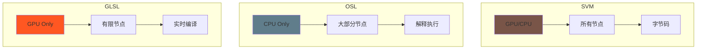

# SVM Architecture and Overview - Shader Virtual Machine in Cycles

## 目录
- [1. 概述](#概述)
- [2. SVM是什么](#svm是什么)
  - [2.1. 核心概念](#核心概念)
  - [2.2. 为什么要使用SVM](#为什么要使用svm)
- [3. SVM文件结构](#svm文件结构)
  - [3.1. 核心头文件](#核心头文件)
  - [3.2. 节点实现文件](#节点实现文件)
- [4. 纹理节点到SVM的映射](#纹理节点到svm的映射)
  - [4.1. 9个纹理节点的SVM对应关系](#9个纹理节点的svm对应关系)
- [5. 编译过程](#编译过程)
  - [5.1. ShaderNode到SVM字节码](#shadernode到svm字节码)
  - [5.2. SVMCompiler工作流程](#svmcompiler工作流程)
- [6. 执行模型](#执行模型)
  - [6.1. SVM解释器循环](#svm解释器循环)
  - [6.2. 栈管理](#栈管理)
- [7. 关键文件分析](#关键文件分析)
  - [7.1. svm.h - 主解释器](#svmh---主解释器)
  - [7.2. types.h - 类型定义](#typesh---类型定义)
  - [7.3. util.h - 辅助函数](#utilh---辅助函数)
- [8. 与BLI_noise的集成](#与bli_noise的集成)
- [9. 纹理节点完整流程](#纹理节点完整流程)
- [10. SVM vs OSL vs GLSL对比](#svm-vs-osl-vs-glsl对比)

---

<a name="概述"></a>
## 1. 概述

<span style="background-color:#E91E63;color:white;font-weight:bold">Shader Virtual Machine (SVM)</span> 是Cycles渲染器的<span style="background-color:#673AB7;color:white;font-weight:bold">着色器虚拟机</span>。它是一种在渲染时将节点图编译为字节码，然后在GPU/CPU上高效执行的机制。

**核心特点:**
- <span style="background-color:#2196F3;color:white">节点图 → 字节码 → 解释执行</span>
- 固定大小的栈 (255个float)
- 每个节点操作栈上的数据
- 支持多平台（CPU/GPU）

### SVM执行流程图




### 1.1 SVM 执行流程



### 2.1 栈管理机制



### 3.1 节点分发流程

```mermaid
graph TD
    Loop[<span style="background-color:#FF5722;color:white">While循环</span>] --> Read[<span style="background-color:#2196F3;color:white">读取int4节点</span>]
    Read --> Switch{<span style="background-color:#9C27B0;color:white">switch(node.x)</span>}
    
    Switch -->|NODE_TEX_CHECKER| Checker[<span style="background-color:#4CAF50;color:white">svm_node_tex_checker</span>]
    Switch -->|NODE_TEX_NOISE| Noise[<span style="background-color:#E91E63;color:white">svm_node_tex_noise</span>]
    Switch -->|NODE_TEX_VORONOI| Voronoi[<span style="background-color:#FF9800;color:white">svm_node_tex_voronoi</span>]
    Switch -->|NODE_END| End[<span style="background-color:#00BCD4;color:white">返回</span>]
    
    Checker --> Loop
    Noise --> Loop
    Voronoi --> Loop

    style Loop fill:#FF5722,color:white
    style End fill:#00BCD4,color:white
```

### 4.1 SVM vs OSL vs GLSL



---

<a name="svm是什么"></a>
## 2. SVM是什么

<a name="核心概念"></a>
### 2.1. 核心概念

从 `intern/cycles/kernel/svm/svm.h` 的注释:

```cpp
/* Shader Virtual Machine
 *
 * A shader is a list of nodes to be executed. These are simply read one after
 * the other and executed, using an node counter. Each node and its associated
 * data is encoded as one or more uint4's in a 1D texture. If the data is larger
 * than an uint4, the node can increase the node counter to compensate for this.
 * Floats are encoded as int and then converted to float again.
 *
 * Nodes write their output into a stack. All stack data in the stack is
 * floats, since it's all factors, colors and vectors. The stack will be stored
* in local memory on the GPU, as it would take too many register and indexes in
* ways not known at compile time.
*/
```

**SVM的工作原理:**
1. 将着色器节点列表编码为`int4`数组
2. 每个`int4`是一个节点，包含操作码和参数
3. 解释器读取节点并执行
4. 使用栈作为临时数据存储
5. 输出写入栈位置

<a name="为什么要使用svm"></a>
### 2.2. 为什么要使用SVM

**问题:**
- GPU上无法使用动态内存分配
- 节点数量和连接关系在编译时不确定
- 需要支持数百种不同节点类型

**解决方案:**
- 静态编译为固定长度的操作码序列
- 统一的栈机器模型
- 节点可以读取并扩展栈

---

<a name="svm文件结构"></a>
## 3. SVM文件结构

<a name="核心头文件"></a>
### 3.1. 核心头文件

```
intern/cycles/kernel/svm/
├── svm.h              # 主解释器循环和节点分发
├── types.h            # 节点类型枚举和栈常量
├── util.h             # 栈操作辅助函数
├── color_util.h       # 颜色转换工具
└── math_util.h        # 数学工具
```

<a name="节点实现文件"></a>
### 3.2. 节点实现文件

```
intern/cycles/kernel/svm/
├── checker.h          # 棋盘格纹理
├── voronoi.h          # Voronoi纹理
├── noisetex.h         # Noise纹理（噪声核心算法）
├── fractal_noise.h    # 分形噪声
├── gabor.h            # Gabor噪声
├── wave.h             # 波浪纹理
├── magic.h            # 魔术纹理
├── brick.h            # 砖墙纹理
├── gradient.h         # 渐变纹理
├── image.h            # 图像纹理
└── ... (共约40个文件)
```

**每个纹理节点包含:**
- SVM节点处理函数：`svm_node_tex_*`
- 内核计算函数：`svm_checker`, `voronoi_f1`等
- 栈操作和参数解包

---

<a name="纹理节点到svm的映射"></a>
## 4. 纹理节点到SVM的映射

<a name="9个纹理节点的svm对应关系"></a>
### 4.1. 9个纹理节点的SVM对应关系

| **Blender节点** | **SVM节点类型** | **SVM实现文件** | **核心函数** | **编译函数位置** |
|----------------|----------------|----------------|-------------|------------------|
| Noise Texture | `NODE_TEX_NOISE` | `noisetex.h` | `svm_node_tex_noise()` | `shader_nodes.cpp:1209` |
| Voronoi Texture | `NODE_TEX_VORONOI` | `voronoi.h` | `svm_node_tex_voronoi()` | `shader_nodes.cpp:1403` |
| Checker Texture | `NODE_TEX_CHECKER` | `checker.h` | `svm_node_tex_checker()` | `shader_nodes.cpp:1760` |
| Gabor Texture | `NODE_TEX_GABOR` | `gabor.h` | `svm_node_tex_gabor()` | `shader_nodes.cpp:1291` |
| Wave Texture | `NODE_TEX_WAVE` | `wave.h` | `svm_node_tex_wave()` | `shader_nodes.cpp:763` |
| Magic Texture | `NODE_TEX_MAGIC` | `magic.h` | `svm_node_tex_magic()` | `shader_nodes.cpp:686` |
| Brick Texture | `NODE_TEX_BRICK` | `brick.h` | `svm_node_tex_brick()` | `shader_nodes.cpp:1836` |
| Gradient Texture | `NODE_TEX_GRADIENT` | `gradient.h` | `svm_node_tex_gradient()` | `shader_nodes.cpp:565` |
| White Noise | `NODE_TEX_WHITE_NOISE` | `white_noise.h` | `svm_node_tex_white_noise()` | `shader_nodes.cpp:637` |

---

<a name="编译过程"></a>
## 5. 编译过程

<a name="shadernode到svm字节码"></a>
### 5.1. ShaderNode到SVM字节码

以 **Checker Texture** 为例:

```cpp
// 文件: intern/cycles/kernel/svm/checker.h

// 1. 核心函数
ccl_device float svm_checker(float3 p)
{
  const int xi = abs(float_to_int(floorf(p.x)));
  const int yi = abs(float_to_int(floorf(p.y)));
  const int zi = abs(float_to_int(floorf(p.z)));
  return ((xi % 2 == yi % 2) == (zi % 2)) ? 1.0f : 0.0f;
}

// 2. SVM节点处理函数
ccl_device_noinline void svm_node_tex_checker(ccl_private float *stack, const uint4 node)
{
  // 解包栈偏移量
  uint co_offset, color1_offset, color2_offset, scale_offset;
  uint color_offset, fac_offset;
  svm_unpack_node_uchar4(node.y, &co_offset, &color1_offset, &color2_offset, &scale_offset);
  svm_unpack_node_uchar2(node.z, &color_offset, &fac_offset);

  // 从栈加载输入
  const float3 co = stack_load_float3(stack, co_offset);
  const float3 color1 = stack_load_float3(stack, color1_offset);
  const float3 color2 = stack_load_float3(stack, color2_offset);
  const float scale = stack_load_float_default(stack, scale_offset, node.w);

  // 计算
  const float f = svm_checker(co * scale);

  // 写入栈
  if (stack_valid(color_offset)) {
    stack_store_float3(stack, color_offset, (f == 1.0f) ? color1 : color2);
  }
  if (stack_valid(fac_offset)) {
    stack_store_float(stack, fac_offset, f);
  }
}
```

**编译时转换 (`shader_nodes.cpp:1748`):**

```cpp
void CheckerTextureNode::compile(SVMCompiler &compiler)
{
  ShaderInput *vector_in = input("Vector");
  ShaderInput *color1_in = input("Color1");
  ShaderInput *color2_in = input("Color2");
  ShaderInput *scale_in = input("Scale");

  ShaderOutput *color_out = output("Color");
  ShaderOutput *fac_out = output("Fac");

  // 1. 处理纹理映射
  const int vector_offset = tex_mapping.compile_begin(compiler, vector_in);

  // 2. 添加SVM节点
  compiler.add_node(NODE_TEX_CHECKER,
                    compiler.encode_uchar4(vector_offset,
                                           compiler.stack_assign(color1_in),
                                           compiler.stack_assign(color2_in),
                                           compiler.stack_assign_if_linked(scale_in)),
                    compiler.encode_uchar4(compiler.stack_assign_if_linked(color_out),
                                           compiler.stack_assign_if_linked(fac_out)),
                    __float_as_int(scale));

  // 3. 完成纹理映射
  tex_mapping.compile_end(compiler, vector_in, vector_offset);
}
```

**输出的SVM字节码 (int4数组):**

```
// SVM节点: NODE_TEX_CHECKER
int4 nodes[] = {
  // 节点头
  { NODE_TEX_CHECKER,
    encode_uchar4(vector_offset, color1_offset, color2_offset, scale_offset),
    encode_uchar4(color_offset, fac_offset),
    __float_as_int(1.0)  // 默认scale
  }
};
```

<a name="svmcompiler工作流程"></a>
### 5.2. SVMCompiler工作流程

从 `intern/cycles/scene/svm.h`:

```
SVMCompiler.compile()
  ├─ 编译类型 (surface/bump/volume/displacement)
  ├─ generate_multi_closure() - 处理多闭包
  ├─ generate_svm_nodes() - 生成SVM节点
  │   ├─ find_dependencies() - 查找依赖
  │   ├─ generate_node() - 为每个节点生成SVM
  │   └─ stack_assign() - 栈分配
  └─ 输出: int4[] svm_nodes
```

**栈分配原理:**

```cpp
// 栈大小: SVM_STACK_SIZE = 255 (在types.h:13)
// 栈无效标记: SVM_STACK_INVALID = 255

int SVMCompiler::stack_assign(ShaderOutput *output)
{
  if (is_linked(output)) {
    // 为输出分配栈空间
    int offset = stack_find_offset(output->type);
    return offset;
  }
  return SVM_STACK_INVALID;
}
```

---

<a name="执行模型"></a>
## 6. 执行模型

<a name="svm解释器循环"></a>
### 6.1. SVM解释器循环

**主解释器**位于 `intern/cycles/kernel/svm/svm.h:98-490`:

```cpp
template<uint node_feature_mask, ShaderType type, typename ConstIntegratorGenericState>
ccl_device void svm_eval_nodes(KernelGlobals kg,
                               ConstIntegratorGenericState state,
                               ccl_private ShaderData *sd,
                               ccl_global float *render_buffer,
                               const uint32_t path_flag)
{
  float stack[SVM_STACK_SIZE];  // 255个float的栈

  // 起始偏移量从shader ID中提取
  int offset = sd->shader & SHADER_MASK;

  while (true) {
    // 读取当前节点
    uint4 node = read_node(kg, &offset);

    // 节点类型分发
    switch (node.x) {
      SVM_CASE(NODE_END)
        return;  // 结束

      SVM_CASE(NODE_TEX_CHECKER)
        svm_node_tex_checker(stack, node);
        break;

      SVM_CASE(NODE_TEX_NOISE)
        offset = svm_node_tex_noise(kg, stack,
                                   node.y, node.z, node.w, offset);
        break;

      SVM_CASE(NODE_TEX_VORONOI)
        offset = svm_node_tex_voronoi<node_feature_mask>(kg, stack,
                                                        node.y, node.z, node.w, offset);
        break;

      // ... 50+其他节点类型

      default:
        kernel_assert(!"Unknown node type");
        return;
    }
  }
}
```

**执行流程:**
1. **读取节点**: `read_node(kg, &offset)` 从1D纹理/数组获取`int4`
2. **解码**: `node.x`是操作码, `node.y/z/w`是参数
3. **执行**: 调用对应节点的处理函数
4. **更新偏移**: 大节点增加`offset`跳过额外数据
5. **循环**: 直到`NODE_END`

<a name="栈管理"></a>
### 6.2. 栈管理

**栈操作函数** (`util.h`):

```cpp
// 加载3个float (颜色/向量)
ccl_device_inline float3 stack_load_float3(const ccl_private float *stack, const uint a)
{
  kernel_assert(a + 2 < SVM_STACK_SIZE);
  const ccl_private float *stack_a = stack + a;
  return make_float3(stack_a[0], stack_a[1], stack_a[2]);
}

// 保存3个float
ccl_device_inline void stack_store_float3(ccl_private float *stack, const uint a, const float3 f)
{
  kernel_assert(a + 2 < SVM_STACK_SIZE);
  copy_v3_v3(stack + a, f);
}

// 加载单个float
ccl_device_inline float stack_load_float(const ccl_private float *stack, const uint a)
{
  kernel_assert(a < SVM_STACK_SIZE);
  return stack[a];
}
```

**栈分配示例:**

```
编译器栈状态 (255空位):
[0-2]: vector      (3 floats)
[3]:   scale       (1 float)
[4-6]: color1      (3 floats)
[7-9]: color2      (3 floats)
[10]:  fac输出     (1 float)
[11-13]: color输出 (3 floats)
```

---

<a name="关键文件分析"></a>
## 7. 关键文件分析

<a name="svmh---主解释器"></a>
### 7.1. svm.h - 主解释器

**位置**: `intern/cycles/kernel/svm/svm.h`

**核心组件:**
1. **节点枚举** - 通过宏包含 `node_types_template.h`
2. **`svm_eval_nodes()`** - 主循环模板函数
3. **`SVM_CASE()`** - 节点分发宏，支持条件编译

**代码示例 (关键部分):**

```cpp
// 包含所有节点头文件
#include "kernel/svm/checker.h"
#include "kernel/svm/voronoi.h"
#include "kernel/svm/noisetex.h"
// ... 约40个其他文件

// 主解释器循环
template<uint node_feature_mask, ShaderType type, typename ConstIntegratorGenericState>
ccl_device void svm_eval_nodes(KernelGlobals kg,
                               /* ... params ... */)
{
  float stack[SVM_STACK_SIZE];  // 核心栈

  while (true) {
    uint4 node = read_node(kg, &offset);  // 读取节点

    switch (node.x) {  // 分发到具体节点
      SVM_CASE(NODE_END) return;
      SVM_CASE(NODE_TEX_CHECKER) svm_node_tex_checker(stack, node); break;
      SVM_CASE(NODE_TEX_VORONOI) svm_node_tex_voronoi(...); break;
      // ...
    }
  }
}
```

<a name="typesh---类型定义"></a>
### 7.2. types.h - 类型定义

**位置**: `intern/cycles/kernel/svm/types.h`

**核心内容:**

1. **栈常量**:
```cpp
#define SVM_STACK_SIZE 255
#define SVM_STACK_INVALID 255
```

2. **节点类型枚举** (通过宏生成):
```cpp
enum ShaderNodeType {
#define SHADER_NODE_TYPE(name) name,
#include "node_types_template.h"
  NODE_NUM
};
```

3. **配置枚举**:
```cpp
enum NodeNoiseType {
  NODE_NOISE_MULTIFRACTAL,
  NODE_NOISE_FBM,
  NODE_NOISE_HYBRID_MULTIFRACTAL,
  // ...
};

enum NodeVoronoiFeature {
  NODE_VORONOI_F1,
  NODE_VORONOI_F2,
  NODE_VORONOI_SMOOTH_F1,
  NODE_VORONOI_DISTANCE_TO_EDGE,
  NODE_VORONOI_N_SPHERE_RADIUS
};

enum NodeVoronoiDistanceMetric {
  NODE_VORONOI_EUCLIDEAN,
  NODE_VORONOI_MANHATTAN,
  NODE_VORONOI_CHEBYCHEV,
  NODE_VORONOI_MINKOWSKI
};
```

**文件大小**: 531行，包含所有节点相关的类型定义

<a name="utilh---辅助函数"></a>
### 7.3. util.h - 辅助函数

**位置**: `intern/cycles/kernel/svm/util.h`

**重要辅助函数:**

```cpp
// 1. 栈加载/存储
ccl_device_inline float3 stack_load_float3(const ccl_private float *stack, const uint a);
ccl_device_inline void stack_store_float3(ccl_private float *stack, const uint a, const float3 f);
ccl_device_inline float stack_load_float(const ccl_private float *stack, const uint a);

// 2. 默认值处理
ccl_device_inline float stack_load_float_default(const ccl_private float *stack, const uint a, const uint value)
{
  return (a == (uint)SVM_STACK_INVALID) ? __uint_as_float(value) : stack_load_float(stack, a);
}

// 3. 节点数据读取
ccl_device_inline uint4 read_node(KernelGlobals kg, int *offset)
{
  // 从1D纹理或数组读取下一个节点
}

// 4. 参数解包
ccl_device_inline void svm_unpack_node_uchar4(uint packed, uint *a, uint *b, uint *c, uint *d)
{
  *a = (packed >> 0) & 0xFF;
  *b = (packed >> 8) & 0xFF;
  *c = (packed >> 16) & 0xFF;
  *d = (packed >> 24) & 0xFF;
}
```

---

<a name="与bli_noise的集成"></a>
## 8. 与BLI_noise的集成

SVM噪声使用专门的噪声库，但**不直接调用BLI_noise**。它在Cycles内部有独立实现:

**噪声算法位置**:

```
intern/cycles/kernel/svm/noisetex.h  ← SVM噪声纹理
intern/cycles/kernel/svm/fractal_noise.h ← 分形噪声算法
intern/cycles/util/util_hash.h       ← 哈希函数
```

**噪声实现层次**:

```cpp
// 最底层: hash函数 (util_hash.h)
ccl_device_inline uint hash_uint(uint k)
{
  k ^= k >> 16;
  k *= 0x85ebca6b;
  k ^= k >> 13;
  k *= 0xc2b2ae35;
  k ^= k >> 16;
  return k;
}

// 中间层: Perlin噪声 (noisetex.h)
ccl_device_noinline_cpu float perlin_2d(const float x, const float y)
{
  int X, Y;
  float fx = floorfrac(x, &X);
  float fy = floorfrac(y, &Y);
  // ...
  return bi_mix(grad2(hash_uint2(X, Y), fx, fy),
                grad2(hash_uint2(X+1, Y), fx-1, fy),
                grad2(hash_uint2(X, Y+1), fx, fy-1),
                grad2(hash_uint2(X+1, Y+1), fx-1, fy-1),
                u, v);
}

// 顶层: 噪声纹理 (noisetex.h)
ccl_device void noise_texture_2d(const float2 co, /* params */, ccl_private float *value, ccl_private float3 *color)
{
  float2 p = co;
  if (distortion != 0.0f) {
    p += make_float2(snoise_2d(p + random_float2_offset(0.0f)) * distortion,
                     snoise_2d(p + random_float2_offset(1.0f)) * distortion);
  }
  *value = noise_select(p, detail, roughness, lacunarity, offset, gain, type, normalize);
  // ...
}
```

**与BLI_noise的区别:**
- BLI_noise: 用于Blender内部通用噪声
- Cycles SVM噪声: 专门优化用于GPU渲染，支持SSE/AVX向量化
- 没有种子参数，使用坐标偏移模拟种子

---

<a name="纹理节点完整流程"></a>
## 9. 纹理节点完整流程

以 **Voronoi Texture** 为完整案例:

### 9.1 Blender UI → 节点图

用户在Blender中创建Voronoi节点:
```python
# 伪代码
node = bpy.data.materials['Material'].node_tree.nodes.new('ShaderNodeTexVoronoi')
node.feature = 'F1'
node.distance = 'EUCLIDEAN'
node.inputs['Scale'].default_value = 5.0
```

### 9.2 节点图 → SVMCompiler

**节点定义** (`shader_nodes.cpp:1287-1342`):

```cpp
NODE_DEFINE(VoronoiTextureNode)
{
  NodeType *type = NodeType::add("voronoi_texture", create, NodeType::SHADER);

  TEXTURE_MAPPING_DEFINE(VoronoiTextureNode);

  static NodeEnum feature_enum;
  feature_enum.insert("F1", NODE_VORONOI_F1);
  feature_enum.insert("F2", NODE_VORONOI_F2);
  // ...
  SOCKET_ENUM(feature, "Feature", feature_enum, NODE_VORONOI_F1);

  static NodeEnum metric_enum;
  metric_enum.insert("Euclidean", NODE_VORONOI_EUCLIDEAN);
  metric_enum.insert("Manhattan", NODE_VORONOI_MANHATTAN);
  // ...
  SOCKET_ENUM(metric, "Distance", metric_enum, NODE_VORONOI_EUCLIDEAN);

  SOCKET_IN_POINT(vector, "Vector", zero_float3(), SocketType::LINK_TEXTURE_GENERATED);
  SOCKET_IN_FLOAT(w, "W", 0.0f);
  SOCKET_IN_FLOAT(scale, "Scale", 5.0f);
  SOCKET_IN_FLOAT(detail, "Detail", 2.0f);
  SOCKET_IN_FLOAT(roughness, "Roughness", 0.5f);
  // ... more inputs

  SOCKET_OUT_FLOAT(distance, "Distance");
  SOCKET_OUT_COLOR(color, "Color");
  SOCKET_OUT_POINT(position, "Position");
  // ... more outputs

  return type;
}
```

**编译函数** (`shader_nodes.cpp:1370-1422`):

```cpp
void VoronoiTextureNode::compile(SVMCompiler &compiler)
{
  // 1. 获取所有输入/输出插座
  ShaderInput *vector_in = input("Vector");
  ShaderInput *scale_in = input("Scale");
  // ...

  // 2. 分配栈空间
  const int vector_stack_offset = tex_mapping.compile_begin(compiler, vector_in);
  const int scale_stack_offset = compiler.stack_assign_if_linked(scale_in);
  // ...

  // 3. 添加3个SVM节点
  // 第1个节点: 操作码和标志位
  compiler.add_node(NODE_TEX_VORONOI, dimensions, feature, metric);

  // 第2个节点: 栈偏移量 (4个uchar打包)
  compiler.add_node(
      compiler.encode_uchar4(vector_stack_offset, w_in_stack_offset,
                             scale_stack_offset, detail_stack_offset),
      compiler.encode_uchar4(roughness_stack_offset, lacunarity_stack_offset,
                             smoothness_stack_offset, exponent_stack_offset),
      compiler.encode_uchar4(randomness_stack_offset, use_normalize,
                             distance_stack_offset, color_stack_offset),
      compiler.encode_uchar4(position_stack_offset, w_out_stack_offset, radius_stack_offset));

  // 第3-4节点: 默认值 (float编码为int)
  compiler.add_node(__float_as_int(w), __float_as_int(scale),
                    __float_as_int(detail), __float_as_int(roughness));
  compiler.add_node(__float_as_int(lacunarity), __float_as_int(smoothness),
                    __float_as_int(exponent), __float_as_int(randomness));

  // 4. 应用纹理映射
  tex_mapping.compile_end(compiler, vector_in, vector_stack_offset);
}
```

**输出的SVM节点** (CPU端):
```
nodes[0] = { NODE_TEX_VORONOI, dimensions=3, feature=F1, metric=EUCLIDEAN }
nodes[1] = { encode(vect_off, w_off, scale_off, detail_off),
             encode(rough_off, lac_off, smooth_off, exp_off),
             encode(rand_off, norm, dist_off, color_off),
             encode(pos_off, w_out_off, radius_off) }
nodes[2] = { __float_as_int(0.0), __float_as_int(5.0), __float_as_int(2.0), __float_as_int(0.5) }
nodes[3] = { __float_as_int(2.0), __float_as_int(0.5), __float_as_int(2.0), __float_as_int(1.0) }
```

### 9.3 GPU执行

**设备端`svm_eval_nodes`调用**:

```cpp
// 在GPU上每个像素/采样执行

// 1. 读取Voronoi节点块
uint4 node1 = read_node(kg, &offset);  // { NODE_TEX_VORONOI, 3, 0, 0 }
uint4 node2 = read_node(kg, &offset);  // 栈偏移量
uint4 node3 = read_node(kg, &offset);  // 默认值1
uint4 node4 = read_node(kg, &offset);  // 默认值2

// 2. 调用Voronoi处理函数
offset = svm_node_tex_voronoi<node_feature_mask>(
    kg, stack, node1.y, node1.z, node1.z, offset);

// 3. svm_node_tex_voronoi内部:
//    a. 从栈读取: vector, scale, detail, roughness...
//    b. 调用噪声函数: fractal_voronoi_x_fx()
//    c. 写入输出栈: distance, color, position

// 4. 转换到下个节点
// offset现在指向Voronoi节点之后
```

**Voronoi计算执行** (`voronoi.h:939-991`):

```cpp
template<typename T>
ccl_device VoronoiOutput fractal_voronoi_x_fx(const ccl_private VoronoiParams ¶ms, const T coord)
{
  float amplitude = 1.0f;
  float max_amplitude = 0.0f;
  float scale = 1.0f;

  VoronoiOutput output;

  for (int i = 0; i <= ceilf(params.detail); ++i) {
    // 选择F1/F2/SmoothF1
    VoronoiOutput octave = (params.feature == NODE_VORONOI_F2) ?
        voronoi_f2(params, coord * scale) :
        (params.feature == NODE_VORONOI_SMOOTH_F1) ?
            voronoi_smooth_f1(params, coord * scale) :
            voronoi_f1(params, coord * scale);

    // 分形混合
    max_amplitude += amplitude;
    output.distance += octave.distance * amplitude;
    output.color += octave.color * amplitude;

    scale *= params.lacunarity;
    amplitude *= params.roughness;
  }

  // 归一化
  if (params.normalize) {
    output.distance /= max_amplitude * params.max_distance;
    output.color /= max_amplitude;
  }

  return output;
}

// F1算法 (voronoi.h:103-128)
ccl_device VoronoiOutput voronoi_f1(const ccl_private VoronoiParams ¶ms, const float2 coord)
{
  const float2 cellPosition_f = floor(coord);
  const float2 localPosition = coord - cellPosition_f;
  const int2 cellPosition = make_int2(cellPosition_f);

  float minDistance = FLT_MAX;
  int2 targetOffset = make_int2(0);
  float2 targetPosition = make_float2(0.0f, 0.0f);

  // 检查3x3邻域
  for (int j = -1; j <= 1; j++) {
    for (int i = -1; i <= 1; i++) {
      const int2 cellOffset = make_int2(i, j);
      const float2 pointPosition = make_float2(cellOffset) +
                                   hash_int2_to_float2(cellPosition + cellOffset) *
                                   params.randomness;
      const float distanceToPoint = voronoi_distance_bound(pointPosition, localPosition, params);
      if (distanceToPoint < minDistance) {
        targetOffset = cellOffset;
        minDistance = distanceToPoint;
        targetPosition = pointPosition;
      }
    }
  }

  VoronoiOutput octave;
  octave.distance = voronoi_distance(targetPosition, localPosition, params);
  octave.color = hash_int2_to_float3(cellPosition + targetOffset);
  octave.position = voronoi_position(targetPosition + cellPosition_f);
  return octave;
}
```

---

<a name="svm-vs-osl-vs-glsl对比"></a>
## 10. SVM vs OSL vs GLSL对比

| **特性** | <span style="background-color:#795548;color:white">SVM</span> | **OSL** | **GLSL** |
|---------|---------|---------|----------|
| **执行环境** | GPU/CPU | CPU-only | GPU-only |
| **节点支持** | 所有节点 | 大部分节点 | 受限节点 |
| **速度** | Fast (GPU) | Medium | Very Fast |
| **灵活性** | High | Very High | Medium |
| **栈大小** | 255 floats | 动态 | 寄存器 |
| **编译时机** | 渲染时 | 渲染前 | 实时 |
| **硬件** | CUDA, OptiX, HIP | CPU only | OpenGL, Vulkan |
| **主要用途** | 生产渲染 | 电影合成 | 实时预览 |

### 节点实现差异

```cpp
// Noise Texture - 三种实现对比

// 1. SVM (GPU/CPU) - 内联计算
ccl_device void svm_node_tex_noise(...) {
  noise_texture_3d(vector, detail, roughness, ...);
}

// 2. OSL (CPU) - 调用OSL标准库
// OSL代码中:
//   float n = noise("perlin", vector * scale);
// 编译为OSL字节码

// 3. GLSL (GPU) - 内置函数
// GLSL代码中:
//   float n = noise(vector * scale);
```

### 性能对比

**SVM优势:**
- ✅ GPU加速
- ✅ 所有节点支持
- ✅ 生产级质量

**OSL优势:**
- ✅ 精确可控
- ✅ 可扩展性
- ⚠️ 仅限CPU

**GLSL优势:**
- ✅ 实时预览
- ⚠️ 节点有限
- ⚠️ 质量较低

---

## 总结

SVM (Shader Virtual Machine) 是Cycles渲染器的核心组件，负责将节点图编译为高效的字节码并在GPU/CPU上执行。它的主要特点是：

1. **静态编译**: 节点图 → int4数组
2. **栈机器**: 255 float固定栈
3. **统一架构**: 支持所有平台
4. **高性能**: GPU优化，向量化
5. **模块化**: 每个节点独立实现

通过本文档，你应该理解了:
- SVM是什么以及为什么需要它
- 如何从 Blender UI 到最终渲染
- 9个纹理节点如何映射到SVM
- 编译和执行的完整流程
- 关键源文件的作用和关系

**参考文件:**
- `intern/cycles/kernel/svm/svm.h` - 主解释器
- `intern/cycles/kernel/svm/types.h` - 类型定义
- `intern/cycles/kernel/svm/util.h` - 栈操作
- `intern/cycles/kernel/svm/noisetex.h` - 噪声实现
- `intern/cycles/kernel/svm/voronoi.h` - Voronoi实现
- `intern/cycles/kernel/svm/checker.h` - 棋盘格实现
- `intern/cycles/scene/svm.h` - 编译器接口
- `intern/cycles/scene/shader_nodes.cpp` - 节点编译函数
