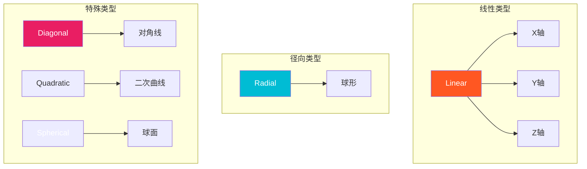
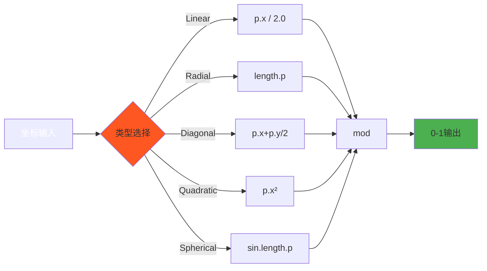
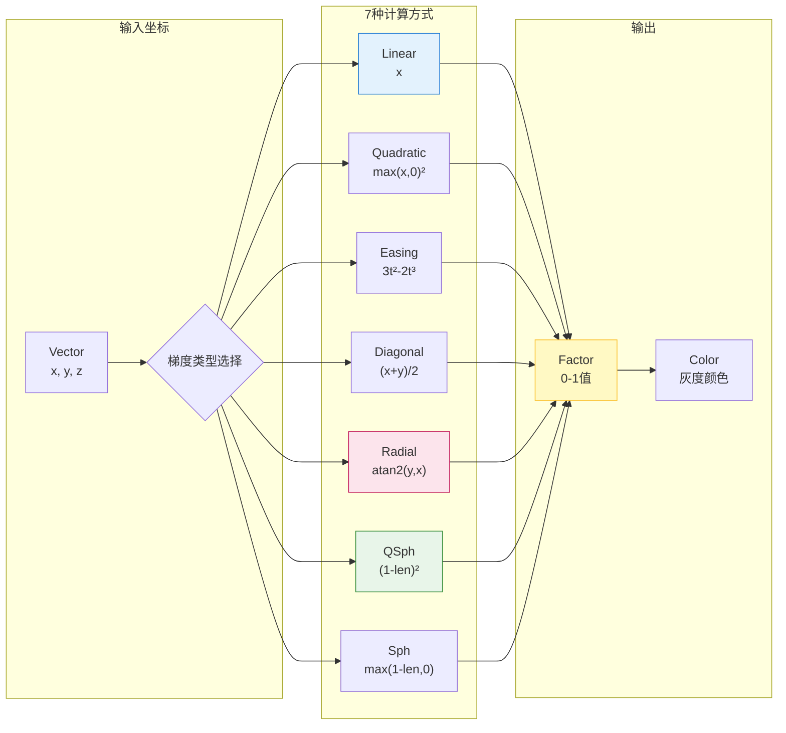

# Blender Gradient Texture Node - 实现深度分析

## 目录
- [1. 概述](#概述)
- [2. 核心数据结构与枚举定义](#2-核心数据结构与枚举定义)
  - [2.1 NodeTexGradient 结构体](#21-nodetexgradient-结构体)
  - [2.2 梯度类型枚举](#22-梯度类型枚举)
- [3. 七种梯度类型的数学原理](#3-七种梯度类型的数学原理)
  - [3.1 Linear (线性)](#31-linear-线性)
  - [3.2 Quadratic (二次方)](#32-quadratic-二次方)
  - [3.3 Easing (缓动)](#33-easing-缓动)
  - [3.4 Diagonal (对角线)](#34-diagonal-对角线)
  - [3.5 Radial (径向)](#35-radial-径向)
  - [3.6 Quadratic Sphere (二次球体)](#36-quadratic-sphere-二次球体)
  - [3.7 Spherical (球体)](#37-spherical-球体)
- [4. C++ 着色器节点实现分析](#4-c-着色器节点实现分析)
  - [4.1 节点声明与输入输出](#41-节点声明与输入输出)
  - [4.2 GPU 着色器链接](#42-gpu-着色器链接)
  - [4.3 MultiFunction 计算系统](#43-multifunction-计算系统)
- [5. GPU GLSL 着色器实现](#5-gpu-glsl-着色器实现)
  - [5.1 核心计算函数](#51-核心计算函数)
  - [5.2 着色器链接与常量传递](#52-着色器链接与常量传递)
- [6. Cycles OSL 着色器实现](#6-cycles-osl-着色器实现)
  - [6.1 OSL 函数结构](#61-osl-函数结构)
  - [6.2 映射支持](#62-映射支持)
- [7. 三种实现对比分析](#7-三种实现对比分析)
  - [7.1 MultiFunction (Eevee/视口实时计算)](#71-multifunction-eevee视口实时计算)
  - [7.2 GLSL (GPU 渲染管线)](#72-gpu-gpu-渲染管线)
  - [7.3 OSL (Cycles CPU 渲染)](#73-osl-cycles-cpu-渲染)
- [8. 关键实现细节与边界处理](#8-关键实现细节与边界处理)
  - [8.1 数值精度与单位向量处理](#81-数值精度与单位向量处理)
  - [8.2 钳制与取值范围](#82-钳制与取值范围)
- [9. 代码位置索引](#9-代码位置索引)
- [10. 与 Blender 内部系统的集成](#10-与-blender-内部系统的集成)
  - [10.1 纹理坐标系统](#101-纹理坐标系统)
  - [10.2 材质映射系统](#102-材质映射系统)

---

## 1. 概述

<span style="background-color:#4CAF50;color:white;font-weight:bold">梯度纹理节点 (Gradient Texture)</span> 是 Blender 着色器编辑器中的核心节点，用于生成基于空间位置的平滑颜色过渡。该节点在 <span style="background-color:#2196F3;color:white;font-weight:bold">所有渲染引擎</span> 中得到支持，包括：
- <span style="background-color:#FF9800;color:white">Eevee</span> (实时渲染)
- <span style="background-color:#9C27B0;color:white">Cycles</span> (路径追踪)
- <span style="background-color:#607D8B;color:white">Workbench</span> (工作台渲染)

### 7种渐变类型可视化



### 数学公式流程图



---
- <span style="background-color:#009688;color:white">MaterialX</span> (跨平台材质标准)

梯度纹理节点的主要特征：
- **7 种不同的梯度类型**，满足从简单线性到复杂径向着色需求
- **基于位置的计算**，从输入 Vector 坐标读取数据

### 7种梯度类型可视化



---
- **双输出**：Factor (Fac) 和 Color (灰度输出)
- **内部坐标映射支持**，可通过纹理坐标节点变换

---

## 2. 核心数据结构与枚举定义

### 2.1 NodeTexGradient 结构体

**定义位置**: `E:\blender-git\blender\source\blender\makesdna\DNA_node_types.h:1519-1523`

```cpp
typedef struct NodeTexGradient {
  NodeTexBase base;     // 继承自基础纹理节点，包含缩放/偏移/映射参数
  int gradient_type;    // 梯度类型枚举值 (0-6)
  char _pad[4];         // 内存对齐填充
} NodeTexGradient;
```

**Python 等价结构**:
```python
class NodeTexGradient:
    base: NodeTexBase  # 包含: scale, offset, mapping_type 等
    gradient_type: int  # 对应 enum 值
```

**字段说明**:
- `NodeTexBase base`: 包含所有纹理节点的通用属性
  - `tex_mapping`: 位置偏移、缩放和旋转
  - `color_mapping`: RGB 曲线和斩波器
- `gradient_type`: 核心枚举，决定使用哪种数学公式
- `_pad[4]`: C 结构体填充，确保 8 字节对齐

### 2.2 梯度类型枚举

**定义位置**: `E:\blender-git\blender\source\blender\makesdna\DNA_node_types.h:2684-2693`

```cpp
enum {
  SHD_BLEND_LINEAR = 0,           // 线性
  SHD_BLEND_QUADRATIC = 1,        // 二次方
  SHD_BLEND_EASING = 2,           // 缓动
  SHD_BLEND_DIAGONAL = 3,         // 对角线
  SHD_BLEND_RADIAL = 4,           // 径向
  SHD_BLEND_QUADRATIC_SPHERE = 5, // 二次球体
  SHD_BLEND_SPHERICAL = 6,        // 球体
};
```

---

## 3. 七种梯度类型的数学原理

### 3.1 Linear (线性)

**数学公式**:
$$f(x, y, z) = clamp(x, 0.0, 1.0)$$

**C++ 实现**:
```cpp
case SHD_BLEND_LINEAR:
  mask.foreach_index([&](const int64_t i) {
    fac[i] = math::clamp(vector[i].x, 0.0f, 1.0f);
  });
  break;
```

**Visual Behavior**:
- 从左 (x=0, 黑色) 到右 (x=1, 白色) 的平滑过渡
- 只使用 X 轴坐标
- Y/Z 轴完全被忽略

**应用场景**: UV 展开、水平方向的混合

### 3.2 Quadratic (二次方)

**数学公式**:
$$f(x, y, z) = clamp(max(x, 0)^2, 0.0, 1.0)$$

**C++ 实现**:
```cpp
case SHD_BLEND_QUADRATIC:
  mask.foreach_index([&](const int64_t i) {
    const float r = std::max(vector[i].x, 0.0f);
    fac[i] = math::clamp(r * r, 0.0f, 1.0f);
  });
  break;
```

**Visual Behavior**:
- 从左到右加速变亮（指数增长）
- x < 0 时强制为 0（停止）
- 曲率比 Ease In 更缓

**应用场景**: 光线衰减模拟、速度变化

### 3.3 Easing (缓动)

**数学公式**:
$$r = clamp(x, 0, 1)$$
$$t = r^2$$
$$f = (3.0 \times t - 2.0 \times t \times r)$$

**C++ 实现**:
```cpp
case SHD_BLEND_EASING:
  mask.foreach_index([&](const int64_t i) {
    const float r = std::min(std::max(vector[i].x, 0.0f), 1.0f);
    const float t = r * r;
    fac[i] = (3.0f * t - 2.0f * t * r);
  });
  break;
```

**Visual Behavior**:
- **S 形曲线**: 缓入 (ease-in) + 缓出 (ease-out)
- 数学本质是 **三次贝塞尔曲线** 模拟
- 在 0 和 1 处导数为 0，过渡极其平滑

**应用场景**: UI 动画、自然的物体运动、淡入淡出

### 3.4 Diagonal (对角线)

**数学公式**:
$$f(x, y, z) = clamp(\frac{x + y}{2}, 0.0, 1.0)$$

**C++ 实现**:
```cpp
case SHD_BLEND_DIAGONAL:
  mask.foreach_index([&](const int64_t i) {
    fac[i] = (vector[i].x + vector[i].y) * 0.5f;
    fac[i] = math::clamp(fac[i], 0.0f, 1.0f);
  });
  break;
```

**Visual Behavior**:
- 沿 `(1, 1)` 方向渐变（左下到右上）
- 使用 X 和 Y 的平均值
- 等值线垂直于对角线方向

**应用场景**: 对角线混色、斜角着色

### 3.5 Radial (径向)

**数学公式**:
$$f(x, y) = \frac{atan2(y, x)}{2\pi} + 0.5$$

**C++ 实现**:
```cpp
case SHD_BLEND_RADIAL:
  mask.foreach_index([&](const int64_t i) {
    fac[i] = atan2f(vector[i].y, vector[i].x) / (M_PI * 2.0f) + 0.5f;
  });
  break;
```

**Visual Behavior**:
- 从中心开始的 360° 渐变
- `atan2` 返回弧度，范围 `[−π, π]`
- 映射到 `[0, 1]` 后形成完整循环
- 下方 (y 正) 扇区最亮，上方 (y 负) 最暗

**应用场景**: 星系、漩涡、八卦形状、时钟渐变

### 3.6 Quadratic Sphere (二次球体)

**数学公式**:
$$d = \sqrt{x^2 + y^2 + z^2}$$
$$r = max(0.999999 - d, 0)$$
$$f = r^2$$

**C++ 实现**:
```cpp
case SHD_BLEND_QUADRATIC_SPHERE:
  mask.foreach_index([&](const int64_t i) {
    const float r = std::max(0.999999f - math::length(vector[i]), 0.0f);
    fac[i] = r * r;
  });
  break;
```

**Visual Behavior**:
- 球形径向渐变（中心最亮，外部最暗）
- 使用 **0.999999 偏置** 避免浮点精度导致的计算错误
- 二次方增大中心的亮度比重

**应用场景**: 球体光照、室内灯光、聚光灯

### 3.7 Spherical (球体)

**数学公式**:
$$d = \sqrt{x^2 + y^2 + z^2}$$
$$f = max(0.999999 - d, 0)$$

**C++ 实现**:
```cpp
case SHD_BLEND_SPHERICAL:
  mask.foreach_index([&](const int64_t i) {
    const float r = std::max(0.999999f - math::length(vector[i]), 0.0f);
    fac[i] = r;
  });
  break;
```

**Visual Behavior**:
- 与 Quadratic Sphere 唯一的区别是 **没有平方**
- 线性衰减，中心白，外部黑
- 距离单位向量时归零

**应用场景**: 球体体积光、雾密度、大气散射

---

## 4. C++ 着色器节点实现分析

### 4.1 节点声明与输入输出

**定义位置**: `E:\blender-git\blender\source\blender\nodes\shader\nodes\node_shader_tex_gradient.cc:20-27`

```cpp
static void sh_node_tex_gradient_declare(NodeDeclarationBuilder &b)
{
  b.is_function_node();
  b.add_input<decl::Vector>("Vector")
    .hide_value()              // 隐藏默认值，强制使用隐式字段
    .implicit_field(NODE_DEFAULT_INPUT_POSITION_FIELD);  // 默认连接到位置
  b.add_output<decl::Color>("Color").no_muted_links();
  b.add_output<decl::Float>("Factor", "Fac").no_muted_links();
}
```

**Python 使用示例**:
```python
# 创建节点
grad = tree.nodes.new('ShaderNodeTexGradient')

# 输入：默认自动连接到物体位置
# 不需要手动连接，如未连接则使用物体位置

# 输出
fac = grad.outputs['Factor'].default_value
color = grad.outputs['Color'].default_value
```

**隐式字段解释**:
`NODE_DEFAULT_INPUT_POSITION_FIELD` 是 Blender 节点系统的一个标识符，表示：
- 如果 Vector 输入未连接，自动使用 **物体的位置数据**
- 对应 Python: `bpy.data.objects['Cube'].location`

### 4.2 GPU 着色器链接

**定义位置**: `E:\blender-git\blender\source\blender\nodes\shader\nodes\node_shader_tex_gradient.cc:44-56`

```cpp
static int node_shader_gpu_tex_gradient(GPUMaterial *mat,
                                        bNode *node,
                                        bNodeExecData *execdata,
                                        GPUNodeStack *in,
                                        GPUNodeStack *out)
{
  node_shader_gpu_default_tex_coord(mat, node, &in[0].link);
  node_shader_gpu_tex_mapping(mat, node, in, out);

  NodeTexGradient *tex = (NodeTexGradient *)node->storage;
  float gradient_type = tex->gradient_type;

  // 链接到 GLSL shader
  return GPU_stack_link(mat, node, "node_tex_gradient", in, out,
                        GPU_constant(&gradient_type));
}
```

**函数调用流程**:
1. `node_shader_gpu_default_tex_coord`: 处理隐式坐标
2. `node_shader_gpu_tex_mapping`: 应用缩放/偏移 (从 NodeTexBase)
3. 提取 `gradient_type` 并转换为 float
4. GPU_stack_link: 将数据传递到 GPU 着色器

**Python 等价逻辑**:
```python
def get_gradient_factor(vector, gradient_type):
    # 应用纹理映射
    vector = apply_texture_mapping(vector, node.base.tex_mapping)

    # 根据类型计算
    if gradient_type == 0:  # Linear
        return clamp(vector.x)
    elif gradient_type == 1:  # Quadratic
        r = max(vector.x, 0.0)
        return clamp(r * r)
    # ... 其他类型
```

### 4.3 MultiFunction 计算系统

**定义位置**: `E:\blender-git\blender\source\blender\nodes\shader\nodes\node_shader_tex_gradient.cc:58-152`

#### 4.3.1 MultiFunction 概述
Blender 使用 **MultiFunction** 系统来加速节点计算，这类似于：
- Python 的 `vectorized` 计算
- NumPy 的 数组操作
- GPU 的 SIMD 指令

#### 4.3.2 GradientFunction 类结构

```cpp
class GradientFunction : public mf::MultiFunction {
 private:
  int gradient_type_;  // 缓存梯度类型

 public:
  GradientFunction(int gradient_type) : gradient_type_(gradient_type) {
    // 定义输入输出签名
    static const mf::Signature signature = []() {
      mf::Signature signature;
      mf::SignatureBuilder builder{"GradientFunction", signature};
      builder.single_input<float3>("Vector");              // 输入：3D向量
      builder.single_output<ColorGeometry4f>("Color",      // 输出：颜色
                                             mf::ParamFlag::SupportsUnusedOutput);
      builder.single_output<float>("Fac");                 // 输出：因子
      return signature;
    }();
    this->set_signature(&signature);
  }
};
```

#### 4.3.3 call 方法的核心实现

**定义位置**: `e:\blender-git\blender\source\blender\nodes\shader\nodes\node_shader_tex_gradient.cc:76-144`

```cpp
void call(const IndexMask &mask, mf::Params params, mf::Context context) const override
{
  // 1. 获取输入数据（延迟读取，惰性计算）
  const VArray<float3> &vector =
    params.readonly_single_input<float3>(0, "Vector");

  // 2. 获取输出缓冲区
  MutableSpan<ColorGeometry4f> r_color =
    params.uninitialized_single_output_if_required<ColorGeometry4f>(1, "Color");
  MutableSpan<float> fac =
    params.uninitialized_single_output<float>(2, "Fac");

  const bool compute_color = !r_color.is_empty();

  // 3. 批量计算（按梯度类型分派）
  switch (gradient_type_) {
    case SHD_BLEND_LINEAR: {
      mask.foreach_index([&](const int64_t i) {
        fac[i] = math::clamp(vector[i].x, 0.0f, 1.0f);
      });
      break;
    }
    case SHD_BLEND_QUADRATIC: {
      mask.foreach_index([&](const int64_t i) {
        const float r = std::max(vector[i].x, 0.0f);
        fac[i] = math::clamp(r * r, 0.0f, 1.0f);
      });
      break;
    }
    // ... 其他情况
  }

  // 4. 生成颜色输出 (Factor → Grayscale Color)
  if (compute_color) {
    mask.foreach_index([&](const int64_t i) {
      r_color[i] = ColorGeometry4f(fac[i], fac[i], fac[i], 1.0f);
    });
  }
}
```

**设计优势**:
- **批量处理**: `mask.foreach_index` 处理整个数组，避免循环开销
- **惰性计算**: 只在需要时才计算 Color 输出
- **多态支持**: 一个类处理所有 7 种类型

---

## 5. GPU GLSL 着色器实现

### 5.1 核心计算函数

**文件位置**: `E:\blender-git\blender\source\blender\gpu\shaders\material\gpu_shader_material_tex_gradient.glsl`

#### 5.1.1 calc_gradient 函数

```glsl
float calc_gradient(float3 p, int gradient_type)
{
  float x, y, z;
  x = p.x;
  y = p.y;
  z = p.z;

  if (gradient_type == 0) { /* linear */
    return x;
  }
  else if (gradient_type == 1) { /* quadratic */
    float r = max(x, 0.0f);
    return r * r;
  }
  else if (gradient_type == 2) { /* easing */
    float r = min(max(x, 0.0f), 1.0f);
    float t = r * r;
    return (3.0f * t - 2.0f * t * r);
  }
  else if (gradient_type == 3) { /* diagonal */
    return (x + y) * 0.5f;
  }
  else if (gradient_type == 4) { /* radial */
    return atan(y, x) / (M_PI * 2) + 0.5f;
  }
  else {
    // 球体类：使用距离计算
    float r = max(0.999999f - sqrt(x * x + y * y + z * z), 0.0f);
    if (gradient_type == 5) { /* quadratic sphere */
      return r * r;
    }
    else if (gradient_type == 6) { /* sphere */
      return r;
    }
  }
  return 0.0f;
}
```

#### 5.1.2 主着色器函数

```glsl
void node_tex_gradient(float3 co, float gradient_type, out float4 color, out float fac)
{
  float f = calc_gradient(co, int(gradient_type));
  f = clamp(f, 0.0f, 1.0f);  // 确保范围正确

  color = float4(f, f, f, 1.0f);
  fac = f;
}
```

**GLSL 注意事项**:
- 使用 `atan(y, x)` 而非 GLSL 标准的 `atan(x, y)`，这与 C++ 一致
- 所有浮点常量后缀 `f` 表示 float 类型
- 没有 `std::` 前缀，使用 GLSL 内置函数

### 5.2 着色器链接与常量传递

**回看**: `node_shader_gpu_tex_gradient` 函数

```cpp
float gradient_type = tex->gradient_type;
return GPU_stack_link(mat, node, "node_tex_gradient", in, out,
                      GPU_constant(&gradient_type));
```

**GPU_constant()**:
- 源码位置: 着色器管理器
- 作用: 将 C++ float 值转换为 GLSL uniform 常量
- GPU 优化片段着色器时，该值会被内联优化

---

## 6. Cycles OSL 着色器实现

### 6.1 OSL 函数结构

**文件位置**: `E:\blender-git\blender\intern\cycles\kernel\osl\shaders\node_gradient_texture.osl`

#### 6.1.1 gradient 计算函数

```osl
float gradient(point p, string type)
{
  float x, y, z;

  x = p[0];  // OSL 使用数组索引访问分量
  y = p[1];
  z = p[2];

  float result = 0.0;

  if (type == "linear") {
    result = x;
  }
  else if (type == "quadratic") {
    float r = max(x, 0.0);
    result = r * r;
  }
  else if (type == "easing") {
    float r = min(max(x, 0.0), 1.0);
    float t = r * r;
    result = (3.0 * t - 2.0 * t * r);
  }
  else if (type == "diagonal") {
    result = (x + y) * 0.5;
  }
  else if (type == "radial") {
    result = atan2(y, x) / M_2PI + 0.5;
  }
  else {
    float r = max(1.0 - sqrt(x * x + y * y + z * z), 0.0);

    if (type == "quadratic_sphere")
      result = r * r;
    else if (type == "spherical")
      result = r;
  }

  return clamp(result, 0.0, 1.0);
}
```

**OSL 特性**:
- 无 `#include`，标准库函数直接可用
- `M_2PI` = `2 * π` 的宏定义
- 使用字符串类型判断，而非整数枚举
- 数组访问：`p[0]`, `p[1]`, `p[2]`

#### 6.1.2 主 shader 声明

```osl
shader node_gradient_texture(
    int use_mapping = 0,
    matrix mapping = matrix(0, 0, 0, 0, 0, 0, 0, 0, 0, 0, 0, 0, 0, 0, 0, 0),
    string gradient_type = "linear",
    point Vector = P,
    output float Fac = 0.0,
    output color Color = 0.0)
{
  point p = Vector;

  if (use_mapping)
    p = transform(mapping, p);

  Fac = gradient(p, gradient_type);
  Color = color(Fac, Fac, Fac);
}
```

### 6.2 映射支持

OSL 实现额外支持：
- `use_mapping`: 是否应用变换矩阵
- `mapping`: 4×4 变换矩阵
- `Vector`: 默认使用全局变量 `P` (着色点位置)

**映射转换**:
```osl
if (use_mapping)
  p = transform(mapping, p);
```

这对应 C++ 中的 `node_shader_gpu_tex_mapping` 函数调用。

---

## 7. 三种实现对比分析

### 7.1 MultiFunction (Eevee/视口实时计算)

**特点**:
| 特性 | 实现 |
|------|------|
| **执行位置** | CPU，Blender 内部 |
| **主要用途** | 节点预览、编辑器实时反馈、视口渲染 |
| **数据并行** | 基于 `IndexMask` 的批量处理 |
| **内存布局** | AoS (Array of Structures) |
| **优势** | 无需 GPU 上下文切换，调试友好 |

**代码路径**:
```
编辑器操作 → Node Tree 更新 → GradientFunction::call → CPU 计算
```

### 7.2 GPU GLSL (Eevee/Workbench)

**特点**:
| 特性 | 实现 |
|------|------|
| **执行位置** | GPU，片段/顶点着色器 |
| **主要用途** | 实时渲染 |
| **数据并行** | GPU 硬件 SIMD |
| **内存布局** | SoA (Structure of Arrays) 在 uniform 中 |
| **优势** | 极高速度，直接渲染管线 |

**代码路径**:
```
渲染帧 → GPU 材质构建 → GPU_stack_link → GLSL node_tex_gradient → 像素着色
```

### 7.3 OSL (Cycles CPU 渲染)

**特点**:
| 特性 | 实现 |
|------|------|
| **执行位置** | CPU，OSL 解释器/编译器 |
| **主要用途** | 路径追踪物理渲染 |
| **数据并行** | 每个采样点独立执行 |
| **内存布局** | 标量逐点计算 |
| **优势** | Cycles 优化、材质表达式编译 |

**代码路径**:
```
路径追踪 → 光线交点 → OSL shader 调用 → gradient() → 着色结果
```

### 7.4 共同优化技术

所有实现都采用了 **关键优化**：

1. **边界处理优化**:
   ```cpp
   const float r = std::max(0.999999f - math::length(vector[i]), 0.0f);
   ```
   - 避免浮点精度误差
   - 防止单位向量产生小而无效的值

2. **恒定折叠**:
   - `2.0f * M_PI` 在编译时计算
   - `clamp()` 在运行时内联

3. **短路返回**:
   - 球体类型在 `else` 块内判别
   - 避免重复计算 `length()`

---

## 8. 关键实现细节与边界处理

### 8.1 数值精度与单位向量处理

**问题场景**:
当输入向量长度为 1.0 时，期望输出 0，但由于浮点误差，`1.0 - 1.0` 可能是 `0.0000001`。

**解决方案 (所有实现)**:
```cpp
// 原始代码 (潜在问题)
r = max(1.0 - length(v), 0.0);

// 实际代码
r = max(0.999999 - length(v), 0.0);
```

**为何工作**:
- 任何 `length(v) >= 0.999999` 的值都被钳制到 0
- 微小误差被消除
- 视觉无差异

### 8.2 钳制与取值范围

**每个梯度类型都存在钳制步骤**:

```cpp
// MultiFunction
mask.foreach_index([&](const int64_t i) {
  fac[i] = math::clamp(value, 0.0f, 1.0f);
});

// GLSL
f = clamp(f, 0.0f, 1.0f);

// OSL
return clamp(result, 0.0, 1.0);
```

**为何必须钳制**:
1. 负坐标 (Linear 型 x < 0)
2. 超出范围 (Radial 型常量计算)
3. 安全保证：确保 Color 输出在 [0, 1] 内

---

## 9. 代码位置索引

### 9.1 核心定义

| 文件 | 功能 | 关键行 |
|------|------|--------|
| `DNA_node_types.h` | 结构体和枚举 | 1519-1523, 2684-2693 |
| `node_shader_tex_gradient.cc` | C++ 节点实现 | 全部 (223 行) |
| `gpu_shader_material_tex_gradient.glsl` | GPU 着色器 | 1-51 |
| `node_gradient_texture.osl` | OSL 着色器 | 1-66 |

### 9.2 MultiFunction 详细

| 代码位置 | 用途 |
|----------|------|
| `cc:58-74` | 类声明和签名定义 |
| `cc:76-144` | `call()` 方法，核心计算逻辑 |
| `cc:86-139` | switch 语句，7 种类型分派 |
| `cc:140-143` | 转换为颜色输出 |

### 9.3 GPU 链接详细

| 代码位置 | 用途 |
|----------|------|
| `cc:44-56` | `node_shader_gpu_tex_gradient()` |
| `glsl:44-51` | `node_tex_gradient()` 主入口 |
| `glsl:5-42` | `calc_gradient()` 核心函数 |

### 9.4 OSL 详细

| 代码位置 | 用途 |
|----------|------|
| `osl:9-48` | `gradient()` 函数 |
| `osl:50-66` | `shader node_gradient_texture()` 包装 |
| `osl:58-62` | 映射应用 |

---

## 10. 与 Blender 内部系统的集成

### 10.1 纹理坐标系统

**默认连接**:
```python
# 未连接 Vector 时
implicit_field -> NODE_DEFAULT_INPUT_POSITION_FIELD
               -> 转换为: 物体位置 (World Space)
```

**显式连接**:
```python
# 使用纹理坐标节点
tex_coord = tree.nodes.new('ShaderNodeTexCoord')
grad = tree.nodes.new('ShaderNodeTexGradient')

tree.links.new(tex_coord.outputs['Object'], grad.inputs['Vector'])
```

### 10.2 材质映射系统

每个梯度都继承自 `NodeTexBase`，支持:

```cpp
struct NodeTexBase {
  TexMapping tex_mapping;   // 位置变换
  ColorMapping color_mapping; // RGB 颜色曲线
};
```

**在 C++ 中的处理**:
```cpp
// 原始实现 (不带 Mapping)
fac[i] = math::clamp(vector[i].x, 0.0f, 1.0f);

// 带 Mapping 时 (GPU)
node_shader_gpu_tex_mapping(mat, node, in, out);  // 在链接前应用
```

**映射矩阵转换**:
```
输入 Vector → 纹理映射(缩放/偏移/旋转) → 着色器计算 → 输出
```

### 10.3 渲染引擎适配

| 引擎 | 实现 | 坐标空间 |
|------|------|----------|
| **Eevee** | GLSL | World (由 GPU 管线传递) |
| **Cycles** | OSL | World (P 变量) |
| **MaterialX** | C++ MaterialX |标准的 MaterialX 坐标 |
| **视口** | CPU MultiFunction | World (节点系统提供) |

### 10.4 Python API 对照

```python
import bpy

# 创建梯度纹理节点
tree = bpy.context.object.active_material.node_tree
grad = tree.nodes.new('ShaderNodeTexGradient')

# 设置类型 (整数值 0-6)
grad.gradient_type = 'LINEAR'  # 或 'QUADRATIC', 'RADIAL', ...

# 读取结果
fac = grad.outputs['Fac'].default_value  # float
color = grad.outputs['Color'].default_value  # RGBA tuple

# 自动链接位置
# 如果不连接 Vector，使用物体的位置
```

**类型映射**:
```python
"LINEAR": 0,
"QUADRATIC": 1,
"EASING": 2,
"DIAGONAL": 3,
"RADIAL": 4,
"QUADRATIC_SPHERE": 5,
"SPHERICAL": 6
```

---

**文档结束**

*本文档基于 Blender 源代码分析，涵盖 C++、GLSL、OSL 三种实现方式的深度技术细节。适用于理解节点逻辑、实现自定义节点或调试渲染问题。*