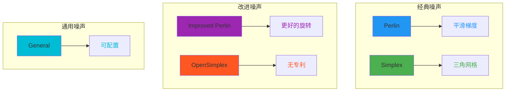
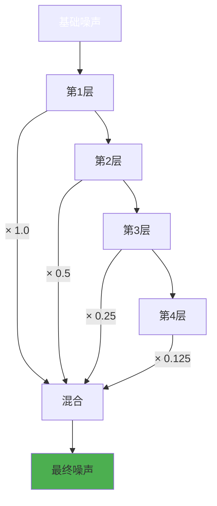

# Blender Noise Texture Node: Comprehensive Technical Analysis

## 目录
- [1. 引言](#1-引言)
- [2. 核心概念](#2-核心概念)
  - [2.1 噪声类型](#21-噪声类型)
  - [2.2 分形参数](#22-分形参数)
- [3. C++ 实现分析](#3-c-实现分析)
  - [3.1 节点声明与输入](#31-节点声明与输入)
  - [3.2 存储结构](#32-存储结构)
  - [3.3 动态 Socket 可见性](#33-动态-socket-可见性)
  - [3.4 GPU 着色器选择](#34-gpu-着色器选择)
  - [3.5 MultiFunction 多函数](#35-multifunction-多函数)
  - [3.6 核心 call 方法](#36-核心-call-方法)
- [4. GLSL 实现分析](#4-glsl-实现分析)
  - [4.1 宏驱动的设计](#41-宏驱动的设计)
  - [4.2 扭曲处理](#42-扭曲处理)
  - [4.3 颜色计算](#43-颜色计算)
  - [4.4 随机偏移函数](#44-随机偏移函数)
  - [4.5 20个着色器函数](#45-20个着色器函数)
- [5. OSL 实现分析](#5-osl-实现分析)
  - [5.1 NOISE_SELECT 宏](#51-noise_select-宏)
  - [5.2 基于字符串的类型选择](#52-基于字符串的类型选择)
  - [5.3 着色器入口](#53-着色器入口)
- [6. 五种噪声类型详解](#6-五种噪声类型详解)
  - [6.1 fBM (分形布朗运动)](#61-fbm-分形布朗运动)
  - [6.2 多重分形 (Multifractal)](#62-多重分形-multifractal)
  - [6.3 混合多重分形 (Hybrid Multifractal)](#63-混合多重分形-hybrid-multifractal)
  - [6.4 带状多重分形 (Ridged Multifractal)](#64-带状多重分形-ridged-multifractal)
  - [6.5 异质地形 (Hetero Terrain)](#65-异质地形-hetero-terrain)
- [7. 参数深度分析](#7-参数深度分析)
- [8. 维度处理](#8-维度处理)
- [9. 架构模式](#9-架构模式)
- [10. 关键抽象层](#10-关键抽象层)
- [11. 数值常量与范围](#11-数值常量与范围)
- [12. 变量命名约定](#12-变量命名约定)
- [13. Python 伪代码实现](#13-python-伪代码实现)

---

## 1. 引言

Blender 的 **Noise Texture** 节点是一个强大的程序化纹理生成工具，基于经典的 **Perlin 噪声** 算法。它提供了五种不同的分形噪声类型，支持 1D、2D、3D 和 4D 维度，广泛应用于材质创建、地形生成和程序化纹理设计。

该节点的实现跨越三个技术层：

### 5种噪声类型对比



### 分形噪声流程



---
- **C++**：节点逻辑、用户界面和数据流管理
- **GLSL**：GPU实时渲染的着色器代码
- **OSL**：CPU离线渲染的着色器代码（Cycles渲染器）

---

## 2. 核心概念

### 2.1 噪声类型

五种噪声类型对应不同的数学算法：

| 类型 | 英文名称 | 描述 |
|------|----------|------|
| <span style="color:#4A90E2">**fBM**</span> | Fractal Brownian Motion | 分形布朗运动，最基础的分形噪声 |
| <span style="color:#50C878">**Multifractal**</span> | Multi-fractal | 每个八度的振幅动态变化 |
| <span style="color:#FF6B6B">**Hybrid Multifractal**</span> | Hybrid Multi-fractal | fBM 与多重分形的混合 |
| <span style="color:#9B59B6">**Ridged Multifractal**</span> | Ridged Multi-fractal | 生成山脊状结构 |
| <span style="color:#FFA500">**Hetero Terrain**</span> | Heterogeneous Terrain | 不均匀地形生成 |

### 2.2 分形参数

所有噪声类型共享的核心参数：

- **Scale (缩放)**：基础噪声的频率倍数
- **Detail (细节)**：八度 (Octave) 数量，范围 0-15
- **Roughness (粗糙度)**：每层八度的振幅衰减系数
- **Lacunarity (隙度)**：每层八度的频率倍增系数
- **Distortion (扭曲)**：预处理的坐标偏移量

特殊参数：
- **Offset (偏移)**：用于 Ridged 和 Hetero 类型
- **Gain (增益)**：用于 Hybrid 和 Ridged 类型
- **Normalize (归一化)**：仅 fBM 类型的选项，将输出映射到 [0,1]

---

## 3. C++ 实现分析

### 3.1 节点声明与输入

**定义位置**: `E:\blender-git\blender\source\blender\nodes\shader\nodes\node_shader_tex_noise.cc:23-72`

```cpp
static void sh_node_tex_noise_declare(NodeDeclarationBuilder &b)
{
  b.is_function_node();
  b.add_input<decl::Vector>("Vector").implicit_field(NODE_DEFAULT_INPUT_POSITION_FIELD);
  b.add_input<decl::Float>("W").min(-1000.0f).max(1000.0f).make_available(/*...*/);
  /* Scale, Detail, Roughness, Lacunarity, Offset, Gain, Distortion */
  /* 输出: Fac (Float), Color */
}
```

所有输入参数：
- **Vector**: 默认使用物体空间位置（3D向量）
- **W**: 额外的第4维坐标，用于4D噪声
- **Scale**: 默认值 5.0，范围 [-1000, 1000]
- **Detail**: 默认值 2.0，范围 [0, 15]（实数）
- **Roughness**: 默认值 0.5，范围 [0, 1]（因子类型）
- **Lacunarity**: 默认值 2.0，范围 [0, 1000]
- **Offset**: 默认值 0.0，范围 [-1000, 1000]
- **Gain**: 默认值 1.0，范围 [0, 1000]
- **Distortion**: 默认值 0.0，范围 [-1000, 1000]

### 3.2 存储结构

**定义位置**: `E:\blender-git\blender\source\blender\nodes\shader\nodes\node_shader_tex_noise.cc:83-93`

```cpp
struct NodeTexNoise {
  /* 继承自 base */
  TexMapping base;

  int dimensions;  /* 1, 2, 3, 或 4 */
  int type;        /* 0-4 对应五种噪声类型 */
  bool normalize;  /* 归一化标志 */
};
```

在初始化时：
```cpp
tex->dimensions = 3;        /* 默认3D */
tex->type = SHD_NOISE_FBM;  /* 默认fBM */
tex->normalize = true;      /* 默认归一化 */
```

### 3.3 动态 Socket 可见性

**定义位置**: `E:\blender-git\blender\source\blender\nodes\shader\nodes\node_shader_tex_noise.cc:146-165`

函数 `node_shader_update_tex_noise()` 根据当前设置显示/隐藏所有输入框：

```cpp
/* 根据维度设置 Vector 可见性 */
bke::node_set_socket_availability(*ntree, *sockVector, storage.dimensions != 1);

/* W 在 1D 和 4D 时可见 */
bke::node_set_socket_availability(*ntree, *sockW,
  storage.dimensions == 1 || storage.dimensions == 4);

/* Offset 在 Multifractal 和 fBM 时隐藏 */
bke::node_set_socket_availability(*ntree, *inOffsetSock,
  storage.type != SHD_NOISE_MULTIFRACTAL && storage.type != SHD_NOISE_FBM);

/* Gain 仅在 Hybrid 和 Ridged 时可见 */
bke::node_set_socket_availability(*ntree, *inGainSock,
  storage.type == SHD_NOISE_HYBRID_MULTIFRACTAL ||
  storage.type == SHD_NOISE_RIDGED_MULTIFRACTAL);
```

### 3.4 GPU 着色器选择

**定义位置**: `E:\blender-git\blender\source\blender\nodes\shader\nodes\node_shader_tex_noise.cc:95-128`

`gpu_shader_get_name()` 函数实现了 **组合爆炸** 的设计模式：

```cpp
static const char *gpu_shader_get_name(const int dimensions, const int type)
{
  switch (type) {
    case SHD_NOISE_MULTIFRACTAL:
      return std::array{
        "node_noise_tex_multi_fractal_1d",  // dimensions-1 = 0
        "node_noise_tex_multi_fractal_2d",  // dimensions-1 = 1
        "node_noise_tex_multi_fractal_3d",  // dimensions-1 = 2
        "node_noise_tex_multi_fractal_4d"   // dimensions-1 = 3
      }[dimensions - 1];
    /* ... 其他4种类型类似 ... */
  }
}
```

**生成 20 个不同的着色器函数名**：
- 5 种噪声类型 × 4 种维度 = 20 个变体

### 3.5 MultiFunction 多函数

**定义位置**: `E:\blender-git\blender\source\blender\nodes\shader\nodes\node_shader_tex_noise.cc:167-426`

`NoiseFunction` 类实现了 Blender 的 **MultiFunction** 接口，用于节点图的数据流计算：

```cpp
class NoiseFunction : public mf::MultiFunction {
 private:
  int dimensions_;  /* 1-4 */
  int type_;        /* 0-4 */
  bool normalize_;  /* 归一化标志 */

 public:
  /* 注册20个函数签名 */
  static std::array<mf::Signature, 20> signatures;
};
```

**20个函数签名的索引计算**：
```cpp
this->set_signature(&signatures[dimensions + type * 4 - 1]);
```

示例：
- 3D + fBM (type=1) = `3 + 1*4 - 1 = 6`，对应 signatures[6]
- 1D + Ridged (type=3) = `1 + 3*4 - 1 = 12`，对应 signatures[12]

### 3.6 核心 call 方法

**定义位置**: `E:\blender-git\blender\source\blender\nodes\shader\nodes\node_shader_tex_noise.cc:242-417`

`call()` 方法根据维度选择计算路径：

```cpp
void call(const IndexMask &mask, mf::Params params, mf::Context /*context*/) const override
{
  /* 维度决定输入参数的读取方式 */
  switch (dimensions_) {
    case 1: {
      const VArray<float> &w = params.readonly_single_input<float>(0, "W");
      /* 计算 factor 和 color */

      mask.foreach_index([&](const int64_t i) {
        const float position = w[i] * scale[i];
        r_factor[i] = noise::perlin_fractal_distorted(
          position,
          math::clamp(detail[i], 0.0f, 15.0f),
          math::max(roughness[i], 0.0f),
          lacunarity[i],
          offset[i],
          gain[i],
          distortion[i],
          type_,        /* 噪声类型 */
          normalize_    /* 归一化标志 */
        );
      });
      break;
    }
    case 2: {
      const VArray<float3> &vector = params.readonly_single_input<float3>(0, "Vector");
      /* ... 类似计算，使用 float2(position) */
      break;
    }
    /* case 3, 4 类似 */
  }
}
```

**关键点**：
1. 所有维度都委托给 `noise::perlin_fractal_distorted()`
2. `detail` 被 clamp 到 [0, 15]
3. `roughness` 被确保 >= 0
4. 通过 `type_` 参数区分噪声类型

---

## 4. GLSL 实现分析

### 4.1 宏驱动的设计

**定义位置**: `E:\blender-git\blender\source\blender\gpu\shaders\material\gpu_shader_material_tex_noise.glsl:17-113`

核心是四个宏，每个对应一种维度：

```glsl
#define NOISE_FRACTAL_DISTORTED_1D(NOISE_TYPE) \
  if (distortion != 0.0f) { \
    p += snoise(p + random_float_offset(0.0f)) * distortion; \
  } \
  value = NOISE_TYPE(p, detail, roughness, lacunarity, offset, gain, normalize != 0.0f); \
  color = float4(value, \
                 NOISE_TYPE(p + random_float_offset(1.0f), detail, roughness, lacunarity, offset, gain, normalize != 0.0f), \
                 NOISE_TYPE(p + random_float_offset(2.0f), detail, roughness, lacunarity, offset, gain, normalize != 0.0f), \
                 1.0f);
```

**为什么使用宏？**
1. **代码复用**：相同的扭曲+噪声+颜色逻辑，只需提供噪声函数名
2. **性能优化**：GLSL 是编译时展开，无运行时开销
3. **可读性**：将重复逻辑抽象为模板

### 4.2 扭曲处理

**在宏中的处理**（以 2D 为例）：
```glsl
#define NOISE_FRACTAL_DISTORTED_2D(NOISE_TYPE) \
  if (distortion != 0.0f) { \
    p += float2(snoise(p + random_vec2_offset(0.0f)) * distortion, \
                snoise(p + random_vec2_offset(1.0f)) * distortion); \
  } \
  /* 后续使用扭曲后的 p */
```

**工作原理**：
1. 使用 `snoise()` 计算随机偏移
2. 偏移量通过 `random_vec2_offset(0.0f)` 生成（范围 [100, 200]）
3. 将噪声结果乘以 `distortion` 系数
4. 修改坐标 `p`，后续噪声基于扭曲坐标计算

### 4.3 颜色计算

```glsl
color = float4(value,           /* R 通道 - 基础噪声值 */
               NOISE_TYPE(p + random_vec2_offset(2.0f), ...),  /* G 通道 */
               NOISE_TYPE(p + random_vec2_offset(3.0f), ...),  /* B 通道 */
               1.0f);           /* A 通道 */
```

**原理**：
- 使用相同的噪声函数，但在偏移坐标上调用
- 每个通道使用不同的随机种子（2.0f, 3.0f）
- 产生纹理化的彩色输出，避免单一灰度

### 4.4 随机偏移函数

**定义位置**: `E:\blender-git\blender\source\blender\gpu\shaders\material\gpu_shader_material_tex_noise.glsl:115-139`

```glsl
float random_float_offset(float seed) {
  return 100.0f + hash_float_to_float(seed) * 100.0f;
  /* 结果范围: [100.0, 200.0] */
}

float2 random_vec2_offset(float seed) {
  return float2(
    100.0f + hash_vec2_to_float(float2(seed, 0.0f)) * 100.0f,
    100.0f + hash_vec2_to_float(float2(seed, 1.0f)) * 100.0f
  );
}
```

**为什么使用 [100, 200] 范围？**
- **避免精度问题**：不使用过小的值（<10）
- **避免溢出**：不使用过大的值（<1000）
- **可预测范围**：确保偏差不会破坏噪声函数的内部计算

### 4.5 20个着色器函数

通过组合 **5种噪声类型** × **4种维度** = **20个函数**。

**命名模式**：
```
node_noise_tex_<TYPE>_<DIM>d
  ↓          ↓        ↓
  fbm        1d
  multi_fractal   2d
  hetero_terrain  3d
  hybrid_multi_fractal  4d
  ridged_multi_fractal
```

**示例函数**（fBM, 3D）：
```glsl
void node_noise_tex_fbm_3d(float3 co, float w, float scale, /* ... */)
{
  detail = clamp(detail, 0.0f, 15.0f);
  roughness = max(roughness, 0.0f);

  float3 p = co * scale;  /* 应用缩放 */

  NOISE_FRACTAL_DISTORTED_3D(noise_fbm);  /* 应用宏 */
}
```

**GLSL 前置声明**（必须包含）：
```glsl
#include "gpu_shader_common_hash.glsl"
#include "gpu_shader_material_fractal_noise.glsl"  /* 定义 noise_fbm 等 */
#include "gpu_shader_material_noise.glsl"         /* 定义 snoise */
```

---

## 5. OSL 实现分析

### 5.1 NOISE_SELECT 宏

**定义位置**: `E:\blender-git\blender\intern\cycles\kernel\osl\shaders\node_noise_texture.osl:12-41`

```c
#define NOISE_SELECT(T) \
  float noise_select(T p, \
                     float detail, \
                     float roughness, \
                     float lacunarity, \
                     float offset, \
                     float gain, \
                     string type, \
                     int use_normalize) \
  { \
    if (type == "multifractal") { \
      return noise_multi_fractal(p, detail, roughness, lacunarity); \
    } \
    else if (type == "fBM") { \
      return noise_fbm(p, detail, roughness, lacunarity, use_normalize); \
    } \
    /* ... 其他3种类型 */ \
  }
```

**使用宏生成4个重载**：
```c
NOISE_SELECT(float)       /* 1D */
NOISE_SELECT(vector2)      /* 2D */
NOISE_SELECT(vector3)      /* 3D */
NOISE_SELECT(vector4)      /* 4D */
```

**为什么使用 C-style 宏而非函数？**
- **模板化**：为每个类型生成专门版本
- **性能**：编译时实例化，无虚函数开销
- **OSL 限制**：早期 OSL 不支持泛型函数

### 5.2 基于字符串的类型选择

OSL 使用 **字符串参数** 而非整数枚举：

```c
shader node_noise_texture(
    string dimensions = "3D",  /* "1D", "2D", "3D", "4D" */
    string type = "fBM",       /* "fBM", "multifractal", ... */
    /* ... */
)
{
  if (dimensions == "1D") {
    Fac = noise_texture(w, detail, /* ... */, type, use_normalize, Color);
  }
  else if (dimensions == "2D") {
    Fac = noise_texture(vector2(p[0], p[1]), /* ... */, type, use_normalize, Color);
  }
  /* ... */
}
```

**对比 GLSL/C++**：
- GLSL/C++：编译时确定（硬编码 20 个函数）
- OSL：运行时动态选择（字符串判断）

### 5.3 着色器入口

**定义位置**: `E:\blender-git\blender\intern\cycles\kernel\osl\shaders\node_noise_texture.osl:238-300`

完整参数列表：
```c
shader node_noise_texture(
    int use_mapping = 0,
    matrix mapping = matrix(0),
    string dimensions = "3D",
    string type = "fBM",
    int use_normalize = 1,
    vector3 Vector = vector3(0, 0, 0),
    float W = 0.0,
    float Scale = 5.0,
    float Detail = 2.0,
    float Roughness = 0.5,
    float Offset = 0.0,
    float Gain = 1.0,
    float Lacunarity = 2.0,
    float Distortion = 0.0,
    output float Fac = 0.0,
    output color Color = 0.0)
{
  /* 1. 应用映射（如果启用） */
  vector3 p = Vector;
  if (use_mapping)
    p = transform(mapping, p);

  /* 2. 参数预处理 */
  float detail = clamp(Detail, 0.0, 15.0);
  float roughness = max(Roughness, 0.0);

  /* 3. 应用缩放 */
  p *= Scale;
  float w = W * Scale;

  /* 4. 根据维度调用对应函数 */
  if (dimensions == "1D") {
    Fac = noise_texture(w, detail, roughness, Lacunarity, Offset, Gain,
                        Distortion, type, use_normalize, Color);
  }
  else if (dimensions == "2D") {
    Fac = noise_texture(vector2(p[0], p[1]), /* ... */);
  }
  /* ... 3D 和 4D */
}
```

**safe_snoise()**：OSL 的内置噪声函数，自动处理边界情况。

---

## 6. 五种噪声类型详解

### 6.1 fBM (分形布朗运动)

**GLSL 定义**: `E:\blender-git\blender\source\blender\gpu\shaders\material\gpu_shader_material_fractal_noise.glsl:8-41`

```glsl
#define NOISE_FBM(T) \
  float noise_fbm(T co, float detail, float roughness, float lacunarity, \
                  float offset, float gain, bool normalize) \
  { \
    T p = co; \
    float fscale = 1.0f; \
    float amp = 1.0f; \
    float maxamp = 0.0f; \
    float sum = 0.0f; \
    \
    for (int i = 0; i <= int(detail); i++) { \
      float t = snoise(fscale * p); \
      sum += t * amp; \
      maxamp += amp; \
      amp *= roughness; \
      fscale *= lacunarity; \
    } \
    \
    float rmd = detail - floor(detail);  /* 小数部分 */ \
    if (rmd != 0.0f) { \
      float t = snoise(fscale * p); \
      float sum2 = sum + t * amp; \
      return normalize ? \
        mix(0.5f * sum / maxamp + 0.5f, 0.5f * sum2 / (maxamp + amp) + 0.5f, rmd) : \
        mix(sum, sum2, rmd); \
    } \
    else { \
      return normalize ? 0.5f * sum / maxamp + 0.5f : sum; \
    } \
  }
```

**数学公式**：
$$
fBM(p) = \sum_{i=0}^{N} \text{roughness}^i \cdot \text{noise}(\text{lacunarity}^i \cdot p)
$$

**核心逻辑**：
1. **基础循环**：对每个八度计算噪声并累加
2. **振幅衰减**：`amp *= roughness`（默认 0.5）
3. **频率倍增**：`fscale *= lacunarity`（默认 2.0）
4. **小数八度**：平滑过渡（detail=2.3 表示 2 个完整八度 + 30% 的第3个）
5. **归一化**：`normalize=true` 时映射到 [0,1]

**伪代码** (Python)：
```python
def noise_fbm(position, detail, roughness, lacunarity, normalize):
    detail_int = int(detail)
    remainder = detail - detail_int

    fscale = 1.0
    amp = 1.0
    sum_val = 0.0
    max_amp = 0.0

    # 完整八度循环
    for i in range(detail_int + 1):
        t = snoise(fscale * position)
        sum_val += t * amp
        max_amp += amp
        amp *= roughness
        fscale *= lacunarity

    # 处理小数部分
    if remainder > 0:
        t = snoise(fscale * position)
        sum_with_remainder = sum_val + t * amp

        if normalize:
            without = 0.5 * sum_val / max_amp + 0.5
            with_remainder = 0.5 * sum_with_remainder / (max_amp + amp) + 0.5
            return mix(without, with_remainder, remainder)
        else:
            return mix(sum_val, sum_with_remainder, remainder)
    else:
        if normalize:
            return 0.5 * sum_val / max_amp + 0.5
        else:
            return sum_val
```

### 6.2 多重分形 (Multifractal)

**GLSL 定义**: `gpu_shader_material_fractal_noise.glsl:43-68`

```glsl
#define NOISE_MULTI_FRACTAL(T) \
  float noise_multi_fractal(T co, float detail, float roughness, \
                            float lacunarity, float offset, float gain, bool normalize) \
  { \
    T p = co; \
    float value = 1.0f; \
    float pwr = 1.0f; \
    \
    for (int i = 0; i <= int(detail); i++) { \
      value *= (pwr * snoise(p) + 1.0f); \
      pwr *= roughness; \
      p *= lacunarity; \
    } \
    \
    float rmd = detail - floor(detail); \
    if (rmd != 0.0f) { \
      value *= (rmd * pwr * snoise(p) + 1.0f); \
    } \
    return value; \
  }
```

**与 fBM 的关键区别**：
- fBM：**累加**噪声值 `sum += t * amp`
- Multifractal：**乘积** `value *= (noise + 1)`

**数学公式**：
$$
\text{Multifractal}(p) = \prod_{i=0}^{N} (1 + \text{roughness}^i \cdot \text{noise}(\text{lacunarity}^i \cdot p))
$$

**效果**：产生 **不均匀** 的噪声，某些区域更平滑，某些区域更粗糙。

### 6.3 混合多重分形 (Hybrid Multifractal)

**GLSL 定义**: `gpu_shader_material_fractal_noise.glsl:102-138`

```glsl
#define NOISE_HYBRID_MULTI_FRACTAL(T) \
  float noise_hybrid_multi_fractal(T co, /* ... */) \
  { \
    T p = co; \
    float pwr = 1.0f; \
    float value = 0.0f; \
    float weight = 1.0f; \
    \
    for (int i = 0; (weight > 0.001f) && (i <= int(detail)); i++) { \
      if (weight > 1.0f) weight = 1.0f; \
      \
      float signal = (snoise(p) + offset) * pwr; \
      pwr *= roughness; \
      value += weight * signal; \
      weight *= gain * signal; \
      p *= lacunarity; \
    } \
    /* ... 小数部分处理 ... */ \
    return value; \
  }
```

**关键机制**：
- **动态权重**：`weight` 根据前一八度的信号强度变化
- **早期终止**：如果 `weight < 0.001` 停止循环
- **偏移增强**：需要 `offset` 和 `gain` 参数

**数学特性**：
$$
\begin{aligned}
\text{signal}_i &= (\text{noise} + \text{offset}) \cdot \text{roughness}^i \\
\text{weight}_{i+1} &= \text{weight}_i \cdot \text{gain} \cdot \text{signal}_i \\
\text{sum} &= \sum \text{weight}_i \cdot \text{signal}_i
\end{aligned}
$$

**效果**：自适应的噪声，根据局部特征调整细节密度。

### 6.4 带状多重分形 (Ridged Multifractal)

**GLSL 定义**: `gpu_shader_material_fractal_noise.glsl:140-168`

```glsl
#define NOISE_RIDGED_MULTI_FRACTAL(T) \
  float noise_ridged_multi_fractal(T co, /* ... */) \
  { \
    T p = co; \
    float pwr = roughness; \
    \
    float signal = offset - abs(snoise(p));  /* 关键：绝对值 + offset */ \
    signal *= signal;  /* 平方，使其非负 */ \
    float value = signal; \
    float weight = 1.0f; \
    \
    for (int i = 1; i <= int(detail); i++) { \
      p *= lacunarity; \
      weight = clamp(signal * gain, 0.0f, 1.0f); \
      signal = offset - abs(snoise(p)); \
      signal *= signal; \
      signal *= weight; \
      value += signal * pwr; \
      pwr *= roughness; \
    } \
    return value; \
  }
```

**核心变换**：
$$
\text{Ridged}(x) = (\text{offset} - |\text{noise}(x)|)^2
$$

**参数作用**：
- `offset`：控制山脊的"峰值"高度（通常 > 1.0）
- `gain`：控制后续八度的权重衰减
- `offset` 值越大，山脊越尖锐

**效果**：生成 **山脉、脊线、裂缝** 类纹理。

### 6.5 异质地形 (Hetero Terrain)

**GLSL 定义**: `gpu_shader_material_fractal_noise.glsl:70-100`

```glsl
#define NOISE_HETERO_TERRAIN(T) \
  float noise_hetero_terrain(T co, /* ... */) \
  { \
    T p = co; \
    float pwr = roughness; \
    \
    float value = offset + snoise(p);  /* 初始高度 */ \
    p *= lacunarity; \
    \
    for (int i = 1; i <= int(detail); i++) { \
      float increment = (snoise(p) + offset) * pwr * value;  /* 增量 */ \
      value += increment;  /* 累加增量 */ \
      pwr *= roughness; \
      p *= lacunarity; \
    } \
    /* ... 小数部分 ... */ \
    return value; \
  }
```

**数学公式**：
$$
\begin{aligned}
v_0 &= \text{offset} + \text{noise}_0 \\
v_i &= v_{i-1} + (\text{noise}_i + \text{offset}) \cdot \text{roughness}^i \cdot v_{i-1} \\
&= v_{i-1} \cdot (1 + (\text{noise}_i + \text{offset}) \cdot \text{roughness}^i)
\end{aligned}
$$

**特点**：每个八度基于 **当前高度** 调整增量，产生 **不规则地形**。

---

## 7. 参数深度分析

### Scale (缩放)
**作用**：坐标乘数，控制噪声的 **基频**
- **增大**：噪声变小（缩小）
- **减小**：噪声变大（放大）
- **公式**：`position = vector * scale`

### Detail (细节)
**作用**：八度数量，控制 **细节层次**
- **范围**：0.0 - 15.0（实数）
- **示例**：
  - 1.0：1个完整八度
  - 2.5：2个完整八度 + 50% 第3个
- **计算**：`int(detail)` 和 `detail - floor(detail)`

### Roughness (粗糙度)
**作用**：每层八度的 **振幅衰减** 系数
- **默认**：0.5
- **公式**：`amp_i = amp_{i-1} * roughness`
- **影响**：
  - 0.0：后续八度无贡献
  - 1.0：所有八度振幅相同
  - 0.5：经典衰减（1 + 0.5 + 0.25 + ...）

### Lacunarity (隙度)
**作用**：每层八度的 **频率倍增** 系数
- **默认**：2.0
- **公式**：`freq_i = freq_{i-1} * lacunarity`
- **影响**：
  - 1.0：频率不变（无意义，所有层叠加相同）
  - 2.0：2倍频（默认，产生经典分形）
  - 4.0：4倍频（间隔更大）

### Offset (偏移) 和 Gain (增益)
**仅用于三种类型**：
- **Hybrid Multifractal**：`offset` 加到噪声上，`gain` 控制权重
- **Ridged Multifractal**：`offset` 是山脊峰值，`gain` 控制遮罩
- **Hetero Terrain**：`offset` 控制基础偏移

**示例（Ridged）**：
- `offset=1.0`：`1 - |noise|`，山脊在 0-1 之间
- `offset=3.0`：`3 - |noise|`，山脊更高更尖锐

### Distortion (扭曲)
**作用**：**预处理**坐标偏移
- **算法**：`p_new = p + distortion * snoise(p + seed)`
- **效果**：
  - 0.0：无扭曲（默认）
  - 0.5：轻微扰动
  - 2.0+：强烈失真，产生"熔岩"效果

### Normalize (归一化)
**仅 fBM 有效**：
- `true`：输出映射到 [0, 1]
- `false`：输出保持原始范围（可能负数）

---

## 8. 维度处理

### 1D 噪声
```python
position = w * scale  # 只使用 W 输入
# Vector 输入被隐藏
```

### 2D 噪声
```python
position = vector.xy * scale  # 使用 Vector 的 xy 分量
# W 输入被隐藏
```

### 3D 噪声
```python
position = vector.xyz * scale  # 使用全部 Vector
# W 输入被隐藏
```

### 4D 噪声
```python
position = float4(vector.x, vector.y, vector.z, w) * scale
# Vector 和 W 同时使用
```

**Socket 动态控制**（C++）：
```cpp
/* 仅显示必要的输入 */
if (dimensions == 1) {
  hide(Vector);
  show(W);
}
else if (dimensions == 2) {
  show(Vector);  /* 但只用 xy */
  hide(W);
}
else if (dimensions == 3) {
  show(Vector);  /* 全部使用 */
  hide(W);
}
else if (dimensions == 4) {
  show(Vector);  /* xyz 部分 */
  show(W);       /* w 部分 */
}
```

---

## 9. 架构模式

### 三层架构图

```mermaid
graph TB
    subgraph "用户界面层 (Python/C++)"
        UI[Noise Texture Node UI]
        Props[宿舍性面板<br>noise_type, noise_dimensions]
    end

    subgraph "C++ 核心层"
        NodeCC[node_shader_tex_noise.cc]

        subgraph "声明与UI"
            Declare[sh_node_tex_noise_declare]
            Update[node_shader_update_tex_noise]
            GPU_Fn[node_shader_gpu_tex_noise]
        end

        subgraph "数据处理"
            Storage[NodeTexNoise struct]
            MultiFn[NoiseFunction<br>MultiFunction接口]
            Call[call() 方法]
        end

        subgraph "着色器选择"
            GetName[gpu_shader_get_name]<br><span style="color:orange">20个变体</span>
            GPU_Link[GPU_stack_link]
        end
    end

    subgraph "GPU 渲染层 (GLSL)"
        GLSL_Macro[NOISE_FRACTAL_DISTORTED_XD 宏]
        GLSL_Func[20个函数<br>node_noise_tex_<type>_<dim>d]
        Helper[辅助文件<br>noise.glsl<br>fractal_noise.glsl]
    end

    subgraph "CPU 渲染层 (OSL)"
        OSL_Macro[NOISE_SELECT 宏<br>生成4个重载]
        OSL_Func[noise_texture 函数<br>4个维度]
        OSL_Type[字符串类型分发]
    end

    subgraph "底层算法库"
        BLI_Noise[BLI_noise.hh<br>noise::perlin_fractal_distorted]
        Snoise[Simplex Noise<br>基础噪声]
    end

    UI --> Props
    Props --> NodeCC

    NodeCC --> Declare
    NodeCC --> Update
    NodeCC --> GPU_Fn
    NodeCC --> Storage
    NodeCC --> MultiFn

    GPU_Fn --> GetName
    GPU_Fn --> GPU_Link
    GetName --> GLSL_Macro

    Storage --> MultiFn
    MultiFn --> Call
    Call --> BLI_Noise

    GLSL_Macro --> GLSL_Func
    GLSL_Func --> Helper

    OSL_Macro --> OSL_Func
    OSL_Func --> OSL_Type

    BLI_Noise --> Snoise

    style GLSL_Macro fill:#e1f5ff
    style OSL_Macro fill:#fff2e1
    style GetName fill:#ffe1e1
```

### 设计模式解析

1. **组合爆炸 (Combinatorial Explosion)**
   - 20个常数函数 vs 动态分发
   - 优势：编译时优化，运行时无分支

2. **委托模式 (Delegation)**
   - C++ → BLI_noise → 算法库
   - 各层专注特定职责

3. **宏模板 (Macro Template)**
   - GLSL/OSL 使用宏生成重复代码
   - 一处修改，所有维度生效

4. **多函数接口 (MultiFunction)**
   - Blender 数据流系统的标准接口
   - 支持向量化、并行计算

---

## 10. 关键抽象层

### BLI_noise.hh (C++ 后端库)

**核心函数**：
```cpp
namespace noise {
  // 单个噪声值
  float perlin_fractal_distorted(float position, ...);

  // 3个通道的颜色生成
  float3 perlin_float3_fractal_distorted(float position, ...);
}
```

**参数**：
```cpp
position,     // 坐标
detail,       // 详细度 0-15
roughness,    // 粗糙度 >0
lacunarity,   // 隙度 >0
offset,       // 某些类型用
gain,         // 某些类型用
distortion,   // 扭曲量
type,         // 0-4 枚举
normalize     // bool
```

### Simplex 噪声 (snoise)

**定义位置**: `gpu_shader_material_noise.glsl:262-330`

**特点**：
- Perlin 噪声的改进版本
- 计算更高效，梯度更自然
- Blender 使用 **自定义实现** 而非 Ken Perlin 的原版

**4D 版本**使用 32-顶点超立方体插值。

**归一化系数** (实验确定)：
```glsl
float noise_scale1(float result) { return 0.2500f * result; }  /* 1D */
float noise_scale2(float result) { return 0.6616f * result; }  /* 2D */
float noise_scale3(float result) { return 0.9820f * result; }  /* 3D */
float noise_scale4(float result) { return 0.8344f * result; }  /* 4D */
```

**紧重复** (Precision handling)：
```glsl
/* 避免浮点精度问题，每 100000.0 单位重复 */
p = compatible_mod(p, 100000.0f) + precision_correction;
```

### 颜色通道生成策略

**C++**:
```cpp
const float3 c = noise::perlin_float3_fractal_distorted(
    position, detail, roughness, lacunarity,
    offset, gain, distortion, type, normalize
);
r_color[i] = ColorGeometry4f(c[0], c[1], c[2], 1.0f);
```

**GLSL**:
```glsl
color = float4(
    value,                                  /* R - 基础 */
    NOISE_TYPE(p + random_vec*_offset(2), ...),  /* G - 偏移1 */
    NOISE_TYPE(p + random_vec*_offset(3), ...),  /* B - 偏移2 */
    1.0f
);
```

**OSL**:
```c
Color = color(value,
              noise_select(p + random_*_offset(1.0), ...),
              noise_select(p + random_*_offset(2.0), ...));
```

**共同点**：
- R 通道：主坐标噪声
- G 通道：主坐标 + 种子1
- B 通道：主坐标 + 种子2
- 都使用相同参数（detail, roughness 等）

---

## 11. 数值常量与范围

| 参数 | 类型 | 默认值 | 范围 | 备注 |
|------|------|--------|------|------|
| Scale | float | 5.0 | [-1000, 1000] | 负值 = 翻转 |
| Detail | float | 2.0 | [0, 15] | 实数，支持小数八度 |
| Roughness | float | 0.5 | [0, 1] | 制造因子类型 |
| Lacunarsity | float | 2.0 | [0, 1000] | 推荐值 1.5-4.0 |
| Offset | float | 0.0 | [-1000, 1000] | 类型特定 |
| Gain | float | 1.0 | [0, 1000] | 类型特定 |
| Distortion | float | 0.0 | [-1000, 1000] | 推荐值 <5 |
| Normalize | bool | true | - | 仅 fBM |

**严格限制**：
- `detail` 在 **C++/GLSL/OSL** 全部 clamp 到 [0, 15]
- `roughness` 在 **C++/GLSL** 确保 >= 0
- `Random offsets` 范围 [100, 200] 固定

**性能边界**：
- 最大 Detail=15，实际八度计算次数 = 15-16 次
- 每个像素最多：16 次噪声 × 3 通道 = 48 次 snoise() 调用

---

## 12. 变量命名约定

### C++ (node_shader_tex_noise.cc)
| 名称 | 类型 | 来源/含义 |
|------|------|-----------|
| `dimensions_` | `int` | 类成员，1-4 |
| `type_` | `int` | 类成员，0-4 枚举 |
| `normalize_` | `bool` | 类成员，归一化标志 |
| `mask` | `IndexMask` | Blender 数据流批处理 |
| `params` | `mf::Params` | MultiFunction 参数接口 |
| `r_factor` | `MutableSpan<float>` | 输出因子数组 |
| `r_color` | `MutableSpan<ColorGeometry4f>` | 输出颜色数组 |
| `param` | `int` | 动态参数索引计算器 |

**命名模式**：
- 类成员：`dimensions_`（下划线后缀）
- 局部变量：`position`，`vector`
- 输出：`r_factor`（r = result）
- 临时：`param`（计算虚拟索引）

### GLSL (gpu_shader_material_tex_noise.glsl)
| 名称 | 类型 | 含义 |
|------|------|------|
| `co` | `float3` | 坐标参数（未使用） |
| `w` | `float` | W 坐标 |
| `scale` | `float` | 缩放 |
| `detail` | `float` | 细节 |
| `p` | `float/2/3/4` | 计算后的位置 |
| `value` | `float` | Factor 输出 |
| `color` | `float4` | Color 输出 |
| `normalize` | `float` | 0.0 或 1.0 |

**注意**：GLSL 使用 `normalize` 而非 `normalize_`（无类成员）。

### OSL (node_noise_texture.osl)
| 名称 | 类型 | 含义 |
|------|------|------|
| `use_mapping` | `int` | 是否应用矩阵映射 |
| `dimensions` | `string` | "1D"/"2D"/"3D"/"4D" |
| `type` | `string` | "fBM"/"multifractal"/... |
| `Fac` | `float` | 输出因子 |
| `Color` | `color` | 输出颜色 |

**差异**：OSL 使用 **字符串** 而非 **整数** 进行类型选择。

### 导入的辅助文件
| 文件 | 作用 |
|------|------|
| `gpu_shader_common_hash.glsl` | 哈希函数，生成随机偏移 |
| `gpu_shader_material_noise.glsl` | 基础 snoise() 和 Perlin 噪声 |
| `gpu_shader_material_fractal_noise.glsl` | 5种噪声类型的宏定义 |
| `gpu_shader_math_vector_safe_lib.glsl` | 安全向量运算 |

---

## 13. Python 伪代码实现

为了理解复杂的 C++/GLSL 逻辑，以下是完整的 Python 风格伪代码，模拟 Blender 噪声纹理的全部功能：

```python
import math
from typing import Tuple

# ========== 基础噪声 (snoise) ==========
# GLSL gpu_shader_material_noise.glsl 的简化实现

def hash_int(n: int) -> int:
    """哈希整数为整数 [0, 2^32)"""
    # 简化版，实际使用复杂的位运算
    return (n * 1664525 + 1013904223) & 0xFFFFFFFF

def fade(t: float) -> float:
    """6t^5 - 15t^4 + 10t^3"""
    return t * t * t * (t * (t * 6.0 - 15.0) + 10.0)

def noise_perlin_1d(x: float) -> float:
    """一维 Perlin 噪声"""
    x_int = math.floor(x)
    x_fract = x - x_int

    u = fade(x_fract)

    # 两个晶格点的梯度
    h0 = hash_int(x_int)
    h1 = hash_int(x_int + 1)

    g0 = 1.0 if (h0 & 8) == 0 else -1.0
    g1 = 1.0 if (h1 & 8) == 0 else -1.0

    # 点积
    n0 = g0 * x_fract
    n1 = g1 * (x_fract - 1.0)

    # 混合
    return (1.0 - u) * n0 + u * n1

def snoise_1d(p: float) -> float:
    """安全的一维噪声 [归一化到 [-1,1] 范围]"""
    # 处理大值精度问题
    if abs(p) >= 1000000.0:
        p = (p % 100000.0) + 0.5

    # 归一化系数（实验值）
    scale = 0.2500
    return scale * noise_perlin_1d(p)

# ========== 分形噪声宏 ==========
# GLSL gpu_shader_material_fractal_noise.glsl 的 Python 实现

def noise_fbm(position, detail, roughness, lacunarity, offset, gain, normalize):
    """分形布朗运动"""
    p = position
    fscale = 1.0
    amp = 1.0
    max_amp = 0.0
    sum_val = 0.0

    detail_int = int(detail)

    # 完整八度循环
    for i in range(detail_int + 1):
        t = snoise_1d(fscale * p)
        sum_val += t * amp
        max_amp += amp
        amp *= roughness
        fscale *= lacunarity

    # 小数八度处理
    rmd = detail - detail_int
    if rmd > 0:
        t = snoise_1d(fscale * p)
        sum_with_rmd = sum_val + t * amp

        if normalize:
            without = 0.5 * sum_val / max_amp + 0.5
            with_rmd = 0.5 * sum_with_rmd / (max_amp + amp) + 0.5
            return (1 - rmd) * without + rmd * with_rmd
        else:
            return (1 - rmd) * sum_val + rmd * sum_with_rmd
    else:
        if normalize:
            return 0.5 * sum_val / max_amp + 0.5
        else:
            return sum_val

def noise_multi_fractal(position, detail, roughness, lacunarity, offset, gain, normalize):
    """多重分形"""
    p = position
    value = 1.0
    pwr = 1.0

    detail_int = int(detail)

    for i in range(detail_int + 1):
        value *= (pwr * snoise_1d(p) + 1.0)
        pwr *= roughness
        p *= lacunarity

    rmd = detail - detail_int
    if rmd > 0:
        value *= (rmd * pwr * snoise_1d(p) + 1.0)

    return value

def noise_ridged_multi_fractal(position, detail, roughness, lacunarity, offset, gain, normalize):
    """带状多重分形"""
    p = position
    pwr = roughness

    # 第一层（特殊处理）
    signal = offset - abs(snoise_1d(p))
    signal *= signal  # 平方
    value = signal
    weight = 1.0

    detail_int = int(detail)

    for i in range(1, detail_int + 1):
        p *= lacunarity
        weight = min(max(signal * gain, 0.0), 1.0)  # clamp

        signal = offset - abs(snoise_1d(p))
        signal *= signal
        signal *= weight

        value += signal * pwr
        pwr *= roughness

    return value

# ========== 扭曲处理 ==========
# GLSL gpu_shader_material_tex_noise.glsl 宏的实现

def apply_distortion_1d(p: float, distortion: float, seed: float = 0.0) -> float:
    """一维坐标扭曲"""
    if distortion == 0.0:
        return p

    # 随机偏移 [100, 200]
    offset = 100.0 + seed * 100.0
    offset_noise = snoise_1d(p + offset)

    return p + offset_noise * distortion

def apply_distortion_2d(p: tuple, distortion: float, seed: float = 0.0) -> tuple:
    """二维坐标扭曲"""
    if distortion == 0.0:
        return p

    # 两个独立的噪声
    offset_x = 100.0 + seed * 100.0
    offset_y = 100.0 + (seed + 1) * 100.0

    noise_x = snoise_1d((p[0], p[1]) + offset_x)
    noise_y = snoise_1d((p[0], p[1]) + offset_y)

    return (p[0] + noise_x * distortion, p[1] + noise_y * distortion)

# ========== 主函数 (GLSL) ==========
# node_noise_tex_fbm_3d 等的完整实现

def noise_texture_1d(w, scale, detail, roughness, lacunarity,
                     offset, gain, distortion, type_str, normalize):
    """1D 噪声纹理"""
    # 1. 参数预处理
    detail = min(max(detail, 0.0), 15.0)
    roughness = max(roughness, 0.0)

    # 2. 计算位置
    p = w * scale

    # 3. 应用扭曲
    p_distorted = apply_distortion_1d(p, distortion, 0.0)

    # 4. 根据类型调用噪声函数
    noise_func = get_noise_func(type_str)
    value = noise_func(p_distorted, detail, roughness, lacunarity, offset, gain, normalize)

    # 5. 计算颜色（3个通道，不同随机偏移）
    p_g = apply_distortion_1d(p, distortion, 1.0)
    p_b = apply_distortion_1d(p, distortion, 2.0)

    color_r = value
    color_g = noise_func(p_g, detail, roughness, lacunarity, offset, gain, normalize)
    color_b = noise_func(p_b, detail, roughness, lacunarity, offset, gain, normalize)

    color = (color_r, color_g, color_b, 1.0)

    return value, color

def noise_texture_3d(vector, scale, detail, roughness, lacunarity,
                     offset, gain, distortion, type_str, normalize):
    """3D 噪声纹理"""
    # 1. 参数预处理
    detail = min(max(detail, 0.0), 15.0)
    roughness = max(roughness, 0.0)

    # 2. 计算位置 (3D)
    p = (vector[0] * scale, vector[1] * scale, vector[2] * scale)

    # 3. 应用扭曲 (3D)
    p_distorted = apply_distortion_3d(p, distortion, 0.0)

    # 4. 调用噪声
    noise_func = get_noise_func(type_str)
    value = noise_func(p_distorted, detail, roughness, lacunarity, offset, gain, normalize)

    # 5. 颜色 (3个通道)
    p_g = apply_distortion_3d(p, distortion, 3.0)
    p_b = apply_distortion_3d(p, distortion, 4.0)

    color_g = noise_func(p_g, detail, roughness, lacunarity, offset, gain, normalize)
    color_b = noise_func(p_b, detail, roughness, lacunarity, offset, gain, normalize)

    return value, (value, color_g, color_b, 1.0)

# ========== 四维度分发 (OSL) ==========
# node_noise_texture 的核心逻辑

def node_noise_texture(dimensions, type_str, normalize,
                       Vector, W, Scale, Detail, Roughness,
                       Offset, Gain, Lacunarity, Distortion):
    """OSL 风格的完整主函数"""
    detail = min(max(Detail, 0.0), 15.0)
    roughness = max(Roughness, 0.0)

    # 位置缩放
    p_scaled = (Vector[0] * Scale, Vector[1] * Scale, Vector[2] * Scale)
    w_scaled = W * Scale

    if dimensions == "1D":
        value, color = noise_texture_1d(
            w_scaled, Scale, detail, roughness, Lacunarity,
            Offset, Gain, Distortion, type_str, normalize
        )
    elif dimensions == "2D":
        vec2 = (p_scaled[0], p_scaled[1])
        value, color = noise_texture_2d(
            vec2, Scale, detail, roughness, Lacunarity,
            Offset, Gain, Distortion, type_str, normalize
        )
    elif dimensions == "3D":
        value, color = noise_texture_3d(
            p_scaled, Scale, detail, roughness, Lacunarity,
            Offset, Gain, Distortion, type_str, normalize
        )
    elif dimensions == "4D":
        vec4 = (p_scaled[0], p_scaled[1], p_scaled[2], w_scaled)
        value, color = noise_texture_4d(
            vec4, Scale, detail, roughness, Lacunarity,
            Offset, Gain, Distortion, type_str, normalize
        )

    return value, color

# ========== 调用示例 ==========

if __name__ == "__main__":
    # 示例 1: 3D fBM, 默认参数
    vector = (1.0, 2.0, 3.0)
    fac, col = node_noise_texture(
        dimensions="3D",
        type_str="fBM",
        normalize=True,
        Vector=vector,
        W=0.0,
        Scale=5.0,
        Detail=2.0,
        Roughness=0.5,
        Lacunarity=2.0,
        Offset=0.0,
        Gain=1.0,
        Distortion=0.0
    )
    print(f"Factor: {fac}, Color: {col}")

    # 示例 2: 1D Ridged, 高细节
    fac, col = node_noise_texture(
        dimensions="1D",
        type_str="ridged_multifractal",
        normalize=False,
        Vector=(0,0,0),
        W=1.0,
        Scale=3.0,
        Detail=8.0,      # 高细节
        Roughness=0.6,
        Lacunarity=2.5,
        Offset=2.0,      # 高山脊
        Gain=1.5,
        Distortion=0.5   # 轻微扭曲
    )
    print(f"Ridged Factor: {fac}")

---

**注**：此伪代码用于教学理解，省略了：
- 哈希函数的复杂位运算
- 多维 snoise 的梯度计算
- 向量化批量处理（索引掩码）
- 内存管理（Span, VArray）
- 混合剩余八度的细粒度插值

实际源代码使用高级 C++ 特性（模板、宏、SIMD）以获得最佳性能。
