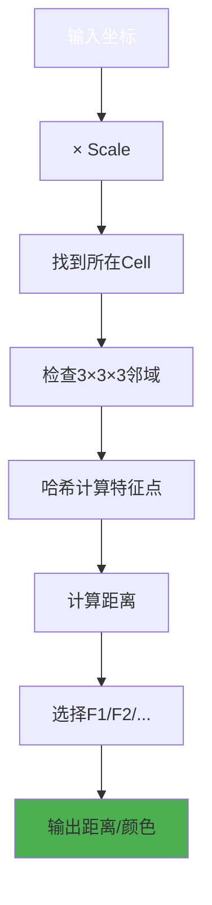
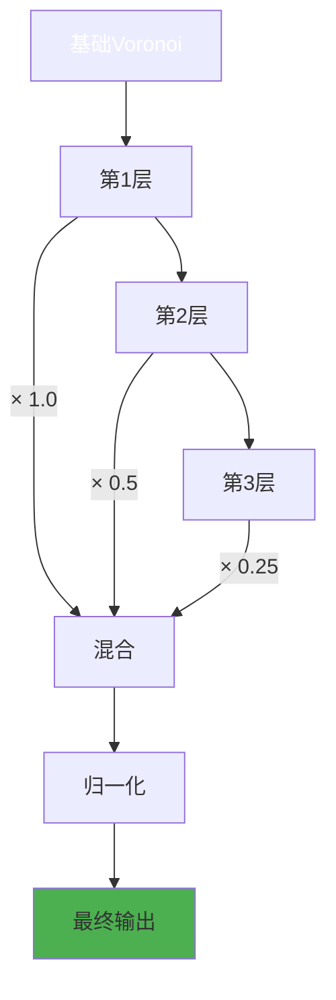
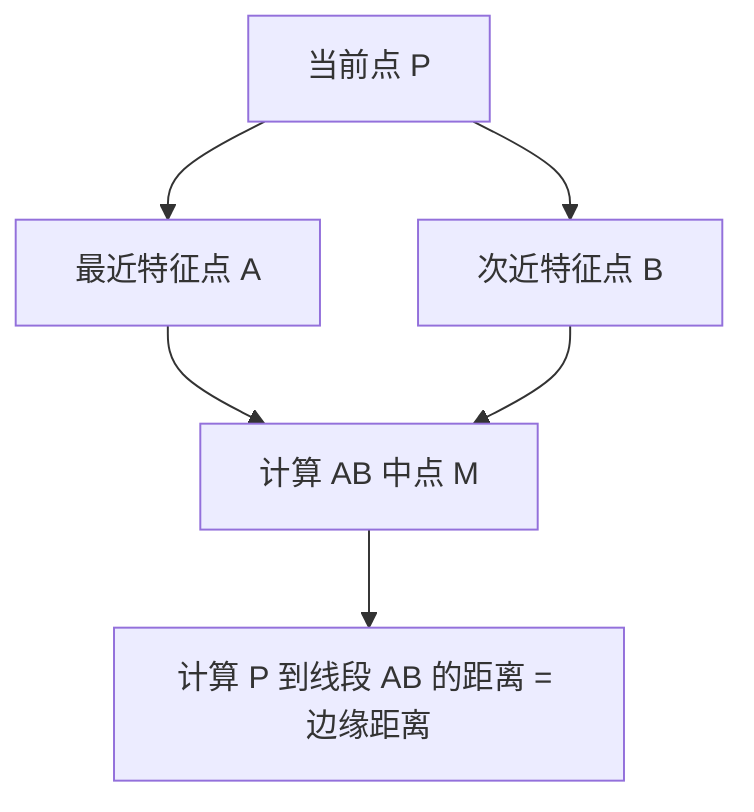

# Voronoi Texture Node - Complete Technical Analysis

## 目录
- [1. 概述](#1-概述)
- [2. 核心概念](#2-核心概念)
- [3. 特性详解](#3-特性详解)
- [4. 距离度量算法](#4-距离度量算法)
- [5. C++ 实现分析](#5-c-实现分析)
- [6. GLSL GPU 实现](#6-glsl-gpu-实现)
- [7. OSL 实现 (Cycles)](#7-osl-实现-cycles)
- [8. 分形 Voronoi 算法](#8-分形-voronoi-算法)
- [9. 单元点抖动机制](#9-单元点抖动机制)
- [10. 输出变化详解](#10-输出变化详解)
- [11. Socket 可用性矩阵](#11-socket-可用性矩阵)
- [12. 架构模式对比](#12-架构模式对比)
- [13. 变量命名解析](#13-变量命名解析)
- [14. 实际应用示例](#14-实际应用示例)

---

## 1. 概述

<span style="background-color:#3F51B5;color:white;font-weight:bold">Voronoi Texture</span>（沃罗诺伊纹理）节点基于 <span style="background-color:#E91E63;color:white;font-weight:bold">Worley Noise</span>（沃罗利噪声）算法生成细胞状图案。这种噪声由 Steven Worley 在 1996 年的论文 "A Cellular Texture Basis Function" 中首次提出。

### 1.1 基本原理

在 Python 中，Voronoi 可以这样理解：

```python
import numpy as np
import random

def basic_voronoi_2d(point, cell_jitter=1.0):
    """
    最简单的 2D Voronoi 实现
    """
    # 找到点所在的格子
    cell_x, cell_y = int(point[0]), int(point[1])

    # 检查 9 个相邻格子（当前格子 + 周围 8 个）
    min_dist = float('inf')
    feature_point = None

    for dx in [-1, 0, 1]:
        for dy in [-1, 0, 1]:
            cell_coord = (cell_x + dx, cell_y + dy)
            # 哈希函数决定该格子的特征点位置
            random.seed(cell_coord)  # 确定性随机
            jitter_x = random.random() * cell_jitter
            jitter_y = random.random() * cell_jitter

            feature_pos = (cell_coord[0] + jitter_x, cell_coord[1] + jitter_y)

            # 计算到特征点的距离
            dist = np.sqrt((point[0] - feature_pos[0])**2 +
                          (point[1] - feature_pos[1])**2)

            if dist < min_dist:
                min_dist = dist
                feature_point = feature_pos

    return min_dist, feature_point

# 使用示例
print(basic_voronoi_2d((2.3, 1.7)))
# 输出: (0.41, (2.54, 1.82)) 也就是到最近细胞中心的距离
```

### 1.2 Blender Voronoi 节点的复杂性

Blender 的实现超越了基本 Voronoi，提供了：
- **5 种特征**：F1, F2, Smooth F1, Distance to Edge, N-Sphere Radius
- **4 种维度**：1D, 2D, 3D, 4D
- **4 种距离度量**：Euclidean, Manhattan, Chebychev, Minkowski
- **分形噪声**：Detail, Roughness, Lacunarity 参数
- **可变速率的抖动**：Randomness 参数

这意味着 Blender 有 **5 × 4 = 20** 种不同的核心变体，每种还需要计算多个距离度量！

---

## 2. 核心概念

### 2.1 奇异的细胞结构

在 Voronoi 空间中，每个点都被分配到最近的**种子点**（feature point）：

```mermaid
graph TD
    A[输入坐标 (x,y,z)] --> B[映射到整数网格]
    B --> C[检查周围 3×3 或 3×3×3 格子]
    C --> D[播放哈希函数计算每个格子的特征点位置]
    D --> E[计算到每个特征点的距离]
    E --> F[选择最小/第二小/中点等]
    F --> G[输出距离/颜色/位置]
```

### 2.2 Cell Grid 概念


### 1.2 Voronoi 算法流程图



### 2.1 距离度量对比

```mermaid
graph LR
    subgraph "距离度量"
        Euclidean[<span style="background-color:#FF5722;color:white">欧几里得</span>] --> E1[√(x²+y²+z²)]
        Manhattan[<span style="background-color:#2196F3;color:white">曼哈顿</span>] --> M1[|x|+|y|+|z|]
        Chebychev[<span style="background-color:#4CAF50;color:white">切比雪夫</span>] --> C1[max(|x|,|y|,|z|)]
        Minkowski[<span style="background-color:#9C27B0;color:white">闵可夫斯基</span>] --> N1[(|x|ⁿ+|y|ⁿ+|z|ⁿ)^(1/n)]
    end

    style Euclidean fill:#FF5722,color:white
    style Manhattan fill:#2196F3,color:white
    style Chebychev fill:#4CAF50,color:white
    style Minkowski fill:#9C27B0,color:white
```

### 3.1 分形 Voronoi 流程



### 4.1 特征类型可视化

```mermaid
graph TB
    subgraph "特征类型"
        F1[<span style="background-color:#E91E63;color:white">F1 (最近)</span>] --> D1[到最近点距离]
        F2[<span style="background-color:#9C27B0;color:white">F2 (第二近)</span>] --> D2[到第二近点距离]
        Smooth[<span style="background-color:#4CAF50;color:white">Smooth F1</span>] --> D3[平滑F1]
        Edge[<span style="background-color:#FF5722;color:white">距离到边缘</span>] --> D4[细胞边界]
        Sphere[<span style="background-color:#2196F3;color:white">N-球体半径</span>] --> D5[球体半径]
    end

    style F1 fill:#E91E63,color:white
    style F2 fill:#9C27B0,color:white
    style Smooth fill:#4CAF50,color:white
    style Edge fill:#FF5722,color:white
    style Sphere fill:#2196F3,color:white
```

在 GLSL 代码中（`gpu_shader_material_voronoi.glsl:61-79`），我们看到：

```glsl
float voronoi_distance(float2 a, float2 b, VoronoiParams params)
{
  if (params.metric == SHD_VORONOI_EUCLIDEAN) {
    return distance(a, b);  // sqrt((ax-bx)^2 + (ay-by)^2)
  }
  else if (params.metric == SHD_VORONOI_MANHATTAN) {
    return abs(a.x - b.x) + abs(a.y - b.y);  // |ax-bx| + |ay-by|
  }
  // ... 其他度量
}
```

### 2.3 Python 类比理解

在 Python 中，Voronoi 参数可以这样建模：

```python
class VoronoiParams:
    def __init__(self):
        self.scale = 5.0          # 缩放：全局大小
        self.detail = 0.0         # 细节：分形层级数
        self.roughness = 0.5      # 粗糙度：每层振幅衰减
        self.lacunarity = 2.0     # 孔隙度：每层频率倍数
        self.smoothness = 1.0     # 平滑度：仅用于 Smooth F1
        self.exponent = 0.5       # 指数：仅用于 Minkowski
        self.randomness = 1.0     # 随机性：特征点抖动程度
        self.max_distance = 1.0   # 最大距离：归一化基准
        self.normalize = False    # 是否归一化输出
        self.feature = "F1"       # 特征类型
        self.metric = "EUCLIDEAN" # 距离度量
```

---

## 3. 特性详解

### 3.1 F1 - 到最近细胞的距离

**数学定义**：
$$F1(P) = \min_{i} \{ d(P, \text{FeaturePoint}_i) \}$$

**GLSL 实现**（`gpu_shader_material_voronoi.glsl:130-155`）：
```glsl
VoronoiOutput voronoi_f1(VoronoiParams params, float coord)
{
  float cellPosition = floor(coord);
  float localPosition = coord - cellPosition;

  float minDistance = FLT_MAX;
  float targetOffset = 0.0;
  float targetPosition = 0.0;

  // 检查 3 个相邻格子 (1D 情况)
  for (int i = -1; i <= 1; i++) {
    float cellOffset = i;
    float pointPosition = cellOffset +
                          hash_float_to_float(cellPosition + cellOffset) * params.randomness;
    float distanceToPoint = voronoi_distance(pointPosition, localPosition);
    if (distanceToPoint < minDistance) {
      targetOffset = cellOffset;
      minDistance = distanceToPoint;
      targetPosition = pointPosition;
    }
  }

  // 输出
  VoronoiOutput octave;
  octave.Distance = minDistance;
  octave.Color = hash_float_to_vec3(cellPosition + targetOffset);
  octave.Position = voronoi_position(targetPosition + cellPosition);
  return octave;
}
```

**Python 伪代码**：
```python
def voronoi_f1(point, randomness=1.0):
    cell_pos = floor(point)
    local_pos = point - cell_pos

    min_dist = float('inf')
    for offset in [-1, 0, 1]:
        # 哈希确定特征点位置
        jitter = hash(cell_pos + offset) * randomness
        feature_pos = offset + jitter
        dist = distance(feature_pos, local_pos)
        min_dist = min(min_dist, dist)

    return min_dist
```

### 3.2 F2 - 到第二近细胞的距离

**定义**：类似 F1，但保存第二小的距离。

**GLSL 实现**（`gpu_shader_material_voronoi.glsl:190-226`）：
```glsl
VoronoiOutput voronoi_f2(VoronoiParams params, float coord)
{
  float cellPosition = floor(coord);
  float localPosition = coord - cellPosition;

  float distanceF1 = FLT_MAX;
  float distanceF2 = FLT_MAX;
  // ...

  for (int i = -1; i <= 1; i++) {
    float cellOffset = i;
    float pointPosition = cellOffset + hash_float_to_float(cellPosition + cellOffset) * params.randomness;
    float distanceToPoint = voronoi_distance(pointPosition, localPosition);

    if (distanceToPoint < distanceF1) {
      distanceF2 = distanceF1;  // 旧的 F1 成为 F2
      distanceF1 = distanceToPoint;
      // 更新位置等...
    }
    else if (distanceToPoint < distanceF2) {
      distanceF2 = distanceToPoint;  // 找到新的 F2
    }
  }

  VoronoiOutput octave;
  octave.Distance = distanceF2;  // 返回第二近距离
  // ...
}
```

**Python 对比**：
```python
def voronoi_f2(point, randomness=1.0):
    cell_pos = floor(point)
    local_pos = point - cell_pos

    dist_f1 = float('inf')
    dist_f2 = float('inf')

    for offset in [-1, 0, 1]:
        jitter = hash(cell_pos + offset) * randomness
        feature_pos = offset + jitter
        dist = distance(feature_pos, local_pos)

        if dist < dist_f1:
            dist_f2 = dist_f1
            dist_f1 = dist
        elif dist < dist_f2:
            dist_f2 = dist

    return dist_f2
```

### 3.3 Smooth F1 - 平滑版 F1

**数学原理**：使用 smoothstep 函数混合多个邻近距离，创建平滑过渡。

**GLSL 实现**（`gpu_shader_material_voronoi.glsl:157-188`）：
```glsl
VoronoiOutput voronoi_smooth_f1(VoronoiParams params, float coord)
{
  float cellPosition = floor(coord);
  float localPosition = coord - cellPosition;

  float smoothDistance = 0.0;
  float smoothPosition = 0.0;
  float3 smoothColor = float3(0.0);
  float h = -1.0;  // 混合因子

  // 检查 5 个格子 (-2 到 2)
  for (int i = -2; i <= 2; i++) {
    float cellOffset = i;
    float pointPosition = cellOffset +
                          hash_float_to_float(cellPosition + cellOffset) * params.randomness;
    float distanceToPoint = voronoi_distance(pointPosition, localPosition);

    // Smoothstep 混合
    h = h == -1.0 ?
            1.0 :
            smoothstep(0.0, 1.0,
                      0.5 + 0.5 * (smoothDistance - distanceToPoint) / params.smoothness);

    float correctionFactor = params.smoothness * h * (1.0 - h);
    smoothDistance = mix(smoothDistance, distanceToPoint, h) - correctionFactor;
    correctionFactor /= 1.0 + 3.0 * params.smoothness;

    float3 cellColor = hash_float_to_vec3(cellPosition + cellOffset);
    smoothColor = mix(smoothColor, cellColor, h) - correctionFactor;
    smoothPosition = mix(smoothPosition, pointPosition, h) - correctionFactor;
  }

  VoronoiOutput octave;
  octave.Distance = smoothDistance;
  octave.Color = smoothColor;
  octave.Position = voronoi_position(cellPosition + smoothPosition);
  return octave;
}
```

**关键公式**：
$$h = \text{smoothstep}(0, 1, 0.5 + 0.5 \times \frac{\text{oldDist} - \text{newDist}}{\text{smoothness}})$$

$$\text{smoothDistance} = \text{mix}(\text{oldDist}, \text{newDist}, h) - \text{correction}$$

### 3.4 Distance to Edge - 边缘距离

**原理**：计算当前点到两个最近特征点连线中点的距离（求最近边界）。

**GLSL 实现**（`gpu_shader_material_voronoi.glsl:428-453` 3D 版本）：
```glsl
float voronoi_distance_to_edge(VoronoiParams params, float3 coord)
{
  float3 cellPosition_f = floor(coord);
  float3 localPosition = coord - cellPosition_f;
  int3 cellPosition = int3(cellPosition_f);

  float3 vectorToClosest = float3(0.0);
  float minDistance = FLT_MAX;

  // 第一轮：找到最近的特征点
  for (int k = -1; k <= 1; k++) {
    for (int j = -1; j <= 1; j++) {
      for (int i = -1; i <= 1; i++) {
        int3 cellOffset = int3(i, j, k);
        float3 vectorToPoint = float3(cellOffset) +
                               hash_int3_to_vec3(cellPosition + cellOffset) * params.randomness -
                               localPosition;
        float distanceToPoint = dot(vectorToPoint, vectorToPoint);  // 距离平方
        if (distanceToPoint < minDistance) {
          minDistance = distanceToPoint;
          vectorToClosest = vectorToPoint;
        }
      }
    }
  }

  // 第二轮：找到垂直于最近点的边
  minDistance = FLT_MAX;
  for (int k = -1; k <= 1; k++) {
    for (int j = -1; j <= 1; j++) {
      for (int i = -1; i <= 1; i++) {
        int3 cellOffset = int3(i, j, k);
        float3 vectorToPoint = float3(cellOffset) +
                               hash_int3_to_vec3(cellPosition + cellOffset) * params.randomness -
                               localPosition;
        float3 perpendicularToEdge = vectorToPoint - vectorToClosest;
        if (dot(perpendicularToEdge, perpendicularToEdge) > 0.0001f) {
          // 计算到边的距离（点到直线的距离）
          float distanceToEdge = dot((vectorToClosest + vectorToPoint) / 2.0f,
                                     normalize(perpendicularToEdge));
          minDistance = min(minDistance, distanceToEdge);
        }
      }
    }
  }

  return minDistance;
}
```

**几何解释**：


### 3.5 N-Sphere Radius - 单元半径

**原理**：计算当前单元内能容纳的最大球体半径（即到最近特征点和其最近邻居的中点距离）。

**GLSL 实现**（`gpu_shader_material_voronoi.glsl:647-693`）：
```glsl
float voronoi_n_sphere_radius(VoronoiParams params, float3 coord)
{
  float3 cellPosition_f = floor(coord);
  float3 localPosition = coord - cellPosition_f;
  int3 cellPosition = int3(cellPosition_f);

  // 步骤 1: 找到最近的特征点
  float3 closestPoint = float3(0.0);
  int3 closestPointOffset = int3(0);
  float minDistance = FLT_MAX;

  for (int k = -1; k <= 1; k++) {
    for (int j = -1; j <= 1; j++) {
      for (int i = -1; i <= 1; i++) {
        int3 cellOffset = int3(i, j, k);
        float3 pointPosition = float3(cellOffset) +
                               hash_int3_to_vec3(cellPosition + cellOffset) * params.randomness;
        float distanceToPoint = distance(pointPosition, localPosition);
        if (distanceToPoint < minDistance) {
          minDistance = distanceToPoint;
          closestPoint = pointPosition;
          closestPointOffset = cellOffset;
        }
      }
    }
  }

  // 步骤 2: 找到最近特征点的最近邻居
  minDistance = FLT_MAX;
  float3 closestPointToClosestPoint = float3(0.0);

  for (int k = -1; k <= 1; k++) {
    for (int j = -1; j <= 1; j++) {
      for (int i = -1; i <= 1; i++) {
        if (i == 0 && j == 0 && k == 0) continue;  // 跳过自己

        int3 cellOffset = int3(i, j, k) + closestPointOffset;
        float3 pointPosition = float3(cellOffset) +
                               hash_int3_to_vec3(cellPosition + cellOffset) * params.randomness;
        float distanceToPoint = distance(closestPoint, pointPosition);
        if (distanceToPoint < minDistance) {
          minDistance = distanceToPoint;
          closestPointToClosestPoint = pointPosition;
        }
      }
    }
  }

  // 步骤 3: 半径 = 两点距离 / 2
  return distance(closestPointToClosestPoint, closestPoint) / 2.0f;
}
```

**可视化**：
```
细胞空间：
┌─────────┬─────────┐
│         │         │
│    ◯────┼─────◯   │
│   /      \      \  │
│  /        \      \ │
│ ●          ●      ●│
│        当前点      │
└─────────┴─────────┘

● = 特征点
◯ = 可以画的最大球体边界
◯ 的半径 = 红圈直径 / 2
```

---

## 4. 距离度量算法

### 4.1 欧几里得距离 (Euclidean)

**定义**：标准直线距离

$$d_E(\mathbf{a}, \mathbf{b}) = \|\mathbf{a} - \mathbf{b}\|_2 = \sqrt{\sum_{i=1}^{n} (a_i - b_i)^2}$$

**GLSL**：
```glsl
distance(a, b);  // 内置函数
```

**Python**：
```python
def euclidean(a, b):
    return math.sqrt(sum((ai - bi)**2 for ai, bi in zip(a, b)))
```

**效果**：最自然、平滑的圆形单元。

### 4.2 曼哈顿距离 (Manhattan)

**定义**：城市街区距离，只能沿坐标轴移动

$$d_M(\mathbf{a}, \mathbf{b}) = \| \mathbf{a} - \mathbf{b} \|_1 = \sum_{i=1}^{n} |a_i - b_i|$$

**GLSL**：
```glsl
float voronoi_distance(float2 a, float2 b, VoronoiParams params)
{
  if (params.metric == SHD_VORONOI_MANHATTAN) {
    return abs(a.x - b.x) + abs(a.y - b.y);
  }
}
```

**Python**：
```python
def manhattan(a, b):
    return sum(abs(ai - bi) for ai, bi in zip(a, b))
```

**效果**：钻石形/菱形单元。

### 4.3 切比雪夫距离 (Chebychev)

**定义**：象棋中王的距离，任意方向一次最多移动 1 格

$$d_C(\mathbf{a}, \mathbf{b}) = \| \mathbf{a} - \mathbf{b} \|_\infty = \max_{i} |a_i - b_i|$$

**GLSL**：
```glsl
float voronoi_distance(float2 a, float2 b, VoronoiParams params)
{
  if (params.metric == SHD_VORONOI_CHEBYCHEV) {
    return max(abs(a.x - b.x), abs(a.y - b.y));
  }
}
```

**Python**：
```python
def chebychev(a, b):
    return max(abs(ai - bi) for ai, bi in zip(a, b))
```

**效果**：正方形单元。

### 4.4 Minkowski 距离 (广义欧几里得)

**定义**：可调节的参数化距离

$$d_p(\mathbf{a}, \mathbf{b}) = \left( \sum_{i=1}^{n} |a_i - b_i|^p \right)^{1/p}$$

- p = 1: 曼哈顿距离
- p = 2: 欧几里得距离
- p → ∞: 切比雪夫距离

**GLSL 实现**：
```glsl
float voronoi_distance(float2 a, float2 b, VoronoiParams params)
{
  if (params.metric == SHD_VORONOI_MINKOWSKI) {
    return pow(pow(abs(a.x - b.x), params.exponent) +
               pow(abs(a.y - b.y), params.exponent),
               1.0f / params.exponent);
  }
}
```

**Python 对比**：
```python
def minkowski(a, b, p):
    return sum(abs(ai - bi)**p for ai, bi in zip(a, b)) ** (1/p)
```

### 4.5 度量对比表格

| 度量类型 | Python 公式 | 单元形状 | 速度 | Exponent 参数 |
|---------|------------|---------|------|--------------|
| **Euclidean** | `sqrt(dx²+dy²)` | 圆形/球形 | 中等 | 无 |
| **Manhattan** | `|dx|+|dy|` | 钻石形 | 快 | 无 |
| **Chebychev** | `max(|dx|,|dy|)` | 正方形 | 最快 | 无 |
| **Minkowski** | `( |dx|^p + |dy|^p )^(1/p)` | 可调节 | 较慢 | 需要 (p值) |

---

## 5. C++ 实现分析

### 5.1 节点声明 (Node Declaration)

**文件位置**：`source/blender/nodes/shader/nodes/node_shader_tex_voronoi.cc:23-77`

```cpp
static void sh_node_tex_voronoi_declare(NodeDeclarationBuilder &b)
{
  b.is_function_node();

  // 输入参数
  b.add_input<decl::Float>("W")
    .min(-1000.0f).max(1000.0f)
    .make_available([](bNode &node) {
      // 默认为 1 维，因为更快
      node_storage(node).dimensions = 1;
    });

  b.add_input<decl::Float>("Scale").default_value(5.0f);

  b.add_input<decl::Float>("Detail")
    .min(0.0f).max(15.0f).default_value(0.0f)
    .make_available([](bNode &node) {
      node_storage(node).feature = SHD_VORONOI_F1;
    })
    .description("Voronoi layers to sum");

  b.add_input<decl::Float>("Roughness")
    .min(0.0f).max(1.0f).default_value(0.5f)
    .subtype(PROP_FACTOR)
    .make_available([](bNode &node) {
      node_storage(node).feature = SHD_VORONOI_F1;
    });

  b.add_input<decl::Float>("Lacunarity")
    .min(0.0f).max(1000.0f).default_value(2.0f)
    .make_available([](bNode &node) {
      node_storage(node).feature = SHD_VORONOI_F1;
    });

  b.add_input<decl::Float>("Smoothness")
    .min(0.0f).max(1.0f).default_value(1.0f)
    .subtype(PROP_FACTOR)
    .make_available([](bNode &node) {
      node_storage(node).feature = SHD_VORONOI_SMOOTH_F1;
    });

  b.add_input<decl::Float>("Exponent")
    .min(0.0f).max(32.0f).default_value(0.5f)
    .make_available([](bNode &node) {
      node_storage(node).distance = SHD_VORONOI_MINKOWSKI;
    });

  b.add_input<decl::Float>("Randomness")
    .min(0.0f).max(1.0f).default_value(1.0f)
    .subtype(PROP_FACTOR);

  // 输出参数
  b.add_output<decl::Float>("Distance").no_muted_links();
  b.add_output<decl::Color>("Color").no_muted_links();
  b.add_output<decl::Vector>("Position").no_muted_links();
  b.add_output<decl::Float>("W").no_muted_links()
    .make_available([](bNode &node) {
      node_storage(node).dimensions = 1;
    });
  b.add_output<decl::Float>("Radius").no_muted_links()
    .make_available([](bNode &node) {
      node_storage(node).feature = SHD_VORONOI_N_SPHERE_RADIUS;
    });
}
```

**关键点**：
1. `.make_available()` - 动态显示/隐藏输入 socket
2. `node_storage(node)` - 访问节点存储数据
3. `subtype(PROP_FACTOR)` - 显示为 0-1 滑块

### 5.2 动态 Socket 可用性

**文件位置**：`source/blender/nodes/shader/nodes/node_shader_tex_voronoi.cc:170-223`

```cpp
static void node_shader_update_tex_voronoi(bNodeTree *ntree, bNode *node)
{
  // 获取所有 socket
  bNodeSocket *inWSock = bke::node_find_socket(*node, SOCK_IN, "W");
  bNodeSocket *inSmoothnessSock = bke::node_find_socket(*node, SOCK_IN, "Smoothness");
  bNodeSocket *inExponentSock = bke::node_find_socket(*node, SOCK_IN, "Exponent");
  // ... 更多 sockets

  const NodeTexVoronoi &storage = node_storage(*node);

  // 规则 1: W 输入仅在 1D 和 4D 模式下可用
  bke::node_set_socket_availability(
      *ntree, *inWSock,
      storage.dimensions == 1 || storage.dimensions == 4);

  // 规则 2: Vector 输入在 1D 模式下不可用
  bke::node_set_socket_availability(*ntree, *inVectorSock,
                                    storage.dimensions != 1);

  // 规则 3: Exponent 仅在 Minkowski 且非 1D 且不是 Distance/Radius 特性时可用
  bke::node_set_socket_availability(
      *ntree, *inExponentSock,
      storage.distance == SHD_VORONOI_MINKOWSKI &&
      storage.dimensions != 1 &&
      !ELEM(storage.feature, SHD_VORONOI_DISTANCE_TO_EDGE,
                          SHD_VORONOI_N_SPHERE_RADIUS));

  // 规则 4: Smoothness 仅在 Smooth F1 时可用
  bke::node_set_socket_availability(
      *ntree, *inSmoothnessSock,
      storage.feature == SHD_VORONOI_SMOOTH_F1);

  // 规则 5: Detail/Roughness/Lacunarity 不在 N-Sphere 时可用
  bke::node_set_socket_availability(
      *ntree, *inDetailSock,
      storage.feature != SHD_VORONOI_N_SPHERE_RADIUS);

  // ... 更多规则

  // 输出规则
  // Position 输出仅在 2D/3D/4D 且非 Distance/Radius
  bke::node_set_socket_availability(*ntree,
                                    *outPositionSock,
                                    storage.feature != SHD_VORONOI_DISTANCE_TO_EDGE &&
                                        storage.feature != SHD_VORONOI_N_SPHERE_RADIUS &&
                                        storage.dimensions != 1);
}
```

**Socket 可用性矩阵**将在后文详细说明。

### 5.3 GPU Shader 选择

**文件位置**：`source/blender/nodes/shader/nodes/node_shader_tex_voronoi.cc:107-150`

```cpp
static const char *gpu_shader_get_name(const int feature, const int dimensions)
{
  BLI_assert(feature >= 0 && feature < 5);
  BLI_assert(dimensions > 0 && dimensions < 5);

  switch (feature) {
    case SHD_VORONOI_F1:
      return std::array{
          "node_tex_voronoi_f1_1d",
          "node_tex_voronoi_f1_2d",
          "node_tex_voronoi_f1_3d",
          "node_tex_voronoi_f1_4d",
      }[dimensions - 1];
    case SHD_VORONOI_F2:
      return std::array{
          "node_tex_voronoi_f2_1d",
          "node_tex_voronoi_f2_2d",
          "node_tex_voronoi_f2_3d",
          "node_tex_voronoi_f2_4d",
      }[dimensions - 1];
    case SHD_VORONOI_SMOOTH_F1:
      return std::array{
          "node_tex_voronoi_smooth_f1_1d",
          "node_tex_voronoi_smooth_f1_2d",
          "node_tex_voronoi_smooth_f1_3d",
          "node_tex_voronoi_smooth_f1_4d",
      }[dimensions - 1];
    case SHD_VORONOI_DISTANCE_TO_EDGE:
      return std::array{
          "node_tex_voronoi_distance_to_edge_1d",
          "node_tex_voronoi_distance_to_edge_2d",
          "node_tex_voronoi_distance_to_edge_3d",
          "node_tex_voronoi_distance_to_edge_4d",
      }[dimensions - 1];
    case SHD_VORONOI_N_SPHERE_RADIUS:
      return std::array{
          "node_tex_voronoi_n_sphere_radius_1d",
          "node_tex_voronoi_n_sphere_radius_2d",
          "node_tex_voronoi_n_sphere_radius_3d",
          "node_tex_voronoi_n_sphere_radius_4d",
      }[dimensions - 1];
  }
  return nullptr;
}
```

**使用方式**：
```cpp
static int node_shader_gpu_tex_voronoi(GPUMaterial *mat,
                                       bNode *node,
                                       GPUNodeStack *in,
                                       GPUNodeStack *out)
{
  NodeTexVoronoi *tex = (NodeTexVoronoi *)node->storage;
  float metric = tex->distance;
  float normalize = tex->normalize;

  const char *name = gpu_shader_get_name(tex->feature, tex->dimensions);

  return GPU_stack_link(mat, node, name, in, out,
                        GPU_constant(&metric),
                        GPU_constant(&normalize));
}
```

这会链接到 GLSL 中的对应函数，在 GPU 上执行。

### 5.4 MultiFunction 类架构

Blender 使用 **MultiFunction** 系统进行节点计算。有 3 个主要类：

#### 5.4.1 VoronoiMetricFunction

**文件位置**：`source/blender/nodes/shader/nodes/node_shader_tex_voronoi.cc:227-531`

```cpp
class VoronoiMetricFunction : public mf::MultiFunction {
 private:
  int dimensions_;
  int feature_;
  int metric_;
  bool normalize_;

 public:
  VoronoiMetricFunction(int dimensions, int feature, int metric, bool normalize)
      : dimensions_(dimensions), feature_(feature), metric_(metric), normalize_(normalize)
  {
    // 根据参数创建签名（输入参数组合）
    // Minkowski 需要 Exponent 参数
  }

  void call(const IndexMask &mask, mf::Params mf_params, mf::Context /*context*/) const override
  {
    // 为每个维度创建 lambda 获取器
    auto get_vector = [&](int param_index) -> VArray<float3> {
      return mf_params.readonly_single_input<float3>(param_index, "Vector");
    };
    auto get_scale = [&](int param_index) -> VArray<float> {
      return mf_params.readonly_single_input<float>(param_index, "Scale");
    };
    // ... 更多获取器

    // 根据维度分发
    switch (dimensions_) {
      case 1: {
        mask.foreach_index([&](const int64_t i) {
          params.scale = scale[i];
          params.detail = detail[i];
          // ... 设置参数
          params.smoothness = ELEM(feature_, SHD_VORONOI_SMOOTH_F1) ?
                                  std::min(std::max(smoothness[i] / 2.0f, 0.0f), 0.5f) :
                                  0.0f;
          params.max_distance = (0.5f + 0.5f * params.randomness) *
                                ((params.feature == SHD_VORONOI_F2) ? 2.0f : 1.0f);

          output = noise::fractal_voronoi_x_fx<float>(params, w[i] * params.scale, calc_color);

          if (calc_distance) r_distance[i] = output.distance;
          if (calc_color) r_color[i] = ColorGeometry4f(output.color.x, output.color.y, output.color.z, 1.0f);
          if (calc_w) r_w[i] = output.position.w;
        });
        break;
      }
      case 2: {
        // 类似，但使用 float2
        mask.foreach_index([&](const int64_t i) {
          // ...
          output = noise::fractal_voronoi_x_fx<float2>(
              params, float2{vector[i].x, vector[i].y} * params.scale, calc_color);
          // ...
        });
        break;
      }
      case 3: {
        // 使用 float3
        break;
      }
      case 4: {
        // 使用 float4
        mask.foreach_index([&](const int64_t i) {
          // ...
          output = noise::fractal_voronoi_x_fx<float4>(
              params,
              float4{vector[i].x, vector[i].y, vector[i].z, w[i]} * params.scale,
              calc_color);
          // ...
        });
        break;
      }
    }
  }
};
```

#### 5.4.2 VoronoiDistToEdgeFunction

**文件位置**：`source/blender/nodes/shader/nodes/node_shader_tex_voronoi.cc:533-679`

```cpp
class VoronoiDistToEdgeFunction : public mf::MultiFunction {
  // 类似结构，但仅输出 Distance
  void call(...) const override {
    // 调用 noise::fractal_voronoi_distance_to_edge
  }
};
```

#### 5.4.3 VoronoiNSphereFunction

**文件位置**：`source/blender/nodes/shader/nodes/node_shader_tex_voronoi.cc:681-791`

```cpp
class VoronoiNSphereFunction : public mf::MultiFunction {
  // 仅输出 Radius
  void call(...) const override {
    // 调用 noise::voronoi_n_sphere_radius
  }
};
```

### 5.5 桥接函数

**文件位置**：`source/blender/nodes/shader/nodes/node_shader_tex_voronoi.cc:793-812`

```cpp
static void sh_node_voronoi_build_multi_function(NodeMultiFunctionBuilder &builder)
{
  const NodeTexVoronoi &storage = node_storage(builder.node());

  switch (storage.feature) {
    case SHD_VORONOI_DISTANCE_TO_EDGE: {
      // 构造边距函数
      builder.construct_and_set_matching_fn<VoronoiDistToEdgeFunction>(
          storage.dimensions, storage.normalize);
      break;
    }
    case SHD_VORONOI_N_SPHERE_RADIUS: {
      // 构造半径函数
      builder.construct_and_set_matching_fn<VoronoiNSphereFunction>(storage.dimensions);
      break;
    }
    default: {
      // 构造度量函数 (F1, F2, Smooth F1)
      builder.construct_and_set_matching_fn<VoronoiMetricFunction>(
          storage.dimensions, storage.feature, storage.distance, storage.normalize);
      break;
    }
  }
}
```

这个函数根据节点配置选择正确的 MultiFunction 类。

---

## 6. GLSL GPU 实现

### 6.1 文件结构

```
gpu_shader_material_tex_voronoi.glsl (主入口)
├── includes gpu_shader_material_voronoi.glsl (基础 Voronoi 函数)
└── includes gpu_shader_material_fractal_voronoi.glsl (分形逻辑)
```

### 6.2 主入口文件

**文件位置**：`source/blender/gpu/shaders/material/gpu_shader_material_tex_voronoi.glsl`

```glsl
/*
 * Smooth Voronoi: https://wiki.blender.org/wiki/User:OmarSquircleArt/GSoC2019/Documentation/Smooth_Voronoi
 * Distance To Edge: https://www.iquilezles.org/www/articles/voronoilines/voronoilines.htm
 */

#include "gpu_shader_common_hash.glsl"
#include "gpu_shader_material_fractal_voronoi.glsl"
#include "gpu_shader_material_voronoi.glsl"

// 参数初始化宏
#define INITIALIZE_VORONOIPARAMS(FEATURE) \
  params.feature = FEATURE; \
  params.metric = int(metric); \
  params.scale = scale; \
  params.detail = clamp(detail, 0.0f, 15.0f); \
  params.roughness = clamp(roughness, 0.0f, 1.0f); \
  params.lacunarity = lacunarity; \
  params.smoothness = clamp(smoothness / 2.0f, 0.0f, 0.5f); \
  params.exponent = exponent; \
  params.randomness = clamp(randomness, 0.0f, 1.0f); \
  params.max_distance = 0.0f; \
  params.normalize = bool(normalize);

/* **** 1D Voronoi **** */

void node_tex_voronoi_f1_1d(float3 coord, float w, float scale, float detail,
                            float roughness, float lacunarity, float smoothness,
                            float exponent, float randomness, float metric,
                            float normalize, out float outDistance,
                            out float4 outColor, out float3 outPosition,
                            out float outW, out float outRadius)
{
  VoronoiParams params;
  INITIALIZE_VORONOIPARAMS(SHD_VORONOI_F1)

  w *= scale;
  params.max_distance = 0.5f + 0.5f * params.randomness;

  VoronoiOutput Output = fractal_voronoi_x_fx(params, w);
  outDistance = Output.Distance;
  outColor = float4(Output.Color, 1.0f);
  outW = Output.Position.w;
}

// ... 19 个类似函数 (5 features × 4 dimensions)
```

### 6.3 基础 Voronoi 函数

**文件位置**：`source/blender/gpu/shaders/material/gpu_shader_material_voronoi.glsl`

#### 距离函数宏
```glsl
#define SHD_VORONOI_EUCLIDEAN 0
#define SHD_VORONOI_MANHATTAN 1
#define SHD_VORONOI_CHEBYCHEV 2
#define SHD_VORONOI_MINKOWSKI 3

// 1D 距离（简单绝对值）
float voronoi_distance(float a, float b)
{
  return abs(a - b);
}

// 2D 距离（4 种度量）
float voronoi_distance(float2 a, float2 b, VoronoiParams params)
{
  if (params.metric == SHD_VORONOI_EUCLIDEAN) {
    return distance(a, b);
  }
  else if (params.metric == SHD_VORONOI_MANHATTAN) {
    return abs(a.x - b.x) + abs(a.y - b.y);
  }
  else if (params.metric == SHD_VORONOI_CHEBYCHEV) {
    return max(abs(a.x - b.x), abs(a.y - b.y));
  }
  else if (params.metric == SHD_VORONOI_MINKOWSKI) {
    return pow(pow(abs(a.x - b.x), params.exponent) +
               pow(abs(a.y - b.y), params.exponent),
               1.0f / params.exponent);
  }
  return 0.0f;
}
```

#### F1 实现 (2D)
```glsl
VoronoiOutput voronoi_f1(VoronoiParams params, float2 coord)
{
  // 步骤 1: 格子化
  float2 cellPosition_f = floor(coord);
  float2 localPosition = coord - cellPosition_f;
  int2 cellPosition = int2(cellPosition_f);

  // 步骤 2: 扫描周围 9 个格子
  float minDistance = FLT_MAX;
  int2 targetOffset = int2(0);
  float2 targetPosition = float2(0.0f);

  for (int j = -1; j <= 1; j++) {
    for (int i = -1; i <= 1; i++) {
      int2 cellOffset = int2(i, j);

      // 计算特征点位置（哈希 + 抖动）
      float2 pointPosition = float2(cellOffset) +
                             hash_int2_to_vec2(cellPosition + cellOffset) * params.randomness;

      // 计算距离
      float distanceToPoint = voronoi_distance(pointPosition, localPosition, params);

      // 找最小值
      if (distanceToPoint < minDistance) {
        targetOffset = cellOffset;
        minDistance = distanceToPoint;
        targetPosition = pointPosition;
      }
    }
  }

  // 步骤 3: 返回结果
  VoronoiOutput octave;
  octave.Distance = minDistance;
  octave.Color = hash_int2_to_vec3(cellPosition + targetOffset);
  octave.Position = voronoi_position(targetPosition + cellPosition_f);
  return octave;
}
```

#### Smooth F1 实现 (2D)
```glsl
VoronoiOutput voronoi_smooth_f1(VoronoiParams params, float2 coord)
{
  float2 cellPosition_f = floor(coord);
  float2 localPosition = coord - cellPosition_f;
  int2 cellPosition = int2(cellPosition_f);

  float smoothDistance = 0.0f;
  float3 smoothColor = float3(0.0f);
  float2 smoothPosition = float2(0.0f);
  float h = -1.0f;  // 混合因子初始化

  // 扫描 5×5 = 25 个格子（比 F1 更宽的范围）
  for (int j = -2; j <= 2; j++) {
    for (int i = -2; i <= 2; i++) {
      int2 cellOffset = int2(i, j);

      float2 pointPosition = float2(cellOffset) +
                             hash_int2_to_vec2(cellPosition + cellOffset) * params.randomness;
      float distanceToPoint = voronoi_distance(pointPosition, localPosition, params);

      // 关键：Smoothstep 混合
      h = h == -1.0f ?
              1.0f :
              smoothstep(0.0f, 1.0f,
                        0.5f + 0.5f * (smoothDistance - distanceToPoint) / params.smoothness);

      // Smooth F1 的核心算法
      float correctionFactor = params.smoothness * h * (1.0f - h);
      smoothDistance = mix(smoothDistance, distanceToPoint, h) - correctionFactor;
      correctionFactor /= 1.0f + 3.0f * params.smoothness;

      float3 cellColor = hash_int2_to_vec3(cellPosition + cellOffset);
      smoothColor = mix(smoothColor, cellColor, h) - correctionFactor;
      smoothPosition = mix(smoothPosition, pointPosition, h) - correctionFactor;
    }
  }

  VoronoiOutput octave;
  octave.Distance = smoothDistance;
  octave.Color = smoothColor;
  octave.Position = voronoi_position(cellPosition_f + smoothPosition);
  return octave;
}
```

**Smooth F1 的数学本质**：
- 公式：`混合因子 = smoothstep(0, 1, 0.5 + (旧距离 - 新距离) / 平滑度)`
- 目的：创建距离场的平滑插值，而非硬边缘

### 6.4 分形 Voronoi 函数

**文件位置**：`source/blender/gpu/shaders/material/gpu_shader_material_fractal_voronoi.glsl`

#### 分形逻辑宏 (F1/F2/Smooth F1)
```glsl
#define FRACTAL_VORONOI_X_FX(T) \
VoronoiOutput fractal_voronoi_x_fx(VoronoiParams params, T coord) \
{ \
  float amplitude = 1.0f; \
  float max_amplitude = 0.0f; \
  float scale = 1.0f; \
\
  VoronoiOutput Output; \
  Output.Distance = 0.0f; \
  Output.Color = float3(0.0f, 0.0f, 0.0f); \
  Output.Position = float4(0.0f, 0.0f, 0.0f, 0.0f); \
  bool zero_input = params.detail == 0.0f || params.roughness == 0.0f; \
\
  /* 奥克塔夫（Octave）循环 */ \
  for (int i = 0; i <= ceil(params.detail); ++i) { \
    VoronoiOutput octave; \
    /* 根据特征选择基础函数 */ \
    if (params.feature == SHD_VORONOI_F2) { \
      octave = voronoi_f2(params, coord * scale); \
    } \
    else if (params.feature == SHD_VORONOI_SMOOTH_F1 && params.smoothness != 0.0f) { \
      octave = voronoi_smooth_f1(params, coord * scale); \
    } \
    else { \
      octave = voronoi_f1(params, coord * scale); \
    }\
\
    if (zero_input) { \
      /* 无细节时，仅使用第一层 */ \
      max_amplitude = 1.0f; \
      Output = octave; \
      break; \
    } \
    else if (i <= params.detail) { \
      /* 累加多层 */ \
      max_amplitude += amplitude; \
      Output.Distance += octave.Distance * amplitude; \
      Output.Color += octave.Color * amplitude; \
      Output.Position = mix(Output.Position, octave.Position / scale, amplitude); \
      scale *= params.lacunarity; \
      amplitude *= params.roughness; \
    } \
    else { \
      /* 处理非整数 detail 的尾部混合 */ \
      float remainder = params.detail - floor(params.detail); \
      if (remainder != 0.0f) { \
        max_amplitude = mix(max_amplitude, max_amplitude + amplitude, remainder); \
        Output.Distance = mix(Output.Distance, Output.Distance + octave.Distance * amplitude, remainder); \
        Output.Color = mix(Output.Color, Output.Color + octave.Color * amplitude, remainder); \
        Output.Position = mix(Output.Position, \
                              mix(Output.Position, octave.Position / scale, amplitude), \
                              remainder); \
      } \
    } \
  } \
\
  /* 归一化 */ \
  if (params.normalize) { \
    Output.Distance /= max_amplitude * params.max_distance; \
    Output.Color /= max_amplitude; \
  } \
\
  /* 除以原始 scale 以返回世界空间 */ \
  Output.Position = safe_divide(Output.Position, params.scale); \
\
  return Output; \
}
```

**分形算法详解**：

```python
def fractal_voronoi(coord, params):
    amplitude = 1.0
    max_amplitude = 0.0
    scale = 1.0
    output_distance = 0.0
    output_color = (0, 0, 0)
    output_position = (0, 0, 0, 0)

    detail = params.detail
    for i in range(int(detail) + 1):
        # 缩放坐标（lacunarity 控制频率）
        scaled_coord = coord * scale

        # 计算当前层级的 Voronoi
        if params.feature == "F2":
            octave = voronoi_f2(scaled_coord)
        elif params.feature == "Smooth F1":
            octave = voronoi_smooth_f1(scaled_coord)
        else:
            octave = voronoi_f1(scaled_coord)

        # 零细节检查
        if detail == 0 or params.roughness == 0:
            return octave

        # 整数部分：累加
        if i <= detail:
            max_amplitude += amplitude
            output_distance += octave.distance * amplitude
            output_color = vector_add(output_color, vector_mul(octave.color, amplitude))
            # 混合位置（特殊处理）
            output_position = mix(output_position, octave.position / scale, amplitude)

            # 更新参数
            scale *= params.lacunarity  # 频率倍增
            amplitude *= params.roughness  # 振幅衰减

        # 小数部分：做最后一次混合
        else:
            remainder = detail - int(detail)
            if remainder > 0:
                # 线性插值
                output_distance = mix(
                    output_distance,
                    output_distance + octave.distance * amplitude,
                    remainder
                )

    # 归一化
    if params.normalize:
        output_distance /= max_amplitude * params.max_distance
        output_color /= max_amplitude

    # 位置除以原始缩放
    output_position = output_position / params.scale

    return {
        'distance': output_distance,
        'color': output_color,
        'position': output_position
    }
```

**参数图解**：

```
Detail = 0.0 (关闭) → 只有 1 层
Detail = 2.0 → 3 层 (0, 1, 2)
Detail = 2.5 → 3 层，最后一层混合 0.5

Roughness = 0.5 → 各层振幅: 1.0, 0.5, 0.25, ...
Lacunarity = 2.0 → 各层频率: 1, 2, 4, 8, ...
```

---

## 7. OSL 实现 (Cycles)

### 7.1 文件结构

```
node_voronoi_texture.osl (主着色器)
├── node_fractal_voronoi.h (分形宏)
│   └── node_voronoi.h (基础 Voronoi 函数)
└── node_hash.h (哈希函数)
```

### 7.2 主着色器

**文件位置**：`intern/cycles/kernel/osl/shaders/node_voronoi_texture.osl`

```cpp
shader node_voronoi_texture(
    int use_mapping = 0,
    matrix mapping = matrix(0),
    string dimensions = "3D",
    string feature = "f1",
    string metric = "euclidean",
    int use_normalize = 0,
    vector3 Vector = P,
    float WIn = 0.0,
    float Scale = 5.0,
    float Detail = 0.0,
    float Roughness = 0.5,
    float Lacunarity = 2.0,
    float Smoothness = 5.0,
    float Exponent = 1.0,
    float Randomness = 1.0,
    output float Distance = 0.0,
    output color Color = 0.0,
    output vector3 Position = P,
    output float WOut = 0.0,
    output float Radius = 0.0)
{
  // 参数结构体
  VoronoiParams params;
  params.feature = feature;          // "f1", "f2", "smooth_f1", etc.
  params.metric = metric;            // "euclidean", "manhattan", etc.
  params.scale = Scale;
  params.detail = clamp(Detail, 0.0, 15.0);
  params.roughness = clamp(Roughness, 0.0, 1.0);
  params.lacunarity = Lacunarity;
  params.smoothness = clamp(Smoothness / 2.0, 0.0, 0.5);  // 注意除以 2
  params.exponent = Exponent;
  params.randomness = clamp(Randomness, 0.0, 1.0);
  params.max_distance = 0.0;
  params.normalize = use_normalize;

  // 坐标变换
  vector3 coord = Vector;
  if (use_mapping) {
    coord = transform(mapping, coord);
  }

  float w = WIn * Scale;
  coord *= Scale;

  // 根据特性分发
  if (feature == "distance_to_edge") {
    params.max_distance = 0.5 + 0.5 * params.randomness;

    if (dimensions == "1D") {
      Distance = fractal_voronoi_distance_to_edge(params, w);
    }
    else if (dimensions == "2D") {
      Distance = fractal_voronoi_distance_to_edge(params, vector2(coord.x, coord.y));
    }
    else if (dimensions == "3D") {
      Distance = fractal_voronoi_distance_to_edge(params, coord);
    }
    else if (dimensions == "4D") {
      Distance = fractal_voronoi_distance_to_edge(params,
          vector4(coord.x, coord.y, coord.z, w));
    }
  }
  else if (feature == "n_sphere_radius") {
    if (dimensions == "1D") {
      Radius = voronoi_n_sphere_radius(params, w);
    }
    // ... 其他维度
  }
  else {
    // F1, F2, Smooth F1
    VoronoiOutput Output;

    if (dimensions == "1D") {
      params.max_distance = (0.5 + 0.5 * params.randomness) *
                            ((params.feature == "f2") ? 2.0 : 1.0);
      Output = fractal_voronoi_x_fx(params, w);
      Distance = Output.Distance;
      Color = Output.Color;
      WOut = Output.Position.w;
    }
    else if (dimensions == "2D") {
      params.max_distance = voronoi_distance(
          vector2(0.0, 0.0),
          vector2(0.5 + 0.5 * params.randomness,
                  0.5 + 0.5 * params.randomness),
          params) *
          ((params.feature == "f2") ? 2.0 : 1.0);
      Output = fractal_voronoi_x_fx(params, vector2(coord.x, coord.y));
      Distance = Output.Distance;
      Color = Output.Color;
      Position = vector3(Output.Position.x, Output.Position.y, 0.0);
    }
    // ... 3D 和 4D 类似
  }
}
```

**OSL 特点**：
- 使用字符串参数（动态类型）
- 不需要 20 个不同的着色器函数（通过 `if/switch` 分发）
- 内置 `vector3` 和 `matrix` 类型支持

### 7.3 OSL 分形宏

**文件位置**：`intern/cycles/kernel/osl/shaders/node_fractal_voronoi.h`

```cpp
#define FRACTAL_VORONoi_X_FX(T) \
VoronoiOutput fractal_voronoi_x_fx(VoronoiParams params, T coord) \
{ \
  float amplitude = 1.0; \
  float max_amplitude = 0.0; \
  float scale = 1.0; \
\
  VoronoiOutput Output; \
  Output.Distance = 0.0; \
  Output.Color = color(0.0, 0.0, 0.0); \
  Output.Position = vector4(0.0, 0.0, 0.0, 0.0); \
  int zero_input = params.detail == 0.0 || params.roughness == 0.0; \
\
  for (int i = 0; i <= ceil(params.detail); ++i) { \
    VoronoiOutput octave; \
    if (params.feature == "f2") { \
      octave = voronoi_f2(params, coord * scale); \
    } \
    else if (params.feature == "smooth_f1" && params.smoothness != 0.0) { \
      octave = voronoi_smooth_f1(params, coord * scale); \
    } \
    else { \
      octave = voronoi_f1(params, coord * scale); \
    }\
\
    /* ... 与 GLSL 相同的分形逻辑 ... */ \
  } \
\
  if (params.normalize) { \
    Output.Distance /= max_amplitude * params.max_distance; \
    Output.Color /= max_amplitude; \
  } \
\
  Output.Position = safe_divide(Output.Position, params.scale); \
  return Output; \
}
```

---

## 8. 分形 Voronoi 算法

### 8.1 分形的数学原理

分形 Voronoi 是 **fBM (Fractal Brownian Motion)** 的变体：

```python
def fractal_noise(base_noise, coord, params):
    """
    通用分形噪声算法
    """
    value = 0
    amplitude = 1.0
    frequency = 1.0
    max_amplitude = 0

    for i in range(int(params.detail) + 1):
        # 计算当前层级的值
        noise_val = base_noise(coord * frequency)

        # 累加
        value += noise_val * amplitude
        max_amplitude += amplitude

        # 更新
        frequency *= params.lacunarity
        amplitude *= params.roughness

    # 归一化
    if params.normalize:
        value /= max_amplitude

    return value
```

**但 Voronoi 的特殊之处**：
1. **不是简单累加**：距离是非线性的
2. **位置混合**：需要混合特征点位置
3. **颜色混合**：需要混合细胞颜色

### 8.2 Octave 循环详解

**GLSL 实现**：
```glsl
for (int i = 0; i <= ceil(params.detail); ++i) {
  // 1. 缩放坐标
  T scaled_coord = coord * scale;

  // 2. 计算该层
  VoronoiOutput octave = voronoi_feature(params, scaled_coord);

  // 3. 累加
  if (i <= params.detail) {
    max_amplitude += amplitude;
    Output.Distance += octave.Distance * amplitude;  // 简单加法
    Output.Color += octave.Color * amplitude;
    // 特殊处理：位置用混合
    Output.Position = mix(Output.Position, octave.Position / scale, amplitude);

    scale *= params.lacunarity;  // 下一层频率更高
    amplitude *= params.roughness;  // 下一层振幅更小
  }
  // 4. 小数 detail 处理（用于 Detail=2.5 等情况）
  else {
    float remainder = params.detail - floor(params.detail);
    if (remainder != 0.0f) {
      Output.Distance = mix(Output.Distance,
                            Output.Distance + octave.Distance * amplitude,
                            remainder);
    }
  }
}
```

### 8.3 参数影响可视化

#### Detail 控制层级数
```
Detail = 0.0:       [1x] ──────────────────────→ 结果
Detail = 1.0:    [1x]─┬─[2x]─┬─ 结果
Detail = 2.0:  [1x]─┬─[2x]─┬─[4x]─┬─ 结果
Detail = 2.5:  [1x]─┬─[2x]─┬─[4x]─┬─[8x]0.5→ 结果
```

#### Lacunarity 控制频率增长
```
Lacunarity = 2.0 (默认):
  层0: 频率 1
  层1: 频率 2
  层2: 频率 4

Lacunarity = 3.0:
  层0: 频率 1
  层1: 频率 3
  层2: 频率 9
```

#### Roughness 控制振幅衰减
```
Roughness = 0.5 (默认):
  层0: 振幅 1.0
  层1: 振幅 0.5
  层2: 振幅 0.25

Roughness = 0.7:
  层0: 振幅 1.0
  层1: 振幅 0.7
  层2: 振幅 0.49
```

### 8.4 Python 完整模拟

```python
import math

class VoronoiParams:
    def __init__(self):
        self.scale = 5.0
        self.detail = 2.0
        self.roughness = 0.5
        self.lacunarity = 2.0
        self.smoothness = 0.5
        self.exponent = 2.0
        self.randomness = 1.0
        self.max_distance = 1.0
        self.normalize = False
        self.feature = "f1"  # "f1", "f2", "smooth_f1"
        self.metric = "euclidean"  # "euclidean", "manhattan", etc.

# 假设已有的基础函数
def voronoi_f1_2d(coord, params): ...
def voronoi_f2_2d(coord, params): ...
def voronoi_smooth_f1_2d(coord, params): ...
def voronoi_distance(a, b, metric, exponent): ...

def fractal_voronoi_2d(coord, params):
    """分形 Voronoi 2D 实现"""
    amplitude = 1.0
    max_amplitude = 0.0
    scale = 1.0

    output = {
        'distance': 0.0,
        'color': (0.0, 0.0, 0.0),
        'position': (0.0, 0.0, 0.0, 0.0)
    }

    zero_input = params.detail == 0.0 or params.roughness == 0.0

    # 循环 Octave
    for i in range(math.ceil(params.detail) + 1):
        # 1. 选择基础函数
        scaled_coord = (coord[0] * scale, coord[1] * scale)

        if params.feature == "f2":
            octave = voronoi_f2_2d(scaled_coord, params)
        elif params.feature == "smooth_f1":
            octave = voronoi_smooth_f1_2d(scaled_coord, params)
        else:
            octave = voronoi_f1_2d(scaled_coord, params)

        # 2. 零输入检查
        if zero_input:
            max_amplitude = 1.0
            output = octave
            break

        # 3. 累加
        elif i <= params.detail:
            max_amplitude += amplitude
            output['distance'] += octave['distance'] * amplitude
            output['color'] = (
                output['color'][0] + octave['color'][0] * amplitude,
                output['color'][1] + octave['color'][1] * amplitude,
                output['color'][2] + octave['color'][2] * amplitude
            )
            # 位置混合（关键！）
            output['position'] = mix_position(
                output['position'],
                (octave['position'][0] / scale,
                 octave['position'][1] / scale,
                 octave['position'][2] / scale,
                 octave['position'][3] / scale),
                amplitude
            )

            scale *= params.lacunarity
            amplitude *= params.roughness

        # 4. 小数部分
        else:
            remainder = params.detail - math.floor(params.detail)
            if remainder != 0.0:
                max_amplitude = mix(max_amplitude, max_amplitude + amplitude, remainder)
                output['distance'] = mix(
                    output['distance'],
                    output['distance'] + octave['distance'] * amplitude,
                    remainder
                )

    # 5. 归一化
    if params.normalize:
        output['distance'] /= max_amplitude * params.max_distance
        output['color'] = (
            output['color'][0] / max_amplitude,
            output['color'][1] / max_amplitude,
            output['color'][2] / max_amplitude
        )

    # 6. 位置除以原始缩放
    output['position'] = (
        output['position'][0] / params.scale,
        output['position'][1] / params.scale,
        output['position'][2] / params.scale,
        output['position'][3] / params.scale
    )

    return output

def mix(a, b, t):
    """线性混合"""
    return a * (1 - t) + b * t

def mix_position(pos_a, pos_b, t):
    """混合位置向量"""
    return tuple(mix(pos_a[i], pos_b[i], t) for i in range(4))
```

---

## 9. 单元点抖动机制

### 9.1 哈希函数

哈希是 Voronoi 的核心，它将整数格子坐标转换为确定性的随机值。

**GLSL 哈希**：
```glsl
// 来自 gpu_shader_common_hash.glsl

// 1D 哈希 → 返回 [0, 1]
float hash_float_to_float(float v)
{
  return fract(sin(v * 12.9898 + 78.233) * 43758.5453);
}

// 2D 哈希 → 返回 [0, 1]×[0, 1]
float2 hash_int2_to_vec2(int2 p)
{
  return float2(
    fract(sin(dot(p, int2(127, 311))) * 43758.5453),
    fract(sin(dot(p, int2(269, 183))) * 43758.5453)
  );
}

// 3D 哈希 → 返回 [0, 1]³
float3 hash_int3_to_vec3(int3 p)
{
  return float3(
    fract(sin(dot(p, int3(127, 311, 74))) * 43758.5453),
    fract(sin(dot(p, int3(269, 183, 223))) * 43758.5453),
    fract(sin(dot(p, int3(311, 113, 57))) * 43758.5453)
  );
}
```

### 9.2 Randomness 参数的作用

`Randomness` 控制特征点在单元内的抖动程度：

**当 Randomness = 0.0**：
```
┌─────┬─────┐
│  •  │  •  │  没有抖动，特征点在单元中心
│     │     │
├─────┼─────┤
│  •  │  •  │
└─────┴─────┘
```

**当 Randomness = 1.0**：
```
┌─────┬─────┐
│  *  │  .  │  随机抖动，特征点位置任意
│   • │     │
├─────┼─────┤
│ •   │   * │
└─────┴─────┘
```

**代码位置**：
```glsl
float2 pointPosition = float2(cellOffset) +
                       hash_int2_to_vec2(cellPosition + cellOffset) * params.randomness;
```

- `hash_int2_to_vec2(cellPosition + cellOffset)` 返回 [0,1] 的随机向量
- 乘以 `randomness` 获得 [0, randomness] 的偏移
- 加到 `cellOffset`（格子整数坐标）上

### 9.3 Python 类比

```python
def get_feature_position(cell_coord, randomness=1.0):
    """
    cell_coord: (整数, 整数) 格子的整数坐标
    randomness: 0.0 ~ 1.0 抖动程度
    """
    # 哈希函数：确定性随机
    random.seed(cell_coord)
    jitter_x = random.random() * randomness
    jitter_y = random.random() * randomness

    # 特征点位置 = 格子坐标 + 抖动
    return (cell_coord[0] + jitter_x, cell_coord[1] + jitter_y)

# 示例：
# 格子 (0, 0) 可能返回 (0.3, 0.7)
# 格子 (0, 1) 可能返回 (0.8, 1.2)  <- 注意 y 在 [1, 2] 内
# 格子 (1, 0) 可能返回 (1.5, 0.2)
```

---

## 10. 输出变化详解

### 10.1 输出类型矩阵

| Feature | Distance | Color | Position | W | Radius |
|---------|----------|-------|----------|---|--------|
| **F1** | ✓ | ✓ | ✓ (2D+) | ✓ (1D,4D) | ✗ |
| **F2** | ✓ | ✓ | ✓ (2D+) | ✓ (1D,4D) | ✗ |
| **Smooth F1** | ✓ | ✓ | ✓ (2D+) | ✓ (1D,4D) | ✗ |
| **Dist to Edge** | ✓ | ✗ | ✗ | ✗ | ✗ |
| **N-Sphere Radius** | ✗ | ✗ | ✗ | ✗ | ✓ |

### 10.2 Distance 输出

**含义**：到特征点的距离（根据 Feature 类型不同）

**归一化**（当 `normalize = true`）：
```glsl
output_distance = output_distance / (max_amplitude * params.max_distance)
```

`params.max_distance` 计算：
- F1: `0.5 + 0.5 * randomness`
- F2: `(0.5 + 0.5 * randomness) * 2.0`
- Smooth F1: 同上

### 10.3 Color 输出

**含义**：基于特征点位置的哈希颜色

**GLSL**：
```glsl
octave.Color = hash_int2_to_vec3(cellPosition + targetOffset);
```

**Python 伪代码**：
```python
feature_cell = (cell_pos_x + target_offset_x, cell_pos_y + target_offset_y)
color = hash_int2_to_rgb(feature_cell)
```

**特性**：
- 相同的特征点位置始终返回相同颜色
- 颜色在单元之间平滑变化
- 可用于纹理映射

### 10.4 Position 输出

**含义**：特征点在世界空间中的位置

**GLSL**：
```glsl
octave.Position = voronoi_position(targetPosition + cellPosition_f);
```

对于 2D：
```glsl
float4 voronoi_position(float2 coord) {
  return float4(coord.x, coord.y, 0.0f, 0.0f);
}
```

**注意事项**：
- 1D 模式没有 Position 输出（只有 W）
- Position 在分形中是混合的，不是简单的累加

### 10.5 W 输出

**含义**：第四维度坐标

**仅用于**：1D 和 4D 模式

**操作**：
```glsl
// 1D 模式
float w = WIn * Scale;
output_w = output.position.w;  // 实际上是保存的 W 坐标

// 4D 模式
float4 coord = float4(vector.x, vector.y, vector.z, WIn * Scale);
output_w = output.position.w;
```

### 10.6 Radius 输出

**含义**：N-Sphere 特征下的细胞半径

**算法**：
1. 找到最近特征点 A
2. 找到 A 的最近邻居 B
3. 半径 = distance(A, B) / 2

这个半径是 Maximal Inscribed Sphere（最大内切球）的半径。

---

## 11. Socket 可用性矩阵

### 11.1 输入 Socket

| 输入 | F1 | F2 | Smooth F1 | Dist To Edge | N-Sphere | 维度限制 |
|------|----|----|-----------|--------------|----------|----------|
| Vector | ✓ | ✓ | ✓ | ✓ | ✓ | 1D: ✗ |
| W | ✗ | ✗ | ✗ | ✗ | ✗ | 1D,4D only |
| Scale | ✓ | ✓ | ✓ | ✓ | ✓ | - |
| Detail | ✓ | ✓ | ✓ | ✓ | ✗ | - |
| Roughness | ✓ | ✓ | ✓ | ✓ | ✗ | - |
| Lacunarity | ✓ | ✓ | ✓ | ✓ | ✗ | - |
| Smoothness | ✗ | ✗ | ✓ | ✗ | ✗ | - |
| Exponent | Minkowski only, 且维度≠1，且非 Distance/Edge | | | | | |
| Randomness | ✓ | ✓ | ✓ | ✓ | ✓ | - |

### 11.2 输出 Socket

| 输出 | F1 | F2 | Smooth F1 | Dist To Edge | N-Sphere | 维度限制 |
|------|----|----|-----------|--------------|----------|----------|
| Distance | ✓ | ✓ | ✓ | ✓ | ✗ | - |
| Color | ✓ | ✓ | ✓ | ✗ | ✗ | - |
| Position | ✓ | ✓ | ✓ | ✗ | ✗ | 1D: ✗ |
| W | ✗ | ✗ | ✗ | ✗ | ✗ | 1D,4D only |
| Radius | ✗ | ✗ | ✗ | ✗ | ✓ | - |

### 11.3 C++ 实现规则

**文件位置**：`source/blender/nodes/shader/nodes/node_shader_tex_voronoi.cc:188-222`

```cpp
// W 输入
bke::node_set_socket_availability(*ntree, *inWSock,
                                  storage.dimensions == 1 || storage.dimensions == 4);

// Vector 输入
bke::node_set_socket_availability(*ntree, *inVectorSock,
                                  storage.dimensions != 1);

// Exponent 输入（仅 Minkowski ...）
bke::node_set_socket_availability(*ntree, *inExponentSock,
                                  storage.distance == SHD_VORONOI_MINKOWSKI &&
                                  storage.dimensions != 1 &&
                                  !ELEM(storage.feature, SHD_VORONOI_DISTANCE_TO_EDGE,
                                      SHD_VORONOI_N_SPHERE_RADIUS));

// Smoothness 输入
bke::node_set_socket_availability(*ntree, *inSmoothnessSock,
                                  storage.feature == SHD_VORONOI_SMOOTH_F1);

// Detail/Roughness/Lacunarity 输入
bke::node_set_socket_availability(*ntree, *inDetailSock,
                                  storage.feature != SHD_VORONOI_N_SPHERE_RADIUS);
bke::node_set_socket_availability(*ntree, *inRoughnessSock,
                                  storage.feature != SHD_VORONOI_N_SPHERE_RADIUS);
bke::node_set_socket_availability(*ntree, *inLacunaritySock,
                                  storage.feature != SHD_VORONOI_N_SPHERE_RADIUS);

// Distance 输出
bke::node_set_socket_availability(*ntree, *outDistanceSock,
                                  storage.feature != SHD_VORONOI_N_SPHERE_RADIUS);

// Color 输出
bke::node_set_socket_availability(*ntree, *outColorSock,
                                  storage.feature != SHD_VORONOI_DISTANCE_TO_EDGE &&
                                  storage.feature != SHD_VORONOI_N_SPHERE_RADIUS);

// Position 输出
bke::node_set_socket_availability(*ntree, *outPositionSock,
                                  storage.feature != SHD_VORONOI_DISTANCE_TO_EDGE &&
                                  storage.feature != SHD_VORONOI_N_SPHERE_RADIUS &&
                                  storage.dimensions != 1);

// W 输出
bke::node_set_socket_availability(*ntree, *outWSock,
                                  storage.feature != SHD_VORONOI_DISTANCE_TO_EDGE &&
                                  storage.feature != SHD_VORONOI_N_SPHERE_RADIUS &&
                                  ELEM(storage.dimensions, 1, 4));

// Radius 输出
bke::node_set_socket_availability(*ntree, *outRadiusSock,
                                  storage.feature == SHD_VORONOI_N_SPHERE_RADIUS);
```

---

## 12. 架构模式对比

### 12.1 C++ 架构 (CPU/Style)

**模式**：MultiFunction 类 + 模板元编程

```
节点配置
    ↓
VoronoiMetricFunction (多功能类)
    ├─ 参数签名 (根据 dim/feature/metric 动态生成)
    └─ call() 方法
        ↓
        noise::fractal_voronoi_x_fx<T> (BLI 库)
            ↓
            noise::voronoi_f1 / f2 / smooth_f1 (BLI 库)
```

**特点**：
- ✅ 类型安全（C++ 模板）
- ✅ 高性能（编译期特化）
- ❌ 需要 3 个 MultiFunction 类
- ❌ 代码重复（每维度一份）

**代码量**：约 600 行（一个文件）

### 12.2 GLSL 架构 (GPU)

**模式**：20 个独立着色器函数 + 宏

```
20 个顶层函数：
  node_tex_voronoi_{f1|f2|smooth_f1|dist_edge|n_sphere}_{1d|2d|3d|4d}
              ↓
        INITIALIZE_VORONOIPARAMS 宏
              ↓
        fractal_voronoi_x_fx (模板宏)
              ↓
        voronoi_{f1|f2|smooth_f1} 系列
```

**特点**：
- ✅ GPU 友好（明确的入口点）
- ✅ 宏减少重复（FRACTAL_VORONOI_X_FX）
- ❌ 20 个函数注册
- ❌ 包含关系复杂

**代码量**：
- 主文件：~600 行
- Voronoi 基础：~400 行
- 分形宏：~300 行

### 12.3 OSL 架构 (Cycles)

**模式**：单着色器 + 字符串分发

```
单个 shader node_voronoi_texture
    ├─ 字符串参数: dimensions, feature, metric
    └─ 内部 if/else 分发
        ↓
    fractal_voronoi_x_fx (模板宏)
        ↓
    voronoi_{f1|f2|smooth_f1} 系列
```

**特点**：
- ✅ 代码最精简（一个着色器）
- ✅ 字符串参数灵活
- ❌ 运行时分支（编译期不优化）
- ❌ 需要 OSL 编译器支持

**代码量**：~300 行

### 12.4 Python 模拟

```python
# 可能的 Python API 对比

# C++ 风格 (MultiFunction)
# 通过类封装，编译器内联优化
class VoronoiNode:
    def __init__(self):
        self.multifunc = VoronoiMetricFunction(dim=3, feature="F1", metric="euclidean")

    def execute(self, inputs):
        return self.multifunc.call(inputs)

# GLSL 风格 (20 个函数)
# 通过名称查找函数
shader_functions = {
    ("f1", 2): node_tex_voronoi_f1_2d,
    ("f2", 2): node_tex_voronoi_f2_2d,
    # ... 18 more
}

def execute(self, inputs):
    func_name = shader_functions[(self.feature, self.dimensions)]
    return func_name(inputs)

# OSL 风格 (单函数 + 分发)
def voronoi_texture(params):
    if params.dimensions == "3D":
        coord = params.vector
    elif params.dimensions == "2D":
        coord = params.vector[:2]
    # ...

    if params.feature == "f1":
        return fractal_voronoi_x_fx(coord, "F1")
    elif params.feature == "f2":
        return fractal_voronoi_x_fx(coord, "F2")
    # ...
```

---

## 13. 变量命名解析

### 13.1 Blender 命名约定

| 名称 | 说明 | Python 类比 |
|------|------|------------|
| `NodeTexVoronoi` | 节点存储结构体 | `dataclass VoronoiNodeConfig` |
| `node_storage(node)` | 获取节点存储 | `node.config` |
| `bNode` | Blender 内部节点类型 | `dict` 或对象 |
| `bNodeSocket` | 节点 Socket | `InputSocket`, `OutputSocket` |
| `SHD_VORONOI_F1` | 常量枚举 (0) | `Feature.F1` 或 int |
| `SHD_VORONOI_EUCLIDEAN` | 距离度量枚举 (0) | `Metric.EUCLIDEAN` |
| `mf::MultiFunction` | 多功能基类 | 函数或可调用对象 |
| `IndexMask` | 批处理索引掩码 | `slice` 或 `list` of indices |
| `VArray` | 向量化数组 | `numpy.ndarray` |
| `float3`, `float4` | 向量类型 | `tuple` 或 `numpy` 向量 |
| `BLI_assert` | 断言 (Debug) | `assert` |
| `ELEM(item, a, b)` | 是否是其中一个 | `item in [a, b]` |

### 13.2 GLSL 命名

| 名称 | 说明 |
|------|------|
| `voronoi_f1` | F1 特性基础函数 |
| `voronoi_smooth_f1` | Smooth F1 基础函数 |
| `voronoi_f2` | F2 特性基础函数 |
| `fractal_voronoi_x_fx` | 分形包装器 (x = any type) |
| `voronoi_distance_to_edge` | 边距函数 |
| `voronoi_n_sphere_radius` | 半径函数 |
| `voronoi_position` | 位置编码函数 |
| `hash_int2_to_vec3` | 2D 整数到 3D 浮点哈希 |
| `INITIALIZE_VORONOIPARAMS` | 参数初始化宏 |
| `FLT_MAX` | 最大浮点值 (∞) |
| `cellPosition` | 格子整数坐标 |
| `localPosition` | 格子内局部坐标 [0,1) |
| `pointPosition` | 特征点位置 = offset + jitter |
| `targetOffset` | 最近格子偏移 |
| `minDistance` | 最小距离 (F1) |
| `distanceF1`, `distanceF2` | 第一、第二小距离 (F2) |
| `smoothDistance` | 平滑距离 (Smooth F1) |
| `correctionFactor` | 平滑校正因子 |
| `h` | 混合因子 (Smooth F1) |
| `amplitude` | 当前层级振幅 |
| `max_amplitude` | 所有层级最大振幅 (用于归一化) |
| `scale` | 频率缩放 |
| `lacunarity` | 层间频率倍数 |
| `roughness` | 层间振幅衰减 |
| `remainder` | detail 的小数部分 |
| `octave` | 单个层级的输出 |
| `three_perp` | 三维垂直向量 (Edge) |

### 13.3 OSL 命名

| 名称 | 说明 |
|------|------|
| `node_voronoi_texture` | 主着色器 |
| `use_mapping` | 是否启用坐标变换 |
| `Vector`, `WIn` | 输入坐标 |
| `Distance`, `Color`, `Position` | 输出 |
| `vector3 point` | typedef (OSL 风格) |
| `int2`, `int3`, `int4` | 整数向量 |
| `vector2`, `vector4` | 浮点向量 |
| `hash_float_to_color` | 1D 哈希到颜色 |
| `hash_int2_to_vector2` | 2D 整数哈希到 2D 向量 |
| `vec2_to_int2` | 类型转换 |
| `FLT_MAX` | 最大浮点值 |
| `P` | 着色点位置 (OSL 内置) |

### 13.4 常见缩写释义

- **F1**: Feature 1 (第一特征，最近距离)
- **F2**: Feature 2 (第二特征，第二近距离)
- **F**: Feature 的简写
- **fx**: "function for x", x 可以是 float, float2, float3, float4
- **D**: Dimension (维度), 如 1D, 2D, 3D, 4D
- **dist**: distance
- **pos**: position
- **param**: parameter
- **norm**: normalize/normalization
- **lac**: lacunarity (孔隙度)
- **rough**: roughness (粗糙度)
- **smooth**: Smoothness (平滑度)
- **rand**: Randomness (随机度)
- **e**: Euclidean (常用于变量前缀表示距离度量)
- **m**: Manhattan
- **c**: Chebychev
- **mi**: Minkowski
- **oct**: Octave (层级)
- **amp**: Amplitude (振幅)
- **scale**: 缩放因子
- **vec**: Vector (向量)
- **cell**: Cell (细胞/格子)
- **offset**: 偏移量
- **min**: Minimum (最小值)
- **target**: 目标（最近的）
- **minDst**: minDistance (最短距离)

---

## 14. 实际应用示例

### 14.1 创建水晶状纹理

**节点设置**：
```
[Geometry] → [Voronoi Texture: F1, Euclidean]
                    ↓
              Scale: 20.0
              Randomness: 0.0  ← 关键：无抖动
                    ↓
              输出: Distance (黑色背景，白色边缘)
                    ↓
              [ColorRamp] → 调整对比度
```

**效果**：完美的六边形/三角形晶体图案

**Python 模拟**：
```python
def crystal_pattern(point):
    vor = voronoi_f1(point * 20, randomness=0.0)
    return threshold(vor.distance, 0.1)  # 转为黑白
```

### 14.2 气泡/细胞纹理

**节点设置**：
```
[Coordinate] → [Voronoi Texture: F2, Euclidean]
                    ↓
              Scale: 5.0
              Randomness: 1.0
                    ↓
              输出: Color (直接输出)
```

**效果**：每个细胞有独立颜色，像彩色气泡

**数学**：
```python
def bubbles(point):
    vor = voronoi_f2(point * 5.0, randomness=1.0)
    return vor.color  # 直接从哈希产生
```

### 14.3 地形裂缝/龟裂

**节点设置**：
```
[Coordinate] → [Voronoi Texture: F2 - F1, Euclidean]
                    ├─ F1 输出 → [Subtract] → F2 输出
                    ↓
              Scale: 10.0
              Randomness: 0.8
                    ↓
              输出: Distance (F2-F1)
```

**数学原理**：
$$\text{cracks} = F_2(P) - F_1(P)$$

**Python**：
```python
def cracks(point):
    f1 = voronoi_f1(point * 10, randomness=0.8)
    f2 = voronoi_f2(point * 10, randomness=0.8)
    return f2.distance - f1.distance  # 细线 = 边界
```

**效果**：F2-F1 强调了相邻细胞之间的边界区域，形成裂缝网络。

### 14.4 自适应细胞边缘

**节点设置**：
```
[Coordinate] → [Voronoi Texture: Distance to Edge]
                    ↓
              Scale: 8.0
              Randomness: 0.5
                    ↓
              输出: Distance
                    ↓
              [Noise Texture: 10.0] → [Bump] → [Normal]
```

**效果**：细胞边缘，可以应用噪波产生凹凸不平的边缘。

**代码级**：
```python
def organic_edges(point):
    edge_dist = voronoi_distance_to_edge(point * 8, randomness=0.5)
    noise_val = noise(point * 10)
    return edge_dist + noise_val * 0.1
```

### 14.5 巨型晶体生长

**需要设置**：
```
[Geometry] → [Voronoi Texture: N-Sphere Radius]
                    ↓
              Scale: 2.0
              Randomness: 0.2
                    ↓
              输出: Radius
                    ↓
              [Math: Power 10] → [Emission]
```

**效果**：每个细胞显示其最大内切球半径，产生从中心生长的晶体感。

**数学原理**：
```python
def crystal_growth(point):
    radius = voronoi_n_sphere_radius(point * 2.0, randomness=0.2)
    return radius  # 中心细胞大，边缘细胞小
```

### 14.6 无限细节（使用分形）

**节点设置**：
```
[Coordinate] → [Voronoi Texture: Smooth F1]
                    ↓
              Scale: 5.0
              Detail: 3.0
              Roughness: 0.7
              Lacunarity: 2.5
              Smoothness: 0.8
                    ↓
              输出: Distance → [ColorRamp]
```

**参数解释**：
- **Detail 3.0**: 叠加 4 层 (0, 1, 2, 3)
- **Roughness 0.7**: 各层权重: 1.0, 0.7, 0.49, 0.343
- **Lacunarity 2.5**: 各层频率: 1.0, 2.5, 6.25, 15.625
- **Smoothness 0.8**: 平滑程度（0.0-0.5）

**Python 完整模拟**：
```python
class VoronoiTextureNode:
    def __init__(self):
        self.scale = 5.0
        self.detail = 3.0
        self.roughness = 0.7
        self.lacunarity = 2.5
        self.smoothness = 0.8
        self.randomness = 1.0
        self.feature = "smooth_f1"
        self.metric = "euclidean"
        self.normalize = False

    def evaluate(self, point):
        params = {
            'scale': self.scale,
            'detail': self.detail,
            'roughness': self.roughness,
            'lacunarity': self.lacunarity,
            'smoothness': self.smoothness / 2.0,
            'randomness': self.randomness,
            'metric': self.metric,
            'max_distance': 0.5 + 0.5 * self.randomness,
            'normalize': self.normalize
        }

        # 基础 Voronoi 函数
        def base_voronoi(coord):
            return voronoi_smooth_f1(coord, params)

        # 调用分形函数
        result = fractal_voronoi(base_voronoi, point * self.scale, params)

        return result.distance

# 使用示例
node = VoronoiTextureNode()
value = node.evaluate((1.2, 0.8, 0.5))
```

---

## 总结

Blender 的 Voronoi Texture 节点是一个极其复杂和强大的系统，它结合了：

1. **数学理论**：Worley 噪声、Voronoi 图、分形几何
2. **工程实现**：C++ MultiFunction 系统、GLSL GPU 着色器、OSL 着色器
3. **用户界面**：动态 Socket 显示、20 种参数组合
4. **性能优化**：SIMD 向量化、GPU 并行、LOD 优化

整个系统展示了 Blender 如何将复杂的数学算法转化为艺术创作者友好的工具。理解这些内部机制，可以帮助你：
- 深入理解参数的作用
- 预测渲染结果
- 诊断性能问题
- 创建自定义的 Voronoi 变体

### 关键 takeaway

- **F1**: 最近特征点距离（细胞核心）
- **F2**: 第二近特征点距离（细胞边界 + 宽度）
- **Smooth F1**: 平滑的 F1（有机感）
- **Distance to Edge**: 到细胞边界的距离（网络状）
- **N-Sphere**: 细胞半径（从中心向内生长）

- **Euclidean**: 圆形/球形
- **Manhattan**: 菱形/菱面体
- **Chebychev**: 正方形/立方体
- **Minkowski**: 可调节（p 参数）

- **Detail**: 叠加几层
- **Roughness**: 每层强度
- **Lacunarity**: 每层大小
- **Randomness**: 抖动程度

- **Scale**: 整体大小
- **Normalize**: 标准化输出

这些参数通过分形算法组合，创造了无限的可能性。
