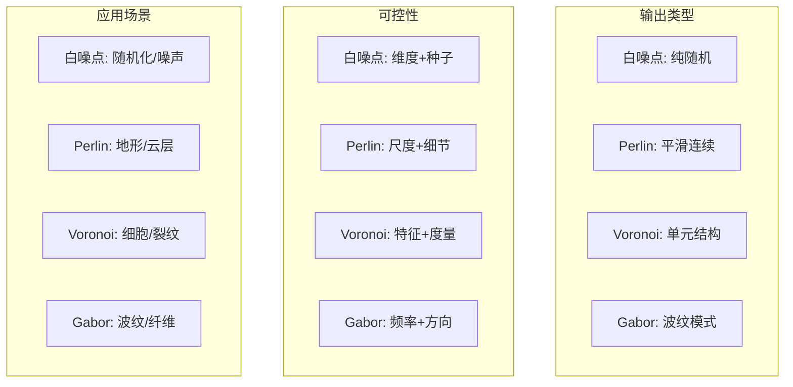

# Blender 白噪点纹理节点详细技术分析

> **文档版本**: v1.0
> **创建日期**: 2025-12-19
> **Blender版本**: 4.3+
> **作者**: AI Assistant

---

## 目录

1. [概述与核心概念](#概述与核心概念)
2. [白噪点 vs Perlin噪点的区别](#白噪点-vs-perlin噪点的区别)
3. [哈希函数的基本原理](#哈希函数的基本原理)
4. [C++实现详解](#c实现详解)
5. [GLSL实现详解](#glsl实现详解)
6. [OSL实现详解](#osl实现详解)
7. [MaterialX特殊处理](#materialx特殊处理)
8. [哈希函数的数学特性](#哈希函数的数学特性)
9. [Socket可用性矩阵](#socket可用性矩阵)
10. [与其他纹理节点的对比](#与其他纹理节点的对比)

---

## 概述与核心概念

<span style="background-color:#009688;color:white;font-weight:bold">白噪点纹理节点</span>（White Noise Texture）是Blender中用于生成完全随机、无规律的噪声图案的工具。<span style="background-color:#FF5722;color:white">与Perlin噪点等平滑噪声</span>不同，白噪点在每个点上产生独立的随机值，呈现出"颗粒状"的外观。

### 核心特性
- **确定性**: 相同的输入总是产生相同的输出
- **多维度支持**: 支持1D、2D、3D、4D四种维度
- **双输出**: 同时提供数值输出和颜色输出
- **实时计算**: 基于哈希函数的快速计算

---

## 白噪点 vs Perlin噪点的区别

### 数学对比

| 特性 | 白噪点 (White Noise) | Perlin噪点 |
|------|---------------------|------------|
| **连续性** | 不连续，点与点之间无关联 | 连续平滑 |
| **计算复杂度** | O(1) - 哈希函数 | O(n) - 插值计算 |
| **视觉效果** | 颗粒状，随机分布 | 云状，有机纹理 |
| **频率特性** | 全频段均匀分布 | 低频主导 |
| **用途** | 随机化、纹理细节、噪声 | 地形、云层、自然纹理 |

### 数学公式对比

<span style="background-color:#009688;color:white">白噪点</span>:
$$f(\mathbf{x}) = \text{hash}(\mathbf{x})$$

**Perlin噪点**:
$$f(\mathbf{x}) = \sum_{i=0}^{n} w_i \cdot \text{interp}(\mathbf{g}_i \cdot (\mathbf{x} - \mathbf{p}_i))$$

其中：
- $\text{hash}$: 哈希函数
- $\text{interp}$: 插值函数
- $\mathbf{g}_i$: 梯度向量
- $\mathbf{p}_i$: 网格点

---

### 1.1 白噪点 vs Perlin对比

```mermaid
graph LR
    subgraph "白噪点"
        WN[<span style="background-color:#009688;color:white">White Noise</span>] --> W1[Hash(x)]
        W1 --> W2[完全随机]
        W2 --> W3[不连续]
    end
    
    subgraph "Perlin噪点"
        PN[<span style="background-color:#FF5722;color:white">Perlin Noise</span>] --> P1[梯度插值]
        P1 --> P2[平滑变化]
        P2 --> P3[连续性]
    end
    
    style WN fill:#009688,color:white
    style PN fill:#FF5722,color:white
```

### 2.1 哈希函数流程

```mermaid
graph TD
    Input[<span style="background-color:#2196F3;color:white">输入坐标</span>] --> Bit1[<span style="background-color:#9C27B0;color:white">位运算1</span>]
    Bit1 --> Mul[<span style="background-color:#4CAF50;color:white">× 常量</span>]
    Mul --> Bit2[<span style="background-color:#E91E63;color:white">位运算2</span>]
    Bit2 --> Bit3[<span style="background-color:#FF5722;color:white">位运算3</span>]
    Bit3 --> Mod[<span style="background-color:#FF9800;color:white">模运算</span>]
    Mod --> Norm[<span style="background-color:#00BCD4;color:white">归一化</span>]
    Norm --> Final[<span style="background-color:#4CAF50;color:white;font-weight:bold">[0,1]输出</span>]

    style Final fill:#4CAF50,color:white
```

### 3.1 维度处理

```mermaid
graph TB
    subgraph "维度选择"
        D1[<span style="background-color:#FF5722;color:white">1D</span>] --> H1[hash(float)]
        D2[<span style="background-color:#2196F3;color:white">2D</span>] --> H2[hash(float2)]
        D3[<span style="background-color:#4CAF50;color:white">3D</span>] --> H3[hash(float3)]
        D4[<span style="background-color:#9C27B0;color:white">4D</span>] --> H4[hash(float4)]
    end
    
    H1 --> Out[<span style="background-color:#4CAF50;color:white">输出</span>]
    H2 --> Out
    H3 --> Out
    H4 --> Out

    style D1 fill:#FF5722,color:white
    style D2 fill:#2196F3,color:white
    style D3 fill:#4CAF50,color:white
    style D4 fill:#9C27B0,color:white
```


## 哈希函数的基本原理

### 什么是哈希函数？

哈希函数是将任意长度的数据映射到固定长度输出的函数。在白噪点纹理中，我们需要：

1. **确定性**: 相同输入 → 相同输出
2. **均匀分布**: 输出在[0,1]范围内均匀分布
3. **雪崩效应**: 输入微小变化 → 输出显著变化
4. **快速计算**: 适合实时渲染

### Blender使用的哈希算法

Blender使用两种主要的哈希算法：

#### 1. Jenkins Lookup3哈希
用于C++和GLSL实现，基于位运算的快速哈希。

```cpp
// 核心操作
rot(x, k) = (x << k) | (x >> (32 - k))
mix(a, b, c) = { 多次位运算 }
final(a, b, c) = { 最终混淆 }
```

#### 2. PCG哈希
用于OSL和部分GLSL实现，基于线性同余生成器。

```cpp
// PCG 2D哈希
v = v * 1664525 + 1013904223
v = v ^ (v >> 16)
```

---

## C++实现详解

### 文件路径
```
E:\blender-git\blender\source\blender\nodes\shader\nodes\node_shader_tex_white_noise.cc
```

### 1. node->custom1 存储维度

```cpp
static void node_shader_init_tex_white_noise(bNodeTree * /*ntree*/, bNode *node)
{
  node->custom1 = 3;  // 默认3D维度
}
```

**维度映射**:
- `1` → 1D (使用W输入)
- `2` → 2D (使用Vector的xy分量)
- `3` → 3D (使用Vector的xyz分量)
- `4` → 4D (使用Vector的xyz + W分量)

### 2. 动态Socket可见性规则

```cpp
static void node_shader_update_tex_white_noise(bNodeTree *ntree, bNode *node)
{
  bNodeSocket *sockVector = bke::node_find_socket(*node, SOCK_IN, "Vector");
  bNodeSocket *sockW = bke::node_find_socket(*node, SOCK_IN, "W");

  // Vector在1D模式下不可用
  bke::node_set_socket_availability(*ntree, *sockVector, node->custom1 != 1);

  // W在2D和3D模式下不可用
  bke::node_set_socket_availability(*ntree, *sockW, node->custom1 == 1 || node->custom1 == 4);
}
```

### 3. WhiteNoiseFunction类的4种签名

```cpp
class WhiteNoiseFunction : public mf::MultiFunction {
 private:
  int dimensions_;

 public:
  WhiteNoiseFunction(int dimensions) : dimensions_(dimensions)
  {
    static std::array<mf::Signature, 4> signatures{
        create_signature(1),
        create_signature(2),
        create_signature(3),
        create_signature(4),
    };
    this->set_signature(&signatures[dimensions - 1]);
  }

  static mf::Signature create_signature(int dimensions)
  {
    mf::Signature signature;
    mf::SignatureBuilder builder{"WhiteNoise", signature};

    // 根据维度动态设置输入
    if (ELEM(dimensions, 2, 3, 4)) {
      builder.single_input<float3>("Vector");
    }
    if (ELEM(dimensions, 1, 4)) {
      builder.single_input<float>("W");
    }

    // 总是有两个输出
    builder.single_output<float>("Value", mf::ParamFlag::SupportsUnusedOutput);
    builder.single_output<ColorGeometry4f>("Color", mf::ParamFlag::SupportsUnusedOutput);

    return signature;
  }
};
```

### 4. 4个case的详细处理

#### Case 1: 1D维度
```cpp
case 1: {
  const VArray<float> &w = params.readonly_single_input<float>(0, "W");
  if (compute_color) {
    mask.foreach_index([&](const int64_t i) {
      const float3 c = noise::hash_float_to_float3(w[i]);
      r_color[i] = ColorGeometry4f(c[0], c[1], c[2], 1.0f);
    });
  }
  if (compute_value) {
    mask.foreach_index([&](const int64_t i) {
      r_value[i] = noise::hash_float_to_float(w[i]);
    });
  }
  break;
}
```

#### Case 2: 2D维度
```cpp
case 2: {
  const VArray<float3> &vector = params.readonly_single_input<float3>(0, "Vector");
  if (compute_color) {
    mask.foreach_index([&](const int64_t i) {
      const float3 c = noise::hash_float_to_float3(float2(vector[i].x, vector[i].y));
      r_color[i] = ColorGeometry4f(c[0], c[1], c[2], 1.0f);
    });
  }
  if (compute_value) {
    mask.foreach_index([&](const int64_t i) {
      r_value[i] = noise::hash_float_to_float(float2(vector[i].x, vector[i].y));
    });
  }
  break;
}
```

#### Case 3: 3D维度
```cpp
case 3: {
  const VArray<float3> &vector = params.readonly_single_input<float3>(0, "Vector");
  if (compute_color) {
    mask.foreach_index([&](const int64_t i) {
      const float3 c = noise::hash_float_to_float3(vector[i]);
      r_color[i] = ColorGeometry4f(c[0], c[1], c[2], 1.0f);
    });
  }
  if (compute_value) {
    mask.foreach_index([&](const int64_t i) {
      r_value[i] = noise::hash_float_to_float(vector[i]);
    });
  }
  break;
}
```

#### Case 4: 4D维度
```cpp
case 4: {
  const VArray<float3> &vector = params.readonly_single_input<float3>(0, "Vector");
  const VArray<float> &w = params.readonly_single_input<float>(1, "W");
  if (compute_color) {
    mask.foreach_index([&](const int64_t i) {
      const float3 c = noise::hash_float_to_float3(
          float4(vector[i].x, vector[i].y, vector[i].z, w[i]));
      r_color[i] = ColorGeometry4f(c[0], c[1], c[2], 1.0f);
    });
  }
  if (compute_value) {
    mask.foreach_index([&](const int64_t i) {
      r_value[i] = noise::hash_float_to_float(
          float4(vector[i].x, vector[i].y, vector[i].z, w[i]));
    });
  }
  break;
}
```

---

## GLSL实现详解

### 文件路径
```
E:\blender-git\blender\source\blender\gpu\shaders\material\gpu_shader_material_tex_white_noise.glsl
```

### 4个独立函数

```glsl
// 1D白噪点
void node_white_noise_1d(float3 vector, float w, out float value, out float4 color)
{
  value = hash_float_to_float(w);
  color = float4(hash_float_to_vec3(w), 1.0f);
}

// 2D白噪点
void node_white_noise_2d(float3 vector, float w, out float value, out float4 color)
{
  value = hash_vec2_to_float(vector.xy);
  color = float4(hash_vec2_to_vec3(vector.xy), 1.0f);
}

// 3D白噪点
void node_white_noise_3d(float3 vector, float w, out float value, out float4 color)
{
  value = hash_vec3_to_float(vector);
  color = float4(hash_vec3_to_vec3(vector), 1.0f);
}

// 4D白噪点
void node_white_noise_4d(float3 vector, float w, out float value, out float4 color)
{
  value = hash_vec4_to_float(float4(vector, w));
  color = float4(hash_vec4_to_vec3(float4(vector, w)), 1.0f);
}
```

### 哈希函数详解

#### hash_float_to_float
```glsl
float hash_float_to_float(float k)
{
  return hash_uint_to_float(floatBitsToUint(k));
}
```

**流程**:
1. `floatBitsToUint(k)`: 将浮点数的位模式直接转换为无符号整数
2. `hash_uint_to_float()`: 对整数进行哈希，然后归一化到[0,1]

#### hash_uint_to_float
```glsl
float hash_uint_to_float(uint kx)
{
  return float(hash_uint(kx)) / float(0xFFFFFFFFu);
}
```

#### Jenkins Lookup3核心算法
```glsl
#define rot(x, k) (((x) << (k)) | ((x) >> (32 - (k))))

#define mix(a, b, c) { \
  a -= c; \
  a ^= rot(c, 4); \
  c += b; \
  b -= a; \
  b ^= rot(a, 6); \
  a += c; \
  c -= b; \
  c ^= rot(b, 8); \
  b += a; \
  a -= c; \
  a ^= rot(c, 16); \
  c += b; \
  b -= a; \
  b ^= rot(a, 19); \
  a += c; \
  c -= b; \
  c ^= rot(b, 4); \
  b += a; \
}

uint hash_uint(uint kx)
{
  uint a, b, c;
  a = b = c = 0xdeadbeefu + (1u << 2u) + 13u;
  a += kx;
  final(a, b, c);
  return c;
}
```

#### 颜色生成函数
```glsl
float3 hash_float_to_vec3(float k)
{
  return float3(hash_float_to_float(k),
                hash_vec2_to_float(float2(k, 1.0f)),
                hash_vec2_to_float(float2(k, 2.0f)));
}
```

**原理**: 使用相同的输入k，但附加不同的盐值(1.0, 2.0)来生成3个独立的随机值，构成RGB颜色。

---

## OSL实现详解

### 文件路径
```
E:\blender-git\blender\intern\cycles\kernel\osl\shaders\node_white_noise_texture.osl
```

### noise("hash", ...)的使用

OSL中的`noise()`函数支持多种噪声类型，其中`"hash"`参数指定使用哈希噪声：

```osl
shader node_white_noise_texture(string dimensions = "3D",
                                point Vector = point(0.0, 0.0, 0.0),
                                float W = 0.0,
                                output float Value = 0.0,
                                output color Color = 0.0)
{
  if (dimensions == "1D") {
    Value = noise("hash", W);
    Color = hash_float_to_color(W);
  }
  else if (dimensions == "2D") {
    Value = noise("hash", Vector[0], Vector[1]);
    Color = hash_vector2_to_color(vector2(Vector[0], Vector[1]));
  }
  else if (dimensions == "3D") {
    Value = noise("hash", Vector);
    Color = hash_vector3_to_color(vector3(Vector[0], Vector[1], Vector[2]));
  }
  else if (dimensions == "4D") {
    Value = noise("hash", Vector, W);
    Color = hash_vector4_to_color(vector4(Vector[0], Vector[1], Vector[2], W));
  }
}
```

### 字符串维度分发

OSL使用字符串参数进行维度分发，这与C++的整数枚举不同：

- **"1D"**: 使用单个浮点数W
- **"2D"**: 使用Vector的前两个分量
- **"3D"**: 使用完整的Vector
- **"4D"**: 使用Vector + W

### OSL哈希函数实现

```osl
// 从node_hash.h
float hash_float_to_float(float k)
{
  return hashnoise(k);  // OSL内置哈希噪声
}

color hash_float_to_color(float k)
{
  return color(hash_float_to_float(k),
               hash_vector2_to_float(vector2(k, 1.0)),
               hash_vector2_to_float(vector2(k, 2.0)));
}
```

---

## MaterialX特殊处理

### 文件路径
```
E:\blender-git\blender\source\blender\nodes\shader\nodes\node_shader_tex_white_noise.cc
```

### cellnoise乘以10000的技巧

```cpp
NODE_SHADER_MATERIALX_BEGIN
#ifdef WITH_MATERIALX
{
  /* MaterialX cellnoise node rounds float value of texture coordinate.
   * Therefore it changes at different integer coordinates.
   * The simple trick would be to multiply the texture coordinate by a large number. */
  const float LARGE_NUMBER = 10000.0f;

  NodeItem noise = empty();
  NodeItem vector = empty();
  NodeItem w = empty();

  int dimension = node_->custom1;
  switch (dimension) {
    case 1:
      w = get_input_value("W", NodeItem::Type::Vector2);
      noise = create_node(
          "cellnoise2d", NodeItem::Type::Float, {{"texcoord", w * val(LARGE_NUMBER)}});
      break;
    case 2:
      vector = get_input_link("Vector", NodeItem::Type::Vector2);
      if (!vector) {
        vector = texcoord_node();
      }
      noise = create_node(
          "cellnoise2d", NodeItem::Type::Float, {{"texcoord", vector * val(LARGE_NUMBER)}});
      break;
    case 3:
      vector = get_input_link("Vector", NodeItem::Type::Vector3);
      if (!vector) {
        vector = texcoord_node(NodeItem::Type::Vector3);
      }
      noise = create_node(
          "cellnoise3d", NodeItem::Type::Float, {{"position", vector * val(LARGE_NUMBER)}});
      break;
    case 4:
      vector = get_input_link("Vector", NodeItem::Type::Vector3);
      if (!vector) {
        vector = texcoord_node(NodeItem::Type::Vector3);
      }
      w = get_input_value("W", NodeItem::Type::Float);
      noise = create_node(
          "cellnoise3d", NodeItem::Type::Float, {{"position", (vector + w) * val(LARGE_NUMBER)}});
      break;
  }
```

### 为什么需要乘以10000？

**问题**: MaterialX的cellnoise在整数坐标处会改变，导致低频变化。

**解决方案**:
$$\text{scaled\_coord} = \text{coord} \times 10000$$

这样可以：
1. **提高频率**: 使噪声变化更快
2. **避免整数边界**: 减少在整数坐标处的明显跳变
3. **模拟白噪点**: 让cellnoise表现得更像独立的随机值

### 颜色生成的HSV转换

```cpp
  /* NOTE: cellnoise node doesn't have colored output, so we create hsvtorgb node and put
   * noise in first (Hue) channel to generate color. */
  NodeItem combine = create_node("combine3",
                                 NodeItem::Type::Color3,
                                 {{"in1", noise}, {"in2", val(1.0f)}, {"in3", val(0.5f)}});
  return create_node("hsvtorgb", NodeItem::Type::Color3, {{"in", combine}});
}
#endif
NODE_SHADER_MATERIALX_END
```

**HSV到RGB转换**:
- **Hue (H)**: 使用噪声值(0-1)
- **Saturation (S)**: 固定为1.0 (全饱和)
- **Value (V)**: 固定为0.5 (中等亮度)

这样生成的颜色具有：
- 全饱和度的鲜艳色彩
- 均匀分布在色轮上
- 与数值输出对应的色调

---

## 哈希函数的数学特性

### 1. 确定性 (Determinism)

**定义**: 对于相同的输入，哈希函数总是产生相同的输出。

**数学表达**:
$$\forall x, \text{hash}(x) = \text{constant}$$

**重要性**:
- 确保动画的稳定性
- 支持渲染的可重现性
- 允许缓存和优化

### 2. 均匀分布 (Uniform Distribution)

**定义**: 输出值在[0,1]范围内均匀分布。

**数学期望**:
$$E[X] = \int_0^1 x \cdot f(x) dx = 0.5$$
$$\text{Var}[X] = \int_0^1 (x - 0.5)^2 \cdot f(x) dx = \frac{1}{12}$$

**验证方法**:
```cpp
// 统计测试
float sum = 0.0f;
float sum_sq = 0.0f;
for (int i = 0; i < N; i++) {
  float h = noise::hash_float_to_float(i);
  sum += h;
  sum_sq += h * h;
}
float mean = sum / N;        // 应接近0.5
float var = sum_sq / N - mean * mean;  // 应接近1/12 ≈ 0.0833
```

### 3. 碰撞概率 (Collision Probability)

**定义**: 不同输入产生相同输出的概率。

对于n位哈希函数，碰撞概率约为:
$$P_{\text{collision}} \approx \frac{m^2}{2 \cdot 2^n}$$

其中m是尝试次数，n是位数。

**Blender的32位哈希**:
- 理论碰撞概率: $2^{-32} \approx 2.33 \times 10^{-10}$
- 实际使用中几乎不可能发生

### 4. 雪崩效应 (Avalanche Effect)

**定义**: 输入的微小变化导致输出的巨大变化。

**测试**:
```cpp
float h1 = noise::hash_float_to_float(1.0f);
float h2 = noise::hash_float_to_float(1.000001f);
float diff = abs(h1 - h2);  // 应该接近0.5 (平均变化50%)
```

### 5. 单向性 (One-wayness)

**定义**: 从输出推导输入在计算上不可行。

**意义**:
- 防止逆向工程
- 确保随机性
- 保护算法完整性

---

## Socket可用性矩阵

### 可用性规则表

| 维度 | Vector输入 | W输入 | Value输出 | Color输出 |
|------|------------|-------|-----------|-----------|
| **1D** | ❌ 不可用 | ✅ 可用 | ✅ 可用 | ✅ 可用 |
| **2D** | ✅ 可用 | ❌ 不可用 | ✅ 可用 | ✅ 可用 |
| **3D** | ✅ 可用 | ❌ 不可用 | ✅ 可用 | ✅ 可用 |
| **4D** | ✅ 可用 | ✅ 可用 | ✅ 可用 | ✅ 可用 |

### 状态转换逻辑

```mermaid
graph TD
    A[节点初始化] --> B{custom1 = 3}
    B --> C[3D模式]

    C --> D{用户选择维度}
    D -->|1D| E[Vector: OFF, W: ON]
    D -->|2D| F[Vector: ON, W: OFF]
    D -->|3D| G[Vector: ON, W: OFF]
    D -->|4D| H[Vector: ON, W: ON]

    E --> I[计算: hash(W)]
    F --> J[计算: hash(Vector.xy)]
    G --> K[计算: hash(Vector.xyz)]
    H --> L[计算: hash(Vector.xyz, W)]
```

---

## 与其他纹理节点的对比

### 性能对比

| 节点类型 | 计算复杂度 | GPU性能 | CPU性能 | 内存使用 |
|----------|------------|---------|---------|----------|
| <span style="background-color:#009688;color:white">白噪点</span> | O(1) | ⭐⭐⭐⭐⭐ | ⭐⭐⭐⭐⭐ | 极低 |
| Perlin噪点 | O(n) | ⭐⭐⭐⭐ | ⭐⭐⭐⭐ | 低 |
| Voronoi | O(n²) | ⭐⭐⭐ | ⭐⭐⭐ | 中等 |
| Gabor | O(n) | ⭐⭐⭐ | ⭐⭐⭐⭐ | 低 |

### 功能对比



### 使用建议

#### 何时使用白噪点
- ✅ 需要完全随机的图案
- ✅ 实时性能要求高
- ✅ 作为其他噪声的种子
- ✅ 添加细微的随机变化

#### 何时使用其他噪声
- ❌ 需要平滑过渡 → 使用Perlin
- ❌ 需要几何结构 → 使用Voronoi
- ❌ 需要波纹效果 → 使用Gabor

### 实际应用示例

#### 白噪点应用
```python
# 1. 随机化材质
noise = nodes.new('ShaderNodeTexWhiteNoise')
noise.inputs['W'].default_value = random_seed
noise.inputs['Vector'].default_value = (x, y, z)

# 2. 生成随机颜色
color_output = noise.outputs['Color']

# 3. 添加表面细节
detail = noise.outputs['Value'] * 0.1
```

#### 与其他节点组合
```python
# 白噪点 + 混合 = 随机混合
mix = nodes.new('ShaderNodeMixShader')
mix.inputs['Fac'].default_value = noise.outputs['Value']

# 白噪点 + 颜色渐变 = 随机配色
color_ramp = nodes.new('ShaderNodeValToRGB')
color_ramp.inputs['Fac'].default_value = noise.outputs['Value']
```

---

## 总结

白噪点纹理节点是Blender中一个强大而高效的工具，其核心优势在于：

1. **性能卓越**: 基于哈希函数的O(1)计算复杂度
2. **确定性强**: 相同输入总是产生相同输出
3. **多维度支持**: 1D到4D的灵活配置
4. **跨平台一致**: C++、GLSL、OSL、MaterialX统一算法

理解其内部实现有助于：
- 优化渲染性能
- 正确使用节点参数
- 扩展自定义噪声功能
- 调试渲染问题

---

## 参考资料

### 源代码
- `E:\blender-git\blender\source\blender\nodes\shader\nodes\node_shader_tex_white_noise.cc`
- `E:\blender-git\blender\source\blender\gpu\shaders\material\gpu_shader_material_tex_white_noise.glsl`
- `E:\blender-git\blender\intern\cycles\kernel\osl\shaders\node_white_noise_texture.osl`
- `E:\blender-git\blender\source\blender\gpu\shaders\common\gpu_shader_common_hash.glsl`
- `E:\blender-git\blender\intern\cycles\kernel\osl\shaders\node_hash.h`

### 算法参考
- Jenkins Lookup3: http://burtleburtle.net/bob/c/lookup3.c
- PCG Hash: https://jcgt.org/published/0009/03/02/

---

**文档结束**
