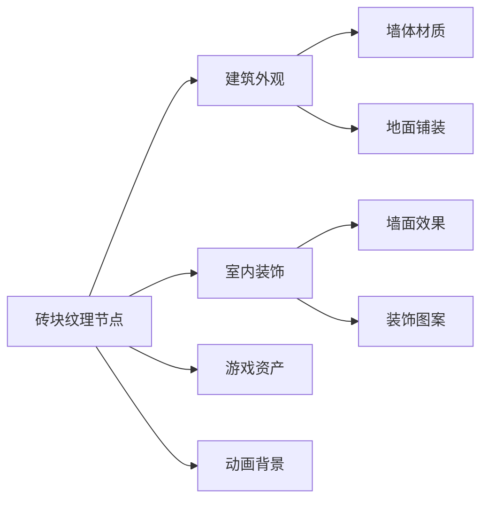
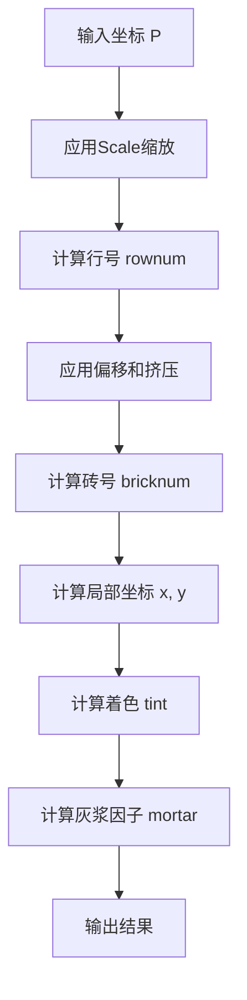
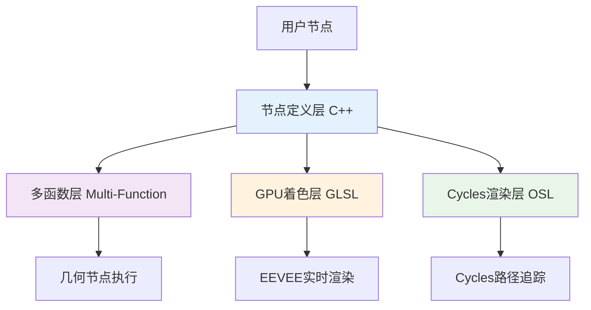
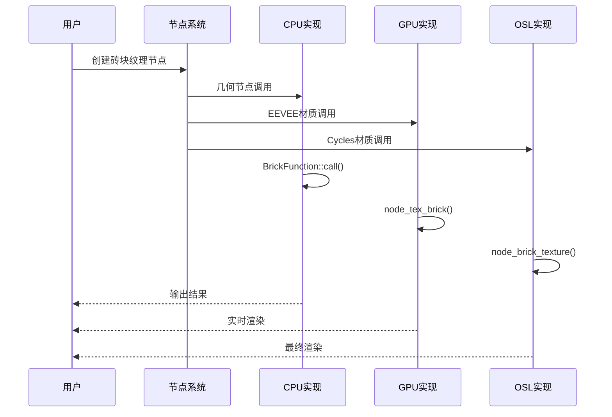

# 01. 砖块纹理节点详解

## 目录
- [1. 砖块纹理节点概述](#1-砖块纹理节点概述)
- [2. 节点输入输出接口详解](#2-节点输入输出接口详解)
- [3. 砖块纹理算法原理](#3-砖块纹理算法原理)
- [4. 多平台支持架构](#4-多平台支持架构)
- [5. 文件间调用关系](#5-文件间调用关系)
- [6. 源码文件详细分析](#6-源码文件详细分析)
- [7. 核心算法数学原理](#7-核心算法数学原理)
- [8. 性能优化与实现技巧](#8-性能优化与实现技巧)
- [9. 扩展与自定义](#9-扩展与自定义)

---

## 1. 砖块纹理节点概述

<span style="background-color: #e3f2fd; color: #1565c0; padding: 4px 8px; border-radius: 4px;">**砖块纹理节点**</span> 是Blender中一个<span style="color: #d32f2f; font-weight: bold;">程序化纹理生成器</span>，用于模拟砖墙的视觉效果。该节点通过数学算法生成规则的砖块图案，支持多种参数调整以创建不同风格的砖墙纹理。

### 1.1 节点功能特性

🔸 **程序化生成**: 完全基于数学算法，无需图像资源  
🔸 **参数化控制**: 支持砖块尺寸、颜色、灰浆等多项参数  
🔸 **多平台兼容**: 同时支持几何节点、材质节点（EEVEE/Cycles）和合成器  
🔸 **实时渲染**: 支持GPU加速，可在视口中实时预览  

### 1.2 应用场景



---

## 2. 节点输入输出接口详解

### 2.1 输入接口参数

| 参数名 | 类型 | 默认值 | 范围 | 描述 |
|--------|------|--------|------|------|
| **Vector** | 向量 | - | [-10000, 10000] | 纹理坐标输入 |
| **Color1** | 颜色 | (0.8, 0.8, 0.8, 1.0) | [0, 1] | 第一种砖块颜色 |
| **Color2** | 颜色 | (0.2, 0.2, 0.2, 1.0) | [0, 1] | 第二种砖块颜色 |
| **Mortar** | 颜色 | (0.0, 0.0, 0.0, 1.0) | [0, 1] | 灰浆颜色 |
| **Scale** | 浮点 | 5.0 | [-1000, 1000] | 纹理缩放 |
| **Mortar Size** | 浮点 | 0.02 | [0, 0.125] | 灰浆宽度 |
| **Mortar Smooth** | 浮点 | 0.1 | [0, 1] | 灰浆边缘平滑度 |
| **Bias** | 浮点 | 0.0 | [-1, 1] | 颜色偏置 |
| **Brick Width** | 浮点 | 0.5 | [0.01, 100] | 砖块宽度比 |
| **Row Height** | 浮点 | 0.25 | [0.01, 100] | 行高比 |

### 2.2 输出接口计算

#### 2.2.1 Color 输出

<span style="background-color: #fff3e0; color: #e65100;">**Color输出**</span> 是最终的纹理颜色，其计算公式为：

$$
\text{Color}_{\text{final}} = 
\begin{cases}
\text{Mortar} & \text{if } \text{Factor} = 1.0 \\
\text{Color}_{\text{mixed}} \times (1 - \text{Factor}) + \text{Mortar} \times \text{Factor} & \text{otherwise}
\end{cases}
$$

其中：
$$
\text{Color}_{\text{mixed}} = \text{Color1} \times (1 - \text{Tint}) + \text{Color2} \times \text{Tint}
$$

#### 2.2.2 Factor 输出

<span style="background-color: #f3e5f5; color: #7b1fa2;">**Factor输出**</span> 表示灰浆区域的强度，取值范围 [0, 1]：

- <span style="color: #2e7d32;">**0.0**</span>: 完全在砖块区域
- <span style="color: #d32f2f;">**1.0**</span>: 完全在灰浆区域  
- <span style="color: #ed6c02;">**0.0-1.0**</span>: 灰浆边缘过渡区域

---

## 3. 砖块纹理算法原理

### 3.1 砖块网格生成算法

砖块纹理的核心是一个<span style="background-color: #e8f5e8; padding: 2px 6px; border-radius: 3px;">**2D网格划分算法**</span>，其流程如下：



### 3.2 核心计算步骤

#### 步骤1: 坐标变换与缩放
```cpp
// source/blender/nodes/shader/nodes/node_shader_tex_brick.cc:250
const float2 f2 = brick(vector[i] * scale[i], ...);
```

将输入坐标向量乘以缩放因子，调整纹理密度。

#### 步骤2: 行号计算
```cpp
// source/blender/nodes/shader/nodes/node_shader_tex_brick.cc:195
const int rownum = int(floorf(p.y / row_height));
```
$$
\text{rownum} = \left\lfloor \frac{p_y}{\text{RowHeight}} \right\rfloor
$$

#### 步骤3: 偏移与挤压处理
```cpp
// source/blender/nodes/shader/nodes/node_shader_tex_brick.cc:197-200
if (offset_frequency && squash_frequency) {
  brick_width *= (rownum % squash_frequency) ? 1.0f : squash_amount;
  offset = (rownum % offset_frequency) ? 0.0f : (brick_width * offset_amount);
}
```

这个逻辑实现了砖块的<span style="color: #0288d1; font-weight: bold;">**交错排列**</span>效果，模拟真实砖墙的砌筑模式。

#### 步骤4: 砖号计算
```cpp
// source/blender/nodes/shader/nodes/node_shader_tex_brick.cc:202
const int bricknum = int(floorf((p.x + offset) / brick_width));
```
$$
\text{bricknum} = \left\lfloor \frac{p_x + \text{offset}}{\text{BrickWidth}} \right\rfloor
$$

#### 步骤5: 局部坐标计算
```cpp
// source/blender/nodes/shader/nodes/node_shader_tex_brick.cc:204-205
const float x = (p.x + offset) - brick_width * bricknum;
const float y = p.y - row_height * rownum;
```

#### 步骤6: 着色计算
```cpp
// source/blender/nodes/shader/nodes/node_shader_tex_brick.cc:207-208
const float tint = clamp_f(
    brick_noise((rownum << 16) + (bricknum & 0xFFFF)) + bias, 0.0f, 1.0f);
```

这里使用了一个<span style="background-color: #fffde7; color: #f57f17;">**快速整数噪声函数**</span>为每个砖块生成随机着色。

#### 步骤7: 灰浆计算
```cpp
// source/blender/nodes/shader/nodes/node_shader_tex_brick.cc:209-221
float min_dist = std::min({x, y, brick_width - x, row_height - y});
// 根据min_dist和mortar_size计算灰浆因子
```

### 3.3 噪声函数分析

#### 3.3.1 快速整数噪声算法

```cpp
// source/blender/nodes/shader/nodes/node_shader_tex_brick.cc:168-174
static float brick_noise(uint n)
{
  n = (n + 1013) & 0x7fffffff;
  n = (n >> 13) ^ n;
  const uint nn = (n * (n * n * 60493 + 19990303) + 1376312589) & 0x7fffffff;
  return 0.5f * (float(nn) / 1073741824.0f);
}
```

这个函数实现了一个<span style="color: #6a1b9a;">**伪随机数生成器**</span>：

1. **初始处理**: `n = (n + 1013) & 0x7fffffff` 
   - 确保输入为正数
   - 添加1013作为种子偏移
   
2. **位操作混合**: `n = (n >> 13) ^ n`
   - 将高位移位并与原值异或
   - 增加输入的熵
   
3. **多项式哈希**: `n * (n * n * 60493 + 19990303) + 1376312589`
   - 使用三次多项式产生良好的分布
   - 这些质数是经过精心选择的
   
4. **归一化**: 结果映射到 [0, 1] 区间

#### 3.3.2 数学背景

这个噪声函数本质上是基于<span style="background-color: #e1f5fe; padding: 2px 6px; border-radius: 3px;">**线性同余生成器**</span>的变种，但加入了更多非线性操作以提高随机性。

---

## 4. 多平台支持架构

### 4.1 统一节点接口设计

Blender采用了<span style="color: #c62828; font-weight: bold;">**分层架构**</span>来实现同一节点在多个平台的支持：



### 4.2 各平台实现差异

| 平台 | 语言 | 特点 | 优势 |
|------|------|------|------|
| **几何节点** | C++ Multi-Function | CPU多线程 | 高精度、复杂逻辑 |
| **EEVEE** | GLSL | GPU并行 | 实时性能 |
| **Cycles** | OSL | 着色语言 | 物理精确 |

### 4.3 为什么这样设计？

1. <span style="background-color: #e8eaf6; color: #3949ab;">**性能优化**</span>: 各平台使用最适合的计算设备
2. <span style="background-color: #fce4ec; color: #c2185b;">**一致性保证**</span>: 相同算法确保视觉结果一致
3. <span style="background-color: #e0f2f1; color: #00796b;">**可维护性**</span>: 核心逻辑复用，减少重复代码
4. <span style="background-color: #fff8e1; color: #ff8f00;">**扩展性**</span>: 新渲染器可轻松集成

---

## 5. 文件间调用关系

### 5.1 调用链路图



### 5.2 关键文件职责

| 文件 | 职责 | 调用时机 |
|------|------|----------|
| **node_shader_tex_brick.cc** | C++主实现 + 节点注册 | 几何节点、基础框架 |
| **gpu_shader_material_tex_brick.glsl** | GPU着色器实现 | EEVEE实时渲染 |
| **node_brick_texture.osl** | OSL着色器实现 | Cycles路径追踪 |

### 5.3 数据流转过程

1. **初始化阶段**: `node_shader_init_tex_brick()` 创建存储结构
2. **注册阶段**: `register_node_type_sh_tex_brick()` 注册节点类型
3. **执行阶段**: 根据上下文选择对应实现
4. **结果输出**: 统一的Color和Factor接口

---

## 6. 源码文件详细分析

### 6.1 C++主实现文件分析

#### 6.1.1 文件头与命名空间

```cpp
// source/blender/nodes/shader/nodes/node_shader_tex_brick.cc:1-20
#include <algorithm>
#include "node_shader_util.hh"
// ... 其他包含文件

namespace blender::nodes::node_shader_tex_brick_cc {
```

<span style="background-color: #f1f8e9; color: #33691e;">**命名说明**</span>:
- `cc`: <span style="color: #558b2f;">**Compilation Unit**</span> 的缩写
- `node_shader_tex_brick`: 节点类型标识
- 这种命名约定避免链接时的符号冲突

#### 6.1.2 节点声明函数

```cpp
// source/blender/nodes/shader/nodes/node_shader_tex_brick.cc:22-77
static void sh_node_tex_brick_declare(NodeDeclarationBuilder &b)
{
  b.is_function_node();
  b.add_input<decl::Vector>("Vector").min(-10000.0f).max(10000.0f)
    .implicit_field(NODE_DEFAULT_INPUT_POSITION_FIELD);
  // ... 其他输入输出声明
}
```

<span style="color: #1565c0;">**关键特性**</span>:
- `is_function_node()`: 标记为函数节点，支持多函数优化
- `implicit_field()`: 自动绑定几何体位置字段
- 每个输入都有详细的范围限制和描述

#### 6.1.3 UI布局函数

```cpp
// source/blender/nodes/shader/nodes/node_shader_tex_brick.cc:79-95
static void node_shader_buts_tex_brick(ui::Layout &layout, bContext * /*C*/, PointerRNA *ptr)
{
  {
    ui::Layout &col = layout.column(true);
    col.prop(ptr, "offset", ui::ITEM_R_SPLIT_EMPTY_NAME | ui::ITEM_R_SLIDER, 
             IFACE_("Offset"), ICON_NONE);
    col.prop(ptr, "offset_frequency", ui::ITEM_R_SPLIT_EMPTY_NAME, 
             IFACE_("Frequency"), ICON_NONE);
  }
  // ... squash参数
}
```

<span style="background-color: #ffebee; color: #b71c1c;">**UI设计要点**</span>:
- 使用 `column(true)` 创建垂直布局组
- `ITEM_R_SPLIT_EMPTY_NAME` 分离标签和控件
- `IFACE_()` 宏用于国际化支持

#### 6.1.4 多函数实现

```cpp
// source/blender/nodes/shader/nodes/node_shader_tex_brick.cc:133-283
class BrickFunction : public mf::MultiFunction {
  // ... 成员变量
  
  void call(const IndexMask &mask, mf::Params params, mf::Context /*context*/) const override
  {
    // 核心计算逻辑
    mask.foreach_index([&](const int64_t i) {
      const float2 f2 = brick(vector[i] * scale[i], ...);
      // ... 结果计算
    });
  }
};
```

<span style="color: #6a1b9a; font-weight: bold;">**多函数优势**</span>:
1. **批量处理**: 一次性处理多个数据点
2. **SIMD优化**: 自动向量化计算
3. **并行安全**: 支持多线程执行

#### 6.1.5 GPU接口函数

```cpp
// source/blender/nodes/shader/nodes/node_shader_tex_brick.cc:111-131
static int node_shader_gpu_tex_brick(GPUMaterial *mat,
                                     bNode *node,
                                     bNodeExecData * /*execdata*/,
                                     GPUNodeStack *in,
                                     GPUNodeStack *out)
{
  node_shader_gpu_default_tex_coord(mat, node, &in[0].link);
  node_shader_gpu_tex_mapping(mat, node, in, out);
  // ... 参数传递
  return GPU_stack_link(mat, node, "node_tex_brick", in, out, ...);
}
```

<span style="background-color: #e3f2fd; color: #0d47a1;">**GPU集成要点**</span>:
- 处理默认纹理坐标
- 应用纹理变换
- 将参数传递给GPU着色器

### 6.2 GLSL着色器文件分析

#### 6.2.1 砖块计算函数

```glsl
// source/blender/gpu/shaders/material/gpu_shader_material_tex_brick.glsl:7-47
float2 calc_brick_texture(float3 p,
                          float mortar_size,
                          float mortar_smooth,
                          float bias,
                          float brick_width,
                          float row_height,
                          float offset_amount,
                          int offset_frequency,
                          float squash_amount,
                          int squash_frequency)
{
  // 核心算法实现，与C++版本基本一致
  int bricknum, rownum;
  float offset = 0.0f;
  // ... 计算逻辑
  
  float tint = clamp((integer_noise((rownum << 16) + (bricknum & 0xFFFF)) + bias), 0.0, 1.0);
  // ... 灰浆计算
  
  return float2(tint, mortar);
}
```

<span style="color: #f57c00;">**GLSL特性**</span>:
- `float2` 类型：二维向量
- `integer_noise()`: 来自公共噪声库
- 与C++版本算法一致性

#### 6.2.2 主节点函数

```glsl
// source/blender/gpu/shaders/material/gpu_shader_material_tex_brick.glsl:49-84
void node_tex_brick(float3 co,
                    float4 color1,
                    float4 color2,
                    float4 mortar,
                    // ... 其他参数
                    out float4 color,
                    out float fac)
{
  float2 f2 = calc_brick_texture(co * scale, ...);
  float tint = f2.x;
  float f = f2.y;
  
  if (f != 1.0) {
    float facm = 1.0 - tint;
    color1 = facm * color1 + tint * color2;
  }
  
  color = mix(color1, mortar, f);
  fac = f;
}
```

<span style="background-color: #f1f8e9; color: #689f38;">**GLSL优化**</span>:
- 使用内置 `mix()` 函数进行线性插值
- 条件分支优化：避免不必要的计算
- 直接操作 `out` 参数提高效率

### 6.3 OSL着色器文件分析

#### 6.3.1 噪声函数实现

```osl
// intern/cycles/kernel/osl/shaders/node_brick_texture.osl:9-16
float brick_noise(int ns) /* fast integer noise */
{
  int nn;
  int n = (ns + 1013) & 2147483647;
  n = (n >> 13) ^ n;
  nn = (n * (n * n * 60493 + 19990303) + 1376312589) & 2147483647;
  return 0.5 * ((float)nn / 1073741824.0);
}
```

<span style="color: #0277bd;">**OSL差异**</span>:
- 使用32位整数：`2147483647` 而不是 `0x7fffffff`
- C风格类型转换：`(float)nn`
- 与C++版本算法完全相同

#### 6.3.2 着色器主函数

```osl
// intern/cycles/kernel/osl/shaders/node_brick_texture.osl:62-107
shader node_brick_texture(int use_mapping = 0,
                          matrix mapping = matrix(...),
                          float offset = 0.5,
                          // ... 参数
                          output float Fac = 0.0,
                          output color Color = 0.2)
{
  point p = Vector;
  
  if (use_mapping)
    p = transform(mapping, p);
  // ... 核心计算
}
```

<span style="background-color: #fff3e0; color: #e65100;">**OSL特性**</span>:
- `shader` 关键字定义着色器
- `matrix` 类型支持变换矩阵
- `output` 参数定义输出
- 内置坐标变换函数

---

## 7. 核心算法数学原理

### 7.1 砖块网格的数学模型

#### 7.1.1 基础网格划分

砖块纹理基于<span style="background-color: #e8f5e8; color: #1b5e20;">**规则二维网格**</span>，其数学定义为：

给定坐标 $P = (x, y)$，砖块网格定义为：

$$
\begin{align}
\text{rownum} &= \left\lfloor \frac{y}{h} \right\rfloor \\
\text{bricknum} &= \left\lfloor \frac{x + \text{offset}(\text{rownum})}{w(\text{rownum})} \right\rfloor
\end{align}
$$

其中：
- $h$ = RowHeight（行高）
- $w(\text{rownum})$ = 动态砖块宽度
- $\text{offset}(\text{rownum})$ = 行偏移量

#### 7.1.2 动态宽度与偏移

$$
w(\text{rownum}) = \begin{cases}
w_0 \times \text{squash} & \text{if } \text{rownum} \bmod f_s = 0 \\
w_0 & \text{otherwise}
\end{cases}
$$

$$
\text{offset}(\text{rownum}) = \begin{cases}
w(\text{rownum}) \times \text{offset\_amount} & \text{if } \text{rownum} \bmod f_o = 0 \\
0 & \text{otherwise}
\end{cases}
$$

### 7.2 灰浆区域计算

#### 7.2.1 距离函数

对于局部坐标 $(x', y')$ 在砖块内部，到各边距离为：

$$
d = \min(x', y', w - x', h - y')
$$

#### 7.2.2 灰浆强度计算

灰浆因子 $f \in [0, 1]$ 计算为：

$$
f = \begin{cases}
0 & \text{if } d \geq \text{mortar\_size} \\
1 & \text{if } d < \text{mortar\_size} \text{ and } \text{smooth} = 0 \\
\text{smoothstep}(0, \text{smooth}, 1 - \frac{d}{\text{mortar\_size}}) & \text{otherwise}
\end{cases}
$$

### 7.3 平滑函数实现

#### 7.3.1 smoothstep函数

GLSL内置的smoothstep函数：

$$
\text{smoothstep}(a, b, x) = 3t^2 - 2t^3 \quad \text{其中} \quad t = \frac{x - a}{b - a}
$$

#### 7.3.2 自定义实现

```cpp
// source/blender/nodes/shader/nodes/node_shader_tex_brick.cc:176-180
static float smoothstepf(const float f)
{
  const float ff = f * f;
  return (3.0f * ff - 2.0f * ff * f);
}
```

这个实现等价于 $\text{smoothstep}(0, 1, f)$。

### 7.4 颜色混合公式

最终颜色计算：

$$
\begin{align}
C_{\text{brick}} &= (1 - t) \cdot C_1 + t \cdot C_2 \\
C_{\text{final}} &= (1 - f) \cdot C_{\text{brick}} + f \cdot C_{\text{mortar}}
\end{align}
$$

其中：
- $t$ = tint（砖块着色）
- $f$ = factor（灰浆因子）
- $C_1, C_2$ = 输入颜色
- $C_{\text{mortar}}$ = 灰浆颜色

---

## 8. 性能优化与实现技巧

### 8.1 计算优化策略

#### 8.1.1 整数运算优化

```cpp
// source/blender/nodes/shader/nodes/node_shader_tex_brick.cc:168-174
static float brick_noise(uint n)
{
  n = (n + 1013) & 0x7fffffff;           // 避免负数
  n = (n >> 13) ^ n;                     // 位运算比乘法快
  const uint nn = (n * (n * n * 60493 + 19990303) + 1376312589) & 0x7fffffff;
  return 0.5f * (float(nn) / 1073741824.0f);
}
```

<span style="background-color: #fff8e1; color: #ff6f00;">**优化要点**</span>:
- 位运算替代除法
- 预计算常数
- 避免分支预测失败

#### 8.1.2 向量化处理

```cpp
// source/blender/nodes/shader/nodes/node_shader_tex_brick.cc:249-282
mask.foreach_index([&](const int64_t i) {
  // 批量处理多个元素，有利于SIMD优化
  const float2 f2 = brick(vector[i] * scale[i], ...);
  // ...
});
```

### 8.2 内存访问优化

#### 8.2.1 数据局部性

- 输入参数按访问顺序排列
- 使用引用避免不必要拷贝
- 连续内存访问模式

#### 8.2.2 缓存友好设计

```cpp
// source/blender/nodes/shader/nodes/node_shader_tex_brick.cc:242-244
MutableSpan<ColorGeometry4f> r_color =
    params.uninitialized_single_output_if_required<ColorGeometry4f>(10, "Color");
MutableSpan<float> r_fac =
    params.uninitialized_single_output_if_required<float>(11, "Fac");
```

使用 `uninitialized_single_output_if_required` 避免不必要的初始化开销。

### 8.3 GPU优化技巧

#### 8.3.1 着色器优化

```glsl
// source/blender/gpu/shaders/material/gpu_shader_material_tex_brick.glsl:36-46
float min_dist = min(min(x, y), min(brick_width - x, row_height - y));
if (min_dist >= mortar_size) {
  return float2(tint, 0.0);
}
else if (mortar_smooth == 0.0) {
  return float2(tint, 1.0);
}
```

<span style="color: #00796b;">**优化策略**</span>:
- 早期返回减少计算
- 条件分支优化
- 避免不必要的数据转换

#### 8.3.2 并行计算

GPU着色器天然支持大规模并行计算，每个像素/片段独立计算，充分利用GPU的并行性。

---

## 9. 扩展与自定义

### 9.1 添加新的砖块模式

#### 9.1.1 扩展参数结构

```cpp
// 可在 NodeTexBrick 结构中添加
typedef struct NodeTexBrick {
  TexMapping base;
  ColorMapping color_mapping;
  
  // 现有参数...
  float offset;
  int offset_freq;
  float squash;
  int squash_freq;
  
  // 新增参数
  int brick_pattern;  // 砖块模式类型
  float roundness;    // 圆角程度
  int crack_enable;   // 裂纹效果开关
} NodeTexBrick;
```

#### 9.1.2 模式枚举

```cpp
enum BrickPattern {
  BRICK_PATTERN_STANDARD = 0,
  BRICK_PATTERN_HERRINGBONE = 1,
  BRICK_PATTERN_BASKET = 2,
  BRICK_PATTERN_CUSTOM = 3
};
```

### 9.2 自定义噪声函数

可以替换现有的 `brick_noise` 函数以获得不同的效果：

```cpp
// Perlin噪声版本
static float perlin_brick_noise(int ns)
{
  float x = ns * 0.1f;
  float y = (ns >> 10) * 0.1f;
  return perlin_noise_2d(x, y);
}

// Worley噪声版本  
static float worley_brick_noise(int ns)
{
  float x = (ns & 0xFFFF) * 0.1f;
  float y = (ns >> 16) * 0.1f;
  return worley_noise_2d(x, y);
}
```

### 9.3 实现新的着色器

#### 9.3.1 几何节点扩展

```cpp
class AdvancedBrickFunction : public mf::MultiFunction {
  // 实现更复杂的砖块算法
  void call(const IndexMask &mask, mf::Params params, mf::Context context) const override
  {
    // 支持圆角、裂纹、风化效果
  }
};
```

#### 9.3.2 GPU着色器扩展

```glsl
// 高级砖块计算
float2 calc_advanced_brick_texture(float3 p, int pattern, float roundness, ...)
{
  if (pattern == BRICK_PATTERN_HERRINGBONE) {
    // 人字形模式
    return calc_herringbone_pattern(p, ...);
  }
  else if (pattern == BRICK_PATTERN_BASKET) {
    // 编篮模式
    return calc_basket_pattern(p, ...);
  }
  // ...
}
```

### 9.4 性能监控与调试

#### 9.4.1 添加性能分析

```cpp
// 添加计时宏
#define PERF_START(name) auto start_##name = std::chrono::high_resolution_clock::now()
#define PERF_END(name) \
  do { \
    auto end_##name = std::chrono::high_resolution_clock::now(); \
    auto duration = std::chrono::duration_cast<std::chrono::microseconds>(end_##name - start_##name); \
    std::cout << #name << " took: " << duration.count() << " microseconds\n"; \
  } while(0)

// 在关键函数中使用
void call(const IndexMask &mask, mf::Params params, mf::Context context) const override
{
  PERF_START(brick_function);
  // 核心计算...
  PERF_END(brick_function);
}
```

#### 9.4.2 调试输出

```cpp
// 条件编译的调试输出
#ifdef DEBUG_BRICK_TEXTURE
  printf("Brick[%d, %d]: tint=%.3f, mortar=%.3f\n", 
         rownum, bricknum, tint, mortar);
#endif
```

---

## 总结

<span style="background: linear-gradient(45deg, #2196f3, #4caf50); color: white; padding: 8px 16px; border-radius: 8px; font-weight: bold;">**砖块纹理节点**</span> 是Blender中一个精心设计的程序化纹理生成器，展现了现代3D软件架构的精髓：

### 🎯 核心价值

1. **算法优雅性**: 基于简单数学原理生成复杂视觉效果
2. **架构先进性**: 统一接口支持多平台实现
3. **性能卓越性**: CPU/GPU/OSL全方位优化
4. **扩展灵活性**: 易于自定义和功能增强

### 🔧 技术亮点

- <span style="color: #d32f2f;">**快速噪声算法**</span>: 专用的整数噪声生成器
- <span style="color: #7b1fa2;">**多函数架构**</span>: 高效的批量处理框架  
- <span style="color: #0288d1;">**跨平台一致性**</span>: 算法在所有平台保持视觉一致
- <span style="color: #388e3c;">**GPU友好设计**</span>: 天然适合并行计算

### 📚 学习价值

通过分析砖块纹理节点的实现，我们可以学到：

- **程序化纹理生成**的基本原理
- **现代渲染架构**的设计思想  
- **性能优化**的实用技巧
- **跨平台开发**的最佳实践

这个节点不仅是一个功能组件，更是Blender工程哲学的缩影：<span style="background-color: #f3e5f5; color: #7b1fa2; padding: 4px 8px; border-radius: 4px;">**在保证功能强大的同时，追求极致的性能和用户体验**</span>。

---

*文档版本: v1.0*  
*最后更新: 2025年12月18日*  
*作者: OpenCode Assistant*