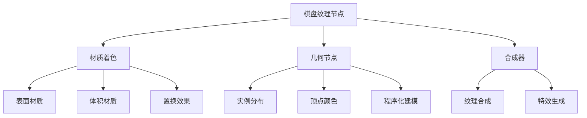
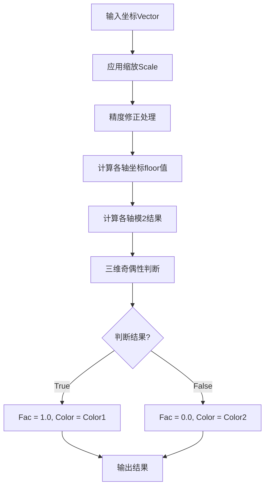
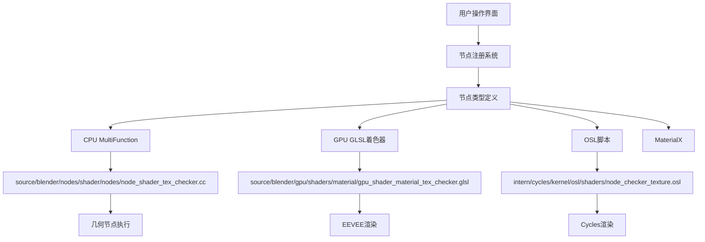
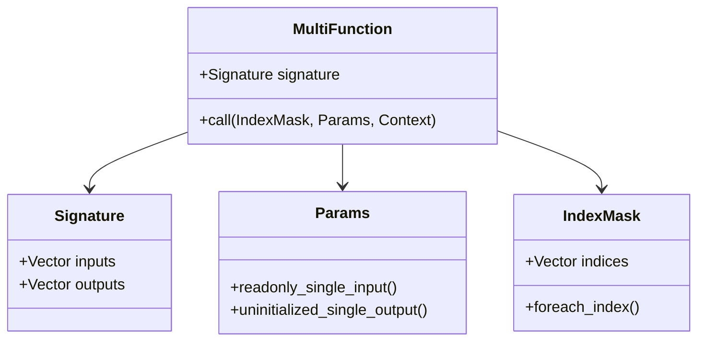

# 02. 棋盘纹理节点详解

## 目录
- [2.1 棋盘纹理节点概述](#21-棋盘纹理节点概述)
- [2.2 节点接口定义与输入输出](#22-节点接口定义与输入输出)
- [2.3 核心算法原理](#23-核心算法原理)
- [2.4 多架构支持实现机制](#24-多架构支持实现机制)
- [2.5 文件间调用关系](#25-文件间调用关系)
- [2.6 核心源码分析](#26-核心源码分析)
- [2.7 高级概念与优化技巧](#27-高级概念与优化技巧)
- [2.8 数学原理详解](#28-数学原理详解)
- [2.9 实践示例与故障排除](#29-实践示例与故障排除)

---

## 2.1 棋盘纹理节点概述

<span style="background:#f0f8ff;padding:4px;border-radius:4px;">**棋盘纹理节点 (Checker Texture Node)**</span> 是 Blender 中最基础且重要的纹理生成节点之一，用于创建经典的黑白（或自定义颜色）棋盘图案。该节点在几何节点、材质节点（EEVEE 和 Cycles）以及合成器节点中都有广泛的应用。

### 2.1.1 基本功能
- 🎨 **图案生成**: 基于三维坐标系统生成周期性的棋盘图案
- 🎯 **灵活控制**: 支持自定义颜色、缩放比例和坐标映射
- 🔧 **多场景应用**: 适用于表面着色、体积材质、几何体属性修改等多种场景

### 2.1.2 应用场景


---

## 2.2 节点接口定义与输入输出

### 2.2.1 输入接口详解

<span style="color:#2c5aa0;font-weight:bold;">输入接口定义</span>位于 `source/blender/nodes/shader/nodes/node_shader_tex_checker.cc:14-35`

```cpp
b.add_input<decl::Vector>("Vector").min(-10000.0f).max(10000.0f).implicit_field(
    NODE_DEFAULT_INPUT_POSITION_FIELD);
b.add_input<decl::Color>("Color1")
    .default_value({0.8f, 0.8f, 0.8f, 1.0f})
    .description("Color of the first checker");
b.add_input<decl::Color>("Color2")
    .default_value({0.2f, 0.2f, 0.2f, 1.0f})
    .description("Color of the second checker");
b.add_input<decl::Float>("Scale")
    .min(-10000.0f)
    .max(10000.0f)
    .default_value(5.0f)
    .no_muted_links()
    .description(
        "Overall texture scale.\n"
        "The scale is a factor of the bounding box of the face divided by the Scale value");
```

| 接口名称 | 数据类型 | 默认值 | 功能描述 |
|---------|---------|--------|---------|
| Vector | Vector3 | (0,0,0) | <span style="background:#e8f4f8;">纹理坐标输入</span>，决定棋盘图案的空间分布 |
| Color1 | Color4f | (0.8,0.8,0.8,1.0) | <span style="background:#fff0f5;">第一种棋盘颜色</span>，通常为亮色 |
| Color2 | Color4f | (0.2,0.2,0.2,1.0) | <span style="background:#f0fff0;">第二种棋盘颜色</span>，通常为暗色 |
| Scale | Float | 5.0 | <span style="background:#fffacd;">缩放因子</span>，控制棋盘格子大小 |

### 2.2.2 输出接口详解

<span style="color:#2c5aa0;font-weight:bold;">输出接口定义</span>位于同一文件第33-34行：

```cpp
b.add_output<decl::Color>("Color");
b.add_output<decl::Float>("Factor", "Fac");
```

| 输出名称 | 数据类型 | 计算方式 | 应用场景 |
|---------|---------|---------|---------|
| Color | Color4f | 根据 Fac 值在 Color1 和 Color2 间插值 | 直接用于材质颜色输出 |
| Fac | Float | 0.0 或 1.0 的二值结果 | 用作混合因子或逻辑判断 |

---

## 2.3 核心算法原理

### 2.3.1 数学基础

棋盘纹理的核心算法基于<span style="background:#ffd700;color:#000;font-weight:bold;">三维坐标系中的奇偶性判断</span>。其数学原理可以用以下公式表示：

$$
\text{Checker}(x,y,z) = \begin{cases} 
1 & \text{if } ((\lfloor x \rfloor \bmod 2) = (\lfloor y \rfloor \bmod 2)) = (\lfloor z \rfloor \bmod 2) \\
0 & \text{otherwise}
\end{cases}
$$

### 2.3.2 算法流程图



### 2.3.3 精度处理机制

<span style="color:#dc143c;">**精度问题**</span>是浮点计算中的常见挑战，特别是在处理单位坐标时。Blender 采用了特殊的精度修正策略：

```cpp
/* Avoid precision issues on unit coordinates. */
const float3 p = (vector[i] * scale[i] + 0.000001f) * 0.999999f;
```

这种处理方式：
- 🛡️ **避免边界模糊**: 防止坐标恰好位于整数边界时的不确定行为
- 🔢 **微小偏移**: 添加 `0.000001f` 的正向偏移
- 📏 **范围限制**: 乘以 `0.999999f` 确保坐标不超出预期范围

---

## 2.4 多架构支持实现机制

### 2.4.1 架构支持矩阵

<span style="background:#f5f5f5;border:1px solid #ccc;padding:8px;">**多架构支持**</span>是 Blender 节点系统的核心特性，确保同一节点可以在不同的渲染和计算环境中正常工作。

| 架构类型 | 实现文件 | 主要用途 | 性能特点 |
|---------|---------|---------|---------|
| CPU几何节点 | C++ MultiFunction | 几何处理、程序化建模 | 高精度、灵活计算 |
| GPU材质 | GLSL着色器 | 实时渲染(EEVEE) | 并行计算、实时响应 |
| OSL/CPU渲染 | OSL脚本 | 离线渲染(Cycles) | 高质量、复杂着色 |
| MaterialX | Python绑定 | 跨平台材质交换 | 标准化、兼容性 |

### 2.4.2 为什么支持多架构？

<span style="color:#008000;font-weight:bold;">设计理念</span>：统一的节点接口 + 分层实现的架构模式

**优势**：
1. 🔄 **一致性**: 用户在所有环境中使用相同的节点接口
2. 🚀 **性能优化**: 每个架构都可以针对其硬件特性进行优化
3. 🔧 **维护性**: 核心算法逻辑统一，减少维护成本
4. 🌐 **兼容性**: 支持不同渲染引擎和工作流程

---

## 2.5 文件间调用关系

### 2.5.1 调用层次结构



### 2.5.2 注册流程详解

<span style="background:#e6f3ff;">节点注册过程</span>位于 `source/blender/nodes/shader/nodes/node_shader_tex_checker.cc:136-156`：

```cpp
void register_node_type_sh_tex_checker()
{
  namespace file_ns = blender::nodes::node_shader_tex_checker_cc;

  static blender::bke::bNodeType ntype;

  common_node_type_base(&ntype, "ShaderNodeTexChecker", SH_NODE_TEX_CHECKER);
  ntype.ui_name = "Checker Texture";
  ntype.ui_description = "Generate a checkerboard texture";
  ntype.enum_name_legacy = "TEX_CHECKER";
  ntype.nclass = NODE_CLASS_TEXTURE;
  ntype.declare = file_ns::sh_node_tex_checker_declare;
  ntype.initfunc = file_ns::node_shader_init_tex_checker;
  blender::bke::node_type_storage(
      ntype, "NodeTexChecker", node_free_standard_storage, node_copy_standard_storage);
  ntype.gpu_fn = file_ns::node_shader_gpu_tex_checker;
  ntype.build_multi_function = file_ns::sh_node_tex_checker_build_multi_function;
  ntype.materialx_fn = file_ns::node_shader_materialx;

  blender::bke::node_register_type(ntype);
}
```

**关键函数指针**：
- `declare`: 定义输入输出接口
- `initfunc`: 初始化节点存储数据
- `gpu_fn`: GPU材质实现函数
- `build_multi_function`: CPU几何节点实现
- `materialx_fn`: MaterialX兼容实现

---

## 2.6 核心源码分析

### 2.6.1 CPU MultiFunction 实现

<span style="color:#ff6347;">**核心算法实现**</span>位于 `source/blender/nodes/shader/nodes/node_shader_tex_checker.cc:58-104`

```cpp
class NodeTexChecker : public mf::MultiFunction {
 public:
  NodeTexChecker()
  {
    static const mf::Signature signature = []() {
      mf::Signature signature;
      mf::SignatureBuilder builder{"Checker", signature};
      builder.single_input<float3>("Vector");
      builder.single_input<ColorGeometry4f>("Color1");
      builder.single_input<ColorGeometry4f>("Color2");
      builder.single_input<float>("Scale");
      builder.single_output<ColorGeometry4f>("Color", mf::ParamFlag::SupportsUnusedOutput);
      builder.single_output<float>("Fac");
      return signature;
    }();
    this->set_signature(&signature);
  }

  void call(const IndexMask &mask, mf::Params params, mf::Context /*context*/) const override
  {
    const VArray<float3> &vector = params.readonly_single_input<float3>(0, "Vector");
    const VArray<ColorGeometry4f> &color1 = params.readonly_single_input<ColorGeometry4f>(
        1, "Color1");
    const VArray<ColorGeometry4f> &color2 = params.readonly_single_input<ColorGeometry4f>(
        2, "Color2");
    const VArray<float> &scale = params.readonly_single_input<float>(3, "Scale");
    MutableSpan<ColorGeometry4f> r_color =
        params.uninitialized_single_output_if_required<ColorGeometry4f>(4, "Color");
    MutableSpan<float> r_fac = params.uninitialized_single_output<float>(5, "Fac");

    mask.foreach_index([&](const int64_t i) {
      /* Avoid precision issues on unit coordinates. */
      const float3 p = (vector[i] * scale[i] + 0.000001f) * 0.999999f;

      const int xi = abs(int(floorf(p.x)));
      const int yi = abs(int(floorf(p.y)));
      const int zi = abs(int(floorf(p.z)));

      r_fac[i] = ((xi % 2 == yi % 2) == (zi % 2)) ? 1.0f : 0.0f;
    });

    if (!r_color.is_empty()) {
      mask.foreach_index(
          [&](const int64_t i) { r_color[i] = (r_fac[i] == 1.0f) ? color1[i] : color2[i]; });
    }
  }
};
```

**关键概念解释**：

- <span style="background:#ffe4b5;">**VArray (Virtual Array)**</span>: Blender的虚拟数组，提供统一的数组接口，支持不同的内存布局和数据源
- <span style="background:#ffe4b5;">**IndexMask**</span>: 索引掩码，用于指定需要处理的元素，支持批量优化
- <span style="background:#ffe4b5;">**MutableSpan**</span>: 可变跨度，提供对连续内存区域的安全访问

### 2.6.2 GPU GLSL 实现

<span style="color:#4169e1;">**GPU着色器实现**</span>位于 `source/blender/gpu/shaders/material/gpu_shader_material_tex_checker.glsl:5-21`

```glsl
void node_tex_checker(
    float3 co, float4 color1, float4 color2, float scale, out float4 color, out float fac)
{
  float3 p = co * scale;

  /* Prevent precision issues on unit coordinates. */
  p = (p + 0.000001f) * 0.999999f;

  int xi = int(abs(floor(p.x)));
  int yi = int(abs(floor(p.y)));
  int zi = int(abs(floor(p.z)));

  bool check = ((mod(xi, 2) == mod(yi, 2)) == bool(mod(zi, 2)));

  color = check ? color1 : color2;
  fac = check ? 1.0f : 0.0f;
}
```

**GLSL特点**：
- 🎯 **并行执行**: 在GPU上同时处理大量片段
- 🔧 **类型转换**: 显式的类型转换确保兼容性
- ⚡ **优化友好**: 简单的数学运算适合GPU并行计算

### 2.6.3 OSL 实现

<span style="color:#ff8c00;">**OSL着色器实现**</span>位于 `intern/cycles/kernel/osl/shaders/node_checker_texture.osl:9-51`

```osl
float checker(point ip)
{
  point p;
  p[0] = (ip[0] + 0.000001) * 0.999999;
  p[1] = (ip[1] + 0.000001) * 0.999999;
  p[2] = (ip[2] + 0.000001) * 0.999999;

  int xi = (int)fabs(floor(p[0]));
  int yi = (int)fabs(floor(p[1]));
  int zi = (int)fabs(floor(p[2]));

  if ((xi % 2 == yi % 2) == (zi % 2)) {
    return 1.0;
  }
  else {
    return 0.0;
  }
}

shader node_checker_texture(
    int use_mapping = 0,
    matrix mapping = matrix(0, 0, 0, 0, 0, 0, 0, 0, 0, 0, 0, 0, 0, 0, 0, 0),
    float Scale = 5.0,
    point Vector = P,
    color Color1 = 0.8,
    color Color2 = 0.2,
    output float Fac = 0.0,
    output color Color = 0.0)
{
  point p = Vector;

  if (use_mapping)
    p = transform(mapping, p);

  Fac = checker(p * Scale);
  if (Fac == 1.0) {
    Color = Color1;
  }
  else {
    Color = Color2;
  }
}
```

**OSL特点**：
- 🎨 **专用语法**: Open Shading Language专为着色设计
- 📐 **坐标系操作**: 内置的坐标变换和映射支持
- 🔗 **Cycles集成**: 与Cycles渲染器深度集成

---

## 2.7 高级概念与优化技巧

### 2.7.1 MultiFunction系统架构

<span style="background:#dda0dd;color:white;font-weight:bold;">MultiFunction</span> 是 Blender 中用于处理批量数据计算的核心系统，特别适合几何节点的并行计算需求。

**设计优势**：


### 2.7.2 内存访问优化

<span style="color:#8b4513;">**缓存友好的内存布局**</span>是高性能计算的关键：

```cpp
// 良好的内存访问模式 - 连续访问
mask.foreach_index([&](const int64_t i) {
    // 所有对同一索引i的访问都是连续的
    const float3 p = (vector[i] * scale[i] + 0.000001f) * 0.999999f;
    r_fac[i] = ((xi % 2 == yi % 2) == (zi % 2)) ? 1.0f : 0.0f;
});
```

**优化技巧**：
- 📊 **数据局部性**: 相关数据在内存中紧密排列
- 🔄 **批量处理**: 减少函数调用开销
- 💾 **延迟计算**: 只在需要时计算颜色输出

### 2.7.3 GPU并行计算优化

<span style="background:#90ee90;">**GPU着色器优化**</span>要点：

```glsl
// 优化的GLSL实现
bool check = ((mod(xi, 2) == mod(yi, 2)) == bool(mod(zi, 2)));
```

**优化策略**：
- ⚡ **减少分支**: 使用三元运算符替代if-else
- 🔢 **整数运算**: 比浮点运算更高效
- 🧮 **向量化**: 利用GPU的SIMD指令集

---

## 2.8 数学原理详解

### 2.8.1 坐标系统与变换

<span style="background:#ffebcd;">**三维棋盘生成**</span>基于以下数学原理：

设原始坐标为 $\vec{p} = (x, y, z)$，缩放因子为 $s$，则变换后的坐标为：

$$
\vec{p}' = (\vec{p} \cdot s + \epsilon) \cdot (1 - \delta)
$$

其中：
- $\epsilon = 0.000001$ (精度修正偏移)
- $\delta = 0.000001$ (精度修正缩放)

### 2.8.2 棋盘模式的数学表示

<span style="color:#4682b4;">**棋盘判断函数**</span>可以表示为：

$$
\text{Checker}(p') = \left[(\lfloor p'_x \rfloor \bmod 2) = (\lfloor p'_y \rfloor \bmod 2)\right] \oplus (\lfloor p'_z \rfloor \bmod 2)
$$

其中 $\oplus$ 表示逻辑异或操作。

### 2.8.3 三维扩展原理

<span style="background:#e0ffff;">**从二维到三维的扩展**</span>：

传统二维棋盘：$$ f_{2D}(x,y) = (\lfloor x \rfloor \bmod 2) \oplus (\lfloor y \rfloor \bmod 2) $$

扩展到三维：$$ f_{3D}(x,y,z) = \left[(\lfloor x \rfloor \bmod 2) \oplus (\lfloor y \rfloor \bmod 2)\right] \oplus (\lfloor z \rfloor \bmod 2) $$

这种扩展确保了三维空间中的连续性和一致性。

---

## 2.9 实践示例与故障排除

### 2.9.1 常见使用场景

<span style="color:#006400;">**场景1：材质棋盘图案**</span>

```python
# Python API 示例：创建棋盘材质
import bpy

# 创建棋盘纹理节点
checker_node = material.node_tree.nodes.new(type='ShaderNodeTexChecker')
checker_node.inputs['Color1'].default_value = (1.0, 1.0, 1.0, 1.0)  # 白色
checker_node.inputs['Color2'].default_value = (0.0, 0.0, 0.0, 1.0)  # 黑色
checker_node.inputs['Scale'].default_value = 10.0
```

<span style="color:#006400;">**场景2：几何节点应用**</span>

```python
# 使用棋盘纹理控制实例分布
geometry_nodes = bpy.data.node_groups.new("Checker Pattern", "GeometryNodeTree")
checker = geometry_nodes.nodes.new("ShaderNodeTexChecker")
instance_on_points = geometry_nodes.nodes.new("GeometryNodeInstanceOnPoints")

# 连接棋盘输出到实例缩放
geometry_nodes.links.new(
    checker.outputs["Fac"], 
    instance_on_points.inputs["Scale"]
)
```

### 2.9.2 性能优化建议

<span style="background:#fffacd;">**优化策略**</span>：

1. 🎯 **合理缩放**: 避免过大的Scale值导致精度问题
2. 🔄 **缓存结果**: 对静态几何体可以预计算棋盘纹理
3. 📊 **批量处理**: 利用MultiFunction的批量处理能力
4. 🚀 **GPU加速**: 在实时渲染中优先使用GPU实现

### 2.9.3 故障排除指南

<span style="color:#dc143c;">**常见问题**</span>：

| 问题症状 | 可能原因 | 解决方案 |
|---------|---------|---------|
| 棋盘边缘模糊 | Scale值过大或精度问题 | 调整Scale值，使用坐标映射 |
| 颜色异常 | 输入颜色未连接或Alpha通道问题 | 检查颜色输入连接 |
| 性能问题 | 高分辨率几何体 | 使用较低分辨率的代理几何体 |
| 内存泄漏 | 自定义节点未正确清理 | 检查节点存储的释放代码 |

### 2.9.4 调试技巧

<span style="background:#f0fff0;">**调试方法**</span>：

1. 🔍 **可视化输出**: 将Fac输出连接到材质查看器
2. 📊 **数值检查**: 使用数学节点显示中间计算结果
3. 🧪 **单元测试**: 编写测试用例验证边界条件
4. 📝 **日志输出**: 在开发版本中添加调试信息

---

## 总结

棋盘纹理节点是 Blender 节点系统中一个典型的<span style="background:#d8bfd8;">多架构支持实现</span>案例。通过分析其源码，我们了解到：

1. 🏗️ **统一的接口设计**：无论在哪个架构中，节点都提供相同的输入输出接口
2. 🔧 **分层实现策略**：针对不同计算环境优化的具体实现
3. 📚 **清晰的代码组织**：通过命名空间和函数指针实现模块化
4. 🎯 **性能与精度平衡**：通过算法优化和精度修正确保效果

这种设计模式不仅适用于纹理节点，也为其他类型节点的开发提供了参考模板。理解这些原理对于深入学习 Blender 的节点系统和进行自定义节点开发都具有重要意义。