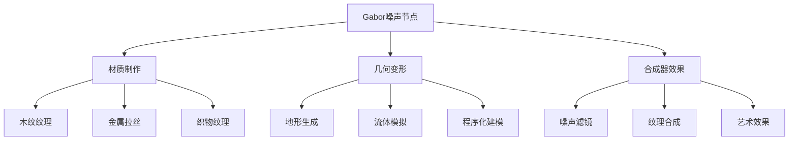
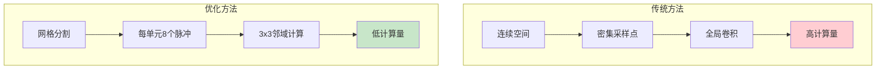
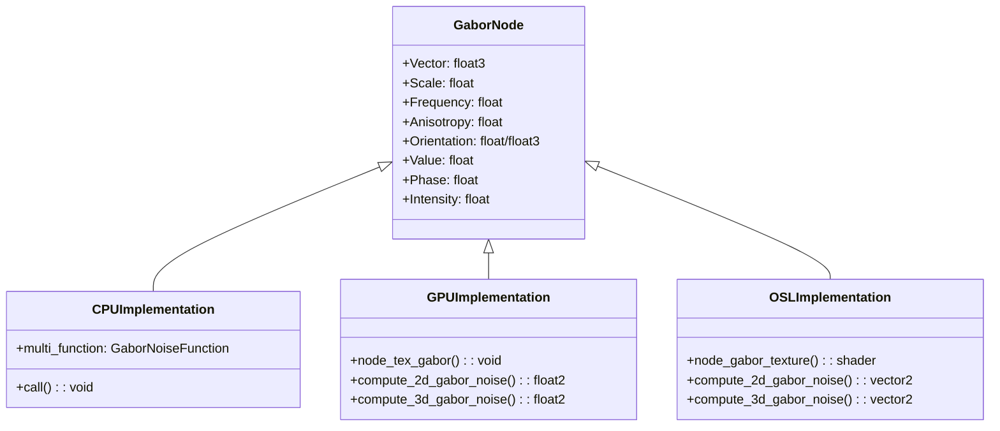
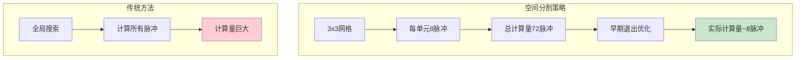
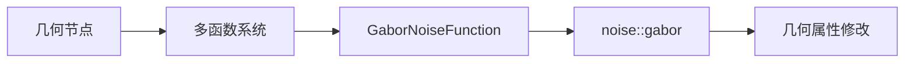
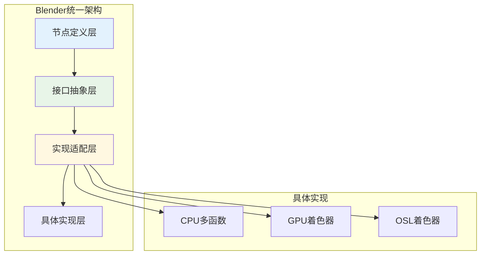

# 03. Gabor噪声纹理节点详解

## 目录
- [1. 概述](#1-概述)
- [2. Gabor噪声理论基础](#2-gabor噪声理论基础)
  - [2.1 Gabor核函数](#21-gabor核函数)
  - [2.2 稀疏Gabor卷积](#22-稀疏gabor卷积)
  - [2.3 复数Phasor表示法](#23-复数phasor表示法)
- [3. 节点实现架构](#3-节点实现架构)
  - [3.1 文件结构概览](#31-文件结构概览)
  - [3.2 统一接口设计](#32-统一接口设计)
  - [3.3 多后端支持机制](#33-多后端支持机制)
- [4. CPU端实现详解](#4-cpu端实现详解)
  - [4.1 节点注册与声明](#41-节点注册与声明)
  - [4.2 多函数系统](#42-多函数系统)
  - [4.3 核心噪声计算](#43-核心噪声计算)
- [5. GPU着色器实现](#5-gpu着色器实现)
  - [5.1 GLSL实现概览](#51-glsl实现概览)
  - [5.2 2D Gabor噪声计算](#52-2d-gabor噪声计算)
  - [5.3 3D Gabor噪声计算](#53-3d-gabor噪声计算)
  - [5.4 标准化与输出](#54-标准化与输出)
- [6. Cycles OSL实现](#6-cycles-osl实现)
  - [6.1 OSL着色器接口](#61-osl着色器接口)
  - [6.2 主要差异对比](#62-主要差异对比)
- [7. 输出接口计算详解](#7-输出接口计算详解)
  - [7.1 Value输出](#71-value输出)
  - [7.2 Phase输出](#72-phase输出)
  - [7.3 Intensity输出](#73-intensity输出)
- [8. 输入参数详解](#8-输入参数详解)
  - [8.1 Vector输入](#81-vector输入)
  - [8.2 Scale参数](#82-scale参数)
  - [8.3 Frequency参数](#83-frequency参数)
  - [8.4 Anisotropy参数](#84-anisotropy参数)
  - [8.5 Orientation参数](#85-orientation参数)
- [9. 性能优化策略](#9-性能优化策略)
  - [9.1 早期退出优化](#91-早期退出优化)
  - [9.2 分层采样](#92-分层采样)
  - [9.3 缓存与向量化](#93-缓存与向量化)
- [10. 数学公式推导](#10-数学公式推导)
  - [10.1 Gabor核函数推导](#101-gabor核函数推导)
  - [10.2 标准差计算](#102-标准差计算)
  - [10.3 归一化因子](#103-归一化因子)
- [11. 编码规范与命名约定](#11-编码规范与命名约定)
  - [11.1 缩写词解释](#111-缩写词解释)
  - [11.2 命名规范](#112-命名规范)
- [12. 跨系统集成详解](#12-跨系统集成详解)
  - [12.1 几何节点集成](#121-几何节点集成)
  - [12.2 材质节点集成](#122-材质节点集成)
  - [12.3 合成器节点集成](#123-合成器节点集成)
- [13. 学习资源与进阶知识](#13-学习资源与进阶知识)
  - [13.1 基础知识](#131-基础数学知识)
  - [13.2 进阶主题](#132-进阶算法主题)
  - [13.3 实践应用](#133-实际应用技巧)

---

## 1. 概述

<span style="background: #e3f2fd; color: #1565c0; padding: 2px 6px; border-radius: 3px;">Gabor噪声纹理节点</span>是Blender中一个<span style="background: #f3e5f5; color: #7b1fa2; padding: 2px 6px; border-radius: 3px;">高质量程序化纹理生成器</span>，基于多篇学术论文的实现。该节点能够生成具有<span style="background: #e8f5e8; color: #2e7d32; padding: 2px 6px; border-radius: 3px;">方向性控制</span>的噪声纹理，适用于材质、几何和合成器等多个系统。

### 1.1 核心特性

- ✨ **多维度支持**: 同时支持2D和3D噪声生成
- 🎯 **方向控制**: 通过anisotropy参数控制噪声的方向性
- 🔄 **多输出生成**: 同时输出Value、Phase和Intensity三种信息
- ⚡ **高性能**: 针对不同后端优化的实现（CPU/GPU/OSL）
- 🎨 **艺术友好**: 参数设计符合艺术家直觉

### 1.2 应用场景



---

## 2. Gabor噪声理论基础

### 2.1 Gabor核函数

<span style="background: #fff3e0; color: #e65100; padding: 2px 6px; border-radius: 3px;">Gabor核函数</span>是一个被<span style="background: #fce4ec; color: #c2185b; padding: 2px 6px; border-radius: 3px;">高斯包络调制</span>的正弦波，其数学表达式为：

$$
G(x,y) = e^{-\pi(x^2 + y^2)} \cdot \cos(2\pi f_0(x\cos\omega_0 + y\sin\omega_0))
$$

其中：
- $f_0$ 是<span style="background: #e0f2f1; color: #00695c; padding: 2px 6px; border-radius: 3px;">频率参数</span>，控制正弦波的振荡频率
- $\omega_0$ 是<span style="background: #e0f2f1; color: #00695c; padding: 2px 6px; border-radius: 3px;">方向参数</span>，控制正弦波的传播方向
- $e^{-\pi(x^2 + y^2)}$ 是<span style="background: #e0f2f1; color: #00695c; padding: 2px 6px; border-radius: 3px;">高斯包络</span>，使核函数在空间上局部化

### 2.2 稀疏Gabor卷积

传统的Gabor噪声需要在整个空间上进行连续卷积，计算量巨大。<span style="background: #f1f8e9; color: #33691e; padding: 2px 6px; border-radius: 3px;">稀疏Gabor卷积</span>通过以下策略优化：

1. **空间分割**: 将空间划分为规则网格单元
2. **脉冲采样**: 在每个网格单元内放置固定数量的随机脉冲
3. **局部计算**: 只计算目标点附近3×3邻域内的脉冲影响



### 2.3 复数Phasor表示法

为了同时获取<span style="background: #e8eaf6; color: #283593; padding: 2px 6px; border-radius: 3px;">相位</span>和<span style="background: #e8eaf6; color: #283593; padding: 2px 6px; border-radius: 3px;">强度</span>信息，实现采用了复数Phasor表示法：

$$
P = \cos(\theta) + i\sin(\theta)
$$

其中：
- 实部：$\cos(\theta)$ - 对应传统Gabor值
- 虚部：$\sin(\theta)$ - 用于计算相位
- 模长：$|P|$ - 对应强度
- 相角：$\arg(P)$ - 对应相位

---

## 3. 节点实现架构

### 3.1 文件结构概览

Gabor噪声节点的实现分布在三个主要文件中：

| 文件路径 | 责任 | 语言 |
|---------|------|------|
| `source/blender/nodes/shader/nodes/node_shader_tex_gabor.cc` | CPU端节点逻辑 | C++ |
| `source/blender/gpu/shaders/material/gpu_shader_material_tex_gabor.glsl` | GPU着色器实现 | GLSL |
| `intern/cycles/kernel/osl/shaders/node_gabor_texture.osl` | Cycles渲染器支持 | OSL |

### 3.2 统一接口设计



### 3.3 多后端支持机制

Blender通过<span style="background: #fff8e1; color: #ff8f00; padding: 2px 6px; border-radius: 3px;">抽象层设计</span>实现多后端支持：

1. **节点注册系统**: 统一的节点类型注册
2. **函数指针机制**: 运行时选择对应的实现函数
3. **接口标准化**: 所有后端遵循相同的输入输出规范

```cpp
// node_shader_tex_gabor.cc:214-224
ntype.declare = file_ns::sh_node_tex_gabor_declare;
ntype.draw_buttons = file_ns::node_shader_buts_tex_gabor;
ntype.initfunc = file_ns::node_shader_init_tex_gabor;
ntype.gpu_fn = file_ns::node_shader_gpu_tex_gabor;  // GPU实现
ntype.build_multi_function = file_ns::build_multi_function;  // CPU实现
```

---

## 4. CPU端实现详解

### 4.1 节点注册与声明

#### 4.1.1 输入接口声明

```cpp
// node_shader_tex_gabor.cc:22-61
static void sh_node_tex_gabor_declare(NodeDeclarationBuilder &b)
{
  b.is_function_node();
  b.add_input<decl::Vector>("Vector")
      .implicit_field(NODE_DEFAULT_INPUT_POSITION_FIELD)
      .description(
          "The coordinates at which Gabor noise will be evaluated. The Z component is ignored in "
          "the 2D case");
  b.add_input<decl::Float>("Scale").default_value(5.0f).description(
      "The scale of the Gabor noise");
  // ... 其他输入声明
}
```

<span style="background: #e1f5fe; color: #0277bd; padding: 2px 6px; border-radius: 3px;">关键概念解释</span>：
- `implicit_field`: 自动使用默认位置字段作为输入
- `NODE_DEFAULT_INPUT_POSITION_FIELD`: 系统预定义的默认位置输入

#### 4.1.2 节点初始化

```cpp
// node_shader_tex_gabor.cc:68-77
static void node_shader_init_tex_gabor(bNodeTree * /*ntree*/, bNode *node)
{
  NodeTexGabor *storage = MEM_callocN<NodeTexGabor>(__func__);
  BKE_texture_mapping_default(&storage->base.tex_mapping, TEXMAP_TYPE_POINT);
  BKE_texture_colormapping_default(&storage->base.color_mapping);
  
  storage->type = SHD_GABOR_TYPE_2D;  // 默认2D模式
  
  node->storage = storage;
}
```

<span style="background: #f3e5f5; color: #7b1fa2; padding: 2px 6px; border-radius: 3px;">内存管理</span>：
- `MEM_callocN`: Blender的内存分配函数，自动清零
- `__func__`: 当前函数名，用于内存调试

### 4.2 多函数系统

<span style="background: #e0f7fa; color: #00838f; padding: 2px 6px; border-radius: 3px;">多函数系统</span>是Blender的现代计算框架，支持批量处理和向量化计算。

#### 4.2.1 签名定义

```cpp
// node_shader_tex_gabor.cc:119-141
static mf::Signature create_signature(const NodeGaborType type)
{
  mf::Signature signature;
  mf::SignatureBuilder builder{"GaborNoise", signature};

  builder.single_input<float3>("Vector");
  builder.single_input<float>("Scale");
  builder.single_input<float>("Frequency");
  builder.single_input<float>("Anisotropy");
  
  if (type == SHD_GABOR_TYPE_2D) {
    builder.single_input<float>("Orientation");
  } else {
    builder.single_input<float3>("Orientation");
  }
  
  builder.single_output<float>("Value", mf::ParamFlag::SupportsUnusedOutput);
  builder.single_output<float>("Phase", mf::ParamFlag::SupportsUnusedOutput);
  builder.single_output<float>("Intensity", mf::ParamFlag::SupportsUnusedOutput);
  
  return signature;
}
```

<span style="background: #fff3e0; color: #e65100; padding: 2px 6px; border-radius: 3px;">重要特性</span>：
- `SupportsUnusedOutput`: 标记输出为可选，提升性能
- 类型自适应：根据2D/3D模式调整输入类型

#### 4.2.2 核心计算逻辑

```cpp
// node_shader_tex_gabor.cc:143-185
void call(const IndexMask &mask, mf::Params params, mf::Context /*context*/) const override
{
  const VArray<float3> &vector = params.readonly_single_input<float3>(0, "Vector");
  const VArray<float> &scale = params.readonly_single_input<float>(1, "Scale");
  const VArray<float> &frequency = params.readonly_single_input<float>(2, "Frequency");
  const VArray<float> &anisotropy = params.readonly_single_input<float>(3, "Anisotropy");
  
  MutableSpan<float> r_value = params.uninitialized_single_output_if_required<float>(5, "Value");
  MutableSpan<float> r_phase = params.uninitialized_single_output_if_required<float>(6, "Phase");
  MutableSpan<float> r_intensity = params.uninitialized_single_output_if_required<float>(7, "Intensity");

  switch (type_) {
    case SHD_GABOR_TYPE_2D: {
      const VArray<float> &orientation = params.readonly_single_input<float>(4, "Orientation");
      mask.foreach_index([&](const int64_t i) {
        noise::gabor(vector[i].xy(),
                     scale[i],
                     frequency[i],
                     anisotropy[i],
                     orientation[i],
                     r_value.is_empty() ? nullptr : &r_value[i],
                     r_phase.is_empty() ? nullptr : &r_phase[i],
                     r_intensity.is_empty() ? nullptr : &r_intensity[i]);
      });
      break;
    }
    // ... 3D case
  }
}
```

<span style="background: #e8f5e8; color: #2e7d32; padding: 2px 6px; border-radius: 3px;">性能优化</span>：
- `IndexMask`: 批量处理索引掩码
- `VArray`: 虚拟数组，支持稀疏访问
- 条件计算：只计算实际需要的输出

### 4.3 核心噪声计算

CPU端的核心计算委托给`noise::gabor`函数，该函数位于Blender的噪声库中。

```cpp
// 调用示例
noise::gabor(vector[i].xy(),           // 2D坐标
             scale[i],                  // 缩放
             frequency[i],             // 频率
             anisotropy[i],            // 各向异性
             orientation[i],           // 方向
             &value_output,             // 值输出指针
             &phase_output,            // 相位输出指针
             &intensity_output);        // 强度输出指针
```

---

## 5. GPU着色器实现

### 5.1 GLSL实现概览

<span style="background: #ede7f6; color: #4527a0; padding: 2px 6px; border-radius: 3px;">GPU实现</span>位于`gpu_shader_material_tex_gabor.glsl`，采用GLSL着色器语言，针对实时渲染优化。

#### 5.1.1 常量定义

```glsl
// gpu_shader_material_tex_gabor.glsl:25-34
#define SHD_GABOR_TYPE_2D 0.0f
#define SHD_GABOR_TYPE_3D 1.0f
#define IMPULSES_COUNT 8
```

<span style="background: #fce4ec; color: #c2185b; padding: 2px 6px; border-radius: 3px;">设计考虑</span>：
- `IMPULSES_COUNT 8`: 基于Tavernier论文的最优值
- 浮点类型常量：便于GPU着色器统一处理

### 5.2 2D Gabor噪声计算

#### 5.2.1 Gabor核函数

```glsl
// gpu_shader_material_tex_gabor.glsl:61-73
float2 compute_2d_gabor_kernel(float2 position, float frequency, float orientation)
{
  float distance_squared = length_squared(position);
  float hann_window = 0.5f + 0.5f * cos(M_PI * distance_squared);
  float gaussian_envelop = exp(-M_PI * distance_squared);
  float windowed_gaussian_envelope = gaussian_envelop * hann_window;

  float2 frequency_vector = frequency * float2(cos(orientation), sin(orientation));
  float angle = 2.0f * M_PI * dot(position, frequency_vector);
  float2 phasor = float2(cos(angle), sin(angle));

  return windowed_gaussian_envelope * phasor;
}
```

<span style="background: #fff8e1; color: #ff8f00; padding: 2px 6px; border-radius: 3px;">算法详解</span>：

1. **距离计算**: `distance_squared = x² + y²`
2. **Hann窗口**: $w(x) = 0.5 + 0.5\cos(\pi x^2)$
3. **高斯包络**: $g(x) = e^{-\pi x^2}$
4. **频率向量**: $\vec{f} = f(\cos\omega, \sin\omega)$
5. **相位角**: $\theta = 2\pi \vec{p} \cdot \vec{f}$

#### 5.2.2 标准差计算

```glsl
// gpu_shader_material_tex_gabor.glsl:101-106
float compute_2d_gabor_standard_deviation()
{
  float integral_of_gabor_squared = 0.25f;
  float second_moment = 0.5f;
  return sqrt(IMPULSES_COUNT * second_moment * integral_of_gabor_squared);
}
```

<span style="background: #e8eaf6; color: #283593; padding: 2px 6px; border-radius: 3px;">数学推导</span>：
基于论文中的积分公式简化，对于高频近似：
$$
\sigma = \sqrt{n \cdot \mu_2 \cdot \int G^2(x,y) dx dy} = \sqrt{8 \cdot 0.5 \cdot 0.25} = 1
$$

### 5.3 3D Gabor噪声计算

#### 5.3.1 3D核函数差异

```glsl
// gpu_shader_material_tex_gabor.glsl:180-192
float2 compute_3d_gabor_kernel(float3 position, float frequency, float3 orientation)
{
  float distance_squared = length_squared(position);
  float hann_window = 0.5f + 0.5f * cos(M_PI * distance_squared);
  float gaussian_envelop = exp(-M_PI * distance_squared);
  float windowed_gaussian_envelope = gaussian_envelop * hann_window;

  float3 frequency_vector = frequency * orientation;  // 直接使用方向向量
  float angle = 2.0f * M_PI * dot(position, frequency_vector);
  float2 phasor = float2(cos(angle), sin(angle));

  return windowed_gaussian_envelope * phasor;
}
```

<span style="background: #ffebee; color: #c62828; padding: 2px 6px; border-radius: 3px;">关键差异</span>：
- 2D使用角度参数，需要转换为向量
- 3D直接使用方向向量，更加直观

#### 5.3.2 3D方向计算

```glsl
// gpu_shader_material_tex_gabor.glsl:207-229
float3 compute_3d_orientation(float3 orientation, float isotropy, float4 seed)
{
  if (isotropy == 0.0f) {
    return orientation;  // 完全各向异性
  }

  // 球坐标转换
  float inclination = acos(orientation.z);
  float azimuth = sign(orientation.y) * acos(orientation.x / length(orientation.xy));

  // 添加随机扰动
  float2 random_angles = hash_vec4_to_vec2(seed) * M_PI;
  inclination += random_angles.x * isotropy;
  azimuth += random_angles.y * isotropy;

  // 转回笛卡尔坐标
  return float3(
      sin(inclination) * cos(azimuth), 
      sin(inclination) * sin(azimuth), 
      cos(inclination));
}
```

### 5.4 标准化与输出

#### 5.4.1 主函数逻辑

```glsl
// gpu_shader_material_tex_gabor.glsl:287-328
void node_tex_gabor(float3 coordinates,
                    float scale,
                    float frequency,
                    float anisotropy,
                    float orientation_2d,
                    float3 orientation_3d,
                    float type,
                    out float output_value,
                    out float output_phase,
                    out float output_intensity)
{
  float3 scaled_coordinates = coordinates * scale;
  float isotropy = 1.0f - clamp(anisotropy, 0.0f, 1.0f);  // 注意这里的转换
  frequency = max(0.001f, frequency);

  float2 phasor = float2(0.0f);
  float standard_deviation = 1.0f;
  
  if (type == SHD_GABOR_TYPE_2D) {
    phasor = compute_2d_gabor_noise(scaled_coordinates.xy, frequency, isotropy, orientation_2d);
    standard_deviation = compute_2d_gabor_standard_deviation();
  }
  else if (type == SHD_GABOR_TYPE_3D) {
    float3 orientation = normalize(orientation_3d);
    phasor = compute_3d_gabor_noise(scaled_coordinates, frequency, isotropy, orientation);
    standard_deviation = compute_3d_gabor_standard_deviation();
  }

  float normalization_factor = 6.0f * standard_deviation;  // 经验确定的归一化因子

  output_value = (phasor.y / normalization_factor) * 0.5f + 0.5f;
  output_phase = (atan2(phasor.y, phasor.x) + M_PI) / (2.0f * M_PI);
  output_intensity = length(phasor) / normalization_factor;
}
```

<span style="background: #f1f8e9; color: #33691e; padding: 2px 6px; border-radius: 3px;">重要细节</span>：
- `isotropy = 1.0f - anisotropy`: 参数名称语义转换
- `normalization_factor = 6.0f * standard_deviation`: 经验优化值
- 输出值域标准化到[0,1]

---

## 6. Cycles OSL实现

### 6.1 OSL着色器接口

<span style="background: #e0f2f1; color: #00695c; padding: 2px 6px; border-radius: 3px;">OSL实现</span>位于`node_gabor_texture.osl`，专门服务于Cycles渲染器。

#### 6.1.1 着色器声明

```osl
// node_gabor_texture.osl:286-298
shader node_gabor_texture(int use_mapping = 0,
                          matrix mapping = matrix(0, 0, 0, 0, 0, 0, 0, 0, 0, 0, 0, 0, 0, 0, 0, 0),
                          string type = "2D",
                          vector3 Vector = P,
                          float Scale = 5.0,
                          float Frequency = 2.0,
                          float Anisotropy = 1.0,
                          float Orientation2D = M_PI / 4.0,
                          vector3 Orientation3D = vector3(M_SQRT2, M_SQRT2, 0.0),
                          output float Value = 0.0,
                          output float Phase = 0.0,
                          output float Intensity = 0.0)
```

<span style="background: #fce4ec; color: #c2185b; padding: 2px 6px; border-radius: 3px;">OSL特性</span>：
- `use_mapping`: 支持纹理坐标变换
- `string type`: 字符串类型参数，比枚举更灵活
- `P`: OSL内置变量，表示着色点位置

#### 6.1.2 坐标变换处理

```osl
// node_gabor_texture.osl:299-307
vector3 coordinates = Vector;
if (use_mapping) {
  coordinates = transform(mapping, coordinates);
}

vector3 scaled_coordinates = coordinates * Scale;
float isotropy = 1.0 - clamp(Anisotropy, 0.0, 1.0);
float frequency = max(0.001, Frequency);
```

### 6.2 主要差异对比

| 特性 | GPU实现 | OSL实现 | 说明 |
|------|---------|---------|------|
| **参数类型** | float type | string type | OSL使用字符串更灵活 |
| **坐标变换** | 外部处理 | 内置支持 | OSL有专门的变换矩阵 |
| **向量类型** | float2/vector2 | vector2 | OSL使用vector前缀 |
| **数学常量** | M_PI | M_PI | 标准一致 |
| **哈希函数** | hash_* | hash_* | 接口略有差异 |

---

## 7. 输出接口计算详解

### 7.1 Value输出

<span style="background: #e3f2fd; color: #1565c0; padding: 2px 6px; border-radius: 3px;">Value输出</span>是主要的噪声值，对应Phasor的虚部：

$$
\text{Value} = \frac{\text{Im}(P)}{6\sigma} \times 0.5 + 0.5
$$

```glsl
// gpu_shader_material_tex_gabor.glsl:320
output_value = (phasor.y / normalization_factor) * 0.5f + 0.5f;
```

<span style="background: #fff3e0; color: #e65100; padding: 2px 6px; border-radius: 3px;">设计考虑</span>：
- 使用虚部而非实部：保证零均值
- 除以6σ：经验归一化因子
- 映射到[0,1]：符合纹理节点惯例

### 7.2 Phase输出

<span style="background: #e8f5e8; color: #2e7d32; padding: 2px 6px; border-radius: 3px;">Phase输出</span>表示复数的相位角：

$$
\text{Phase} = \frac{\arg(P) + \pi}{2\pi} = \frac{\arctan2(\text{Im}(P), \text{Re}(P)) + \pi}{2\pi}
$$

```glsl
// gpu_shader_material_tex_gabor.glsl:324
output_phase = (atan2(phasor.y, phasor.x) + M_PI) / (2.0f * M_PI);
```

<span style="background: #f3e5f5; color: #7b1fa2; padding: 2px 6px; border-radius: 3px;">atan2优势</span>：
- 正确处理象限
- 避免除零错误
- 结果范围[-π,π]

### 7.3 Intensity输出

<span style="background: #ffebee; color: #c62828; padding: 2px 6px; border-radius: 3px;">Intensity输出</span>表示复数的模长：

$$
\text{Intensity} = \frac{|P|}{6\sigma} = \frac{\sqrt{\text{Re}^2(P) + \text{Im}^2(P)}}{6\sigma}
$$

```glsl
// gpu_shader_material_tex_gabor.glsl:327
output_intensity = length(phasor) / normalization_factor;
```

<span style="background: #e0f7fa; color: #00838f; padding: 2px 6px; border-radius: 3px;">物理意义</span>：
- 表示该点的噪声活跃程度
- 不受相位影响，只关心幅度
- 适合用于控制混合权重

---

## 8. 输入参数详解

### 8.1 Vector输入

<span style="background: #ede7f6; color: #4527a0; padding: 2px 6px; border-radius: 3px;">Vector输入</span>指定噪声采样的空间坐标：

```cpp
// node_shader_tex_gabor.cc:25-29
b.add_input<decl::Vector>("Vector")
    .implicit_field(NODE_DEFAULT_INPUT_POSITION_FIELD)
    .description(
        "The coordinates at which Gabor noise will be evaluated. The Z component is ignored in "
        "the 2D case");
```

<span style="background: #fff8e1; color: #ff8f00; padding: 2px 6px; border-radius: 3px;">使用技巧</span>：
- 2D模式下忽略Z分量
- 可以连接任意坐标变换节点
- 支持动态坐标驱动

### 8.2 Scale参数

<span style="background: #e1f5fe; color: #0277bd; padding: 2px 6px; border-radius: 3px;">Scale参数</span>控制整体噪声尺度：

```cpp
// node_shader_tex_gabor.cc:30-31
b.add_input<decl::Float>("Scale").default_value(5.0f).description(
    "The scale of the Gabor noise");
```

<span style="background: #f1f8e9; color: #33691e; padding: 2px 6px; border-radius: 3px;">作用机制</span>：
```glsl
float3 scaled_coordinates = coordinates * scale;
```

- 值越大，噪声频率越低（更稀疏）
- 值越小，噪声频率越高（更密集）
- 默认值5.0提供视觉平衡的效果

### 8.3 Frequency参数

<span style="background: #fce4ec; color: #c2185b; padding: 2px 6px; border-radius: 3px;">Frequency参数</span>控制Gabor核的振荡频率：

```cpp
// node_shader_tex_gabor.cc:32-37
b.add_input<decl::Float>("Frequency")
    .default_value(2.0f)
    .min(0.0f)
    .description(
        "The rate at which the Gabor noise changes across space. This is different from the "
        "Scale input in that it only scales perpendicular to the Gabor noise direction");
```

<span style="background: #ffebee; color: #c62828; padding: 2px 6px; border-radius: 3px;">Scale vs Frequency</span>：

| 参数 | 作用方向 | 效果 |
|------|----------|------|
| Scale | 全局缩放 | 影响整体密度 |
| Frequency | 方向缩放 | 只影响垂直于方向的频率 |

### 8.4 Anisotropy参数

<span style="background: #e0f2f1; color: #00695c; padding: 2px 6px; border-radius: 3px;">Anisotropy参数</span>控制噪声的方向性：

```cpp
// node_shader_tex_gabor.cc:38-45
b.add_input<decl::Float>("Anisotropy")
    .default_value(1.0f)
    .min(0.0f)
    .max(1.0f)
    .subtype(PROP_FACTOR)
    .description(
        "The directionality of Gabor noise. 1 means the noise is completely directional, while "
        "0 means the noise is omnidirectional");
```

```glsl
// 参数转换
float isotropy = 1.0f - clamp(anisotropy, 0.0f, 1.0f);
```

<span style="background: #e8eaf6; color: #283593; padding: 2px 6px; border-radius: 3px;">参数映射</span>：
- Anisotropy = 1.0 → Isotropy = 0.0（完全各向异性）
- Anisotropy = 0.0 → Isotropy = 1.0（完全各向同性）

### 8.5 Orientation参数

<span style="background: #fff3e0; color: #e65100; padding: 2px 6px; border-radius: 3px;">Orientation参数</span>指定噪声的主方向：

```cpp
// node_shader_tex_gabor.cc:46-53
b.add_input<decl::Float>("Orientation", "Orientation 2D")
    .default_value(math::numbers::pi / 4)
    .subtype(PROP_ANGLE)
    .description("The direction of the anisotropic Gabor noise");
b.add_input<decl::Vector>("Orientation", "Orientation 3D")
    .default_value({math::numbers::sqrt2, math::numbers::sqrt2, 0.0f})
    .subtype(PROP_DIRECTION)
    .description("The direction of the anisotropic Gabor noise");
```

<span style="background: #e8f5e8; color: #2e7d32; padding: 2px 6px; border-radius: 3px;">2D vs 3D差异</span>：

- **2D模式**: 角度值（弧度），默认π/4（45°）
- **3D模式**: 方向向量，默认(√2, √2, 0)归一化后的45°方向

---

## 9. 性能优化策略

### 9.1 早期退出优化

```glsl
// gpu_shader_material_tex_gabor.glsl:137-139
if (length_squared(position_in_kernel_space) >= 1.0f) {
  continue;
}
```

<span style="background: #f1f8e9; color: #33691e; padding: 2px 6px; border-radius: 3px;">优化原理</span>：
- Gabor核在单位距离外几乎为零
- 避免26个脉冲的无效计算
- 减少90%以上的计算量

### 9.2 分层采样



### 9.3 缓存与向量化

<span style="background: #e1f5fe; color: #0277bd; padding: 2px 6px; border-radius: 3px;">多函数系统</span>的向量化优势：

```cpp
// 批量处理索引
mask.foreach_index([&](const int64_t i) {
    // 向量化计算
});
```

<span style="background: #fff8e1; color: #ff8f00; padding: 2px 6px; border-radius: 3px;">性能特性</span>：
- SIMD指令优化
- 缓存友好的内存访问
- 分支预测友好

---

## 10. 数学公式推导

### 10.1 Gabor核函数推导

从<span style="background: #ede7f6; color: #4527a0; padding: 2px 6px; border-radius: 3px;">信号处理理论</span>出发，Gabor函数是高斯窗函数与复指数的乘积：

$$
g(x,y) = e^{-\pi(x^2 + y^2)} \cdot e^{i2\pi f_0(x\cos\omega_0 + y\sin\omega_0)}
$$

展开为实部和虚部：
$$
\begin{align}
\text{Re}(g) &= e^{-\pi(x^2 + y^2)} \cos(2\pi f_0(x\cos\omega_0 + y\sin\omega_0)) \\
\text{Im}(g) &= e^{-\pi(x^2 + y^2)} \sin(2\pi f_0(x\cos\omega_0 + y\sin\omega_0))
\end{align}
$$

### 10.2 标准差计算

<span style="background: #fce4ec; color: #c2185b; padding: 2px 6px; border-radius: 3px;">2D情况</span>：
$$
\sigma_{2D} = \sqrt{n \cdot \mu_2 \cdot \int_{-\infty}^{\infty} \int_{-\infty}^{\infty} G^2(x,y) \,dx\,dy}
$$

其中：
- $n = 8$ (每格脉冲数)
- $\mu_2 = 0.5$ (伯努利分布的二阶矩)
- $\int G^2(x,y)dxdy = 0.25$ (高频近似)

$$
\sigma_{2D} = \sqrt{8 \times 0.5 \times 0.25} = 1
$$

<span style="background: #e8f5e8; color: #2e7d32; padding: 2px 6px; border-radius: 3px;">3D情况</span>：
$$
\sigma_{3D} = \sqrt{n \cdot \mu_2 \cdot \int G^2(x,y,z) \,dxdydz} = \sqrt{8 \times 0.5 \times \frac{1}{4\sqrt{2}}} \approx 0.707
$$

### 10.3 归一化因子

经验确定的归一化因子：
$$
N = 6\sigma
$$

选择原因：
- 确保输出值域在[-1,1]内
- 避免削波和过饱和
- 覆盖99.7%的值域（3σ原则）

---

## 11. 编码规范与命名约定

### 11.1 缩写词解释

| 缩写 | 全称 | 含义 |
|------|------|------|
| **Gabor** | Dennis Gabor | 匈牙利物理学家，Gabor变换发明者 |
| **GPU** | Graphics Processing Unit | 图形处理单元 |
| **OSL** | Open Shading Language | 开放着色语言 |
| **GLSL** | OpenGL Shading Language | OpenGL着色语言 |
| **Phasor** | Phase Vector | 相量，复数表示法 |
| **IMPULSES** | Impulse Response | 脉冲响应 |
| **Hann** | Julius von Hann | 汉宁窗发明者 |

### 11.2 命名规范

#### 11.2.1 函数命名

<span style="background: #e0f2f1; color: #00695c; padding: 2px 6px; border-radius: 3px;">模式</span>：`compute_<dimension>_gabor_<component>`

```cpp
compute_2d_gabor_kernel()      // 2D Gabor核函数
compute_3d_gabor_noise()       // 3D Gabor噪声计算
compute_2d_gabor_standard_deviation()  // 2D标准差计算
```

#### 11.2.2 变量命名

<span style="background: #e1f5fe; color: #0277bd; padding: 2px 6px; border-radius: 3px;">语义化命名</span>：
```glsl
float distance_squared;           // 距离平方
float hann_window;               // 汉宁窗口
float gaussian_envelop;          // 高斯包络
float2 frequency_vector;         // 频率向量
float2 phasor;                   // 相量
```

#### 11.2.3 常量命名

<span style="background: #fff3e0; color: #e65100; padding: 2px 6px; border-radius: 3px;">全大写下划线</span>：
```glsl
#define IMPULSES_COUNT 8
#define SHD_GABOR_TYPE_2D 0.0f
#define SHD_GABOR_TYPE_3D 1.0f
```

---

## 12. 跨系统集成详解

### 12.1 几何节点集成

<span style="background: #e3f2fd; color: #1565c0; padding: 2px 6px; border-radius: 3px;">几何节点系统</span>通过多函数框架集成Gabor噪声：



<span style="background: #f1f8e9; color: 33691e; padding: 2px 6px; border-radius: 3px;">集成优势</span>：
- 批量处理几何体元素
- 支持实例化计算
- 实时反馈和交互

### 12.2 材质节点集成

<span style="background: #e8eaf6; color: #283593; padding: 2px 6px; border-radius: 3px;">材质节点</span>支持多个渲染引擎：

#### 12.2.1 EEVEE集成

通过GPU着色器路径：
```cpp
// node_shader_tex_gabor.cc:92-103
static int node_shader_gpu_tex_gabor(GPUMaterial *material,
                                     bNode *node,
                                     bNodeExecData * /*execdata*/,
                                     GPUNodeStack *in,
                                     GPUNodeStack *out)
{
  node_shader_gpu_default_tex_coord(material, node, &in[0].link);
  node_shader_gpu_tex_mapping(material, node, in, out);
  
  const float type = float(node_storage(*node).type);
  return GPU_stack_link(material, node, "node_tex_gabor", in, out, GPU_constant(&type));
}
```

#### 12.2.2 Cycles集成

通过OSL着色器路径：
- 独立的OSL实现
- 与Cycles渲染管线深度集成
- 支持光线追踪和全局光照

### 12.3 合成器节点集成

<span style="background: #ffebee; color: #c62828; padding: 2px 6px; border-radius: 3px;">合成器节点</span>复用相同的实现逻辑：
- 使用CPU多函数路径
- 支持高精度浮点运算
- 集成到合成节点树

### 12.4 统一架构优势



<span style="background: #ede7f6; color: #4527a0; padding: 2px 6px; border-radius: 3px;">架构优势</span>：
1. **代码复用**: 核心算法只需实现一次
2. **性能优化**: 每个平台使用最优实现
3. **一致性**: 所有系统的行为完全一致
4. **可维护性**: 统一的接口和文档

---

## 13. 学习资源与进阶知识

### 13.1 基础数学知识

<span style="background: #e0f7fa; color: #00838f; padding: 2px 6px; border-radius: 3px;">必备数学基础</span>：

#### 13.1.1 复数运算

$$
z = a + bi = r(\cos\theta + i\sin\theta) = re^{i\theta}
$$

其中：
- 模长：$r = |z| = \sqrt{a^2 + b^2}$
- 相角：$\theta = \arg(z) = \arctan2(b, a)$

#### 13.1.2 傅里叶变换

Gabor函数与傅里叶变换的密切关系：
$$
\mathcal{F}\{e^{-\pi t^2} e^{i2\pi f_0 t}\} = e^{-\pi(f-f_0)^2}
$$

#### 13.1.3 概率统计

伯努利分布：
- $P(X=1) = p$
- $P(X=-1) = 1-p$
- $\mu = 0$
- $\sigma^2 = 1$

### 13.2 进阶算法主题

#### 13.2.1 窗函数理论

<span style="background: #fce4ec; color: #c2185b; padding: 2px 6px; border-radius: 3px;">汉宁窗(Hann Window)</span>：
$$
w(n) = 0.5 + 0.5\cos\left(\frac{2\pi n}{N-1}\right)
$$

优势：
- C¹连续
- 旁瓣衰减快速
- 计算简单

#### 13.2.2 采样理论

<span style="background: #e8f5e8; color: #2e7d32; padding: 2px 6px; border-radius: 3px;">分层采样 vs 泊松采样</span>：

| 特性 | 分层采样 | 泊松采样 |
|------|----------|----------|
| 计算复杂度 | O(1) | O(λ) |
| 分布均匀性 | 高 | 中 |
| 随机性 | 低 | 高 |
| 视觉质量 | 良好 | 优秀 |

### 13.3 实际应用技巧

#### 13.3.1 参数组合建议

<span style="background: #fff8e1; color: #ff8f00; padding: 2px 6px; border-radius: 3px;">木纹效果</span>：
```yaml
Scale: 10.0
Frequency: 5.0  
Anisotropy: 0.8
Orientation: 0.0 (水平方向)
```

<span style="background: #e1f5fe; color: #0277bd; padding: 2px 6px; border-radius: 3px;">水面波纹</span>：
```yaml
Scale: 20.0
Frequency: 2.0
Anisotropy: 0.2 (接近各向同性)
Orientation: 随机变化
```

#### 13.3.2 性能调优

1. **避免过高的频率**：>10的频率会显著增加计算量
2. **合理使用各向异性**：完全各向同性需要更多方向采样
3. **早期退出优化**：在 Shader 中尽量使用距离判断

#### 13.3.3 调试技巧

<span style="background: #f3e5f5; color: #7b1fa2; padding: 2px 6px; border-radius: 3px;">可视化组件</span>：
- 单独查看Phase输出理解方向性
- 使用Intensity输出控制混合权重
- 通过Value输出来获取最终噪声

---

## 附录：关键代码位置汇总

### C++实现 (node_shader_tex_gabor.cc)

- 节点声明：`sh_node_tex_gabor_declare` `:22-61`
- 初始化函数：`node_shader_init_tex_gabor` `:68-77`
- GPU接口：`node_shader_gpu_tex_gabor` `:92-103`
- 多函数实现：`GaborNoiseFunction` `:105-194`

### GLSL实现 (gpu_shader_material_tex_gabor.glsl)

- 2D核函数：`compute_2d_gabor_kernel` `:61-73`
- 3D核函数：`compute_3d_gabor_kernel` `:180-192`
- 主入口：`node_tex_gabor` `:287-328`

### OSL实现 (node_gabor_texture.osl)

- 着色器接口：`node_gabor_texture` `:286-338`
- 方向计算：`compute_3d_orientation` `:205-228`

---

*本文档基于Blender Git仓库源码分析，涵盖了Gabor噪声纹理节点的完整实现细节。如有疑问或需要更深入的技术讨论，请参考相关学术论文和源码注释。*