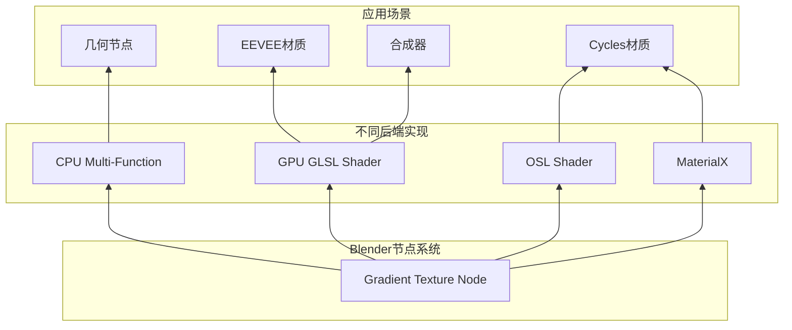
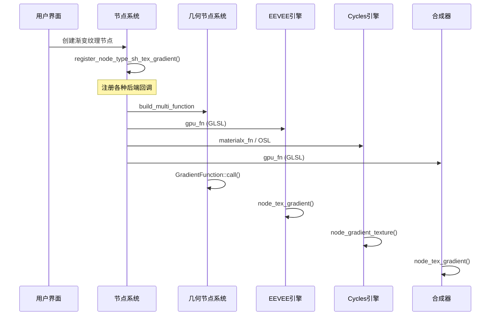
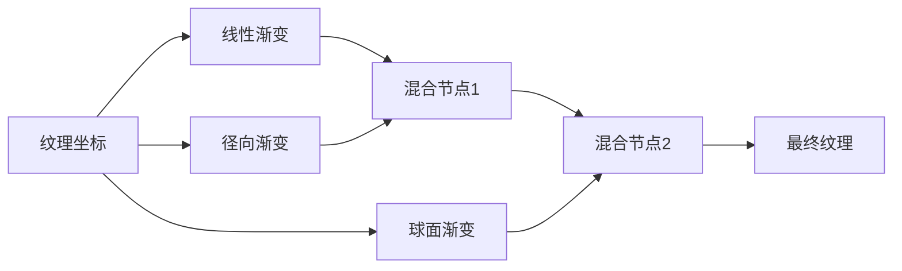

# 04. 渐变纹理节点详解

## 目录
- [4.1 概述](#41-概述)
- [4.2 渐变纹理节点基础](#42-渐变纹理节点基础)
- [4.3 渐变类型详解](#43-渐变类型详解)
- [4.4 输出接口计算原理](#44-输出接口计算原理)
- [4.5 多系统支持架构](#45-多系统支持架构)
- [4.6 源码文件分析](#46-源码文件分析)
  - [4.6.1 CPU端实现分析](#461-cpu端实现分析)
  - [4.6.2 GPU着色器实现分析](#462-gpu着色器实现分析)
  - [4.6.3 OSL实现分析](#463-osl实现分析)
- [4.7 文件间调用关系](#47-文件间调用关系)
- [4.8 数学原理深入](#48-数学原理深入)
- [4.9 高级应用技巧](#49-高级应用技巧)

---

## 4.1 概述

<span style="background-color:#e1f5fe; color:#01579b;">渐变纹理节点（Gradient Texture）</span>是Blender中一个非常基础且强大的纹理生成节点，它能够基于输入的向量坐标生成各种类型的渐变效果。这个节点在<span style="background-color:#fff3e0; color:#e65100;">材质渲染</span>、<span style="background-color:#f3e5f5; color:#6a1b9a;">几何节点</span>和<span style="background-color:#e8f5e8; color:#2e7d32;">合成器</span>中都有着广泛的应用。

### 核心功能
- 🎨 生成7种不同类型的渐变模式
- 📐 基于三维向量坐标进行计算
- 🔄 同时支持多种渲染后端
- ⚡ 优化的GPU和CPU实现

---

## 4.2 渐变纹理节点基础

### 4.2.1 节点接口定义

渐变纹理节点的接口定义在 `source/blender/nodes/shader/nodes/node_shader_tex_gradient.cc:20-27`：

```cpp
static void sh_node_tex_gradient_declare(NodeDeclarationBuilder &b)
{
  b.is_function_node();
  b.add_input<decl::Vector>("Vector").hide_value().implicit_field(
      NODE_DEFAULT_INPUT_POSITION_FIELD);
  b.add_output<decl::Color>("Color").no_muted_links();
  b.add_output<decl::Float>("Factor", "Fac").no_muted_links();
}
```

**接口说明：**
- <span style="color:#1976d2;">**Vector输入**</span>：三维向量坐标，默认使用纹理坐标
- <span style="color:#388e3c;">**Color输出**</span>：基于渐变因子生成的灰度颜色
- <span style="color:#f57c00;">**Factor输出**</span>：0.0到1.0之间的渐变因子值

### 4.2.2 节点存储结构

节点的内部数据存储在 `NodeTexGradient` 结构中：

```cpp
typedef struct NodeTexGradient {
  NodeTex base;           // 基础纹理属性
  int gradient_type;      // 渐变类型枚举
} NodeTexGradient;
```

**渐变类型枚举值：**
- `SHD_BLEND_LINEAR = 0` - 线性渐变
- `SHD_BLEND_QUADRATIC = 1` - 二次渐变  
- `SHD_BLEND_EASING = 2` - 缓动渐变
- `SHD_BLEND_DIAGONAL = 3` - 对角渐变
- `SHD_BLEND_RADIAL = 4` - 径向渐变
- `SHD_BLEND_QUADRATIC_SPHERE = 5` - 二次球面渐变
- `SHD_BLEND_SPHERICAL = 6` - 球面渐变

---

## 4.3 渐变类型详解

### 4.3.1 数学公式对比

| 渐变类型 | 数学公式 | 特点 | 应用场景 |
|---------|---------|------|---------|
| <span style="color:#2196f3;">线性</span> | $f = \text{clamp}(x, 0, 1)$ | 简单线性插值 | 基础渐变效果 |
| <span style="color:#4caf50;">二次</span> | $f = \text{clamp}(\max(x, 0)^2, 0, 1)$ | 二次加速曲线 | 加速过渡效果 |
| <span style="color:#ff9800;">缓动</span> | $f = 3t^2 - 2t^3$, $t = \text{clamp}(x, 0, 1)$ | 平滑的S曲线 | 自然过渡效果 |
| <span style="color:#9c27b0;">对角</span> | $f = \text{clamp}(\frac{x + y}{2}, 0, 1)$ | 对角方向渐变 | 角落到角落渐变 |
| <span style="color:#f44336;">径向</span> | $f = \frac{\arctan2(y, x)}{2\pi} + 0.5$ | 角度基础渐变 | 圆形彩虹效果 |
| <span style="color:#795548;">球面</span> | $f = \max(1 - \sqrt{x^2 + y^2 + z^2}, 0)$ | 距离衰减 | 球形衰减效果 |
| <span style="color:#607d8b;">二次球面</span> | $f = \max(1 - \sqrt{x^2 + y^2 + z^2}, 0)^2$ | 二次距离衰减 | 更锐利的球形衰减 |

### 4.3.2 可视化渐变模式

```mermaid
graph TD
    A[输入向量 Vector] --> B{渐变类型选择}
    
    B -->|线性| C[x分量直接输出]
    B -->|二次| D[x² 平方变换]
    B -->|缓动| E[3t²-2t³ 平滑插值]
    B -->|对角| F[(x+y)/2 对角计算]
    B -->|径向| G[atan2 y,x 角度计算]
    B -->|球面| H[1-√x²+y²+z² 距离衰减]
    B -->|二次球面| I[(1-√x²+y²+z²)² 平方衰减]
    
    C --> J[clamp 0-1]
    D --> J
    E --> J
    F --> J
    G --> J
    H --> J
    I --> J
    
    J --> K[Factor输出]
    J --> L[Color = Factor, Factor, Factor, 1]
```

---

## 4.4 输出接口计算原理

### 4.4.1 Factor输出计算

**核心计算流程：**
1. 根据渐变类型选择相应的数学公式
2. 对输入向量进行坐标变换和计算
3. 将结果限制在[0, 1]范围内
4. 输出最终因子值

**详细实现分析**（`source/blender/nodes/shader/nodes/node_shader_tex_gradient.cc:86-139`）：

```cpp
switch (gradient_type_) {
  case SHD_BLEND_LINEAR: {
    mask.foreach_index(
        [&](const int64_t i) { fac[i] = math::clamp(vector[i].x, 0.0f, 1.0f); });
    break;
  }
  case SHD_BLEND_QUADRATIC: {
    mask.foreach_index([&](const int64_t i) {
      const float r = std::max(vector[i].x, 0.0f);
      fac[i] = math::clamp(r * r, 0.0f, 1.0f);
    });
    break;
  }
  // ... 其他类型
}
```

### 4.4.2 Color输出计算

**颜色计算非常简单：**
```cpp
if (compute_color) {
  mask.foreach_index(
      [&](const int64_t i) { r_color[i] = ColorGeometry4f(fac[i], fac[i], fac[i], 1.0f); });
}
```

**颜色构成：**
- <span style="color:red;">红色分量</span> = Factor值
- <span style="color:green;">绿色分量</span> = Factor值  
- <span style="color:blue;">蓝色分量</span> = Factor值
- <span style="color:gray;">Alpha分量</span> = 1.0（完全不透明）

这种设计确保了颜色输出始终是灰度，便于后续的颜色混合操作。

---

## 4.5 多系统支持架构

### 4.5.1 为什么需要多后端支持？

Blender需要在不同的渲染环境中工作：
- <span style="background-color:#e3f2fd; color:#1565c0;">**EEVEE**</span>：实时渲染，需要GPU优化
- <span style="background-color:#fce4ec; color:#c2185b;">**Cycles**</span>：光线追踪，支持OSL着色语言
- <span style="background-color:#f1f8e9; color:#558b2f;">**几何节点**</span>：程序化建模，需要CPU多函数支持
- <span style="background-color:#fff8e1; color:#f57f17;">**合成器**</span>：图像处理，需要实时GPU计算

### 4.5.2 统一接口设计



### 4.5.3 注册机制

节点注册函数 `register_node_type_sh_tex_gradient()` 在 `source/blender/nodes/shader/nodes/node_shader_tex_gradient.cc:200-222` 中定义了不同后端的回调函数：

```cpp
void register_node_type_sh_tex_gradient()
{
  // ... 节点基础设置
  ntype.gpu_fn = file_ns::node_shader_gpu_tex_gradient;           // GPU后端
  ntype.build_multi_function = file_ns::sh_node_gradient_tex_build_multi_function; // CPU后端
  ntype.materialx_fn = file_ns::node_shader_materialx;             // MaterialX后端
  // ...
}
```

这种设计模式称为<span style="background-color:#fff3e0; color:#ef6c00;">**策略模式**</span>，允许同一个节点接口在不同环境下使用不同的实现策略。

---

## 4.6 源码文件分析

### 4.6.1 CPU端实现分析

#### 文件：`source/blender/nodes/shader/nodes/node_shader_tex_gradient.cc`

**关键类：GradientFunction**
```cpp
class GradientFunction : public mf::MultiFunction
{
 private:
  int gradient_type_;  // 存储渐变类型
 
 public:
  GradientFunction(int gradient_type) : gradient_type_(gradient_type)
  {
    // 签名定义：输入1个Vector，输出Color和Factor
    static const mf::Signature signature = []() {
      mf::Signature signature;
      mf::SignatureBuilder builder{"GradientFunction", signature};
      builder.single_input<float3>("Vector");
      builder.single_output<ColorGeometry4f>("Color", mf::ParamFlag::SupportsUnusedOutput);
      builder.single_output<float>("Fac");
      return signature;
    }();
    this->set_signature(&signature);
  }
```

**执行函数分析**（`source/blender/nodes/shader/nodes/node_shader_tex_gradient.cc:76-144`）：

```cpp
void call(const IndexMask &mask, mf::Params params, mf::Context /*context*/) const override
{
  // 1. 获取输入向量数组
  const VArray<float3> &vector = params.readonly_single_input<float3>(0, "Vector");

  // 2. 获取输出数组引用
  MutableSpan<ColorGeometry4f> r_color =
      params.uninitialized_single_output_if_required<ColorGeometry4f>(1, "Color");
  MutableSpan<float> fac = params.uninitialized_single_output<float>(2, "Fac");

  // 3. 检查是否需要计算颜色（优化：如果颜色输出未连接则跳过）
  const bool compute_color = !r_color.is_empty();

  // 4. 根据渐变类型进行批量计算
  switch (gradient_type_) {
    // ... 各种渐变类型的实现
  }
  
  // 5. 如果需要，将因子转换为颜色
  if (compute_color) {
    mask.foreach_index(
        [&](const int64_t i) { r_color[i] = ColorGeometry4f(fac[i], fac[i], fac[i], 1.0f); });
  }
}
```

**性能优化要点：**
- ✅ 使用<span style="color:#4caf50;">**IndexMask**</span>进行批量处理，避免循环开销
- ✅ <span style="color:#2196f3;">**延迟计算**</span>：只有在需要时才计算颜色输出
- ✅ <span style="color:#ff9800;">**SIMD友好**</span>：数据布局适合向量化

### 4.6.2 GPU着色器实现分析

#### 文件：`source/blender/gpu/shaders/material/gpu_shader_material_tex_gradient.glsl`

**核心函数：calc_gradient**
```glsl
float calc_gradient(float3 p, int gradient_type)
{
  float x, y, z;
  x = p.x;
  y = p.y;
  z = p.z;
  
  if (gradient_type == 0) { /* linear */
    return x;
  }
  else if (gradient_type == 1) { /* quadratic */
    float r = max(x, 0.0f);
    return r * r;
  }
  // ... 其他渐变类型
}
```

**主函数：node_tex_gradient**
```glsl
void node_tex_gradient(float3 co, float gradient_type, out float4 color, out float fac)
{
  float f = calc_gradient(co, int(gradient_type));
  f = clamp(f, 0.0f, 1.0f);

  color = float4(f, f, f, 1.0f);
  fac = f;
}
```

**GPU实现特点：**
- 🚀 <span style="background-color:#e8f5e8; color:#1b5e20;">**并行计算**</span>：GPU同时处理所有像素
- 📦 <span style="background-color:#fff3e0; color:#e65100;">**寄存器优化**</span>：使用局部变量减少内存访问
- ⚡ <span style="background-color:#f3e5f5; color:#4a148c;">**分支优化**</span>：使用if-else而非switch，在某些GPU上更高效

### 4.6.3 OSL实现分析

#### 文件：`intern/cycles/kernel/osl/shaders/node_gradient_texture.osl`

**渐变计算函数：**
```osl
float gradient(point p, string type)
{
  float x, y, z;
  x = p[0];
  y = p[1]; 
  z = p[2];

  float result = 0.0;

  if (type == "linear") {
    result = x;
  }
  else if (type == "quadratic") {
    float r = max(x, 0.0);
    result = r * r;
  }
  // ... 其他类型
  return clamp(result, 0.0, 1.0);
}
```

**着色器主函数：**
```osl
shader node_gradient_texture(
    int use_mapping = 0,
    matrix mapping = matrix(0, 0, 0, 0, 0, 0, 0, 0, 0, 0, 0, 0, 0, 0, 0, 0),
    string gradient_type = "linear",
    point Vector = P,
    output float Fac = 0.0,
    output color Color = 0.0)
{
  point p = Vector;

  if (use_mapping)
    p = transform(mapping, P);

  Fac = gradient(p, gradient_type);
  Color = color(Fac, Fac, Fac);
}
```

**OSL特点：**
- 🎭 <span style="background-color:#e0f2f1; color:#004d40;">**字符串参数**</span>：使用字符串而非枚举，更灵活
- 🗺️ <span style="background-color:#fff8e1; color:#f57f17;">**坐标变换**</span>：内置映射矩阵支持
- 🌐 <span style="background-color:#f1f8e9; color:#33691e;">**全局变量P**</span>：默认使用着色点位置

---

## 4.7 文件间调用关系

### 4.7.1 调用链路图



### 4.7.2 关键调用点

**1. 节点注册** (`source/blender/nodes/shader/nodes/node_shader_tex_gradient.cc:217-219`)
```cpp
ntype.gpu_fn = file_ns::node_shader_gpu_tex_gradient;
ntype.build_multi_function = file_ns::sh_node_gradient_tex_build_multi_function;
ntype.materialx_fn = file_ns::node_shader_materialx;
```

**2. GPU调用链** (`source/blender/nodes/shader/nodes/node_shader_tex_gradient.cc:44-56`)
```cpp
static int node_shader_gpu_tex_gradient(GPUMaterial *mat,
                                        bNode *node,
                                        bNodeExecData * /*execdata*/,
                                        GPUNodeStack *in,
                                        GPUNodeStack *out)
{
  node_shader_gpu_default_tex_coord(mat, node, &in[0].link);  // 设置默认纹理坐标
  node_shader_gpu_tex_mapping(mat, node, in, out);           // 应用纹理映射
  
  NodeTexGradient *tex = (NodeTexGradient *)node->storage;
  float gradient_type = tex->gradient_type;
  return GPU_stack_link(mat, node, "node_tex_gradient", in, out, GPU_constant(&gradient_type));
}
```

**3. CPU多函数构建** (`source/blender/nodes/shader/nodes/node_shader_tex_gradient.cc:147-152`)
```cpp
static void sh_node_gradient_tex_build_multi_function(NodeMultiFunctionBuilder &builder)
{
  const bNode &node = builder.node();
  NodeTexGradient *tex = (NodeTexGradient *)node.storage;
  builder.construct_and_set_matching_fn<GradientFunction>(tex->gradient_type);
}
```

---

## 4.8 数学原理深入

### 4.8.1 坐标系统基础

**Blender使用的坐标系：**
- <span style="color:#e91e63;">**X轴**</span>：水平方向（左→右）
- <span style="color:#2196f3;">**Y轴**</span>：深度方向（前→后）  
- <span style="color:#4caf50;">**Z轴**</span>：垂直方向（下→上）

### 4.8.2 各种渐变的数学原理

#### 线性渐变
$$f(x,y,z) = \text{clamp}(x, 0, 1)$$

**特点：**
- 只考虑X坐标
- 线性映射关系
- 简单直观

#### 二次渐变  
$$f(x,y,z) = \text{clamp}(\max(x, 0)^2, 0, 1)$$

**特点：**
- 平方函数增强变化率
- 负值被截断为0
- 创建加速效果

#### 缓动渐变（Smoothstep）
$$t = \text{clamp}(x, 0, 1)$$
$$f(x,y,z) = 3t^2 - 2t^3$$

**推导过程：**
这是著名的<span style="background-color:#e8f5e8; color:#2e7d32;">**Hermite插值**</span>函数，满足：
- $f(0) = 0$, $f(1) = 1$（端点条件）
- $f'(0) = 0$, $f'(1) = 0$（平滑过渡）

#### 径向渐变
$$f(x,y,z) = \frac{\arctan2(y, x)}{2\pi} + 0.5$$

**数学原理：**
- $\arctan2(y,x)$ 返回点$(x,y)$相对于X正方向的角度
- 除以 $2\pi$ 将角度范围 $[0, 2\pi)$ 映射到 $[0, 1)$
- 加0.5将值调整到合适范围

#### 球面渐变
$$r = \sqrt{x^2 + y^2 + z^2}$$
$$f(x,y,z) = \max(1 - r, 0)$$

**物理意义：**
- $r$ 是点到原点的欧几里得距离
- $1-r$ 创建从中心向外的衰减
- $\max(·, 0)$ 确保非负值

### 4.8.3 数值稳定性考虑

**浮点精度问题：**
在球面渐变中，当输入是单位长度向量时，由于浮点精度误差，$\sqrt{x^2 + y^2 + z^2}$ 可能略大于1，导致负的小值。

**解决方案：**
```cpp
// 使用微小的偏移量确保精确的零值
const float r = std::max(0.999999f - math::length(vector[i]), 0.0f);
```

这种<span style="background-color:#fff3e0; color:#ef6c00;">**数值补偿**</span>技术在高精度渲染中非常重要。

---

## 4.9 高级应用技巧

### 4.9.1 复杂渐变组合

**多层渐变叠加：**


**实际应用场景：**
- 🎨 <span style="background-color:#f3e5f5; color:#6a1b9a;">**材质创建**</span>：金属表面的氧化效果
- 🌍 <span style="background-color:#e1f5fe; color:#01579b;">**地形生成**</span>：海拔高度的植被分布
- 🔥 <span style="background-color:#ffebee; color:#c62828;">**特效制作**</span>：能量场的渐变效果

### 4.9.2 坐标变换技巧

**常用坐标变换模式：**
1. **缩放变换**：控制渐变密度
2. **旋转变换**：改变渐变方向
3. **平移变换**：调整渐变位置
4. **非线性变换**：创建扭曲效果

**示例：螺旋渐变**
```cpp
// 结合径向和线性渐变创建螺旋效果
float radial = atan2(y, x) / (2 * M_PI) + 0.5;
float linear = x;
float spiral = fract(radial * 3.0 + linear * 2.0);
```

### 4.9.3 性能优化建议

**对于实时渲染：**
- ⚡ 优先使用简单的线性渐变
- 🎯 避免在像素着色器中使用复杂的球面渐变
- 💾 使用预计算的渐变纹理

**对于离线渲染：**
- 🔬 可以使用复杂的数学函数
- 🎨 重视视觉效果胜过性能
- 📊 考虑使用高精度数据类型

---

## 总结

渐变纹理节点是Blender节点系统中的一个典范，展示了如何：

1. 🏗️ **统一接口设计**：同一节点支持多种渲染后端
2. ⚡ **性能优化**：CPU和GPU的专门优化实现
3. 🎯 **数学精确性**：严格的数学定义和数值稳定性
4. 🔄 **可扩展性**：易于添加新的渐变类型
5. 📚 **代码复用**：核心逻辑在不同实现间共享

通过深入理解这个节点的实现，我们可以学习到Blender节点系统的核心设计理念，为创建自定义节点打下坚实基础。

---

**相关文件索引：**
- 主实现：`source/blender/nodes/shader/nodes/node_shader_tex_gradient.cc:1-223`
- GPU着色器：`source/blender/gpu/shaders/material/gpu_shader_material_tex_gradient.glsl:1-52`
- OSL实现：`intern/cycles/kernel/osl/shaders/node_gradient_texture.osl:1-66`

**数学公式索引：**
- 线性渐变：$\text{clamp}(x, 0, 1)$
- 二次渐变：$\text{clamp}(\max(x, 0)^2, 0, 1)$
- 缓动渐变：$3t^2 - 2t^3$, $t = \text{clamp}(x, 0, 1)$
- 径向渐变：$\frac{\arctan2(y, x)}{2\pi} + 0.5$
- 球面渐变：$\max(1 - \sqrt{x^2 + y^2 + z^2}, 0)$