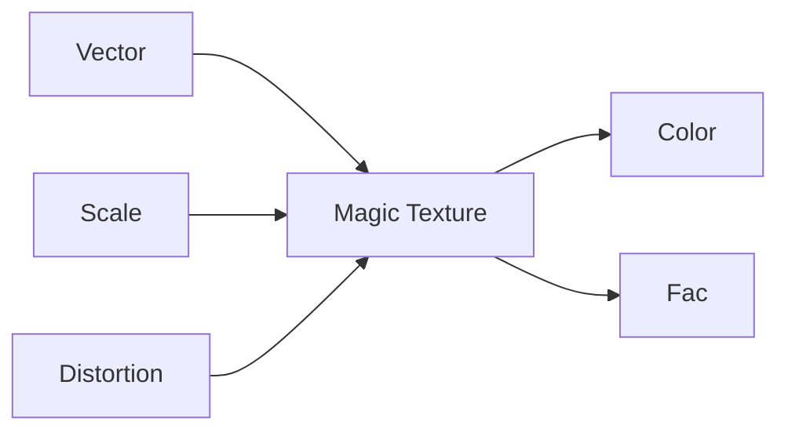
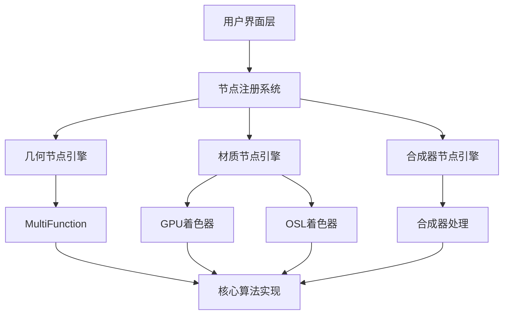
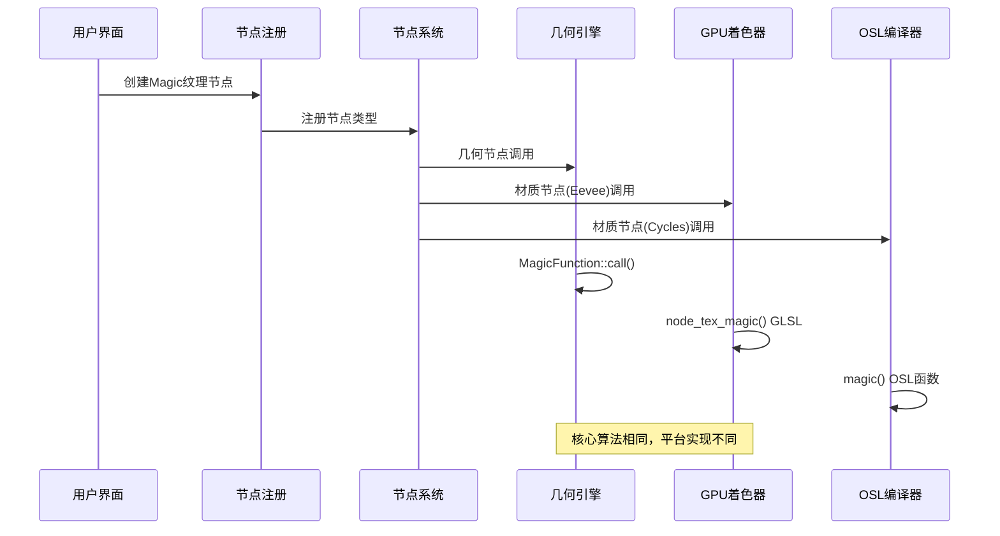
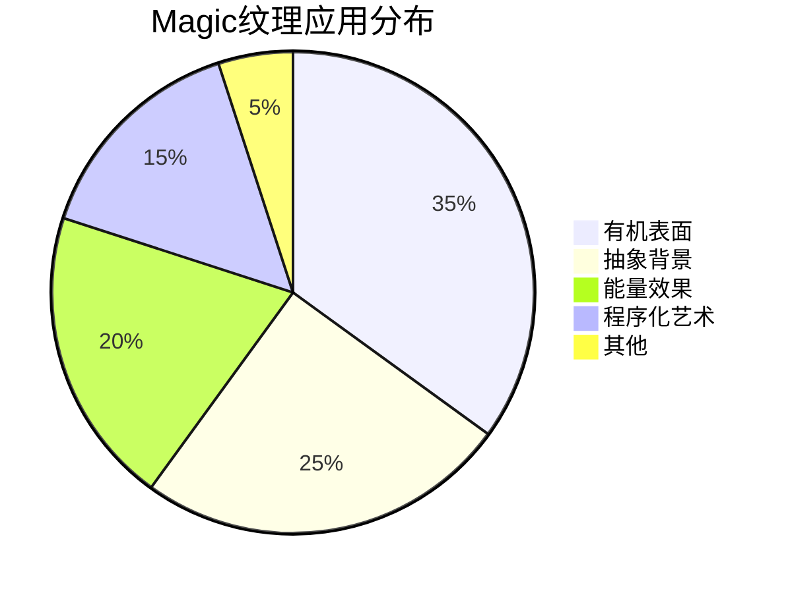
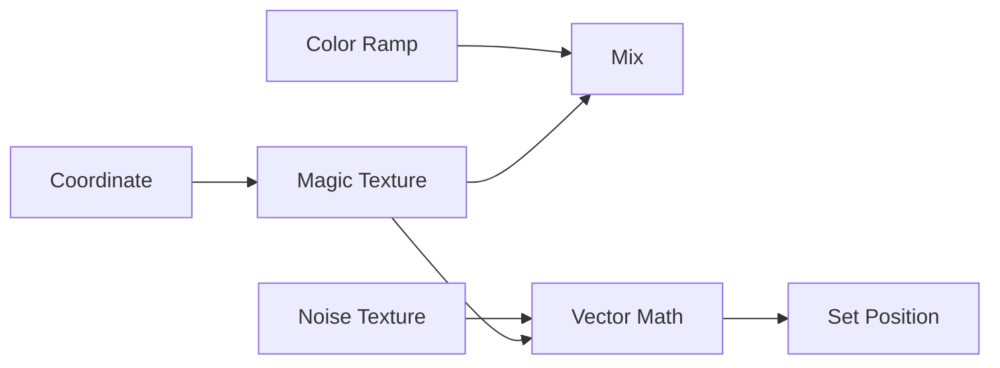

# Magic纹理节点详解

## 目录
- [1. 概述](#1-概述)
- [2. 节点结构与接口](#2-节点结构与接口)
- [3. 核心算法原理](#3-核心算法原理)
- [4. 多平台实现架构](#4-多平台实现架构)
- [5. 代码分析](#5-代码分析)
- [6. 文件间调用关系](#6-文件间调用关系)
- [7. 数学原理详解](#7-数学原理详解)
- [8. 应用场景与技巧](#8-应用场景与技巧)
- [9. 常见问题与调试](#9-常见问题与调试)

---

## 1. 概述

### 1.1 什么是Magic纹理节点

<span style="background-color:#e3f2fd; color:#1565c0;">**Magic纹理节点**</span> 是Blender中一个特殊的程序纹理节点，通过<span style="background-color:#f3e5f5; color:#7b1fa2;">**数学函数组合**</span>生成迷幻、抽象的彩色纹理。与基于图像的纹理不同，Magic纹理完全通过<span style="background-color:#fff3e0; color:#e65100;">**算法计算**</span>实时生成，因此具有无限分辨率和平滑的可缩放性。

### 1.2 历史背景

Magic纹理源于早期计算机图形学中的<span style="background-color:#e8f5e8; color:#2e7d32;">**过程纹理**</span>技术，最初由Ken Perlin等图形学先驱开发。Blender中的Magic纹理基于经典的三角函数迭代算法，能够产生有机的、流体般的视觉效果。

### 1.3 主要特点

- 🔥 **实时计算**: 完全通过数学函数生成，无需预加载图像
- 🎨 **丰富多彩**: 自动生成渐变色彩过渡
- ⚡ **高性能**: 优化的GPU着色器实现
- 🔧 **参数可控**: 通过Scale、Distortion等参数调节效果
- 🌐 **多平台支持**: 同时支持几何节点、材质节点和合成器节点

---

## 2. 节点结构与接口

### 2.1 输入接口详解

Magic纹理节点包含以下输入接口：



#### 2.1.1 Vector输入

- **类型**: Vector (float3)
- **默认值**: 几何体的位置坐标
- **作用**: 指定纹理采样的三维空间坐标
- **技术细节**: 
  - 在几何节点中通常使用内置的position属性
  - 在材质节点中可以使用Generated、Texture Coordinate等

#### 2.1.2 Scale输入

- **类型**: Float
- **范围**: -1000.0 到 1000.0
- **默认值**: 5.0
- **作用**: 控制纹理的缩放比例
- **数学原理**: Scale值越大，纹理重复越频繁；Scale为负值时会产生翻转效果

#### 2.1.3 Distortion输入

- **类型**: Float  
- **范围**: -1000.0 到 1000.0
- **默认值**: 1.0
- **作用**: 控制纹理的扭曲程度
- **数学原理**: Distortion值影响迭代过程中每个阶段的振幅

### 2.2 输出接口详解

#### 2.2.1 Color输出

- **类型**: Color (RGBA)
- **计算公式**: 
  ```math
  \text{Color} = (0.5 - x, 0.5 - y, 0.5 - z, 1.0)
  ```
- **颜色空间**: Linear sRGB
- **取值范围**: [0, 1] 内的RGB值

#### 2.2.2 Fac输出

- **类型**: Float
- **计算公式**: 
  ```math
  \text{Fac} = \frac{R + G + B}{3}
  ```
- **用途**: 提供颜色的平均亮度值，常用于混合操作

---

## 3. 核心算法原理

### 3.1 数学基础

Magic纹理的核心基于<span style="background-color:#fce4ec; color:#c2185b;">**三角函数组合**</span>，通过迭代计算生成复杂的视觉效果：

#### 3.1.1 初始计算

```math
\begin{align}
x_0 &= \sin(5.0 \cdot (p_x + p_y + p_z)) \\
y_0 &= \cos(5.0 \cdot (-p_x + p_y - p_z)) \\
z_0 &= -\cos(5.0 \cdot (-p_x - p_y + p_z))
\end{align}
```

其中 $p = \text{mod}(\text{vector} \times \text{scale}, 2\pi)$

#### 3.1.2 迭代过程

根据depth参数进行多层迭代，每一层都对x、y、z值进行重新计算：

```mermaid
flowchart TD
    A[初始xyz计算] --> B{depth > 0?}
    B -->|是| C[应用distortion]
    C --> D[y = -cos(x - y + z)]
    D --> E{depth > 1?}
    E -->|是| F[x = cos(x - y - z)]
    F --> G{depth > 2?}
    G -->|是| H[z = sin(-x - y - z)]
    H --> I{depth > 3?}
    I -->|是| J[继续迭代...]
    J --> K[最终处理]
    K --> L[输出颜色]
```

### 3.2 深度参数详解

Depth参数控制迭代次数（0-9），影响纹理的复杂度：

| Depth值 | 迭代次数 | 视觉效果 | 计算复杂度 |
|---------|---------|---------|-----------|
| 0 | 0 | 简单正弦波 | ⭐ |
| 2 | 2 | 基础扭曲 | ⭐⭐ |
| 4 | 4 | 中等复杂度 | ⭐⭐⭐ |
| 6 | 6 | 高复杂度 | ⭐⭐⭐⭐ |
| 9 | 9 | 极致复杂 | ⭐⭐⭐⭐⭐ |

---

## 4. 多平台实现架构

### 4.1 统一接口设计

Blender通过<span style="background-color:#fff8e1; color:#ff8f00;">**统一节点系统**</span>实现了跨平台的节点复用：



### 4.2 引擎差异说明

#### 4.2.1 几何节点 (Geometry Nodes)

- **实现方式**: MultiFunction C++类
- **执行环境**: CPU多线程处理
- **优势**: 精确控制，支持属性系统
- **文件位置**: `source/blender/nodes/shader/nodes/node_shader_tex_magic.cc:62-169`

#### 4.2.2 材质节点 (Shader Nodes)

- **EEVEE引擎**: GPU着色器实现
- **Cycles引擎**: OSL (Open Shading Language) 或 SVM实现
- **文件位置**: 
  - GPU: `source/blender/gpu/shaders/material/gpu_shader_material_tex_magic.glsl:5-66`
  - OSL: `intern/cycles/kernel/osl/shaders/node_magic_texture.osl:8-81`

#### 4.2.3 合成器节点 (Compositor)

- **实现方式**: 基于材质节点的GPU实现
- **处理流程**: 复用GPU着色器代码

### 4.3 性能优化策略

1. **GPU并行计算**: 着色器在GPU上并行处理数百万像素
2. **SIMD优化**: CPU版本使用向量指令优化
3. **早期退出**: 条件判断避免不必要的计算
4. **内存局部性**: 优化数据访问模式

---

## 5. 代码分析

### 5.1 C++节点实现分析

#### 5.1.1 节点声明 (`sh_node_tex_magic_declare`)

```cpp
// source/blender/nodes/shader/nodes/node_shader_tex_magic.cc:17-30
static void sh_node_tex_magic_declare(NodeDeclarationBuilder &b)
{
  b.is_function_node();
  b.add_input<decl::Vector>("Vector").implicit_field(NODE_DEFAULT_INPUT_POSITION_FIELD);
  b.add_input<decl::Float>("Scale").min(-1000.0f).max(1000.0f).default_value(5.0f);
  b.add_input<decl::Float>("Distortion").min(-1000.0f).max(1000.0f).default_value(1.0f);
  b.add_output<decl::Color>("Color").no_muted_links();
  b.add_output<decl::Float>("Factor", "Fac").no_muted_links();
}
```

<span style="background-color:#e8f5e8; color:#2e7d32;">**关键点解释**</span>:
- `is_function_node()`: 标记为函数节点，支持字段系统
- `implicit_field()`: 自动使用几何体位置作为默认输入
- `no_muted_links()`: 禁用链接静音功能，确保输出始终有效

#### 5.1.2 MultiFunction实现 (`MagicFunction`)

```cpp
// source/blender/nodes/shader/nodes/node_shader_tex_magic.cc:94-162
mask.foreach_index([&](const int64_t i) {
  const float3 co = vector[i] * scale[i];
  const float distort = distortion[i];
  float x = sinf((co[0] + co[1] + co[2]) * 5.0f);
  float y = cosf((-co[0] + co[1] - co[2]) * 5.0f);
  float z = -cosf((-co[0] - co[1] + co[2]) * 5.0f);
  // ... 迭代计算 ...
  r_color[i] = ColorGeometry4f(0.5f - x, 0.5f - y, 0.5f - z, 1.0f);
});
```

<span style="background-color:#fff3e0; color:#e65100;">**性能分析**</span>:
- `foreach_index`: 并行处理多个数据点
- `sinf`/`cosf`: 使用单精度浮点数提高性能
- 直接内存访问: 避免函数调用开销

### 5.2 GPU着色器实现分析

#### 5.2.1 GLSL实现

```glsl
// source/blender/gpu/shaders/material/gpu_shader_material_tex_magic.glsl:5-66
void node_tex_magic(
    float3 co, float scale, float distortion, float depth, 
    out float4 color, out float fac)
{
  float3 p = mod(co * scale, 2.0f * M_PI);
  
  float x = sin((p.x + p.y + p.z) * 5.0f);
  float y = cos((-p.x + p.y - p.z) * 5.0f);
  float z = -cos((-p.x - p.y + p.z) * 5.0f);
  
  // ... 迭代过程 ...
  
  color = float4(0.5f - x, 0.5f - y, 0.5f - z, 1.0f);
  fac = (color.x + color.y + color.z) / 3.0f;
}
```

<span style="background-color:#f3e5f5; color:#7b1fa2;">**GPU优化要点**</span>:
- `mod()`: 使用模运算限制输入范围，提高数值稳定性
- `M_PI`: 使用预定义的π常量
- 向量运算: 充分利用GPU并行计算能力

#### 5.2.2 着色器链接过程

```cpp
// source/blender/nodes/shader/nodes/node_shader_tex_magic.cc:47-60
static int node_shader_gpu_tex_magic(GPUMaterial *mat,
                                     bNode *node,
                                     bNodeExecData * /*execdata*/,
                                     GPUNodeStack *in,
                                     GPUNodeStack *out)
{
  NodeTexMagic *tex = (NodeTexMagic *)node->storage;
  float depth = tex->depth;
  
  node_shader_gpu_default_tex_coord(mat, node, &in[0].link);
  node_shader_gpu_tex_mapping(mat, node, in, out);
  
  return GPU_stack_link(mat, node, "node_tex_magic", in, out, GPU_constant(&depth));
}
```

### 5.3 OSL实现分析

#### 5.3.1 核心函数

```osl
// intern/cycles/kernel/osl/shaders/node_magic_texture.osl:8-81
color magic(point p, float scale, int n, float distortion)
{
  float dist = distortion;
  
  float a = mod(p.x * scale, M_2PI);
  float b = mod(p.y * scale, M_2PI);
  float c = mod(p.z * scale, M_2PI);
  
  float x = sin((a + b + c) * 5.0);
  float y = cos((-a + b - c) * 5.0);
  float z = -cos((-a - b + c) * 5.0);
  
  // ... 迭代计算 ...
  
  return color(0.5 - x, 0.5 - y, 0.5 - z);
}
```

<span style="background-color:#e3f2fd; color:#1565c0;">**OSL特点**</span>:
- `point`类型: 专门的三维位置类型
- `M_2PI`: 2π常量，用于模运算
- `color`类型: OSL专门的色彩类型

#### 5.3.2 着色器接口

```osl
// intern/cycles/kernel/osl/shaders/node_magic_texture.osl:83-99
shader node_magic_texture(
    int use_mapping = 0,
    matrix mapping = matrix(0, 0, 0, 0, 0, 0, 0, 0, 0, 0, 0, 0, 0, 0, 0, 0),
    int depth = 2,
    float Distortion = 5.0,
    float Scale = 5.0,
    point Vector = P,
    output float Fac = 0.0,
    output color Color = 0.0)
{
  point p = Vector;
  
  if (use_mapping)
    p = transform(mapping, p);
  
  Color = magic(p, Scale, depth, Distortion);
  Fac = (Color[0] + Color[1] + Color[2]) * (1.0 / 3.0);
}
```

---

## 6. 文件间调用关系

### 6.1 调用链路图



### 6.2 关键接口说明

#### 6.2.1 节点注册流程

```cpp
// source/blender/nodes/shader/nodes/node_shader_tex_magic.cc:180-200
void register_node_type_sh_tex_magic()
{
  namespace file_ns = blender::nodes::node_shader_tex_magic_cc;
  
  static blender::bke::bNodeType ntype;
  
  common_node_type_base(&ntype, "ShaderNodeTexMagic", SH_NODE_TEX_MAGIC);
  ntype.ui_name = "Magic Texture";
  ntype.declare = file_ns::sh_node_tex_magic_declare;
  ntype.draw_buttons = file_ns::node_shader_buts_tex_magic;
  ntype.initfunc = file_ns::node_shader_init_tex_magic;
  ntype.gpu_fn = file_ns::node_shader_gpu_tex_magic;
  ntype.build_multi_function = file_ns::sh_node_magic_tex_build_multi_function;
  
  blender::bke::node_register_type(ntype);
}
```

<span style="background-color:#fce4ec; color:#c2185b;">**重要函数指针**</span>:
- `declare`: 定义输入输出接口
- `initfunc`: 初始化节点存储数据
- `gpu_fn`: GPU着色器链接函数
- `build_multi_function`: 构建多函数实现

#### 6.2.2 存储数据结构

```cpp
// 通过BKE_texture.h中的NodeTexMagic结构体
// depth: 迭代深度 (0-9)
// base.tex_mapping: 纹理坐标映射
// base.color_mapping: 颜色映射
```

---

## 7. 数学原理详解

### 7.1 三角函数组合原理

Magic纹理基于<span style="background-color:#e0f2f1; color:#00695c;">**李萨如图形**</span>（Lissajous curves）的扩展，通过多维度的正弦余弦函数组合生成复杂图案：

#### 7.1.1 基础李萨如曲线

```math
\begin{align}
x(t) &= A \sin(a t + \delta) \\
y(t) &= B \sin(b t)
\end{align}
```

#### 7.1.2 Magic纹理的三维扩展

```math
\begin{align}
x &= \sin(5 \cdot (p_x + p_y + p_z)) \\
y &= \cos(5 \cdot (-p_x + p_y - p_z)) \\
z &= -\cos(5 \cdot (-p_x - p_y + p_z))
\end{align}
```

其中相位组合 $(+,+,+)$、$(-,+,-)$、$(-,-,+)$ 创建了特定的对称性。

### 7.2 迭代过程数学分析

每次迭代可以表示为复合函数：

```math
\begin{align}
F_0(x, y, z) &= (x_0, y_0, z_0) \\
F_1(x, y, z) &= (x_0 \cdot d, -\cos(x_0 - y_0 + z_0) \cdot d, z_0 \cdot d) \\
F_n(x, y, z) &= F_1(F_{n-1}(x, y, z))
\end{align}
```

其中 $d$ 为distortion参数。

### 7.3 数值稳定性分析

#### 7.3.1 模运算的作用

```glsl
float3 p = mod(co * scale, 2.0f * M_PI);
```

<span style="background-color:#fff8e1; color:#ff8f00;">**目的**</span>:
- 限制输入值范围到 $[0, 2\pi]$
- 避免大数值导致的精度损失
- 确保纹理周期性重复

#### 7.3.2 扭曲参数的归一化

```cpp
if (distort != 0.0f) {
  const float d = distort * 2.0f;
  x /= d;
  y /= d;
  z /= d;
}
```

<span style="background-color:#e8f5e8; color:#2e7d32;">**数学意义**</span>:
- 将最终结果归一化到合理范围
- 防止颜色值超出[0,1]区间
- 提供更直观的参数控制

---

## 8. 应用场景与技巧

### 8.1 常见应用场景

#### 8.1.1 有机纹理生成



#### 8.1.2 参数配置指南

| 效果类型 | Scale | Distortion | Depth | 用途 |
|---------|-------|------------|-------|------|
| 云朵效果 | 2-5 | 0.5-1.5 | 2-4 | 天空、烟雾 |
| 液体金属 | 8-15 | 2.0-5.0 | 6-8 | 水银、熔岩 |
| 能量场 | 1-3 | 3.0-8.0 | 7-9 | 魔法、科技 |
| 抽象艺术 | 5-10 | 1.0-3.0 | 3-6 | 艺术创作 |

### 8.2 高级技巧

#### 8.2.1 与其他节点组合



#### 8.2.2 动画技巧

- **时间驱动**: 将时间节点连接到Scale或Distortion
- **关键帧**: 对depth参数设置关键帧产生突变效果
- **驱动表达式**: 使用数学函数控制参数变化

#### 8.2.3 性能优化

<span style="background-color:#f3e5f5; color:#7b1fa2;">**GPU优化**</span>:
- 适当控制depth参数（建议≤6）
- 避免在大范围表面上使用高depth值
- 使用 baked 纹理替代实时计算（静态场景）

---

## 9. 常见问题与调试

### 9.1 常见问题

#### 9.1.1 颜色异常

**问题**: 输出颜色超出正常范围或出现噪点

<span style="background-color:#fff3e0; color:#e65100;">**解决方案**</span>:
1. 检查输入Vector坐标是否合理
2. 验证Scale值是否过大导致数值溢出
3. 确认Distortion参数在有效范围内

#### 9.1.2 性能问题

**问题**: 渲染速度过慢

<span style="background-color:#e3f2fd; color:#1565c0;">**优化建议**</span>:
```cpp
// 降低迭代深度
depth = min(depth, 6);  // 限制最大深度

// 使用简化版本（仅基础计算）
if (depth == 0) {
  // 只进行初始三角函数计算
}
```

#### 9.1.3 平台差异

**问题**: 不同渲染引擎输出不一致

<span style="background-color:#fce4ec; color:#c2185b;">**原因分析**</span>:
- 浮点精度差异（GPU vs CPU）
- 数值库实现差异
- 优化程度不同

### 9.2 调试技巧

#### 9.2.1 可视化调试

```glsl
// 添加调试输出
color = float4(p.x, p.y, p.z, 1.0);  // 可视化坐标
color = float4(x, y, z, 1.0);        // 可视化中间值
```

#### 9.2.2 参数隔离测试

1. **单参数测试**: 一次只调整一个参数
2. **极值测试**: 测试参数的最小和最大值
3. **基准对比**: 与已知正确的渲染对比

#### 9.2.3 性能分析

```bash
# 使用Blender的调试工具
blender --debug --debug-gpu
blender --debug-cycles
```

### 9.3 扩展开发

#### 9.3.1 自定义变体

```cpp
// 基于Magic纹理的自定义实现
class CustomMagicFunction : public mf::MultiFunction {
  // 添加新的参数和算法
  void call(const IndexMask &mask, mf::Params params, mf::Context context) const override {
    // 自定义算法实现
  }
};
```

#### 9.3.2 着色器扩展

```glsl
// 自定义GLSL函数
void custom_magic(float3 co, float scale, float custom_param, out float4 color) {
  // 扩展算法
  color = float4(...);
}
```

---

## 结语

Magic纹理节点展示了<span style="background-color:#e0f2f1; color:#00695c;">**程序纹理生成**</span>的强大潜力，通过数学算法创造出令人惊叹的视觉效果。理解其工作原理不仅有助于更好地使用这个节点，也为开发自定义纹理算法提供了宝贵的基础。

通过本详细文档的学习，您应该能够：

✅ 深入理解Magic纹理的数学原理  
✅ 熟练掌握各参数的作用和调节技巧  
✅ 了解多平台实现的架构设计  
✅ 具备调试和优化纹理节点的能力  
✅ 为开发自定义节点打下坚实基础  

希望这份详尽的文档能帮助您在Blender纹理创作之路上更进一步！