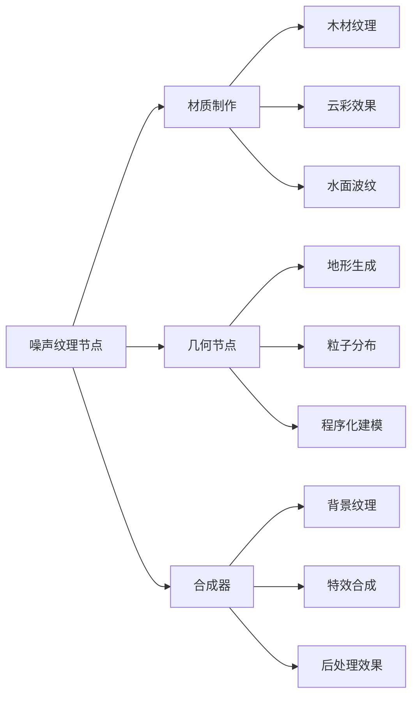
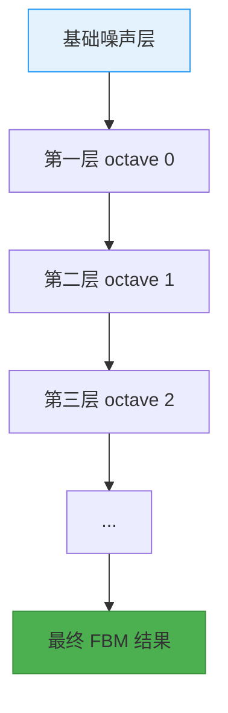
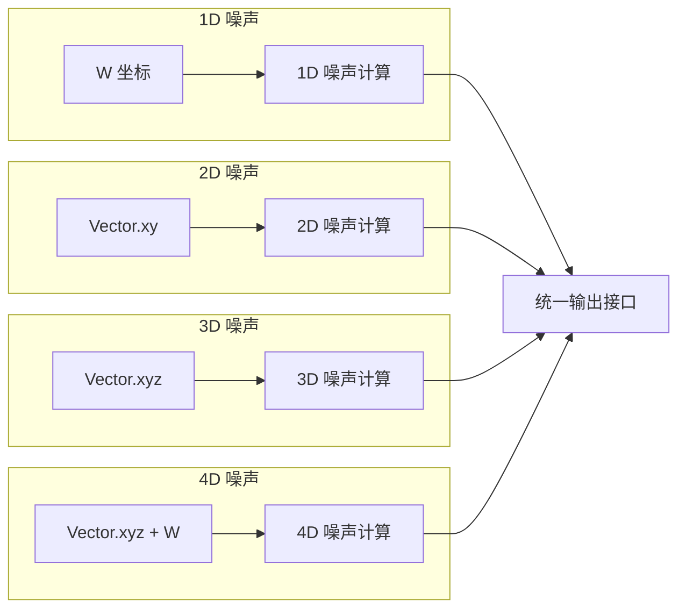
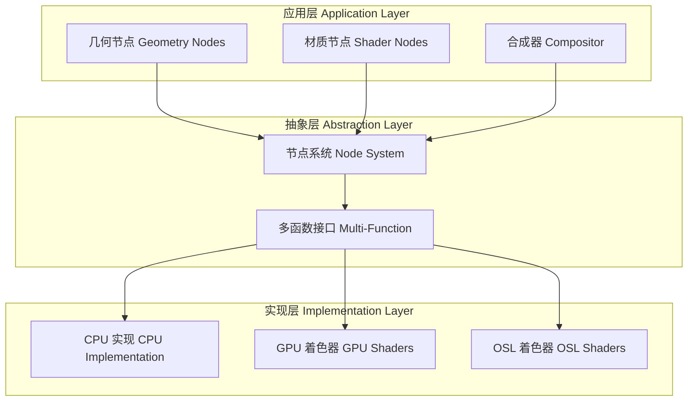
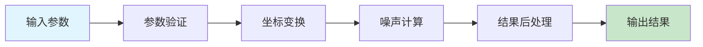

# 06. 噪声纹理节点详解

## 目录

- [1. 噪声纹理节点概述](#1-噪声纹理节点概述)
- [2. 节点输入输出接口详解](#2-节点输入输出接口详解)
- [3. 噪声算法数学原理](#3-噪声算法数学原理)
- [4. 多维度支持实现](#4-多维度支持实现)
- [5. 跨平台架构设计](#5-跨平台架构设计)
- [6. 源码详细分析](#6-源码详细分析)
- [7. 性能优化策略](#7-性能优化策略)
- [8. 实际应用示例](#8-实际应用示例)

## 1. 噪声纹理节点概述

<span style="background: #e1f5fe; color: #01579b; padding: 2px 6px; border-radius: 3px;">**噪声纹理节点**</span> 是 Blender 中最核心和最常用的程序化纹理生成器之一。它基于 **Perlin 噪声算法**，能够生成自然的、连续的随机纹理模式。

### 1.1 核心特性

- 🌊 **多种噪声类型**: 支持 FBM、Multi-fractal、Hybrid Multi-fractal、Ridged Multi-fractal、Hetero Terrain 等五种基本噪声类型
- 📐 **多维度支持**: 支持 1D、2D、3D、4D 四种维度模式
- 🎨 **双重输出**: 同时提供灰度因子 (Factor) 和彩色 (Color) 两种输出
- ⚡ **实时计算**: 基于数学公式实时生成，无需贴图文件

### 1.2 应用场景

噪声纹理节点在以下场景中广泛应用：



## 2. 节点输入输出接口详解

### 2.1 输入接口参数

| 参数名 | 类型 | 默认值 | 范围 | 说明 |
|--------|------|--------|------|------|
| **Vector** | Vector | (0,0,0) | (-∞, +∞) | <span style="background: #f3e5f5; color: #6a1b9a;">3D/4D 空间坐标</span> |
| **W** | Float | 0.0 | (-1000, 1000) | <span style="background: #e8f5e8; color: #2e7d32;">1D/4D 额外维度</span> |
| **Scale** | Float | 5.0 | (-1000, 1000) | <span style="background: #fff3e0; color: #e65100;">噪声缩放比例</span> |
| **Detail** | Float | 2.0 | (0, 15) | <span style="background: #fce4ec; color: #c2185b;">噪声细节层数</span> |
| **Roughness** | Float | 0.5 | (0, 1) | <span style="background: #e0f2f1; color: #00695c;">粗糙度因子</span> |
| **Lacunarity** | Float | 2.0 | (0, 1000) | <span style="background: #f1f8e9; color: #33691e;">频率倍增因子</span> |
| **Offset** | Float | 0.0 | (-1000, 1000) | <span style="background: #e8eaf6; color: #283593;">偏移量</span> |
| **Gain** | Float | 1.0 | (0, 1000) | <span style="background: #fff8e1; color: #f57f17;">增益系数</span> |
| **Distortion** | Float | 0.0 | (-1000, 1000) | <span style="background: #ffebee; color: #b71c1c;">扭曲程度</span> |

### 2.2 输出接口详解

#### 2.2.1 Factor (灰度因子)

输出范围通常在 $[0, 1]$ 之间，计算公式为：

$$
\text{Factor} = \text{Normalize}(\text{Noise}(x, y, z, w)_{\text{fractal}})
$$

其中 `Normalize` 函数根据 `normalize` 参数决定是否对结果进行归一化处理。

#### 2.2.2 Color (彩色输出)

彩色输出通过在三个略微偏移的坐标点上计算噪声值来实现：

```glsl
// 来自 gpu_shader_material_tex_noise.glsl:23-38
color = float4(value,
               NOISE_TYPE(p + random_float_offset(1.0f), ...),
               NOISE_TYPE(p + random_float_offset(2.0f), ...),
               1.0f);
```

这里的关键是 **随机偏移技术**，通过给不同颜色通道添加不同的坐标偏移，产生自然的颜色变化。

### 2.3 参数动态可用性

根据不同的噪声类型和维度设置，某些输入参数会自动启用或禁用：

```cpp
// 来自 node_shader_tex_noise.cc:146-165
static void node_shader_update_tex_noise(bNodeTree *ntree, bNode *node)
{
  const NodeTexNoise &storage = node_storage(*node);
  bke::node_set_socket_availability(*ntree, *sockVector, storage.dimensions != 1);
  bke::node_set_socket_availability(*ntree, *sockW, storage.dimensions == 1 || storage.dimensions == 4);
  bke::node_set_socket_availability(*ntree, *inOffsetSock, 
    storage.type != SHD_NOISE_MULTIFRACTAL && storage.type != SHD_NOISE_FBM);
  bke::node_set_socket_availability(*ntree, *inGainSock,
    storage.type == SHD_NOISE_HYBRID_MULTIFRACTAL || storage.type == SHD_NOISE_RIDGED_MULTIFRACTAL);
}
```

## 3. 噪声算法数学原理

### 3.1 Perlin 噪声基础

Perlin 噪声是 Ken Perlin 在 1983 年提出的梯度噪声算法，其核心思想是：

1. **网格划分**: 将空间划分为整数网格
2. **梯度分配**: 为每个网格顶点分配随机梯度向量
3. **插值计算**: 在网格内部进行平滑插值

数学表达式为：

$$
N(x, y, z) = \sum_{i,j,k} G_{i,j,k} \cdot (P - G_{i,j,k}) \cdot w(|P - G_{i,j,k}|)
$$

其中：
- $G_{i,j,k}$ 是网格点的梯度向量
- $P$ 是当前坐标点
- $w(r)$ 是权重函数（通常为 $6r^5 - 15r^4 + 10r^3$）

### 3.2 分形布朗运动 (FBM)

FBM 是多个不同频率和振幅的噪声层的叠加：

$$
\text{FBM}(P) = \sum_{i=0}^{\text{detail}} \text{amp}_i \cdot \text{noise}(\text{freq}_i \cdot P)
$$

其中：
- $\text{amp}_i = \text{roughness}^i$ 是第 $i$ 层的振幅
- $\text{freq}_i = \text{lacunarity}^i$ 是第 $i$ 层的频率



### 3.3 其他噪声类型

#### 3.3.1 Multi-fractal

$$
\text{Multi-fractal}(P) = \prod_{i=0}^{\text{detail}} (1 + \text{amp}_i \cdot \text{noise}(\text{freq}_i \cdot P))
$$

#### 3.3.2 Ridged Multi-fractal

$$
\text{Ridged}(P) = \sum_{i=0}^{\text{detail}} \text{amp}_i \cdot (1 - |\text{noise}(\text{freq}_i \cdot P)|)
$$

#### 3.3.3 Hybrid Multi-fractal

结合了 FBM 和 Multi-fractal 的特点：

$$
\text{Hybrid}(P) = \text{FBM}(P) \cdot \text{Multi-fractal}(P)^{\text{gain}}
$$

## 4. 多维度支持实现

### 4.1 维度类型枚举

```cpp
// 来自 DNA_node_types.h (推测)
enum {
  SHD_NOISE_1D = 1,
  SHD_NOISE_2D = 2, 
  SHD_NOISE_3D = 3,
  SHD_NOISE_4D = 4
};
```

### 4.2 坐标处理逻辑

不同维度下的坐标处理方式：

```cpp
// 来自 node_shader_tex_noise.cc:272-416
switch (dimensions_) {
  case 1: {
    const VArray<float> &w = params.readonly_single_input<float>(0, "W");
    const float position = w[i] * scale[i];
    // ...
    break;
  }
  case 2: {
    const VArray<float3> &vector = params.readonly_single_input<float3>(0, "Vector");
    const float2 position = float2(vector[i] * scale[i]);
    // ...
    break;
  }
  case 3: {
    const VArray<float3> &vector = params.readonly_single_input<float3>(0, "Vector");
    const float3 position = vector[i] * scale[i];
    // ...
    break;
  }
  case 4: {
    const VArray<float3> &vector = params.readonly_single_input<float3>(0, "Vector");
    const VArray<float> &w = params.readonly_single_input<float>(1, "W");
    const float4 position{position_vector[0], position_vector[1], position_vector[2], position_w};
    // ...
    break;
  }
}
```

### 4.3 维度转换示意图



## 5. 跨平台架构设计

### 5.1 三层架构

Blender 的噪声纹理节点采用三层架构设计，确保在不同渲染后端下的一致性：



### 5.2 统一接口设计

#### 5.2.1 CPU 实现 (多函数)

```cpp
// 来自 node_shader_tex_noise.cc:167-426
class NoiseFunction : public mf::MultiFunction {
 public:
  void call(const IndexMask &mask, mf::Params params, mf::Context /*context*/) const override
  {
    // 统一的 CPU 计算逻辑
    switch (dimensions_) {
      case 1: /* 1D 计算 */ break;
      case 2: /* 2D 计算 */ break;
      case 3: /* 3D 计算 */ break;
      case 4: /* 4D 计算 */ break;
    }
  }
};
```

#### 5.2.2 GPU 着色器实现

```glsl
// 来自 gpu_shader_material_tex_noise.glsl:143-162
void node_noise_tex_fbm_1d(float3 co, float w, float scale, /* ... */)
{
  detail = clamp(detail, 0.0f, 15.0f);
  roughness = max(roughness, 0.0f);
  float p = w * scale;
  NOISE_FRACTAL_DISTORTED_1D(noise_fbm)
}
```

#### 5.2.3 OSL 着色器实现

```cpp
// 来自 node_noise_texture.osl:238-300
shader node_noise_texture(int use_mapping = 0, /* ... */)
{
  if (dimensions == "1D") {
    Fac = noise_texture(w, /* ... */);
  }
  else if (dimensions == "2D") {
    Fac = noise_texture(vector2(p[0], p[1]), /* ... */);
  }
  // ...
}
```

### 5.3 后端选择机制

系统根据渲染上下文自动选择合适的实现：

1. **几何节点**: 使用 CPU 多函数实现
2. **EEVEE 实时渲染**: 使用 GPU 着色器
3. **Cycles 渲染**: 使用 OSL 着色器
4. **合成器**: 使用 CPU 实现

## 6. 源码详细分析

### 6.1 核心文件分析

#### 6.1.1 node_shader_tex_noise.cc

这是主要的节点定义文件，包含：

<span style="background: #fff3e0; color: #ef6c00;">**节点注册**</span> (第458-481行):
```cpp
void register_node_type_sh_tex_noise()
{
  static blender::bke::bNodeType ntype;
  common_node_type_base(&ntype, "ShaderNodeTexNoise", SH_NODE_TEX_NOISE);
  ntype.ui_name = "Noise Texture";
  ntype.ui_description = "Generate fractal Perlin noise";
  // ...
  ntype.gpu_fn = file_ns::node_shader_gpu_tex_noise;
  ntype.build_multi_function = file_ns::sh_node_noise_build_multi_function;
  // ...
}
```

<span style="background: #e8f5e8; color: #2e7d32;">**接口声明**</span> (第23-72行):
```cpp
static void sh_node_tex_noise_declare(NodeDeclarationBuilder &b)
{
  b.is_function_node();
  b.add_input<decl::Vector>("Vector").implicit_field(NODE_DEFAULT_INPUT_POSITION_FIELD);
  b.add_input<decl::Float>("W").min(-1000.0f).max(1000.0f);
  // ...
  b.add_output<decl::Float>("Factor", "Fac").no_muted_links();
  b.add_output<decl::Color>("Color").no_muted_links();
}
```

<span style="background: #e3f2fd; color: #1565c0;">**GPU 函数名映射**</span> (第95-128行):
```cpp
static const char *gpu_shader_get_name(const int dimensions, const int type)
{
  switch (type) {
    case SHD_NOISE_FBM:
      return std::array{"node_noise_tex_fbm_1d",
                        "node_noise_tex_fbm_2d", 
                        "node_noise_tex_fbm_3d",
                        "node_noise_tex_fbm_4d"}[dimensions - 1];
    // ...
  }
}
```

#### 6.1.2 gpu_shader_material_tex_noise.glsl

这是 GPU 着色器实现文件：

<span style="background: #fce4ec; color: #c2185b;">**宏定义模板**</span> (第17-113行):
```glsl
#define NOISE_FRACTAL_DISTORTED_1D(NOISE_TYPE) \
  if (distortion != 0.0f) { \
    p += snoise(p + random_float_offset(0.0f)) * distortion; \
  } \
  value = NOISE_TYPE(p, detail, roughness, lacunarity, offset, gain, normalize != 0.0f); \
  color = float4(value, /* R通道 */, /* G通道 */, /* B通道 */, 1.0f);
```

<span style="background: #f1f8e9; color: #33691e;">**随机偏移生成**</span> (第115-139行):
```glsl
float random_float_offset(float seed)
{
  return 100.0f + hash_float_to_float(seed) * 100.0f;
}
```

这个函数生成 [100, 200] 范围内的随机偏移，用于颜色通道的差异化。

#### 6.1.3 node_noise_texture.osl

这是 OSL (Open Shading Language) 实现：

<span style="background: #fff8e1; color: #f57f17;">**噪声类型选择宏**</span> (第12-41行):
```cpp
#define NOISE_SELECT(T) \
  float noise_select(T p, /* ... */) \
  { \
    if (type == "multifractal") { \
      return noise_multi_fractal(p, /* ... */); \
    } \
    else if (type == "fBM") { \
      return noise_fbm(p, /* ... */); \
    } \
    // ...
  }
```

### 6.2 关键算法实现

#### 6.2.1 扭曲效果实现

扭曲通过在原始坐标上添加噪声偏移来实现：

```glsl
// 扭曲计算公式
p_distorted = p_original + snoise(p_original + offset) * distortion
```

这个过程可以理解为：<span style="background: #e0f2f1; color: #00695c;">**用噪声来扰动噪声**</span>，产生更复杂的纹理效果。

#### 6.2.2 颜色生成策略

颜色输出的核心思想是 <span style="background: #ffebee; color: #b71c1c;">**坐标偏移技术**</span>：

- R 通道：使用原始坐标 `p`
- G 通道：使用偏移坐标 `p + offset(1.0)`
- B 通道：使用偏移坐标 `p + offset(2.0)`

这种设计确保了：
1. 颜色通道之间的相关性
2. 自然的色彩过渡
3. 计算效率（避免完全独立的噪声计算）

### 6.3 性能优化技术

#### 6.3.1 条件计算优化

```cpp
// 来自 node_shader_tex_noise.cc:269-270
const bool compute_factor = !r_factor.is_empty();
const bool compute_color = !r_color.is_empty();
```

只有在输出端口被连接时才进行相应计算，避免不必要的计算开销。

#### 6.3.2 参数预计算

```cpp
// 参数范围限制
detail = clamp(detail, 0.0f, 15.0f);
roughness = max(roughness, 0.0f);
```

在计算开始前对参数进行预处理，确保算法稳定性。

## 7. 性能优化策略

### 7.1 计算复杂度分析

| 操作 | 时间复杂度 | 说明 |
|------|------------|------|
| **基础噪声计算** | $O(1)$ | 单点 Perlin 噪声 |
| **FBM 计算** | $O(\text{detail})$ | 线性于细节层数 |
| **扭曲效果** | $O(1)$ | 额外一次噪声计算 |
| **颜色输出** | $O(\text{detail})$ | 三次独立的 FBM 计算 |

### 7.2 内存访问模式



### 7.3 并行化策略

噪声纹理节点的计算具有天然的并行性：

1. **像素级并行**: 每个像素的计算独立
2. **向量化**: 利用 SIMD 指令加速
3. **GPU 并行**: 将计算负载分散到 GPU 核心数

## 8. 实际应用示例

### 8.1 木材纹理制作

```cpp
// 参数设置示例
Scale = 10.0        // 木纹密度
Detail = 4.0        // 木纹细节
Roughness = 0.8     // 木纹粗糙度
Lacunarity = 2.5    // 木纹层次
Distortion = 0.1   // 轻微扭曲
```

### 8.2 云彩效果生成

```cpp
// 云彩参数
Scale = 1.0         // 大尺度云朵
Detail = 6.0        // 云朵细节
Roughness = 0.6     // 云朵边缘柔和度
Normalize = true    // 确保值域在 [0,1]
```

### 8.3 地形高度图

```cpp
// 地形生成参数
Scale = 5.0         // 地形尺度
Detail = 8.0        // 地形细节
Type = Ridged_Multifractal  // 山脉效果
Gain = 1.5          // 山峰尖锐度
```

### 8.4 性能调优建议

1. **细节控制**: 根据用途调整 Detail 参数
   - 实时预览：Detail ≤ 2
   - 最终渲染：Detail ≤ 8
   - 特殊效果：Detail ≤ 15

2. **维度选择**: 使用最低的必要维度
   - 1D：简单动画、线条效果
   - 2D：表面纹理、图案
   - 3D：体积效果、立体纹理
   - 4D：动画纹理、时间变化

3. **输出优化**: 按需连接输出端口
   - 只需要灰度时，断开 Color 输出
   - 只需要颜色时，断开 Factor 输出

---

## 总结

噪声纹理节点是 Blender 程序化纹理系统的核心组件，通过精巧的数学算法和工程实现，为用户提供了强大而灵活的纹理生成能力。其跨平台架构设计确保了在不同渲染引擎下的一致性表现，而优化的计算策略则保证了实时交互的流畅体验。

理解噪声纹理节点的内部实现不仅有助于更好地使用该节点，更能启发我们设计其他程序化纹理节点的思路和架构。