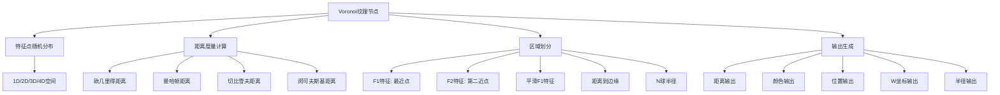
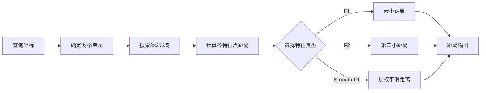
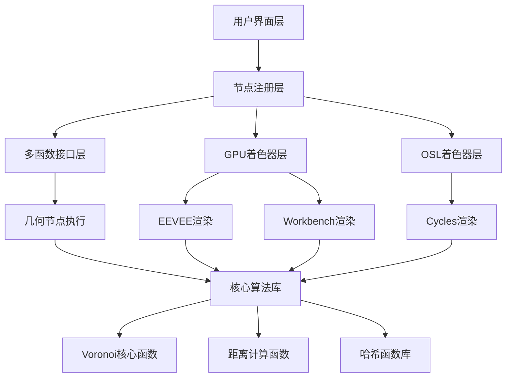
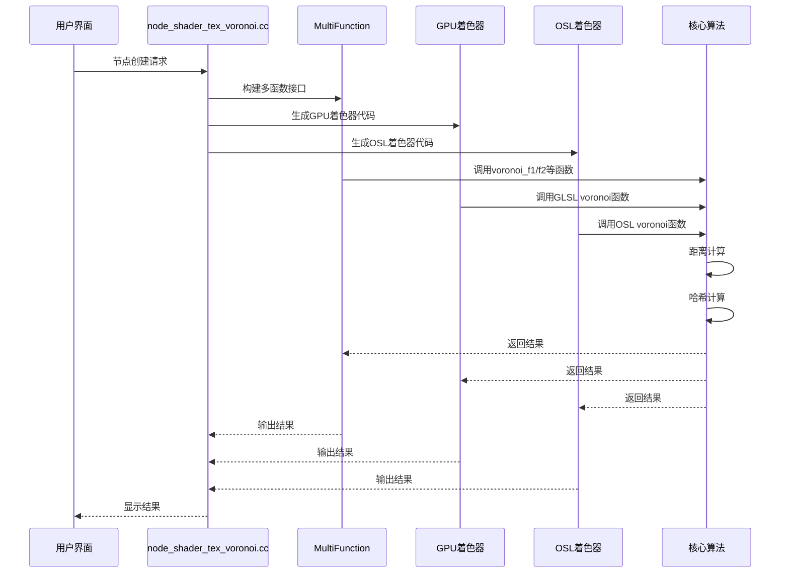

# 07. Voronoi纹理节点详解

## 目录

- [1. Voronoi纹理节点概述](#1-voronoi纹理节点概述)
- [2. Voronoi图算法基础](#2-voronoi图算法基础)
- [3. 节点接口详解](#3-节点接口详解)
- [4. 输出接口计算原理](#4-输出接口计算原理)
- [5. 多平台支持的实现架构](#5-多平台支持的实现架构)
- [6. 文件间调用关系分析](#6-文件间调用关系分析)
- [7. 源码文件详细分析](#7-源码文件详细分析)
- [8. 算法性能优化](#8-算法性能优化)
- [9. 实际应用示例](#9-实际应用示例)

---

## 1. Voronoi纹理节点概述

Voronoi纹理节点是Blender中一个<span style="color:#ff6b6b; background-color:#ffe0e0;">极其强大</span>的程序化纹理生成工具，它基于<span style="color:#4ecdc4; background-color:#e0f7f6;">**Voronoi图**</span>算法（也称为<span style="color:#95e1d3; background-color:#e8f8f5;">**Worley噪声**</span>）。该算法通过在空间中随机分布特征点，将空间划分为若干区域，每个区域包含距离该特征点最近的所有位置。

### 1.1 核心概念



### 1.2 数学原理

Voronoi图的数学定义为：

给定一组特征点 $P = \{p_1, p_2, ..., p_n\}$ 在空间 $S$ 中，Voronoi单元 $V_i$ 定义为：

$$
V_i = \{x \in S \mid d(x, p_i) \leq d(x, p_j), \forall j \neq i\}
$$

其中 $d(x, y)$ 表示两点之间的距离函数。

---

## 2. Voronoi图算法基础

### 2.1 算法实现步骤

1. **网格划分**: 将连续空间划分为规则的网格单元
2. **特征点生成**: 在每个网格单元内生成随机特征点
3. **邻域搜索**: 对于查询点，搜索周围网格的特征点
4. **距离计算**: 计算查询点到各特征点的距离
5. **结果确定**: 根据距离确定输出值

### 2.2 距离度量类型

| 距离类型 | 数学公式 | 特点 |
|---------|----------|------|
| **欧几里得** | $d = \sqrt{\sum_{i=1}^{n}(x_i-y_i)^2}$ | 标准欧式距离，产生圆形区域 |
| **曼哈顿** | $d = \sum_{i=1}^{n}|x_i-y_i|$ | 产生菱形区域，计算快速 |
| **切比雪夫** | $d = \max_{i}|x_i-y_i|$ | 产生方形区域 |
| **闵可夫斯基** | $d = (\sum_{i=1}^{n}|x_i-y_i|^p)^{1/p}$ | 可通过指数p调节形状 |

---

## 3. 节点接口详解

### 3.1 输入接口

| 输入接口 | 类型 | 默认值 | 作用 |
|----------|------|--------|------|
| **Vector** | Vector | Generated | 3D坐标输入 |
| **W** | Float | 0.0 | 第四维度坐标（用于4D） |
| **Scale** | Float | 5.0 | 缩放系数，控制纹理密度 |
| **Detail** | Float | 0.0 | 分形细节层级 |
| **Roughness** | Float | 0.5 | 分形粗糙度 |
| **Lacunarity** | Float | 2.0 | 分形间隙度 |
| **Smoothness** | Float | 1.0 | 平滑度（仅用于平滑F1） |
| **Exponent** | Float | 0.5 | 闵可夫斯基距离指数 |
| **Randomness** | Float | 1.0 | 随机性控制 |

### 3.2 输出接口

| 输出接口 | 类型 | 计算来源 |
|----------|------|----------|
| **Distance** | Float | 到最近/第二近特征点的距离 |
| **Color** | Color | 基于特征点位置的随机颜色 |
| **Position** | Vector | 最近特征点的世界坐标 |
| **W** | Float | 第四维度位置坐标 |
| **Radius** | Float | N球半径（仅N球半径特征） |

---

## 4. 输出接口计算原理

### 4.1 Distance（距离）输出

距离输出是Voronoi节点的核心输出，其计算过程如下：



**具体实现**（`source/blender/gpu/shaders/material/gpu_shader_material_voronoi.glsl:488-517`）：
```glsl
for (int k = -1; k <= 1; k++) {
  for (int j = -1; j <= 1; j++) {
    for (int i = -1; i <= 1; i++) {
      int3 cellOffset = int3(i, j, k);
      float3 pointPosition = float3(cellOffset) +
                             hash_int3_to_vec3(cellPosition + cellOffset) * params.randomness;
      float distanceToPoint = voronoi_distance(pointPosition, localPosition, params);
      if (distanceToPoint < minDistance) {
        targetOffset = cellOffset;
        minDistance = distanceToPoint;
        targetPosition = pointPosition;
      }
    }
  }
}
```

### 4.2 Color（颜色）输出

颜色输出通过<span style="color:#ff9ff3; background-color:#ffe6f9;">**哈希函数**</span>将特征点的网格坐标转换为颜色值：

```glsl
octave.Color = hash_int3_to_vec3(cellPosition + targetOffset);
```

这个哈希函数确保同一特征点总是产生相同的颜色，而不同特征点产生不同的颜色。

### 4.3 Position（位置）输出

位置输出返回最近特征点的实际世界坐标：

$$
\text{Position} = \text{CellPosition} + \text{TargetPosition} + \text{CellOffset}
$$

**计算过程**：
1. 确定查询点所在的网格单元
2. 找到最近的特征点
3. 计算特征点的绝对坐标
4. 返回该坐标作为位置输出

### 4.4 W输出和Radius输出

- **W输出**：仅在1D和4D模式下可用，返回第四维度坐标
- **Radius输出**：仅在使用"N球半径"特征时可用，计算公式为：

$$
\text{Radius} = \frac{\text{distance}(\text{closestPoint}, \text{closestNeighbor})}{2}
$$

---

## 5. 多平台支持的实现架构

### 5.1 架构概览

Blender的Voronoi纹理节点采用<span style="color:#54a0ff; background-color:#e8f4ff;">**分层架构**</span>设计，确保在不同渲染后端（EEVEE、Cycles、几何节点）中的一致性：



### 5.2 统一接口设计

每个平台都有对应的实现，但共享相同的参数结构：

```cpp
// 统一的参数结构
struct VoronoiParams {
  float scale;        // 缩放
  float detail;       // 细节层级
  float roughness;    // 粗糙度
  float lacunarity;   // 间隙度
  float smoothness;   // 平滑度
  float exponent;     // 指数
  float randomness;   // 随机性
  float max_distance; // 最大距离
  bool normalize;     // 是否归一化
  int feature;        // 特征类型
  int metric;         // 距离度量
};
```

---

## 6. 文件间调用关系分析

### 6.1 调用关系图



### 6.2 具体文件调用关系

1. **`node_shader_tex_voronoi.cc:816-840`** - 节点注册和初始化
2. **`gpu_shader_material_tex_voronoi.glsl`** - GPU着色器入口点
3. **`gpu_shader_material_voronoi.glsl`** - 核心Voronoi算法（GLSL）
4. **`gpu_shader_material_fractal_voronoi.glsl`** - 分形处理（GLSL）
5. **`node_voronoi_texture.osl`** - OSL着色器实现
6. **`node_voronoi.h`** - 核心算法（OSL）

---

## 7. 源码文件详细分析

### 7.1 `source/blender/nodes/shader/nodes/node_shader_tex_voronoi.cc`

这是<span style="color:#ff6348; background-color:#ffe8e6;">**主要控制文件**</span>，负责节点的注册、初始化和多函数接口构建。

#### 7.1.1 节点注册（816-840行）

```cpp
void register_node_type_sh_tex_voronoi()
{
  static blender::bke::bNodeType ntype;
  
  common_node_type_base(&ntype, "ShaderNodeTexVoronoi", SH_NODE_TEX_VORONOI);
  ntype.ui_name = "Voronoi Texture";
  ntype.ui_description = "Generate Worley noise based on the distance to random points...";
  ntype.declare = file_ns::sh_node_tex_voronoi_declare;
  ntype.initfunc = file_ns::node_shader_init_tex_voronoi;
  ntype.gpu_fn = file_ns::node_shader_gpu_tex_voronoi;
  ntype.build_multi_function = file_ns::sh_node_voronoi_build_multi_function;
  
  blender::bke::node_register_type(ntype);
}
```

#### 7.1.2 GPU着色器函数名生成（107-150行）

```cpp
static const char *gpu_shader_get_name(const int feature, const int dimensions)
{
  switch (feature) {
    case SHD_VORONOI_F1:
      return std::array{
          "node_tex_voronoi_f1_1d",
          "node_tex_voronoi_f1_2d", 
          "node_tex_voronoi_f1_3d",
          "node_tex_voronoi_f1_4d",
      }[dimensions - 1];
    // ... 其他case
  }
}
```

这个函数根据特征类型和维度动态生成对应的GLSL函数名，确保调用正确的实现。

#### 7.1.3 多函数构建（793-812行）

```cpp
static void sh_node_voronoi_build_multi_function(NodeMultiFunctionBuilder &builder)
{
  const NodeTexVoronoi &storage = node_storage(builder.node());
  switch (storage.feature) {
    case SHD_VORONOI_DISTANCE_TO_EDGE: {
      builder.construct_and_set_matching_fn<VoronoiDistToEdgeFunction>(
          storage.dimensions, storage.normalize);
      break;
    }
    case SHD_VORONOI_N_SPHERE_RADIUS: {
      builder.construct_and_set_matching_fn<VoronoiNSphereFunction>(storage.dimensions);
      break;
    }
    default: {
      builder.construct_and_set_matching_fn<VoronoiMetricFunction>(
          storage.dimensions, storage.feature, storage.distance, storage.normalize);
      break;
    }
  }
}
```

### 7.2 `source/blender/gpu/shaders/material/gpu_shader_material_tex_voronoi.glsl`

这是<span style="color:#48dbfb; background-color:#e8f6ff;">**GPU着色器入口文件**</span>，为不同的维度和特征类型提供统一的接口。

#### 7.2.1 参数初始化宏（25-36行）

```glsl
#define INITIALIZE_VORONOIPARAMS(FEATURE) \
  params.feature = FEATURE; \
  params.metric = int(metric); \
  params.scale = scale; \
  params.detail = clamp(detail, 0.0f, 15.0f); \
  params.roughness = clamp(roughness, 0.0f, 1.0f); \
  params.lacunarity = lacunarity; \
  params.smoothness = clamp(smoothness / 2.0f, 0.0f, 0.5f); \
  params.exponent = exponent; \
  params.randomness = clamp(randomness, 0.0f, 1.0f); \
  params.max_distance = 0.0f; \
  params.normalize = bool(normalize);
```

这个宏确保所有参数都被正确初始化并进行范围限制。

#### 7.2.2 F1 3D实现（334-363行）

```glsl
void node_tex_voronoi_f1_3d(float3 coord,
                            float w,
                            float scale,
                            // ... 其他参数
                            out float outDistance,
                            out float4 outColor,
                            out float3 outPosition,
                            out float outW,
                            out float outRadius)
{
  VoronoiParams params;
  INITIALIZE_VORONOIPARAMS(SHD_VORONOI_F1)
  
  coord *= scale;
  
  params.max_distance = voronoi_distance(
      float3(0.0f), float3(0.5f + 0.5f * params.randomness), params);
  VoronoiOutput Output = fractal_voronoi_x_fx(params, coord);
  outDistance = Output.Distance;
  outColor = float4(Output.Color, 1.0f);
  outPosition = Output.Position.xyz;
}
```

### 7.3 `source/blender/gpu/shaders/material/gpu_shader_material_voronoi.glsl`

这是<span style="color:#00d2d3; background-color:#e0fffe;">**核心算法实现**</span>，包含所有Voronoi计算的核心逻辑。

#### 7.3.1 距离函数实现（56-121行）

```glsl
float voronoi_distance(float2 a, float2 b, VoronoiParams params)
{
  if (params.metric == SHD_VORONOI_EUCLIDEAN) {
    return distance(a, b);
  }
  else if (params.metric == SHD_VORONOI_MANHATTAN) {
    return abs(a.x - b.x) + abs(a.y - b.y);
  }
  else if (params.metric == SHD_VORONOI_CHEBYCHEV) {
    return max(abs(a.x - b.x), abs(a.y - b.y));
  }
  else if (params.metric == SHD_VORONOI_MINKOWSKI) {
    return pow(pow(abs(a.x - b.x), params.exponent) + pow(abs(a.y - b.y), params.exponent),
               1.0f / params.exponent);
  }
  else {
    return 0.0f;
  }
}
```

#### 7.3.2 F1算法3D实现（488-517行）

```glsl
VoronoiOutput voronoi_f1(VoronoiParams params, float3 coord)
{
  float3 cellPosition_f = floor(coord);
  float3 localPosition = coord - cellPosition_f;
  int3 cellPosition = int3(cellPosition_f);

  float minDistance = FLT_MAX;
  int3 targetOffset = int3(0);
  float3 targetPosition = float3(0.0f);
  
  // 遍历3x3x3邻域
  for (int k = -1; k <= 1; k++) {
    for (int j = -1; j <= 1; j++) {
      for (int i = -1; i <= 1; i++) {
        int3 cellOffset = int3(i, j, k);
        float3 pointPosition = float3(cellOffset) +
                               hash_int3_to_vec3(cellPosition + cellOffset) * params.randomness;
        float distanceToPoint = voronoi_distance(pointPosition, localPosition, params);
        if (distanceToPoint < minDistance) {
          targetOffset = cellOffset;
          minDistance = distanceToPoint;
          targetPosition = pointPosition;
        }
      }
    }
  }

  VoronoiOutput octave;
  octave.Distance = minDistance;
  octave.Color = hash_int3_to_vec3(cellPosition + targetOffset);
  octave.Position = voronoi_position(targetPosition + cellPosition_f);
  return octave;
}
```

### 7.4 `source/blender/gpu/shaders/material/gpu_shader_material_fractal_voronoi.glsl`

这个文件处理<span style="color:#ff9ff3; background-color:#ffe6f9;">**分形细节**</span>，通过多层叠加增加纹理复杂度。

#### 7.4.1 分形算法核心逻辑（191-248行）

```glsl
VoronoiOutput fractal_voronoi_x_fx(VoronoiParams params, float3 coord)
{
  float amplitude = 1.0f;
  float max_amplitude = 0.0f;
  float scale = 1.0f;

  VoronoiOutput Output;
  Output.Distance = 0.0f;
  Output.Color = float3(0.0f, 0.0f, 0.0f);
  Output.Position = float4(0.0f, 0.0f, 0.0f, 0.0f);
  bool zero_input = params.detail == 0.0f || params.roughness == 0.0f;

  for (int i = 0; i <= ceil(params.detail); ++i) {
    VoronoiOutput octave;
    if (params.feature == SHD_VORONOI_F2) {
      octave = voronoi_f2(params, coord * scale);
    }
    else if (params.feature == SHD_VORONOI_SMOOTH_F1 && params.smoothness != 0.0f) {
      octave = voronoi_smooth_f1(params, coord * scale);
    }
    else {
      octave = voronoi_f1(params, coord * scale);
    }

    if (zero_input) {
      max_amplitude = 1.0f;
      Output = octave;
      break;
    }
    else if (i <= params.detail) {
      max_amplitude += amplitude;
      Output.Distance += octave.Distance * amplitude;
      Output.Color += octave.Color * amplitude;
      Output.Position = mix(Output.Position, octave.Position / scale, amplitude);
      scale *= params.lacunarity;
      amplitude *= params.roughness;
    }
  }

  if (params.normalize) {
    Output.Distance /= max_amplitude * params.max_distance;
    Output.Color /= max_amplitude;
  }

  Output.Position = safe_divide(Output.Position, params.scale);
  return Output;
}
```

### 7.5 `intern/cycles/kernel/osl/shaders/node_voronoi_texture.osl`

这是<span style="color:#ffd93d; background-color:#fff9e6;">**OSL着色器实现**</span>，用于Cycles渲染器。

#### 7.5.1 主着色器函数（12-142行）

```osl
shader node_voronoi_texture(
    int use_mapping = 0,
    matrix mapping = matrix(0, 0, 0, 0, 0, 0, 0, 0, 0, 0, 0, 0, 0, 0, 0, 0),
    string dimensions = "3D",
    string feature = "f1",
    string metric = "euclidean",
    int use_normalize = 0,
    vector3 Vector = P,
    float WIn = 0.0,
    float Scale = 5.0,
    // ... 其他参数
    output float Distance = 0.0,
    output color Color = 0.0,
    output vector3 Position = P,
    output float WOut = 0.0,
    output float Radius = 0.0)
{
  VoronoiParams params;
  
  // 参数初始化
  params.feature = feature;
  params.metric = metric;
  params.scale = Scale;
  params.detail = clamp(Detail, 0.0, 15.0);
  params.roughness = clamp(Roughness, 0.0, 1.0);
  // ...
  
  vector3 coord = Vector;
  if (use_mapping) {
    coord = transform(mapping, coord);
  }
  
  // 根据特征类型调用相应函数
  if (feature == "distance_to_edge") {
    // 处理距离到边缘
  }
  else if (feature == "n_sphere_radius") {
    // 处理N球半径
  }
  else {
    // 处理F1、F2、Smooth F1
    VoronoiOutput Output;
    if (dimensions == "3D") {
      Output = fractal_voronoi_x_fx(params, coord);
      Distance = Output.Distance;
      Color = Output.Color;
      Position = vector3(Output.Position.x, Output.Position.y, Output.Position.z);
    }
  }
}
```

---

## 8. 算法性能优化

### 8.1 邻域搜索优化

传统的Voronoi算法需要搜索所有特征点，时间复杂度为$O(n)$。Blender采用<span style="color:#ff6b9d; background-color:#ffe6f2;">**网格优化**</span>，将时间复杂度降低到$O(1)$：

1. **空间划分**: 将空间划分为规则网格
2. **邻域限制**: 只搜索3×3×3邻域内的27个网格单元
3. **早期退出**: 找到最近点后可以提前终止搜索

### 8.2 距离计算优化

```glsl
// 优化的距离比较，避免开方运算
float distanceToPoint = dot(vectorToPoint, vectorToPoint);
if (distanceToPoint < minDistance) {
  // 只在需要时才计算实际距离
  minDistance = distanceToPoint;
}
```

### 8.3 分形优化

分形算法使用<span style="color:#66d9ef; background-color:#e6f7ff;">**递进式叠加**</span>而非递归，减少函数调用开销：

```glsl
for (int i = 0; i <= ceil(params.detail); ++i) {
  // 计算当前octave
  scale *= params.lacunarity;    // 准备下一层
  amplitude *= params.roughness; // 准备下一层
}
```

---

## 9. 实际应用示例

### 9.1 基础石材纹理

```glsl
// 使用F1特征 + 欧几里得距离
Distance -> Color Ramp -> Base Color
Position -> Vector Math (Scale) -> Normal Map
```

### 9.2 细胞纹理

```glsl
// 使用Distance to Edge特征
Distance -> Color Ramp -> Base Color
Randomness = 0.5 (增加变化)
Scale = 10.0 (细胞大小)
```

### 9.3 木材纹理

```glsl
// 使用F2特征 + 分形叠加
Distance -> Color Ramp -> Base Color
Detail = 4.0 (木纹细节)
Roughness = 0.8 (纹理复杂度)
```

### 9.4 地形生成

```glsl
// 使用4D Voronoi + 时间动画
Vector = Object Position
W = Time (动画第四维)
Feature = Smooth F1
Scale = 2.0
Randomness = 1.0
```

---

## 10. 技术总结

Voronoi纹理节点的实现展现了Blender在程序化纹理生成方面的<span style="color:#6c5ce7; background-color:#f0e6ff;">**工程 excellence**</span>：

### 10.1 核心优势

1. **统一架构**: 通过分层设计实现多平台一致性
2. **高性能**: 网格优化和早期退出策略
3. **灵活性强**: 支持多种距离度量和特征类型
4. **可扩展性**: 模块化设计便于添加新功能

### 10.2 技术亮点

- <span style="color:#00b894; background-color:#e6fffa;">**哈希函数**</span>保证随机性的可重现性
- <span style="color:#e17055; background-color:#fff0ed;">**分形算法**</span>实现复杂纹理的自动生成
- <span style="color:#0984e3; background-color:#e6f3ff;">**多维度支持**</span>从1D到4D的完整实现
- <span style="color:#a29bfe; background-color:#f0ebff;">**GPU优化**</span>并行计算充分利用硬件性能

### 10.3 学习价值

通过分析Voronoi纹理节点的实现，我们可以学到：

1. **算法设计**: 如何将数学理论转化为工程实现
2. **性能优化**: 网格划分、早期退出等优化技术
3. **跨平台开发**: 如何统一不同后端的接口设计
4. **代码组织**: 模块化和可维护性的平衡

这个节点是程序化纹理生成的典范，为理解Blender的渲染架构提供了宝贵的窗口。