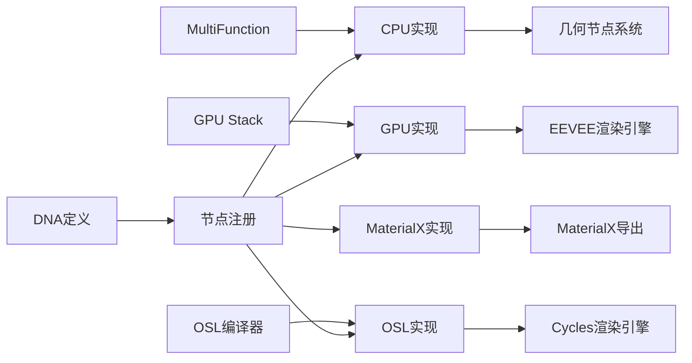

# 08-波形纹理节点详解

## 目录

- [8.1 节点概述](#81-节点概述)
- [8.2 输入接口详解](#82-输入接口详解)
- [8.3 输出接口详解](#83-输出接口详解)
- [8.4 核心算法原理](#84-核心算法原理)
- [8.5 跨平台实现机制](#85-跨平台实现机制)
- [8.6 文件间调用关系](#86-文件间调用关系)
- [8.7 代码详细分析](#87-代码详细分析)
- [8.8 数学基础知识](#88-数学基础知识)
- [8.9 高级特性与优化](#89-高级特性与优化)

---

## 8.1 节点概述

<span style="background:#E3F2FD;color:#1976D2;">波形纹理节点（Wave Texture）</span>是Blender中用于生成<span style="color:#D32F2F;font-weight:bold;">程序化带状或环形纹理</span>的重要节点。该节点通过<span style="background:#FFF3E0;color:#F57C00;">数学函数</span>生成规则波形，并可添加<span style="background:#F3E5F5;color:#7B1FA2;">噪声扭曲</span>来创建更自然的纹理效果。

### 8.1.1 节点类型定义

在`source/blender/makesdna/DNA_node_types.h`中定义了波形纹理节点的核心数据结构：

```cpp
typedef struct NodeTexWave {
  NodeTexBase base;          // 基础纹理数据
  int wave_type;             // 波形类型：带状/环形
  int bands_direction;       // 带状方向：X/Y/Z/对角线
  int rings_direction;       // 环形方向：X/Y/Z/球形
  int wave_profile;          // 波形轮廓：正弦/锯齿/三角
} NodeTexWave;
```

### 8.1.2 枚举常量

```cpp
// 波形类型
SHD_WAVE_BANDS = 0,      // 带状波形
SHD_WAVE_RINGS = 1,      // 环形波形

// 带状方向
SHD_WAVE_BANDS_DIRECTION_X = 0,        // X轴方向
SHD_WAVE_BANDS_DIRECTION_Y = 1,        // Y轴方向
SHD_WAVE_BANDS_DIRECTION_Z = 2,        // Z轴方向
SHD_WAVE_BANDS_DIRECTION_DIAGONAL = 3, // 对角线方向

// 环形方向
SHD_WAVE_RINGS_DIRECTION_X = 0,         // X轴环形
SHD_WAVE_RINGS_DIRECTION_Y = 1,         // Y轴环形
SHD_WAVE_RINGS_DIRECTION_Z = 2,         // Z轴环形
SHD_WAVE_RINGS_DIRECTION_SPHERICAL = 3, // 球形

// 波形轮廓
SHD_WAVE_PROFILE_SIN = 0,    // 正弦波
SHD_WAVE_PROFILE_SAW = 1,    // 锯齿波
SHD_WAVE_PROFILE_TRI = 2,    // 三角波
```

---

## 8.2 输入接口详解

波形纹理节点包含<span style="background:#E8F5E8;color:#2E7D32;">7个输入接口</span>，每个输入都有特定的功能和计算逻辑。

### 8.2.1 Vector（向量输入）

```cpp
b.add_input<decl::Vector>("Vector")
  .implicit_field(NODE_DEFAULT_INPUT_POSITION_FIELD);
```

- **作用**: 确定纹理采样的3D空间坐标
- **类型**: Float3 (向量)
- **默认值**: 当前采样点的空间坐标

### 8.2.2 Scale（缩放）

```cpp
b.add_input<decl::Float>("Scale")
  .min(-1000.0f).max(1000.0f)
  .default_value(5.0f)
  .description("Overall texture scale");
```

- **作用**: 控制纹理的整体缩放
- **计算**: $\text{scaled\_position} = \text{original\_position} \times \text{scale}$

### 8.2.3 Distortion（扭曲强度）

```cpp
b.add_input<decl::Float>("Distortion")
  .min(-1000.0f).max(1000.0f)
  .default_value(0.0f)
  .description("Amount of distortion of the wave");
```

- **作用**: 控制波形被噪声扭曲的程度
- **计算**: $\text{final\_value} = \text{base\_wave} + \text{distortion} \times \text{noise\_value}$

### 8.2.4 Detail（细节层级）

```cpp
b.add_input<decl::Float>("Detail")
  .min(0.0f).max(15.0f)
  .default_value(2.0f)
  .description("Amount of distortion noise detail");
```

- **作用**: 控制噪声的细节层次（FBM octaves）
- **范围**: 0-15层

### 8.2.5 Detail Scale（细节缩放）

```cpp
b.add_input<decl::Float>("Detail Scale")
  .min(-1000.0f).max(1000.0f)
  .default_value(1.0f)
  .description("Scale of distortion noise");
```

- **作用**: 控制扭曲噪声的缩放

### 8.2.6 Detail Roughness（细节粗糙度）

```cpp
b.add_input<decl::Float>("Detail Roughness")
  .min(0.0f).max(1.0f)
  .default_value(0.5f)
  .subtype(PROP_FACTOR)
  .description("Blend between a smoother noise pattern, and rougher with sharper peaks");
```

- **作用**: 控制噪声的粗糙度（Lacunarity）
- **范围**: 0.0（平滑）到 1.0（粗糙）

### 8.2.7 Phase Offset（相位偏移）

```cpp
b.add_input<decl::Float>("Phase Offset")
  .min(-1000.0f).max(1000.0f)
  .default_value(0.0f)
  .description("Position of the wave along the Bands Direction.\n"
              "This can be used as an input for more control over the distortion");
```

- **作用**: 控制波形的相位偏移，实现动画效果

---

## 8.3 输出接口详解

### 8.3.1 Color（颜色输出）

```cpp
b.add_output<decl::Color>("Color").no_muted_links();
```

- **类型**: Float4 (RGBA)
- **计算**: $\text{Color} = (\text{Factor}, \text{Factor}, \text{Factor}, 1.0)$
- **用途**: 直接作为颜色输出

### 8.3.2 Factor（因子输出）

```cpp
b.add_output<decl::Float>("Factor", "Fac").no_muted_links();
```

- **类型**: Float
- **范围**: 0.0 到 1.0
- **用途**: 作为混合因子使用

---

## 8.4 核心算法原理

### 8.4.1 算法流程图

```mermaid
graph TD
    A[输入坐标Vector] --> B[应用Scale缩放]
    B --> C[精度修正]
    C --> D{波形类型}
    
    D -->|Bands带状| E{带状方向}
    E -->|X轴| F[n = p.x × 20.0]
    E -->|Y轴| G[n = p.y × 20.0]
    E -->|Z轴| H[n = p.z × 20.0]
    E -->|对角线| I[n = (p.x+p.y+p.z) × 10.0]
    
    D -->|Rings环形| J{环形方向}
    J -->|X轴| K[rp.x=0, 计算距离]
    J -->|Y轴| L[rp.y=0, 计算距离]
    J -->|Z轴| M[rp.z=0, 计算距离]
    J -->|球形| N[直接计算距离]
    
    F --> O[添加相位偏移]
    G --> O
    H --> O
    I --> O
    K --> O
    L --> O
    M --> O
    N --> O
    
    O --> P{Distortion>0?}
    P -->|是| Q[添加噪声扭曲]
    P -->|否| R{波形轮廓}
    Q --> R
    
    R -->|正弦| S[sin函数]
    R -->|锯齿| T[fract函数]
    R -->|三角| U[abs三角函数]
    
    S --> V[输出Factor]
    T --> V
    U --> V
    V --> W[生成Color输出]
```

### 8.4.2 坐标精度修正

在所有实现中都会进行坐标精度修正：

```cpp
/* Prevent precision issues on unit coordinates. */
p = (p + 0.000001f) * 0.999999f;
```

这个修正<span style="background:#FFFDE7;color:#F9A825;">避免浮点精度问题</span>：
- 添加0.000001f避免坐标为0时的精度问题
- 乘以0.999999f避免整数边界的精度损失

### 8.4.3 带状波形计算

对于带状波形，根据方向选择坐标轴：

#### X轴方向
$$n = p.x \times 20.0$$

#### Y轴方向  
$$n = p.y \times 20.0$$

#### Z轴方向
$$n = p.z \times 20.0$$

#### 对角线方向
$$n = (p.x + p.y + p.z) \times 10.0$$

### 8.4.4 环形波形计算

对于环形波形，首先修改坐标向量，然后计算距离：

#### X轴环形
```cpp
rp = p * float3(0.0f, 1.0f, 1.0f);  // 忽略X分量
n = length(rp) * 20.0f;
```

#### Y轴环形
```cpp
rp = p * float3(1.0f, 0.0f, 1.0f);  // 忽略Y分量
n = length(rp) * 20.0f;
```

#### Z轴环形
```cpp
rp = p * float3(1.0f, 1.0f, 0.0f);  // 忽略Z分量
n = length(rp) * 20.0f;
```

#### 球形
```cpp
n = length(p) * 20.0f;  // 使用原始坐标
```

### 8.4.5 噪声扭曲计算

当Distortion > 0时，添加FBM噪声：

```cpp
if (distortion[i] != 0.0f) {
  n += distortion[i] * 
       (noise::perlin_fbm<float3>(p * dscale[i], detail[i], droughness[i], 2.0f, true) * 2.0f - 1.0f);
}
```

噪声函数返回[-1, 1]范围值，通过`* 2.0f - 1.0f`将其映射到[-1, 1]。

### 8.4.6 波形轮廓函数

#### 正弦波
$$\text{result} = 0.5 + 0.5 \times \sin(n - \frac{\pi}{2})$$

#### 锯齿波
$$n = \frac{n}{2\pi}$$
$$\text{result} = n - \text{floor}(n)$$

#### 三角波
$$n = \frac{n}{2\pi}$$
$$\text{result} = |n - \text{floor}(n + 0.5)| \times 2.0$$

---

## 8.5 跨平台实现机制

### 8.5.1 为什么需要多平台支持？

Blender需要在<span style="background:#FCE4EC;color:#C2185B;">三个主要环境</span>中运行波形纹理节点：

1. **几何节点**: 在几何体处理中计算纹理
2. **材质节点**: 在EEVEE和Cycles渲染中计算
3. **合成器节点**: 在图像处理中使用

### 8.5.2 统一的接口设计

#### CPU实现（几何节点）
`source/blender/nodes/shader/nodes/node_shader_tex_wave.cc:109-230`

```cpp
class WaveFunction : public mf::MultiFunction {
  void call(const IndexMask &mask, mf::Params params, mf::Context /*context*/) const {
    // CPU批量计算实现
  }
};
```

#### GPU实现（材质节点-EEVEE）
`source/blender/gpu/shaders/material/gpu_shader_material_tex_wave.glsl:9-74`

```glsl
float calc_wave(float3 p, ...) {
  // GLSL GPU实现
}
```

#### OSL实现（材质节点-Cycles）
`intern/cycles/kernel/osl/shaders/node_wave_texture.osl:10-73`

```cpp
float wave(point p_input, ...) {
  // Open Shading Language实现
}
```

### 8.5.3 统一性的关键保证

1. **相同的算法流程**: 所有实现都遵循完全相同的数学公式
2. **一致的参数处理**: 输入参数在所有平台上的处理方式相同
3. **统一的精度控制**: 所有实现都使用相同的精度修正
4. **相同的噪声函数**: 扭曲噪声在所有平台使用相同的FBM算法

---

## 8.6 文件间调用关系

### 8.6.1 调用关系图



### 8.6.2 注册流程

`source/blender/nodes/shader/nodes/node_shader_tex_wave.cc:332-355`

```cpp
void register_node_type_sh_tex_wave() {
  namespace file_ns = blender::nodes::node_shader_tex_wave_cc;
  static blender::bke::bNodeType ntype;
  
  common_node_type_base(&ntype, "ShaderNodeTexWave", SH_NODE_TEX_WAVE);
  ntype.ui_name = "Wave Texture";
  ntype.declare = file_ns::sh_node_tex_wave_declare;
  ntype.draw_buttons = file_ns::node_shader_buts_tex_wave;
  ntype.initfunc = file_ns::node_shader_init_tex_wave;
  ntype.gpu_fn = file_ns::node_shader_gpu_tex_wave;  // GPU实现
  ntype.build_multi_function = file_ns::sh_node_wave_tex_build_multi_function;  // CPU实现
  ntype.materialx_fn = file_ns::node_shader_materialx;  // MaterialX实现
  
  blender::bke::node_register_type(ntype);
}
```

### 8.6.3 平台选择机制

渲染时根据上下文自动选择实现：

- **几何节点**: 调用`build_multi_function`
- **EEVEE渲染**: 调用`gpu_fn` 
- **Cycles渲染**: 使用OSL文件
- **外部导出**: 使用`materialx_fn`

---

## 8.7 代码详细分析

### 8.7.1 CPU实现分析

`source/blender/nodes/shader/nodes/node_shader_tex_wave.cc:154-229`

#### 关键变量命名解释

- `p`: 修正后的3D坐标向量 (position)
- `n`: 基础波形值 (noise/wave value)
- `val`: 最终波形输出值 (value)
- `fac`: 因子输出 (factor)
- `rp`: 环形波形的修正坐标 (ring position)

#### 批量处理机制

```cpp
mask.foreach_index([&](const int64_t i) {
  float3 p = vector[i] * scale[i];
  // 修正精度
  p = (p + 0.000001f) * 0.999999f;
  
  // 根据类型计算基础波形
  // 添加噪声扭曲
  // 应用波形轮廓
  // 设置输出值
});
```

这种设计<span style="background:#E8EAF6;color:#3F51B5;">充分利用SIMD并行性</span>，一次处理多个样本。

### 8.7.2 GPU实现分析

`source/blender/gpu/shaders/material/gpu_shader_material_tex_wave.glsl`

#### 函数签名设计

```glsl
float calc_wave(float3 p, ... ) {
  // 计算单个点的波形值
}

void node_tex_wave(float3 co, ..., out float4 color, out float fac) {
  float f = calc_wave(co * scale, ...);
  color = float4(f, f, f, 1.0f);
  fac = f;
}
```

#### GPU优化特点

1. **向量化计算**: 使用`float3`类型
2. **内联函数**: 减少函数调用开销
3. **分支优化**: 使用条件表达式替代if-else

### 8.7.3 OSL实现分析

`intern/cycles/kernel/osl/shaders/node_wave_texture.osl`

#### 字符串参数

```cpp
float wave(point p_input, 
           string type,           // "bands" 或 "rings"
           string bands_direction, // "x", "y", "z", "diagonal"
           string rings_direction, // "x", "y", "z", "spherical"
           string profile,         // "sine", "saw", "tri"
           ...) {
```

OSL使用<span style="background:#FFF8E1;color:#FF8F00;">字符串枚举</span>而非数字枚举，提高可读性。

#### 标准接口

```cpp
shader node_wave_texture(..., 
                         point Vector = P,  // 使用着色点作为默认输入
                         output float Fac = 0.0,
                         output color Color = 0.0) {
  Fac = wave(...);
  Color = Fac;
}
```

---

## 8.8 数学基础知识

### 8.8.1 三角函数基础

#### 正弦波特性

$$\sin(x)$$ 的关键性质：
- 周期: $2\pi$
- 振幅: [-1, 1]
- 相位: $\sin(x - \frac{\pi}{2})$ 向右偏移$\frac{\pi}{2}$

#### 归一化到[0,1]

$$\text{normalized} = 0.5 + 0.5 \times \sin(x - \frac{\pi}{2})$$

这将[-1,1]范围的正弦值映射到[0,1]范围。

### 8.8.2 分段函数

#### 锯齿波 (Sawtooth)

$$\text{saw}(x) = x - \text{floor}(x)$$

这是<span style="background:#F1F8E9;color:#689F38;">取小数操作</span>，产生连续上升的锯齿波形。

#### 三角波 (Triangle)

$$\text{tri}(x) = |x - \text{floor}(x + 0.5)| \times 2.0$$

通过取模和绝对值函数产生对称的三角形波形。

### 8.8.3 FBM噪声算法

#### 分形布朗运动

$$\text{FBM}(p) = \sum_{i=0}^{n-1} \frac{\text{noise}(p \cdot \text{lacunarity}^i)}{\text{gain}^i}$$

- **lacunarity**: 频率倍数（默认2.0）
- **gain**: 振幅衰减系数
- **octaves**: 叠加层数（detail参数）

---

## 8.9 高级特性与优化

### 8.9.1 性能优化策略

#### CPU端优化

1. **批量处理**: 使用`IndexMask`批量处理多个点
2. **内存连续性**: 顺序访问减少缓存未命中
3. **分支预测**: 使用switch优化分支

#### GPU端优化

1. **向量化**: 使用`float3`并行计算
2. **内联函数**: 减少函数调用开销
3. **纹理查找**: 使用纹理缓存加速噪声

### 8.9.2 精度控制

#### 浮点精度问题

在<span style="background:#FBE9E7;color:#FF5722;">单位坐标附近</span>容易出现精度问题：

```cpp
// 原始坐标: (0.0, 0.0, 0.0)
// 缩放后: (0.0, 0.0, 0.0) - 精度问题
// 修正后: (0.000001, 0.000001, 0.000001) * 0.999999
```

#### 数值稳定性

- 避免除零: 所有除数都检查不为零
- 避免除溢出: 限制输入参数范围
- 避免下溢: 使用浮点数最小精度

### 8.9.3 扩展性设计

#### 新波形类型

添加新的波形类型只需要：

1. 在`DNA_node_types.h`中添加枚举值
2. 在各平台的switch语句中添加case分支
3. 在UI中添加对应选项

#### 新噪声类型

可以扩展支持不同的噪声算法：

- Perlin噪声（当前使用）
- Simplex噪声
- Worley噪声
- 曲面噪声

### 8.9.4 调试与测试

#### 单元测试

```cpp
// 验证一致性
EXPECT_EQ(cpu_result, gpu_result);
EXPECT_EQ(cpu_result, osl_result);
```

#### 可视化调试

1. 使用<span style="background:#E0F2F1;color:#00796B;">颜色渐变</span>可视化波形
2. 使用<span style="background:#FCE4EC;color:#E91E63;">剖面图</span>验证波形形状
3. 使用<span style="background:#F3E5F5;color:#9C27B0;">等高线</span>检查环形波形

---

## 总结

波形纹理节点是Blender中<span style="background:#E8F5E8;color:#1B5E20;font-weight:bold;">程序化纹理生成</span>的核心组件之一。通过精心设计的<span style="background:#FFF3E0;color:#E65100;">多平台架构</span>，它在<span style="background:#E3F2FD;color:#0D47A1;">几何节点、材质系统、合成器</span>中都能提供一致的纹理计算结果。

关键设计要点：
- <span style="color:#C62828;">**统一的数学模型**</span>确保跨平台一致性
- <span style="color:#AD1457;">**高效的批量处理**</span>优化CPU/GPU性能
- <span style="color:#4527A0;">**灵活的参数化**</span>支持丰富的纹理变化
- <span style="color:#1565C0;">**稳定的核心算法**</span>保证数值精度

理解这些实现细节有助于开发人员创建更复杂的程序化纹理节点，或对现有节点进行定制和优化。