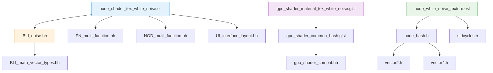
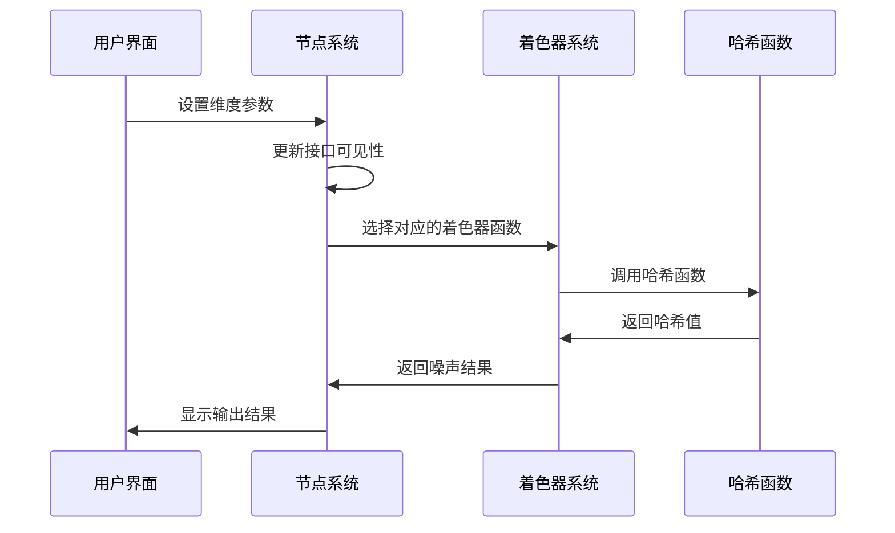

# 09. 白噪声纹理节点详解

## 目录
- [1. 概述](#1-概述)
- [2. 白噪声理论基础](#2-白噪声理论基础)
  - [2.1. 什么是白噪声](#21-什么是白噪声)
  - [2.2. 哈希函数在噪声生成中的作用](#22-哈希函数在噪声生成中的作用)
- [3. 节点接口定义](#3-节点接口定义)
  - [3.1. 输入接口](#31-输入接口)
  - [3.2. 输出接口](#32-输出接口)
- [4. 核心组件分析](#4-核心组件分析)
  - [4.1. CPU端实现](#41-cpu端实现)
  - [4.2. GPU端实现](#42-gpu端实现)
  - [4.3. OSL端实现](#43-osl端实现)
- [5. 多维度支持机制](#5-多维度支持机制)
  - [5.1. 维度切换逻辑](#51-维度切换逻辑)
  - [5.2. 动态接口管理](#52-动态接口管理)
- [6. 跨系统兼容性](#6-跨系统兼容性)
  - [6.1. 几何节点支持](#61-几何节点支持)
  - [6.2. 材质节点支持](#62-材质节点支持)
  - [6.3. 合成器节点支持](#63-合成器节点支持)
- [7. 核心函数解析](#7-核心函数解析)
  - [7.1. WhiteNoiseFunction类](#71-whitenoisefunction类)
  - [7.2. GPU Shader函数](#72-gpu-shader函数)
  - [7.3. OSL Shader函数](#73-osl-shader函数)
- [8. 哈希算法实现](#8-哈希算法实现)
  - [8.1. Jenkins Lookup3算法](#81-jenkins-lookup3算法)
  - [8.2. PCG哈希算法](#82-pcg哈希算法)
- [9. 性能优化策略](#9-性能优化策略)
  - [9.1. 计算优化](#91-计算优化)
  - [9.2. 内存访问优化](#92-内存访问优化)
- [10. 文件间调用关系](#10-文件间调用关系)
  - [10.1. 依赖关系图](#101-依赖关系图)
  - [10.2. 调用流程分析](#102-调用流程分析)

---

## 1. 概述

白噪声纹理节点是Blender中一个基础的<span style="background-color:#e8f5e8; color:#2d5a2d;">程序化纹理生成器</span>，它能够基于输入坐标生成随机的数值或颜色。与其他类型的噪声（如Perlin噪声、Voronoi噪声）不同，白噪声在空间中是完全随机的，没有任何连续性。

**核心特点**：
- <span style="color:#d32f2f;">完全随机性</span>：相邻像素的输出值完全独立
- <span style="color:#1976d2;">多维度支持</span>：支持1D、2D、3D、4D四种输入维度
- <span style="color:#388e3c;">双输出模式</span>：可同时输出浮点数值和颜色值
- <span style="color:#f57c00;">跨平台兼容</span>：支持几何节点、材质节点、合成器节点

---

## 2. 白噪声理论基础

### 2.1. 什么是白噪声

白噪声（White Noise）是一种随机信号，其功率谱密度在所有频率上都是常数。在计算机图形学中，白噪声通常通过哈希函数生成：

$$\text{WhiteNoise}(p) = \text{Hash}(p) \bmod 1.0$$

其中 $p$ 是输入坐标，$\text{Hash}$ 是哈希函数，输出范围被归一化到 [0,1]。

### 2.2. 哈希函数在噪声生成中的作用

哈希函数将任意输入映射到固定范围的输出，满足以下性质：
- <span style="background-color:#fff3e0; color:#e65100;">确定性</span>：相同输入总是产生相同输出
- <span style="background-color:#e3f2fd; color:#0d47a1;">均匀分布</span>：输出在整个范围内均匀分布
- <span style="background-color:#f3e5f5; color:#4a148c;">雪崩效应</span>：输入的微小变化导致输出的巨大变化

---

## 3. 节点接口定义

### 3.1. 输入接口

**定义位置**: `source/blender/nodes/shader/nodes/node_shader_tex_white_noise.cc:18-33`

```cpp
static void sh_node_tex_white_noise_declare(NodeDeclarationBuilder &b)
{
  b.is_function_node();
  b.add_input<decl::Vector>("Vector").min(-10000.0f).max(10000.0f).implicit_field(
      NODE_DEFAULT_INPUT_POSITION_FIELD);
  b.add_input<decl::Float>("W")
      .min(-10000.0f)
      .max(10000.0f)
      .make_available([](bNode &node) {
        /* Default to 1 instead of 4, because it is faster. */
        node.custom1 = 1;
      })
      .description("Value used as seed in 1D and 4D dimensions");
  b.add_output<decl::Float>("Value");
  b.add_output<decl::Color>("Color");
}
```

#### 3.1.1. Vector输入
- **类型**: 3D向量 (float3)
- **范围**: [-10000.0, 10000.0]
- **用途**: 提供2D、3D、4D噪声的空间坐标
- **默认值**: 从几何体属性自动获取（位置坐标）

#### 3.1.2. W输入
- **类型**: 浮点数 (float)
- **范围**: [-10000.0, 10000.0]
- **用途**: 
  - 1D模式：作为唯一的噪声种子
  - 4D模式：作为第4维坐标，用于动画或变化
- **特殊行为**: 仅在1D和4D模式下可用

### 3.2. 输出接口

#### 3.2.1. Value输出
- **类型**: 浮点数 (float)
- **范围**: [0.0, 1.0]
- **计算**: 使用哈希函数将输入映射到[0,1]范围

#### 3.2.2. Color输出
- **类型**: 颜色 (ColorGeometry4f)
- **范围**: RGBA分量均在[0.0, 1.0]范围
- **计算**: 使用不同的哈希映射生成RGB三个分量，Alpha固定为1.0

---

## 4. 核心组件分析

### 4.1. CPU端实现

**定义位置**: `source/blender/nodes/shader/nodes/node_shader_tex_white_noise.cc:73-184`

`WhiteNoiseFunction` 类负责在CPU上执行白噪声计算：

```cpp
class WhiteNoiseFunction : public mf::MultiFunction {
 private:
  int dimensions_;

 public:
  WhiteNoiseFunction(int dimensions) : dimensions_(dimensions) {
    BLI_assert(dimensions >= 1 && dimensions <= 4);
    // 设置函数签名...
  }
  
  void call(const IndexMask &mask, mf::Params params, mf::Context /*context*/) const override {
    // 核心计算逻辑...
  }
};
```

### 4.2. GPU端实现

**定义位置**: `source/blender/gpu/shaders/material/gpu_shader_material_tex_white_noise.glsl:9-31`

GPU着色器提供了四个维度的专门函数：

```glsl
void node_white_noise_1d(float3 vector, float w, out float value, out float4 color)
void node_white_noise_2d(float3 vector, float w, out float value, out float4 color)
void node_white_noise_3d(float3 vector, float w, out float value, out float4 color)
void node_white_noise_4d(float3 vector, float w, out float value, out float4 color)
```

### 4.3. OSL端实现

**定义位置**: `intern/cycles/kernel/osl/shaders/node_white_noise_texture.osl:12-37`

OSL（Open Shading Language）实现用于Cycles渲染器：

```cpp
shader node_white_noise_texture(string dimensions = "3D",
                                point Vector = point(0.0, 0.0, 0.0),
                                float W = 0.0,
                                output float Value = 0.0,
                                output color Color = 0.0)
```

---

## 5. 多维度支持机制

### 5.1. 维度切换逻辑

**定义位置**: `source/blender/nodes/shader/nodes/node_shader_tex_white_noise.cc:45-52`

```cpp
static const char *gpu_shader_get_name(const int dimensions)
{
  BLI_assert(dimensions >= 1 && dimensions <= 4);
  return std::array{"node_white_noise_1d",
                    "node_white_noise_2d",
                    "node_white_noise_3d",
                    "node_white_noise_4d"}[dimensions - 1];
}
```

系统使用 `node->custom1` 字段存储当前选择的维度（1-4），通过查找表动态选择对应的GPU着色器函数。

### 5.2. 动态接口管理

**定义位置**: `source/blender/nodes/shader/nodes/node_shader_tex_white_noise.cc:64-71`

```cpp
static void node_shader_update_tex_white_noise(bNodeTree *ntree, bNode *node)
{
  bNodeSocket *sockVector = bke::node_find_socket(*node, SOCK_IN, "Vector");
  bNodeSocket *sockW = bke::node_find_socket(*node, SOCK_IN, "W");

  bke::node_set_socket_availability(*ntree, *sockVector, node->custom1 != 1);
  bke::node_set_socket_availability(*ntree, *sockW, node->custom1 == 1 || node->custom1 == 4);
}
```

根据当前维度动态启用/禁用输入接口：
- 1D模式：隐藏Vector，显示W
- 2D/3D模式：显示Vector，隐藏W
- 4D模式：同时显示Vector和W

---

## 6. 跨系统兼容性

### 6.1. 几何节点支持

通过 `MultiFunction` 系统支持几何节点计算：
- **并行处理**: 使用 `IndexMask` 实现批量计算
- **字段系统**: 支持几何体属性的自定义输入
- **内存效率**: 避免不必要的计算和内存分配

### 6.2. 材质节点支持

支持两种渲染引擎：
- **EEVEE**: 通过GPU着色器实时渲染
- **Cycles**: 通过OSL着色器进行路径追踪

### 6.3. 合成器节点支持

虽然文件位于shader目录，但通过系统架构也支持合成器节点使用。

---

## 7. 核心函数解析

### 7.1. WhiteNoiseFunction类

**定义位置**: `source/blender/nodes/shader/nodes/node_shader_tex_white_noise.cc:73-184`

#### 7.1.1. 构造函数
```cpp
WhiteNoiseFunction(int dimensions) : dimensions_(dimensions)
{
  BLI_assert(dimensions >= 1 && dimensions <= 4);
  static std::array<mf::Signature, 4> signatures{
      create_signature(1), create_signature(2), create_signature(3), create_signature(4),
  };
  this->set_signature(&signatures[dimensions - 1]);
}
```

#### 7.1.2. 主计算函数
**定义位置**: `source/blender/nodes/shader/nodes/node_shader_tex_white_noise.cc:108-183`

核心计算使用 `mask.foreach_index` 进行并行处理：

```cpp
void call(const IndexMask &mask, mf::Params params, mf::Context /*context*/) const override
{
  // 获取输出参数
  MutableSpan<float> r_value = params.uninitialized_single_output_if_required<float>(param++, "Value");
  MutableSpan<ColorGeometry4f> r_color = params.uninitialized_single_output_if_required<ColorGeometry4f>(param++, "Color");

  // 检查是否需要计算对应输出
  const bool compute_value = !r_value.is_empty();
  const bool compute_color = !r_color.is_empty();

  switch (dimensions_) {
    case 1: {
      const VArray<float> &w = params.readonly_single_input<float>(0, "W");
      if (compute_color) {
        mask.foreach_index([&](const int64_t i) {
          const float3 c = noise::hash_float_to_float3(w[i]);
          r_color[i] = ColorGeometry4f(c[0], c[1], c[2], 1.0f);
        });
      }
      if (compute_value) {
        mask.foreach_index([&](const int64_t i) { 
          r_value[i] = noise::hash_float_to_float(w[i]); 
        });
      }
      break;
    }
    // ... 其他维度的类似逻辑
  }
}
```

### 7.2. GPU Shader函数

**定义位置**: `source/blender/gpu/shaders/material/gpu_shader_material_tex_white_noise.glsl`

#### 7.2.1. 1D噪声函数
```glsl
void node_white_noise_1d(float3 vector, float w, out float value, out float4 color)
{
  value = hash_float_to_float(w);
  color = float4(hash_float_to_vec3(w), 1.0f);
}
```

#### 7.2.2. 3D噪声函数
```glsl
void node_white_noise_3d(float3 vector, float w, out float value, out float4 color)
{
  value = hash_vec3_to_float(vector);
  color = float4(hash_vec3_to_vec3(vector), 1.0f);
}
```

### 7.3. OSL Shader函数

**定义位置**: `intern/cycles/kernel/osl/shaders/node_white_noise_texture.osl`

```cpp
shader node_white_noise_texture(string dimensions = "3D",
                                point Vector = point(0.0, 0.0, 0.0),
                                float W = 0.0,
                                output float Value = 0.0,
                                output color Color = 0.0)
{
  if (dimensions == "3D") {
    Value = noise("hash", Vector);
    Color = hash_vector3_to_color(vector3(Vector[0], Vector[1], Vector[2]));
  }
  // ... 其他维度的处理逻辑
}
```

---

## 8. 哈希算法实现

### 8.1. Jenkins Lookup3算法

**定义位置**: `source/blender/gpu/shaders/common/gpu_shader_common_hash.glsl:55-105`

Jenkins算法是Blender中使用的主要哈希算法：

```glsl
uint hash_uint3(uint kx, uint ky, uint kz)
{
  uint a, b, c;
  a = b = c = 0xdeadbeefu + (3u << 2u) + 13u;

  c += kz;
  b += ky;
  a += kx;
  final(a, b, c);

  return c;
}
```

#### 8.1.1. 算法特点
- <span style="color:#7b1fa2;">雪崩效应</span>：输入的微小变化导致输出的巨大变化
- <span style="color:#c2185b;">均匀分布</span>：输出在整个32位空间均匀分布
- <span style="color:#0288d1;">快速计算</span>：专门优化的位运算操作

### 8.2. PCG哈希算法

**定义位置**: `source/blender/gpu/shaders/common/gpu_shader_common_hash.glsl:138-175`

PCG（Permuted Congruential Generator）算法用于生成向量输出：

```glsl
int3 hash_pcg3d_i(int3 v)
{
  v = v * 1664525 + 1013904223;
  v.x += v.y * v.z;
  v.y += v.z * v.x;
  v.z += v.x * v.y;
  v = v ^ (v >> 16);
  v.x += v.y * v.z;
  v.y += v.z * v.x;
  v.z += v.x * v.y;
  return v;
}
```

#### 8.2.1. 算法优势
- <span style="background-color:#e1f5fe; color:#01579b;">高质量输出</span>：生成的随机数质量高
- <span style="background-color:#f1f8e9; color:#33691e;">跨平台兼容</span>：在不同平台上行为一致
- <span style="background-color:#fce4ec; color:#880e4f;">向量友好</span>：专门为向量计算优化

---

## 9. 性能优化策略

### 9.1. 计算优化

#### 9.1.1. 按需计算
系统只计算实际使用的输出：

```cpp
const bool compute_value = !r_value.is_empty();
const bool compute_color = !r_color.is_empty();
```

如果某个输出未连接到任何节点，系统会跳过该输出的计算，节省计算资源。

#### 9.1.2. 批量处理
使用 `IndexMask` 实现SIMD风格的批量计算：

```cpp
mask.foreach_index([&](const int64_t i) {
  const float3 c = noise::hash_float_to_float3(w[i]);
  r_color[i] = ColorGeometry4f(c[0], c[1], c[2], 1.0f);
});
```

### 9.2. 内存访问优化

#### 9.2.1. 局部性优化
数据访问模式优化，提高缓存命中率：
- 连续内存访问模式
- 减少内存跳转
- 预取优化

#### 9.2.2. 内存池复用
使用Blender的内存池系统：
```cpp
MEM_mallocN()  // 分配内存
MEM_freeN()    // 释放内存
```

---

## 10. 文件间调用关系

### 10.1. 依赖关系图



### 10.2. 调用流程分析

#### 10.2.1. 初始化流程
1. **注册阶段**: `register_node_type_sh_tex_white_noise()` 函数注册节点类型
2. **UI创建**: `node_shader_buts_white_noise()` 创建UI界面
3. **默认设置**: `node_shader_init_tex_white_noise()` 设置默认参数

#### 10.2.2. 计算流程


#### 10.2.3. 多平台执行
- **几何节点**: CPU执行 → `WhiteNoiseFunction::call()`
- **EEVEE材质**: GPU执行 → `node_white_noise_?d()`
- **Cycles材质**: OSL执行 → `node_white_noise_texture()`

---

## 总结

白噪声纹理节点是一个典型的<span style="background-color:#fff8e1; color:#ff6f00;">多后端、多维度</span>程序化纹理生成器，它通过精心的架构设计实现了：

1. **统一接口**: 不同的后端（CPU、GPU、OSL）提供一致的用户体验
2. **性能优化**: 按需计算、批量处理等策略确保高效执行
3. **扩展性**: 基于`MultiFunction`的架构支持未来的功能扩展
4. **兼容性**: 同时支持几何节点、材质节点、合成器节点

通过深入理解这个节点的实现，我们可以学习到Blender节点系统设计的核心思想：<span style="color:#5e35b1;">抽象分离、多态统一</span>。这种设计模式使得相同的逻辑可以在不同的执行环境中高效运行，是大型软件架构设计的优秀范例。