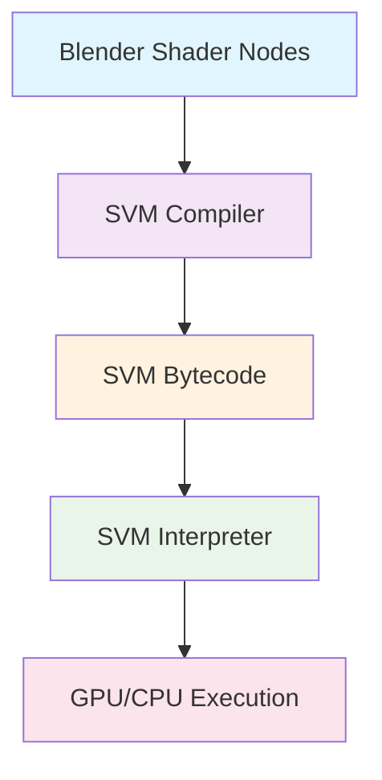
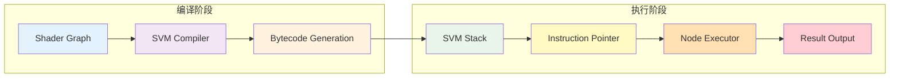
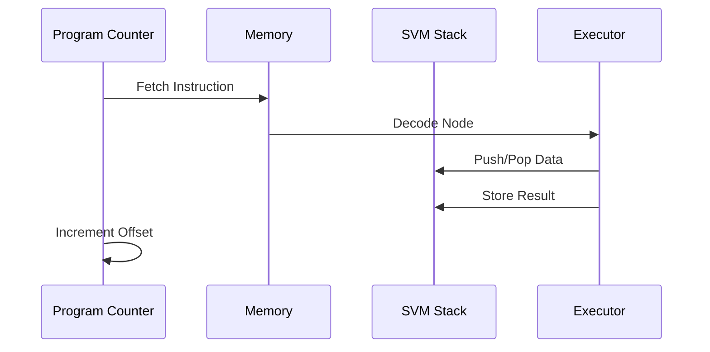
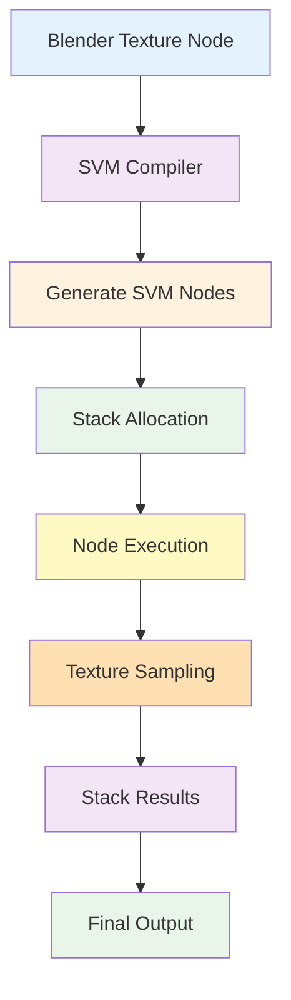
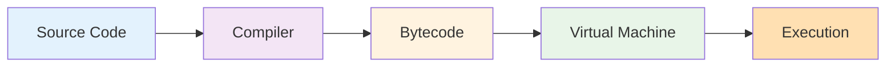

# 10. SVM文件夹详解

## 目录

- [10.1 SVM概述与命名含义](#101-svm概述与命名含义)
- [10.2 SVM系统架构与设计原理](#102-svm系统架构与设计原理)
- [10.3 SVM文件结构与组织](#103-svm文件结构与组织)
- [10.4 SVM核心组件详解](#104-svm核心组件详解)
- [10.5 SVM与纹理节点的实现关系](#105-svm与纹理节点的实现关系)
- [10.6 SVM指令集与节点类型](#106-svm指令集与节点类型)
- [10.7 SVM内存管理与栈操作](#107-svm内存管理与栈操作)
- [10.8 性能优化与SIMD支持](#108-svm优化与simd支持)
- [10.9 基础知识学习](#109-基础知识学习)
- [10.10 高级特性与扩展](#1010-高级特性与扩展)

## 10.1 SVM概述与命名含义

### 10.1.1 SVM是什么的缩写？

<span style="background-color:#e3f2fd; color:#1565c0; padding:4px 8px; border-radius:4px">SVM</span> 是 **<span style="color:#d32f2f; font-weight:bold">Shader Virtual Machine</span>** 的缩写，中文意为"着色器虚拟机"。

### 10.1.2 为什么这样命名？

这个名字反映了SVM系统的核心设计理念：

1. **<span style="color:#388e3c">虚拟机特性</span>**: SVM是一个基于字节码的解释器，像虚拟机一样执行预编译的指令序列
2. **<span style="color:#388e3c">着色器专用</span>**: 专门为GPU着色器计算设计，处理复杂的材质和光照计算
3. **<span style="color:#388e3c">抽象层</span>**: 为不同的硬件平台(CPU、GPU、OpenCL等)提供统一的着色器执行接口



### 10.1.3 SVM在Cycles中的地位

SVM是Cycles渲染引擎的核心组件，负责：
- 将Blender的可视化着色器节点图转换为可执行的字节码
- 在GPU/CPU上高效执行着色器计算
- 管理着色器内存和执行状态

## 10.2 SVM系统架构与设计原理

### 10.2.1 整体架构设计

SVM采用了经典的<span style="background-color:#f5f5f5; color:#424242; padding:2px 6px">虚拟机架构</span>，包含以下核心组件：



### 10.2.2 核心设计原理

#### 1. <span style="color:#1976d2">基于栈的虚拟机</span>

SVM采用基于栈的架构设计，这与Java虚拟机类似：

```c
// SVM栈操作 - intern/cycles/kernel/svm/util.h:16-89
#define SVM_STACK_SIZE 255

ccl_device_inline float stack_load_float(const ccl_private float *stack, const uint a)
{
    kernel_assert(a < SVM_STACK_SIZE);
    return stack[a];
}

ccl_device_inline void stack_store_float(ccl_private float *stack, const uint a, const float f)
{
    kernel_assert(a < SVM_STACK_SIZE);
    stack[a] = f;
}
```

#### 2. <span style="color:#1976d2">指令流水线</span>

SVM的执行遵循标准的指令流水线：



#### 3. <span style="color:#1976d2">统一的数据表示</span>

SVM栈中的所有数据都是<span style="background-color:#fff3e0; color:#e65100">float类型</span>，这简化了设计并提高了GPU兼容性：

- **标量值**: 单个float
- **向量**: 3个连续的float (float3)
- **颜色**: 3个连续的float (RGB)
- **法线**: 3个连续的float (float3)

## 10.3 SVM文件结构与组织

### 10.3.1 目录结构概览

```
intern/cycles/kernel/svm/
├── svm.h                 # 主解释器和节点分发器
├── types.h              # 类型定义和枚举
├── util.h               # 栈操作和工具函数
├── node_types_template.h # 节点类型列表
├── closure.h            # 材质闭包节点
├── math.h               # 数学运算节点
├── convert.h            # 类型转换节点
├── [texture_nodes].h    # 各种纹理节点
└── [other_nodes].h      # 其他功能节点
```

### 10.3.2 文件分类说明

#### <span style="background-color:#e8f5e8; color:#2e7d32">核心系统文件</span>

| 文件名 | 功能描述 | 关键内容 |
|--------|----------|----------|
| `svm.h` | 主解释器 | `svm_eval_nodes()` 主循环 |
| `types.h` | 类型定义 | `ShaderNodeType` 枚举 |
| `util.h` | 工具函数 | 栈操作、节点读取 |
| `node_types_template.h` | 节点列表 | 所有SVM节点类型 |

#### <span style="background-color:#fff3e0; color:#ef6c00">纹理相关文件</span>

| 文件名 | 纹理类型 | 实现特性 |
|--------|----------|----------|
| `noise.h` | Perlin噪声 | 1D-4D噪声，SIMD优化 |
| `image.h` | 图像纹理 | 多投影、平铺支持 |
| `checker.h` | 棋盘纹理 | 简单程序纹理 |
| `voronoi.h` | Voronoi纹理 | 距离场计算 |
| `wave.h` | 波浪纹理 | 周期性图案 |

#### <span style="background-color:#f3e5f5; color:#7b1fa2">数学运算文件</span>

| 文件名 | 运算类型 | 说明 |
|--------|----------|------|
| `math.h` | 标量数学 | 加减乘除、三角函数 |
| `vector_math.h` | 向量数学 | 点积、叉积、变换 |
| `math_util.h` | 数学工具 | 通用数学函数 |

## 10.4 SVM核心组件详解

### 10.4.1 主解释器 (svm.h:98-490)

SVM的核心是<span style="color:#d32f2f; font-weight:bold">svm_eval_nodes</span>函数，这是一个巨大的switch语句：

```c
template<uint node_feature_mask, ShaderType type, typename ConstIntegratorGenericState>
ccl_device void svm_eval_nodes(KernelGlobals kg,
                               ConstIntegratorGenericState state,
                               ccl_private ShaderData *sd,
                               ccl_global float *render_buffer,
                               const uint32_t path_flag)
{
    float stack[SVM_STACK_SIZE];  // SVM栈
    Spectrum closure_weight = zero_spectrum();
    int offset = sd->shader & SHADER_MASK;
    
    while (true) {
        uint4 node = read_node(kg, &offset);  // 读取指令
        
        switch (node.x) {
            case NODE_END:
                return;
            case NODE_CLOSURE_BSDF:
                offset = svm_node_closure_bsdf<node_feature_mask, type>(
                    kg, sd, stack, closure_weight, node, path_flag, offset);
                break;
            case NODE_MATH:
                svm_node_math(stack, node.y, node.z, node.w);
                break;
            // ... 更多节点处理
        }
    }
}
```

#### 关键设计特点：

1. **<span style="color:#388e3c">模板参数化</span>**: `node_feature_mask`控制节点可用性
2. **<span style="color:#388e3c">栈基础执行</span>**: 所有节点操作都通过栈进行
3. **<span style="color:#388e3c">统一错误处理</span>**: `kernel_assert`确保执行安全

### 10.4.2 栈管理系统 (util.h:16-89)

SVM栈是虚拟机的核心数据结构：

```c
// 栈大小定义
#define SVM_STACK_SIZE 255
#define SVM_STACK_INVALID 255  // 无效偏移标记

// 向量加载操作
ccl_device_inline float3 stack_load_float3(const ccl_private float *stack, const uint a)
{
    kernel_assert(a + 2 < SVM_STACK_SIZE);
    const ccl_private float *stack_a = stack + a;
    return make_float3(stack_a[0], stack_a[1], stack_a[2]);
}

// 标量存储操作
ccl_device_inline void stack_store_float(ccl_private float *stack, const uint a, const float f)
{
    kernel_assert(a < SVM_STACK_SIZE);
    stack[a] = f;
}
```

#### 栈布局策略：

```
SVM Stack Layout:
[0]    - Float/Scalar
[1-3]  - Float3/Vector/Color  
[4]    - Float/Scalar
[5-7]  - Float3/Vector/Color
...
[254]  - Final Float/Scalar
```

### 10.4.3 节点读取系统 (util.h:93-118)

SVM使用`uint4`格式编码每个节点：

```c
ccl_device_inline uint4 read_node(KernelGlobals kg, ccl_private int *const offset)
{
    uint4 node = kernel_data_fetch(svm_nodes, *offset);
    (*offset)++;
    return node;
}

// 浮点数据转换
ccl_device_inline float4 read_node_float(KernelGlobals kg, ccl_private int *const offset)
{
    const uint4 node = kernel_data_fetch(svm_nodes, *offset);
    const float4 f = make_float4(__uint_as_float(node.x),
                                 __uint_as_float(node.y), 
                                 __uint_as_float(node.z),
                                 __uint_as_float(node.w));
    (*offset)++;
    return f;
}
```

#### 节点编码格式：

每个`uint4`节点包含：
- **node.x**: 节点类型ID (如 `NODE_MATH`, `NODE_TEX_IMAGE`)
- **node.y**: 输入栈偏移或参数1
- **node.z**: 输出栈偏移或参数2  
- **node.w**: 标志位或参数3

## 10.5 SVM与纹理节点的实现关系

### 10.5.1 纹理节点在SVM中的角色

<span style="background-color:#e1f5fe; color:#0277bd; padding:4px">纹理节点</span>是SVM系统中最重要的节点类型之一，负责生成复杂的程序纹理和图像纹理。

### 10.5.2 纹理节点实现示例

#### 1. Checker纹理节点 (checker.h:27-52)

```c
ccl_device_noinline void svm_node_tex_checker(ccl_private float *stack, const uint4 node)
{
    uint co_offset, color1_offset, color2_offset, scale_offset;
    uint color_offset, fac_offset;
    
    // 解包节点参数
    svm_unpack_node_uchar4(node.y, &co_offset, &color1_offset, &color2_offset, &scale_offset);
    svm_unpack_node_uchar2(node.z, &color_offset, &fac_offset);
    
    // 从栈加载输入
    const float3 co = stack_load_float3(stack, co_offset);
    const float3 color1 = stack_load_float3(stack, color1_offset);
    const float3 color2 = stack_load_float3(stack, color2_offset);
    const float scale = stack_load_float_default(stack, scale_offset, node.w);
    
    // 执行checker算法
    const float f = svm_checker(co * scale);
    
    // 存储结果到栈
    if (stack_valid(color_offset)) {
        stack_store_float3(stack, color_offset, (f == 1.0f) ? color1 : color2);
    }
    if (stack_valid(fac_offset)) {
        stack_store_float(stack, fac_offset, f);
    }
}
```

#### 2. 图像纹理节点 (image.h:49-128)

```c
ccl_device_noinline int svm_node_tex_image(KernelGlobals kg,
                                           ccl_private ShaderData *sd,
                                           ccl_private float *stack,
                                           const uint4 node,
                                           int offset)
{
    uint co_offset, out_offset, alpha_offset, flags;
    svm_unpack_node_uchar4(node.z, &co_offset, &out_offset, &alpha_offset, &flags);
    
    float3 co = stack_load_float3(stack, co_offset);
    float2 tex_co;
    
    // 根据投影类型转换坐标
    if (node.w == NODE_IMAGE_PROJ_SPHERE) {
        co = texco_remap_square(co);
        tex_co = map_to_sphere(co);
    } else if (node.w == NODE_IMAGE_PROJ_TUBE) {
        co = texco_remap_square(co);
        tex_co = map_to_tube(co);
    } else {
        tex_co = make_float2(co.x, co.y);
    }
    
    // 处理平铺图像
    int id = -1;
    const int num_nodes = (int)node.y;
    if (num_nodes > 0) {
        // 平铺查找逻辑...
    }
    
    // 执行纹理采样
    const float4 f = svm_image_texture(kg, id, tex_co.x, tex_co.y, flags);
    
    // 存储结果
    if (stack_valid(out_offset)) {
        stack_store_float3(stack, out_offset, make_float3(f.x, f.y, f.z));
    }
    if (stack_valid(alpha_offset)) {
        stack_store_float(stack, alpha_offset, f.w);
    }
    return offset;
}
```

### 10.5.3 纹理节点的SVM集成流程



## 10.6 SVM指令集与节点类型

### 10.6.1 节点类型定义 (node_types_template.h)

SVM使用宏系统定义所有节点类型：

```c
// 基础节点
SHADER_NODE_TYPE(NODE_END)
SHADER_NODE_TYPE(NODE_SHADER_JUMP)
SHADER_NODE_TYPE(NODE_CLOSURE_BSDF)

// 纹理节点
SHADER_NODE_TYPE(NODE_TEX_IMAGE)
SHADER_NODE_TYPE(NODE_TEX_NOISE)
SHADER_NODE_TYPE(NODE_TEX_CHECKER)

// 数学节点
SHADER_NODE_TYPE(NODE_MATH)
SHADER_NODE_TYPE(NODE_VECTOR_MATH)
```

### 10.6.2 数学运算节点 (math.h:12-28)

```c
ccl_device_noinline void svm_node_math(ccl_private float *stack,
                                       const uint type,
                                       const uint inputs_stack_offsets,
                                       const uint result_stack_offset)
{
    uint a_stack_offset, b_stack_offset, c_stack_offset;
    svm_unpack_node_uchar3(inputs_stack_offsets, &a_stack_offset, &b_stack_offset, &c_stack_offset);
    
    const float a = stack_load_float(stack, a_stack_offset);
    const float b = stack_load_float(stack, b_stack_offset);
    const float c = stack_load_float(stack, c_stack_offset);
    const float result = svm_math((NodeMathType)type, a, b, c);
    
    stack_store_float(stack, result_stack_offset, result);
}
```

### 10.6.3 闭包节点 (closure.h:38-50)

闭包节点定义材质的光照特性：

```c
template<uint node_feature_mask, ShaderType shader_type>
ccl_device_noinline int svm_node_closure_bsdf(KernelGlobals kg,
                                              ccl_private ShaderData *sd,
                                              ccl_private float *stack,
                                              Spectrum closure_weight,
                                              const uint4 node,
                                              const uint32_t path_flag,
                                              int offset)
{
    // BSDF参数处理
    uint mixture_weight_offset, N_offset, roughness_offset;
    svm_unpack_node_uchar3(node.y, &mixture_weight_offset, &N_offset, &roughness_offset);
    
    // 加载参数
    float mixture_weight = stack_load_float(stack, mixture_weight_offset);
    float3 N = stack_valid(N_offset) ? stack_load_float3(stack, N_offset) : sd->N;
    float roughness = stack_load_float(stack, roughness_offset);
    
    // 创建BSDF闭包
    if (mixure_weight > 0.0f) {
        // BSDF创建逻辑...
    }
    
    return offset;
}
```

## 10.7 SVM内存管理与栈操作

### 10.7.1 栈分配策略

SVM使用<span style="background-color:#fff3e0; color:#e65100">静态栈分配</span>策略：

```c
// 固定大小的栈数组
float stack[SVM_STACK_SIZE];
```

#### 栈使用约定：

- **0-254**: 可用栈位置
- **255**: `SVM_STACK_INVALID` 标记

### 10.7.2 栈操作优化

SVM提供了多种栈操作函数来优化性能：

```c
// 带默认值的加载
ccl_device_inline float stack_load_float_default(const ccl_private float *stack,
                                                 const uint a,
                                                 const float value)
{
    return (a == (uint)SVM_STACK_INVALID) ? value : stack_load_float(stack, a);
}

// 有效性检查
ccl_device_inline bool stack_valid(const uint a)
{
    return a != (uint)SVM_STACK_INVALID;
}
```

### 10.7.3 内存布局优化

为了最大化GPU性能，SVM采用了特殊的内存布局：

1. **<span style="color:#388e3c">连续内存访问</span>**: 相关数据相邻存储
2. **<span style="color:#388e3c">对齐优化</span>:** 数据按GPU要求对齐
3. **<span style="color:#388e3c">缓存友好</span>**: 常用数据放在栈底部

## 10.8 SVM优化与SIMD支持

### 10.8.1 SIMD优化策略

SVM在噪声函数中广泛使用SIMD优化 (noise.h:251-663)：

```c
#ifdef __KERNEL_SSE__
// SSE优化的双线性插值
ccl_device_inline float4 bi_mix(const float4 p, const float4 f)
{
    const float4 g = mix(p, shuffle<2, 3, 2, 3>(p), shuffle<0>(f));
    return mix(g, shuffle<1>(g), shuffle<1>(f));
}

// SSE优化的渐变函数
ccl_device_inline float4 grad(const int4 hash, const float4 x, const float4 y)
{
    const int4 h = hash & 7;
    const float4 u = select(h < 4, x, y);
    const float4 v = 2.0f * select(h < 4, y, x);
    return negate_if_nth_bit(u, h, 0) + negate_if_nth_bit(v, h, 1);
}
#endif
```

### 10.8.2 AVX进一步优化

```c
#ifdef __KERNEL_AVX2__
// AVX优化的3D噪声
ccl_device_noinline_cpu float perlin_3d(const float x, const float y, float z)
{
    // 使用AVX同时计算8个梯度
    vfloat8 g = grad(h, make_vfloat8(fx, fx1), make_vfloat8(fy, fy), make_vfloat8(fz, fz));
    return extract<0>(tri_mix(low(g), high(g), uvw));
}
#endif
```

### 10.8.3 性能监控

SVM包含性能监控机制：

```c
#ifdef __KERNEL_USE_DATA_CONSTANTS__
#define SVM_CASE(node) \
    case node: \
        if (!kernel_data_svm_usage_##node) \
            break;
#else
#define SVM_CASE(node) case node:
#endif
```

## 10.9 基础知识学习

### 10.9.1 计算机图形学基础

#### 1. <span style="color:#1976d2">着色器模型</span>

着色器是GPU上的小程序，负责计算像素颜色：

```
Input → Shader → Output
```

#### 2. <span style="color:#1976d2">材质模型</span>

材质描述物体如何与光交互：
- **漫反射**: 光线均匀散射
- **镜面反射**: 光线定向反射  
- **折射**: 光线穿过材质

### 10.9.2 编译原理基础

#### 1. <span style="color:#1976d2">虚拟机概念</span>

虚拟机是执行字节码的软件：



#### 2. <span style="color:#1976d2">栈式虚拟机</span>

栈式虚拟机使用栈进行所有操作：

```
Push 5
Push 3
Add      // 5 + 3 = 8
Store x
```

### 10.9.3 GPU编程基础

#### 1. <span style="color:#1976d2">并行计算</span>

GPU同时处理大量数据：

```
CPU:  任务1 → 任务2 → 任务3
GPU:  任务1
      任务2  
      任务3  (并行执行)
```

#### 2. <span style="color:#1976d2">SIMD指令</span>

单指令多数据：

```
普通:   add a1,b1 → r1
        add a2,b2 → r2
        add a3,b3 → r3
        
SIMD:   add [a1,a2,a3], [b1,b2,b3] → [r1,r2,r3]
```

## 10.10 高级特性与扩展

### 10.10.1 条件执行与控制流

SVM支持条件跳转：

```c
case NODE_JUMP_IF_ZERO:
    if (stack_load_float(stack, node.z) <= 0.0f) {
        offset += node.y;  // 跳转
    }
    break;
```

### 10.10.2 特性掩码

SVM使用特性掩码控制节点可用性：

```c
template<uint node_feature_mask>
ccl_device void svm_eval_nodes(...)
{
    // 根据特性掩码启用/禁用节点
    SVM_CASE(NODE_BEVEL)
    svm_node_bevel<node_feature_mask>(...);
}
```

### 10.10.3 多着色器类型支持

SVM支持多种着色器类型：

```c
enum ShaderType {
    SHADER_TYPE_SURFACE,
    SHADER_TYPE_VOLUME,
    SHADER_TYPE_DISPLACEMENT,
    SHADER_TYPE_BUMP,
};
```

### 10.10.4 AOV (Arbitrary Output Variables)

SVM支持自定义输出变量：

```c
case NODE_AOV_COLOR:
    svm_node_aov_color<node_feature_mask>(kg, state, stack, node, render_buffer);
    break;
```

### 10.10.5 扩展架构

SVM设计支持扩展：

```c
// 新节点添加步骤：
// 1. 在node_types_template.h中添加节点类型
// 2. 在svm.h的switch中添加处理代码  
// 3. 实现具体的节点函数
// 4. 更新编译器以生成新节点
```

## 总结

SVM (Shader Virtual Machine) 是Cycles渲染引擎的核心技术，它通过虚拟机架构高效执行复杂的着色器计算。本章节详细介绍了：

1. **SVM命名含义与设计理念**
2. **系统架构与核心组件**  
3. **文件组织与实现细节**
4. **纹理节点的SVM集成方式**
5. **性能优化与SIMD支持**

理解SVM对于掌握Cycles渲染引擎的工作原理和进行性能优化至关重要。通过学习SVM，开发者可以：

- 更好地理解材质节点的执行机制
- 优化复杂材质的性能
- 开发自定义着色器节点
- 进行底层渲染优化

SVM代表了现代渲染引擎中虚拟机技术的成功应用，为实时渲染和离线渲染提供了高效的着色器执行平台。

---

*本章节涵盖了SVM系统的完整技术细节，从基础概念到高级优化，为读者提供了全面的学习资源。*