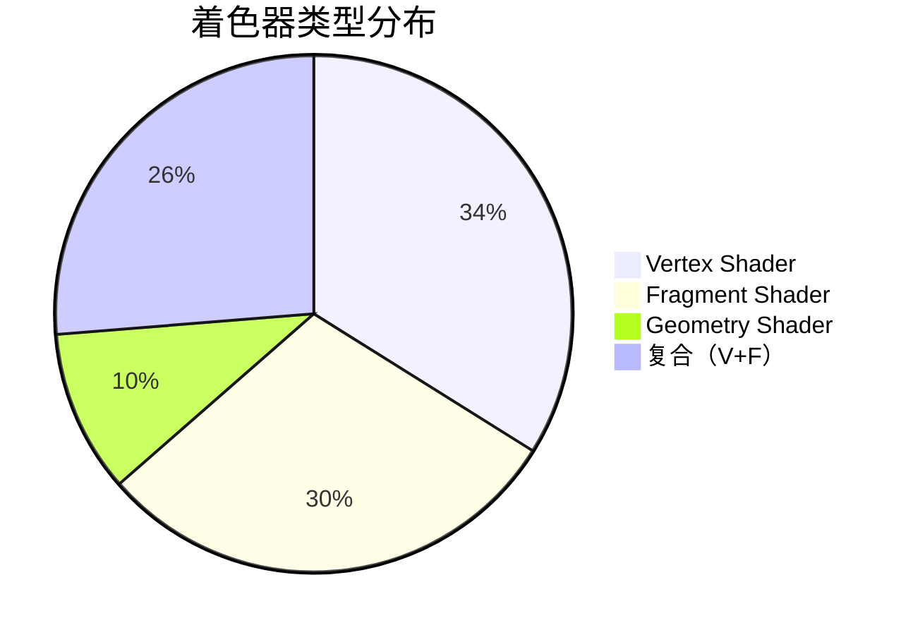
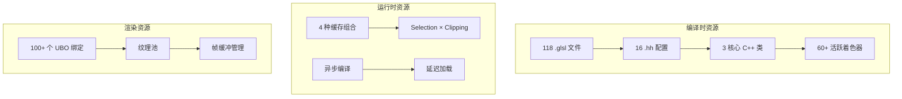

# Blender Overlay 引擎 GLSL 文件概述与架构分析

## 目录
- [1. 系统概述](#1-系统概述)
- [2. 目录结构](#2-目录结构)
- [3. 文件分类](#3-文件分类)
  - [3.1. 编辑模式着色器 (26个)](#31-编辑模式着色器-26个)
  - [3.2. 骨骼着色器 (18个)](#32-骨骼着色器-18个)
  - [3.3. 绘制模式着色器 (10个)](#33-绘制模式着色器-10个)
  - [3.4. 辅助功能着色器 (11个)](#34-辅助功能着色器-11个)
- [4. 核心架构组件](#4-核心架构组件)
  - [4.1. ShaderModule 类](#41-shadermodule-类)
  - [4.2. 创建信息系统](#42-创建信息系统)
  - [4.3. 变体机制](#43-变体机制)
- [5. 渲染管线](#5-渲染管线)
- [6. 关键文件详解](#6-关键文件详解)
- [7. 统计与分析](#7-统计与分析)

---

## 1. 系统概述

Blender Overlay 引擎是一个复杂的 GLSL 着色器系统，用于在 3D 视图中渲染各种辅助可视化效果，包括：
- 网格编辑可视化
- UV 编辑辅助线
- 骨骼变形显示
- 绘制模式覆盖
- 选择高亮
- 网格线框
- 等等...

**核心特点**：
- 118 个 GLSL 文件，总计 7,844 行代码
- 模块化设计，支持热重载
- 通过 C++ 的 `ShaderModule` 类统一管理
- 支持多种变体（选择、裁剪等）

---

## 2. 目录结构

```
source/blender/draw/engines/overlay/
├── shaders/                          # GLSL 着色器文件
│   ├── overlay_*.glsl                # 118 个主要着色器文件
│   └── infos/                        # 16 个着色器信息配置文件
│       ├── overlay_edit_mode_infos.hh       # 编辑模式最复杂（31,000+ 行）
│       ├── overlay_armature_infos.hh        # 骨骼系统
│       ├── overlay_paint_infos.hh           # 绘制模式
│       └── ... (其他配置文件)
│
├── overlay_private.hh                # ShaderModule 类定义
├── overlay_shader.cc                 # ShaderModule 实现
├── overlay_shader_shared.hh          # 共享数据结构和常量
├── overlay_instance.cc               # 主实例，整合系统
├── overlay_mesh.hh/.cc               # 网格相关渲染逻辑
├── overlay_armature.hh/.cc           # 骨骼相关渲染逻辑
└── ... (其他 20+ 个 C++ 文件)
```

---

## 3. 文件分类

### 3.1. 编辑模式着色器 (26个)

#### 网格编辑 (7个)
| 文件 | 功能 |
|------|------|
| `overlay_edit_mesh_vert.glsl` | 顶点/边缘/面显示（多模式） |
| `overlay_edit_mesh_edge.glsl` | 边缘渲染（几何着色器扩展） |
| `overlay_edit_mesh_facedot.glsl` | 面点显示 |
| `overlay_edit_mesh_analysis.glsl` | 网格分析（权重、统计等） |
| `overlay_edit_mesh_normal.glsl` | 法线显示 |
| `overlay_edit_mesh_depth.glsl` | 深度预绘制 |
| `overlay_edit_mesh_skin_root.glsl` | 皮肤根节点 |

#### UV 编辑 (8个)
| 文件 | 功能 |
|------|------|
| `overlay_edit_uv_edges.glsl` | UV 边显示 |
| `overlay_edit_uv_faces.glsl` | UV 面填充 |
| `overlay_edit_uv_verts.glsl` | UV 顶点 |
| `overlay_edit_uv_face_dots.glsl` | UV 面点 |
| `overlay_edit_uv_stretching.glsl` | UV 拉伸分析 |
| `overlay_edit_uv_tiled_image_borders.glsl` | 平铺图像边框 |
| `overlay_edit_uv_stencil_image.glsl` | UV 蒙版图像 |
| `overlay_edit_uv_mask_image.glsl` | UV 遮罩 |

#### 曲线编辑 (7个)
| 文件 | 功能 |
|------|------|
| `overlay_edit_curve_handle.glsl` | 贝塞尔曲线手柄 |
| `overlay_edit_curve_point.glsl` | 曲线点 |
| `overlay_edit_curve_wire.glsl` | 曲线线框 |
| `overlay_edit_curve_normals.glsl` | 曲线法线 |
| `overlay_edit_curves_handle.glsl` | 新曲线手柄 |
| `overlay_edit_curves_point.glsl` | 新曲线点 |

#### 其他编辑 (4个)
- `overlay_edit_lattice_*.glsl` - 晶格编辑 (2个)
- `overlay_edit_particle_*.glsl` - 粒子编辑 (2个)
- `overlay_edit_pointcloud_vert.glsl` - 点云编辑

---

### 3.2. 骨骼着色器 (18个)

| 类型 | 文件数量 | 示例 |
|------|---------|------|
| **球体形状** | 6 | `sphere_vert.glsl`, `sphere_solid.glsl`, `sphere_outline.glsl` |
| **包络骨** | 3 | `envelope_solid.glsl`, `envelope_outline.glsl` |
| **形状骨** | 4 | `shape_wire.glsl`, `shape_solid.glsl` |
| **棍状骨** | 2 | `stick_vert.glsl`, `stick_geom.glsl` |
| **线框渲染** | 2 | `wire_vert.glsl`, `wire_frag.glsl` |
| **自由度** | 2 | `dof_vert.glsl`, `dof_frag.glsl` |

**特点**：骨骼着色器大量使用**几何着色器**生成形状（如球体、包络形状）。

---

### 3.3. 绘制模式着色器 (10个)

| 模式 | 文件 | 功能 |
|------|------|------|
| **纹理绘制** | `paint_texture_*.glsl` | 纹理覆盖显示 |
| **权重绘制** | `paint_weight_*.glsl` | 权重颜色映射 |
| **顶点/面绘制** | `paint_point/face/wire.glsl` | 绘制区域高亮 |

**特点**：权重绘制使用**颜色渐变纹理** `weight_ramp_tx` 映射权重值。

---

### 3.4 辅助功能着色器 (11个)

| 功能 | 文件 | 描述 |
|------|------|------|
| **轮廓检测** | `overlay_outline_*.glsl` (8个) | 边缘轮廓检测和预绘制 |
| **额外形状** | `overlay_extra_*.glsl` (7个) | 网格、点、线等辅助形状 |
| **深度** | `overlay_depth_only_*.glsl` (5个) | 深度写入，无颜色输出 |
| **模糊/淡出** | `overlay_xray_fade.glsl`, `overlay_facing_*.glsl` | X-Ray 淡出效果 |

---

### 3.5. 库与通用文件 (10个)

| 文件 | 功能 |
|------|------|
| `overlay_common_lib.glsl` | 通用工具函数（矩阵解包、线数据打包等） |
| `overlay_edit_mesh_common_lib.glsl` | 网格编辑颜色计算函数 |
| `overlay_varying_color.glsl` | 变量颜色片段着色器 |
| `overlay_uniform_color_frag.glsl` | 统一颜色片段着色器 |
| `overlay_point_varying_color_frag.glsl` | 点着色片段 |
| `overlay_antialiasing_frag.glsl` | 抗锯齿处理 |
| `overlay_depth_only_*.glsl` | 深度-only 着色器系列 |

---

## 4. 核心架构组件

### 4.1. ShaderModule 类

**定义位置**: `source/blender/draw/engines/overlay/overlay_private.hh:428-576`

```cpp
namespace blender::draw::overlay {

using StaticShader = gpu::StaticShader;

class ShaderModule {
private:
    // 静态缓存：4 种组合
    // [Selection Enabled][Clipping Enabled]
    using StaticCache = gpu::StaticShaderCache<ShaderModule>[2][2];

    static StaticCache& get_static_cache() {
        static StaticCache static_cache;
        return static_cache;
    }

    const SelectionType selection_type_;  // 选择类型
    const bool clipping_enabled_;         // 是否启用裁剪

public:
    // === 着色器定义（60+ 个） ===

    // 基础着色器
    StaticShader anti_aliasing = {"overlay_antialiasing"};
    StaticShader background_fill = {"overlay_background"};

    // 编辑模式
    StaticShader mesh_edit_vert = shader_clippable("overlay_edit_mesh_vert");
    StaticShader mesh_edit_edge = shader_clippable("overlay_edit_mesh_edge");
    StaticShader mesh_edit_face = shader_clippable("overlay_edit_mesh_face");

    // 骨骼系统（大量使用 shader_selectable）
    StaticShader armature_wire = shader_selectable("overlay_armature_wire");
    StaticShader armature_sphere_fill = shader_selectable("overlay_armature_sphere_solid");
    StaticShader armature_stick = shader_selectable("overlay_armature_stick");

    // 绘制模式
    StaticShader paint_weight = shader_clippable("overlay_paint_weight");
    StaticShader paint_texture = shader_clippable("overlay_paint_texture");

    // 选择性着色器（用于对象选取）
    StaticShader extra_shape = shader_selectable("overlay_extra");
    StaticShader wireframe_mesh = shader_selectable("overlay_wireframe");

    // === 核心方法 ===

    // 获取模块实例（单例模式）
    static ShaderModule& module_get(SelectionType selection_type, bool clipping_enabled) {
        return get_static_cache()[int(selection_type)][int(clipping_enabled)]
               .get(selection_type, clipping_enabled);
    }

    // 释放所有着色器
    static void module_free();

    // 变体构造函数（私有）
private:
    ShaderModule(const SelectionType selection_type, const bool clipping_enabled)
        : selection_type_(selection_type), clipping_enabled_(clipping_enabled) {}

    // 变体辅助函数
    StaticShader shader_clippable(const char* create_info_name);
    StaticShader shader_selectable(const char* create_info_name);
    StaticShader shader_selectable_no_clip(const char* create_info_name);
};
```

**关键设计模式**：
- **单例模式**: `get_static_cache()` 全局共享
- **变体模式**: 通过参数生成不同版本的着色器
- **延迟编译**: `ensure_compile_async()` 异步编译

---

### 4.2. 变体辅助函数实现

**定义位置**: `source/blender/draw/engines/overlay/overlay_shader.cc`

```cpp
// 根据裁剪状态返回对应着色器名
StaticShader ShaderModule::shader_clippable(const char* create_info_name) {
    if (clipping_enabled_) {
        std::string clipped_name = std::string(create_info_name) + "_clipped";
        return StaticShader(clipped_name.c_str());
    }
    return StaticShader(create_info_name);
}

// 可选 + 可裁剪
StaticShader ShaderModule::shader_selectable(const char* create_info_name) {
    std::string name = std::string(create_info_name);
    if (selection_type_ != SelectionType::DISABLED) {
        name += "_selectable";
    }
    if (clipping_enabled_) {
        name += "_clipped";
    }
    return StaticShader(name.c_str());
}
```

**实际生成的着色器名**：
```cpp
// Original: "overlay_edit_mesh_vert"
// + Clipping enabled: "overlay_edit_mesh_vert_clipped"
// + Selection enabled: "overlay_edit_mesh_vert_selectable"
// + Both + Clipping: "overlay_edit_mesh_vert_selectable_clipped"
```

---

### 4.3. 创建信息系统（Info System）

**这是 Blender GLSL 的核心机制！**

```cpp
// 在 .hh 文件中定义（overlay_edit_mode_infos.hh）
GPU_SHADER_CREATE_INFO(overlay_edit_mesh_vert)
    .do_static_compilation(true)           // 预编译优化
    .define("VERT")                        // 条件编译宏
    .vertex_in(0, float3, pos)            // 顶点输入布局
    .vertex_in(1, uint4, data)
    .vertex_in(2, float3, vnor)
    .vertex_source("overlay_edit_mesh_vert.glsl")   // 顶点着色器文件
    .fragment_source("overlay_point_varying_color_frag.glsl")  // 片段着色器文件
    .additional_info("overlay_edit_mesh_common")  // 继承通用配置
    .additional_info("draw_view")                 // 视图变换库
    .additional_info("draw_modelmat")             // 模型矩阵
    .additional_info("draw_globals")              // 全局数据
GPU_SHADER_CREATE_END()

// 创建变体
CREATE_INFO_VARIANT(overlay_edit_mesh_vert_clipped, overlay_edit_mesh_vert, drw_clipped)
```

**C++ 与 GLSL 的桥梁**：
- `.vertex_in()` → `layout(location = N) in vec3 pos;`
- `.push_constant()` → `uniform float alpha;`
- `.additional_info()` → `#include "draw_view_lib.glsl"`

---

## 5. 渲染管线

### 完整流程

```mermaid
graph TD
    subgraph "C++ 初始化阶段"
        A[Resources::init] --> B[获取 ShaderModule]
        B --> C[异步编译所有 shader]
        C --> D[ShaderModule::module_get]
    end

    subgraph "渲染循环 - 同步阶段"
        E[Instance::begin_sync] --> F[设置 Pass 着色器]
        F --> G[绑定 UBO/纹理]
        G --> H[设置推送常量]
    end

    subgraph "渲染循环 - 绘制阶段"
        I[Pass::draw] --> J[绑定几何体]
        J --> K[GPU 执行绘制]
    end

    subgraph "GLSL 执行"
        L[Vertex Shader: main()] --> M[坐标变换]
        M --> N[光照/颜色计算]
        N --> O[输出到片段]
        P[Fragment Shader: main()] --> Q[颜色输出]
    end

    D --> E
    H --> I
    K --> L
    O --> P
```

---

### 代码示例：C++ 调用链

**定义位置**: `source/blender/draw/engines/overlay/overlay_mesh.hh`

```cpp
class Meshes : public Overlay {
    PassSimple edit_mesh_edges_ps_ = {"Edges"};
    PassSimple edit_mesh_faces_ps_ = {"Faces"};

    void begin_sync(Resources &res, const State &state) {
        // 1. 设置着色器（从 ShaderModule 获取）
        edit_mesh_edges_ps_.shader_set(res.shaders->mesh_edit_edge.get());

        // 2. 绑定 UBO (Uniform Buffer Objects)
        edit_mesh_edges_ps_.bind_ubo(OVERLAY_GLOBALS_SLOT, &res.globals_buf);
        edit_mesh_edges_ps_.bind_ubo(DRW_CLIPPING_UBO_SLOT, &res.clip_planes_buf);

        // 3. 绑定纹理
        edit_mesh_edges_ps_.bind_texture("depth_tx", res.depth_tx);

        // 4. 设置推送常量
        edit_mesh_edges_ps_.push_constant("alpha", backwire_opacity);
        edit_mesh_edges_ps_.push_constant("do_smooth_wire", do_smooth_wire);
        edit_mesh_edges_ps_.push_constant("data_mask", int4(mask));
    }

    void edit_object_sync(Manager &manager, const ObjectRef &ob_ref) {
        // 获取几何体数据
        gpu::Batch *geom = DRW_mesh_batch_cache_get_edit_edges(mesh);

        // 5. 绘制（触发 GPU 调用）
        edit_mesh_edges_ps_.draw_expand(geom, GPU_PRIM_TRIS, 2, 1, res_handle);
    }
};
```

### GLSL 内的实际 uniform（对应 C++ 代码）

```glsl
// overlay_edit_mesh_edge.glsl 通过 .additional_info() 继承
#include "infos/overlay_edit_mode_infos.hh"

// 来自 overlay_edit_mesh_common
uniform sampler2D depth_tx;    // C++: bind_texture("depth_tx", ...)
uniform float alpha;           // C++: push_constant("alpha", ...)
uniform int4 data_mask;        // C++: push_constant("data_mask", ...)

// 来自 draw_view
uniform mat4 ModelMatrix;      // 模型矩阵
uniform mat4 ViewMatrix;       // 视图矩阵
uniform mat4 ProjectionMatrix; // 投影矩阵
```

---

## 6. 关键文件详解

### 6.1. overlay_private.hh (核心定义)

**功能**: `ShaderModule` 类定义和 `Resources` 结构

```cpp
// ===== ShaderModule =====
class ShaderModule {
    // 见 4.1 节
};

// ===== Resources (资源管理器) =====
struct Resources : public select::SelectMap {
    ShaderModule *shaders = nullptr;  // 指向着色器模块

    // 帧缓冲
    Framebuffer overlay_fb = {"overlay_fb"};
    Framebuffer overlay_line_fb = {"overlay_line_fb"};

    // 纹理
    TextureRef depth_tx;           // 深度纹理引用
    TextureFromPool line_tx = {"line_tx"};  // 线数据纹理

    // Uniform 缓冲
    draw::UniformBuffer<UniformData> globals_buf;  // 主题数据
    draw::UniformArrayBuffer<float4, 6> clip_planes_buf;  // 裁剪平面

    // 方法
    void init(bool clipping_enabled) {
        shaders = &ShaderModule::module_get(selection_type, clipping_enabled);
        // 异步编译...
        shaders->mesh_edit_vert.ensure_compile_async();
    }

    void acquire(const DRWContext *ctx, const State &state);  // 获取纹理
};
```

### 6.2. overlay_shader_shared.hh (数据结构)

**功能**: C++ 和 GLSL 共享的数据结构定义

```cpp
// ===== 主题颜色结构 =====
struct ThemeColors {
    float4 wire;               // 普通线框
    float4 wire_edit;          // 编辑模式线框
    float4 vertex;             // 顶点颜色
    float4 edge_select;        // 边缘选中
    float4 face_select;        // 面选中
    float4 edit_mesh_active;   // 活动元素
    // ... 64 个颜色定义
};

// ===== Uniform 数据 =====
struct UniformData {
    ThemeColors colors;
    float sizes[20];           // 各种尺寸
    float fresnel_mix_edit;    // 菲涅尔混合因子
    // ... 292 个 float
};

// ===== 实例数据 =====
struct BoneInstanceData {
    float4x4 mat44;            // 变换矩阵
    float color_a, color_b;    // 颜色（编码为 float）
    float hint_a, hint_b;      // 提示颜色
};

// ===== 网格数据打包 =====
struct VertexData {
    float4 pos;                // 位置
    float4 color;              // 颜色
};
```

**GLSL 对应**:
```glsl
// GLSL 中通过 Include 自动获取
layout(std140, binding = 0) uniform UniformData {
    ThemeColors colors;
    float sizes[20];
    float fresnel_mix_edit;
} theme;
```

### 6.3. overlay_edit_mode_infos.hh (最复杂的配置文件)

**规模**: ~31,000 行代码

**定义位置**: `source/blender/draw/engines/overlay/shaders/infos/`

```cpp
// ===== 1. 接口定义 =====
GPU_SHADER_INTERFACE_INFO(overlay_edit_mesh_vert_iface)
    SMOOTH(float4, final_color)      // 平滑插值颜色
    SMOOTH(float, vertex_crease)     // 顶点折痕
GPU_SHADER_INTERFACE_END()

// ===== 2. 通用配置 =====
GPU_SHADER_CREATE_INFO(overlay_edit_mesh_common)
    // 输出配置
    FRAGMENT_OUT(0, float4, frag_color)
    FRAGMENT_OUT(1, float4, line_output)  // 双输出（颜色 + 线数据）

    // 推送常量
    PUSH_CONSTANT(float, alpha)
    PUSH_CONSTANT(float, retopology_offset)
    PUSH_CONSTANT(int4, data_mask)
    PUSH_CONSTANT(bool, select_edge)

    // 采样器
    SAMPLER(0, sampler2DDepth, depth_tx)

    // 继承库
    ADITIONAL_INFO(draw_globals)
GPU_SHADER_CREATE_END()

// ===== 3. 具体着色器定义 =====
GPU_SHADER_CREATE_INFO(overlay_edit_mesh_vert)
    DO_STATIC_COMPILATION()  // 预编译
    .define("VERT")          // 宏定义用于条件编译
    .vertex_in(0, float3, pos)
    .vertex_in(1, uint4, data)
    .vertex_in(2, float3, vnor)
    .vertex_source("overlay_edit_mesh_vert.glsl")
    .fragment_source("overlay_point_varying_color_frag.glsl")
    .additional_info("overlay_edit_mesh_common")
    .additional_info("draw_view")
    .additional_info("draw_modelmat")
GPU_SHADER_CREATE_END()

// ===== 4. 变体定义 =====
CREATE_INFO_VARIANT(overlay_edit_mesh_vert_clipped,
                    overlay_edit_mesh_vert,
                    drw_clipped)
```

---

## 7. 统计与分析

### 7.1. 文件数量统计

| 类别 | 文件数 | 占比 | 典型特征 |
|------|--------|------|----------|
| **编辑模式** | 26 | 22% | 主体功能，使用几何着色器 |
| **骨骼系统** | 18 | 15% | 大量变体，使用实例渲染 |
| **绘制模式** | 10 | 8% | 基于纹理的覆盖显示 |
| **轮廓/深度** | 13 | 11% | 后处理效果 |
| **辅助形状** | 11 | 9% | 几何生成 |
| **库/通用** | 10 | 8% | 可复用函数 |
| **其他** | 30 | 25% | 各种专用着色器 |

### 7.2. 着色器类型分布



### 7.3. 代码复杂度分析

**最复杂文件**:
1. `overlay_edit_mode_infos.hh` - 31,000+ 行（配置定义）
2. `overlay_edit_mesh_common_lib.glsl` - 102 行（核心逻辑）
3. `overlay_edit_mesh_vert.glsl` - 126 行（多功能顶点着色器）

**最少依赖**:
- `overlay_uniform_color_frag.glsl` - 简单纯色输出
- `overlay_depth_only_*.glsl` - 仅深度写入

**最复杂逻辑**:
- `overlay_edit_mesh_vert.glsl` - 使用 `#ifdef` 分支处理 VERT/EDGE/FACE/FACEDOT 四种模式
- `overlay_armature_sphere_*.glsl` - 几何着色器生成球体

---

## 8. 使用统计

### 8.1. 资源消耗



### 8.2. 变体组合

每个可变着色器可能有：
- **基础**: 1 种
- **+裁剪**: +1 种（2种总计）
- **+选择**: +1 种（2种总计）
- **+裁剪+选择**: +1 种（4种总计）

**典型情况**：
- 网格编辑：4 种变体
- 骨骼：4 种变体
- 辅助形状：2-4 种变体
- 背景：1 种变体（无裁剪/选择需求）

---

## 9. 核心设计理念

### 9.1. 模块化设计

```
(ShaderModule) → (Shader Info) → (GLSL Include) → (实际源码)
      ↓                  ↓                 ↓
  C++ 管理         配置声明          库函数复用
```

### 9.2. 数据驱动

- **C++**: 数据准备、状态管理
- **Info**: 着色器管线定义
- **GLSL**: 实际算法实现

### 9.3. 性能优化

1. **异步编译**: `ensure_compile_async()` - 不阻塞主线程
2. **静态编译**: `DO_STATIC_COMPILATION()` - 预编译优化
3. **缓存复用**: `StaticShaderCache` - 跨实例共享
4. **变体最小化**: 只编译实际需要的变体

---

## 10. 快速索引表

### 常用着色器快速查找

| 功能 | 着色器名 | C++ 类 | GLSL 文件 |
|------|---------|--------|----------|
| 编辑顶点 | `mesh_edit_vert` | `ShaderModule` | `overlay_edit_mesh_vert.glsl` |
| 编辑边缘 | `mesh_edit_edge` | `ShaderModule` | `overlay_edit_mesh_edge.glsl` |
| 骨骼线框 | `armature_wire` | `ShaderModule` | `overlay_armature_wire_vert.glsl` |
| 权重绘制 | `paint_weight` | `ShaderModule` | `overlay_paint_weight_vert.glsl` |
| 轮廓检测 | `outline_detect` | `ShaderModule` | `overlay_outline_detect.glsl` |
| 网格线框 | `wireframe_mesh` | `ShaderModule` | `overlay_wireframe_vert.glsl` |

---

**文档用途**: 作为深入学习 Blender overlay GLSL 系统的入口文档

**下一步学习**:
1. 阅读 `overlay_edit_mesh_vert.glsl` 理解多功能着色器
2. 分析 `overlay_private.hh` 的 `Resources::init()` 流程
3. 查看 `overlay_edit_mode_infos.hh` 的定义语法

---
**文档版本**: 1.0
**基于**: Blender 4.3 源码
**创建时间**: 2025-12-17
