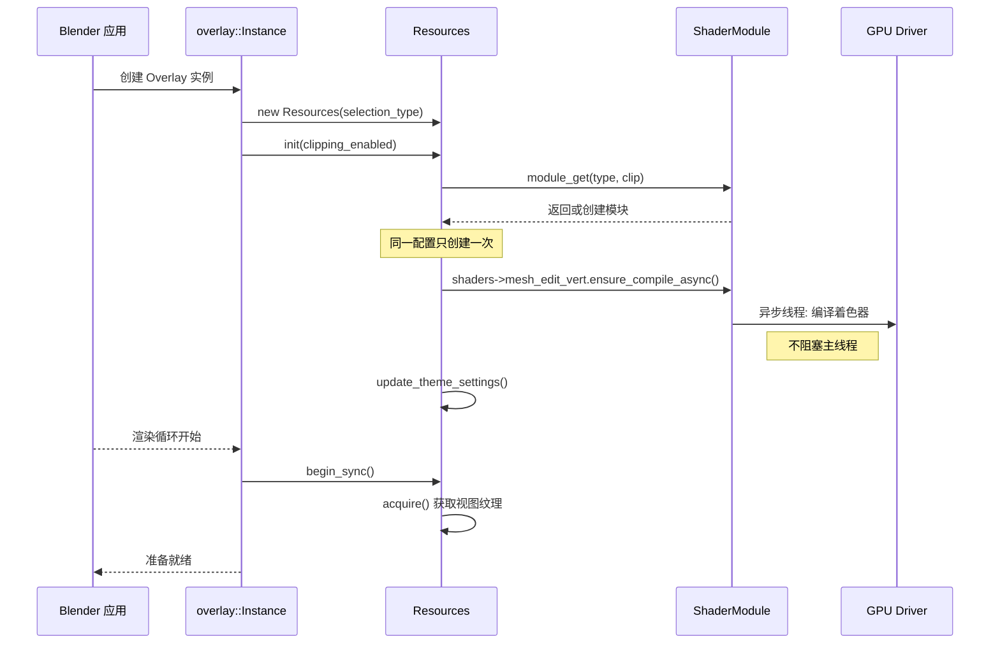
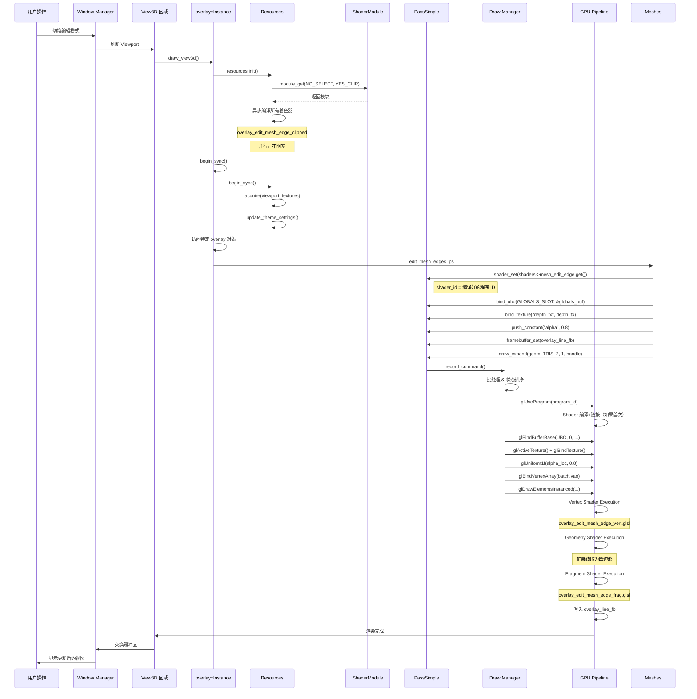

# C++ 与 GLSL 的调用机制详解

## 目录
- [1. 调用机制概述](#1-调用机制概述)
- [2. ShaderModule 核心类](#2-shadermodule-核心类)
  - [2.1. 类定义与结构](#21-类定义与结构)
  - [2.2. 变体生成方法](#22-变体生成方法)
  - [2.3. 静态缓存系统](#23-静态缓存系统)
- [3. Resources 资源管理器](#3-resources-资源管理器)
  - [3.1. 初始化流程](#31-初始化流程)
  - [3.2. 纹理与缓冲区管理](#32-纹理与缓冲区管理)
- [4. 渲染管线流程](#4-渲染管线流程)
  - [4.1. C++ 侧准备](#41-c-侧准备)
  - [4.2. GPU 执行](#42-gpu-执行)
- [5. 数据绑定机制](#5-数据绑定机制)
  - [5.1. Uniform Buffer Objects](#51-uniform-buffer-objects)
  - [5.2. Textures 和 Samplers](#52-textures-和-samplers)
  - [5.3. Push Constants](#53-push-constants)
  - [5.4. Storage Buffers](#54-storage-buffers)
- [6. 完整调用链示例](#6-完整调用链示例)
- [7. 着色器信息配置系统](#7-着色器信息配置系统)
- [8. 实战：追踪一个像素的渲染](#8-实战追踪一个像素的渲染)

---

## 1. 调用机制概述

Blender Overlay 引擎的调用机制是一个**多层抽象系统**：

```
C++ 用户代码 (edit_mesh.cc)
    ↓
PassSimple/PassSimple::Sub (命令缓冲区)
    ↓
draw_manager (GPU 抽象层)
    ↓
GPU Shader (OpenGL/Vulkan/Metal)
    ↓
GPU 执行并输出到 Framebuffer
```

**核心特点**：
1. **延迟执行**: 所有绘制命令先记录，再批量执行
2. **缓存复用**: ShaderModule 跨帧复用已编译着色器
3. **变体驱动**: 通过配置生成不同版本的着色器
4. **数据驱动**: Shader Info 系统定义管道布局

---

## 2. ShaderModule 核心类

### 2.1. 类定义与结构

**定义位置**: `source/blender/draw/engines/overlay/overlay_private.hh:428-576`

```cpp
namespace blender::draw::overlay {

using StaticShader = gpu::StaticShader;

class ShaderModule {
private:
    // ===== 静态缓存系统 =====
    // 4 种组合：[Selection Enabled][Clipping Enabled]
    using StaticCache = gpu::StaticShaderCache<ShaderModule>[2][2];

    static StaticCache& get_static_cache() {
        static StaticCache static_cache;
        return static_cache;
    }

    // ===== 实例状态 =====
    const SelectionType selection_type_;  // 选择类型枚举
    const bool clipping_enabled_;         // 是否启用裁剪平面

public:
    // ===== 构造与获取 =====
    static ShaderModule& module_get(SelectionType selection_type, bool clipping_enabled) {
        int selection_index = (selection_type == SelectionType::DISABLED) ? 0 : 1;
        return get_static_cache()[selection_index][clipping_enabled]
               .get(selection_type, clipping_enabled);
    }

    static void module_free() {
        for (int i = 0; i < 2; i++) {
            for (int j = 0; j < 2; j++) {
                get_static_cache()[i][j].release();
            }
        }
    }

private:
    // 私有构造：强制通过 module_get 获取实例
    ShaderModule(const SelectionType selection_type, const bool clipping_enabled)
        : selection_type_(selection_type), clipping_enabled_(clipping_enabled) {}

    // ===== 变体辅助方法 =====
    StaticShader shader_clippable(const char* create_info_name);
    StaticShader shader_selectable(const char* create_info_name);
    StaticShader shader_selectable_no_clip(const char* create_info_name);

    // ===== 正式声明所有着色器 =====
public:
    // 基础着色器
    StaticShader anti_aliasing = {"overlay_antialiasing"};
    StaticShader background_fill = {"overlay_background"};

    // 编辑模式（多变体）
    StaticShader mesh_edit_vert = shader_clippable("overlay_edit_mesh_vert");
    StaticShader mesh_edit_edge = shader_clippable("overlay_edit_mesh_edge");
    StaticShader mesh_edit_face = shader_clippable("overlay_edit_mesh_face");

    // 骨骼系统（使用 shader_selectable）
    StaticShader armature_wire = shader_selectable("overlay_armature_wire");
    StaticShader armature_sphere_fill = shader_selectable("overlay_armature_sphere_solid");

    // ... (60+ 个类似定义)
}; // class ShaderModule

} // namespace blender::draw::overlay
```

### 2.2. 变体生成方法实现

**定义位置**: `source/blender/draw/engines/overlay/overlay_shader.cc:13-48`

```cpp
// ===== 仅裁剪变体 =====
StaticShader ShaderModule::shader_clippable(const char *create_info_name) {
    std::string name = create_info_name;
    if (clipping_enabled_) {
        name += "_clipped";  // 附加后缀
    }
    return StaticShader(name.c_str());
}

// ===== 选择 + 裁剪变体 =====
StaticShader ShaderModule::shader_selectable(const char *create_info_name) {
    std::string name = create_info_name;

    // 选择变体（用于鼠标拾取）
    if (selection_type_ != SelectionType::DISABLED) {
        name += "_selectable";
    }

    // 裁剪变体
    if (clipping_enabled_) {
        name += "_clipped";
    }

    return StaticShader(name.c_str());
}

// ===== 仅选择变体（无裁剪支持） =====
StaticShader ShaderModule::shader_selectable_no_clip(const char *create_info_name) {
    std::string name = create_info_name;
    if (selection_type_ != SelectionType::DISABLED) {
        name += "_selectable";
    }
    return StaticShader(name.c_str());
}
```

**实际应用示例**：

| C++ 代码 | 条件 | 生成的实际着色器名 |
|---------|------|------------------|
| `mesh_edit_vert` | No selection, No clipping | `overlay_edit_mesh_vert` |
| `mesh_edit_vert` | No selection, Clipping | `overlay_edit_mesh_vert_clipped` |
| `mesh_edit_vert` | With selection, Clipping | `overlay_edit_mesh_vert_selectable_clipped` |
| `armature_wire` | With selection, No clipping | `overlay_armature_wire_selectable` |

### 2.3. 静态缓存系统详解

**底层实现**（在 `gpu_shader_create_info.hh` 中）：

```cpp
template<typename Module>
class StaticShaderCache {
private:
    // 缓存的键值：着色器名 -> 已编译程序
    Map<std::string, gpu::Shader*> shader_map;
    // 互斥锁（线程安全）
    Mutex mutex;

public:
    // 获取或创建着色器（懒加载）
    StaticShader& get(const char* name) {
        MutexGuard lock(mutex);

        // 检查缓存
        auto it = shader_map.find(name);
        if (it != shader_map.end()) {
            return it->second;
        }

        // 未找到，创建新着色器
        gpu::Shader* shader = GPU_shader_create_from_info_name(name);
        shader_map.add(name, shader);
        return shader;
    }

    // 异步编译（不阻塞）
    void ensure_compile_async(const char* name) {
        new std::thread([this, name]() {
            get(name);
        });
    }
};
```

**在 ShaderModule 中的使用**：

```cpp
// 通过 StaticShader 包装器间接使用
class StaticShader {
    const char* name;
    gpu::Shader* shader = nullptr;

public:
    // 首次获取时编译
    gpu::Shader* get() {
        if (!shader) {
            shader = gpu::shader_cache.get(name);
        }
        return shader;
    }

    // 异步编译（Resources::init 中使用）
    void ensure_compile_async() {
        gpu::shader_cache.ensure_compile_async(name);
    }
};
```

---

## 3. Resources 资源管理器

### 3.1. 初始化流程

**定义位置**: `source/blender/draw/engines/overlay/overlay_private.hh:588-978`

```cpp
struct Resources : public select::SelectMap {
    ShaderModule *shaders = nullptr;

    // 帧缓冲
    Framebuffer overlay_fb = {"overlay_fb"};
    Framebuffer overlay_line_fb = {"overlay_line_fb"};
    Framebuffer overlay_in_front_fb = {"overlay_in_front_fb"};

    // 纹理
    TextureRef depth_tx;                    // 深度纹理引用
    TextureFromPool line_tx = {"line_tx"};  // 线数据纹理池
    TextureFromPool overlay_tx = {"overlay_tx"};  // 颜色纹理

    uniform::UniformBuffer<UniformData> globals_buf;  // 主题数据 UBO
    uniform::UniformArrayBuffer<float4, 6> clip_planes_buf;  // 裁剪平面

    // 实例化
    Resources(const SelectionType selection_type_, const ShapeCache &shapes_)
        : select::SelectMap(selection_type_), shapes(shapes_) {}

    // ===== 初始化方法 =====
    void init(bool clipping_enabled) {
        // 1. 获取 ShaderModule（单例）
        shaders = &ShaderModule::module_get(selection_type, clipping_enabled);

        // 2. 异步编译所有可能需要的着色器（60+ 个）
        shaders->anti_aliasing.ensure_compile_async();
        shaders->armature_wire.ensure_compile_async();
        shaders->mesh_edit_vert.ensure_compile_async();
        shaders->mesh_edit_edge.ensure_compile_async();
        // ... 全部 60+ 个

        // 3. 最后生成 UBO 数据
        update_theme_settings(nullptr, State());
    }

    // ===== 在帧开始时同步 =====
    void begin_sync(int clipping_plane_count) {
        SelectMap::begin_sync(clipping_plane_count);
        free_movieclips_textures();
    }

    // ===== 获取视图纹理 =====
    void acquire(const DRWContext *draw_ctx, const State &state) {
        // 从 Blender 渲染管线获取深度/颜色缓冲
        DefaultTextureList &viewport_textures = *draw_ctx->viewport_texture_list_get();
        this->depth_tx.wrap(viewport_textures.depth);

        // 为 X-Ray 模式分配独立深度缓冲
        if (state.xray_enabled) {
            this->xray_depth_tx.acquire(size, gpu::TextureFormat::SFLOAT_32_DEPTH_UINT_8);
            this->depth_target_tx.wrap(this->xray_depth_tx);
        }
    }
};
```

**完整初始化时序**：



### 3.2. 纹理与缓冲区管理

#### **统一缓冲区对象 (UBO)**

```cpp
// ===== UniformData (292个 float) =====
struct UniformData {
    ThemeColors colors;     // 64 个颜色
    float sizes[20];        // 各种尺寸参数
    float fresnel_mix_edit; // 菲涅尔因子
    // ... 共 292 float

    // C++ 到 GLSL 映射：
    // colors.edge_select  → uniform_buf.colors.edge_select
    // sizes[5]            → uniform_buf.sizes[5]
};

// 在 Resources 中
draw::UniformBuffer<UniformData> globals_buf;
UniformData &theme = globals_buf;  // 引用别名

// ===== C++ 绑定代码 =====
void overlay_mesh_edges_pass() {
    // 绑定 UBO 到槽位 0
    pass.bind_ubo(OVERLAY_GLOBALS_SLOT, &res.globals_buf);

    // 只需更新一次（或当主题改变时）
    res.globals_buf.push_update();
}

// ===== GLSL 对应代码 =====
// 在 draw_view_lib.glsl 或通用库中
layout(std140, binding = 0) uniform UniformData {
    ThemeColors colors;
    float sizes[20];
    float fresnel_mix_edit;
} uniform_buf;  // 实际使用的变量名

// 使用
float4 edge_col = uniform_buf.colors.edge_select;
```

#### **纹理绑定**

```cpp
// ===== C++ =====
void begin_sync() {
    // 绑定深度纹理到采样器 0
    pass.bind_texture("depth_tx", res.depth_tx);

    // 绑定颜色纹理到采样器 1
    pass.bind_texture("overlay_tx", res.overlay_tx);
}

// ===== GLSL =====
uniform sampler2D depth_tx;  // layout(location = 0)
uniform sampler2D overlay_tx; // layout(location = 1)

void main() {
    // 获取屏幕位置
    vec2 screen_uv = gl_FragCoord.xy / textureSize(depth_tx, 0).xy;

    // 采样深度
    float depth = texture(depth_tx, screen_uv).r;

    // 条件渲染逻辑
    if (gl_FragCoord.z > depth) {
        discard;
    }
}
```

---

## 4. 渲染管线流程

### 4.1. C++ 侧准备

**完整流程示例**（网格编辑边缘渲染）：

```cpp
// ===== overlay_mesh.hh =====
class Meshes : public Overlay {
    PassSimple edit_mesh_edges_ps_ = {"Edges"};

    void begin_sync(Resources &res, const State &state) {
        // 步骤 1: 设置着色器
        // ShaderModule 变体逻辑：
        // - res.shaders->mesh_edit_edge 可能返回:
        //   "overlay_edit_mesh_edge" 或 "overlay_edit_mesh_edge_clipped"
        edit_mesh_edges_ps_.shader_set(res.shaders->mesh_edit_edge.get());

        // 步骤 2: 绑定 UBO
        edit_mesh_edges_ps_.bind_ubo(
            DRW_GLOBALS_UBO_SLOT,      // 槽位定义在 draw_defines.h
            &res.globals_buf
        );

        // 步骤 3: 绑定裁剪平面
        edit_mesh_edges_ps_.bind_ubo(
            DRW_CLIPPING_UBO_SLOT,
            &res.clip_planes_buf
        );

        // 步骤 4: 绑定纹理
        edit_mesh_edges_ps_.bind_texture("depth_tx", res.depth_tx);

        // 步骤 5: 设置推送常量
        edit_mesh_edges_ps_.push_constant("alpha", state.overlay.wireframe_alpha);
        edit_mesh_edges_ps_.push_constant("do_smooth_wire",
            (state.overlay.wireframe_mode == V3D_WIREFRAME_SMOOTH));
        edit_mesh_edges_ps_.push_constant("data_mask", int4(0xFFFF, 0xFFFF, 0xFFFF, 0xFFFF));

        // 步骤 6: 设置帧缓冲
        if (is_in_front) {
            edit_mesh_edges_ps_.framebuffer_set(res.overlay_in_front_fb);
        } else {
            edit_mesh_edges_ps_.framebuffer_set(res.overlay_line_fb);
        }
    }

    void edit_object_sync(Manager &manager, const ObjectRef &ob_ref, Resources &res) {
        // 获取几何体数据
        // 这里的 batch 包含了实际的顶点缓冲
        gpu::Batch *geom = DRW_mesh_batch_cache_get_edit_edges(mesh);

        // 绑定选择缓冲区（如果支持）
        res.select_bind(edit_mesh_edges_ps_);

        // 步骤 7: 绘制命令
        // 参数：几何体，图元类型，扩张系数，实例数，资源句柄
        edit_mesh_edges_ps_.draw_expand(
            geom,              // gpu::Batch 几何体
            GPU_PRIM_TRIS,     // 输出三角形
            2,                 // 每个边 -> 2 个三角形
            1,                 // 1 次实例
            res_handle         // 对象变换句柄
        );
    }
};
```

**draw_expand 做了什么**？

```cpp
void PassSimple::Sub::draw_expand(gpu::Batch* geom, GPUPrimType out_prim,
                                  uint expand_len, uint instances, ResourceHandle handle) {
    // 1. 将命令写入指令缓冲
    buf.draw_expand(geom, out_prim, expand_len, instances, handle);

    // 2. 记录用于后续批处理和执行
    record_draw_call(geom, out_prim, expand_len, instances);
}
```

### 4.2. GPU 执行

**PassSimple → GPU**：

```mermaid
graph TD
    subgraph "C++ PassSimple"
        A[shader_set()] --> B[bind_ubo()]
        B --> C[bind_texture()]
        C --> D[push_constant()]
        D --> E[framebuffer_set()]
        E --> F[draw_expand()]
    end

    subgraph "GPU Draw Manager"
        F --> G[记录 Draw Command]
        G --> H[状态绑定]
        H --> I[Draw Call 发射]
    end

    subgraph "GPU Shader Exec"
        I --> J[Vertex Shader]
        J --> K[Geometry Shader]
        K --> L[Fragment Shader]
        L --> M[Framebuffer 输出]
    end
```

**实际的 Draw Call 序列**：

```
C++ 侧：
Resources::init() → 异步编译 60+ 着色器
    ↓
Instance::draw() → PassSimple::draw()
    ↓
Command buffer: shader_bind + ubo_bind + texture_bind + draw_call
    ↓
GPU 驱动：
glUseProgram(program_id)           // 绑定程序
glBindBufferBase(GL_UNIFORM_BUFFER, 0, ubo_id)  // 绑定 UBO
glActiveTexture(GL_TEXTURE0); glBindTexture(GL_TEXTURE_2D, tex_id)  // 绑定纹理
glUniform1f(alpha_loc, 0.5f)      // 设置推送常量
glBindVertexArray(vao_id)          // 绑定几何体
glDrawElementsInstanced(...)       // 实际绘制
```

---

## 5. 数据绑定机制

### 5.1. Uniform Buffer Objects (UBO)

**Blender 的 UBO 布局**：

```cpp
// ===== C++ 结构 =====
struct UniformData {
    ThemeColors colors;  // 嵌套结构
    float sizes[20];
    // ...
};

struct ThemeColors {
    float4 wire;             // offset 0
    float4 vertex;           // offset 16
    float4 select;           // offset 32
    // ... (std140 布局，每个 float4 对齐到 16 字节)
};

// ===== GLSL 等价 =====
layout(std140, binding = 0) uniform UniformData {
    vec4 wire;      // colors.wire
    vec4 vertex;    // colors.vertex
    vec4 select;    // colors.select
    float sizes[20];
    float fresnel_mix_edit;
    // ...
} uniform_buf;

// 使用
vec4 col = uniform_buf.wire;
float edge_size = uniform_buf.sizes[3];
```

**数据对齐规则** (std140)：
```cpp
// 16 字节对齐
vec2 a;  // 占用 16 字节（只用前 8 字节）
vec4 b;  // 占用 16 字节

// 数组的每个元素对齐到 16 字节
float arr[4];  // 实际占用：4×16 = 64 字节

// 结构体对齐到成员的最大对齐值
struct Light {
    vec3 pos;   // vec3 对齐到 16 字节
    float i;    // 总大小：32 字节
};
```

**在 Resources 中更新数据**：

```cpp
void Resources::update_theme_settings(const DRWContext *ctx, const State &state) {
    // 获取当前主题
    const uiTheme *theme = UI_GetTheme();

    // 填充 UBO
    UniformData &data = globals_buf.cpu_data;
    data.colors.wire = float4_from_uchar4(theme->wire);
    data.colors.vertex = float4_from_uchar4(theme->vertex);
    data.colors.edge_select = float4_from_uchar4(theme->select);
    data.sizes[0] = (float)theme->vertex_size;
    data.sizes[3] = (float)theme->edge_size;

    // 上传到 GPU
    globals_buf.push_update();
}
```

### 5.2. Textures 和 Samplers

**纹理绑定槽位**（Blender 约定）：

```cpp
// Sampler 位置映射（硬编码在 shader info 中）
SAMPLER(0, sampler2DDepth, depth_tx)          // location = 0
SAMPLER(1, sampler2D, overlay_tx)             // location = 1
SAMPLER(2, sampler2D, weight_ramp_tx)         // location = 2
```

**C++ 绑定代码**：

```cpp
void PassSimple::Sub::bind_texture(const char* name, TextureRef texture) {
    // 名称 -> 采样器位置
    int slot = shader_info.get_sampler_slot(name);

    glActiveTexture(GL_TEXTURE0 + slot);
    glBindTexture(GL_TEXTURE_2D, texture.handle);

    // 记录到命令缓冲
    cmd_buffer.bind_texture(slot, texture);
}
```

**纹理获取流程**：

```cpp
void Resources::acquire(const DRWContext *draw_ctx, const State &state) {
    // 从 Blender 渲染管线获取
    DefaultTextureList &viewport_textures = *draw_ctx->viewport_texture_list_get();

    // 包装为引用（不复制数据）
    depth_tx.wrap(viewport_textures.depth);
    overlay_tx.wrap(viewport_textures.color_overlay);

    // 如果某些情况不可用
    if (!depth_tx.is_valid()) {
        // 使用 1x1 虚拟纹理
        depth_tx.wrap(dummy_depth_tx);
    }
}
```

**GLSL 使用**：

```glsl
uniform sampler2D depth_tx;

void main() {
    // OpenGL 自动处理纹理坐标和采样
    float depth = texture(depth_tx, gl_FragCoord.xy / textureSize(depth_tx, 0)).r;

    // 高级采样
    float4 depths = textureGather(depth_tx, uv);  // 采集 2x2 邻域
}
```

### 5.3. Push Constants

**推送常量**（现代 GPU 用，模拟旧 uniform）：

```cpp
// ===== C++ =====
void PassSimple::Sub::push_constant(const char* name, float value) {
    int location = shader_info.get_push_constant_location(name);
    if (location >= 0) {
        glProgramUniform1f(program_id, location, value);
    }
}

// 用法
pass.push_constant("alpha", 0.5f);
pass.push_constant("do_smooth_wire", true);
pass.push_constant("data_mask", int4(0xFF, 0xFF, 0x0F, 0x00));

// ===== GLSL =====
PUSH_CONSTANT(float, alpha);              // 生成 uniform float alpha;
PUSH_CONSTANT(bool, do_smooth_wire);
PUSH_CONSTANT(int4, data_mask);

void main() {
    vec4 m_data = data & data_mask;       // 使用
    float a = alpha;                      // 使用

    if (do_smooth_wire) {
        // 抗锯齿逻辑
    }
}
```

**Push Constant vs UBO**：
- **Push Constant**: 适合小数据（< 128 字节），每个 draw call 可变
- **UBO**: 适合大数据（几KB），每帧更新一次

### 5.4. Storage Buffers (SSBO)

**用于大型数据缓冲**（如顶点拉取）：

```cpp
// ===== C++ (Vertex Pulling) =====
class Meshes {
    StorageVectorBuffer<float> pos_buf;  // 顶点位置数据
    StorageVectorBuffer<uint> data_buf;  // 选择/标记数据

    void sync() {
        // 上传到 GPU
        pos_buf.push_update();
        data_buf.push_update();

        // 绑定到 Shader
        pass.bind_ssbo("pos_buf", &pos_buf);
        pass.bind_ssbo("data_buf", &data_buf);
    }
};

// ===== GLSL =====
layout(std430, binding = 0) buffer PosBuf {
    float pos[];  // 动态大小数组
} pos_buf;

layout(std430, binding = 1) buffer DataBuf {
    uint data[];
} data_buf;

void main() {
    // 直接从 GPU 内存读取（不经过顶点属性）
    uint vertex_id = gl_VertexID;
    vec3 position = pos_buf.pos[vertex_id * 3 + vec3(0,1,2)];
    uint4 data = data_buf.data[vertex_id];
}
```

---

## 6. 完整调用链示例

### 场景：渲染编辑模式边缘



---

## 7. 着色器信息配置系统

### 核心机制：GPU_SHADER_CREATE_INFO

**定义位置**: `source/blender/gpu/shaders/gpu_shader_create_info.hh`

```cpp
// ===== 宏定义系统 =====
#define GPU_SHADER_CREATE_INFO(name) \
    static gpu::shader::ShaderInfo __shader_info_##name = \
        gpu::shader::ShaderInfo(#name)

#define VERTEX_SHADER_CREATE_INFO(name) \
    GPU_SHADER_CREATE_INFO(name); \
    __shader_info_##name.set_vertex_only(true)

#define FRAGMENT_SHADER_CREATE_INFO(name) \
    GPU_SHADER_CREATE_INFO(name); \
    __shader_info_##name.set_fragment_only(true)

// ===== 链式配置 API =====
class ShaderInfo {
public:
    // 顶点输入
    ShaderInfo& vertex_in(int location, Type type, const char* name) {
        inputs_.push_back({location, type, name});
        return *this;
    }

    // 推送常量
    ShaderInfo& push_constant(const char* type, const char* name) {
        push_constants_.push_back({type, name});
        return *this;
    }

    // Uniform/采样器
    ShaderInfo& sampler(int binding, const char* type, const char* name) {
        samplers_.push_back({binding, type, name});
        return *this;
    }

    // 继承其他配置
    ShaderInfo& additional_info(const char* info_name) {
        additional_infos_.push_back(info_name);
        return *this;
    }

    // 宏定义
    ShaderInfo& define(const char* macro) {
        defines_.push_back(macro);
        return *this;
    }

    // 源文件
    ShaderInfo& vertex_source(const char* file) {
        vertex_file_ = file;
        return *this;
    }

    ShaderInfo& fragment_source(const char* file) {
        fragment_file_ = file;
        return *this;
    }

    ShaderInfo& geometry_source(const char* file) {
        geometry_file_ = file;
        return *this;
    }

    // 完成定义
    void GPU_SHADER_CREATE_END() {
        // 注册到全局表
        register_shader_info(this);
    }
};
```

### 实际使用示例

```cpp
// 在 overlay_edit_mode_infos.hh 中

// ===== 1. 接口定义 =====
GPU_SHADER_INTERFACE_INFO(overlay_edit_mesh_vert_iface)
    .smooth(float4, final_color)
    .smooth(float, vertex_crease)
.end()

// ===== 2. 通用配置 =====
GPU_SHADER_CREATE_INFO(overlay_edit_mesh_common)
    .push_constant(float, alpha)
    .push_constant(float, retopology_offset)
    .push_constant(int4, data_mask)
    .sampler(0, sampler2DDepth, depth_tx)
    .define("LINE_OUTPUT")
    .fragment_out(0, float4, frag_color)
    .fragment_out(1, float4, line_output)
    .additional_info("draw_globals")
.end()

// ===== 3. 完整着色器 =====
GPU_SHADER_CREATE_INFO(overlay_edit_mesh_vert)
    .do_static_compilation(true)  // 预编译
    .define("VERT")               // 条件编译宏
    .vertex_in(0, float3, pos)
    .vertex_in(1, uint4, data)
    .vertex_in(2, float3, vnor)
    .vertex_out(overlay_edit_mesh_vert_iface)
    .vertex_source("overlay_edit_mesh_vert.glsl")
    .fragment_source("overlay_point_varying_color_frag.glsl")
    .additional_info("overlay_edit_mesh_common")
    .additional_info("draw_view")
    .additional_info("draw_modelmat")
    .additional_info("draw_globals")
.end()

// ===== 4. 变体生成 =====
CREATE_INFO_VARIANT(overlay_edit_mesh_vert_clipped,
                    overlay_edit_mesh_vert,
                    drw_clipped)
```

**drw_clipped 做了什么**？

```cpp
// 变体生成逻辑
CREATE_INFO_VARIANT(base_name, source_info, variant) {
    // 复制源信息
    ShaderInfo new_info = source_info;

    // 应用变体修改
    if (variant == drw_clipped) {
        new_info.vertex_source("overlay_edit_mesh_vert_clipped.glsl")
               .additional_info("draw_view_clipping");
    }
    else if (variant == drw_selectable) {
        new_info.define("SELECTABLE");
        new_info.push_constant(int, resource_id);
    }
}
```

---

## 8. 实战：追踪一个像素的渲染

### 场景：用户点击选中一个顶点

**1. Selection 模式激活**

```cpp
// C++ 侧
void overlay::Instance::draw_select(DRWContext &ctx) {
    // 设置为选择模式
    State state;
    state.selection_type = SelectionType::SELECTABLE;

    // 创建 Resources（带选择能力）
    Resources *res = new Resources(SelectionType::SELECTABLE, shapes);
    res->init(false);  // 无裁剪

    // 获取特定着色器
    // 因为 selection_type != DISABLED，返回 "overlay_edit_mesh_vert_selectable"
    ShaderModule &module = ShaderModule::module_get(SelectionType::SELECTABLE, false);
    StaticShader shader = module.mesh_edit_vert;

    // 此时 shader.get() 返回的是 "overlay_edit_mesh_vert_selectable"
    pass.shader_set(shader.get());

    // 绑定选择缓冲
    pass.bind_ubo(SELECT_UBO_SLOT, &res->select_buffer);

    // 绘制（但写入颜色 = 对象ID）
    pass.draw(geom);
}
```

**2. GLSL 选择着色器**

```glsl
// overlay_point_varying_color_frag.glsl 在 select 模式下
// 通过宏定义改变行为

#ifdef SELECTABLE
    // 选择模式：输出 ID，不输出视觉颜色
    uniform int resource_id;
    out vec4 frag_color;

    void main() {
        // 将 ID 编码为颜色
        frag_color = encode_id_to_color(resource_id);
    }
#else
    // 正常模式：输出视觉颜色
    out vec4 frag_color;

    void main() {
        frag_color = final_color;
    }
}
```

**3. 使用选择结果**

```cpp
// 读取像素
int mouse_x = event->x;
int mouse_y = viewport_h - event->y;  // Y 轴翻转

// 从 GPU 读取
unsigned char pixel[4];
glReadPixels(mouse_x, mouse_y, 1, 1, GL_RGBA, GL_UNSIGNED_BYTE, pixel);

// 解码 ID
int object_id = decode_color_to_id(pixel);

// 选中对象
if (object_id != 0) {
    BKE_view_layer_select_object(scene, layer, object);
}
```

---

## 9. 性能关键点

### 9.1. 缓存策略

```
第一次使用特定配置：
  module_get() → 检查静态缓存 → 未找到 → 创建新实例
  ↓
  新实例调用 ShaderModule 构造函数
  ↓
  首次调用 shaders->xxx.get() → 编译
  ↓
  后续使用：直接从缓存读取
```

### 9.2. 异步编译的好处

```cpp
void Resources::init(bool clipping_enabled) {
    // 不等待编译完成
    shaders->mesh_edit_vert.ensure_compile_async();
    shaders->mesh_edit_edge.ensure_compile_async();

    // 继续其他初始化
    update_theme_settings();

    // 由 GPU 驱动在后台完成编译
    // 首次绘制时如果编译未完成，可能会有轻微卡顿
}
```

### 9.3. 变体最小化

```cpp
// ❌ 错误：每个对象创建一个着色器
for (auto &ob : objects) {
    std::string name = "overlay_" + ob.type;
    gpu::Shader *shader = compile(name);  // 内存爆炸！
}

// ✅ 正确：通过配置生成有限变体
ShaderModule module = module_get(type, clip);
StaticShader shader = module.for_type(ob.type);  // 复用
```

---

## 10. 调试技巧

### 10.1. 查看实际使用的着色器名

```cpp
// 在 overlay_mesh.cc 中插入调试代码
void begin_sync(Resources &res, const State &state) {
    StaticShader shader = res.shaders->mesh_edit_edge;

    // 打印实际着色器名
    printf("Shader: %s\n", shader.name());
    // 输出可能为: "overlay_edit_mesh_edge_selectable_clipped"

    // 检查是否已编译
    if (shader.get() == nullptr) {
        printf("Warning: Shader not yet compiled!\n");
    }
}
```

### 10.2. 查看 OpenGL 调用

```cpp
// 启用 OpenGL 调试输出
glEnable(GL_DEBUG_OUTPUT);
glDebugMessageCallback(debug_callback, nullptr);

void debug_callback(GLenum source, GLenum type, GLuint id,
                    GLenum severity, GLsizei length,
                    const GLchar* message, const void* userParam) {
    printf("GL: %s\n", message);
}
```

### 10.3. 验证 UBO 绑定

```cpp
// 检查 UBO 大小和绑定
GLint max_ubo_size;
glGetIntegerv(GL_MAX_UNIFORM_BLOCK_SIZE, &max_ubo_size);
printf("Max UBO size: %d bytes\n", max_ubo_size);

// 检查当前绑定
GLint bound_ubo;
glGetIntegeri_v(GL_UNIFORM_BUFFER_BINDING, 0, &bound_ubo);
printf("UBO slot 0 bound to: %d\n", bound_ubo);
```

---

## 11. 总结：关键路径

### 完整的调用链

```
C++ 代码
    ↓
Resources::init() → ShaderModule::module_get()
    ↓ (变体逻辑)
String: "overlay_edit_mesh_vert" + "?_clipped" + "?_selectable"
    ↓
获取 StaticShader
    ↓
Shader::ensure_compile_async() → GPU 编译
    ↓
Instance::begin_sync() → PassSimple::shader_set()
    ↓
PassSimple::bind_ubo/bind_texture/push_constant
    ↓
PassSimple::draw_expand()
    ↓
Draw Manager → GPU Draw Call
    ↓
GLSL Vertex/Geometry/Fragment 执行
    ↓
Framebuffer 输出
```

### 核心设计模式

1. **变体模式**: 通过字符串后缀生成不同着色器版本
2. **单例模式**: ShaderModule 全局共享
3. **延迟编译**: 异步编译，首次使用时等待
4. **命令缓冲**: 先记录，后批量执行
5. **数据驱动**: Shader Info 定义接口和绑定

---

**文档用途**: 深入理解 C++ 变更如何影响 GLSL 执行，用于调试和扩展

**扩展阅读**:
- `overlay_private.hh` - 静态定义
- `overlay_shader.cc` - 变体实现
- `overlay_mesh.hh` - 实际使用示例

---
**版本**: 1.0
**基于**: Blender 4.3 源码分析
**创建时间**: 2025-12-17
