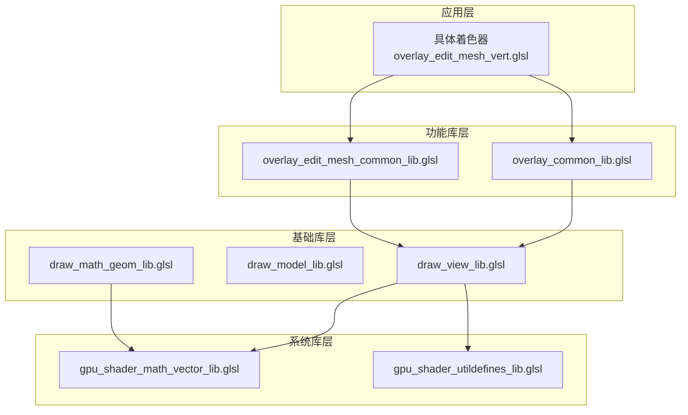

# 核心 GLSL 库深度解析

## 目录
- [1. 库系统架构](#1-库系统架构)
- [2. 视图变换库 (draw_view_lib.glsl)](#2-视图变换库-draw_view_libglsl)
  - [2.1. 数据结构](#21-数据结构)
  - [2.2. 核心函数](#22-核心函数)
  - [2.3. 使用示例](#23-使用示例)
- [3. 模型变换库 (draw_model_lib.glsl)](#3-模型变换库-draw_model_libglsl)
- [4. Overlay 通用库 (overlay_common_lib.glsl)](#4-overlay-通用库-overlay_common_libglsl)
  - [4.1. 矩阵解包函数](#41-矩阵解包函数)
  - [4.2. 线数据打包](#42-线数据打包)
  - [4.3. 深度偏移计算](#43-深度偏移计算)
- [5. 网格编辑库 (overlay_edit_mesh_common_lib.glsl)](#5-网格编辑库-overlay_edit_mesh_common_libglsl)
  - [5.1. 颜色计算函数](#51-颜色计算函数)
  - [5.2. 标志位定义](#52-标志位定义)
- [6. 数学工具库 (draw_math_geom_lib.glsl)](#6-数学工具库-draw_math_geom_libglsl)
  - [6.1. 坐标系转换](#61-坐标系转换)
  - [6.2. 几何计算](#62-几何计算)
- [7. 向量运算库 (gpu_shader_math_vector_lib.glsl)](#7-向量运算库-gpu_shader_math_vector_libglsl)
- [8. 实战应用案例](#8-实战应用案例)

---

## 1. 库系统架构

### Blender GLSL 库的组织方式



### 库包含规则

```glsl
// 库文件头部格式
#pragma once  // 防止重复包含

#include "库依赖.h"  // 显式声明依赖

// 声明为 Shader 库（C++ 识别为此是一个库文件）
SHADER_LIBRARY_CREATE_INFO(库名)

// 函数定义
返回类型 函数名(参数) {
    // 实现
}
```

### 层次关系
1. **系统库**：向量运算、位操作（最底层）
2. **基础库**：视图、模型变换（中层）
3. **功能库**：编辑模式专用、颜色计算（高层）
4. **应用层**：具体着色器（顶层）

---

## 2. 视图变换库 (draw_view_lib.glsl)

**文件路径**: `source/blender/draw/intern/shaders/draw_view_lib.glsl`

### 2.1. 数据结构定义

```cpp
// C++ 中定义（draw_view_infos.hh）
struct ViewMatrices {
    float4x4 viewmat;      // World → View
    float4x4 winmat;       // View → Clip
    float4x4 viewinv;      // View → World (逆矩阵)
    float4x4 wininv;       // Clip → View (逆矩阵)
    float4x4 modelmat;     // Local → World  (当前对象)
    float4x4 modelinv;     // World → Local
    float4x4 modelmat_inv_transpose;  // 法线变换矩阵

    // 裁剪平面（6个）
    float4 clipplanes[6];
    int clipplane_count;
};
```

```glsl
// GLSL 中访问
layout(std140, binding = X) uniform ViewMatrices {
    mat4 viewmat;
    mat4 winmat;
    mat4 viewinv;
    mat4 wininv;
    mat4 modelmat;
    mat4 modelinv;
    mat4 modelmat_inv_transpose;
    vec4 clipplanes[6];
    int clipplane_count;
} drw_view_buf;

uniform int drw_view_id;  // 当前视图索引（多视口）
```

### 2.2. 核心函数

#### **视图获取**

```glsl
// 获取当前视图矩阵
ViewMatrices drw_view() {
    return drw_view_buf[drw_view_id];
}

// 示例：直接访问
void main() {
    vec4 view_space_pos = drw_view().viewmat * vec4(world_pos, 1.0);
}
```

#### **坐标变换函数**

```glsl
// ===== 世界 ↔ 视图 =====
float3 drw_point_world_to_view(float3 P) {
    return (drw_view().viewmat * vec4(P, 1.0)).xyz;
}

float3 drw_point_view_to_world(float3 vP) {
    return (drw_view().viewinv * vec4(vP, 1.0)).xyz;
}

// ===== 视图 ↔ 齐次裁剪 =====
float4 drw_point_view_to_homogenous(float3 vP) {
    return (drw_view().winmat * vec4(vP, 1.0));
}

float3 drw_point_homogenous_to_view(float4 hs_P) {
    return hs_P.xyz / hs_P.w;  // 透视除法
}

// ===== 世界 ↔ 齐次裁剪（一步到位） =====
float4 drw_point_world_to_homogenous(float3 P) {
    // viewmat * P → winmat * (viewmat * P)
    return drw_view().winmat * (drw_view().viewmat * vec4(P, 1.0));
}

// ===== NDC ↔ 屏幕坐标 =====
// NDC: [-1, 1] 范围
// Screen: [0, 1] 范围

float3 drw_ndc_to_screen(float3 ndc_P) {
    return ndc_P * 0.5 + 0.5;  // [-1, 1] → [0, 1]
}

float3 drw_screen_to_ndc(float3 ss_P) {
    return ss_P * 2.0 - 1.0;  // [0, 1] → [-1, 1]
}

// 一步完成
float3 drw_point_world_to_screen(float3 P) {
    float4 hs = drw_point_world_to_homogenous(P);
    float3 ndc = hs.xyz / hs.w;
    return drw_ndc_to_screen(ndc);
}
```

#### **法线变换**

```glsl
// ===== 法线变换（重要！）=====
// 法线不能用普通的矩阵变换

float3 drw_normal_world_to_view(float3 N) {
    // 使用逆转置矩阵的 3x3 部分
    return normalize(to_float3x3(drw_view().viewmat) * N);
}

float3 drw_normal_view_to_world(float3 vN) {
    return normalize(to_float3x3(drw_view().viewinv) * vN);
}

float3 drw_normal_object_to_view(float3 N) {
    // 对象 → 世界 → 视图
    mat3 normal_mat = to_float3x3(drw_view().modelmat_inv_transpose);
    return normalize(normal_mat * N);
}
```

#### **视图信息**

```glsl
// ===== 相机位置和方向 =====
float3 drw_view_position() {
    return drw_view().viewinv[3].xyz;  // 逆矩阵的第4列
}

float3 drw_view_forward() {
    return drw_view().viewinv[2].xyz;  // 逆矩阵的第3列（Z轴）
}

float3 drw_view_up() {
    return drw_view().viewinv[1].xyz;  // 逆矩阵的第2列（Y轴）
}

// ===== 投影类型检测 =====
bool drw_view_is_perspective() {
    // 透视投影：winmat[3][3] = 0
    // 正交投影：winmat[3][3] = 1
    return drw_view().winmat[3][3] == 0.0f;
}

// ===== 裁剪面距离 =====
float drw_view_near() {
    if (drw_view_is_perspective()) {
        return -drw_view().winmat[3][2] / (drw_view().winmat[2][2] - 1.0f);
    }
    return -(drw_view().winmat[3][2] + 1.0f) / drw_view().winmat[2][2];
}

float drw_view_far() {
    if (drw_view_is_perspective()) {
        return -drw_view().winmat[3][2] / (drw_view().winmat[2][2] + 1.0f);
    }
    return -(drw_view().winmat[3][2] - 1.0f) / drw_view().winmat[2][2];
}

// ===== 深度距离 =====
// 从世界点到相机的正向距离（不考虑方向）
float drw_view_z_distance(float3 P) {
    return dot(P - drw_view_position(), -drw_view_forward());
}

// 深度值反推
float drw_depth_view_to_screen(float v_depth) {
    // 将视图空间深度转换为屏幕空间 Z
    vec4 hs = drw_view().winmat * vec4(0.0, 0.0, v_depth, 1.0);
    return drw_ndc_to_screen(hs.xyz / hs.w).z;
}
```

### 2.3. 实战示例

#### **例子：顶点着色器中的坐标变换**

```glsl
#include "draw_view_lib.glsl"

in vec3 position;
in vec3 normal;

out vec3 vNormal;
out vec3 vViewPos;

void main() {
    // 旧式手动计算（需要多个 uniform）
    // vec4 worldPos = ModelMatrix * vec4(position, 1.0);
    // vec4 viewPos = ViewMatrix * worldPos;
    // gl_Position = ProjectionMatrix * viewPos;
    // vNormal = normalize(NormalMatrix * normal);

    // 新式库函数（更简洁，自动处理）
    vec3 worldPos = drw_point_object_to_world(position);
    vec3 viewPos = drw_point_world_to_view(worldPos);
    gl_Position = drw_point_view_to_homogenous(viewPos);

    vNormal = drw_normal_object_to_view(normal);
    vViewPos = viewPos;

    // 深度偏移示例
    if (selected) {
        gl_Position.z -= 0.001;  // 置顶显示
    }
}
```

#### **例子：片段着色器中的操作**

```glsl
#include "draw_view_lib.glsl"

uniform sampler2D depth_tx;

void main() {
    // 获取屏幕位置对应的深度值
    vec2 screen_uv = gl_FragCoord.xy / textureSize(depth_tx, 0).xy;
    float scene_depth = texture(depth_tx, screen_uv).r;

    // occlusion 测试：如果当前片段在场景深度之前，则不遮挡
    float frag_depth = gl_FragCoord.z;
    if (frag_depth > scene_depth) {
        discard;
    }

    // 获取相机位置（世界空间）
    vec3 camera_pos = drw_view_position();

    // 计算视角方向
    vec3 view_dir = normalize(camera_pos - world_pos);
}
```

---

## 3. 模型变换库 (draw_model_lib.glsl)

**文件路径**: `source/blender/draw/intern/shaders/draw_model_lib.glsl`

### 3.1. 主要功能

```glsl
// ===== 获取模型矩阵 =====
mat4 drw_modelmat() {
    return drw_view().modelmat;
}

mat4 drw_modelmat_inv() {
    return drw_view().modelinv;
}

// ===== 变换函数 =====
float3 drw_point_model_to_world(float3 P) {
    return (drw_modelmat() * vec4(P, 1.0)).xyz;
}

float3 drw_normal_model_to_world(float3 N) {
    mat3 normal_mat = to_float3x3(drw_view().modelmat_inv_transpose);
    return normalize(normal_mat * N);
}

// ===== 实例化渲染支持 =====
// 当同一网格在多个位置渲染时使用
uniform mat4 drw_instance_matrix_buf[128];  // 实例矩阵数组

mat4 drw_instance_modelmat(int instance_id) {
    return drw_instance_matrix_buf[instance_id];
}

// 使用
void main() {
    mat4 model = drw_instance_modelmat(gl_InstanceID);
    vec3 world_pos = (model * vec4(position, 1.0)).xyz;
    gl_Position = drw_point_world_to_homogenous(world_pos);
}
```

---

## 4. Overlay 通用库 (overlay_common_lib.glsl)

**文件路径**: `source/blender/draw/engines/overlay/shaders/overlay_common_lib.glsl`

### 4.1. 矩阵解包函数

**用途**：从存储在矩阵中的打包数据中解压信息

```glsl
// C++ 优化的存储方式：
// 将额外数据打包进矩阵的第4列（通常未使用）
// 节省 uniform 缓冲空间

/**
 * 从矩阵中提取打包的数据
 * @param mat  输入矩阵（第4列包含打包数据）
 * @param dataA 提取的第一个数据块（2个 float2）
 * @param dataB 提取的第二个数据块（2个 float2）
 * @return 清理后的矩阵（第4列为默认值）
 */
float4x4 extract_matrix_packed_data(float4x4 mat, out float4 dataA, out float4 dataB)
{
    constexpr float div = 1.0f / 255.0f;

    // 从矩阵元素中提取
    int a = int(mat[0][3]); int b = int(mat[1][3]);
    int c = int(mat[2][3]); int d = int(mat[3][3]);

    // 解包为 [0..1] 范围的 float
    dataA = float4(a & 0xFF, a >> 8, b & 0xFF, b >> 8) * div;
    dataB = float4(c & 0xFF, c >> 8, d & 0xFF, d >> 8) * div;

    // 清理矩阵（恢复为标准变换矩阵）
    mat[0][3] = mat[1][3] = mat[2][3] = 0.0f;
    mat[3][3] = 1.0f;

    return mat;
}

// 使用示例
void main() {
    mat4 transform = drw_modelmat();
    float4 extraA, extraB;
    transform = extract_matrix_packed_data(transform, extraA, extraB);

    // extraA 和 extraB 现在包含额外信息（如颜色、权重等）
    vec3 vertex_color = extraA.xyz;
}
```

### 4.2. 线数据打包函数

**用途**：为抗锯齿线渲染准备数据

```glsl
/**
 * 打包线段数据用于几何着色器扩展
 * @param frag_co       片段坐标（屏幕空间）
 * @param edge_start    线段起点（屏幕空间）
 * @param edge_pos      线段当前点（屏幕空间）
 * @return 打包数据：perp(0..1), perp(0..1), dist(0..1), 1.0
 */
float4 pack_line_data(float2 frag_co, float2 edge_start, float2 edge_pos)

{
    float2 edge = edge_start - edge_pos;
    float len = length(edge);

    if (len > 0.0f) {
        // 归一化方向
        edge /= len;

        // 垂直方向（±90度）
        float2 perp = float2(-edge.y, edge.x);

        // 点到线的距离（带符号）
        float dist = dot(perp, frag_co - edge_start);

        // 打包到 [0..1] 范围：
        // - perp: [0..1] → 编码为方向
        // - dist: [-半宽..+半宽] → 转换为 [0..1]
        // +0.1: 与透明背景区分
        return float4(
            perp * 0.5f + 0.5f,              // (0.5, 0.5) 为中心
            dist * 0.25f + 0.5f + 0.1f,      // 距离编码
            1.0f
        );
    }
    else {
        // 默认值（处理退化情况）
        return float4(1.0f, 0.0f, 0.5f + 0.1f, 1.0f);
    }
}

// 原理解释：
// 1. 包含法线方向（perp）：用于后续计算线宽
// 2. 包含距离（dist）：用于判断是否在线宽范围内
// 3. +0.1 偏移：避免结果为0（与透明混合）
```

### 4.3. 深度偏移函数

**用途**：解决深度冲突（Z-fighting）

```glsl
/**
 * 计算齐次深度偏移
 * @param winmat      窗口/投影矩阵
 * @param vs_z        视图空间深度
 * @param hs_w        齐次空间的W分量
 * @param vs_offset   视图空间偏移（正数=更近）
 * @return 齐次空间的深度偏移量
 */
float get_homogenous_z_offset(float4x4 winmat, float vs_z, float hs_w, float vs_offset)
{
    // 没有偏移
    if (vs_offset == 0.0f) {
        return 0.0f;
    }

    // 透视投影
    else if (winmat[3][3] == 0.0f) {
        // 透视投影深度修改公式（Eric Lengyel）
        // 来自: http://www.terathon.com/gdc07_lengyel.pdf

        // 限制偏移，避免精度误差
        vs_offset = min(vs_offset, vs_z * -0.5f);

        // 公式推导：
        // 深度偏移 = 窗口矩阵的元素 × 偏移量 / (z × (z + 偏移))
        return winmat[3][2] * (vs_offset / (vs_z * (vs_z + vs_offset))) * hs_w;
    }

    // 正交投影
    else {
        // 正交投影：线性变换，直接相乘
        return winmat[2][2] * vs_offset * hs_w;
    }
}

// 使用示例（顶点着色器）
void main() {
    vec3 world_pos = drw_point_object_to_world(pos);
    vec3 view_pos = drw_point_world_to_view(world_pos);
    gl_Position = drw_point_view_to_homogenous(view_pos);

    // 使选中元素置顶
    if (selected) {
        float offset = get_homogenous_z_offset(
            drw_view().winmat,
            view_pos.z,
            gl_Position.w,
            0.001  // 视图空间偏移
        );
        gl_Position.z += offset;
    }
}

// 为什么需要这个函数？
// - 直接修改 gl_Position.z 可能会因投影类型（透视/正交）不同而效果不一致
// - 这个函数统一处理两种投影
// - 确保偏移量在不同视角下一致
```

### 4.4. 投影计算函数

```glsl
/**
 * 计算点在投影平面上的投影因子
 * 用于深度测试和投影相关计算
 */
float mul_project_m4_v3_zfac(float pixel_fac, float3 co)
{
    // 世界坐标转视图坐标
    float3 vP = drw_point_world_to_view(co).xyz;
    float4x4 winmat = drw_view().winmat;

    // 计算投影深度
    return pixel_fac *
           (winmat[0][3] * vP.x +
            winmat[1][3] * vP.y +
            winmat[2][3] * vP.z +
            winmat[3][3]);
}
```

---

## 5. 网格编辑库 (overlay_edit_mesh_common_lib.glsl)

**文件路径**: `source/blender/draw/engines/overlay/shaders/overlay_edit_mesh_common_lib.glsl`

### 5.1. 标志位定义

```glsl
// === 顶点标志位 ===
#define VERT_ACTIVE     0x0001u  // 活动顶点
#define VERT_SELECTED   0x0002u  // 选中顶点
#define VERT_HIDDEN     0x0004u  // 隐藏
#define VERT_TEMP       0x0008u  // 临时标记

// === 边缘标志位 ===
#define EDGE_ACTIVE     0x0001u
#define EDGE_SELECTED   0x0002u
#define EDGE_SEAM       0x0004u  // 缝线
#define EDGE_SHARP      0x0008u  // 硬边
#define EDGE_FREESTYLE  0x0010u  // 自由式边
#define EDGE_VISIBLE    0x0200u

/**
 * 边缘外层颜色（额外显示的标记，如折痕、权重等）
 * @param edge_flag  边缘标志
 * @param face_flag  相邻面标志
 * @param crease     折痕值 [0..1]
 * @param bweight    边权重 [0..1]
 * @return RGBA 颜色
 */
float4 EDIT_MESH_edge_color_outer(uint edge_flag, uint face_flag,
                                   float crease, float bweight)
{
    float4 color = float4(0.0);  // 透明

    // 优先级：自由式 > 硬边 > 折痕 > 权重 > 缝线

    if ((edge_flag & EDGE_FREESTYLE) != 0u) {
        color = theme.colors.edge_freestyle;
    }
    if ((edge_flag & EDGE_SHARP) != 0u) {
        color = theme.colors.edge_sharp;
    }
    if (crease > 0.0f) {
        // 折痕：颜色透明度随值变化
        color = float4(theme.colors.edge_crease.rgb, crease);
    }
    if (bweight > 0.0f) {
        // 边权重
        color = float4(theme.colors.edge_bweight.rgb, bweight);
    }
    if ((edge_flag & EDGE_SEAM) != 0u) {
        color = theme.colors.edge_seam;
    }

    return color;
}
```

### 5.2. 颜色计算函数

```glsl
/**
 * 编辑模式边缘内层颜色（基础线框）
 */
float4 EDIT_MESH_edge_color_inner(uint edge_flag)
{
    float4 color = theme.colors.wire_edit;  // 默认编辑线框色

    // 选中边颜色
    float4 selected_edge_col = (select_edge) ?
                               theme.colors.edge_mode_select :
                               theme.colors.edge_select;

    if ((edge_flag & EDGE_SELECTED) != 0u) {
        color = selected_edge_col;
    }
    if ((edge_flag & EDGE_ACTIVE) != 0u) {
        color = theme.colors.edit_mesh_active;
    }

    color.a = 1.0f;  // 内层不透明
    return color;
}

/**
 * 编辑模式边缘颜色（顶点选择模式）
 */
float4 EDIT_MESH_edge_vertex_color(uint vertex_flag)
{
    // 顶点选中 → 边高亮
    bool edge_selected = (vertex_flag & (VERT_ACTIVE | VERT_SELECTED)) != 0u;

    if (edge_selected) {
        return (select_edge) ?
               theme.colors.edge_mode_select :
               theme.colors.edge_select;
    }

    return theme.colors.wire_edit;
}

/**
 * 编辑模式顶点颜色
 */
float4 EDIT_MESH_vertex_color(uint vertex_flag, float vertex_crease)
{
    // 活动顶点（最高优先级）
    if ((vertex_flag & VERT_ACTIVE) != 0u) {
        return float4(theme.colors.edit_mesh_active.xyz, 1.0f);
    }

    // 选中顶点
    if ((vertex_flag & VERT_SELECTED) != 0u) {
        return theme.colors.vert_select;
    }

    // 普通顶点 + 显示折痕
    if (vertex_crease > 0.0f) {
        return mix(theme.colors.vert,
                   theme.colors.edge_crease,
                   vertex_crease);
    }

    // 默认顶点颜色
    return theme.colors.vert;
}

/**
 * 编辑模式面颜色
 */
float4 EDIT_MESH_face_color(uint face_flag)
{
    bool freestyle = (face_flag & FACE_FREESTYLE) != 0u;
    bool selected  = (face_flag & FACE_SELECTED)  != 0u;
    bool active    = (face_flag & FACE_ACTIVE)    != 0u;
    bool retopo    = (retopology_offset > 0.0f);

    float4 color = theme.colors.face;

    // 重拓扑模式
    if (retopo) {
        color = theme.colors.face_retopology;
    }

    // 自由式
    if (freestyle) {
        color = theme.colors.face_freestyle;
    }

    // 选中
    if (selected) {
        float4 selected_col = (select_face) ?
                              theme.colors.face_mode_select :
                              theme.colors.face_select;
        color = selected_col;
    }

    // 活动且选中（混合）
    if (select_face && active) {
        color = mix(selected_col, theme.colors.edit_mesh_active, 0.5f);
        color.a = selected_col.a;
    }

    // 线框模式下降低透明度
    if (wire_shading && selected) {
        color.a *= 0.6f;
    }
    else if (!select_face && !selected && !active && !freestyle && !retopo) {
        color.a = 0.0f;  // 不显示
    }

    return color;
}
```

### 5.3. 面点显示

```glsl
// FACEDOT 模式：在面中心显示小点
float4 EDIT_MESH_facedot_color(float facedot_flag)
{
    if (facedot_flag < 0.0f) {
        // 活动面
        return float4(theme.colors.edit_mesh_active.xyz, 1.0f);
    }
    else if (facedot_flag > 0.0f) {
        // 选中面
        return theme.colors.facedot;
    }
    else {
        // 默认
        return theme.colors.vert;
    }
}
```

---

## 6. 数学工具库 (draw_math_geom_lib.glsl)

**文件路径**: `source/blender/draw/intern/shaders/draw_math_geom_lib.glsl`

### 6.1. 平面相关函数

```glsl
/**
 * 从四边形创建平面
 * @param v0..v3 四边形的四个顶点
 * @return float4: (法线x, 法线y, 法线z, 距离)
 */
float4 plane_from_quad(float3 v0, float3 v1, float3 v2, float3 v3)
{
    // 计算两个对角的法线并平均
    float3 nor = normalize(
        cross(v2 - v1, v0 - v1) +  // 边1×边2
        cross(v0 - v3, v2 - v3)    // 边3×边4
    );
    // 平面方程: ax + by + cz + d = 0
    // 其中 d = -dot(normal, point)
    return float4(nor, -dot(nor, v2));
}

/**
 * 从三角形创建平面
 */
float4 plane_from_tri(float3 v0, float3 v1, float3 v2)
{
    float3 nor = normalize(cross(v2 - v1, v0 - v1));
    return float4(nor, -dot(nor, v2));
}

/**
 * 点到平面的距离
 */
float point_plane_projection_dist(float3 line_origin,
                                  float3 plane_origin,
                                  float3 plane_normal)
{
    return dot(plane_normal, plane_origin - line_origin);
}

/**
 * 线与平面交点
 */
float3 line_plane_intersect(float3 line_origin,
                            float3 line_direction,
                            float4 plane)
{
    float denom = dot(plane.xyz, line_direction);
    if (abs(denom) < 1e-6f) return line_origin;  // 平行

    float t = -dot(plane, vec4(line_origin, 1.0f)) / denom;
    return line_origin + line_direction * t;
}
```

### 6.2. 球体与盒子相交

```glsl
/**
 * 线与单位球相交（假定线起点在球内）
 */
float line_unit_sphere_intersect_dist(float3 line_origin,
                                      float3 line_direction)
{
    // 二次方程: at² + bt + c = 0
    // 其中 a = |dir|², b = 2·dot(origin, dir), c = |origin|² - 1
    float a = dot(line_direction, line_direction);
    float b = dot(line_direction, line_origin);
    float c = dot(line_origin, line_origin) - 1.0f;

    float det = b * b - a * c;

    if (det >= 0.0f) {
        // 返回最远交点
        return (sqrt(det) - b) / a;
    }

    return 1e15f;  // 无交点，返回大数
}

/**
 * 线与单位盒子相交（AABB）
 */
float line_unit_box_intersect_dist(float3 line_origin,
                                   float3 line_direction)
{
    // 精确交点 - 从着名的 "AABB 射线相交" 算法
    float3 first_plane = (vec3(1.0f) - line_origin) / line_direction;
    float3 second_plane = (vec3(-1.0f) - line_origin) / line_direction;

    // 取两组平面中较远的
    float3 farthest_plane = max(first_plane, second_plane);

    // 最近距离
    return farthest_plane.x > farthest_plane.y ?
           (farthest_plane.z > farthest_plane.x ? farthest_plane.z : farthest_plane.x) :
           (farthest_plane.z > farthest_plane.y ? farthest_plane.z : farthest_plane.y);
}

/**
 * 创建正交基（用于法线生成切线空间）
 */
void make_orthonormal_basis(float3 N, out float3 T, out float3 B)
{
    // 选择与法线不平行的上向量
    float3 up_vector = abs(N.z) < 0.99999f ?
                       float3(0.0f, 0.0f, 1.0f) :
                       float3(1.0f, 0.0f, 0.0f);

    // 切线 = 上向量 × 法线
    T = normalize(cross(up_vector, N));

    // 副法线 = 法线 × 切线
    B = cross(N, T);
}
```

---

## 7. 向量运算库 (gpu_shader_math_vector_lib.glsl)

**文件路径**: `source/blender/gpu/shaders/gpu_shader_math_vector_lib.glsl`

### 7.1. 类型转换

```glsl
// float4 → float3x3
mat3 to_float3x3(mat4 m) {
    return mat3(m[0].xyz, m[1].xyz, m[2].xyz);
}

// float → float3
vec3 float_to_float3(float f) {
    return vec3(f, f, f);
}

// 选择操作（类似三元运算符）
vec3 select(vec3 a, vec3 b, bvec3 mask) {
    return vec3(mask.x ? b.x : a.x,
                mask.y ? b.y : a.y,
                mask.z ? b.z : a.z);
}
```

### 7.2. 求和与归约

```glsl
// 向量分量求和
float reduce_add(vec3 v) { return v.x + v.y + v.z; }

// 向量分量最小值
float reduce_min(vec3 v) { return min(v.x, min(v.y, v.z)); }

// 向量分量最大值
float reduce_max(vec3 v) { return max(v.x, max(v.y, v.z)); }

// 点积平方
float dot2(vec3 v) { return dot(v, v); }
```

---

## 8. 实战应用案例

### 场景：顶点着色器完整流程

```glsl
// ===== 顶点着色器 overlay_edit_mesh_vert.glsl =====

// 1. 包含信息文件
#include "infos/overlay_edit_mode_infos.hh"
VERTEX_SHADER_CREATE_INFO(overlay_edit_mesh_vert)

// 2. 包含所有需要的库
#include "draw_model_lib.glsl"
#include "draw_view_lib.glsl"
#include "overlay_common_lib.glsl"
#include "overlay_edit_mesh_common_lib.glsl"

// 3. 输入
in vec3 pos;
in vec4 data;
in vec3 vnor;

// 4. 输出
out vec4 final_color;
out float vertex_crease;

// 5. Uniform
uniform sampler2D depth_tx;
uniform float alpha;
uniform int4 data_mask;
uniform float retopology_offset;

// ===== 主函数 =====
void main() {
    // Step 1: 坐标变换（使用 draw_view_lib）
    float3 world_pos = drw_point_object_to_world(pos);
    float3 view_pos = drw_point_world_to_view(world_pos);
    gl_Position = drw_point_view_to_homogenous(view_pos);

    // Step 2: Retopology 深度偏移（使用 overlay_common_lib）
    float offset = get_homogenous_z_offset(
        drw_view().winmat,
        view_pos.z,
        gl_Position.w,
        retopology_offset
    );
    gl_Position.z += offset;

    // Step 3: 数据掩码处理
    vec4 m_data = data & data_mask;

    // Step 4: 根据渲染模式选择不同的颜色（宏分支）
    #if defined(VERT)
        // 顶点显示模式
        vertex_crease = float(m_data.z >> 4) / 15.0f;
        final_color = EDIT_MESH_vertex_color(m_data.y, vertex_crease);
        gl_PointSize = theme.sizes.vert * ((vertex_crease > 0.0f) ? 3.0f : 2.0f);

        // 选中顶点置顶
        if ((data.x & VERT_SELECTED) != 0u) {
            gl_Position.z -= 5e-7f * abs(gl_Position.w);
        }

    #elif defined(EDGE)
        // 边缘显示模式（由几何着色器处理）
        final_color = EDIT_MESH_edge_vertex_color(m_data.y);
        // 注意：实际边缘在几何着色器中扩展

    #elif defined(FACE)
        // 面显示模式
        final_color = EDIT_MESH_face_color(m_data.x);

    #elif defined(FACEDOT)
        // 面点模式
        final_color = EDIT_MESH_facedot_color(m_data.y);
        gl_PointSize = theme.sizes.face_dot;
    #endif

    // Step 5: 遮挡测试（使用 depth_tx）
    #if defined(VERT) || defined(EDGE) || defined(FACEDOT)
        // 测试是否需要在前面显示
        float3 ndc = (gl_Position.xyz / gl_Position.w) * 0.5f + 0.5f;
        float4 depths = textureGather(depth_tx, ndc.xy);
        bool occluded = all(greaterThan(vec4(ndc.z), depths));
        final_color.a *= (occluded) ? alpha : 1.0f;
    #endif

    // Step 6: 面向混合（Fresnel 效应，增强边缘可见性）
    #if !defined(FACE)
        // 获取视图法线
        float3 view_normal = normalize(drw_normal_object_to_view(vnor) + 1e-4f);

        // 视图方向（透视/正交自适应）
        float3 view_vec = (drw_view().winmat[3][3] == 0.0f) ?
                          normalize(view_pos) :
                          vec3(0.0, 0.0, 1.0);

        // 计算面向因子
        float facing = dot(view_vec, view_normal);
        facing = 1.0f - abs(facing) * 0.2f;

        // 非线性混合（在伽马空间混合更好）
        final_color.rgb = mix(
            final_color.rgb,
            non_linear_blend_color(
                theme.colors.edit_mesh_middle.rgb,
                final_color.rgb,
                facing
            ),
            theme.fresnel_mix_edit
        );
    #endif

    // Step 7: 裁剪平面（使用 draw_view_lib）
    #if !defined(FACE)
        // 只对点和边缘应用裁剪
        vec3 world_pos = drw_point_object_to_world(pos);
        view_clipping_distances(world_pos);
    #endif

    // Step 8: 深度调整量
    gl_Position.z -= 0.0;  // 可用于总计偏移
}
```

### 关键点总结

| 模块 | 库函数 | 作用 |
|-----|--------|------|
| 坐标变换 | `drw_point_object_to_world()` | 对象→世界 |
| 坐标变换 | `drw_point_world_to_view()` | 世界→视图 |
| 坐标变换 | `drw_point_view_to_homogenous()` | 视图→裁剪 |
| 深度偏移 | `get_homogenous_z_offset()` | 避免 Z-fighting |
| 颜色计算 | `EDIT_MESH_vertex_color()` | 顶点颜色策略 |
| 深度测试 | `textureGather()` | 2x2 深度采样 |

---

## 9. 库文件查找指南

### 9.1. 按功能查找

| 功能 | 文件 | 路径 |
|-----|------|------|
| **视图变换** | `draw_view_lib.glsl` | `source/blender/draw/intern/shaders/` |
| **模型变换** | `draw_model_lib.glsl` | `source/blender/draw/intern/shaders/` |
| **数学工具** | `draw_math_geom_lib.glsl` | `source/blender/draw/intern/shaders/` |
| **通用工具** | `overlay_common_lib.glsl` | `source/blender/draw/engines/overlay/shaders/` |
| **网格编辑** | `overlay_edit_mesh_common_lib.glsl` | `source/blender/draw/engines/overlay/shaders/` |
| **向量运算** | `gpu_shader_math_vector_lib.glsl` | `source/blender/gpu/shaders/` |

### 9.2. 按名称查找

```bash
# 查找所有库文件
find source/blender/draw -name "*lib.glsl"

# 查找 Overlay 特定库
find source/blender/draw/engines/overlay/shaders -name "*lib.glsl"

# 查找依赖关系
grep -r "#include" source/blender/draw/engines/overlay/shaders/*.glsl
```

---

## 10. 常用库函数索引

### 视图变换（最常用）

```glsl
drw_view()                      // 获取当前视图
drw_point_object_to_world(P)    // 对象→世界
drw_point_world_to_view(P)      // 世界→视图
drw_point_view_to_homogenous(P) // 视图→齐次
drw_normal_object_to_view(N)    // 法线变换
drw_view_position()             // 相机位置
drw_view_forward()              // 相机朝向
```

### 深度处理

```glsl
get_homogenous_z_offset()       // 深度偏移
drw_depth_view_to_screen()      // 深度转换
textureGather()                 // 深度收集（抗锯齿）
```

### 颜色计算

```glsl
EDIT_MESH_vertex_color()        // 顶点颜色
EDIT_MESH_edge_color_outer()    // 边缘外层
EDIT_MESH_edge_color_inner()    // 边缘内层
EDIT_MESH_face_color()          // 面颜色
encode_id_to_color()            // ID 编码（选择）
```

### 数学工具

```glsl
plane_from_tri()                // 创建平面
line_plane_intersect()          // 线面相交
line_sphere_intersect()         // 线球相交
make_orthonormal_basis()        // 创建正交基
```

---

**文档用途**: 快速查阅库函数功能和使用方法

**建议**: 将文档作为参考手册，遇到不熟悉的库函数时查阅

---
**版本**: 1.0
**基于**: Blender 4.3 源码
**创建时间**: 2025-12-17
