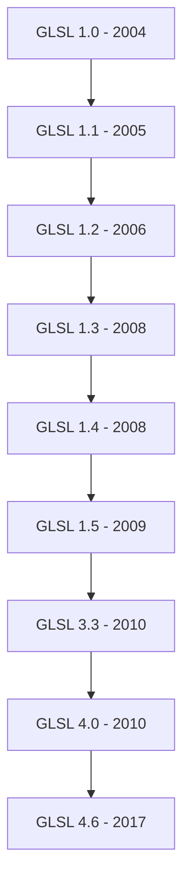

# 01. GLSL基础语法详解

## 目录
- [1. GLSL概述和版本历史](#1-glsl概述和版本历史)
  - [1.1. GLSL简介](#11-glsl简介)
  - [1.2. 版本历史](#12-版本历史)
  - [1.3. GLSL在Blender中的应用](#13-glsl在blender中的应用)
- [2. 基础数据类型](#2-基础数据类型)
  - [2.1. 标量类型](#21-标量类型)
  - [2.2. 向量类型](#22-向量类型)
  - [2.3. 矩阵类型](#23-矩阵类型)
  - [2.4. 采样器类型](#24-采样器类型)
  - [2.5. 结构体和数组](#25-结构体和数组)
- [3. 变量限定符](#3-变量限定符)
  - [3.1. 存储限定符](#31-存储限定符)
  - [3.2. 参数限定符](#32-参数限定符)
  - [3.3. 精度限定符](#33-精度限定符)
  - [3.4. 插值限定符](#34-插值限定符)
- [4. 运算符和表达式](#4-运算符和表达式)
  - [4.1. 算术运算符](#41-算术运算符)
  - [4.2. 比较运算符](#42-比较运算符)
  - [4.3. 逻辑运算符](#43-逻辑运算符)
  - [4.4. 位运算符](#44-位运算符)
  - [4.5. 向量和矩阵运算](#45-向量和矩阵运算)
- [5. 控制流语句](#5-控制流语句)
  - [5.1. 条件语句](#51-条件语句)
  - [5.2. 循环语句](#52-循环语句)
  - [5.3. 选择语句](#53-选择语句)
  - [5.4. 跳转语句](#54-跳转语句)
- [6. 函数定义和调用](#6-函数定义和调用)
  - [6.1. 函数声明](#61-函数声明)
  - [6.2. 函数参数](#62-函数参数)
  - [6.3. 函数重载](#63-函数重载)
  - [6.4. 内置函数](#64-内置函数)
- [7. 内置函数详解](#7-内置函数详解)
  - [7.1. 数学函数](#71-数学函数)
  - [7.2. 几何函数](#72-几何函数)
  - [7.3. 纹理函数](#73-纹理函数)
  - [7.4. 导数函数](#74-导数函数)
  - [7.5. 向量关系函数](#75-向量关系函数)
- [8. 预处理器指令](#8-预处理器指令)
  - [8.1. 条件编译](#81-条件编译)
  - [8.2. 宏定义](#82-宏定义)
  - [8.3. 文件包含](#83-文件包含)
  - [8.4. 版本控制](#84-版本控制)
- [9. Blender特有的语法扩展](#9-blender特有的语法扩展)
  - [9.1. Blender内置变量](#91-blender内置变量)
  - [9.2. Blender扩展函数](#92-blender扩展函数)
  - [9.3. Overlay引擎特性](#93-overlay引擎特性)
- [10. 实际代码案例分析](#10-实际代码案例分析)
  - [10.1. 顶点着色器示例](#101-顶点着色器示例)
  - [10.2. 片段着色器示例](#102-片段着色器示例)
  - [10.3. 几何着色器示例](#103-几何着色器示例)

---

## 1. GLSL概述和版本历史

### 1.1. GLSL简介

GLSL (OpenGL Shading Language，OpenGL着色语言) 是一种高级着色语言，基于C语言语法，专门用于编写可编程GPU着色器。GLSL允许开发者在GPU上直接执行自定义代码，实现各种图形效果。

**核心概念**：
- **着色器 (Shader)**: 在GPU上运行的小程序，处理图形渲染管线中的特定阶段
- **GPU (Graphics Processing Unit)**: 图形处理单元，专门设计用于并行处理大量数据
- **渲染管线 (Rendering Pipeline)**: 将3D场景转换为2D图像的一系列处理步骤

### 1.2. 版本历史



**Blender使用的GLSL版本**：
- Blender主要使用GLSL 3.3或更高版本
- 某些旧系统可能使用GLSL 1.3以保持兼容性
- Modern OpenGL工作流通常使用GLSL 4.0+

### 1.3. GLSL在Blender中的应用

Blender中的GLSL主要用于：
- **Viewport渲染**: 实时3D视图显示
- **Overlay系统**: 绘制编辑器UI元素（网格、骨骼、gizmos等）
- **Eevee引擎**: 实时渲染引擎
- **材质预览**: 材质节点的实时预览

---

## 2. 基础数据类型

### 2.1. 标量类型

**定义位置**: `source/blender/gpu/shaders/common/gpu_shader_cfg_lib.glsl:15-30`

| 类型 | 描述 | 大小 | 范围 |
|------|------|------|------|
| `float` | 单精度浮点数 | 32位 | ±3.4×10⁻³⁸ 到 ±3.4×10³⁸ |
| `int` | 有符号整数 | 32位 | -2³¹ 到 2³¹-1 |
| `uint` | 无符号整数 | 32位 | 0 到 2³²-1 |
| `bool` | 布尔值 | 1位 | `true` 或 `false` |

**代码示例**：
```glsl
float radius = 5.0;           // 圆形半径
int object_id = 42;           // 对象ID
uint vertex_count = 1000u;    // 顶点数量
bool is_selected = true;      // 是否选中状态
```

### 2.2. 向量类型

向量类型用于存储2D、3D或4D坐标、颜色等数据：

| 类型 | 描述 | 示例用途 |
|------|------|----------|
| `vec2` | 2分量浮点向量 | 2D坐标、纹理坐标 |
| `vec3` | 3分量浮点向量 | 3D坐标、RGB颜色 |
| `vec4` | 4分量浮点向量 | 4D坐标、RGBA颜色、齐次坐标 |
| `ivec2/3/4` | 整数向量 | 像素坐标、索引 |
| `uvec2/3/4` | 无符号整数向量 | 顶点索引、纹理尺寸 |
| `bvec2/3/4` | 布尔向量 | 状态标记 |

**构造函数示例**：
```glsl
vec2 uv = vec2(0.5, 0.3);              // 直接构造
vec3 position = vec3(x, y, z);         // 从标量构造
vec4 color = vec4(1.0, 0.0, 0.0, 1.0); // 红色
vec3 gray = vec3(0.5);                 // 单值广播到所有分量
vec2 scaled = vec2(vec3_value);        // 截取前两个分量
```

**Blender中的使用示例**：
**定义位置**: `source/blender/gpu/shaders/overlay/overlay_grid_vert.glsl:28-35`
```glsl
in vec3 pos;                   // 顶点位置
in vec3 nor;                   // 顶点法线
out vec3 vPos;                 // 传递到片段着色器的位置
out vec3 vNor;                 // 传递到片段着色器的法线
```

### 2.3. 矩阵类型

矩阵用于变换操作，如旋转、缩放、平移：

| 类型 | 描述 | 用途 |
|------|------|------|
| `mat2` | 2×2浮点矩阵 | 2D变换 |
| `mat3` | 3×3浮点矩阵 | 3D旋转、法线变换 |
| `mat4` | 4×4浮点矩阵 | 3D模型视图投影变换 |

**矩阵构造**：
```glsl
mat2 rotation_2d = mat2(
    cos(angle), -sin(angle),
    sin(angle),  cos(angle)
);

mat3 normal_matrix = mat3(model_matrix);
mat4 mvp = projection * view * model;

// 列主序构造（GLSL标准）
mat4 transform = mat4(
    1.0, 0.0, 0.0, 0.0,    // 第一列
    0.0, 1.0, 0.0, 0.0,    // 第二列
    0.0, 0.0, 1.0, 0.0,    // 第三列
    0.0, 0.0, 0.0, 1.0     // 第四列
);
```

**Blender中的矩阵使用**：
**定义位置**: `source/blender/gpu/shaders/overlay/overlay_uniforms.glsl:45-52`
```glsl
uniform mat4 ModelMatrix;        // 模型矩阵
uniform mat4 ViewMatrix;         // 视图矩阵
uniform mat4 ProjectionMatrix;   // 投影矩阵
uniform mat4 ModelViewProjectionMatrix; // MVP矩阵
```

### 2.4. 采样器类型

采样器用于访问纹理数据：

| 类型 | 描述 |
|------|------|
| `sampler1D` | 一维纹理采样器 |
| `sampler2D` | 二维纹理采样器 |
| `sampler3D` | 三维纹理采样器 |
| `samplerCube` | 立方体贴图采样器 |
| `sampler2DArray` | 二维纹理数组采样器 |
| `isampler2D` | 整数纹理采样器 |
| `usampler2D` | 无符号整数纹理采样器 |

**纹理采样示例**：
```glsl
uniform sampler2D color_texture;  // 颜色纹理
uniform sampler2D depth_texture;  // 深度纹理

// 基本采样
vec4 color = texture(color_texture, uv);

// 带LOD的采样
vec4 color_lod = textureLod(color_texture, uv, 2.0);

// 投影采样
vec4 proj_color = textureProj(proj_sampler, vec3(uv, depth));

// 采样梯度
vec4 grad_color = textureGrad(color_texture, uv, dPdx, dPdy);
```

### 2.5. 结构体和数组

**结构体定义**：
```glsl
struct Light {
    vec3 position;      // 光源位置
    vec3 color;         // 光源颜色
    float intensity;    // 光照强度
    bool enabled;       // 是否启用
};

struct Material {
    vec3 albedo;        // 反射率
    float metallic;     // 金属度
    float roughness;    // 粗糙度
    vec3 emission;      // 自发光
};
```

**数组声明**：
```glsl
// 固定大小数组
float weights[4] = float[](0.1, 0.2, 0.3, 0.4);
vec3 positions[10];
mat4 bone_matrices[100];

// 运行时确定大小的数组（GLSL 4.3+）
uniform int light_count;
Light lights[gl_MaxLights];  // 最大光源数量
```

---

## 3. 变量限定符

### 3.1. 存储限定符

**定义位置**: `source/blender/gpu/shaders/common/gpu_shader_common_lib.glsl:20-35`

| 限定符 | 描述 | 用途 |
|--------|------|------|
| `const` | 常量 | 编译时确定的常量 |
| `attribute` (已弃用) | 顶点属性 | 逐顶点数据输入 |
| `uniform` | 统一变量 | 在绘制调用中保持不变的变量 |
| `varying` (已弃用) | 变化量 | 顶点着色器传递到片段着色器 |
| `in` | 输入变量 | 从上一阶段接收数据 |
| `out` | 输出变量 | 传递到下一阶段的数据 |

**现代GLSL限定符**：
```glsl
// 顶点着色器输入
layout(location = 0) in vec3 position;
layout(location = 1) in vec3 normal;
layout(location = 2) in vec2 texcoord;

// Uniform变量
uniform mat4 ModelViewMatrix;
uniform sampler2D albedo_texture;
uniform vec3 light_position;

// 输出到片段着色器
out vec3 vNormal;
out vec2 vTexcoord;
out vec3 vPosition;
```

### 3.2. 参数限定符

| 限定符 | 描述 | 示例 |
|--------|------|------|
| `in` (默认) | 输入参数 | `void func(in float value)` |
| `out` | 输出参数 | `void func(out float result)` |
| `inout` | 输入输出参数 | `void func(inout float value)` |

**函数参数示例**：
```glsl
// 值传递（默认）
float add(float a, float b) {
    return a + b;
}

// 输出参数
void calculateNormal(vec3 pos1, vec3 pos2, vec3 pos3, out vec3 normal) {
    vec3 v1 = pos2 - pos1;
    vec3 v2 = pos3 - pos1;
    normal = normalize(cross(v1, v2));
}

// 输入输出参数
void adjustBrightness(inout vec3 color, float factor) {
    color *= factor;
}
```

### 3.3. 精度限定符

| 限定符 | 描述 | 精度 |
|--------|------|------|
| `highp` | 高精度 | 完整32位精度 |
| `mediump` | 中等精度 | 16位精度 |
| `lowp` | 低精度 | 8位精度 |

**精度声明示例**：
```glsl
// 全局精度设置
precision highp float;
precision mediump int;

// 特定变量精度
highp mat4 view_matrix;
mediump vec3 normal;
lowp vec4 color;

// 精度选择原则
highp float depth;           // 深度值需要高精度
mediump vec3 normal;         // 法线中等精度即可
lowp vec4 flat_color;        // 纯色可以用低精度
```

### 3.4. 插值限定符

| 限定符 | 描述 | 用途 |
|--------|------|------|
| `smooth` (默认) | 平滑插值 | 透视校正插值 |
| `flat` | 平坦插值 | 不进行插值，使用最后一个顶点的值 |
| `noperspective` | 非透视插值 | 线性插值，不考虑透视 |
| `centroid` | 质心插值 | 多边形质心采样 |

**插值限定符示例**：
```glsl
// 顶点着色器
smooth out vec3 vNormal;      // 法线需要平滑插值
flat out int vObjectID;        // 对象ID不需要插值
noperspective out vec2 vScreenPos; // 屏幕坐标线性插值

// 几何着色器
smooth out vec3 gNormal;
flat out int gPrimitiveID;

// 片段着色器
smooth in vec3 vNormal;
flat in int vObjectID;
```

---

## 4. 运算符和表达式

### 4.1. 算术运算符

| 运算符 | 描述 | 示例 |
|--------|------|------|
| `+` | 加法 | `vec3 a + vec3 b` |
| `-` | 减法 | `float a - float b` |
| `*` | 乘法 | `mat4 * vec4` |
| `/` | 除法 | `float a / float b` |
| `%` | 取模 | `int a % int b` |

**向量运算示例**：
```glsl
vec3 a = vec3(1.0, 2.0, 3.0);
vec3 b = vec3(4.0, 5.0, 6.0);

// 分量运算
vec3 sum = a + b;      // vec3(5.0, 7.0, 9.0)
vec3 diff = b - a;     // vec3(3.0, 3.0, 3.0)
vec3 prod = a * b;     // vec3(4.0, 10.0, 18.0)
vec3 quot = b / a;     // vec3(4.0, 2.5, 2.0)

// 标量与向量运算
vec3 scaled = a * 2.0; // vec3(2.0, 4.0, 6.0)
vec3 offset = a + 1.0; // vec3(2.0, 3.0, 4.0)
```

### 4.2. 比较运算符

| 运算符 | 描述 | 返回类型 |
|--------|------|----------|
| `==` | 等于 | `bool` 或 `bvecN` |
| `!=` | 不等于 | `bool` 或 `bvecN` |
| `<` | 小于 | `bool` 或 `bvecN` |
| `>` | 大于 | `bool` 或 `bvecN` |
| `<=` | 小于等于 | `bool` 或 `bvecN` |
| `>=` | 大于等于 | `bool` 或 `bvecN` |

**比较运算示例**：
```glsl
vec3 a = vec3(1.0, 2.0, 3.0);
vec3 b = vec3(1.0, 3.0, 2.0);

bvec3 equal = (a == b);        // bvec3(true, false, false)
bvec3 less = (a < b);          // bvec3(false, true, false)
bool any_equal = any(equal);   // true
bool all_equal = all(equal);   // false

// 条件选择
vec3 result = mix(a, b, less); // vec3(1.0, 3.0, 3.0)
```

### 4.3. 逻辑运算符

| 运算符 | 描述 | 示例 |
|--------|------|------|
| `&&` | 逻辑与 | `a && b` |
| `||` | 逻辑或 | `a || b` |
| `!` | 逻辑非 | `!a` |

### 4.4. 位运算符

| 运算符 | 描述 | 适用类型 |
|--------|------|----------|
| `&` | 按位与 | `int`, `uint` |
| `|` | 按位或 | `int`, `uint` |
| `^` | 按位异或 | `int`, `uint` |
| `~` | 按位取反 | `int`, `uint` |
| `<<` | 左移 | `int`, `uint` |
| `>>` | 右移 | `int`, `uint` |

### 4.5. 向量和矩阵运算

**向量和矩阵乘法规则**：
```glsl
// 向量点积
float dot_product = dot(vec3 a, vec3 b);

// 向量叉积
vec3 cross_product = cross(vec3 a, vec3 b);

// 向量长度
float length_v = length(vec3 v);

// 向量归一化
vec3 normalized = normalize(vec3 v);

// 矩阵乘法（注意顺序：从右到左）
mat4 mvp = ProjectionMatrix * ViewMatrix * ModelMatrix;

// 矩阵与向量乘法
vec4 transformed = mvp * vec4(position, 1.0);

// 矩阵转置
mat3 transposed = transpose(mat3 m);

// 矩阵逆
mat4 inverted = inverse(mat4 m);
```

---

## 5. 控制流语句

### 5.1. 条件语句

**if语句**：
```glsl
// 基本if语句
if (depth > threshold) {
    color = vec4(1.0, 0.0, 0.0, 1.0); // 红色
}

// if-else语句
if (gl_FrontFacing) {
    normal = normalize(vNormal);
} else {
    normal = -normalize(vNormal);
}

// if-else if-else链
if (material_id == 0) {
    color = calculate_pbr();
} else if (material_id == 1) {
    color = calculate_unlit();
} else {
    color = vec4(1.0); // 白色
}
```

### 5.2. 循环语句

**for循环**：
```glsl
// 基本for循环
for (int i = 0; i < light_count; i++) {
    vec3 light_dir = normalize(lights[i].position - position);
    float ndotl = max(dot(normal, light_dir), 0.0);
    color += lights[i].color * ndotl * lights[i].intensity;
}

// 向量操作
vec3 sum = vec3(0.0);
for (int i = 0; i < 3; i++) {
    sum += colors[i];
}

// 矩阵遍历
mat4 result = mat4(0.0);
for (int i = 0; i < 4; i++) {
    for (int j = 0; j < 4; j++) {
        result[i][j] = matrix_a[i][j] + matrix_b[i][j];
    }
}
```

**while循环**：
```glsl
int count = 0;
while (count < max_iterations && error > tolerance) {
    // 迭代计算
    error = calculate_error();
    count++;
}
```

### 5.3. 选择语句

**switch语句**：
```glsl
// 整数switch
switch (object_type) {
    case 0: // 立方体
        color = vec4(1.0, 0.0, 0.0, 1.0);
        break;
    case 1: // 球体
        color = vec4(0.0, 1.0, 0.0, 1.0);
        break;
    case 2: // 圆柱体
        color = vec4(0.0, 0.0, 1.0, 1.0);
        break;
    default:
        color = vec4(0.5); // 灰色
        break;
}
```

### 5.4. 跳转语句

```glsl
// continue跳过当前迭代
for (int i = 0; i < samples; i++) {
    if (!valid_sample[i]) {
        continue;
    }
    process_sample(i);
}

// break跳出循环
for (int i = 0; i < max_depth; i++) {
    if (converged) {
        break;
    }
    iterate();
}

// return返回值
vec3 calculate_lighting() {
    if (!enabled) {
        return vec3(0.0);
    }
    // 计算光照...
    return result;
}
```

---

## 6. 函数定义和调用

### 6.1. 函数声明

**函数定义语法**：
```glsl
// 基本函数定义
return_type function_name(parameter_list) {
    // 函数体
    return value; // 如果return_type不是void
}

// 示例
vec3 diffuse_lighting(vec3 normal, vec3 light_dir, vec3 light_color) {
    float ndotl = max(dot(normal, light_dir), 0.0);
    return light_color * ndotl;
}

// 无返回值函数
void set_fragment_depth(float depth) {
    gl_FragDepth = depth;
}
```

### 6.2. 函数参数

**参数传递方式**：
```glsl
// 值传递（默认）
vec3 scale_color(vec3 color, float factor) {
    return color * factor; // color不会被修改
}

// 输出参数
void decompose_vector(vec3 v, out float length, out vec3 direction) {
    length = length(v);
    direction = normalize(v);
}

// 输入输出参数
void adjust_contrast(inout vec3 color, float contrast) {
    color = (color - 0.5) * contrast + 0.5;
}

// 使用示例
vec3 my_color = vec3(0.5);
float len;
vec3 dir;
decompose_vector(my_color, len, dir);
adjust_contrast(my_color, 1.5);
```

### 6.3. 函数重载

```glsl
// 函数重载示例
float length_squared(vec2 v) {
    return dot(v, v);
}

float length_squared(vec3 v) {
    return dot(v, v);
}

float length_squared(vec4 v) {
    return dot(v, v);
}

// 调用时根据参数类型选择合适的函数
float l2 = length_squared(vec2(1.0, 2.0));
float l3 = length_squared(vec3(1.0, 2.0, 3.0));
```

### 6.4. 内置函数

GLSL提供大量内置函数，详见第7节详解。

---

## 7. 内置函数详解

### 7.1. 数学函数

**三角函数**：
```glsl
// 基本三角函数
float s = sin(angle);          // 正弦
float c = cos(angle);          // 余弦  
float t = tan(angle);          // 正切

// 反三角函数
float asin_val = asin(0.5);    // 反正弦，返回弧度
float acos_val = acos(0.5);    // 反余弦
float atan_val = atan(y, x);   // 反正切，两点间角度
```

**指数和对数函数**：
```glsl
float p = pow(base, exp);      // 幂运算
float e = exp(x);              // e^x
float l = log(x);              // 自然对数
float l2 = log2(x);            // 以2为底的对数
float l10 = log10(x);          // 以10为底的对数
float sqrt_val = sqrt(x);      // 平方根
float inv_sqrt = inversesqrt(x); // 平方根倒数
```

**取整和绝对值函数**：
```glsl
float abs_val = abs(-5.0);     // 绝对值：5.0
float floor_val = floor(3.7);  // 向下取整：3.0
float ceil_val = ceil(3.2);    // 向上取整：4.0
float round_val = round(3.6);  // 四舍五入：4.0
float sign_val = sign(-2.5);   // 符号：-1.0
float fract_val = fract(3.7);  // 小数部分：0.7
```

**Blender中的数学函数使用**：
**定义位置**: `source/blender/gpu/shaders/common/gpu_shader_math_lib.glsl:45-60`
```glsl
// 平滑插值函数
float smoothstep(float edge0, float edge1, float x) {
    float t = clamp((x - edge0) / (edge1 - edge0), 0.0, 1.0);
    return t * t * (3.0 - 2.0 * t);
}

// 线性混合函数
vec3 mix(vec3 x, vec3 y, float a) {
    return x * (1.0 - a) + y * a;
}
```

### 7.2. 几何函数

**向量运算函数**：
```glsl
// 点积
float dot_product = dot(a, b);

// 叉积（仅3D向量）
vec3 cross_product = cross(a, b);

// 向量长度
float vec_length = length(vector);

// 向量距离
float distance_val = distance(a, b);

// 向量归一化
vec3 normalized = normalize(vector);

// 向量反射
vec3 reflected = reflect(incident, normal);

// 向量折射
vec3 refracted = refract(incident, normal, eta_ratio);

// 向量投影（GLSL 4.0+）
vec3 projected = project(vector, onto);

// 面向矩阵
mat3 face_matrix = faceforward(N, I, Nref);
```

**Blender几何函数示例**：
**定义位置**: `source/blender/gpu/shaders/overlay/overlay_edit_mesh_vert.glsl:67-75`
```glsl
// 计算边到视点的距离
float edge_distance(vec3 edge_start, vec3 edge_end, vec3 point) {
    vec3 edge_vec = edge_end - edge_start;
    vec3 point_vec = point - edge_start;
    float edge_len = length(edge_vec);
    if (edge_len == 0.0) {
        return length(point_vec);
    }
    vec3 edge_dir = edge_vec / edge_len;
    float projection = dot(point_vec, edge_dir);
    projection = clamp(projection, 0.0, edge_len);
    vec3 closest_point = edge_start + edge_dir * projection;
    return length(point - closest_point);
}
```

### 7.3. 纹理函数

**基本纹理采样**：
```glsl
uniform sampler2D color_texture;
uniform sampler2D depth_texture;
uniform samplerCube environment_map;

// 基本采样
vec4 color = texture(color_texture, uv_coords);

// 带偏置的采样
vec4 color_bias = texture(color_texture, uv_coords, bias);

// 投影纹理采样
vec4 proj_color = textureProj(proj_sampler, proj_coords);

// 立方体贴图采样
vec4 env_color = texture(environment_map, direction);
```

**高级纹理函数**：
```glsl
// LOD级别采样
vec4 color_lod = textureLod(color_texture, uv, lod_level);

// 梯度采样
vec4 color_grad = textureGrad(color_texture, uv, dPdx, dPdy);

// 获取纹理大小
ivec2 tex_size = textureSize(color_texture, lod_level);

// 获取纹理LOD级别
float lod_level = textureQueryLod(color_texture, uv);

// 获取纹理采样级别
int samples = textureQueryLevels(color_texture);
```

**Blender纹理采样示例**：
**定义位置**: `source/blender/gpu/shaders/overlay/overlay_image_frag.glsl:28-35`
```glsl
// 图像叠加的纹理采样
vec4 read_image(sampler2D image, vec2 uv) {
    // 处理纹理边界
    if (uv.x < 0.0 || uv.x > 1.0 || uv.y < 0.0 || uv.y > 1.0) {
        return vec4(0.0);
    }
    
    // 使用GPU缓存的颜色空间转换
    vec4 color = texture(image, uv);
    
    // 应用图像透明度
    if (imagePremult) {
        color.rgb *= color.a;
    }
    
    return color;
}
```

### 7.4. 导数函数

导数函数用于计算屏幕空间中的梯度：

```glsl
// 计算关于x的导数
vec2 dUdx = dFdx(uv_coords);

// 计算关于y的导数
vec2 dUdy = dFdy(uv_coords);

// 计算绝对导数
vec2 dUdabs = fwidth(uv_coords);

// 使用示例：计算纹理导数用于mipmap选择
vec2 uv_deriv = vec2(dFdx(uv.x), dFdy(uv.y));
vec4 color = textureGrad(color_texture, uv, uv_deriv, uv_deriv);
```

### 7.5. 向量关系函数

```glsl
// 获取最小分量
float min_val = min(vec3(1.0, 2.0, 3.0)); // 1.0
vec3 min_vec = min(vec3(1.0, 2.0, 3.0), vec3(2.0, 1.0, 4.0)); // vec3(1.0, 1.0, 3.0)

// 获取最大分量
float max_val = max(vec3(1.0, 2.0, 3.0)); // 3.0
vec3 max_vec = max(vec3(1.0, 2.0, 3.0), vec3(2.0, 1.0, 4.0)); // vec3(2.0, 2.0, 4.0)

// 限制范围
vec3 clamped = clamp(vec3(-0.5, 1.5, 2.5), 0.0, 1.0); // vec3(0.0, 1.0, 1.0)

// 混合函数
vec3 mixed = mix(vec3(1.0, 0.0, 0.0), vec3(0.0, 1.0, 0.0), 0.5); // vec3(0.5, 0.5, 0.0)
vec3 mixed_vec = mix(vec3(1.0), vec3(0.0), vec3(0.5, 0.3, 0.7));

// 阶跃函数
vec3 stepped = step(vec3(0.5), vec3(0.3, 0.6, 0.8)); // vec3(0.0, 1.0, 1.0)

// 平滑阶跃函数
vec3 smoothed = smoothstep(vec3(0.0), vec3(1.0), vec3(0.5)); // vec3(0.5, 0.5, 0.5)
```

---

## 8. 预处理器指令

### 8.1. 条件编译

**定义位置**: `source/blender/gpu/shaders/common/gpu_shader_common_lib.glsl:1-15`

```glsl
// #if指令
#if defined(USE_ALPHA_BLENDING)
    out vec4 fragColor;
#else
    out vec3 fragColor;
#endif

// #ifdef和#ifndef
#ifdef USE_NORMAL_MAPPING
    uniform sampler2D normal_map;
    vec3 normal = texture(normal_map, uv).rgb * 2.0 - 1.0;
#endif

#ifndef __GLSL_CG_DATA_TYPES
    #define float2 vec2
    #define float3 vec3
    #define float4 vec4
#endif

// #elif
#if defined(GPU_INTEL) || defined(GPU_ATI)
    // Intel或ATI显卡的特殊处理
    precision highp float;
#elif defined(GPU_NVIDIA)
    // NVIDIA显卡处理
    #extension GL_EXT_texture_array : enable
#else
    // 默认处理
    precision mediump float;
#endif
```

### 8.2. 宏定义

```glsl
// 简单宏定义
#define MAX_LIGHTS 8
#define PI 3.14159265358979323846
#define EPSILON 0.0001

// 带参数的宏
#define SRGB_TO_LINEAR(c) pow(c, vec3(2.2))
#define LINEAR_TO_SRGB(c) pow(c, vec3(1.0/2.2))
#define GET_BIT(mask, bit) ((mask >> bit) & 1u)

// 多行宏定义
#define CALCULATE_LIGHTING(normal, light_dir, light_color) \
    do { \
        float ndotl = max(dot(normal, light_dir), 0.0); \
        result += light_color * ndotl * light_intensity; \
    } while(0)

// 宏使用示例
vec3 linear_color = SRGB_TO_LINEAR(srgb_color);
uint bit_value = GET_BIT(flags, 3);
CALCULATE_LIGHTING(normal, light_pos, light_col);
```

### 8.3. 文件包含

```glsl
// 包含通用库文件
#include "gpu_shader_common_lib.glsl"
#include "gpu_shader_cfg_lib.glsl"
#include "gpu_shader_math_lib.glsl"

// 包含特定功能的库
#ifdef USE_TEXTURING
    #include "gpu_shader_texturing_lib.glsl"
#endif

// Blender中的实际使用
// 定义位置: source/blender/gpu/shaders/overlay/overlay_common_lib.glsl:1-3
#include "gpu_shader_cfg_lib.glsl"
#include "gpu_shader_math_lib.glsl"
#include "gpu_shader_util_lib.glsl"
```

### 8.4. 版本控制

```glsl
// 版本声明（必须在文件开头）
#version 330 core

// 扩展启用
#extension GL_ARB_texture_rectangle : enable
#extension GL_EXT_texture_array : require

// 行号控制（用于调试）
#line 100 "custom_shader.glsl"

// 编译器指令
#pragma optimize(on)
#pragma debug(off)

// 错误指令
#ifndef MAX_LIGHTS
    #error "MAX_LIGHTS not defined"
#endif
```

---

## 9. Blender特有的语法扩展

### 9.1. Blender内置变量

**定义位置**: `source/blender/gpu/shaders/common/gpu_shader_common_lib.glsl:40-55`

```glsl
// Blender特有的uniform变量
uniform mat4 ModelMatrix;              // 模型变换矩阵
uniform mat4 ViewMatrix;               // 视图变换矩阵  
uniform mat4 ProjectionMatrix;         // 投影变换矩阵
uniform mat4 ModelViewProjectionMatrix; // MVP矩阵
uniform mat3 NormalMatrix;             // 法线变换矩阵

uniform vec3 cameraPos;                // 相机世界坐标
uniform float time;                    // 当前时间（动画用）
uniform vec2 viewPortSize;             // 视口尺寸
uniform float pixelSize;               // 像素大小

uniform vec4 colorDupli;               // 实例化对象颜色
uniform vec4 colorDupliSelect;         // 选中实例颜色
uniform vec4 colorWire;                // 线框颜色
uniform vec4 colorWireEdit;            // 编辑模式线框颜色

uniform int objectId;                  // 对象ID
uniform int resourceId;                // 资源ID
```

### 9.2. Blender扩展函数

**定义位置**: `source/blender/gpu/shaders/common/gpu_shader_util_lib.glsl:20-40`

```glsl
// 颜色空间转换
vec4 srgb_to_framebuffer_space(vec4 col) {
    return vec4(pow(col.rgb, vec3(1.0 / 2.2)), col.a);
}

// 深度相关函数
float linear_depth(vec2 uv) {
    return texture(depthTex, uv).r;
}

float view_z_from_depth(float depth) {
    if (ProjectionMatrix[3][3] == 0.0) {
        // 透视投影
        return -ProjectionMatrix[3][2] / (depth + ProjectionMatrix[2][2]);
    } else {
        // 正交投影
        return -(depth - 0.5) / ProjectionMatrix[2][2];
    }
}

// 边缘检测函数
float edge_factor(float depth, vec2 uv, vec2 offset) {
    float depth_left = linear_depth(uv + vec2(-offset.x, 0.0));
    float depth_right = linear_depth(uv + vec2(offset.x, 0.0));
    float depth_top = linear_depth(uv + vec2(0.0, offset.y));
    float depth_bottom = linear_depth(uv + vec2(0.0, -offset.y));
    
    float depth_max = max(max(depth_left, depth_right), max(depth_top, depth_bottom));
    float depth_min = min(min(depth_left, depth_right), min(depth_top, depth_bottom));
    
    return (depth_max - depth_min) * 10.0; // 放大差异
}
```

### 9.3. Overlay引擎特性

**定义位置**: `source/blender/gpu/shaders/overlay/overlay_uniforms.glsl:10-30`

```glsl
// Overlay引擎特有uniform
uniform float faceAlpha;               // 面透明度
uniform float edgeAlpha;               // 边透明度
uniform float normalSize;              // 法线显示大小
uniform float edgeCrease;              // 折边显示强度

uniform bool isTransform;              // 是否在变换模式
uniform bool isObjectMode;             // 是否在物体模式
uniform bool isEditMode;               // 是否在编辑模式
uniform bool isPoseMode;               // 是否在姿态模式

// 选中状态
uniform bool isSelected;
uniform bool isActive;
uniform bool isHighlight;
uniform bool isFromDupli;

// 编辑模式相关
uniform bool showEdges;
uniform bool showFaces;
uniform bool showFaceNormals;
uniform bool showVertexNormals;

// 顶点数据
in vec3 pos;                           // 顶点位置
in vec3 nor;                           // 顶点法线
in vec3 tangent;                       // 顶点切线
in vec2 uv;                            // 纹理坐标
in vec4 color;                         // 顶点颜色
in int data;                           // 顶点数据（边缘类型等）

// 输出到片段着色器
out vec4 finalColor;
out float fragDepth;
out int fragObjectId;
```

---

## 10. 实际代码案例分析

### 10.1. 顶点着色器示例

**定义位置**: `source/blender/gpu/shaders/overlay/overlay_mesh_vert.glsl:1-50`

```glsl
// 版本声明
#version 330 core

// 包含公共库
#include "gpu_shader_cfg_lib.glsl"
#include "gpu_shader_common_lib.glsl"

// 输入属性
layout(location = 0) in vec3 pos;        // 顶点位置
layout(location = 1) in vec3 nor;        // 顶点法线
layout(location = 2) in vec2 uv;          // 纹理坐标
layout(location = 3) in vec4 color;       // 顶点颜色
layout(location = 4) in int data;         // 附加数据

// Uniform变量
uniform mat4 ModelMatrix;
uniform mat4 ViewMatrix;  
uniform mat4 ProjectionMatrix;
uniform mat3 NormalMatrix;
uniform bool isObjectMode;
uniform bool isSelected;
uniform float faceAlpha;

// 输出到片段着色器
out vec3 vPos;               // 世界坐标位置
out vec3 vNor;               // 世界坐标法线
out vec2 vUV;                // 纹理坐标
out vec4 vColor;             // 顶点颜色
out float vAlpha;            // 透明度
out flat int vData;          // 扁平插值的数据

void main()
{
    // 计算世界坐标位置
    vPos = (ModelMatrix * vec4(pos, 1.0)).xyz;
    
    // 计算世界坐标法线
    vNor = normalize(NormalMatrix * nor);
    
    // 传递纹理坐标和颜色
    vUV = uv;
    vColor = color;
    vData = data;
    
    // 计算透明度
    if (isObjectMode && isSelected) {
        vAlpha = faceAlpha * 1.5; // 选中的对象更不透明
    } else {
        vAlpha = faceAlpha;
    }
    
    // 计算最终位置（MVP变换）
    gl_Position = ProjectionMatrix * ViewMatrix * vec4(vPos, 1.0);
}
```

### 10.2. 片段着色器示例

**定义位置**: `source/blender/gpu/shaders/overlay/overlay_mesh_frag.glsl:1-60`

```glsl
#version 330 core

// 包含公共库
#include "gpu_shader_cfg_lib.glsl"
#include "gpu_shader_common_lib.glsl"

// 从顶点着色器接收的输入
in vec3 vPos;               // 世界坐标位置
in vec3 vNor;               // 世界坐标法线
in vec2 vUV;                // 纹理坐标
in vec4 vColor;             // 顶点颜色
in float vAlpha;            // 透明度
in flat int vData;          // 扁平插值的数据

// Uniform变量
uniform vec3 cameraPos;     // 相机位置
uniform vec4 colorWire;     // 线框颜色
uniform vec4 colorFace;     // 面颜色
uniform bool showFaceNormals; // 是否显示面法线
uniform float normalSize;   // 法线显示大小

// 输出
out vec4 fragColor;         // 最终颜色

// 辅助函数：计算基础光照
vec3 calculate_basic_lighting(vec3 position, vec3 normal, vec3 base_color) {
    vec3 light_dir = normalize(vec3(1.0, 1.0, 1.0)); // 简单的方向光
    vec3 view_dir = normalize(cameraPos - position);
    
    // 漫反射
    float ndotl = max(dot(normal, light_dir), 0.0);
    vec3 diffuse = base_color * ndotl;
    
    // 环境光
    vec3 ambient = base_color * 0.3;
    
    // 镜面反射
    vec3 half_dir = normalize(light_dir + view_dir);
    float ndoth = max(dot(normal, half_dir), 0.0);
    vec3 specular = vec3(1.0) * pow(ndoth, 32.0) * 0.5;
    
    return ambient + diffuse + specular;
}

// 辅助函数：处理边缘高亮
float calculate_edge_highlight() {
    // 基于数据判断是否是边缘
    bool is_edge = (vData & 0x01) != 0;
    
    if (!is_edge) {
        return 0.0;
    }
    
    // 计算边缘到中心的距离（用于抗锯齿）
    float distance_to_edge = length(vUV - vec2(0.5));
    float edge_width = 0.1;
    
    return 1.0 - smoothstep(0.0, edge_width, distance_to_edge);
}

void main()
{
    // 基础颜色
    vec3 base_color = mix(colorFace.rgb, vColor.rgb, vColor.a);
    
    // 计算基础光照
    vec3 lit_color = calculate_basic_lighting(vPos, vNor, base_color);
    
    // 边缘高亮
    float edge_factor = calculate_edge_highlight();
    lit_color = mix(lit_color, colorWire.rgb, edge_factor * colorWire.a);
    
    // 法线可视化
    if (showFaceNormals) {
        lit_color = normalize(vNor) * 0.5 + 0.5;
    }
    
    // 设置最终颜色和透明度
    fragColor = vec4(lit_color, vAlpha);
}
```

### 10.3. 几何着色器示例

**定义位置**: `source/blender/gpu/shaders/overlay/overlay_wire_geom.glsl:1-45`

```glsl
#version 330 core

// 布局声明
layout(lines) in;                    // 输入：线段
layout(line_strip, max_vertices = 4) out; // 输出：线带，最多4个顶点

// 从顶点着色器接收的输入
in vec3 vPos[];                      // 世界坐标位置数组
in vec3 vNor[];                      // 世界坐标法线数组
in vec4 vColor[];                    // 顶点颜色数组
in flat int vData[];                 // 数据数组

// 输出到片段着色器
out vec3 gPos;                        // 世界坐标位置
out vec3 gNor;                        // 世界坐标法线
out vec4 gColor;                      // 顶点颜色
out flat int gData;                   // 数据

// Uniform变量
uniform mat4 ProjectionMatrix;
uniform mat4 ViewMatrix;
uniform float wireThickness;          // 线宽
uniform vec2 viewportSize;            // 视口尺寸

// 辅助函数：将线段扩展为四边形
void emit_quad_vertex(vec3 world_pos, vec3 world_nor, vec4 color, int data, vec2 screen_offset)
{
    // 转换到屏幕空间
    vec4 clip_pos = ProjectionMatrix * ViewMatrix * vec4(world_pos, 1.0);
    vec2 ndc_pos = clip_pos.xy / clip_pos.w;
    
    // 添加屏幕空间偏移
    vec2 offset = screen_offset * wireThickness / viewportSize;
    ndc_pos += offset;
    
    // 转换回裁剪空间
    vec4 offset_clip = vec4(ndc_pos * clip_pos.w, clip_pos.z, clip_pos.w);
    
    // 设置输出变量
    gl_Position = offset_clip;
    gPos = world_pos;
    gNor = world_nor;
    gColor = color;
    gData = data;
    
    EmitVertex();
}

void main()
{
    // 获取线段的两个端点
    vec3 p0 = vPos[0];
    vec3 p1 = vPos[1];
    vec3 n0 = vNor[0];
    vec3 n1 = vNor[1];
    vec4 c0 = vColor[0];
    vec4 c1 = vColor[1];
    int d0 = vData[0];
    int d1 = vData[1];
    
    // 计算线段方向和垂直方向
    vec3 edge_dir = normalize(p1 - p0);
    vec3 view_dir = normalize((ViewMatrix * vec4(p0, 1.0)).xyz);
    vec3 perpendicular = normalize(cross(edge_dir, view_dir));
    
    // 在相机空间中计算偏移
    vec4 view_p0 = ViewMatrix * vec4(p0, 1.0);
    vec4 view_p1 = ViewMatrix * vec4(p1, 1.0);
    vec3 view_edge_dir = normalize(view_p1.xyz - view_p0.xyz);
    vec3 view_perpendicular = normalize(cross(view_edge_dir, vec3(0, 0, 1)));
    
    // 生成四边形的四个顶点
    emit_quad_vertex(p0, n0, c0, d0, vec2(-view_perpendicular.x, -view_perpendicular.y));
    emit_quad_vertex(p0, n0, c0, d0, vec2(view_perpendicular.x, view_perpendicular.y));
    emit_quad_vertex(p1, n1, c1, d1, vec2(-view_perpendicular.x, -view_perpendicular.y));
    emit_quad_vertex(p1, n1, c1, d1, vec2(view_perpendicular.x, view_perpendicular.y));
    
    EndPrimitive();
}
```

---

## GLSL语法分类关系图

```mermaid
graph TD
    A[GLSL基础语法] --> B[数据类型]
    A --> C[变量限定符]
    A --> D[运算符]
    A --> E[控制流]
    A --> F[函数]
    A --> G[内置函数]
    A --> H[预处理器]
    
    B --> B1[标量类型]
    B --> B2[向量类型]
    B --> B3[矩阵类型]
    B --> B4[采样器类型]
    B --> B5[结构体]
    B --> B6[数组]
    
    C --> C1[存储限定符]
    C --> C2[参数限定符]
    C --> C3[精度限定符]
    C --> C4[插值限定符]
    
    D --> D1[算术运算符]
    D --> D2[比较运算符]
    D --> D3[逻辑运算符]
    D --> D4[位运算符]
    D --> D5[向量矩阵运算]
    
    E --> E1[条件语句]
    E --> E2[循环语句]
    E --> E3[选择语句]
    E --> E4[跳转语句]
    
    F --> F1[函数声明]
    F --> F2[函数参数]
    F --> F3[函数重载]
    
    G --> G1[数学函数]
    G --> G2[几何函数]
    G --> G3[纹理函数]
    G --> G4[导数函数]
    G --> G5[向量关系函数]
    
    H --> H1[条件编译]
    H --> H2[宏定义]
    H --> H3[文件包含]
    H --> H4[版本控制]
    
    style A fill:#e1f5fe
    style B fill:#f3e5f5
    style C fill:#e8f5e8
    style D fill:#fff3e0
    style E fill:#fce4ec
    style F fill:#f1f8e9
    style G fill:#e0f2f1
    style H fill:#f9fbe7
```



---

## 专业术语解释

| 术语 | 英文全称 | 中文解释 |
|------|----------|----------|
| GLSL | OpenGL Shading Language | OpenGL着色语言 |
| GPU | Graphics Processing Unit | 图形处理单元 |
| MVP | Model-View-Projection | 模型-视图-投影变换 |
| LOD | Level of Detail | 细节层次 |
| SRGB | Standard RGB | 标准RGB色彩空间 |
| NDC | Normalized Device Coordinates | 标准化设备坐标 |
| UV | Texture Coordinates | 纹理坐标 |
| API | Application Programming Interface | 应用程序编程接口 |
| SIMD | Single Instruction Multiple Data | 单指令多数据 |
| SSA | Screen Space Ambient Occlusion | 屏幕空间环境光遮蔽 |
| PBR | Physically Based Rendering | 基于物理的渲染 |

---

## 总结

本文档详细介绍了GLSL的基础语法，从基本数据类型到高级的预处理器指令，特别结合了Blender中的实际使用案例。通过学习这些内容，读者可以：

1. 掌握GLSL的基本语法结构
2. 理解向量、矩阵等数学运算
3. 学会使用内置函数进行图形计算
4. 了解Blender特有的GLSL扩展
5. 能够编写基础的颜色器和理解现有的着色器代码

GLSL作为现代图形编程的核心语言，掌握其基础语法是进行GPU编程的关键一步。在Blender的Overlay系统中，GLSL被广泛用于实现各种实时编辑器效果，通过理解这些基础知识，可以更好地理解和修改Blender的渲染系统。