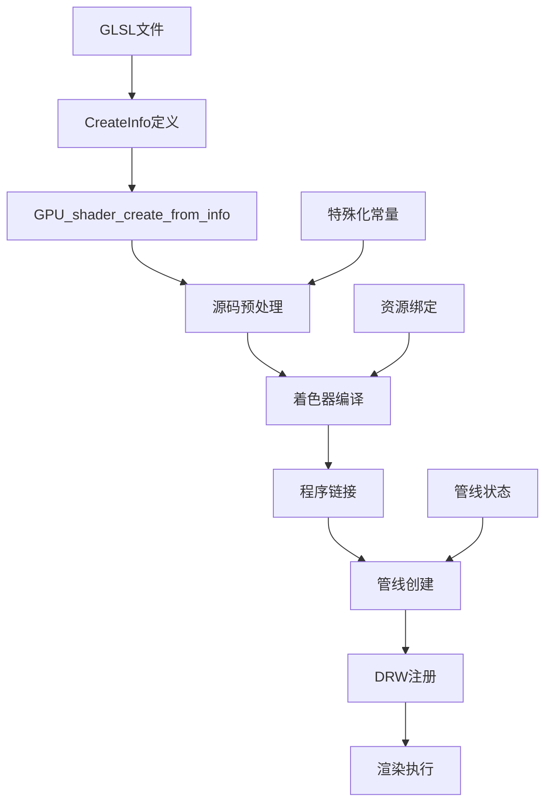

# GLSL与C++调用机制详解

## 概述

Blender中的着色器系统是一个复杂的架构，它将GLSL着色器文件与C++代码紧密集成，通过CreateInfo系统实现着色器的动态加载、编译和管理。本文档详细分析这一机制的工作原理。

## 目录

- [CreateInfo系统架构](#createinfo系统架构)
- [着色器加载流程](#着色器加载流程)
- [编译与管线创建](#编译与管线创建)
- [DRW Manager系统](#drw-manager系统)
- [代码示例分析](#代码示例分析)
- [API参考](#api参考)

## CreateInfo系统架构

### 核心概念

CreateInfo系统是Blender中用于描述和配置着色器的核心机制。它通过结构化的数据来定义着色器的所有属性，包括：

- 着色器阶段（顶点、片段、几何等）
- 资源绑定（uniforms、纹理、缓冲区）
- 管线状态（混合模式、深度测试等）
- 特殊化常量和条件编译

### CreateInfo结构定义

```cpp
// 定义位置: source/blender/gpu/GPU_shader.hh
class ShaderCreateInfo {
public:
    /* 着色器阶段定义 */
    Vector<const char *> vertex_sources;
    Vector<const char *> fragment_sources;
    Vector<const char *> geometry_sources;
    Vector<const char *> compute_sources;
    
    /* 资源定义 */
    Vector<GPUUniformBuf *> uniform_buffers;
    Vector<GPUStorageBuf *> storage_buffers;
    Vector<GPUTexture *> textures;
    
    /* 管线状态 */
    GPUPrimType prim_type = GPU_PRIM_TRI_STRIP;
    GPUBlendState blend_state;
    GPUDepthState depth_state;
    
    /* 特殊化 */
    Vector<ShaderSpecializationConstant> specialization_constants;
    
    /* 构造函数 */
    ShaderCreateInfo(const char *name);
    ~ShaderCreateInfo();
};
```

### 着色器资源描述

```cpp
// 定义位置: source/blender/gpu/GPU_shader.hh
struct ShaderResource {
    enum class Type {
        UNIFORM,
        UNIFORM_BUFFER,
        STORAGE_BUFFER,
        TEXTURE,
        IMAGE,
        SAMPLER
    };
    
    Type type;
    const char *name;
    int binding;
    int location;
    // 其他属性...
};
```

## 着色器加载流程

### 流程图



### 详细加载步骤

#### 1. GLSL文件准备

GLSL文件通常位于`source/blender/gpu/shaders/`目录下，按功能模块组织：

```
source/blender/gpu/shaders/
├── common/
│   ├── globals.glsl
│   ├── math_lib.glsl
│   └── gpu_shader_common_defines.glsl
├── overlay/
│   ├── overlay_vert.glsl
│   ├── overlay_frag.glsl
│   └── overlay_common_lib.glsl
└── eevee/
    ├── eevee_lit_surface_vert.glsl
    └── eevee_lit_surface_frag.glsl
```

#### 2. CreateInfo配置

```cpp
// 定义位置: source/blender/draw/engines/overlay/overlay_shader.cc
ShaderCreateInfo overlay_shader_create_info()
{
    ShaderCreateInfo info("overlay_shader");
    
    /* 添加着色器源码 */
    info.vertex_source(overlay_vert_glsl);
    info.fragment_source(overlay_frag_glsl);
    
    /* 添加公共库 */
    info.define("OVERLAY");
    info.define("USE_GLOBAL_CLIP_PLANES");
    
    /* 资源绑定 */
    info.uniform_buf(0, "GlobalsBlock", "globals");
    info.uniform_buf(1, "ObjectBlock", "object");
    
    /* 顶点属性 */
    info.vertex_attribute(0, "pos", GPU_COMP_F32, 3, GPU_FETCH_FLOAT);
    info.vertex_attribute(1, "nor", GPU_COMP_F32, 3, GPU_FETCH_FLOAT);
    
    /* 管线状态 */
    info.depth_write(true);
    info.depth_test(GPU_DEPTH_LESS_EQUAL);
    
    return info;
}
```

#### 3. 着色器创建

```cpp
// 定义位置: source/blender/gpu/GPU_shader.cc
GPUShader *GPU_shader_create_from_info(const ShaderCreateInfo *info)
{
    /* 创建着色器对象 */
    GPUShader *shader = gpu_shader_create(info->name);
    
    /* 处理各个阶段 */
    if (info->vertex_sources.size() > 0) {
        gpu_shader_stage_compile(shader, GPU_SHADER_STAGE_VERTEX, 
                                 info->vertex_sources);
    }
    
    if (info->fragment_sources.size() > 0) {
        gpu_shader_stage_compile(shader, GPU_SHADER_STAGE_FRAGMENT,
                                 info->fragment_sources);
    }
    
    /* 链接程序 */
    if (!gpu_shader_link(shader)) {
        GPU_shader_free(shader);
        return nullptr;
    }
    
    /* 查询uniform位置 */
    gpu_shader_cache_uniform_locations(shader, info);
    
    return shader;
}
```

## 编译与管线创建

### 源码预处理

```cpp
// 定义位置: source/blender/gpu/intern/gpu_shader.cc
static char *gpu_shader_preprocess(const char *source, const ShaderCreateInfo *info)
{
    char *processed = BLI_strdup(source);
    
    /* 处理#include指令 */
    processed = gpu_shader_process_includes(processed);
    
    /* 应用定义 */
    for (const auto &define : info->defines) {
        char define_str[256];
        snprintf(define_str, sizeof(define_str), "#define %s %s", 
                define.key, define.value);
        processed = gpu_shader_insert_define(processed, define_str);
    }
    
    /* 处理条件编译 */
    processed = gpu_shader_process_conditionals(processed, info);
    
    return processed;
}
```

### 着色器编译

```cpp
// 定义位置: source/blender/gpu/intern/gpu_shader.cc
static bool gpu_shader_stage_compile(GPUShader *shader, 
                                     GPUShaderStage stage,
                                     const Vector<const char *> &sources)
{
    /* 合并所有源码 */
    std::string combined_source;
    for (const char *src : sources) {
        combined_source += src;
        combined_source += "\n";
    }
    
    /* 预处理 */
    char *processed = gpu_shader_preprocess(combined_source.c_str(), shader->info);
    
    /* 创建着色器对象 */
    GLuint gl_shader = glCreateShader(gpu_stage_to_gl(stage));
    
    /* 编译 */
    glShaderSource(gl_shader, 1, &processed, nullptr);
    glCompileShader(gl_shader);
    
    /* 检查编译状态 */
    GLint compile_status;
    glGetShaderiv(gl_shader, GL_COMPILE_STATUS, &compile_status);
    
    if (compile_status == GL_FALSE) {
        char log[1024];
        glGetShaderInfoLog(gl_shader, sizeof(log), nullptr, log);
        printf("Shader compilation failed: %s\n", log);
        return false;
    }
    
    /* 附加到程序 */
    glAttachShader(shader->program, gl_shader);
    
    MEM_freeN(processed);
    return true;
}
```

### 管线状态配置

```cpp
// 定义位置: source/blender/gpu/intern/gpu_state.cc
void GPU_pipeline_state_from_info(GPUPipeline *pipeline, 
                                  const ShaderCreateInfo *info)
{
    /* 深度状态 */
    if (info->depth_state.write_enable) {
        pipeline->depth_write = true;
    }
    pipeline->depth_func = info->depth_state.func;
    
    /* 混合状态 */
    pipeline->blend_enabled = info->blend_state.enabled;
    if (pipeline->blend_enabled) {
        pipeline->blend_src = info->blend_state.src_factor;
        pipeline->blend_dst = info->blend_state.dst_factor;
    }
    
    /* 裁剪状态 */
    pipeline->cull_face = info->cull_face;
    pipeline->front_face = info->front_face;
    
    /* 图元类型 */
    pipeline->prim_type = info->prim_type;
}
```

## DRW Manager系统

### DRW Manager概述

DRW (Drawing) Manager是Blender的渲染管理层，负责着色器的生命周期管理、批处理创建和渲染调用协调。

### 着色器注册机制

```cpp
// 定义位置: source/blender/draw/intern/draw_manager.cc
class DRWManager {
private:
    Map<std::string, GPUShader *> shader_cache_;
    Vector<DRWShadingGroup *> active_shading_groups_;
    
public:
    /* 着色器获取或创建 */
    GPUShader *shader_get(const ShaderCreateInfo &info)
    {
        /* 检查缓存 */
        if (shader_cache_.contains(info.name)) {
            return shader_cache_.lookup(info.name);
        }
        
        /* 创建新着色器 */
        GPUShader *shader = GPU_shader_create_from_info(&info);
        if (shader) {
            shader_cache_.add_new(info.name, shader);
        }
        
        return shader;
    }
    
    /* 创建着色组 */
    DRWShadingGroup *shgroup_create(GPUShader *shader, 
                                   DRWPass *pass,
                                   const float (*mat)[4])
    {
        DRWShadingGroup *shgroup = DRW_shgroup_create(shader, pass);
        
        if (mat) {
            DRW_shgroup_uniform_mat4(shgroup, "ModelMatrix", mat);
        }
        
        return shgroup;
    }
};
```

### 批处理系统

```cpp
// 定义位置: source/blender/draw/intern/draw_manager_instance_data.cc
class DRWShadingGroup {
public:
    GPUShader *shader;
    Vector<DRWCall *> calls;
    
    /* 添加绘制调用 */
    DRWCall *call_add(GPUBatch *batch, 
                      const float (*obmat)[4],
                      void *user_data)
    {
        DRWCall *call = MEM_new<DRWCall>("DRWCall");
        call->batch = batch;
        if (obmat) {
            copy_m4_m4(call->obmat, obmat);
        }
        call->user_data = user_data;
        
        calls.append(call);
        return call;
    }
    
    /* 执行绘制 */
    void draw()
    {
        GPU_shader_bind(shader);
        
        for (DRWCall *call : calls) {
            /* 设置uniforms */
            if (call->obmat) {
                GPU_shader_uniform_mat4(shader, "ModelMatrix", call->obmat);
            }
            
            /* 执行绘制 */
            GPU_batch_draw(call->batch);
        }
        
        GPU_shader_unbind();
    }
};
```

## 代码示例分析

### Overlay引擎着色器示例

```cpp
// 定义位置: source/blender/draw/engines/overlay/overlay_engine.cc
class OverlayEngine {
private:
    DRWShadingGroup *shgroup_outline_;
    DRWShadingGroup *shgroup_wire_;
    GPUShader *shader_overlay_;
    
public:
    void init()
    {
        /* 创建CreateInfo */
        ShaderCreateInfo info = overlay_shader_create_info();
        
        /* 获取着色器 */
        shader_overlay_ = DRW_shader_library_create_shader(info);
        
        /* 创建Pass */
        DRWPass *pass_outline = DRW_pass_create("Outline Pass", 
                                               DRW_STATE_WRITE_COLOR | 
                                               DRW_STATE_WRITE_DEPTH);
        
        /* 创建着色组 */
        shgroup_outline_ = DRW_shgroup_create(shader_overlay_, pass_outline);
        DRW_shgroup_uniform_block(shgroup_outline_, "globalsBlock", 
                                  globals_ubo);
        DRW_shgroup_uniform_block(shgroup_outline_, "objectBlock", 
                                  object_ubo);
        
        /* 设置顶点格式 */
        DRW_shgroup_attribute(shgroup_outline_, &pos_attr, "pos");
        DRW_shgroup_attribute(shgroup_outline_, &nor_attr, "nor");
    }
    
    void draw(Object *ob)
    {
        /* 获取几何数据 */
        GPUBatch *batch = DRW_cache_object_surface_get(ob);
        
        /* 添加绘制调用 */
        DRW_shgroup_call(shgroup_outline_, batch, ob->object_to_world);
    }
};
```

### 着色器库系统

```cpp
// 定义位置: source/blender/draw/intern/draw_shader_library.cc
class DrawShaderLibrary {
private:
    Map<std::string, const char *> shader_sources_;
    Map<std::string, ShaderCreateInfo *> create_infos_;
    
public:
    /* 注册着色器源码 */
    void register_shader(const char *name, const char *source)
    {
        shader_sources_.add_new(name, source);
    }
    
    /* 注册CreateInfo */
    void register_create_info(const char *name, ShaderCreateInfo *info)
    {
        create_infos_.add_new(name, info);
    }
    
    /* 创建着色器 */
    GPUShader *create_shader(const char *name)
    {
        ShaderCreateInfo *info = create_infos_.lookup_default(name, nullptr);
        if (!info) {
            return nullptr;
        }
        
        /* 替换源码引用 */
        for (const char *&src : info->vertex_sources) {
            if (shader_sources_.contains(src)) {
                src = shader_sources_.lookup(src);
            }
        }
        
        return GPU_shader_create_from_info(info);
    }
};
```

## API参考

### 核心API函数

#### GPUShader相关

```cpp
// 定义位置: source/blender/gpu/GPU_shader.h

/* 从CreateInfo创建着色器 */
GPUShader *GPU_shader_create_from_info(const ShaderCreateInfo *info);

/* 绑定/解绑着色器 */
void GPU_shader_bind(GPUShader *shader);
void GPU_shader_unbind(void);

/* Uniform设置 */
void GPU_shader_uniform_float(GPUShader *shader, const char *name, float value);
void GPU_shader_uniform_vec2(GPUShader *shader, const char *name, const float value[2]);
void GPU_shader_uniform_mat4(GPUShader *shader, const char *name, const float matrix[4][4]);

/* Uniform Buffer */
void GPU_shader_uniform_block(GPUShader *shader, int binding, const char *name);
```

#### DRW相关

```cpp
// 定义位置: source/blender/draw/DRW_shader.h

/* 创建着色器 */
GPUShader *DRW_shader_create_with_info(const ShaderCreateInfo *info);

/* 着色器库 */
GPUShader *DRW_shader_library_create_shader(const ShaderCreateInfo &info);
void DRW_shader_library_add_file(const char *filepath);

/* 着色组 */
DRWShadingGroup *DRW_shgroup_create(GPUShader *shader, DRWPass *pass);
void DRW_shgroup_uniform_texture(DRWShadingGroup *shgrp, const char *name, GPUTexture *tex);
void DRW_shgroup_uniform_mat4(DRWShadingGroup *shgrp, const char *name, const float (*mat)[4]);
DRWCall *DRW_shgroup_call(DRWShadingGroup *shgrp, GPUBatch *geom, const float (*obmat)[4]);
```

### 着色器资源定义

#### Uniform Buffer示例

```cpp
// 定义位置: source/blender/gpu/shaders/common/gpu_shader_shared.hh

/* Globals Block */
struct GlobalsBlock {
    float4x4 ViewMatrix;
    float4x4 ProjectionMatrix;
    float4x4 ViewProjectionMatrix;
    float3 CameraPos;
    float _pad0;
    float2 ViewportSize;
    float _pad1[2];
    float CurrentTime;
};

/* Object Block */
struct ObjectBlock {
    float4x4 ModelMatrix;
    float4x4 ModelMatrixInverse;
    float4x4 NormalMatrix;
    float4 ObjectColor;
    float ObjectInfo;
};
```

#### GLSL中的使用

```glsl
// 定义位置: source/blender/gpu/shaders/overlay/overlay_common_lib.glsl

layout(std140, binding = 0) uniform globalsBlock {
    mat4 ViewMatrix;
    mat4 ProjectionMatrix;
    mat4 ViewProjectionMatrix;
    vec3 CameraPos;
    vec2 ViewportSize;
    float CurrentTime;
};

layout(std140, binding = 1) uniform objectBlock {
    mat4 ModelMatrix;
    mat4 ModelMatrixInverse;
    mat4 NormalMatrix;
    vec4 ObjectColor;
    float ObjectInfo;
};

in vec3 pos;
in vec3 nor;

out vec3 v_pos;
out vec3 v_nor;

void main()
{
    vec4 world_pos = ModelMatrix * vec4(pos, 1.0);
    v_pos = world_pos.xyz;
    v_nor = mat3(NormalMatrix) * nor;
    gl_Position = ViewProjectionMatrix * world_pos;
}
```

## 最佳实践

### 性能优化

1. **着色器缓存**: 重用已编译的着色器实例
2. **批处理**: 合并相同着色器的绘制调用
3. **特殊化**: 使用常量减少条件分支
4. **资源绑定**: 最小化状态切换

### 调试技巧

1. **编译日志**: 检查着色器编译错误
2. **Uniform验证**: 确认所有uniform都被设置
3. **性能分析**: 使用GPU调试工具分析瓶颈
4. **内存管理**: 及时释放不需要的着色器

## 总结

Blender的GLSL与C++集成机制通过CreateInfo系统提供了一个强大而灵活的着色器管理框架。这个系统不仅简化了着色器的创建和使用，还提供了高效的资源管理和性能优化机制。通过深入理解这一架构，开发者可以更好地利用Blender的渲染系统，创建高性能的图形应用程序。

## 参考链接

- [GLSL着色器基础](./01-GLSL着色器基础.md)
- [Overlay引擎着色器系统](./02-Overlay引擎着色器系统.md)
- [调试与优化指南](./04-调试与优化指南.md)