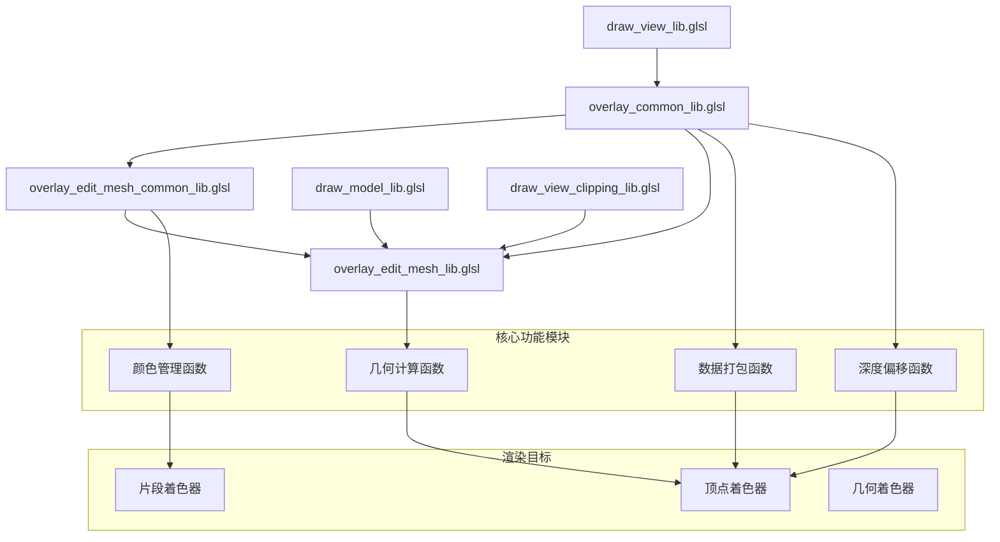
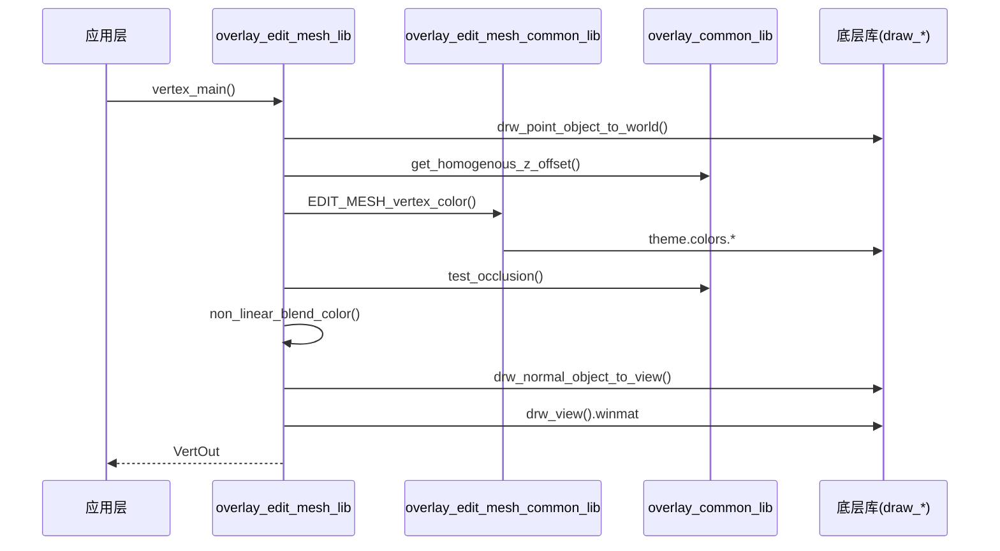

# Overlay通用库系统详解

## 目录
- [1. 概述](#概述)
- [2. 通用库架构](#通用库架构)
  - [2.1. overlay_common_lib.glsl](#21-overlay_common_libglsl)
  - [2.2. overlay_edit_mesh_common_lib.glsl](#22-overlay_edit_mesh_common_libglsl)
  - [2.3. overlay_edit_mesh_lib.glsl](#23-overlay_edit_mesh_libglsl)
- [3. 核心函数解析](#核心函数解析)
  - [3.1. 数据打包与解包函数](#31-数据打包与解包函数)
  - [3.2. 颜色管理函数](#32-颜色管理函数)
  - [3.3. 几何计算函数](#33-几何计算函数)
  - [3.4. 深度偏移函数](#34-深度偏移函数)
- [4. 数据结构与常量](#数据结构与常量)
- [5. 库函数关系图](#库函数关系图)
- [6. 设计思路与使用场景](#设计思路与使用场景)

## 1. 概述 

Overlay引擎的通用库系统是Blender 3D视图中所有叠加元素渲染的核心基础设施。这些库提供了数据打包、颜色管理、几何计算、深度处理等通用功能，支持线框、顶点、面片等各种编辑模式元素的渲染。

### 1.1. 库系统的设计目标

1. **代码复用**: 避免在多个shader中重复实现相同功能
2. **性能优化**: 通过统一的数据打包算法减少GPU内存带宽
3. **维护性**: 集中管理通用的渲染逻辑和数学运算
4. **一致性**: 确保所有叠加元素使用相同的颜色空间和坐标系统

## 2. 通用库架构 

### 2.1. overlay_common_lib.glsl 

这是最基础的通用库，提供了所有overlay shader都需要的核心功能：

**定义位置**: `source/blender/draw/engines/overlay/shaders/overlay_common_lib.glsl:1-74`

```glsl
/* SPDX-FileCopyrightText: 2020-2022 Blender Authors
 *
 * SPDX-License-Identifier: GPL-2.0-or-later */

#pragma once

#include "draw_view_lib.glsl"
```

该库主要包含：
- 线框渲染常量定义
- 矩阵数据提取函数
- 线条数据打包算法
- 齐次坐标深度偏移计算
- 投影矩阵计算工具

### 2.2. overlay_edit_mesh_common_lib.glsl 

专门用于网格编辑模式的颜色管理：

**定义位置**: `source/blender/draw/engines/overlay/shaders/overlay_edit_mesh_common_lib.glsl:1-102`

```glsl
/* SPDX-FileCopyrightText: 2018-2023 Blender Authors
 *
 * SPDX-License-Identifier: GPL-2.0-or-later */

#pragma once

#include "infos/overlay_edit_mode_infos.hh"

SHADER_LIBRARY_CREATE_INFO(overlay_edit_mesh_common)
```

该库专注于：
- 边线颜色计算（外层/内层）
- 顶点颜色管理
- 面片颜色处理
- 面点颜色控制

### 2.3. overlay_edit_mesh_lib.glsl 

网格编辑模式的顶点处理主库：

**定义位置**: `source/blender/draw/engines/overlay/shaders/overlay_edit_mesh_lib.glsl:1-146`

```glsl
/* SPDX-FileCopyrightText: 2017-2024 Blender Authors
 *
 * SPDX-License-Identifier: GPL-2.0-or-later */

#pragma once

#include "infos/overlay_edit_mode_infos.hh"

SHADER_LIBRARY_CREATE_INFO(overlay_edit_mesh_common)
SHADER_LIBRARY_CREATE_INFO(draw_modelmat)

#include "draw_model_lib.glsl"
#include "draw_view_clipping_lib.glsl"
#include "draw_view_lib.glsl"
#include "gpu_shader_math_vector_lib.glsl"
#include "gpu_shader_utildefines_lib.glsl"
#include "overlay_common_lib.glsl"
#include "overlay_edit_mesh_common_lib.glsl"
```

该库提供：
- 顶点输入/输出数据结构
- 遮挡测试函数
- 非线性颜色混合
- 主顶点处理流程

## 3. 核心函数解析 

### 3.1. 数据打包与解包函数 

#### 3.1.1. extract_matrix_packed_data()

**功能**: 从4x4矩阵的最后一列提取打包的整数数据，并规范化为0-1范围。

**定义位置**: `source/blender/draw/engines/overlay/shaders/overlay_common_lib.glsl:14-26`

```glsl
float4x4 extract_matrix_packed_data(float4x4 mat, out float4 dataA, out float4 dataB)
{
  constexpr float div = 1.0f / 255.0f;
  int a = int(mat[0][3]);
  int b = int(mat[1][3]);
  int c = int(mat[2][3]);
  int d = int(mat[3][3]);
  dataA = float4(a & 0xFF, a >> 8, b & 0xFF, b >> 8) * div;
  dataB = float4(c & 0xFF, c >> 8, d & 0xFF, d >> 8) * div;
  mat[0][3] = mat[1][3] = mat[2][3] = 0.0f;
  mat[3][3] = 1.0f;
  return mat;
}
```

**参数解析**:
- `mat`: 输入的4x4矩阵，最后一列包含打包的整数数据
- `dataA`: 输出前两个整数解包后的4个float值（0-1范围）
- `dataB`: 输出后两个整数解包后的4个float值（0-1范围）

**数据打包算法**:
```glsl
// 假设原始数据为四个32位整数: a, b, c, d
// 每个整数被拆分为两个8位分量
dataA.x = (a & 0xFF) / 255.0f      // a的低8位
dataA.y = (a >> 8) / 255.0f        // a的高8位
dataA.z = (b & 0xFF) / 255.0f      // b的低8位
dataA.w = (b >> 8) / 255.0f        // b的高8位
// dataB同理处理c和d
```

**设计意图**: 这种打包方式允许在矩阵的尾随列中存储额外的属性数据（如颜色、标志位等），同时保持矩阵的标准结构。

#### 3.1.2. pack_line_data()

**功能**: 将线条的几何信息打包到4维向量中，用于反走样处理。

**定义位置**: `source/blender/draw/engines/overlay/shaders/overlay_common_lib.glsl:29-44`

```glsl
float4 pack_line_data(float2 frag_co, float2 edge_start, float2 edge_pos)
{
  float2 edge = edge_start - edge_pos;
  float len = length(edge);
  if (len > 0.0f) {
    edge /= len;
    float2 perp = float2(-edge.y, edge.x);
    float dist = dot(perp, frag_co - edge_start);
    /* Add 0.1f to differentiate with cleared pixels. */
    return float4(perp * 0.5f + 0.5f, dist * 0.25f + 0.5f + 0.1f, 1.0f);
  }
  else {
    /* Default line if the origin is perfectly aligned with a pixel. */
    return float4(1.0f, 0.0f, 0.5f + 0.1f, 1.0f);
  }
}
```

**参数解析**:
- `frag_co`: 当前片段的屏幕坐标
- `edge_start`: 线条起点坐标
- `edge_pos`: 线段终点坐标

**打包算法分析**:
1. **方向向量计算**: `edge = edge_start - edge_pos` 获得线段方向
2. **归一化**: `edge /= len` 得到单位方向向量
3. **垂直向量**: `perp = float2(-edge.y, edge.x)` 计算垂直方向
4. **距离计算**: `dist = dot(perp, frag_co - edge_start)` 计算片段到线条的距离
5. **数据规范化**: 
   - `perp * 0.5f + 0.5f`: 将[-1,1]范围的垂直向量映射到[0,1]
   - `dist * 0.25f + 0.5f + 0.1f`: 距离映射到[0,1]并添加偏移

### 3.2. 颜色管理函数 

#### 3.2.1. EDIT_MESH_edge_color_outer()

**功能**: 计算网格边线的外层颜色，支持多种边线类型的颜色编码。

**定义位置**: `source/blender/draw/engines/overlay/shaders/overlay_edit_mesh_common_lib.glsl:11-20`

```glsl
float4 EDIT_MESH_edge_color_outer(uint edge_flag, uint face_flag, float crease, float bweight)
{
  float4 color = float4(0.0f);
  color = ((edge_flag & EDGE_FREESTYLE) != 0u) ? theme.colors.edge_freestyle : color;
  color = ((edge_flag & EDGE_SHARP) != 0u) ? theme.colors.edge_sharp : color;
  color = (crease > 0.0f) ? float4(theme.colors.edge_crease.rgb, crease) : color;
  color = (bweight > 0.0f) ? float4(theme.colors.edge_bweight.rgb, bweight) : color;
  color = ((edge_flag & EDGE_SEAM) != 0u) ? theme.colors.edge_seam : color;
  return color;
}
```

**优先级顺序**（按优先级从高到低）:
1. **Freestyle边线** (`EDGE_FREESTYLE`): 用于标记渲染风格边
2. **锐利边线** (`EDGE_SHARP`): 标记法线不连续的边
3. **折痕边线** (`crease > 0.0f`): 显示细分建模的折痕强度
4. **边权** (`bweight > 0.0f`): 显示边的权重值
5. **接缝边线** (`EDGE_SEAM`): UV展开的接缝标记

#### 3.2.2. EDIT_MESH_edge_color_inner()

**功能**: 计算网格边线的内层颜色，主要用于选择状态显示。

**定义位置**: `source/blender/draw/engines/overlay/shaders/overlay_edit_mesh_common_lib.glsl:22-31`

```glsl
float4 EDIT_MESH_edge_color_inner(uint edge_flag)
{
  float4 color = theme.colors.wire_edit;
  float4 selected_edge_col = (select_edge) ? theme.colors.edge_mode_select :
                                             theme.colors.edge_select;
  color = ((edge_flag & EDGE_SELECTED) != 0u) ? selected_edge_col : color;
  color = ((edge_flag & EDGE_ACTIVE) != 0u) ? theme.colors.edit_mesh_active : color;
  color.a = 1.0f;
  return color;
}
```

**颜色选择逻辑**:
- **默认颜色**: `theme.colors.wire_edit`（编辑模式线框色）
- **选择模式**: 根据`select_edge`状态选择不同的选择颜色
  - 边选择模式: `theme.colors.edge_mode_select`
  - 其他模式: `theme.colors.edge_select`
- **激活状态**: `theme.colors.edit_mesh_active`（当前活动元素）

#### 3.2.3. non_linear_blend_color()

**功能**: 执行非线性颜色混合，提供更好的视觉效果。

**定义位置**: `source/blender/draw/engines/overlay/shaders/overlay_edit_mesh_lib.glsl:35-41`

```glsl
float3 non_linear_blend_color(float3 col1, float3 col2, float fac)
{
  col1 = pow(col1, float3(1.0f / 2.2f));
  col2 = pow(col2, float3(1.0f / 2.2f));
  float3 col = mix(col1, col2, fac);
  return pow(col, float3(2.2f));
}
```

**Gamma校正原理**:
1. **线性化**: `pow(col, 1.0/2.2)` 将sRGB颜色转换为线性颜色空间
2. **混合**: `mix()` 在线性空间中进行颜色插值
3. **重新编码**: `pow(col, 2.2)` 将结果转换回sRGB空间

**为什么需要非线性混合**: 
线性颜色空间中的混合更符合物理规律，避免颜色混合时的暗化和饱和度失真。

### 3.3. 几何计算函数 

#### 3.3.1. test_occlusion()

**功能**: 测试顶点是否被其他几何体遮挡。

**定义位置**: `source/blender/draw/engines/overlay/shaders/overlay_edit_mesh_lib.glsl:29-33`

```glsl
bool test_occlusion(float4 gpu_position)
{
  float3 ndc = (gpu_position.xyz / gpu_position.w) * 0.5f + 0.5f;
  return ndc.z > texture(depth_tx, ndc.xy).r;
}
```

**NDC坐标转换**:
```glsl
float3 ndc = (gpu_position.xyz / gpu_position.w) * 0.5f + 0.5f;
// 1. 透视除法: xyz / w -> 获得标准化设备坐标[-1,1]
// 2. 映射到[0,1]: * 0.5 + 0.5 -> 纹理坐标范围
```

**深度测试逻辑**:
- 如果当前点的深度值(`ndc.z`)大于深度缓冲中的值，则被遮挡

#### 3.3.2. mul_project_m4_v3_zfac()

**功能**: 计算投影矩阵对3D点的深度影响因子。

**定义位置**: `source/blender/draw/engines/overlay/shaders/overlay_common_lib.glsl:67-73`

```glsl
float mul_project_m4_v3_zfac(float pixel_fac, float3 co)
{
  float3 vP = drw_point_world_to_view(co).xyz;
  float4x4 winmat = drw_view().winmat;
  return pixel_fac *
         (winmat[0][3] * vP.x + winmat[1][3] * vP.y + winmat[2][3] * vP.z + winmat[3][3]);
}
```

**数学原理**:
- **视图空间变换**: `drw_point_world_to_view(co)` 将世界坐标转换为视图坐标
- **投影矩阵分量**: 提取投影矩阵的最后一列，这些分量影响透视投影的深度计算
- **像素因子**: `pixel_fac` 用于根据屏幕像素密度调整深度值

### 3.4. 深度偏移函数 

#### 3.4.1. get_homogenous_z_offset()

**功能**: 计算齐次坐标系中的Z偏移，用于防止z-fighting。

**定义位置**: `source/blender/draw/engines/overlay/shaders/overlay_common_lib.glsl:49-65`

```glsl
float get_homogenous_z_offset(float4x4 winmat, float vs_z, float hs_w, float vs_offset)
{
  if (vs_offset == 0.0f) {
    /* Don't calculate homogenous offset if view-space offset is zero. */
    return 0.0f;
  }
  else if (winmat[3][3] == 0.0f) {
    /* Clamp offset to half of Z to avoid floating point precision errors. */
    vs_offset = min(vs_offset, vs_z * -0.5f);
    /* From "Projection Matrix Tricks" by Eric Lengyel:
     * http://www.terathon.com/gdc07_lengyel.pdf (p. 24 Depth Modification) */
    return winmat[3][2] * (vs_offset / (vs_z * (vs_z + vs_offset))) * hs_w;
  }
  else {
    return winmat[2][2] * vs_offset * hs_w;
  }
}
```

**投影类型判断**:
- **透视投影** (`winmat[3][3] == 0.0f`): 使用复杂的深度偏移公式
- **正交投影** (`winmat[3][3] != 0.0f`): 简单的线性偏移

**透视投影深度偏移公式**:
```glsl
offset = winmat[3][2] * (vs_offset / (vs_z * (vs_z + vs_offset))) * hs_w;
```

这个公式源自Eric Lengyel的"Projection Matrix Tricks"，提供了非线性深度偏移，确保在不同深度下都有合适的偏移量。

## 4. 数据结构与常量 

### 4.1. 着色颜色类型常量

**定义位置**: `source/blender/draw/engines/overlay/shaders/overlay_common_lib.glsl:9-12`

```glsl
/* Wire Color Types, matching eV3DShadingColorType. */
#define V3D_SHADING_SINGLE_COLOR 2
#define V3D_SHADING_OBJECT_COLOR 4
#define V3D_SHADING_RANDOM_COLOR 1
```

**常量说明**:
- `V3D_SHADING_SINGLE_COLOR`: 使用单一颜色进行着色
- `V3D_SHADING_OBJECT_COLOR`: 使用对象颜色进行着色
- `V3D_SHADING_RANDOM_COLOR`: 为每个对象分配随机颜色

### 4.2. 顶点输入数据结构

**定义位置**: `source/blender/draw/engines/overlay/shaders/overlay_edit_mesh_lib.glsl:20-27`

```glsl
struct VertIn {
  /* Local Position. */
  float3 lP;
  /* Local Vertex Normal. */
  float3 lN;
  /* Edit Flags and Data. */
  uint4 e_data;
};
```

**字段解析**:
- `lP`: 局部坐标系中的顶点位置
- `lN`: 局部坐标系中的顶点法线
- `e_data`: 编辑标志和数据的4维向量，包含选择状态、边线类型等信息

### 4.3. 顶点输出数据结构

**定义位置**: `source/blender/draw/engines/overlay/shaders/overlay_edit_mesh_lib.glsl:43-49`

```glsl
struct VertOut {
  float4 gpu_position;
  float4 final_color;
  float4 final_color_outer;
  float3 world_position;
  uint select_override;
};
```

**字段解析**:
- `gpu_position`: GPU顶点位置（齐次坐标）
- `final_color`: 最终颜色（内层）
- `final_color_outer`: 最终外层颜色
- `world_position`: 世界坐标系位置
- `select_override`: 选择状态覆盖标志

## 5. 库函数关系图 



### 5.1. 函数调用层次关系



## 6. 设计思路与使用场景 

### 6.1. 设计思路

#### 6.1.1. 模块化设计

Overlay通用库采用分层模块化设计：

```
应用层 (具体shader)
    ↓
编辑模式专用层 (overlay_edit_mesh_lib.glsl)
    ↓
编辑模式通用层 (overlay_edit_mesh_common_lib.glsl)  
    ↓
基础通用层 (overlay_common_lib.glsl)
    ↓
底层渲染库 (draw_*.glsl)
```

每一层都有明确的职责：
- **基础通用层**: 提供所有overlay都需要的基础数学和数据操作
- **编辑模式通用层**: 专注于网格编辑的颜色和状态管理
- **编辑模式专用层**: 处理顶点变换和复杂的渲染逻辑

#### 6.1.2. 数据优化策略

1. **位压缩存储**: 使用32位整数的位域存储多个标志位
2. **浮点数打包**: 将多个小数值打包到单个浮点数的分量中
3. **矩阵数据复用**: 利用变换矩阵的尾随列存储额外属性

#### 6.1.3. 性能优化考虑

1. **分支最小化**: 在可能的情况下避免GPU分支
2. **预计算**: 在CPU端预计算常用值（如theme colors）
3. **缓存友好**: 数据结构按照GPU访问模式优化

### 6.2. 使用场景

#### 6.2.1. 网格编辑模式

**典型使用流程**:
```glsl
// 1. 顶点着色器中使用
VertOut vert_out = vertex_main(vert_in);

// 2. 自动调用颜色管理
vert_out.final_color = EDIT_MESH_vertex_color(flags, crease);

// 3. 应用深度偏移防止z-fighting
vert_out.gpu_position.z += get_homogenous_z_offset(...);

// 4. 片段着色器中使用
fragColor = vert_out.final_color;
```

#### 6.2.2. 线框渲染

**线条反走样处理**:
```glsl
// 在片段着色器中
float4 line_data = pack_line_data(fragCoord, lineStart, lineEnd);
float distance = calculate_line_distance(line_data);
float alpha = smoothstep(lineWidth, 0.0, distance);
fragColor = finalColor * alpha;
```

#### 6.2.3. 选择高亮

**多层级颜色系统**:
```glsl
// 内层颜色：基础选择状态
float4 innerColor = EDIT_MESH_edge_color_inner(edgeFlag);

// 外层颜色：特殊属性（折痕、接缝等）
float4 outerColor = EDIT_MESH_edge_color_outer(edgeFlag, faceFlag, crease, bweight);

// 最终混合
fragColor = blendColors(innerColor, outerColor);
```

### 6.3. 扩展指南

#### 6.3.1. 添加新的边线类型

1. 在`overlay_edit_mesh_common_lib.glsl`中添加新的标志位
2. 修改`EDIT_MESH_edge_color_outer()`函数处理新类型
3. 更新CPU端的标志位定义

#### 6.3.2. 扩展数据打包

1. 在`overlay_common_lib.glsl`中添加新的解包函数
2. 确保数据格式与CPU端一致
3. 更新相关shader以使用新数据

#### 6.3.3. 性能优化建议

1. **批处理**: 将相似元素合并为单次绘制调用
2. **LOD**: 根据距离使用不同细节级别
3. **实例化**: 对重复元素使用实例化渲染
4. **计算着色器**: 将复杂计算移至计算着色器预处理

这个通用库系统为Blender的overlay渲染提供了强大而灵活的基础，支持从简单的线框到复杂的编辑模式指示器的各种渲染需求。通过深入理解这些库函数，开发者可以更有效地扩展和优化Blender的3D视图渲染系统。