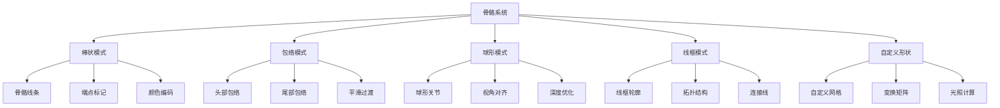
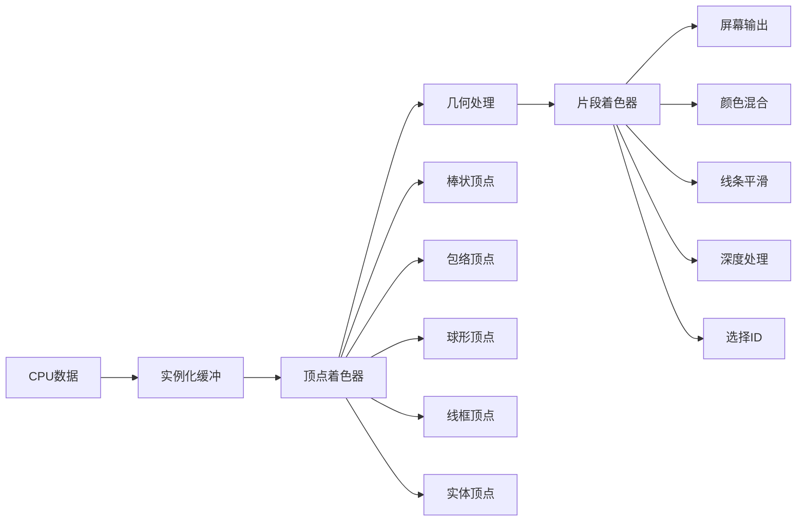
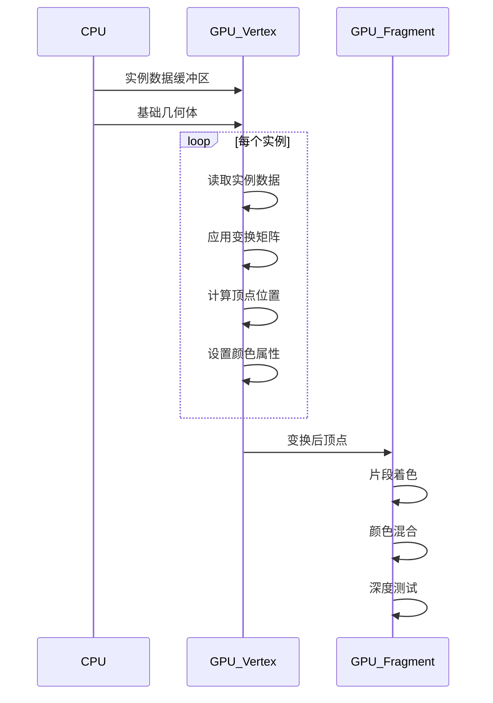
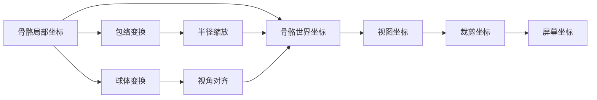

# Overlay骨骼系统详解

## 目录
- [1. 概述](#概述)
- [2. 骨骼系统架构](#骨骼系统架构)
  - [2.1. 骨骼显示模式](#21-骨骼显示模式)
  - [2.2. 着色器架构](#22-着色器架构)
- [3. 骨骼数据结构](#3-骨骼数据结构)
  - [3.1. 骨骼包络数据](#31-骨骼包络数据)
  - [3.2. 棒状骨骼数据](#32-棒状骨骼数据)
  - [3.3. 通用骨骼数据](#33-通用骨骼数据)
- [4. 核心着色器分析](#4-核心着色器分析)
  - [4.1. 棒状骨骼着色器](#41-棒状骨骼着色器)
  - [4.2. 包络骨骼着色器](#42-包络骨骼着色器)
  - [4.3. 球形骨骼着色器](#43-球形骨骼着色器)
  - [4.4. 线框骨骼着色器](#44-线框骨骼着色器)
  - [4.5. 自定义形状骨骼着色器](#45-自定义形状骨骼着色器)
- [5. 渲染管线分析](#5-渲染管线分析)
  - [5.1. 实例化渲染](#51-实例化渲染)
  - [5.2. 深度处理](#52-深度处理)
  - [5.3. 颜色计算](#53-颜色计算)
- [6. 技术实现细节](#6-技术实现细节)
  - [6.1. 坐标变换](#61-坐标变换)
  - [6.2. 背面剔除](#62-背面剔除)
  - [6.3. 线条平滑](#63-线条平滑)
- [7. 性能优化策略](#7-性能优化策略)
  - [7.1. 实例化优化](#71-实例化优化)
  - [7.2. 深度优化](#72-深度优化)
  - [7.3. 着色器变体](#73-着色器变体)
- [8. 设计模式与扩展性](#8-设计模式与扩展性)
  - [8.1. 统一接口设计](#81-统一接口设计)
  - [8.2. 可扩展架构](#82-可扩展架构)
  - [8.3. 代码复用](#83-代码复用)
- [9. 总结](#9-总结)

## 1. 概述

Blender的Overlay引擎负责3D视口中各种UI元素的渲染，其中骨骼系统是核心组件之一。骨骼系统需要在视口中实时显示骨骼的各种信息，包括骨骼的位置、方向、选择状态、约束关系等。

### 1.1. 设计目标

- **实时性能**: 在复杂场景中保持流畅的交互性能
- **视觉清晰**: 清晰展示骨骼结构、层次关系和状态信息
- **多种显示模式**: 支持棒状、包络、球形、线框、自定义形状等多种显示方式
- **状态反馈**: 准确反映骨骼的选择、激活、约束等状态
- **可扩展性**: 便于添加新的显示模式和功能

### 1.2. 核心特性



## 2. 骨骼系统架构

### 2.1. 骨骼显示模式

Blender支持多种骨骼显示模式，每种模式都有专门优化的着色器：

#### 2.1.1. 棒状模式 (Stick Display)
最基础的骨骼显示方式，使用线条表示骨骼的轴心线。

#### 2.1.2. 包络模式 (Envelope Display)
显示骨骼的影响范围，使用可变形的包络体。

#### 2.1.3. 球形模式 (B-Bone Display)
为B-Bones显示球形变形区域。

#### 2.1.4. 线框模式 (Wire Display)
显示骨骼的自定义形状的线框表示。

#### 2.1.5. 实体模式 (Solid Display)
显示骨骼自定义形状的实体渲染。

### 2.2. 着色器架构



## 3. 骨骼数据结构

### 3.1. 骨骼包络数据

**定义位置**: `overlay_shader_shared.hh:399-437`

```cpp
struct BoneEnvelopeData {
  float4 head_sphere;    // 头部球体: xyz=位置, w=半径
  float4 tail_sphere;    // 尾部球体: xyz=位置, w=半径
  float4 bone_color_and_wire_width;  // 骨骼颜色和线宽
  float4 state_color;    // 状态颜色（选中、激活等）
  float4 x_axis;         // 骨骼局部X轴方向
};
```

**设计思路**:
- `head_sphere`和`tail_sphere`定义包络体的两端球体
- `bone_color_and_wire_width`编码颜色和线宽以节省内存
- `x_axis`用于构建骨骼局部坐标系

### 3.2. 棒状骨骼数据

**定义位置**: `overlay_shader_shared.hh:439-465`

```cpp
struct BoneStickData {
  float4 bone_start;     // 骨骼起点
  float4 bone_end;       // 骨骼终点
  float4 wire_color;     // 线框颜色
  float4 bone_color;     // 骨骼主体颜色
  float4 head_color;     // 头部颜色
  float4 tail_color;     // 尾部颜色
};
```

**设计思路**:
- 分离不同部位的颜色，实现渐变效果
- 支持端点特殊着色，突出骨骼层次关系

### 3.3. 通用骨骼数据

**定义位置**: `overlay_shader_shared.hh:336-372`

```cpp
struct ExtraInstanceData {
  float4 color_;         // 实例颜色
  float4x4 object_to_world; // 对象到世界变换矩阵
};
```

**设计思路**:
- 统一的实例数据结构
- 矩阵编码额外信息（如DOF角度限制）

## 4. 核心着色器分析

### 4.1. 棒状骨骼着色器

#### 4.1.1. 顶点着色器

**定义位置**: `overlay_armature_stick_vert.glsl:21-81`

```glsl
void main()
{
  select_id_set(in_select_buf[gl_InstanceID]);

  StickBoneFlag bone_flag = StickBoneFlag(vclass);
  final_inner_color = flag_test(bone_flag, COL_HEAD) ? data_buf[gl_InstanceID].head_color :
                                                       data_buf[gl_InstanceID].tail_color;
  final_inner_color = flag_test(bone_flag, COL_BONE) ? data_buf[gl_InstanceID].bone_color :
                                                        final_inner_color;
  final_wire_color = (data_buf[gl_InstanceID].wire_color.a > 0.0f) ?
                         data_buf[gl_InstanceID].wire_color :
                         final_inner_color;
  color_fac = flag_test(bone_flag, COL_WIRE) ? 0.0f :
                                               (flag_test(bone_flag, COL_BONE) ? 1.0f : 2.0f);
```

**技术要点**:
1. **颜色分级**: 使用`color_fac`控制颜色混合强度
2. **标志位控制**: `StickBoneFlag`编码颜色和位置信息
3. **实例化渲染**: 每个骨骼实例使用相同的几何体

```glsl
  float4 boneStart_4d = float4(data_buf[gl_InstanceID].bone_start.xyz, 1.0f);
  float4 boneEnd_4d = float4(data_buf[gl_InstanceID].bone_end.xyz, 1.0f);
  float4 v0 = drw_view().viewmat * boneStart_4d;
  float4 v1 = drw_view().viewmat * boneEnd_4d;
```

**坐标变换流程**:
1. 世界坐标 → 视图坐标
2. 裁剪处理（避免透视相机问题）
3. 视图坐标 → 裁剪坐标

```glsl
  /* Clip the bone to the camera origin plane (not the clip plane)
   * to avoid glitches if one end is behind the camera origin (in perspective mode). */
  float clip_dist = (drw_view().winmat[3][3] == 0.0f) ?
                        -1e-7f :
                        1e20f; /* hard-coded, -1e-8f is giving glitches. */
  float3 bvec = v1.xyz - v0.xyz;
  float3 clip_pt = v0.xyz + bvec * ((v0.z - clip_dist) / -bvec.z);
```

**裁剪优化**:
- 防止骨骼端点在相机后方时出现渲染错误
- 使用极小值避免Z-fighting

```glsl
  float2 x_screen_vec = normalize(proj(p1) - proj(p0) + 1e-8f);
  float2 y_screen_vec = float2(x_screen_vec.y, -x_screen_vec.x);

  /* 2D screen aligned pos at the point */
  float2 vpos = pos.x * x_screen_vec + pos.y * y_screen_vec;
  vpos *= (drw_view().winmat[3][3] == 0.0f) ? h : 1.0f;
```

**屏幕空间对齐**:
- 计算骨骼在屏幕空间的方向向量
- 构建垂直坐标系用于线条宽度计算
- 透视模式下根据深度调整宽度

#### 4.1.2. 片段着色器

**定义位置**: `overlay_armature_stick_frag.glsl:11-18`

```glsl
void main()
{
  float fac = smoothstep(1.0f, 0.2f, color_fac);
  frag_color.rgb = mix(final_inner_color.rgb, final_wire_color.rgb, fac);
  frag_color.a = alpha;
  line_output = float4(0.0f);
  select_id_output(select_id);
}
```

**颜色混合策略**:
- 使用`smoothstep`实现平滑的颜色过渡
- `color_fac`控制混合比例
- 支持选择ID输出

### 4.2. 包络骨骼着色器

#### 4.2.1. 顶点着色器

**定义位置**: `overlay_armature_envelope_solid_vert.glsl:13-55`

```glsl
void main()
{
  select_id_set(in_select_buf[gl_InstanceID]);

  float3 bone_vec = data_buf[gl_InstanceID].tail_sphere.xyz -
                    data_buf[gl_InstanceID].head_sphere.xyz;
  float bone_len = max(1e-8f, sqrt(dot(bone_vec, bone_vec)));
  float bone_lenrcp = 1.0f / bone_len;
```

**骨骼向量计算**:
1. 计算骨骼方向向量
2. 计算骨骼长度
3. 避免除零错误

```glsl
#ifdef SMOOTH_ENVELOPE
  float sinb = (data_buf[gl_InstanceID].tail_sphere.w - data_buf[gl_InstanceID].head_sphere.w) *
               bone_lenrcp;
#else
  constexpr float sinb = 0.0f;
#endif
```

**平滑包络**:
- 头尾半径差形成锥形渐变
- 条件编译控制平滑效果

```glsl
  float3 y_axis = bone_vec * bone_lenrcp;
  float3 z_axis = normalize(cross(data_buf[gl_InstanceID].x_axis.xyz, -y_axis));
  float3 x_axis = cross(
      y_axis, z_axis); /* cannot trust data_buf[gl_InstanceID].x_axis.xyz to be orthogonal. */
```

**坐标系构建**:
- Y轴：骨骼方向
- Z轴：与X轴和Y轴垂直
- X轴：完成右手坐标系
- 注释说明不能信任输入的正交性

```glsl
  /* In bone space */
  bool is_head = (pos.z < -sinb);
  sp *= (is_head) ? data_buf[gl_InstanceID].head_sphere.w : data_buf[gl_InstanceID].tail_sphere.w;
  sp.z += (is_head) ? 0.0f : bone_len;
```

**局部空间变换**:
- 根据位置判断是头部还是尾部
- 应用相应的半径缩放
- Z偏移定位到正确的端点

```glsl
  /* Convert to world space */
  float3x3 bone_mat = float3x3(x_axis, y_axis, z_axis);
  sp = bone_mat * sp.xzy + data_buf[gl_InstanceID].head_sphere.xyz;
  nor = bone_mat * nor.xzy;
```

**世界空间转换**:
- 使用骨骼旋转矩阵变换
- `.xzy`重排适应坐标系
- 平移到头部位置

#### 4.2.2. 片段着色器

**定义位置**: `overlay_armature_envelope_solid_frag.glsl:11-28`

```glsl
void main()
{
  float n = normalize(view_normal).z;
  if (is_distance) {
    n = 1.0f - clamp(-n, 0.0f, 1.0f);
    frag_color = float4(1.0f, 1.0f, 1.0f, 0.33f * alpha) * n;
  }
  else {
    /* Smooth lighting factor. */
    constexpr float s = 0.2f; /* [0.0f-0.5f] range */
    float fac = clamp((n * (1.0f - s)) + s, 0.0f, 1.0f);
    frag_color.rgb = mix(final_state_color, final_bone_color, fac * fac);
    frag_color.a = alpha;
  }
```

**光照模型**:
- 距离模式：使用纯白色半透明
- 实体模式：双色渐变光照
- `fac * fac`创建平滑的二次渐变

### 4.3. 球形骨骼着色器

#### 4.3.1. 顶点着色器

**定义位置**: `overlay_armature_sphere_solid_vert.glsl:17-92`

```glsl
#define rad 0.05f

void main()
{
  select_id_set(in_select_buf[gl_InstanceID]);

  float4 bone_color, state_color;
  float4x4 inst_obmat = data_buf[gl_InstanceID];
  float4x4 model_mat = extract_matrix_packed_data(inst_obmat, state_color, bone_color);
```

**球体半径**:
- 固定半径0.05单位
- 从矩阵中提取颜色数据

```glsl
  float4x4 model_view_matrix = drw_view().viewmat * model_mat;
  const float4x4 sphere_matrix = inverse(model_view_matrix);
  sphere_matrix0 = sphere_matrix[0];
  sphere_matrix1 = sphere_matrix[1];
  sphere_matrix2 = sphere_matrix[2];
  sphere_matrix3 = sphere_matrix[3];
```

**矩阵预计算**:
- 计算模型-视图矩阵的逆
- 分解传递给片段着色器
- 用于视角对齐的球体渲染

```glsl
  bool is_persp = (drw_view().winmat[3][3] == 0.0f);

  /* This is the local space camera ray (not normalize).
   * In perspective mode it's also the view-space position
   * of the sphere center. */
  float3 cam_ray = (is_persp) ? model_view_matrix[3].xyz : float3(0.0f, 0.0f, -1.0f);
  cam_ray = to_float3x3(sphere_matrix) * cam_ray;
```

**相机射线计算**:
- 透视模式：球心到相机的向量
- 正交模式：固定的Z方向
- 变换到局部坐标系

```glsl
  /* Compute view aligned orthonormal space. */
  float3 z_axis = cam_ray / cam_dist;
  float3 x_axis = normalize(cross(sphere_matrix[1].xyz, z_axis));
  float3 y_axis = cross(z_axis, x_axis);
```

**视角对齐坐标系**:
- Z轴：相机方向
- X轴：与视图上方向垂直
- Y轴：完成右手坐标系

```glsl
  float z_ofs = -rad - 1e-8f; /* offset to the front of the sphere */
  if (is_persp) {
    /* For perspective, the projected sphere radius
     * can be bigger than the center disc. Compute the
     * max angular size and compensate by sliding the disc
     * towards the camera and scale it accordingly. */
    constexpr float half_pi = 3.1415926f * 0.5f;
    /* Let be (in local space):
     * V the view vector origin.
     * O the sphere origin.
     * T the point on the target circle.
     * We compute the angle between (OV) and (OT). */
    float a = half_pi - asin(rad / cam_dist);
    float cos_b = cos(a);
    float sin_b = sqrt(clamp(1.0f - cos_b * cos_b, 0.0f, 1.0f));
```

**透视球体优化**:
- 计算球体的最大视角投影
- 使用三角函数优化渲染
- 减少深度测试问题

```glsl
    float minor = cam_dist - rad;
    float major = cam_dist - cos_b * rad;
    float fac = minor / major;
    sin_b *= fac;
  }
  x_axis *= sin_b;
  y_axis *= sin_b;
```

**比例调整**:
- 调整X、Y轴比例以匹配视角大小
- 保持球体在屏幕上的视觉一致性

### 4.4. 线框骨骼着色器

#### 4.4.1. 顶点着色器

**定义位置**: `overlay_armature_wire_vert.glsl:14-28`

```glsl
void main()
{
  select_id_set(in_select_buf[gl_VertexID / 2]);

  final_color.rgb = data_buf[gl_VertexID].color_.rgb;
  final_color.a = 1.0f;

  float3 world_pos = data_buf[gl_VertexID].pos_.xyz;
  gl_Position = drw_point_world_to_homogenous(world_pos);
```

**简化设计**:
- 直接使用顶点数据
- 无复杂的几何变换
- 专注于线条渲染

```glsl
  edge_start = edge_pos = ((gl_Position.xy / gl_Position.w) * 0.5f + 0.5f) *
                          uniform_buf.size_viewport;
```

**屏幕坐标计算**:
- 裁剪坐标 → NDC坐标 → 屏幕坐标
- 用于线条平滑渲染

#### 4.4.2. 片段着色器

**定义位置**: `overlay_armature_wire_frag.glsl:12-17`

```glsl
void main()
{
  line_output = pack_line_data(gl_FragCoord.xy, edge_start, edge_pos);
  frag_color = float4(final_color.rgb, final_color.a * alpha);
  select_id_output(select_id);
}
```

**线条数据打包**:
- `pack_line_data`编码线条信息
- 用于后期处理和抗锯齿

### 4.5. 自定义形状骨骼着色器

#### 4.5.1. 实体模式顶点着色器

**定义位置**: `overlay_armature_shape_solid_vert.glsl:14-43`

```glsl
void main()
{
  select_id_set(in_select_buf[gl_InstanceID]);

  float4 bone_color, state_color;
  float4x4 inst_obmat = data_buf[gl_InstanceID];
  float4x4 model_mat = extract_matrix_packed_data(inst_obmat, state_color, bone_color);

  /* This is slow and run per vertex, but it's still faster than
   * doing it per instance on CPU and sending it on via instance attribute. */
  float3x3 normal_mat = transpose(inverse(to_float3x3(model_mat)));
  float3 normal = normalize(drw_normal_world_to_view(normal_mat * nor));
```

**法线变换**:
- 计算法线变换矩阵的逆转置
- 确保非均匀缩放下法线正确
- 注释说明性能权衡

```glsl
  inverted = int(dot(cross(model_mat[0].xyz, model_mat[1].xyz), model_mat[2].xyz) < 0.0f);
```

**背面检测**:
- 使用叉积判断矩阵是否为反射
- 用于双面材质处理

```glsl
  /* Do lighting at an angle to avoid flat shading on front facing bone. */
  constexpr float3 light = float3(0.1f, 0.1f, 0.8f);
  float n = dot(normal, light);

  /* Smooth lighting factor. */
  constexpr float s = 0.2f; /* [0.0f-0.5f] range */
  float fac = clamp((n * (1.0f - s)) + s, 0.0f, 1.0f);
  final_color.rgb = mix(state_color.rgb, bone_color.rgb, fac * fac);
```

**倾斜光照**:
- 使用倾斜光源避免正面平光
- 二次渐变创造立体感

## 5. 渲染管线分析

### 5.1. 实例化渲染



**实例化优势**:
1. **减少Draw Call**: 一次绘制调用处理多个骨骼
2. **GPU并行**: 充分利用GPU并行处理能力
3. **内存效率**: 共享基础几何体，只传输变换数据

### 5.2. 深度处理

**定义位置**: `overlay_armature_infos.hh:74,132`

```glsl
DEPTH_WRITE(DepthWrite::GREATER)
```

**深度策略**:
- 使用`GREATER`而非默认的`LESS`
- 确保UI元素始终在场景几何体前方
- 避免骨骼被遮挡

### 5.3. 颜色计算

```glsl
// 骨骼状态颜色映射
bone_pose        // 姿态模式骨骼颜色
bone_active      // 活动骨骼颜色
bone_select      // 选中骨骼颜色
bone_locked      // 锁定骨骼颜色
```

**颜色编码系统**:
1. **层次颜色**: 不同骨骼级别使用不同颜色
2. **状态颜色**: 选中、激活、锁定等状态
3. **功能颜色**: IK、约束等特殊功能

## 6. 技术实现细节

### 6.1. 坐标变换



**变换矩阵层次**:
1. **模型矩阵**: 骨骼的局部变换
2. **视图矩阵**: 相机变换
3. **投影矩阵**: 透视/正交投影

### 6.2. 背面剔除

**定义位置**: `overlay_armature_shape_solid_vert.glsl:27`

```glsl
inverted = int(dot(cross(model_mat[0].xyz, model_mat[1].xyz), model_mat[2].xyz) < 0.0f);
```

**背面检测原理**:
- 使用矩阵行列式判断是否为反射变换
- 负行列式表示坐标系翻转
- 用于双面材质渲染

### 6.3. 线条平滑

**定义位置**: `overlay_shader_shared.hh:477-483`

```glsl
#define M_1_SQRTPI 0.5641895835477563f /* 1/sqrt(pi) */
#define DISC_RADIUS (M_1_SQRTPI * 1.05f)
#define LINE_SMOOTH_START (0.5f - DISC_RADIUS)
#define LINE_SMOOTH_END (0.5f + DISC_RADIUS)
#define LINE_STEP(dist) smoothstep(LINE_SMOOTH_START, LINE_SMOOTH_END, dist)
```

**平滑算法**:
1. **圆盘近似**: 将像素视为等面积圆盘
2. **平滑插值**: 使用smoothstep函数
3. **抗锯齿**: 边缘像素渐变透明

## 7. 性能优化策略

### 7.1. 实例化优化

**数据局部性**:
```glsl
// 连续内存布局
layout(std140) uniform BoneData {
    BoneEnvelopeData envelopes[MAX_BONES];
    BoneStickData sticks[MAX_BONES];
};
```

**GPU缓存友好**:
- 相关数据紧密排列
- 减少内存带宽需求
- 提高缓存命中率

### 7.2. 深度优化

**Early-Z优化**:
```glsl
// 在顶点着色器中计算深度
gl_Position.z += (is_bone) ? 0.0f : 1e-6f; /* Avoid Z fighting of head/tails. */
```

**Z-fighting避免**:
- 端点微调Z值避免重叠
- 保持视觉一致性
- 减少片段着色器调用

### 7.3. 着色器变体

**条件编译**:
```glsl
#ifdef SMOOTH_ENVELOPE
  float sinb = (tail_radius - head_radius) / bone_length;
#else
  constexpr float sinb = 0.0f;
#endif
```

**编译时优化**:
- 针对不同场景生成专门着色器
- 避免运行时分支
- 提高执行效率

## 8. 设计模式与扩展性

### 8.1. 统一接口设计

**抽象基类**:
```cpp
class ArmatureRenderer {
public:
    virtual void render_stick(const BoneStickData& data) = 0;
    virtual void render_envelope(const BoneEnvelopeData& data) = 0;
    virtual void render_sphere(const ExtraInstanceData& data) = 0;
};
```

**接口优势**:
- 统一的渲染接口
- 便于添加新模式
- 代码复用性强

### 8.2. 可扩展架构

**插件化设计**:
```glsl
// 新的显示模式只需要实现对应着色器
VERTEX_SHADER_CREATE_INFO(overlay_armature_new_mode)
FRAGMENT_SHADER_CREATE_INFO(overlay_armature_new_mode)
```

**扩展机制**:
- 基于着色器信息的自动注册
- 最小化核心代码修改
- 支持第三方扩展

### 8.3. 代码复用

**共享库函数**:
```glsl
// 通用坐标变换
float3 transform_to_world(float3 local_pos, float4x4 matrix);
float4 pack_line_data(vec2 coord, vec2 start, vec2 end);
```

**模块化设计**:
- 功能组件化
- 减少重复代码
- 便于维护和测试

## 9. 总结

Blender Overlay骨骼系统的GLSL实现展现了现代GPU渲染的多个关键技术和设计原则：

### 9.1. 技术亮点

1. **高效实例化**: 充分利用GPU并行性，一次渲染处理大量骨骼
2. **智能深度处理**: 使用特殊深度策略确保UI元素正确显示
3. **多样化显示**: 支持棒状、包络、球形等多种显示模式
4. **平滑渲染**: 先进的线条平滑和抗锯齿技术
5. **性能优化**: 多层次性能优化策略

### 9.2. 设计原则

1. **模块化**: 清晰的模块划分，便于维护和扩展
2. **性能优先**: 在保证视觉效果的前提下优化性能
3. **可扩展性**: 易于添加新的显示模式和功能
4. **代码复用**: 最大化代码重用，减少重复实现

### 9.3. 未来发展方向

1. **计算着色器**: 使用计算着色器进一步优化骨骼数据处理
2. **GPU驱动渲染**: 利用GPU驱动的渲染管线减少CPU开销
3. **VR/AR支持**: 为虚拟现实和增强现实优化骨骼显示
4. **机器学习**: 集成ML算法优化骨骼渲染质量

这个系统不仅解决了骨骼渲染的技术挑战，更建立了一个可扩展、高性能的实时渲染框架，为Blender的整体渲染架构奠定了坚实基础。