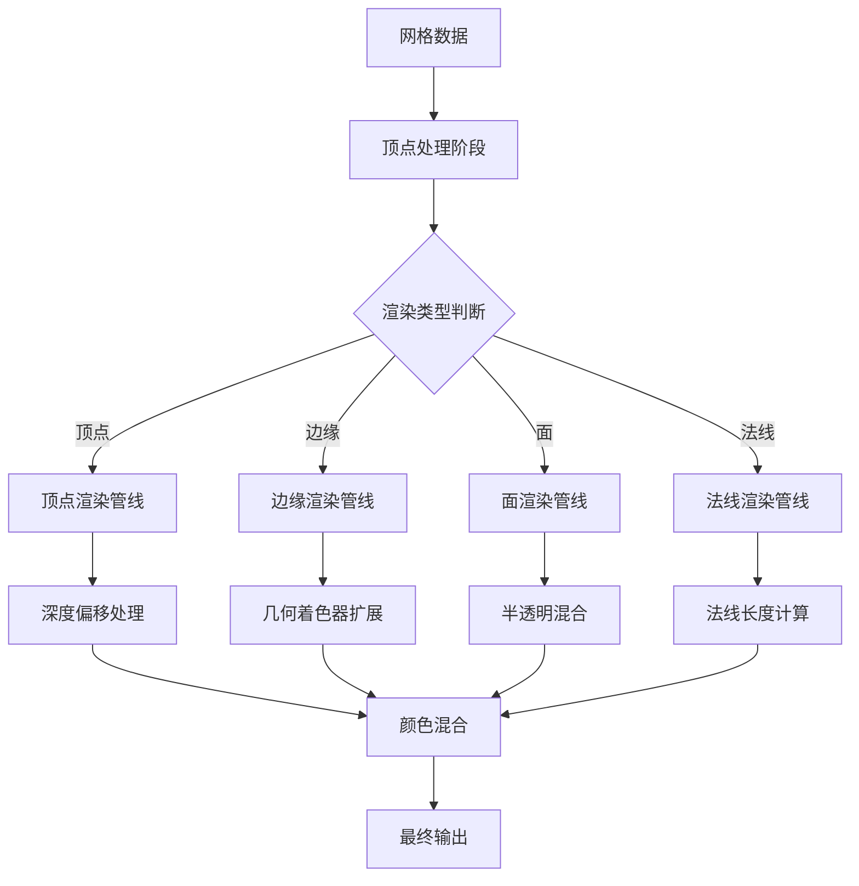

# Overlay网格编辑系统详解

## 目录

- [1. 系统概述](#1-系统概述)
- [2. 核心架构](#2-核心架构)
- [3. 渲染管线分析](#3-渲染管线分析)
- [4. 顶点渲染系统](#4-顶点渲染系统)
- [5. 边缘渲染系统](#5-边缘渲染系统)
- [6. 面渲染系统](#6-面渲染系统)
- [7. 法线显示系统](#7-法线显示系统)
- [8. UV编辑系统](#8-uv编辑系统)
- [9. 权重绘制系统](#9-权重绘制系统)
- [10. 颜色优先级系统](#10-颜色优先级系统)
- [11. 深度管理和遮挡检测](#11-深度管理和遮挡检测)
- [12. 性能优化策略](#12-性能优化策略)
- [13. 编辑模式特化](#13-编辑模式特化)

## 1. 系统概述

Blender的Overlay引擎中的网格编辑系统是一个复杂的多层次渲染管线，专门用于处理3D网格在编辑模式下的可视化。该系统通过精心设计的GLSL着色器集合，实现了高效的网格元素渲染、选择状态管理和交互反馈。

### 1.1 核心功能

- **网格元素渲染**: 顶点、边缘、面的独立渲染
- **选择状态管理**: 多层级选择状态的视觉反馈
- **深度排序**: 确保正确的前后关系显示
- **模式特化**: 针对不同编辑模式的优化渲染
- **实时反馈**: 编辑操作的即时视觉响应

### 1.2 文件组织结构

```
overlay/shaders/edit_mesh/
├── overlay_edit_mesh_vert.glsl           # 主顶点着色器
├── overlay_edit_mesh_lib.glsl           # 核心渲染库
├── overlay_edit_mesh_common_lib.glsl    # 通用颜色计算库
├── overlay_edit_mesh_edge_vert.glsl     # 边缘几何着色器
├── overlay_edit_mesh_frag.glsl         # 边缘片段着色器
├── overlay_edit_mesh_normal_vert.glsl  # 法线显示着色器
├── overlay_edit_mesh_facedot_vert.glsl # 面点着色器
├── overlay_edit_mesh_depth_vert.glsl   # 深度预处理着色器
└── overlay_edit_mesh_analysis_vert.glsl # 权重分析着色器
```

## 2. 核心架构

### 2.1 渲染管线架构



### 2.2 核心数据结构

网格编辑系统中的核心数据结构定义在 `overlay_edit_mesh_lib.glsl:20-27`：

```glsl
struct VertIn {
  /* Local Position. */
  float3 lP;
  /* Local Vertex Normal. */
  float3 lN;
  /* Edit Flags and Data. */
  uint4 e_data;
};
```

这个结构体封装了顶点着色器所需的所有输入数据：
- `lP`: 局部空间顶点位置
- `lN`: 局部空间顶点法线
- `e_data`: 包含选择状态、标记等编辑信息的4分量无符号整数

## 3. 渲染管线分析

### 3.1 统一的顶点处理入口

所有网格编辑元素的渲染都通过统一的 `vertex_main` 函数处理，定义在 `overlay_edit_mesh_lib.glsl:51-145`：

```glsl
VertOut vertex_main(VertIn vert_in)
{
  VertOut vert_out;

  vert_out.world_position = drw_point_object_to_world(vert_in.lP);
  float3 view_pos = drw_point_world_to_view(vert_out.world_position);
  vert_out.gpu_position = drw_point_view_to_homogenous(view_pos);

  /* Offset Z position for retopology overlay. */
  vert_out.gpu_position.z += get_homogenous_z_offset(
      drw_view().winmat, view_pos.z, vert_out.gpu_position.w, retopology_offset);

  uint4 m_data = vert_in.e_data & uint4(data_mask);
  
  // ... 条件编译分支处理不同元素类型
}
```

### 3.2 条件编译分支系统

系统通过预处理器宏实现不同元素类型的特化处理：

```glsl
#if defined(VERT)
  // 顶点渲染逻辑
#elif defined(EDGE)
  // 边缘渲染逻辑
#elif defined(FACE)
  // 面渲染逻辑
#elif defined(FACEDOT)
  // 面点渲染逻辑
#endif
```

## 4. 顶点渲染系统

### 4.1 顶点颜色计算逻辑

顶点颜色的计算在 `overlay_edit_mesh_common_lib.glsl:44-59` 中定义：

```glsl
float4 EDIT_MESH_vertex_color(uint vertex_flag, float vertex_crease)
{
  if ((vertex_flag & VERT_ACTIVE) != 0u) {
    return float4(theme.colors.edit_mesh_active.xyz, 1.0f);
  }
  else if ((vertex_flag & VERT_SELECTED) != 0u) {
    return theme.colors.vert_select;
  }
  else {
    /* Full crease color if not selected nor active. */
    if (vertex_crease > 0.0f) {
      return mix(theme.colors.vert, theme.colors.edge_crease, vertex_crease);
    }
    return theme.colors.vert;
  }
}
```

**优先级顺序**:
1. **活跃顶点** (VERT_ACTIVE): 最高优先级，使用活跃色
2. **选中顶点** (VERT_SELECTED): 次优先级，使用选中色
3. **褶皱顶点**: 根据褶皱值混合基础色和褶皱色
4. **普通顶点**: 使用基础顶点色

### 4.2 顶点大小和深度管理

顶点的大小根据其状态动态调整，`overlay_edit_mesh_lib.glsl:66-75`：

```glsl
vertex_crease = float(m_data.z >> 4) / 15.0f;
vert_out.final_color = EDIT_MESH_vertex_color(m_data.y, vertex_crease);
gl_PointSize = theme.sizes.vert * ((vertex_crease > 0.0f) ? 3.0f : 2.0f);
/* Make selected and active vertex always on top. */
if ((data.x & VERT_SELECTED) != 0u) {
  vert_out.gpu_position.z -= 5e-7f * abs(vert_out.gpu_position.w);
}
if ((data.x & VERT_ACTIVE) != 0u) {
  vert_out.gpu_position.z -= 5e-7f * abs(vert_out.gpu_position.w);
}
```

**关键特性**:
- **褶皱影响**: 有褶皱的顶点显示更大 (3x vs 2x)
- **深度优先**: 选中和活跃顶点通过微小深度偏移确保在最前层显示
- **线性深度偏移**: 使用 `abs(gpu_position.w)` 确保透视投影下的正确偏移

## 5. 边缘渲染系统

### 5.1 边缘颜色双重系统

边缘渲染采用内外双层颜色系统，定义在 `overlay_edit_mesh_common_lib.glsl:11-42`：

#### 5.1.1 外层颜色系统

```glsl
float4 EDIT_MESH_edge_color_outer(uint edge_flag, uint face_flag, float crease, float bweight)
{
  float4 color = float4(0.0f);
  color = ((edge_flag & EDGE_FREESTYLE) != 0u) ? theme.colors.edge_freestyle : color;
  color = ((edge_flag & EDGE_SHARP) != 0u) ? theme.colors.edge_sharp : color;
  color = (crease > 0.0f) ? float4(theme.colors.edge_crease.rgb, crease) : color;
  color = (bweight > 0.0f) ? float4(theme.colors.edge_bweight.rgb, bweight) : color;
  color = ((edge_flag & EDGE_SEAM) != 0u) ? theme.colors.edge_seam : color;
  return color;
}
```

**优先级顺序**:
1. Freestyle边缘 (EDGE_FREESTYLE)
2. 尖锐边缘 (EDGE_SHARP)
3. 褶皱边缘 (crease > 0)
4. 边权边缘 (bweight > 0)
5. 缝合边缘 (EDGE_SEAM)

#### 5.1.2 内层颜色系统

```glsl
float4 EDIT_MESH_edge_color_inner(uint edge_flag)
{
  float4 color = theme.colors.wire_edit;
  float4 selected_edge_col = (select_edge) ? theme.colors.edge_mode_select :
                                             theme.colors.edge_select;
  color = ((edge_flag & EDGE_SELECTED) != 0u) ? selected_edge_col : color;
  color = ((edge_flag & EDGE_ACTIVE) != 0u) ? theme.colors.edit_mesh_active : color;
  color.a = 1.0f;
  return color;
}
```

### 5.2 几何着色器边缘扩展

边缘的视觉粗细通过几何着色器实现，`overlay_edit_mesh_edge_vert.glsl:93-149`：

```glsl
void geometry_main(VertOut geom_in[2], uint out_vert_id, uint out_prim_id, uint out_invocation_id)
{
  // ... 边缘裁剪和屏幕空间转换
  
  float2 line = ss_pos[0] - ss_pos[1];
  line = abs(line) * uniform_buf.size_viewport;

  geometry_flat_out.final_color_outer = geom_in[0].final_color_outer;
  float half_size = theme.sizes.edge;
  /* Enlarge edge for flag display. */
  half_size += (geometry_flat_out.final_color_outer.a > 0.0f) ? max(theme.sizes.edge, 1.0f) : 0.0f;

  if (do_smooth_wire) {
    /* Add 1px for AA */
    half_size += 0.5f;
  }

  float3 edge_ofs = float3(half_size * uniform_buf.size_viewport_inv, 0.0f);

  bool horizontal = line.x > line.y;
  edge_ofs = (horizontal) ? edge_ofs.zyz : edge_ofs.xzz;

  // ... 生成扩展的四边形顶点
}
```

**技术要点**:
- **自适应粗细**: 根据边缘标记动态调整粗细
- **屏幕空间计算**: 确保边缘在屏幕上有统一的像素宽度
- **方向优化**: 根据边缘方向选择最优的偏移轴
- **抗锯齿支持**: 可选的1像素抗锯齿扩展

### 5.3 片段着色器边缘合成

边缘的最终视觉效果在片段着色器中合成，`overlay_edit_mesh_frag.glsl:24-39`：

```glsl
void main()
{
  float dist = abs(geometry_noperspective_out.edge_coord) - max(theme.sizes.edge - 0.5f, 0.0f);
  float dist_outer = dist - max(theme.sizes.edge, 1.0f);
  float mix_w = edge_step(dist);
  float mix_w_outer = edge_step(dist_outer);
  /* Line color & alpha. */
  frag_color = mix(geometry_flat_out.final_color_outer,
                   geometry_out.final_color,
                   1.0f - mix_w * geometry_flat_out.final_color_outer.a);
  /* Line edges shape. */
  frag_color.a *= 1.0f - (geometry_flat_out.final_color_outer.a > 0.0f ? mix_w_outer : mix_w);

  frag_color.a *= test_occlusion() ? alpha : 1.0f;
  line_output = float4(0.0f);
}
```

## 6. 面渲染系统

### 6.1 面颜色计算逻辑

面的颜色计算在 `overlay_edit_mesh_common_lib.glsl:61-88` 中定义：

```glsl
float4 EDIT_MESH_face_color(uint face_flag)
{
  bool face_freestyle = (face_flag & FACE_FREESTYLE) != 0u;
  bool face_selected = (face_flag & FACE_SELECTED) != 0u;
  bool face_active = (face_flag & FACE_ACTIVE) != 0u;
  bool face_retopo = (retopology_offset > 0.0f);
  float4 selected_face_col = (select_face) ? theme.colors.face_mode_select :
                                             theme.colors.face_select;
  float4 color = theme.colors.face;
  color = face_retopo ? theme.colors.face_retopology : color;
  color = face_freestyle ? theme.colors.face_freestyle : color;
  color = face_selected ? selected_face_col : color;
  if (select_face && face_active) {
    color = mix(selected_face_col, theme.colors.edit_mesh_active, 0.5f);
    color.a = selected_face_col.a;
  }
  if (wire_shading) {
    /* Lower face selection opacity for better wireframe visibility. */
    color.a = (face_selected) ? color.a * 0.6f : color.a;
  }
  else {
    /* Don't always fill 'theme.colors.face'. */
    color.a = (select_face || face_selected || face_active || face_freestyle || face_retopo) ?
                  color.a :
                  0.0f;
  }
  return color;
}
```

**颜色优先级**:
1. **Retopology面**: 最高优先级
2. **Freestyle面**: 次优先级
3. **选中面**: 根据选择模式使用不同颜色
4. **活跃面**: 与选中色混合显示
5. **基础面**: 默认面颜色

### 6.2 线框模式下的透明度处理

系统在线框模式下自动降低选中面的透明度，确保线框的可见性：

```glsl
if (wire_shading) {
  /* Lower face selection opacity for better wireframe visibility. */
  color.a = (face_selected) ? color.a * 0.6f : color.a;
}
```

### 6.3 Apple Silicon深度偏移

针对Apple Silicon GPU的Z-fighting问题，添加了特殊的深度偏移，`overlay_edit_mesh_lib.glsl:104-107`：

```glsl
#ifdef GPU_METAL
  /* Apply depth bias to overlay in order to prevent z-fighting on Apple Silicon GPUs. */
  vert_out.gpu_position.z -= 5e-5f;
#endif
```

## 7. 法线显示系统

### 7.1 法线类型支持

系统支持三种类型的法线显示，`overlay_edit_mesh_normal_vert.glsl:31-116`：

```glsl
#if defined(FACE_NORMAL)
  // 面法线显示
#elif defined(VERT_NORMAL)
  // 顶点法线显示
#elif defined(LOOP_NORMAL)
  // 循环法线显示
#else
  // 自动检测法线类型
#endif
```

### 7.2 常量屏幕尺寸法线

法线支持两种显示模式：世界空间固定长度和屏幕空间常量大小，`overlay_edit_mesh_normal_vert.glsl:121-138`：

```glsl
if ((gl_VertexID & 1) == 0) {
  if (is_constant_screen_size_normals) {
    bool is_persp = (drw_view().winmat[3][3] == 0.0f);
    if (is_persp) {
      float dist_fac = length(drw_view_position() - world_pos);
      float cos_fac = dot(drw_view_forward(), drw_world_incident_vector(world_pos));
      world_pos += n * normal_screen_size * dist_fac * cos_fac * uniform_buf.pixel_fac *
                   theme.sizes.pixel;
    }
    else {
      float frustrum_fac = mul_project_m4_v3_zfac(uniform_buf.pixel_fac, n) * theme.sizes.pixel;
      world_pos += n * normal_screen_size * frustrum_fac;
    }
  }
  else {
    world_pos += n * normal_size;
  }
}
```

**技术特点**:
- **透视补偿**: 在透视投影下根据距离调整法线长度
- **视角补偿**: 考虑观察角度对视觉长度的影响
- **正交优化**: 正交投影下的简化计算
- **像素精度**: 确保法线在屏幕上有固定的像素长度

### 7.3 遮挡检测优化

法线显示使用特殊的深度偏移来避免与几何体相交，`overlay_edit_mesh_normal_vert.glsl:19-23`：

```glsl
bool test_occlusion()
{
  float3 ndc = (gl_Position.xyz / gl_Position.w) * 0.5f + 0.5f;
  return (ndc.z - 0.00035f) > texture(depth_tx, ndc.xy).r;
}
```

## 8. UV编辑系统

### 8.1 UV边缘渲染

UV边缘渲染在 `overlay_edit_uv_edges_vert.glsl` 中实现，采用2D空间渲染：

```glsl
VertOut vertex_main(VertIn v_in)
{
  VertOut vert_out;

  float3 world_pos = float3(v_in.uv, 0.0f);
  vert_out.hs_P = drw_point_world_to_homogenous(world_pos);
  /* Snap vertices to the pixel grid to reduce artifacts. */
  float2 half_viewport_res = uniform_buf.size_viewport * 0.5f;
  float2 half_pixel_offset = uniform_buf.size_viewport_inv * 0.5f;
  vert_out.hs_P.xy = floor(vert_out.hs_P.xy * half_viewport_res) / half_viewport_res +
                     half_pixel_offset;

  const uint selection_flag = use_edge_select ? uint(EDGE_UV_SELECT) : uint(VERT_UV_SELECT);
  vert_out.selected = flag_test(v_in.flag, selection_flag);

  /* Move selected edges to the top so that they occlude unselected edges. */
  vert_out.hs_P.z = vert_out.selected ? 0.25f : 0.35f;

  return vert_out;
}
```

**关键特性**:
- **像素对齐**: UV坐标对齐到像素网格以减少渲染伪影
- **深度分层**: 选中的UV边缘在更浅的深度层
- **选择模式**: 支持边缘选择和顶点选择模式切换

### 8.2 UV顶点渲染

UV顶点支持多种状态的视觉反馈，`overlay_edit_uv_verts_vert.glsl:12-42`：

```glsl
void main()
{
  /* TODO: Theme? */
  constexpr float4 pinned_col = float4(1.0f, 0.0f, 0.0f, 1.0f);

  bool is_selected = (flag & (VERT_UV_SELECT | FACE_UV_SELECT)) != 0u;
  bool is_pinned = (flag & VERT_UV_PINNED) != 0u;
  float4 deselect_col = (is_pinned) ? pinned_col : float4(color.rgb, 1.0f);
  fill_color = (is_selected) ? theme.colors.vert_select : deselect_col;
  outline_color = (is_pinned) ? pinned_col : float4(fill_color.rgb, 0.0f);

  float3 world_pos = float3(au, 0.0f);
  float depth = is_selected ? (is_pinned ? 0.05f : 0.10f) : 0.15f;
  gl_Position = float4(drw_point_world_to_homogenous(world_pos).xy, depth, 1.0f);
  gl_PointSize = dot_size;

  /* calculate concentric radii in pixels */
  float radius = 0.5f * dot_size;

  /* start at the outside and progress toward the center */
  radii[0] = radius;
  radii[1] = radius - 1.0f;
  radii[2] = radius - outline_width;
  radii[3] = radius - outline_width - 1.0f;

  /* convert to PointCoord units */
  radii /= dot_size;
}
```

**视觉层次**:
1. **固定顶点**: 红色显示，最高深度优先级 (0.05)
2. **选中顶点**: 选中颜色显示 (0.10)
3. **普通顶点**: 基础颜色显示 (0.15)

## 9. 权重绘制系统

### 9.1 权重颜色映射

权重值到RGB颜色的转换在 `overlay_edit_mesh_analysis_vert.glsl:13-26` 中定义：

```glsl
float3 weight_to_rgb(float t)
{
  if (t < 0.0f) {
    /* Minimum color, gray */
    return float3(0.25f, 0.25f, 0.25f);
  }
  else if (t > 1.0f) {
    /* Error color. */
    return float3(1.0f, 0.0f, 1.0f);
  }
  else {
    return texture(weight_tx, t).rgb;
  }
}
```

**颜色映射规则**:
- **负值**: 灰色 (0.25, 0.25, 0.25) 表示最小权重
- **超值**: 紫色 (1.0, 0.0, 1.0) 表示错误或超出范围的权重
- **正常范围**: 从1D纹理查找获取平滑的颜色渐变

### 9.2 权重顶点渲染

权重信息通过顶点颜色传递给片段着色器：

```glsl
void main()
{
  float3 world_pos = drw_point_object_to_world(pos);
  gl_Position = drw_point_world_to_homogenous(world_pos);
  weight_color = float4(weight_to_rgb(weight), 1.0f);

  view_clipping_distances(world_pos);
}
```

## 10. 颜色优先级系统

### 10.1 位掩码标记系统

网格编辑使用紧凑的位掩码系统来编码各种状态信息：

```glsl
/* 顶点标记 */
#define VERT_SELECTED    (1 << 0)
#define VERT_ACTIVE      (1 << 1)

/* 边缘标记 */
#define EDGE_SELECTED    (1 << 0)
#define EDGE_ACTIVE      (1 << 1)
#define EDGE_SEAM        (1 << 2)
#define EDGE_SHARP       (1 << 3)
#define EDGE_FREESTYLE   (1 << 4)

/* 面标记 */
#define FACE_SELECTED    (1 << 0)
#define FACE_ACTIVE      (1 << 1)
#define FACE_FREESTYLE   (1 << 2)
```

### 10.2 颜色混合算法

系统使用非线性的颜色混合算法来获得更好的视觉效果，`overlay_edit_mesh_lib.glsl:35-41`：

```glsl
float3 non_linear_blend_color(float3 col1, float3 col2, float fac)
{
  col1 = pow(col1, float3(1.0f / 2.2f));
  col2 = pow(col2, float3(1.0f / 2.2f));
  float3 col = mix(col1, col2, fac);
  return pow(col, float3(2.2f));
}
```

**技术原理**:
- **伽马校正**: 在线性空间进行颜色混合，避免伽马空间混合导致的色彩偏差
- **视觉一致性**: 确保混合结果符合人眼感知特性
- **Fresnel效果**: 与视角相关的颜色变化，增强3D感知

### 10.3 Fresnel混合

面向基础的Fresnel混合增强立体感，`overlay_edit_mesh_lib.glsl:128-139`：

```glsl
#if !defined(FACE)
  /* Facing based color blend */
  float3 view_normal = normalize(drw_normal_object_to_view(vert_in.lN) + 1e-4f);
  float3 view_vec = (drw_view().winmat[3][3] == 0.0f) ? normalize(view_pos) :
                                                        float3(0.0f, 0.0f, 1.0f);
  float facing = dot(view_vec, view_normal);
  facing = 1.0f - abs(facing) * 0.2f;

  /* Do interpolation in a non-linear space to have a better visual result. */
  vert_out.final_color.rgb = mix(
      vert_out.final_color.rgb,
      non_linear_blend_color(theme.colors.edit_mesh_middle.rgb, vert_out.final_color.rgb, facing),
      theme.fresnel_mix_edit);
#endif
```

## 11. 深度管理和遮挡检测

### 11.1 分层深度系统

网格编辑元素使用精确的深度分层来确保正确的视觉层次：

```glsl
/* 深度层次 (从浅到深) */
#define DEPTH_SELECTED_VERTEX    0.0    // 选中的顶点
#define DEPTH_ACTIVE_VERTEX       0.001  // 活跃顶点
#define DEPTH_FACEDOT            0.002  // 面点
#define DEPTH_UV_SELECTED        0.05   // 选中的UV顶点
#define DEPTH_UV_PINNED         0.05   // 固定的UV顶点
#define DEPTH_UV_VERTEX          0.10   // 普通UV顶点
#define DEPTH_UV_EDGE_SELECTED   0.25   // 选中的UV边缘
#define DEPTH_UV_EDGE            0.35   // 普通UV边缘
#define DEPTH_NORMALS            0.40   // 法线显示
#define DEPTH_GEOMETRY           0.75   // 几何体
#define DEPTH_BACKGROUND         1.0    // 背景
```

### 11.2 遮挡检测算法

系统使用多种遮挡检测策略：

#### 11.2.1 深度纹理采样

```glsl
bool test_occlusion()
{
  float3 ndc = (gl_Position.xyz / gl_Position.w) * 0.5f + 0.5f;
  return ndc.z > texture(depth_tx, ndc.xy).r;
}
```

#### 11.2.2 深度纹理聚集 (边缘抗锯齿)

```glsl
bool test_occlusion()
{
  float3 ndc = (gl_Position.xyz / gl_Position.w) * 0.5f + 0.5f;
  float4 depths = textureGather(depth_tx, ndc.xy);
  return all(greaterThan(float4(ndc.z), depths));
}
```

### 11.3 深度偏移技术

为避免Z-fighting，系统使用多种深度偏移策略：

#### 11.3.1 线性深度偏移

```glsl
/* Make selected and active vertex always on top. */
if ((data.x & VERT_SELECTED) != 0u) {
  vert_out.gpu_position.z -= 5e-7f * abs(vert_out.gpu_position.w);
}
if ((data.x & VERT_ACTIVE) != 0u) {
  vert_out.gpu_position.z -= 5e-7f * abs(vert_out.gpu_position.w);
}
```

#### 11.3.2 齐次空间偏移

```glsl
/* Offset Z position for retopology overlay. */
vert_out.gpu_position.z += get_homogenous_z_offset(
    drw_view().winmat, view_pos.z, vert_out.gpu_position.w, retopology_offset);
```

#### 11.3.3 面点特殊偏移

```glsl
/* Bias Face-dot Z position in clip-space. */
vert_out.gpu_position.z -= (drw_view().winmat[3][3] == 0.0f) ? 0.00035f : 1e-6f;
```

## 12. 性能优化策略

### 12.1 条件编译优化

系统大量使用条件编译来避免不必要的计算：

```glsl
#if defined(VERT)
  // 顶点特化代码
#elif defined(EDGE)
  // 边缘特化代码
#elif defined(FACE)
  // 面特化代码
#endif
```

### 12.2 早期剔除

在顶点着色器中进行早期剔除以减少片段着色器负载：

```glsl
/* 法线显示中的早期退出 */
if (lnor.w < 0.0f) {
  return;
}
if (all(equal(nor, float3(0)))) {
  return;
}
```

### 12.3 几何着色器优化

边缘几何着色器只渲染必要的顶点：

```glsl
/* 边缘裁剪避免无效渲染 */
if (all(clipped)) {
  /* Totally clipped. */
  return;
}
```

### 12.4 纹理查找优化

使用1D纹理进行权重颜色映射，避免复杂的数学计算：

```glsl
float3 weight_to_rgb(float t)
{
  // ... 边界检查
  return texture(weight_tx, t).rgb;
}
```

## 13. 编辑模式特化

### 13.1 对象模式 vs 编辑模式

系统根据当前模式调整渲染行为：

```glsl
float4 selected_edge_col = (select_edge) ? theme.colors.edge_mode_select :
                                           theme.colors.edge_select;
float4 selected_face_col = (select_face) ? theme.colors.face_mode_select :
                                           theme.colors.face_select;
```

### 13.2 视口模式适应

系统根据视口设置调整渲染质量：

```glsl
if (hq_normals) {
  nor = gpu_attr_load_short4_snorm(norAndFlag, gpu_attr_0, vert_i).xyz;
}
else {
  nor = gpu_attr_load_uint_1010102_snorm(norAndFlag, gpu_attr_0, vert_i).xyz;
}
```

### 13.3 Retopology模式

Retopology模式下的特殊渲染：

```glsl
bool face_retopo = (retopology_offset > 0.0f);
color = face_retopo ? theme.colors.face_retopology : color;

/* Offset Z position for retopology overlay. */
vert_out.gpu_position.z += get_homogenous_z_offset(
    drw_view().winmat, view_pos.z, vert_out.gpu_position.w, retopology_offset);
```

---

## 总结

Blender Overlay引擎的网格编辑系统是一个高度优化、功能完整的实时渲染解决方案。通过精心设计的分层架构、智能的颜色优先级系统、以及高效的深度管理策略，该系统能够在保持高性能的同时提供丰富的视觉反馈。

系统的核心优势在于：

1. **模块化设计**: 通过条件编译和库函数实现代码复用和特化
2. **视觉层次**: 清晰的深度分层和颜色优先级确保UI元素的可见性
3. **性能优化**: 多种优化策略确保实时渲染性能
4. **跨平台兼容**: 针对不同GPU平台的特殊优化
5. **扩展性**: 易于添加新的编辑模式和渲染特性

这个系统为Blender的网格编辑体验奠定了坚实的技术基础，确保用户在进行复杂的3D建模操作时能够获得清晰、直观、实时的视觉反馈。