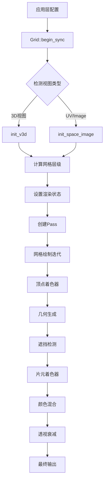

# Overlay网格系统详解

## 目录
- [1. 概述](#概述)
- [2. 核心数据结构](#核心数据结构)
  - [2.1 OVERLAY_GridData结构](#21-overlay_griddata结构)
  - [2.2 网格标志位系统](#22-网格标志位系统)
- [3. 顶点着色器分析](#顶点着色器分析)
  - [3.1 网格几何生成算法](#31-网格几何生成算法)
  - [3.2 坐标轴生成算法](#32-坐标轴生成算法)
  - [3.3 遮挡检测机制](#33-遮挡检测机制)
- [4. 片元着色器分析](#片元着色器分析)
  - [4.1 颜色混合系统](#41-颜色混合系统)
  - [4.2 透视衰减算法](#42-透视衰减算法)
  - [4.3 边缘淡化效果](#43-边缘淡化效果)
- [5. 网格渲染管线](#网格渲染管线)
  - [5.1 多层次网格系统](#51-多层次网格系统)
  - [5.2 视图相关配置](#52-视图相关配置)
- [6. 特殊网格类型](#特殊网格类型)
  - [6.1 光照探测网格](#61-光照探测网格)
  - [6.2 体积网格线](#62-体积网格线)
- [7. 技术实现细节](#技术实现细节)
  - [7.1 过程化几何生成](#71-过程化几何生成)
  - [7.2 Z-fighting解决方案](#72-z-fighting解决方案)
- [8. 性能优化策略](#性能优化策略)

---

## 1. 概述 

Blender的Overlay网格系统是一套高度优化的3D/2D网格渲染解决方案，通过GLSL着色器实现了：

- **多层次网格渲染**：支持8个详细层级（`OVERLAY_GRID_STEPS_LEN = 8`）
- **视图适配系统**：自动适配透视和正交投影视图
- **智能遮挡检测**：避免重复绘制和高层次线覆盖低层次线
- **透视衰减效果**：根据视角和距离自动调整网格透明度
- **多平面支持**：XY、XZ、YZ三个主平面的网格显示

核心架构基于过程化几何生成，无需预先存储顶点数据，完全通过`gl_VertexID`在GPU端动态生成网格线。

---

## 2. 核心数据结构 

### 2.1 OVERLAY_GridData结构 

**定义位置**: `overlay_shader_shared.hh:132-144`

```cpp
struct OVERLAY_GridData {
  /* 每个层级的步长，基于选定的单位/细分设置 */
  float4 steps[OVERLAY_GRID_STEPS_LEN]; /* float3数组填充为float4以符合std140 */
  
  /* 网格的XY/YZ/XZ相机偏移 */
  float2 offset;
  
  /* UV/Image编辑器的裁剪矩形 */
  float2 clip_rect;
  
  /* 分数网格层级，依赖于当前相机位置/距离/缩放 */
  float level;
  
  /* 每层级的线数量 */
  uint num_lines;
  uint _pad0, _pad1; /* 内存对齐填充 */
};
```

**关键参数解析**：
- `steps[]`：存储8个不同缩放层级的网格间距
- `offset`：网格相对于世界原点的偏移，实现"跟随相机"效果
- `level`：浮点层级，支持两个层级间的平滑过渡
- `num_lines`：每个方向绘制的线数量（透视：151，正交：301）

### 2.2 网格标志位系统 

**定义位置**: `overlay_shader_shared.hh:31-48`

```cpp
enum OVERLAY_GridBits : uint32_t {
  SHOW_GRID = (1u << 0u),      /* 显示网格 */
  SHOW_AXES = (1u << 1u),      /* 显示坐标轴 */
  
  /* 坐标轴显示标志（需要SHOW_AXES） */
  AXIS_X = (1u << 2u),         /* X轴 */
  AXIS_Y = (1u << 3u),         /* Y轴 */
  AXIS_Z = (1u << 4u),         /* Z轴 */
  
  /* 网格平面标志（需要SHOW_GRID） */
  PLANE_XY = (1u << 5u),       /* XY平面 */
  PLANE_XZ = (1u << 6u),       /* XZ平面 */
  PLANE_YZ = (1u << 7u),       /* YZ平面 */
  
  GRID_SIMA = (1u << 8u),      /* UV/Image编辑器中的网格 */
  GRID_OVER_IMAGE = (1u << 9u), /* 网格显示在图像前面而不是后面 */
  GRID_CAMERA = (1u << 10u)    /* 在选定的相机视图中显示网格 */
};
```

---

## 3. 顶点着色器分析 

### 3.1 网格几何生成算法 

**定义位置**: `overlay_grid_vert.glsl:20-46`

网格线完全通过`gl_VertexID`编码生成，实现无预存几何体的过程化渲染：

```glsl
struct LineData {
  float2 P;     /* 网格线在局部空间的位置 */
  uint axis;    /* 轴向 [0, 1, 2] 对应 [X, Y, Z] */
  uint level;   /* 层级 [0, ..., OVERLAY_GRID_STEPS_DRAW - 1] */
};

/* 从gl_VertexID解码网格线数据 */
LineData decode_grid_data(uint vertex_id)
{
  LineData line;

  /* 每对连续顶点形成一条线，由第0位表示 */
  /* 每对连续线翻转x/y，由第1位表示 */
  uint side = vertex_id & 0x1u;
  vertex_id = vertex_id >> 1u;
  line.axis = vertex_id & 0x1u;
  vertex_id = vertex_id >> 1u;

  /* 剩余位编码线的索引/层级。我们从"大"到"小"排序层级，
   * 先绘制较大的层级。 */
  line.level = OVERLAY_GRID_STEPS_DRAW - 1 - int(vertex_id / grid_buf.num_lines);
  vertex_id = vertex_id % grid_buf.num_lines;

  /* 从索引，在[-N/2, N/2]上生成N+1个等距点 */
  line.P.x = max(float(grid_buf.num_lines >> 1u), 1.0f);
  line.P.y = (float(vertex_id) - float(grid_buf.num_lines >> 1u));

  /* 如果这不是线起点，将x分量翻转到终点。同样地，
   * 如果这不是x方向，翻转组件以定义y方向。 */
  line.P.x = side != 0 ? line.P.x : -line.P.x;
  line.P.xy = line.axis != 0 ? line.P.yx : line.P.xy;

  return line;
}
```

**算法特点**：
- **位编码**：使用位操作从单个整数解码线的所有属性
- **层级排序**：先绘制大网格，再绘制小网格，确保正确的遮挡关系
- **对称生成**：从中心向外对称生成网格线

### 3.2 坐标轴生成算法 

**定义位置**: `overlay_grid_vert.glsl:49-64`

```glsl
/* 从gl_VertexID解码三条坐标轴之一 */
LineData decode_axis_data(uint vertex_id)
{
  LineData line;

  /* 每对连续顶点形成一条线，由第0位表示 */
  /* 然后它们交替x/y/z，由剩余位表示 */
  uint side = vertex_id & 0x1u;
  line.axis = vertex_id >> 1u;
  /* 对于坐标轴线，层级是固定的，方向简单地是顶点索引 */
  line.level = OVERLAY_GRID_STEPS_DRAW - 1;
  /* 输出顶点为[-N/2, N/2], [0, 0] */
  line.P.x = max(float(grid_buf.num_lines >> 1u), 1.0f) * select(1.0f, -1.0f, side);
  line.P.y = 0.0f;

  return line;
}
```

坐标轴使用固定层级和简化的位置计算，确保它们总是显示在网格之上。

### 3.3 遮挡检测机制 

#### 坐标轴遮挡检测

**定义位置**: `overlay_grid_vert.glsl:73-81`

```glsl
/* 测试当前线是否落在遮挡它的活动坐标轴线下 */
bool is_occluded_by_axis(float3 vertex_pos_global)
{
  if (flag_test(grid_flag, SHOW_GRID)) {
    return (flag_test(grid_flag, AXIS_X) && all(is_zero(vertex_pos_global.yz, 1e-4f))) ||
           (flag_test(grid_flag, AXIS_Y) && all(is_zero(vertex_pos_global.xz, 1e-4f))) ||
           (flag_test(grid_flag, AXIS_Z) && all(is_zero(vertex_pos_global.xy, 1e-4f)));
  }
  return false;
}
```

#### 高层级遮挡检测

**定义位置**: `overlay_grid_vert.glsl:84-101`

```glsl
/* 测试当前线是否落在更高层级的另一条线下，该线会遮挡它 */
bool is_occluded_by_higher_level(LineData line, uint level)
{
  if (flag_test(grid_flag, SHOW_GRID) && !flag_test(grid_flag, GRID_SIMA)) {
    if (line.level < OVERLAY_GRID_STEPS_DRAW - 1 && level < OVERLAY_GRID_STEPS_LEN - 1) {
      float step_size_curr = grid_buf.steps[level][line.axis];
      float step_size_next = grid_buf.steps[level + 1][line.axis];

      float2 step_offs_curr = round(grid_buf.offset / step_size_curr) * step_size_curr;
      float2 step_offs_next = round(step_offs_curr / step_size_next) * step_size_next;
      float2 diff = step_offs_next + (line.P - step_offs_next) / step_size_next;

      if (is_equal(fract(diff[1 - line.axis]), 0.0f, 1e-4)) {
        return true;
      }
    }
  }
  return false;
}
```

**遮挡检测原理**：
- **坐标轴优先**：坐标轴始终显示，网格线在重叠时被隐藏
- **层级优先**：高层级线（大网格）遮挡低层级线（小网格）
- **浮点精度容差**：使用1e-4的容差避免浮点误差

---

## 4. 片元着色器分析 

### 4.1 颜色混合系统 

**定义位置**: `overlay_grid_frag.glsl:22-38`

```glsl
void main()
{
  /* 片元颜色 */
  if (flag_test(grid_flag, SHOW_GRID)) {
    /* 颜色是[grid, grid_emphasis]的混合，依赖于层级 */
    out_color = mix(theme.colors.grid, theme.colors.grid_emphasis, vertex_out_flat.emphasis);
  }
  else if (flag_test(grid_flag, SHOW_AXES)) {
    /* 颜色由主题固定 */
    if (flag_test(grid_flag, AXIS_X) && is_zero(vertex_out.pos.yz, 1e-4f)) {
      out_color = theme.colors.grid_axis_x;
    }
    else if (flag_test(grid_flag, AXIS_Y) && is_zero(vertex_out.pos.xz, 1e-4f)) {
      out_color = theme.colors.grid_axis_y;
    }
    else if (flag_test(grid_flag, AXIS_Z) && is_zero(vertex_out.pos.xy, 1e-4f)) {
      out_color = theme.colors.grid_axis_z;
    }
  }
  
  /* ... 额外的alpha处理 ... */
}
```

**颜色混合策略**：
- **网格线**：基础网格颜色和强调颜色的平滑混合
- **坐标轴**：使用独立的RGB颜色（红、绿、蓝）
- **强调层级**：第二层网格使用更明显的强调颜色

### 4.2 透视衰减算法 

**定义位置**: `overlay_grid_frag.glsl:42-60`

#### 透视视图衰减

```glsl
if (drw_view_is_perspective()) {
  /* 在网格层级边缘淡化 */
  float length_fade = 1.0f - min(1.0f, length(vertex_out.coord));
  out_color.a *= length_fade;

  /* 计算归一化视图向量 */
  float3 V = drw_view_position() - vertex_out.pos;
  float dist = length(V);
  V /= dist;

  /* 为地平面内容添加在陡峭角度的淡化 */
  if (vertex_out.pos.z == 0.0f) {
    out_color.a *= 1.0f - pow3f(1.0f - abs(V.z));
  }

  /* 朝向相机裁剪平面淡化 */
  float far_clip = -drw_view_far();
  out_color.a *= 1.0f - smoothstep(0.0f, 0.5f * far_clip, dist - 0.5f * far_clip);
}
```

#### 正交视图衰减

```glsl
else {
  /* 在正交视图中在网格层级边缘淡化，在相当小的单位情况下 */
  if (!flag_test(grid_flag, GRID_SIMA)) {
    float length_fade = 1.0f - min(1.0f, dot(vertex_out.coord, vertex_out.coord));
    out_color.a *= pow2f(length_fade);
  }

  /* 为地平面内容添加在陡峭角度的淡化 */
  if (flag_test(grid_flag, PLANE_XY)) {
    float3 V = -drw_view_forward();
    out_color.alpha *= 1.0f - pow3f(1.0f - abs(V.z));
  }
}
```

### 4.3 边缘淡化效果 

**定义位置**: `overlay_grid_vert.glsl:128-137`

```glsl
/* 在[-1,1]中输出顶点位置，我们用它来淡化层级边界 */
vertex_out.coord = line.P / max(float(grid_buf.num_lines >> 1), 1.0f);
/* 为第二个网格层级输出在`grid`和`grid_emphasis`之间的插值 */
vertex_out_flat.emphasis = saturate(float(line.level) - fract(grid_buf.level));
/* 输出平滑过渡最低网格层级进入/退出的alpha */
vertex_out_flat.alpha = saturate(line.level + 1.0f - fract(grid_buf.level));
if (!drw_view_is_perspective()) {
  /* 对于正交投影也按像素大小淡化，因为我们缺乏适当的线DFDX/DFDY */
  vertex_out_flat.alpha *= smoothstep(
      step_size * 0.25f, step_size * pow3f(0.25f), uniform_buf.pixel_fac);
}
```

---

## 5. 网格渲染管线 



### 5.1 多层次网格系统 

**定义位置**: `overlay_shader_shared.hh:122-127`

```cpp
/* 与DNA_space_types.h中的SI_GRID_STEPS_LEN保持同步 */
#define OVERLAY_GRID_STEPS_LEN 8
/* 一次绘制的硬编码网格步数 */
#define OVERLAY_GRID_STEPS_DRAW 3
/* 网格alpha淡化的硬编码最大迭代次数 */
#define OVERLAY_GRID_ITER_LEN 4
```

**层级系统特点**：
- **8个完整层级**：从0.001m到1000m的范围覆盖
- **3个活动层级**：同时显示3个相邻层级以实现平滑过渡
- **4次渲染迭代**：透视视图中多遍渲染实现深度淡化

### 5.2 视图相关配置 

**定义位置**: `overlay_grid.hh:221-251`

```cpp
/* 设置依赖于视图配置的grid_flag_ */
if (rv3d->is_persp || rv3d->view == RV3D_VIEW_USER) {
  /* 透视；设置选中的轴和地板位 */
  axis_flag_ |= (show_axis_x ? (AXIS_X | SHOW_AXES) : OVERLAY_GridBits(0));
  axis_flag_ |= (show_axis_y ? (AXIS_Y | SHOW_AXES) : OVERLAY_GridBits(0));
  axis_flag_ |= (show_axis_z ? (AXIS_Z | SHOW_AXES) : OVERLAY_GridBits(0));
  grid_flag_ |= (show_axis_x ? AXIS_X : OVERLAY_GridBits(0));
  grid_flag_ |= (show_axis_y ? AXIS_Y : OVERLAY_GridBits(0));
  grid_flag_ |= (show_axis_z ? AXIS_Z : OVERLAY_GridBits(0));
  grid_flag_ |= (show_persp ? (PLANE_XY | SHOW_GRID) : OVERLAY_GridBits(0));
}
else {
  /* 正交；根据选择的特定视图设置选中的轴和平面位 */
  if (ELEM(rv3d->view, RV3D_VIEW_RIGHT, RV3D_VIEW_LEFT)) {
    axis_flag_ = (show_axis_y ? AXIS_Y : OVERLAY_GridBits(0)) |
                 (show_axis_z ? AXIS_Z : OVERLAY_GridBits(0));
    grid_flag_ = axis_flag_ | PLANE_YZ;
  }
  else if (ELEM(rv3d->view, RV3D_VIEW_TOP, RV3D_VIEW_BOTTOM)) {
    axis_flag_ = (show_axis_x ? AXIS_X : OVERLAY_GridBits(0)) |
                 (show_axis_y ? AXIS_Y : OVERLAY_GridBits(0));
    grid_flag_ = axis_flag_ | PLANE_XY;
  }
  else if (ELEM(rv3d->view, RV3D_VIEW_FRONT, RV3D_VIEW_BACK)) {
    axis_flag_ = (show_axis_x ? AXIS_X : OVERLAY_GridBits(0)) |
                 (show_axis_z ? AXIS_Z : OVERLAY_GridBits(0));
    grid_flag_ = axis_flag_ | PLANE_XZ;
  }
  grid_flag_ |= (show_ortho ? SHOW_GRID : OVERLAY_GridBits(0));
  axis_flag_ |= (show_ortho ? SHOW_AXES : OVERLAY_GridBits(0));
}
```

---

## 6. 特殊网格类型 

### 6.1 光照探测网格 

**定义位置**: `overlay_extra_lightprobe_grid_vert.glsl:30-68`

```glsl
void main()
{
  select_id_set(drw_custom_id());
  float4x4 model_mat = grid_model_matrix;
  model_mat[0][3] = model_mat[1][3] = model_mat[2][3] = 0.0f;
  model_mat[3][3] = 1.0f;
  float color_id = grid_model_matrix[3].w;

  int3 grid_resolution = int3(
      float3(grid_model_matrix[0].w, grid_model_matrix[1].w, grid_model_matrix[2].w));

  float3 ls_cell_location;
  /* 与update_irradiance_probe保持同步 */
  ls_cell_location.z = float(gl_VertexID % grid_resolution.z);
  ls_cell_location.y = float((gl_VertexID / grid_resolution.z) % grid_resolution.y);
  ls_cell_location.x = float(gl_VertexID / (grid_resolution.z * grid_resolution.y));

  ls_cell_location += 1.0f;
  ls_cell_location /= float3(grid_resolution + 1);
  ls_cell_location = ls_cell_location * 2.0f - 1.0f;

  float3 ws_cell_location = (model_mat * float4(ls_cell_location, 1.0f)).xyz;
  gl_Position = drw_point_world_to_homogenous(ws_cell_location);
  gl_PointSize = theme.sizes.vert * 2.0f;

  final_color = color_from_id(color_id);

  /* 不同地着色被遮挡的点 */
  float4 p = gl_Position / gl_Position.w;
  float z_depth = texture(depth_buffer, p.xy * 0.5f + 0.5f).r * 2.0f - 1.0f;
  float z_delta = p.z - z_depth;
  if (z_delta > 0.0f) {
    float fac = 1.0f - z_delta * 10000.0f;
    /* 平滑混合以避免闪烁 */
    final_color = mix(theme.colors.background, final_color, clamp(fac, 0.2f, 1.0f));
  }

  view_clipping_distances(ws_cell_location);
}
```

**特点**：
- **3D体积网格**：用于光照探测的可视化
- **深度感知着色**：被遮挡的点使用背景色混合
- **自适应点大小**：根据主题设置调整点的大小

### 6.2 体积网格线 

**定义位置**: `overlay_volume_gridlines_vert.glsl:40-112`

```glsl
void main()
{
  select_id_set(in_select_id);

  int cell = gl_VertexID / 8;
  float3x3 rot_mat = float3x3(0.0f);

  float3 cell_offset = float3(0.5f);
  int3 cell_div = volume_size;
  if (slice_axis == 0) {
    cell_offset.x = slice_position * float(volume_size.x);
    cell_div.x = 1;
    rot_mat[2].x = 1.0f;
    rot_mat[0].y = 1.0f;
    rot_mat[1].z = 1.0f;
  }
  else if (slice_axis == 1) {
    cell_offset.y = slice_position * float(volume_size.y);
    cell_div.y = 1;
    rot_mat[1].x = 1.0f;
    rot_mat[2].y = 1.0f;
    rot_mat[0].z = 1.0f;
  }
  else if (slice_axis == 2) {
    cell_offset.z = slice_position * float(volume_size.z);
    cell_div.z = 1;
    rot_mat[0].x = 1.0f;
    rot_mat[1].y = 1.0f;
    rot_mat[2].z = 1.0f;
  }

  /* ... 单元格位置计算 ... */

  /* 单元格轮廓的角点。0.45是任意的。任何低于0.5f的值都可以用来避免轮廓的重叠 */
  constexpr float3 corners[4] = float3_array(float3(-0.45f, 0.45f, 0.0f),
                                             float3(0.45f, 0.45f, 0.0f),
                                             float3(0.45f, -0.45f, 0.0f),
                                             float3(-0.45f, -0.45f, 0.0f));

  float3 pos = domain_origin_offset +
               cell_size * (float3(cell_co + adaptive_cell_offset) + cell_offset);
  float3 rotated_pos = rot_mat * corners[indices[gl_VertexID % 8]];
  pos += rotated_pos * cell_size;

  float3 world_pos = drw_point_object_to_world(pos);
  gl_Position = drw_point_world_to_homogenous(world_pos);
}
```

---

## 7. 技术实现细节 

### 7.1 过程化几何生成 

**定义位置**: `overlay_grid.hh:74-94`

```cpp
/* 网格和轴线绘制 */
{
  const uint axis_vertex_count = 6;
  const uint grid_vertex_count = 4 * OVERLAY_GRID_STEPS_DRAW * grid_ubo_.num_lines;

  auto &sub = grid_ps_.sub("grid");
  sub.shader_set(res.shaders->grid.get());
  sub.state_set(ps_draw_state | DRW_STATE_DEPTH_LESS_EQUAL | DRW_STATE_WRITE_DEPTH |
                DRW_STATE_BLEND_ADD);
  sub.bind_ubo("grid_buf", &grid_ubo_);

  for (int grid_iter = 0; grid_iter < num_iters_; grid_iter++) {
    sub.push_constant("grid_iter", grid_iter);
    if (axis_flag_) {
      sub.push_constant("grid_flag", &axis_flag_);
      sub.draw_procedural(GPUPrimType::GPU_PRIM_LINES, -1, axis_vertex_count, 0);
    }
    if (grid_flag_) {
      sub.push_constant("grid_flag", &grid_flag_);
      sub.draw_procedural(GPUPrimType::GPU_PRIM_LINES, -1, grid_vertex_count, 0);
    }
  }
}
```

**过程化优势**：
- **零内存开销**：无需存储顶点缓冲区
- **无限网格**：理论上可以生成无限大的网格
- **自适应密度**：根据视图距离动态调整网格密度

### 7.2 Z-fighting解决方案 

**定义位置**: `overlay_grid_vert.glsl:201-214`

```glsl
/* 调整z分量 */
if (drw_view_is_perspective()) {
  /* 为了最小化z-fighting，网格被绘制N次，具有递进的alpha和z-bias，
   * 使它通过几何体淡化。下面的范围越小，它越突兀。 */
  float z_factor = float(grid_iter * OVERLAY_GRID_STEPS_DRAW + line.level) /
                   float(OVERLAY_GRID_ITER_LEN * OVERLAY_GRID_STEPS_DRAW);
  gl_Position.z += mix(5e-4f, 1e-4f, z_factor);
}
else { /* 正交 */
  /* 在正交投影中设置z到远平面，所以它在所有东西后面 */
  if (!flag_test(grid_flag, GRID_SIMA)) {
    gl_Position.z = 1.0f;
  }
}
```

**抗Z-fighting策略**：
- **多遍渲染**：透视视图中4次渲染，每次不同的Z偏移
- **渐进透明度**：每次渲染使用递减的alpha值
- **正交远平面**：正交视图将网格推到最远平面

---

## 8. 性能优化策略 

### 8.1 视锥体裁剪

**定义位置**: `overlay_grid_vert.glsl:142-163`

```glsl
/* 计算裁剪矩形 */
float2 clip_min, clip_max;
if (flag_test(grid_flag, GRID_SIMA)) {
  clip_min = float2(-1.0f);
  clip_max = grid_buf.clip_rect * 2.0f - 1.0f;
}
else if (flag_test(grid_flag, SHOW_GRID)) {
  clip_min = grid_buf.offset - grid_buf.clip_rect;
  clip_max = grid_buf.offset + grid_buf.clip_rect;
}
else { /* SHOW_AXES */
  clip_min = float2(grid_buf.offset[line.axis] - grid_buf.clip_rect[line.axis], 0.0f);
  clip_max = float2(grid_buf.offset[line.axis] + grid_buf.clip_rect[line.axis], 0.0f);
}

/* 裁剪/钳位；完全在矩形外的线被丢弃；其他被带入矩形内
 * 以避免大线的精度问题 */
bool line_outside_rect = all(lessThan(line.P, clip_min)) || all(greaterThan(line.P, clip_max));
if (line_outside_rect) {
  return; /* 丢弃线 */
}
line.P = clamp(line.P, clip_min, clip_max);
```

### 8.2 自适应线数量

**定义位置**: `overlay_grid.hh:325-327`

```cpp
/* 这对大多数情况足够了，在其他情况下我们淡化来隐藏它 */
/* TODO (not_mark): 在正交投影中使其视图相关以获得完全覆盖 */
grid_ubo_.num_lines = rv3d->is_persp ? 151u : 301u;
num_iters_ = rv3d->is_persp ? OVERLAY_GRID_ITER_LEN : 1u;
```

**优化策略**：
- **透视视图**：较少的线（151）+ 多次渲染（4次）
- **正交视图**：较多的线（301）+ 单次渲染
- **自适应裁剪**：只渲染视锥体范围内的网格线

### 8.3 内存布局优化

```glsl
/* 使用float4数组而不是float3以符合std140布局 */
float4 steps[OVERLAY_GRID_STEPS_LEN]; /* float3 array padded to float4 (std140). */
```

通过精心设计的内存布局和数据结构，Overlay网格系统实现了高性能的实时渲染，同时保持了丰富的视觉效果和用户交互性。