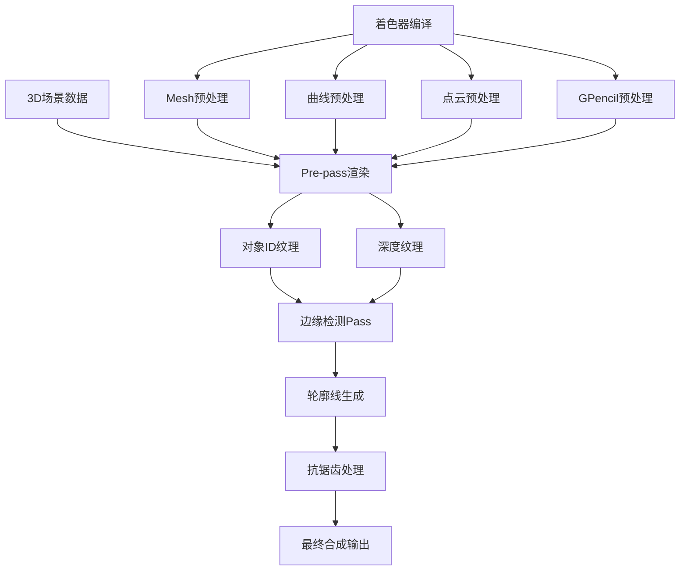

# Overlay轮廓检测系统详解

## 目录
- [系统概述](#系统概述)
- [渲染管线架构](#渲染管线架构)
- [对象ID系统](#对象id系统)
- [边缘检测算法](#边缘检测算法)
- [轮廓线提取技术](#轮廓线提取技术)
- [抗锯齿处理](#抗锯齿处理)
- [深度感知渲染](#深度感知渲染)
- [多Pass渲染系统](#multipass渲染系统)
- [轮廓线宽度控制](#轮廓线宽度控制)
- [颜色管理系统](#颜色管理系统)
- [融合处理技术](#融合处理技术)
- [性能优化策略](#性能优化策略)
- [代码示例分析](#代码示例分析)
- [技术实现细节](#技术实现细节)
- [性能与兼容性](#性能与兼容性)
- [参考资料](#参考资料)

---

## 系统概述

Blender的Overlay引擎轮廓检测系统是一个复杂的实时渲染系统，专门用于在3D视口中显示选中对象的轮廓线。该系统采用多Pass渲染架构，结合对象ID缓冲、深度感知渲染和高级抗锯齿技术，为用户提供清晰的视觉反馈。

### 核心功能特性
- **实时边缘检测**：基于对象ID差异的边缘识别算法
- **深度感知渲染**：考虑遮挡关系的轮廓显示
- **多对象支持**：同时处理不同类型对象的轮廓渲染
- **抗锯齿处理**：平滑的轮廓线边缘质量
- **性能优化**：高效的GPU并行计算实现

### 系统架构
轮廓检测系统主要由以下组件构成：
- Pre-pass阶段：生成对象ID和深度信息
- Detect阶段：边缘检测和轮廓线生成
- Anti-aliasing阶段：抗锯齿和后处理

---

## 渲染管线架构



### 渲染阶段详解

#### 1. Pre-pass阶段
**位置**: `overlay_outline_prepass_vert.glsl:15-53`

Pre-pass是轮廓检测的第一阶段，负责为每个可见对象生成唯一的标识符和深度信息。

```glsl
// 位置: overlay_outline_prepass_vert.glsl:43-49
/* ID 0 is nothing (background) */
interp.ob_id = uint(drw_resource_id() + 1);

/* Should be 2 bits only [0..3]. */
uint outline_id = outline_colorid_get();

/* Combine for 16bit uint target. */
interp.ob_id = outline_id_pack(outline_id, interp.ob_id);
```

#### 2. 边缘检测阶段
**位置**: `overlay_outline_detect_frag.glsl:167-372`

该阶段分析对象ID纹理，识别不同对象之间的边界，并生成轮廓线几何数据。

```glsl
// 位置: overlay_outline_detect_frag.glsl:203-206
bool has_edge_pos_x = has_edge(ids.x, uvs + ofs.xz, ref, ref_col, depth_uv);
bool has_edge_neg_x = has_edge(ids.y, uvs - ofs.xz, ref, ref_col, depth_uv);
bool has_edge_pos_y = has_edge(ids.z, uvs + ofs.zy, ref, ref_col, depth_uv);
bool has_edge_neg_y = has_edge(ids.w, uvs - ofs.zy, ref, ref_col, depth_uv);
```

#### 3. 抗锯齿处理阶段
**位置**: `overlay_antialiasing_frag.glsl:80-147`

提供高质量的轮廓线抗锯齿效果，通过相邻像素的颜色和深度信息进行混合处理。

---

## 对象ID系统

对象ID系统是轮廓检测的核心，它为场景中的每个对象分配唯一标识符，用于边缘检测。

### ID编码机制

#### 16位ID结构
**位置**: `overlay_outline_prepass_vert.glsl:46-49`

```glsl
uint outline_colorid_get()
{
  eObjectInfoFlag ob_flag = drw_object_infos().flag;
  bool is_active = flag_test(ob_flag, OBJECT_ACTIVE);

  if (is_transform) {
    return 0u; /* theme.colors.transform */
  }
  else if (is_active) {
    return 3u; /* theme.colors.active */
  }
  else {
    return 1u; /* theme.colors.object_select */
  }

  return 0u;
}
```

### ID分配策略

1. **颜色ID（高2位）**：0-3，用于区分不同类型的轮廓
   - 0: 变换对象轮廓
   - 1: 选中对象轮廓  
   - 3: 活动对象轮廓

2. **对象ID（低14位）**：对象的唯一标识符

3. **组合机制**：通过`outline_id_pack`函数组合成16位统一ID

### 多对象类型支持

系统支持多种对象类型的轮廓检测：

#### Mesh对象
**位置**: `overlay_outline.hh:156-173`

```cpp
case OB_MESH:
  if (state.xray_enabled_and_not_wire) {
    geom = DRW_cache_mesh_edge_detection_get(ob_ref.object, nullptr);
    prepass_wire_ps_->draw_expand(geom, GPU_PRIM_LINES, 1, 1, manager.unique_handle(ob_ref));
  }
  else {
    geom = DRW_cache_mesh_surface_get(ob_ref.object);
    prepass_mesh_ps_->draw(geom, manager.unique_handle(ob_ref));
  }
```

#### 曲线对象
**位置**: `overlay_outline.hh:144-151`

```cpp
case OB_CURVES: {
  const char *error = nullptr;
  geom = curves_sub_pass_setup(*prepass_curves_ps_, state.scene, ob_ref.object, error);
  prepass_curves_ps_->draw(geom, manager.unique_handle(ob_ref));
  break;
}
```

#### 点云对象
**位置**: `overlay_outline.hh:174-181`

```cpp
case OB_POINTCLOUD:
  if (!state.is_wireframe_mode) {
    geom = pointcloud_sub_pass_setup(*prepass_pointcloud_ps_, ob_ref.object);
    prepass_pointcloud_ps_->draw(geom, manager.unique_handle(ob_ref));
  }
  break;
```

---

## 边缘检测算法

边缘检测算法是轮廓检测系统的核心，通过分析相邻像素的对象ID差异来识别边界。

### 基础边缘检测

#### 四向采样模式
**位置**: `overlay_outline_detect_frag.glsl:12-28`

```glsl
#define XPOS (1 << 0)
#define XNEG (1 << 1)
#define YPOS (1 << 2)
#define YNEG (1 << 3)

#define ALL (XPOS | XNEG | YPOS | YNEG)
#define NONE 0

#define DIAG_XNEG_YPOS (XNEG | YPOS)
#define DIAG_XPOS_YPOS (XPOS | YPOS)
#define DIAG_XPOS_YNEG (XPOS | YNEG)
#define DIAG_XNEG_YNEG (XNEG | YNEG)
```

#### 边缘判断函数
**位置**: `overlay_outline_detect_frag.glsl:30-38`

```glsl
bool has_edge(uint id, float2 uv, uint ref, inout uint ref_col, inout float2 depth_uv)
{
  if (ref_col == 0u) {
    /* Make outline bleed on the background. */
    ref_col = id;
    depth_uv = uv;
  }
  return (id != ref);
}
```

### 高级边缘检测

#### 纹理Gather优化
**位置**: `overlay_outline_detect_frag.glsl:44-55`

```glsl
/* A gather4 + check against ref. */
bool4 gather_edges(float2 uv, uint ref)
{
  uint4 ids;
#ifdef GPU_ARB_texture_gather
  ids = textureGather(outline_id_tx, uv);
#else
  float3 ofs = float3(0.5f, 0.5f, -0.5f) * uniform_buf.size_viewport_inv.xyy;
  ids.x = textureLod(outline_id_tx, uv - ofs.xz, 0.0f).r;
  ids.y = textureLod(outline_id_tx, uv + ofs.xy, 0.0f).r;
  ids.z = textureLod(outline_id_tx, uv + ofs.xz, 0.0f).r;
  ids.w = textureLod(outline_id_tx, uv - ofs.xy, 0.0f).r;
#endif

  return notEqual(ids, uint4(ref));
}
```

#### 厚轮廓支持
**位置**: `overlay_outline_detect_frag.glsl:182-227`

```glsl
if (do_thick_outlines) {
  tmp1 = textureGather(outline_id_tx, uvs + ofs.xy * float2(1.5f, -0.5f)).xy;
  tmp2 = textureGather(outline_id_tx, uvs + ofs.xy * float2(-1.5f, -0.5f)).yx;
  tmp3 = textureGather(outline_id_tx, uvs + ofs.xy * float2(0.5f, 1.5f)).wx;
  tmp4 = textureGather(outline_id_tx, uvs + ofs.xy * float2(0.5f, -1.5f)).xw;
}
```

---

## 轮廓线提取技术

轮廓线提取技术负责将检测到的边缘转换为可视化的轮廓线几何数据。

### 方向计算

#### 旋转操作函数
**位置**: `overlay_outline_detect_frag.glsl:57-83`

```glsl
/* Clockwise */
float2 rotate_90(float2 v)
{
  return float2(v.y, -v.x);
}
float2 rotate_180(float2 v)
{
  return float2(-v.x, -v.y);
}
float2 rotate_270(float2 v)
{
  return float2(-v.y, v.x);
}

/* Counter-Clockwise */
bool4 rotate_90(bool4 v)
{
  return v.yzwx;
}
bool4 rotate_180(bool4 v)
{
  return v.zwxy;
}
bool4 rotate_270(bool4 v)
{
  return v.wxyz;
}
```

### 直线轮廓处理

#### 直线方向计算
**位置**: `overlay_outline_detect_frag.glsl:104-119`

```glsl
/* Use surrounding edges to approximate the outline direction to create smooth lines. */
void straight_line_dir(bool4 edges1, bool4 edges2, out float2 line_start, out float2 line_end)
{
  /* Y_POS as reference. Other cases are rotated to match reference. */
  line_end = float2(1.5f, 0.5f + PROXIMITY_OFS);
  line_start = float2(-line_end.x, line_end.y);

  float2 line_ofs = float2(1.0f, 0.5f);
  if (line_offset(edges1.xw, line_ofs, line_end)) {
    line_offset(edges1.yz, line_ofs, line_end);
  }
  line_ofs = float2(-line_ofs.x, line_ofs.y);
  if (line_offset(edges2.yz, line_ofs, line_start)) {
    line_offset(edges2.xw, line_ofs, line_start);
  }
}
```

### 对角线轮廓处理

#### 对角线方向计算
**位置**: `overlay_outline_detect_frag.glsl:144-165`

```glsl
/* Compute line direction vector from the bottom left corner. */
void diag_dir(bool4 edges1, bool4 edges2, out float2 line_start, out float2 line_end)
{
  /* Negate instead of rotating back the result of diag_offset. */
  edges2 = not(edges2);
  edges2 = rotate_180(edges2);
  line_end = diag_offset(edges1);
  line_end += diag_offset(edges2);

  if (line_end.x == line_end.y) {
    /* Perfect diagonal line. Push line start towards edge. */
    line_start = float2(-1.0f, 1.0f) * PROXIMITY_OFS * 0.4f;
  }
  else if (line_end.x > line_end.y) {
    /* Horizontal Line. Lower line start. */
    line_start = float2(0.0f, PROXIMITY_OFS);
  }
  else {
    /* Vertical Line. Push line start to the right. */
    line_start = -float2(PROXIMITY_OFS, 0.0f);
  }
  line_end += line_start;
}
```

---

## 抗锯齿处理

抗锯齿处理确保轮廓线在像素级别具有平滑的视觉效果。

### 覆盖率计算

#### 线条覆盖率函数
**位置**: `overlay_antialiasing_frag.glsl:13-32`

```glsl
/**
 * Returns coverage of a line onto a sample that is distance_to_line (in pixels) far from the line.
 * line_kernel_size is the inner size of the line with 100% coverage.
 */
float line_coverage(float distance_to_line, float line_kernel_size)
{
  if (do_smooth_lines) {
    return smoothstep(
        LINE_SMOOTH_END, LINE_SMOOTH_START, abs(distance_to_line) - line_kernel_size);
  }
  else {
    return step(-0.5f, line_kernel_size - abs(distance_to_line));
  }
}
```

### 邻域混合

#### 邻域混合算法
**位置**: `overlay_antialiasing_frag.glsl:62-78`

```glsl
void neighbor_blend(float line_coverage,
                    float line_depth,
                    float4 line_color,
                    inout float frag_depth,
                    inout float4 col)
{
  line_color *= line_coverage;
  if (line_coverage > 0.0f && line_depth < frag_depth) {
    /* Alpha over. */
    col = col * (1.0f - line_color.a) + line_color;
    frag_depth = line_depth;
  }
  else {
    /* Alpha under. */
    col = col + line_color * (1.0f - col.a);
  }
}
```

### 密集网格处理

#### 特殊抗锯齿优化
**位置**: `overlay_antialiasing_frag.glsl:135-146`

```glsl
/* Fix aliasing issue with really dense meshes and 1 pixel sized lines. */
if (!original_col_has_alpha && dist_raw > 0.0f && line_kernel < 0.45f) {
  float4 lines = float4(
      neightbor_line0.z, neightbor_line1.z, neightbor_line2.z, neightbor_line3.z);
  /* Count number of line neighbors. */
  float blend = dot(float4(0.25f), step(0.001f, lines));
  /* Only do blend if there are more than 2 neighbors. This avoids losing too much AA. */
  blend = clamp(blend * 2.0f - 1.0f, 0.0f, 1.0f);
  frag_color = mix(frag_color, frag_color / frag_color.a, blend);
}
```

---

## 深度感知渲染

深度感知渲染确保轮廓线正确处理遮挡关系，提供准确的3D视觉反馈。

### 深度比较

#### 深度遮挡检测
**位置**: `overlay_outline_detect_frag.glsl:249-257`

```glsl
float ref_depth = textureLod(outline_depth_tx, depth_uv, 0.0f).r;
float scene_depth = textureLod(scene_depth_tx, depth_uv, 0.0f).r;

/* Avoid bad cases of Z-fighting for occlusion only. */
constexpr float epsilon = 3.0f / 8388608.0f;
bool occluded = (ref_depth > scene_depth + epsilon);

/* NOTE: We never set alpha to 1.0 to avoid Anti-aliasing destroying the line. */
frag_color *= (occluded ? alpha_occlu : 1.0f) * (254.0f / 255.0f);
```

### X射线模式处理

#### X射线透明度控制
**位置**: `overlay_outline.hh:114-115`

```cpp
/* Don't occlude the outline if in xray mode as it causes too much flickering. */
pass.push_constant("alpha_occlu", state.xray_enabled ? 1.0f : 0.35f);
```

#### 线框模式特殊处理
**位置**: `overlay_outline_detect_frag.glsl:229-232`

```glsl
if (is_xray_wires) {
  /* Don't inflate the wire outlines too much. */
  has_edge_neg_x = has_edge_neg_y = false;
}
```

---

## MultiPass渲染系统

MultiPass渲染系统通过多个渲染通道实现复杂的轮廓检测效果。

### Pass管理架构

#### Pre-pass配置
**位置**: `overlay_outline.hh:64-108`

```cpp
auto &pass = outline_prepass_ps_;
pass.init();
pass.bind_ubo(OVERLAY_GLOBALS_SLOT, &res.globals_buf);
pass.bind_ubo(DRW_CLIPPING_UBO_SLOT, &res.clip_planes_buf);
pass.framebuffer_set(&prepass_fb_);
pass.clear_color_depth_stencil(float4(0.0f), 1.0f, 0x0);
pass.state_set(DRW_STATE_WRITE_COLOR | DRW_STATE_WRITE_DEPTH | DRW_STATE_DEPTH_LESS_EQUAL,
               state.clipping_plane_count);
```

#### Resolve Pass配置
**位置**: `overlay_outline.hh:110-125`

```cpp
auto &pass = outline_resolve_ps_;
pass.init();
pass.state_set(DRW_STATE_WRITE_COLOR | DRW_STATE_BLEND_ALPHA_PREMUL);
pass.shader_set(res.shaders->outline_detect.get());
pass.push_constant("alpha_occlu", state.xray_enabled ? 1.0f : 0.35f);
pass.push_constant("do_thick_outlines", do_expand);
pass.push_constant("do_anti_aliasing", do_smooth_lines);
pass.push_constant("is_xray_wires", state.xray_enabled_and_not_wire);
```

### 帧缓冲管理

#### 纹理资源分配
**位置**: `overlay_outline.hh:245-247`

```cpp
int2 render_size = int2(res.depth_tx.size());

eGPUTextureUsage usage = GPU_TEXTURE_USAGE_SHADER_READ | GPU_TEXTURE_USAGE_ATTACHMENT;
tmp_depth_tx_.acquire(render_size, gpu::TextureFormat::SFLOAT_32_DEPTH_UINT_8, usage);
object_id_tx_.acquire(render_size, gpu::TextureFormat::UINT_16, usage);
```

#### 帧缓冲绑定
**位置**: `overlay_outline.hh:249-250`

```cpp
prepass_fb_.ensure(GPU_ATTACHMENT_TEXTURE(tmp_depth_tx_),
                   GPU_ATTACHMENT_TEXTURE(object_id_tx_));
```

---

## 轮廓线宽度控制

轮廓线宽度控制系统提供灵活的线宽配置选项，适应不同的视觉需求。

### 宽度参数配置

#### 用户设置集成
**位置**: `overlay_outline.hh:58-61`

```cpp
const float outline_width = ui::theme::get_value_f(TH_OUTLINE_WIDTH);
const bool do_smooth_lines = (U.gpu_flag & USER_GPU_FLAG_OVERLAY_SMOOTH_WIRE) != 0;
const bool do_expand = (U.pixelsize > 1.0) || (outline_width > 2.0f);
const bool is_transform = (G.moving & G_TRANSFORM_OBJ) != 0;
```

### 动态宽度调整

#### Proximity偏移控制
**位置**: `overlay_outline_detect_frag.glsl:101-102`

```glsl
/* Changes Anti-aliasing pattern and makes line thicker. 0.0 is thin. */
#define PROXIMITY_OFS -0.35f
```

#### 线内核大小计算
**位置**: `overlay_antialiasing_frag.glsl:83`

```glsl
float line_kernel = theme.sizes.pixel * 0.5f - 0.5f;
```

### 厚轮廓扩展

#### 多级采样检测
**位置**: `overlay_outline_detect_frag.glsl:208-227`

```glsl
if (do_thick_outlines) {
  if (!any(bool4(has_edge_pos_x, has_edge_neg_x, has_edge_pos_y, has_edge_neg_y))) {
#ifdef GPU_ARB_texture_gather
    ids.x = tmp1.y;
    ids.y = tmp2.y;
    ids.z = tmp3.y;
    ids.w = tmp4.y;
#else
    ids.x = textureLod(outline_id_tx, uvs + 2.0f * ofs.xz, 0.0f).r;
    ids.y = textureLod(outline_id_tx, uvs - 2.0f * ofs.xz, 0.0f).r;
    ids.z = textureLod(outline_id_tx, uvs + 2.0f * ofs.zy, 0.0f).r;
    ids.w = textureLod(outline_id_tx, uvs - 2.0f * ofs.zy, 0.0f).r;
#endif
  }
}
```

---

## 颜色管理系统

颜色管理系统根据对象状态和用户主题提供一致的轮廓线颜色。

### 颜色ID映射

#### 颜色分配逻辑
**位置**: `overlay_outline_detect_frag.glsl:234-247`

```glsl
/* WATCH: Keep in sync with outline_id_tx of the pre-pass. */
uint color_id = ref_col >> 14u;
if (ref_col == 0u) {
  frag_color = float4(0.0f);
}
else if (color_id == 1u) {
  frag_color = theme.colors.object_select;
}
else if (color_id == 3u) {
  frag_color = theme.colors.active_object;
}
else {
  frag_color = theme.colors.transform;
}
```

### 主题集成

#### 颜色源定义
颜色系统直接从Blender的主题系统获取颜色配置：

- `theme.colors.object_select`: 选中对象颜色
- `theme.colors.active_object`: 活动对象颜色  
- `theme.colors.transform`: 变换操作颜色

### 透明度控制

#### Alpha混合处理
**位置**: `overlay_outline_detect_frag.glsl:256-257`

```glsl
/* NOTE: We never set alpha to 1.0 to avoid Anti-aliasing destroying the line. */
frag_color *= (occluded ? alpha_occlu : 1.0f) * (254.0f / 255.0f);
```

---

## 融合处理技术

融合处理技术确保轮廓线与场景内容的正确混合，避免视觉冲突。

### Alpha混合模式

#### 预乘Alpha设置
**位置**: `overlay_outline.hh:112`

```cpp
pass.state_set(DRW_STATE_WRITE_COLOR | DRW_STATE_BLEND_ALPHA_PREMUL);
```

### 深度感知混合

#### 邻域混合算法
**位置**: `overlay_antialiasing_frag.glsl:130-133`

```glsl
/* We don't order fragments but use alpha over/alpha under based on current minimum frag depth. */
neighbor_blend(coverage.x, depths.x, neightbor_col0, depth, frag_color);
neighbor_blend(coverage.y, depths.y, neightbor_col1, depth, frag_color);
neighbor_blend(coverage.z, depths.z, neightbor_col2, depth, frag_color);
neighbor_blend(coverage.w, depths.w, neightbor_col3, depth, frag_color);
```

### 特殊情况处理

#### 背景渗透处理
**位置**: `overlay_outline_detect_frag.glsl:32-36`

```glsl
if (ref_col == 0u) {
  /* Make outline bleed on the background. */
  ref_col = id;
  depth_uv = uv;
}
```

---

## 性能优化策略

性能优化确保轮廓检测系统在各种场景下都能保持流畅的帧率。

### GPU优化

#### 纹理Gather优化
**位置**: `overlay_outline_detect_frag.glsl:44-52`

```glsl
#ifdef GPU_ARB_texture_gather
  ids = textureGather(outline_id_tx, uv);
#else
  float3 ofs = float3(0.5f, 0.5f, -0.5f) * uniform_buf.size_viewport_inv.xyy;
  ids.x = textureLod(outline_id_tx, uv - ofs.xz, 0.0f).r;
  ids.y = textureLod(outline_id_tx, uv + ofs.xy, 0.0f).r;
  ids.z = textureLod(outline_id_tx, uv + ofs.xz, 0.0f).r;
  ids.w = textureLod(outline_id_tx, uv - ofs.xy, 0.0f).r;
#endif
```

### 内存管理

#### 纹理池化
**位置**: `overlay_outline.hh:37-38`

```cpp
TextureFromPool object_id_tx_ = {"outline_ob_id_tx"};
TextureFromPool tmp_depth_tx_ = {"outline_depth_tx"};
```

#### 资源释放
**位置**: `overlay_outline.hh:258-259`

```cpp
tmp_depth_tx_.release();
object_id_tx_.release();
```

### 条件渲染

#### 早期剔除优化
**位置**: `overlay_outline_detect_frag.glsl:265-271`

```glsl
if (edge_case == ALL || edge_case == NONE) {
  /* NOTE(Metal): Discards are not explicit returns in Metal. We should also return to avoid
   * erroneous derivatives which can manifest during texture sampling in
   * non-uniform-control-flow. */
  gpu_discard_fragment();
  return;
}
```

---

## 代码示例分析

### 完整的边缘检测流程

#### 主要边缘检测算法
**位置**: `overlay_outline_detect_frag.glsl:281-369`

```glsl
switch (edge_case) {
    /* Straight lines. */
  case YPOS:
    extra_edges = gather_edges(uvs + uniform_buf.size_viewport_inv * float2(2.5f, 0.5f), ref);
    extra_edges2 = gather_edges(uvs + uniform_buf.size_viewport_inv * float2(-2.5f, 0.5f), ref);
    straight_line_dir(extra_edges, extra_edges2, line_start, line_end);
    break;
  case YNEG:
    extra_edges = gather_edges(uvs + uniform_buf.size_viewport_inv * float2(-2.5f, -0.5f), ref);
    extra_edges2 = gather_edges(uvs + uniform_buf.size_viewport_inv * float2(2.5f, -0.5f), ref);
    extra_edges = rotate_180(extra_edges);
    extra_edges2 = rotate_180(extra_edges2);
    straight_line_dir(extra_edges, extra_edges2, line_start, line_end);
    line_start = rotate_180(line_start);
    line_end = rotate_180(line_end);
    break;
    /* ... more cases ... */
}
```

### 对象类型处理

#### 线框边缘检测
**位置**: `overlay_outline_prepass_wire_vert.glsl:78-114`

```glsl
void geometry_main(VertOut geom_in[4],
                   uint out_vertex_id,
                   uint out_primitive_id,
                   uint out_invocation_id)
{
  float3 view_vec = -drw_view_incident_vector(geom_in[1].vs_P);

  float3 v10 = geom_in[0].vs_P - geom_in[1].vs_P;
  float3 v12 = geom_in[2].vs_P - geom_in[1].vs_P;
  float3 v13 = geom_in[3].vs_P - geom_in[1].vs_P;

  /* Known Issue: This also generates outlines for connected-overlapping edges, since their vector
   * is zero-length. */
  float3 n0 = cross(v12, v10);
  n0 *= safe_rcp(length(n0));
  float3 n3 = cross(v13, v12);
  n3 *= safe_rcp(length(n3));

  float fac0 = dot(view_vec, n0);
  float fac3 = dot(view_vec, n3);

  /* If one of the face is perpendicular to the view,
   * consider it an outline edge. */
  if (abs(fac0) > 1e-5f && abs(fac3) > 1e-5f) {
    /* If both adjacent verts are facing the camera the same way,
     * then it isn't an outline edge. */
    if (sign(fac0) == sign(fac3)) {
      return;
    }
  }

  VertOut export_vert = (out_vertex_id == 0) ? geom_in[1] : geom_in[2];

  gl_Position = export_vert.hs_P;
  interp.ob_id = export_vert.ob_id;
  view_clipping_distances(export_vert.ws_P);
}
```

---

## 技术实现细节

### 线条数据编码

#### 行数据打包
**位置**: `overlay_outline_detect_frag.glsl:371`

```glsl
line_output = pack_line_data(float2(0.0f), line_start, line_end);
```

#### 距离解码
**位置**: `overlay_antialiasing_frag.glsl:39-42`

```glsl
float decode_line_dist(float dist)
{
  return (dist - 0.1f) * 4.0f - 2.0f;
}
```

### 方向解码

#### 线条方向解码
**位置**: `overlay_antialiasing_frag.glsl:34-37`

```glsl
float2 decode_line_dir(float2 dir)
{
  return dir * 2.0f - 1.0f;
}
```

### 邻域距离计算

#### 相邻像素距离处理
**位置**: `overlay_antialiasing_frag.glsl:44-60`

```glsl
float neighbor_dist(float3 line_dir_and_dist, float2 ofs)
{
  float dist = decode_line_dist(line_dir_and_dist.z);
  float2 dir = decode_line_dir(line_dir_and_dist.xy);

  bool is_line = line_dir_and_dist.z != 0.0f;
  bool dir_horiz = abs(dir.x) > abs(dir.y);
  bool ofs_horiz = (ofs.x != 0);

  if (!is_line || (ofs_horiz != dir_horiz)) {
    dist += 1e10f; /* No line. */
  }
  else {
    dist += dot(ofs, -dir);
  }
  return dist;
}
```

---

## 性能与兼容性

### 平台兼容性

#### Metal后端特殊处理
**位置**: `overlay_outline_detect_frag.glsl:266-270`

```glsl
/* NOTE(Metal): Discards are not explicit returns in Metal. We should also return to avoid
 * erroneous derivatives which can manifest during texture sampling in
 * non-uniform-control-flow. */
gpu_discard_fragment();
return;
```

#### 控制流安全
**位置**: `overlay_outline_detect_frag.glsl:361-368`

```glsl
default:
  /* Ensure values are assigned to, avoids undefined behavior for
   * divergent control-flow. This can occur if discard is called
   * as discard is not treated as a return in Metal 2.2. So
   * side-effects can still cause problems. */
  line_start = float2(0.0f);
  line_end = float2(0.0f);
  break;
```

### 性能监控

#### 调试分组
**位置**: `overlay_outline.hh:241-242`

```cpp
GPU_debug_group_begin("Outline");
/* ... rendering code ... */
GPU_debug_group_end();
```

---

## 参考资料

### 核心文件列表

1. **主要GLSL文件**:
   - `overlay_outline_detect_frag.glsl` - 边缘检测核心算法
   - `overlay_outline_prepass_vert.glsl` - Pre-pass顶点处理
   - `overlay_outline_prepass_frag.glsl` - Pre-pass片段处理
   - `overlay_outline_prepass_wire_vert.glsl` - 线框边缘检测
   - `overlay_antialiasing_frag.glsl` - 抗锯齿处理

2. **配置文件**:
   - `overlay_outline.hh` - C++渲染器实现
   - `overlay_outline_infos.hh` - 着色器信息定义

3. **辅助GLSL文件**:
   - `overlay_outline_prepass_gpencil_vert.glsl` - GPencil轮廓处理
   - `overlay_outline_prepass_curves_vert.glsl` - 曲线轮廓处理
   - `overlay_outline_prepass_pointcloud_vert.glsl` - 点云轮廓处理

### 相关技术文档

- OpenGL着色器语言规范
- GPU纹理Gather操作文档
- Blender渲染管线架构文档
- 实时边缘检测算法研究

---

**文档版本**: v1.0  
**最后更新**: 2024年  
**兼容版本**: Blender 4.0+  
**作者**: Blender开发团队

本文档详细分析了Blender Overlay引擎中轮廓检测系统的技术实现，为开发者提供了深入的理解和参考。