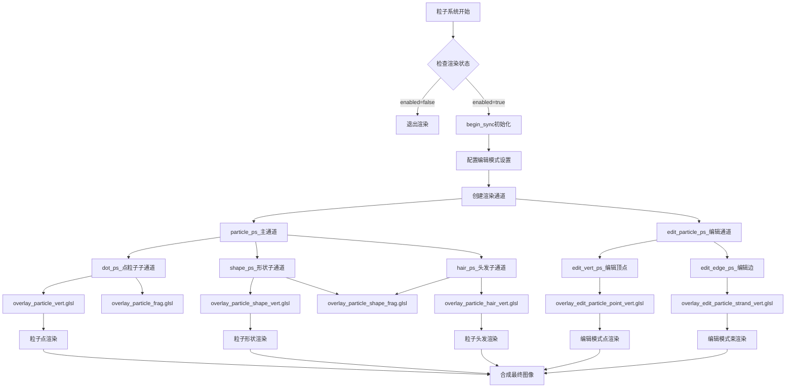
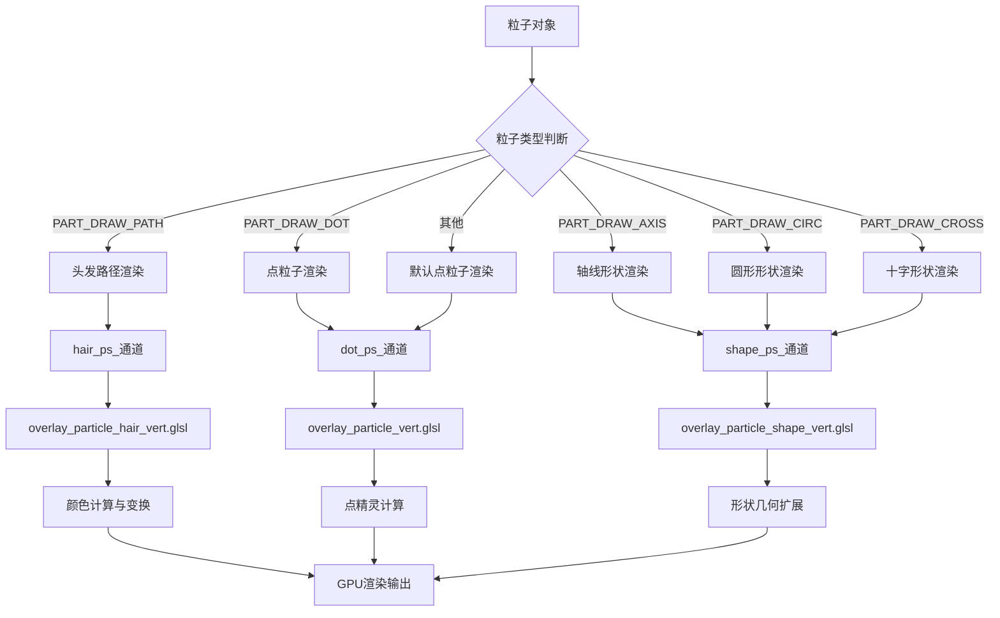

# Overlay粒子系统详解

## 目录
- [1. 概述](#概述)
- [2. 粒子系统架构](#粒子系统架构)
  - [2.1. Particles类核心架构](#1-particles类核心架构)
  - [2.2. 渲染管线组件](#2-渲染管线组件)
- [3. 粒子渲染类型详解](#粒子渲染类型详解)
  - [3.1. 点粒子渲染(DOT)](#1-点粒子渲染dot)
  - [3.2. 形状粒子渲染(SHAPE)](#2-形状粒子渲染shape)
  - [3.3. 头发粒子渲染(HAIR)](#3-头发粒子渲染hair)
- [4. 编辑模式粒子系统](#编辑模式粒子系统)
  - [4.1. 编辑模式点粒子](#1-编辑模式点粒子)
  - [4.2. 编辑模式粒子束](#2-编辑模式粒子束)
- [5. 数据结构与着色器接口](#数据结构与着色器接口)
  - [5.1. ParticlePointData结构](#1-particlepointdata结构)
  - [5.2. 着色器信息定义](#2-着色器信息定义)
- [6. 粒子颜色与权重系统](#粒子颜色与权重系统)
  - [6.1. 权重纹理映射](#1-权重纹理映射)
  - [6.2. 颜色计算算法](#2-颜色计算算法)
- [7. 性能优化技术](#性能优化技术)
  - [7.1. 实例化渲染](#1-实例化渲染)
  - [7.2. 条件渲染](#2-条件渲染)
- [8. 渲染管线流程图](#渲染管线流程图)

## 1. 概述 

Blender Overlay引擎中的粒子系统负责渲染各种类型的粒子效果，包括点粒子、形状粒子、头发粒子以及编辑模式下的粒子操作。该系统通过高效的GPU渲染管线，实现了粒子的实时可视化，支持多种渲染模式和编辑功能。

粒子系统的核心职责包括：
- 粒子生命周期的可视化展示
- 不同粒子类型的渲染支持
- 编辑模式下的交互操作
- 权重和颜色的动态映射
- 高性能的批量渲染

## 2. 粒子系统架构 

### 2.1. Particles类核心架构 

**定义位置**: `overlay_particle.hh:28-298`

`Particles`类继承自`Overlay`基类，是粒子系统的核心管理器：

```cpp
class Particles : Overlay {
private:
  PassMain particle_ps_ = {"particle_ps_"};      // 主粒子渲染通道
  PassMain::Sub *dot_ps_ = nullptr;             // 点粒子子通道
  PassMain::Sub *shape_ps_ = nullptr;           // 形状粒子子通道  
  PassMain::Sub *hair_ps_ = nullptr;            // 头发粒子子通道

  PassSimple edit_particle_ps_ = {"edit_particle_ps_"}; // 编辑模式粒子通道
  PassSimple::Sub *edit_vert_ps_ = nullptr;     // 编辑顶点子通道
  PassSimple::Sub *edit_edge_ps_ = nullptr;     // 编辑边子通道

  bool show_weight_ = false;                    // 权重显示标志
  bool show_point_inner_ = false;               // 内点显示标志
  bool show_point_tip_ = false;                 // 端点显示标志
};
```

#### 渲染通道架构

粒子系统采用分层渲染通道架构：
- **PassMain**: 用于常规粒子渲染，支持深度测试和颜色写入
- **PassSimple**: 用于编辑模式粒子渲染，简化渲染状态

### 2.2. 渲染管线组件 

**定义位置**: `overlay_particle.hh:44-115`

#### begin_sync初始化过程

```cpp
void begin_sync(Resources &res, const State &state) final {
  enabled_ = state.is_space_v3d() && !state.skip_particles;
  
  if (!enabled_) return;
  
  const bool is_transform = (G.moving & G_TRANSFORM_OBJ) != 0;
  const ParticleEditSettings *edit_settings = PE_settings(const_cast<Scene *>(state.scene));
  
  // 配置编辑模式设置
  if (edit_settings) {
    show_weight_ = (edit_settings->brushtype == PE_BRUSH_WEIGHT);
    show_point_inner_ = edit_settings->selectmode == SCE_SELECT_POINT;
    show_point_tip_ = ELEM(edit_settings->selectmode, SCE_SELECT_POINT, SCE_SELECT_END);
  }
}
```

## 3. 粒子渲染类型详解 

### 3.1. 点粒子渲染(DOT) 

点粒子是基础的粒子渲染形式，以屏幕空间点精灵形式渲染。

#### 顶点着色器分析

**定义位置**: `overlay_particle_vert.glsl:14-36`

```glsl
void main() {
  select_id_set(drw_custom_id());

  /* Draw-size packed in alpha. */
  float draw_size = ucolor.a;

  float3 world_pos = part_pos;

  gl_Position = drw_point_world_to_homogenous(world_pos);
  /* World sized points. */
  gl_PointSize = draw_size * drw_view().winmat[1][1] * uniform_buf.size_viewport.y / gl_Position.w;

  /* Coloring */
  if (part_val < 0.0f) {
    final_color = float4(ucolor.rgb, 1.0f);
  }
  else {
    final_color = float4(texture(weight_tx, part_val).rgb, 1.0f);
  }

  view_clipping_distances(world_pos);
}
```

#### 关键特性

1. **世界大小保持**: 点粒子根据相机距离自动调整大小
2. **权重颜色映射**: 支持基于权重的动态着色
3. **选择ID支持**: 完整的选择系统集成

#### 片元着色器分析

**定义位置**: `overlay_particle_frag.glsl:12-34`

```glsl
void main() {
  float2 uv = gl_PointCoord - float2(0.5f);
  float dist = length(uv);

  if (dist > 0.5f) {
    gpu_discard_fragment();
    return;
  }
  /* Nice sphere falloff. */
  float intensity = sqrt(1.0f - dist * 2.0f) * 0.5f + 0.5f;
  frag_color = final_color * float4(intensity, intensity, intensity, 1.0f);

  /* The default value of GL_POINT_SPRITE_COORD_ORIGIN is GL_UPPER_LEFT. Need to reverse the Y. */
  uv.y = -uv.y;
  /* Subtract distance to outer edge of the circle. (0.75 is manually tweaked to look better) */
  float2 edge_pos = gl_FragCoord.xy - uv * (0.75f / (dist + 1e-9f));
  float2 edge_start = edge_pos + float2(-uv.y, uv.x);

  line_output = pack_line_data(gl_FragCoord.xy, edge_start, edge_pos);

  select_id_output(select_id);
}
```

#### 渲染特性

- **圆形裁剪**: 只渲染圆形区域内的像素
- **球形衰减**: 模拟3D球体的光照效果
- **边缘抗锯齿**: 提供平滑的边缘过渡

### 3.2. 形状粒子渲染(SHAPE) 

形状粒子支持多种几何形状的渲染，包括轴线、圆形、十字等。

#### 顶点着色器分析

**定义位置**: `overlay_particle_shape_vert.glsl:33-102`

```glsl
void main() {
  select_id_set(drw_custom_id());

  int particle_id = gl_VertexID;
  int shape_vert_id = gl_VertexID;

  switch (OVERLAY_ParticleShape(shape_type)) {
    case PART_SHAPE_AXIS:
    case PART_SHAPE_CROSS:
      shape_vert_id = gl_VertexID % 6;
      particle_id = gl_VertexID / 6;
      break;
    case PART_SHAPE_CIRCLE:
      shape_vert_id = gl_VertexID % (PARTICLE_SHAPE_CIRCLE_RESOLUTION * 2);
      particle_id = gl_VertexID / (PARTICLE_SHAPE_CIRCLE_RESOLUTION * 2);
      break;
  }

  ParticlePointData part = part_pos[particle_id];
  
  // 形状位置计算
  float3 shape_pos = float3(0.0f);
  switch (OVERLAY_ParticleShape(shape_type)) {
    case PART_SHAPE_AXIS:
      shape_pos = float3(axis_id == 0, axis_id == 1, axis_id == 2) * 2.0f * float(axis_vert != 0u);
      break;
    case PART_SHAPE_CROSS:
      shape_pos = float3(axis_id == 0, axis_id == 1, axis_id == 2) *
                  (axis_vert == 0u ? 1.0f : -1.0f);
      break;
    case PART_SHAPE_CIRCLE:
      shape_pos.xy = circle_position(M_TAU * float((shape_vert_id + 1) / 2) /
                                     float(PARTICLE_SHAPE_CIRCLE_RESOLUTION));
      break;
  }

  // 颜色计算
  final_color = float4(1.0f);
  if (shape_type == PART_SHAPE_AXIS) {
    /* Works because of flat interpolation. */
    final_color.rgb = shape_pos;
  }
  else {
    final_color.rgb = part.value < 0.0f ? ucolor.rgb : texture(weight_tx, part.value).rgb;
  }

  /* Draw-size packed in alpha. */
  shape_pos *= ucolor.a;

  float3 world_pos = part.position;
  if (shape_type == PART_SHAPE_CIRCLE) {
    /* World sized, camera facing geometry. */
    world_pos += transform_direction(drw_view().viewinv, shape_pos);
  }
  else {
    world_pos += rotate(shape_pos, part.rotation);
  }
  gl_Position = drw_point_world_to_homogenous(world_pos);
  edge_start = edge_pos = ((gl_Position.xy / gl_Position.w) * 0.5f + 0.5f) *
                          uniform_buf.size_viewport;

  view_clipping_distances(world_pos);
}
```

#### 形状类型定义

**定义位置**: `overlay_shader_shared.hh:384-388`

```cpp
enum OVERLAY_ParticleShape : uint32_t {
  PART_SHAPE_AXIS = 1,    // 三轴指示器
  PART_SHAPE_CIRCLE = 2,  // 圆形
  PART_SHAPE_CROSS = 3,   // 十字形
};
```

#### 关键特性

1. **实例化扩展**: 通过顶点ID扩展几何体
2. **四元数旋转**: 支持任意方向的粒子旋转
3. **相机朝向**: 圆形形状始终面向相机
4. **颜色编码**: 轴线形状使用位置编码颜色

### 3.3. 头发粒子渲染(HAIR) 

头发粒子以线条形式渲染，支持复杂的颜色和选择状态。

#### 顶点着色器分析

**定义位置**: `overlay_particle_hair_vert.glsl:88-119`

```glsl
void main() {
  select_id_set(drw_custom_id());

  float3 ws_P = drw_point_object_to_world(pos);
  float3 ws_N = normalize(drw_normal_object_to_world(-nor));

  gl_Position = drw_point_world_to_homogenous(ws_P);

  edge_start = edge_pos = ((gl_Position.xy / gl_Position.w) * 0.5f + 0.5f) *
                          uniform_buf.size_viewport;

  float3 rim_col, wire_col;
  if (color_type == V3D_SHADING_OBJECT_COLOR || color_type == V3D_SHADING_RANDOM_COLOR) {
    wire_object_color_get(rim_col, wire_col);
  }
  else {
    wire_color_get(rim_col, wire_col);
  }

  float facing = clamp(abs(dot(ws_N, drw_world_incident_vector(ws_P))), 0.0f, 1.0f);

  /* Do interpolation in a non-linear space to have a better visual result. */
  rim_col = sqrt(rim_col);
  wire_col = sqrt(wire_col);
  float3 final_front_col = mix(rim_col, wire_col, 0.35f);
  final_color.rgb = mix(rim_col, final_front_col, facing);
  final_color.rgb = square(final_color.rgb);
  final_color.a = 1.0f;

  view_clipping_distances(ws_P);
}
```

#### 颜色计算系统

**定义位置**: `overlay_particle_hair_vert.glsl:24-86`

```glsl
void wire_color_get(out float3 rim_col, out float3 wire_col) {
  eObjectInfoFlag ob_flag = drw_object_infos().flag;
  bool is_selected = flag_test(ob_flag, OBJECT_SELECTED);
  bool is_from_set = flag_test(ob_flag, OBJECT_FROM_SET);
  bool is_active = flag_test(ob_flag, OBJECT_ACTIVE);

  if (is_from_set) {
    rim_col = theme.colors.wire.rgb;
    wire_col = theme.colors.wire.rgb;
  }
  else if (is_selected && use_coloring) {
    if (is_transform) {
      rim_col = theme.colors.transform.rgb;
    }
    else if (is_active) {
      rim_col = theme.colors.active_object.rgb;
    }
    else {
      rim_col = theme.colors.object_select.rgb;
    }
    wire_col = theme.colors.wire.rgb;
  }
  else {
    rim_col = theme.colors.wire.rgb;
    wire_col = theme.colors.background.rgb;
  }
}
```

#### HSV颜色转换

**定义位置**: `overlay_particle_hair_vert.glsl:53-59`

```glsl
float3 hsv_to_rgb(float3 hsv) {
  float3 nrgb = abs(hsv.x * 6.0f - float3(3.0f, 2.0f, 4.0f)) * float3(1, -1, -1) +
                float3(-1, 2, 2);
  nrgb = clamp(nrgb, 0.0f, 1.0f);
  return ((nrgb - 1.0f) * hsv.y + 1.0f) * hsv.z;
}
```

## 4. 编辑模式粒子系统 

### 4.1. 编辑模式点粒子 

编辑模式下的点粒子提供交互式编辑功能。

#### 顶点着色器分析

**定义位置**: `overlay_edit_particle_point_vert.glsl:34-82`

```glsl
void main() {
#ifdef CURVES_POINT
  bool is_active = (data & EDIT_CURVES_ACTIVE_HANDLE) != 0u;
  bool is_bezier_handle = (data & EDIT_CURVES_BEZIER_HANDLE) != 0u;

  if (is_bezier_handle && ((uint(curve_handle_display) == CURVE_HANDLE_NONE) ||
                           (uint(curve_handle_display) == CURVE_HANDLE_SELECTED) && !is_active))
  {
    DISCARD_VERTEX
  }
#endif

  float3 world_pos = drw_point_object_to_world(pos);
  gl_Position = drw_point_world_to_homogenous(world_pos);
  float end_point_size_factor = 1.0f;

  if (use_weight) {
    final_color = float4(weight_to_rgb(selection), 1.0f);
  }
  else {
    float4 color_selected = use_grease_pencil ? theme.colors.gpencil_vertex_select :
                                                theme.colors.vert_select;
    float4 color_not_selected = use_grease_pencil ? theme.colors.gpencil_vertex :
                                                    theme.colors.vert;
    final_color = mix(color_not_selected, color_selected, selection);

#if 1 /* Should be checking CURVES_POINT */
    if (do_stroke_endpoints) {
      bool is_stroke_start = (vflag & GP_EDIT_STROKE_START) != 0u;
      bool is_stroke_end = (vflag & GP_EDIT_STROKE_END) != 0u;

      if (is_stroke_start) {
        end_point_size_factor *= 2.0f;
        final_color.rgb = float3(0.0f, 1.0f, 0.0f);
      }
      else if (is_stroke_end) {
        end_point_size_factor *= 1.5f;
        final_color.rgb = float3(1.0f, 0.0f, 0.0f);
      }
    }
#endif
  }

  float vsize = use_grease_pencil ? theme.sizes.vertex_gpencil : theme.sizes.vert;
  gl_PointSize = vsize * 2.0f * end_point_size_factor;

  view_clipping_distances(world_pos);
}
```

#### 权重颜色转换

**定义位置**: `overlay_edit_particle_point_vert.glsl:19-32`

```glsl
float3 weight_to_rgb(float t) {
  if (t == no_active_weight) {
    /* No weight. */
    return theme.colors.wire.rgb;
  }
  if (t > 1.0f || t < 0.0f) {
    /* Error color */
    return float3(1.0f, 0.0f, 1.0f);
  }
  else {
    return texture(weight_tx, t).rgb;
  }
}
```

### 4.2. 编辑模式粒子束 

粒子束编辑模式用于编辑连续的粒子路径。

#### 顶点着色器分析

**定义位置**: `overlay_edit_particle_strand_vert.glsl:30-47`

```glsl
void main() {
  float3 world_pos = drw_point_object_to_world(pos);
  gl_Position = drw_point_world_to_homogenous(world_pos);

  if (use_weight) {
    final_color = float4(weight_to_rgb(selection), 1.0f);
  }
  else {
    float4 wire_color = use_grease_pencil ? theme.colors.gpencil_wire_edit :
                                            theme.colors.wire_edit;
    float4 selection_color = use_grease_pencil ? theme.colors.gpencil_vertex_select :
                                                 theme.colors.vert_select;
    final_color = mix(wire_color, selection_color, selection);
  }

  view_clipping_distances(world_pos);
}
```

## 5. 数据结构与着色器接口 

### 5.1. ParticlePointData结构 

**定义位置**: `overlay_shader_shared.hh:390-397`

```cpp
struct ParticlePointData {
  packed_float3 position;    // 粒子世界坐标位置
  /* Can either be velocity or acceleration. */
  float value;              // 粒子属性值(速度/加速度/权重)
  /* Rotation encoded as quaternion. */
  float4 rotation;          // 四元数旋转
};
```

#### 结构特性

1. **内存对齐**: 16字节对齐，优化GPU访问性能
2. **紧凑存储**: 使用packed_float3减少内存占用
3. **多用途字段**: value字段可存储多种属性数据

### 5.2. 着色器信息定义 

#### 粒子点着色器信息

**定义位置**: `overlay_extra_infos.hh:361-381`

```cpp
GPU_SHADER_CREATE_INFO(overlay_particle_dot_base)
  SAMPLER(0, sampler1D, weight_tx)
  PUSH_CONSTANT(float4, ucolor) /* Draw-size packed in alpha. */
  VERTEX_IN(0, float3, part_pos)
  VERTEX_IN(1, float4, part_rot)
  VERTEX_IN(2, float, part_val)
  VERTEX_OUT(overlay_particle_iface)
  FRAGMENT_OUT(0, float4, frag_color)
  FRAGMENT_OUT(1, float4, line_output)
  VERTEX_SOURCE("overlay_particle_vert.glsl")
  FRAGMENT_SOURCE("overlay_particle_frag.glsl")
  ADDITIONAL_INFO(draw_view)
  ADDITIONAL_INFO(draw_globals)
GPU_SHADER_CREATE_END()
```

#### 粒子形状着色器信息

**定义位置**: `overlay_extra_infos.hh:383-404`

```cpp
GPU_SHADER_CREATE_INFO(overlay_particle_shape_base)
  TYPEDEF_SOURCE("overlay_shader_shared.hh")
  SAMPLER(0, sampler1D, weight_tx)
  PUSH_CONSTANT(float4, ucolor) /* Draw-size packed in alpha. */
  PUSH_CONSTANT(int, shape_type)
  /* Use first attribute to only bind one buffer. */
  STORAGE_BUF_FREQ(0, read, ParticlePointData, part_pos[], GEOMETRY)
  VERTEX_OUT(overlay_extra_iface)
  FRAGMENT_OUT(0, float4, frag_color)
  FRAGMENT_OUT(1, float4, line_output)
  VERTEX_SOURCE("overlay_particle_shape_vert.glsl")
  FRAGMENT_SOURCE("overlay_particle_shape_frag.glsl")
  ADDITIONAL_INFO(draw_view)
  ADDITIONAL_INFO(draw_globals)
GPU_SHADER_CREATE_END()
```

## 6. 粒子颜色与权重系统 

### 6.1. 权重纹理映射 

权重系统通过1D纹理实现连续的颜色映射：

```glsl
final_color.rgb = part.value < 0.0f ? ucolor.rgb : texture(weight_tx, part.value).rgb;
```

#### 权重值映射规则

1. **负值**: 使用统一颜色ucolor
2. **0.0-1.0范围**: 从权重纹理采样
3. **超出范围**: 显示错误颜色(紫色)

### 6.2. 颜色计算算法 

#### 非线性颜色插值

**定义位置**: `overlay_particle_hair_vert.glsl:110-116`

```glsl
/* Do interpolation in a non-linear space to have a better visual result. */
rim_col = sqrt(rim_col);
wire_col = sqrt(wire_col);
float3 final_front_col = mix(rim_col, wire_col, 0.35f);
final_color.rgb = mix(rim_col, final_front_col, facing);
final_color.rgb = square(final_color.rgb);
```

#### 视角相关着色

```glsl
float facing = clamp(abs(dot(ws_N, drw_world_incident_vector(ws_P))), 0.0f, 1.0f);
final_color.rgb = mix(rim_col, final_front_col, facing);
```

这种算法根据表面法线与视线方向的夹角计算颜色，提供更好的3D感知效果。

## 7. 性能优化技术 

### 7.1. 实例化渲染 

粒子系统大量使用实例化渲染技术：

1. **几何体扩展**: 通过顶点ID实现几何体实例化
2. **存储缓冲器**: 使用SSBO高效传递粒子数据
3. **频率优化**: 区分几何和实例数据的更新频率

### 7.2. 条件渲染 

**定义位置**: `overlay_particle.hh:117-181`

```cpp
void edit_object_sync(Manager &manager,
                      const ObjectRef &ob_ref,
                      Resources & /*res*/,
                      const State &state) final {
  if (!enabled_) {
    return;
  }

  // 条件性创建编辑结构
  PTCacheEdit *edit = PE_create_current(state.depsgraph, scene_orig, object_orig);
  if (edit == nullptr) {
    /* Happens when trying to edit particles in EMITTER mode without having them cached. */
    return;
  }
}
```

#### 优化策略

1. **早期退出**: 无效状态时立即返回
2. **惰性计算**: 按需创建编辑结构
3. **批量处理**: 相同类型粒子统一处理

## 8. 渲染管线流程图 



### 渲染决策树



### 数据流图

```mermaid
graph LR
    A[粒子系统数据] --> B[ParticlePointData[]]
    
    B --> C[位置数据]
    B --> D[旋转数据]
    B --> E[属性值数据]
    
    C --> F[顶点着色器]
    D --> F
    E --> F
    
    F --> G[坐标变换]
    F --> H[颜色计算]
    F --> I[几何扩展]
    
    G --> J[光栅化]
    H --> J
    I --> J
    
    J --> K[片元着色器]
    
    K --> L[最终像素输出]
```

这个粒子系统通过精心设计的架构，实现了高效、灵活的粒子渲染，支持从简单的点粒子到复杂的头发路径，以及功能完备的编辑模式，为用户提供了强大的粒子系统可视化工具。