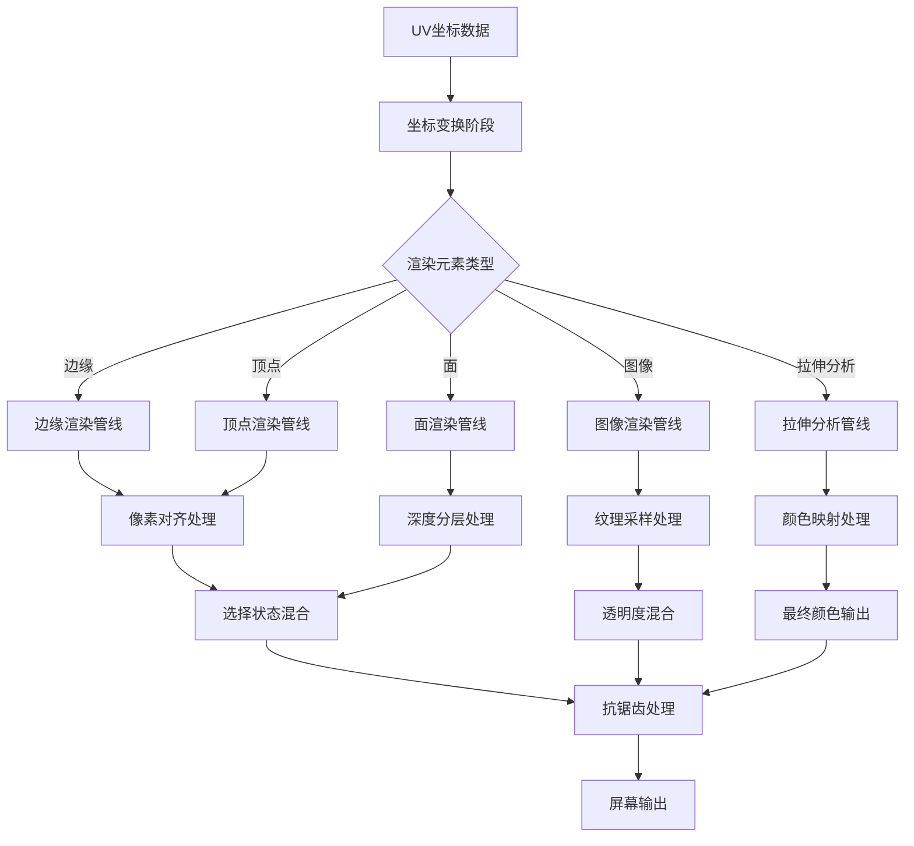

# Overlay UV编辑器系统详解

## 目录

- [1. 系统概述](#1-系统概述)
- [2. UV空间渲染架构](#2-uv空间渲染架构)
- [3. UV边缘渲染系统](#3-uv边缘渲染系统)
- [4. UV顶点渲染系统](#4-uv顶点渲染系统)
- [5. UV面渲染系统](#5-uv面渲染系统)
- [6. UV图像显示系统](#6-uv图像显示系统)
- [7. UV拉伸分析系统](#7-uv拉伸分析系统)
- [8. UV坐标变换系统](#8-uv坐标变换系统)
- [9. 像素对齐和抗锯齿](#9-像素对齐和抗锯齿)
- [10. 深度管理和视觉层次](#10-深度管理和视觉层次)
- [11. 选择状态处理](#11-选择状态处理)
- [12. 平铺图像系统](#12-平铺图像系统)
- [13. 性能优化策略](#13-性能优化策略)

## 1. 系统概述

Blender的Overlay引擎中UV编辑器系统是一个专门用于2D UV空间编辑的可视化渲染管线。该系统通过精确的像素对齐、智能的深度管理和丰富的视觉反馈，为用户提供了直观的UV编辑体验。

### 1.1 核心功能

- **2D空间渲染**: 将UV坐标从[0,1]空间映射到屏幕空间
- **像素对齐**: 避免UV网格的渲染伪影和闪烁
- **多层级深度管理**: 确保正确的视觉前后关系
- **丰富的视觉反馈**: 选择状态、固定状态、拉伸分析等
- **实时交互**: 编辑操作的即时视觉响应

### 1.2 文件组织结构

```
overlay/shaders/
├── overlay_edit_uv_edges_vert.glsl      # UV边缘顶点着色器
├── overlay_edit_uv_edges_frag.glsl      # UV边缘片段着色器
├── overlay_edit_uv_verts_vert.glsl      # UV顶点顶点着色器
├── overlay_edit_uv_verts_frag.glsl      # UV顶点片段着色器
├── overlay_edit_uv_faces_vert.glsl      # UV面顶点着色器
├── overlay_edit_uv_face_dots_vert.glsl  # UV面点顶点着色器
├── overlay_edit_uv_image_vert.glsl      # UV图像顶点着色器
├── overlay_edit_uv_image_mask_frag.glsl # UV图像遮罩片段着色器
├── overlay_edit_uv_stretching_vert.glsl # UV拉伸分析着色器
└── overlay_edit_uv_tiled_image_borders_vert.glsl # 平铺图像边界着色器
```

## 2. UV空间渲染架构

### 2.1 渲染管线架构



### 2.2 UV空间坐标系转换

UV编辑器使用标准化的[0,1]坐标系统，但需要适配不同的屏幕空间和显示模式：

**定义位置**: `overlay_edit_uv_edges_vert.glsl:47-48`
```glsl
float3 world_pos = float3(v_in.uv, 0.0f);
vert_out.hs_P = drw_point_world_to_homogenous(world_pos);
```

**关键特点**:
- UV坐标直接作为3D世界坐标的X,Y分量
- Z分量固定为0，表示所有UV元素在同一平面上
- 通过深度偏移实现视觉层次

## 3. UV边缘渲染系统

### 3.1 边缘顶点处理

**定义位置**: `overlay_edit_uv_edges_vert.glsl:43-70`
```glsl
VertOut vertex_main(VertIn v_in)
{
  VertOut vert_out;

  float3 world_pos = float3(v_in.uv, 0.0f);
  vert_out.hs_P = drw_point_world_to_homogenous(world_pos);
  /* Snap vertices to the pixel grid to reduce artifacts. */
  float2 half_viewport_res = uniform_buf.size_viewport * 0.5f;
  float2 half_pixel_offset = uniform_buf.size_viewport_inv * 0.5f;
  vert_out.hs_P.xy = floor(vert_out.hs_P.xy * half_viewport_res) / half_viewport_res +
                     half_pixel_offset;

  const uint selection_flag = use_edge_select ? uint(EDGE_UV_SELECT) : uint(VERT_UV_SELECT);
  vert_out.selected = flag_test(v_in.flag, selection_flag);

  /* Move selected edges to the top so that they occlude unselected edges.
   * - Vertices are between 0.0 and 0.2 depth.
   * - Edges between 0.2 and 0.4 depth.
   * - Image pixels are at 0.75 depth.
   * - 1.0 is used for the background. */
  vert_out.hs_P.z = vert_out.selected ? 0.25f : 0.35f;

  /* Avoid precision loss. */
  vert_out.stipple_pos = 500.0f + 500.0f * (vert_out.hs_P.xy / vert_out.hs_P.w);
  vert_out.stipple_start = vert_out.stipple_pos;

  return vert_out;
}
```

**关键技术**:
1. **像素对齐**: 将顶点坐标对齐到像素网格，避免闪烁
2. **深度分层**: 选中边缘在0.25深度，未选中在0.35深度
3. **选择模式**: 支持边缘选择和顶点选择两种模式
4. **点划线准备**: 为虚线渲染准备标准化坐标

### 3.2 几何着色器边缘扩展

**定义位置**: `overlay_edit_uv_edges_vert.glsl:104-156`
```glsl
void geometry_main(VertOut geom_in[2],
                   uint out_vertex_id,
                   uint out_primitive_id,
                   uint out_invocation_id)
{
  float2 ss_pos0 = drw_perspective_divide(geom_in[0].hs_P).xy;
  float2 ss_pos1 = drw_perspective_divide(geom_in[1].hs_P).xy;

  float half_size = theme.sizes.edge;
  /* Enlarge edge for outline drawing. */
  /* Factor of 3.0 out of nowhere! Seems to fix issues with float imprecision. */
  half_size += (OVERLAY_UVLineStyle(line_style) == OVERLAY_UV_LINE_STYLE_OUTLINE) ?
                   max(theme.sizes.edge * (do_smooth_wire ? 1.0f : 3.0f), 1.0f) :
                   0.0f;
  /* Add 1 PX for AA. */
  if (do_smooth_wire) {
    half_size += 0.5f;
  }

  float2 line_dir = normalize(ss_pos0 - ss_pos1);
  float2 line_perp = float2(-line_dir.y, line_dir.x);
  float2 edge_ofs = line_perp * uniform_buf.size_viewport_inv * ceil(half_size);
  /* Multiply offset by 2 because gl_Position range is [-1..1]. */
  edge_ofs *= 2.0f;

  bool select_0 = geom_in[0].selected;
  /* No blending with edge selection. */
  bool select_1 = use_edge_select ? geom_in[0].selected : geom_in[1].selected;

  // ... 生成扩展四边形顶点
}
```

**技术特点**:
1. **屏幕空间计算**: 在屏幕空间计算边缘扩展，确保一致的视觉宽度
2. **轮廓模式**: 支持特殊的轮廓显示模式，扩大边缘宽度
3. **抗锯齿**: 可选的1像素抗锯齿扩展
4. **选择状态传递**: 正确处理不同端点的选择状态

### 3.3 边缘样式系统

**定义位置**: `overlay_edit_uv_edges_frag.glsl:22-51`
```glsl
if (OVERLAY_UVLineStyle(line_style) == OVERLAY_UV_LINE_STYLE_OUTLINE) {
  if (use_edge_select) {
    /* TODO(@ideasman42): The current wire-edit color contrast enough against the selection.
     * Look into changing the default theme color instead of reducing contrast with edge-select.
     */
    inner_color = (selection_fac != 0.0f) ? theme.colors.edge_select :
                                            (theme.colors.wire_edit * 0.5f);
  }
  else {
    inner_color = mix(theme.colors.wire_edit, theme.colors.edge_select, selection_fac);
  }
  outer_color = float4(float3(0.0f), 1.0f);
}
else if (OVERLAY_UVLineStyle(line_style) == OVERLAY_UV_LINE_STYLE_DASH) {
  if (fract(line_distance / float(dash_length)) < 0.5f) {
    inner_color = mix(float4(float3(0.35f), 1.0f), theme.colors.edge_select, selection_fac);
  }
}
else if (OVERLAY_UVLineStyle(line_style) == OVERLAY_UV_LINE_STYLE_BLACK) {
  float4 base_color = float4(float3(0.0f), 1.0f);
  inner_color = mix(base_color, theme.colors.edge_select, selection_fac);
}
else if (OVERLAY_UVLineStyle(line_style) == OVERLAY_UV_LINE_STYLE_WHITE) {
  float4 base_color = float4(1.0f);
  inner_color = mix(base_color, theme.colors.edge_select, selection_fac);
}
else if (OVERLAY_UVLineStyle(line_style) == OVERLAY_UV_LINE_STYLE_SHADOW) {
  inner_color = theme.colors.uv_shadow;
}
```

**样式类型**:
1. **OUTLINE**: 黑色轮廓 + 选择颜色填充
2. **DASH**: 虚线样式，根据距离切换显示
3. **BLACK**: 纯黑色，选择时高亮
4. **WHITE**: 纯白色，选择时高亮
5. **SHADOW**: 阴影颜色，用于背景显示

## 4. UV顶点渲染系统

### 4.1 顶点颜色和状态管理

**定义位置**: `overlay_edit_uv_verts_vert.glsl:14-42`
```glsl
void main()
{
  /* TODO: Theme? */
  constexpr float4 pinned_col = float4(1.0f, 0.0f, 0.0f, 1.0f);

  bool is_selected = (flag & (VERT_UV_SELECT | FACE_UV_SELECT)) != 0u;
  bool is_pinned = (flag & VERT_UV_PINNED) != 0u;
  float4 deselect_col = (is_pinned) ? pinned_col : float4(color.rgb, 1.0f);
  fill_color = (is_selected) ? theme.colors.vert_select : deselect_col;
  outline_color = (is_pinned) ? pinned_col : float4(fill_color.rgb, 0.0f);

  float3 world_pos = float3(au, 0.0f);
  /* Move selected vertices to the top
   * Vertices are between 0.0 and 0.2, Edges between 0.2 and 0.4
   * actual pixels are at 0.75, 1.0 is used for the background. */
  float depth = is_selected ? (is_pinned ? 0.05f : 0.10f) : 0.15f;
  gl_Position = float4(drw_point_world_to_homogenous(world_pos).xy, depth, 1.0f);
  gl_PointSize = dot_size;

  /* calculate concentric radii in pixels */
  float radius = 0.5f * dot_size;

  /* start at the outside and progress toward the center */
  radii[0] = radius;
  radii[1] = radius - 1.0f;
  radii[2] = radius - outline_width;
  radii[3] = radius - outline_width - 1.0f;

  /* convert to PointCoord units */
  radii /= dot_size;
}
```

**视觉层次**:
1. **固定顶点** (0.05深度): 红色显示，最高优先级
2. **选中顶点** (0.10深度): 选中颜色显示
3. **普通顶点** (0.15深度): 基础颜色显示

**状态检测**:
- `VERT_UV_SELECT`: UV顶点选中状态
- `FACE_UV_SELECT`: UV面选中状态（影响面内顶点）
- `VERT_UV_PINNED`: UV顶点固定状态

### 4.2 顶点圆形渲染

**定义位置**: `overlay_edit_uv_verts_frag.glsl:9-35`
```glsl
void main()
{
  float dist = length(gl_PointCoord - float2(0.5f));

  /* transparent outside of point
   * --- 0 ---
   * smooth transition
   * --- 1 ---
   * pure outline color
   * --- 2 ---
   * smooth transition
   * --- 3 ---
   * pure fill color
   * ...
   * dist = 0 at center of point */

  float midStroke = 0.5f * (radii[1] + radii[2]);

  if (dist > midStroke) {
    frag_color.rgb = outline_color.rgb;
    frag_color.a = mix(outline_color.a, 0.0f, smoothstep(radii[1], radii[0], dist));
  }
  else {
    frag_color = mix(fill_color, outline_color, smoothstep(radii[3], radii[2], dist));
  }
}
```

**渲染原理**:
1. **同心圆系统**: 使用4个半径定义不同的渲染区域
2. **平滑过渡**: 使用smoothstep实现边缘的平滑过渡
3. **抗锯齿**: 外部渐变透明实现自然的抗锯齿效果
4. **双层颜色**: 填充色和轮廓色的独立控制

## 5. UV面渲染系统

### 5.1 UV面颜色计算

**定义位置**: `overlay_edit_uv_faces_vert.glsl:14-28`
```glsl
void main()
{
  float3 world_pos = float3(au, 0.0f);
  gl_Position = drw_point_world_to_homogenous(world_pos);

  bool is_selected = (flag & FACE_UV_SELECT) != 0u;
  bool is_active = (flag & FACE_UV_ACTIVE) != 0u;
  eObjectInfoFlag ob_flag = drw_object_infos().flag;
  bool is_object_active = flag_test(ob_flag, OBJECT_ACTIVE_EDIT_MODE);

  final_color = (is_selected) ? theme.colors.face_select : theme.colors.face;
  final_color = (is_active) ? theme.colors.edit_mesh_active : final_color;
  final_color.a *= is_object_active ? uv_opacity : (uv_opacity * 0.25f);
}
```

**颜色优先级**:
1. **活跃面**: 使用活跃编辑颜色，最高优先级
2. **选中面**: 使用面选择颜色
3. **普通面**: 使用基础面颜色

**透明度控制**:
- **活跃对象**: 使用完整的uv_opacity
- **非活跃对象**: 使用uv_opacity的25%，降低视觉干扰

### 5.2 UV面点渲染

**定义位置**: `overlay_edit_uv_face_dots_vert.glsl:12-21`
```glsl
void main()
{
  float3 world_pos = float3(au, 0.0f);
  gl_Position = drw_point_world_to_homogenous(world_pos);

  final_color = ((flag & FACE_UV_SELECT) != 0u) ? theme.colors.facedot :
                                                  float4(theme.colors.wire.rgb, 1.0f);
  gl_PointSize = dot_size;
}
```

**功能特点**:
- 在每个UV面的中心显示一个点
- 选中面使用facedot颜色，未选中使用wire颜色
- 用于快速识别面的选择状态

## 6. UV图像显示系统

### 6.1 UV图像顶点处理

**定义位置**: `overlay_edit_uv_image_vert.glsl:11-19`
```glsl
void main()
{
  /* `pos` contains the coordinates of a quad (-1..1). but we need the coordinates of an image
   * plane (0..1) */
  float3 image_pos = pos * 0.5f + 0.5f;
  gl_Position = drw_point_world_to_homogenous(
      float3(image_pos.xy * brush_scale + brush_offset, 0.0f));
  uvs = image_pos.xy;
}
```

**坐标变换**:
1. **标准化转换**: 从[-1,1]四边形坐标转换为[0,1]图像坐标
2. **缩放和平移**: 应用brush_scale和brush_offset进行变换
3. **UV传递**: 将变换后的坐标传递给片段着色器

### 6.2 UV图像遮罩处理

**定义位置**: `overlay_edit_uv_image_mask_frag.glsl:11-18`
```glsl
void main()
{
  float2 uvs_clamped = clamp(uvs, 0.0f, 1.0f);
  float mask_value = texture_read_as_linearrgb(img_tx, true, uvs_clamped).r;
  mask_value = mix(1.0f, mask_value, opacity);
  frag_color = float4(color.rgb * mask_value, color.a);
}
```

**处理流程**:
1. **UV限制**: 将UV坐标限制在[0,1]范围内
2. **纹理采样**: 从图像纹理的红色通道读取遮罩值
3. **透明度混合**: 根据opacity参数混合遮罩效果
4. **颜色应用**: 将遮罩值应用到输入颜色上

## 7. UV拉伸分析系统

### 7.1 拉伸权重颜色映射

**定义位置**: `overlay_edit_uv_stretching_vert.glsl:12-46`
```glsl
float3 weight_to_rgb(float weight)
{
  float3 rgb;
  float blend = ((weight / 2.0f) + 0.5f);

  if (weight <= 0.25f) { /* blue->cyan */
    rgb[0] = 0.0f;
    rgb[1] = blend * weight * 4.0f;
    rgb[2] = blend;
  }
  else if (weight <= 0.50f) { /* cyan->green */
    rgb[0] = 0.0f;
    rgb[1] = blend;
    rgb[2] = blend * (1.0f - ((weight - 0.25f) * 4.0f));
  }
  else if (weight <= 0.75f) { /* green->yellow */
    rgb[0] = blend * ((weight - 0.50f) * 4.0f);
    rgb[1] = blend;
    rgb[2] = 0.0f;
  }
  else if (weight <= 1.0f) { /* yellow->red */
    rgb[0] = blend;
    rgb[1] = blend * (1.0f - ((weight - 0.75f) * 4.0f));
    rgb[2] = 0.0f;
  }
  else {
    /* exceptional value, unclamped or nan,
     * avoid uninitialized memory use */
    rgb[0] = 1.0f;
    rgb[1] = 0.0f;
    rgb[2] = 1.0f;
  }

  return rgb;
}
```

**颜色渐变系统**:
- **0.0 - 0.25**: 蓝色到青色（低拉伸）
- **0.25 - 0.50**: 青色到绿色（中等拉伸）
- **0.50 - 0.75**: 绿色到黄色（较高拉伸）
- **0.75 - 1.0**: 黄色到红色（高拉伸）
- **> 1.0**: 紫色（异常值）

### 7.2 拉伸计算算法

**定义位置**: `overlay_edit_uv_stretching_vert.glsl:67-71`
```glsl
float area_ratio_to_stretch(float ratio, float tot_ratio)
{
  ratio *= tot_ratio;
  return (ratio > 1.0f) ? (1.0f / ratio) : ratio;
}
```

**角度拉伸计算**:
```glsl
float2 angle_to_v2(float angle)
{
  return float2(cos(angle), sin(angle));
}

float angle_normalized_v2v2(float2 v1, float2 v2)
{
  v1 = normalize(v1 * aspect);
  v2 = normalize(v2 * aspect);
  /* this is the same as acos(dot_v3v3(v1, v2)), but more accurate */
  bool q = (dot(v1, v2) >= 0.0f);
  float2 v = (q) ? (v1 - v2) : (v1 + v2);
  float a = 2.0f * asin(length(v) / 2.0f);
  return (q) ? a : M_PI - a;
}
```

**拉伸分析模式**:
1. **面积拉伸**: 基于UV面积与3D面积的比例
2. **角度拉伸**: 基于UV角度与3D角度的偏差

## 8. UV坐标变换系统

### 8.1 像素对齐算法

**定义位置**: `overlay_edit_uv_edges_vert.glsl:49-53`
```glsl
/* Snap vertices to the pixel grid to reduce artifacts. */
float2 half_viewport_res = uniform_buf.size_viewport * 0.5f;
float2 half_pixel_offset = uniform_buf.size_viewport_inv * 0.5f;
vert_out.hs_P.xy = floor(vert_out.hs_P.xy * half_viewport_res) / half_viewport_res +
                   half_pixel_offset;
```

**算法原理**:
1. **视口缩放**: 将NDC坐标转换为像素坐标
2. **向下取整**: 使用floor函数对齐到像素网格
3. **缩放还原**: 转换回NDC坐标
4. **半像素偏移**: 补偿取整造成的偏移

### 8.2 坐标空间转换

**UV到世界空间**:
```glsl
float3 world_pos = float3(v_in.uv, 0.0f);
```

**世界空间到屏幕空间**:
```glsl
vert_out.hs_P = drw_point_world_to_homogenous(world_pos);
```

**屏幕空间到NDC**:
```glsl
float2 ss_pos = drw_perspective_divide(hs_P).xy;
```

## 9. 像素对齐和抗锯齿

### 9.1 边缘抗锯齿处理

**定义位置**: `overlay_edit_uv_edges_frag.glsl:52-68`
```glsl
float dist = abs(edge_coord) - max(theme.sizes.edge - 0.5f, 0.0f);
float dist_outer = dist - max(theme.sizes.edge, 1.0f);
float mix_w;
float mix_w_outer;

if (do_smooth_wire) {
  mix_w = smoothstep(LINE_SMOOTH_START, LINE_SMOOTH_END, dist);
  mix_w_outer = smoothstep(LINE_SMOOTH_START, LINE_SMOOTH_END, dist_outer);
}
else {
  mix_w = step(0.5f, dist);
  mix_w_outer = step(0.5f, dist_outer);
}

float4 final_color = mix(outer_color, inner_color, 1.0f - mix_w * outer_color.a);
final_color.a *= 1.0f - (outer_color.a > 0.0f ? mix_w_outer : mix_w);
```

**抗锯齿策略**:
1. **平滑模式**: 使用smoothstep实现渐变边缘
2. **阶梯模式**: 使用step实现硬边缘
3. **双层混合**: 内外层颜色的独立控制
4. **透明度控制**: 基于距离调整边缘透明度

### 9.2 顶点抗锯齿

**定义位置**: `overlay_edit_uv_verts_vert.glsl:31-42`
```glsl
/* calculate concentric radii in pixels */
float radius = 0.5f * dot_size;

/* start at the outside and progress toward the center */
radii[0] = radius;
radii[1] = radius - 1.0f;
radii[2] = radius - outline_width;
radii[3] = radius - outline_width - 1.0f;

/* convert to PointCoord units */
radii /= dot_size;
```

**半径系统**:
- `radii[0]`: 最外层半径（完全透明）
- `radii[1]`: 轮廓开始半径
- `radii[2]`: 轮廓结束半径
- `radii[3]`: 填充开始半径

## 10. 深度管理和视觉层次

### 10.1 深度分层系统

UV编辑器使用精确的深度值来确保正确的视觉层次：

```glsl
/* UV顶点深度层次 */
float depth = is_selected ? (is_pinned ? 0.05f : 0.10f) : 0.15f;

/* UV边缘深度层次 */
vert_out.hs_P.z = vert_out.selected ? 0.25f : 0.35f;

/* 完整深度层次定义 */
// 0.0 - 0.2: UV顶点（固定 > 选中 > 普通）
// 0.2 - 0.4: UV边缘（选中 > 普通）
// 0.75: 图像像素
// 1.0: 背景
```

### 10.2 深度偏移技术

**定义位置**: `overlay_edit_uv_verts_vert.glsl:27`
```glsl
float depth = is_selected ? (is_pinned ? 0.05f : 0.10f) : 0.15f;
gl_Position = float4(drw_point_world_to_homogenous(world_pos).xy, depth, 1.0f);
```

**策略**:
- **固定深度**: 直接设置Z值，避免深度测试冲突
- **状态优先**: 根据选择和固定状态分配深度
- **图像保护**: 图像像素在0.75深度，确保不被UV元素遮挡

## 11. 选择状态处理

### 11.1 选择标记位

```glsl
/* UV选择标记 */
#define VERT_UV_SELECT    (1 << 0)  // UV顶点选中
#define EDGE_UV_SELECT    (1 << 1)  // UV边缘选中
#define FACE_UV_SELECT    (1 << 2)  // UV面选中
#define FACE_UV_ACTIVE    (1 << 3)  // UV面活跃
#define VERT_UV_PINNED    (1 << 4)  // UV顶点固定
```

### 11.2 选择状态检测

**顶点选择检测**:
```glsl
bool is_selected = (flag & (VERT_UV_SELECT | FACE_UV_SELECT)) != 0u;
bool is_pinned = (flag & VERT_UV_PINNED) != 0u;
```

**边缘选择检测**:
```glsl
const uint selection_flag = use_edge_select ? uint(EDGE_UV_SELECT) : uint(VERT_UV_SELECT);
vert_out.selected = flag_test(v_in.flag, selection_flag);
```

**面选择检测**:
```glsl
bool is_selected = (flag & FACE_UV_SELECT) != 0u;
bool is_active = (flag & FACE_UV_ACTIVE) != 0u;
```

### 11.3 选择模式切换

系统支持两种选择模式的动态切换：
- **顶点选择模式**: 基于顶点的选择状态
- **边缘选择模式**: 基于边缘的选择状态

## 12. 平铺图像系统

### 12.1 平铺图像顶点处理

**定义位置**: `overlay_edit_uv_tiled_image_borders_vert.glsl:18-24`
```glsl
void main()
{
  /* `pos` contains the coordinates of a quad (-1..1). but we need the coordinates of an image
   * plane (0..1) */
  float3 image_pos = pos * 0.5f + 0.5f;
  gl_Position = drw_point_world_to_homogenous(tile_scale * image_pos + tile_pos);
}
```

**变换处理**:
1. **坐标标准化**: [-1,1] → [0,1]
2. **缩放变换**: 应用tile_scale缩放
3. **位置偏移**: 应用tile_pos平移
4. **透视变换**: 转换到屏幕空间

### 12.2 平铺系统架构

平铺图像系统支持：
- **多瓦片显示**: 同时显示多个UV瓦片
- **独立变换**: 每个瓦片可以有独立的缩放和位置
- **边界渲染**: 清晰的瓦片边界显示
- **无缝拼接**: 瓦片间的无缝连接

## 13. 性能优化策略

### 13.1 条件编译优化

系统大量使用条件编译来减少不必要的计算：

```glsl
#ifdef WIREFRAME
  vert_in.flag = 0u;
#else
  vert_in.flag = gpu_attr_load_uchar4(data, gpu_attr_1, v_i).x;
#endif

#ifdef STRETCH_ANGLE
  // 角度拉伸计算
#else
  // 面积拉伸计算
#endif
```

### 13.2 早期剔除优化

**边缘裁剪**:
```glsl
if (all(clipped)) {
  /* Totally clipped. */
  return;
}
```

### 13.3 纹理采样优化

**线性RGB转换**:
```glsl
float mask_value = texture_read_as_linearrgb(img_tx, true, uvs_clamped).r;
```

### 13.4 数学优化

**角度计算优化**:
```glsl
/* this is the same as acos(dot_v3v3(v1, v2)), but more accurate */
bool q = (dot(v1, v2) >= 0.0f);
float2 v = (q) ? (v1 - v2) : (v1 + v2);
float a = 2.0f * asin(length(v) / 2.0f);
return (q) ? a : M_PI - a;
```

---

## 总结

Blender Overlay引擎的UV编辑器系统是一个高度优化、功能完整的2D空间渲染解决方案。通过精确的像素对齐、智能的深度管理、丰富的视觉反馈系统，该系统为用户提供了专业级的UV编辑体验。

### 系统核心优势

1. **像素级精度**: 通过精确的像素对齐算法消除渲染伪影
2. **清晰的视觉层次**: 多层次的深度管理确保正确的元素前后关系
3. **丰富的反馈系统**: 选择状态、固定状态、拉伸分析等多维度视觉反馈
4. **高性能渲染**: 多种优化策略确保实时编辑的流畅体验
5. **灵活的样式系统**: 支持多种边缘样式和颜色主题
6. **专业的拉伸分析**: 提供面积和角度两种拉伸分析模式

### 技术创新点

1. **2D/3D统一渲染**: 将2D UV空间集成到3D渲染管线中
2. **智能像素对齐**: 动态适配不同分辨率和缩放级别
3. **多层深度管理**: 精确控制UV元素的视觉层次
4. **状态驱动的渲染**: 基于编辑状态动态调整渲染效果
5. **无缝平铺支持**: 高效的多瓦片图像显示系统

这个系统为Blender的UV编辑功能提供了坚实的技术基础，确保用户在进行复杂的纹理坐标编辑时能够获得清晰、直观、实时的视觉反馈。无论是游戏开发的UV布局，还是影视制作的纹理映射，这个系统都能满足专业用户的严苛要求。