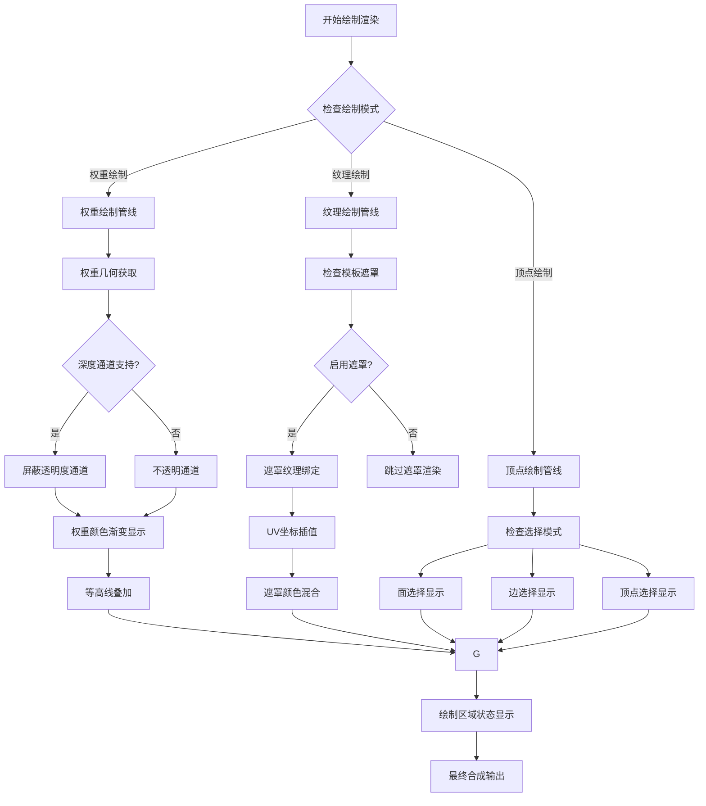

# Blender Overlay绘制工具系统详解

- [Blender Overlay绘制工具系统详解](#blender-overlay绘制工具系统详解)
  - [系统概述](#系统概述)
    - [核心功能模块](#核心功能模块)
    - [文件结构](#文件结构)
  - [绘制工具架构](#绘制工具架构)
    - [类结构设计](#类结构设计)
    - [渲染通道管理](#渲染通道管理)
  - [权重绘制系统](#权重绘制系统)
    - [权重顶点着色器](#权重顶点着色器)
    - [权重片段着色器核心算法](#权重片段着色器核心算法)
    - [多级等高线网格系统](#多级等高线网格系统)
    - [权重颜色映射](#权重颜色映射)
  - [纹理绘制系统](#纹理绘制系统)
    - [纹理绘制顶点着色器](#纹理绘制顶点着色器)
    - [纹理绘制片段着色器](#纹理绘制片段着色器)
    - [纹理绘制配置信息](#纹理绘制配置信息)
  - [顶点绘制系统](#顶点绘制系统)
    - [顶点选择点着色器](#顶点选择点着色器)
  - [绘制模式网格显示](#绘制模式网格显示)
    - [面选择显示](#面选择显示)
    - [线框选择显示](#线框选择显示)
  - [笔刷渲染与状态反馈](#笔刷渲染与状态反馈)
    - [绘制区域状态管理](#绘制区域状态管理)
    - [深度缓冲策略](#深度缓冲策略)
  - [颜色管理与优化](#颜色管理与优化)
    - [颜色因子应用](#颜色因子应用)
    - [主题颜色集成](#主题颜色集成)
  - [渲染管线流程图](#渲染管线流程图)
  - [性能优化技术](#性能优化技术)
    - [1. 条件渲染优化](#1-条件渲染优化)
    - [2. 批次渲染优化](#2-批次渲染优化)
    - [3. 着色器 specialization](#3-着色器-specialization)
    - [4. 内存布局优化](#4-内存布局优化)
    - [5. 早期深度测试](#5-早期深度测试)
    - [6. 纹理缓存优化](#6-纹理缓存优化)


## 系统概述

Blender Overlay绘制工具系统是一个专门用于实时显示和反馈各种绘制模式操作状态的渲染子系统。该系统负责在权重绘制、纹理绘制和顶点绘制等模式下提供直观的视觉反馈，帮助用户精确控制绘制操作。

### 核心功能模块

1. **权重绘制显示**: 实时显示顶点权重分布和等高线
2. **纹理绘制遮罩**: 提供模板遮罩的实时预览
3. **选择状态可视化**: 显示面、边、顶点的选择状态
4. **绘制区域指示**: 标识可绘制和不可绘制的区域

### 文件结构

- **核心着色器文件**: `source/blender/draw/engines/overlay/shaders/overlay_paint_*.glsl`
- **配置信息**: `source/blender/draw/engines/overlay/shaders/infos/overlay_paint_infos.hh`
- **实现类**: `source/blender/draw/engines/overlay/overlay_paint.hh`

## 绘制工具架构

### 类结构设计

绘制工具系统采用模块化设计，主要由`Paints`类统一管理：

```cpp
// 位置: source/blender/draw/engines/overlay/overlay_paint.hh:28-264
class Paints : Overlay {
private:
  PassSimple paint_region_ps_ = {"paint_region_ps_"};      // 绘制区域状态
  PassSimple weight_ps_ = {"weight_ps_"};                 // 权重显示通道
  PassSimple paint_mask_ps_ = {"paint_mask_ps_"};          // 纹理遮罩通道
  
  // 子通道用于不同的绘制元素
  PassSimple::Sub *paint_region_edge_ps_ = nullptr;       // 边选择显示
  PassSimple::Sub *paint_region_face_ps_ = nullptr;       // 面选择显示  
  PassSimple::Sub *paint_region_vert_ps_ = nullptr;       // 顶点选择显示
};
```

### 渲染通道管理

系统使用多个渲染通道来分离不同类型的视觉元素：

```cpp
// 位置: source/blender/draw/engines/overlay/overlay_paint.hh:99-132
if (state.ctx_mode == CTX_MODE_PAINT_WEIGHT) {
  const bool shadeless = shading_type == OB_WIRE;
  const bool draw_contours = state.overlay.wpaint_flag & V3D_OVERLAY_WPAINT_CONTOURS;
  
  auto &pass = weight_ps_;
  pass.bind_ubo(OVERLAY_GLOBALS_SLOT, &res.globals_buf);
  pass.bind_ubo(DRW_CLIPPING_UBO_SLOT, &res.clip_planes_buf);
  
  // 权重显示子通道配置
  auto weight_subpass = [&](const char *name, DRWState drw_state) {
    auto &sub = pass.sub(name);
    sub.state_set(drw_state, state.clipping_plane_count);
    sub.shader_set(shadeless ? res.shaders->paint_weight.get() : 
                               res.shaders->paint_weight_fake_shading.get());
    sub.bind_texture("colorramp", &res.weight_ramp_tx);
    sub.push_constant("draw_contours", draw_contours);
    sub.push_constant("opacity", state.overlay.weight_paint_mode_opacity);
    return &sub;
  };
}
```

## 权重绘制系统

权重绘制是Overlay系统中最复杂的模块，提供了丰富的视觉反馈功能。

### 权重顶点着色器

```glsl
// 位置: source/blender/draw/engines/overlay/shaders/overlay_paint_weight_vert.glsl:13-32
void main()
{
  float3 world_pos = drw_point_object_to_world(pos);
  gl_Position = drw_point_world_to_homogenous(world_pos);

  /* 分离实际权重和警报以进行独立插值 */
  weight_interp = max(float2(weight, -weight), 0.0f);

  /* 饱和权重以给出几何体在权重后面的提示 */
#ifdef FAKE_SHADING
  float3 view_normal = normalize(drw_normal_object_to_view(nor));
  color_fac = abs(dot(view_normal, light_dir));
  color_fac = color_fac * 0.9f + 0.1f;
#else
  color_fac = 1.0f;
#endif

  view_clipping_distances(world_pos);
}
```

### 权重片段着色器核心算法

权重片段着色器实现了复杂的权重可视化和等高线显示：

```glsl
// 位置: source/blender/draw/engines/overlay/shaders/overlay_paint_weight_frag.glsl:9-44
float contours(float value, float steps, float width_px, float max_rel_width, float gradient)
{
  /* 屏幕空间中淡出的最小可见和最小全强度线宽 */
  constexpr float min_width_px = 1.3f, fade_width_px = 2.3f;
  /* 线条在权重梯度增加方向上变细的因子 */
  constexpr float hi_bias = 2.0f;

  /* 不要在0或1处绘制线条 */
  float rel_value = value * steps;

  if (rel_value < 0.5f || rel_value > steps - 0.5f) {
    return 0.0f;
  }

  /* 检查是否因淡出而完全不可见 */
  float rel_gradient = gradient * steps;
  float rel_min_width = min_width_px * rel_gradient;

  if (max_rel_width <= rel_min_width) {
    return 0.0f;
  }

  /* 线条的主要形状，考虑宽度偏差和最大权重空间宽度 */
  float rel_width = width_px * rel_gradient;
  float offset = fract(rel_value + 0.5f) - 0.5f;
  float base_alpha = 1.0f - max(offset * hi_bias, -offset) / min(max_rel_width, rel_width);

  /* 屏幕空间中线条太细时的淡出 */
  float rel_fade_width = fade_width_px * rel_gradient;
  float fade_alpha = (max_rel_width - rel_min_width) / (rel_fade_width - rel_min_width);

  return clamp(base_alpha, 0.0f, 1.0f) * clamp(fade_alpha, 0.0f, 1.0f);
}
```

### 多级等高线网格系统

```glsl
// 位置: source/blender/draw/engines/overlay/shaders/overlay_paint_weight_frag.glsl:46-66
float4 contour_grid(float weight, float weight_gradient)
{
  /* 当梯度太低时淡出以避免大填充和噪声 */
  float flt_eps = max(1e-8f, 1e-6f * weight);

  if (weight_gradient <= flt_eps) {
    return float4(0.0f);
  }

  /* 三个级别的网格线 */
  float grid10 = contours(weight, 10.0f, 5.0f, 0.3f, weight_gradient);
  float grid100 = contours(weight, 100.0f, 3.5f, 0.35f, weight_gradient) * 0.6f;
  float grid1000 = contours(weight, 1000.0f, 2.5f, 0.4f, weight_gradient) * 0.25f;

  /* 0.1和0.01为白线，0.001为黑线 */
  float4 grid = float4(1.0f) * max(grid10, grid100);
  grid.a = max(grid.a, grid1000);

  return grid * clamp((weight_gradient - flt_eps) / flt_eps, 0.0f, 1.0f);
}
```

### 权重颜色映射

```glsl
// 位置: source/blender/draw/engines/overlay/shaders/overlay_paint_weight_frag.glsl:75-107
void main()
{
  float alert = weight_interp.y;
  float4 color;

  /* 缺失顶点组警报颜色，实际上是统一的 */
  if (alert > 1.1f) {
    color = apply_color_fac(theme.colors.vert_missing_data);
  }
  /* 权重可用 */
  else {
    float weight = weight_interp.x;
    float4 weight_color = texture(colorramp, weight);
    weight_color = apply_color_fac(weight_color);

    /* 等高线显示 */
    if (draw_contours) {
      /* 这必须对所有片段统一执行 */
      float weight_gradient = length(float2(gpu_dfdx(weight), gpu_dfdy(weight)));
      float4 grid = contour_grid(weight, weight_gradient);
      weight_color = grid + weight_color * (1 - grid.a);
    }

    /* 零权重警报颜色，非线性混合以减少影响 */
    float4 color_unreferenced = apply_color_fac(theme.colors.vert_unreferenced);
    color = mix(weight_color, color_unreferenced, alert * alert);
  }

  frag_color = float4(color.rgb, opacity);
  line_output = float4(0.0f);
}
```

## 纹理绘制系统

纹理绘制系统主要负责模板遮罩的实时预览显示。

### 纹理绘制顶点着色器

```glsl
// 位置: source/blender/draw/engines/overlay/shaders/overlay_paint_texture_vert.glsl:13-21
void main()
{
  float3 world_pos = drw_point_object_to_world(pos);
  gl_Position = drw_point_world_to_homogenous(world_pos);

  uv_interp = mu;  // 传递遮罩UV坐标

  view_clipping_distances(world_pos);
}
```

### 纹理绘制片段着色器

```glsl
// 位置: source/blender/draw/engines/overlay/shaders/overlay_paint_texture_frag.glsl:11-23
void main()
{
  float4 mask = float4(texture_read_as_srgb(mask_image, mask_image_premultiplied, uv_interp).rgb,
                       1.0f);
  if (mask_invert_stencil) {
    mask.rgb = 1.0f - mask.rgb;
  }
  float mask_step = smoothstep(0.0f, 3.0f, mask.r + mask.g + mask.b);
  mask.rgb *= mask_color;
  mask.a = mask_step * opacity;

  frag_color = mask;
}
```

### 纹理绘制配置信息

```cpp
// 位置: source/blender/draw/engines/overlay/shaders/infos/overlay_paint_infos.hh:75-93
GPU_SHADER_CREATE_INFO(overlay_paint_texture)
DO_STATIC_COMPILATION()
VERTEX_IN(0, float3, pos)
VERTEX_IN(1, float2, mu) /* Masking uv map. */
VERTEX_OUT(overlay_paint_texture_iface)
SAMPLER(0, sampler2D, mask_image)
PUSH_CONSTANT(float3, mask_color)
PUSH_CONSTANT(float, opacity) /* `1.0f` by default. */
PUSH_CONSTANT(bool, mask_invert_stencil)
PUSH_CONSTANT(bool, mask_image_premultiplied)
FRAGMENT_OUT(0, float4, frag_color)
VERTEX_SOURCE("overlay_paint_texture_vert.glsl")
FRAGMENT_SOURCE("overlay_paint_texture_frag.glsl")
ADDITIONAL_INFO(draw_view)
ADDITIONAL_INFO(draw_modelmat)
ADDITIONAL_INFO(draw_globals)
GPU_SHADER_CREATE_END()
```

## 顶点绘制系统

顶点绘制系统主要负责选择状态的可视化显示。

### 顶点选择点着色器

```glsl
// 位置: source/blender/draw/engines/overlay/shaders/overlay_paint_point_vert.glsl:13-34
void main()
{
  bool is_select = (paint_overlay_flag > 0);
  bool is_hidden = (paint_overlay_flag < 0);

  float3 world_pos = drw_point_object_to_world(pos);
  gl_Position = drw_point_world_to_homogenous(world_pos);
  /* 在Z中添加偏移以避免Z-fighting并在顶部渲染选定的线 */
  /* TODO: 使用Z-near和Z-far范围缩放此偏差 */
  gl_Position.z -= (is_select ? 2e-4f : 1e-4f);

  if (is_hidden) {
    gl_Position = float4(-2.0f, -2.0f, -2.0f, 1.0f);
  }

  final_color = (is_select) ? float4(1.0f) : theme.colors.wire;
  final_color.a = float(paint_overlay_flag);

  gl_PointSize = theme.sizes.vert * 2.0f;

  view_clipping_distances(world_pos);
}
```

## 绘制模式网格显示

### 面选择显示

```glsl
// 位置: source/blender/draw/engines/overlay/shaders/overlay_paint_face_vert.glsl:13-33
void main()
{
  float3 world_pos = drw_point_object_to_world(pos);
  gl_Position = drw_point_world_to_homogenous(world_pos);

#ifdef GPU_METAL
  /* 小偏移始终在几何体之上 */
  gl_Position.z -= 5e-5f;
#endif

  bool is_select = (paint_overlay_flag > 0);
  bool is_hidden = (paint_overlay_flag < 0);

  /* 不绘制选定的面 */
  if (is_hidden || is_select) {
    gl_Position = float4(-2.0f, -2.0f, -2.0f, 1.0f);
  }
  else {
    view_clipping_distances(world_pos);
  }
}
```

### 线框选择显示

```glsl
// 位置: source/blender/draw/engines/overlay/shaders/overlay_paint_wire_vert.glsl:13-38
void main()
{
  bool is_select = (paint_overlay_flag > 0) && use_select;
  bool is_hidden = (paint_overlay_flag < 0) && use_select;

  float3 world_pos = drw_point_object_to_world(pos);
  gl_Position = drw_point_world_to_homogenous(world_pos);
  /* 在Z中添加偏移以避免Z-fighting并在顶部渲染选定的线 */
  /* TODO: 使用Z-near和Z-far范围缩放此偏差 */
  gl_Position.z -= (is_select ? 2e-4f : 1e-4f);

  if (is_hidden) {
    gl_Position = float4(-2.0f, -2.0f, -2.0f, 1.0f);
  }

  constexpr float4 colSel = float4(1.0f);
  final_color = (is_select) ? colSel : theme.colors.wire;

  /* 权重绘制需要浅色以与深色权重形成对比 */
  if (!use_select) {
    final_color = float4(1.0f, 1.0f, 1.0f, 0.3f);
  }

  view_clipping_distances(world_pos);
}
```

## 笔刷渲染与状态反馈

### 绘制区域状态管理

系统通过`paint_overlay_flag`统一管理绘制区域的状态：

```cpp
// 位置: source/blender/draw/engines/overlay/overlay_paint.hh:224-248
/* 选择状态显示 */
{
  /* 注意(fclem): 为什么我们需要原始网格，只是为了获取标志？ */
  const Mesh &mesh_orig = DRW_object_get_data_for_drawing<Mesh>(
      *DEG_get_original(ob_ref.object));
  const bool use_face_selection = (mesh_orig.editflag & ME_EDIT_PAINT_FACE_SEL);
  const bool use_vert_selection = (mesh_orig.editflag & ME_EDIT_PAINT_VERT_SEL);
  /* 纹理绘制模式只绘制面选择，没有线或顶点，因为我们不直接在几何数据上绘制 */
  const bool in_texture_paint_mode = state.ctx_mode == CTX_MODE_PAINT_TEXTURE;

  if ((use_face_selection || show_wires_) && !in_texture_paint_mode) {
    gpu::Batch *geom = DRW_cache_mesh_paint_overlay_edges_get(ob_ref.object);
    paint_region_edge_ps_->push_constant("use_select", use_face_selection);
    paint_region_edge_ps_->draw(geom, manager.unique_handle(ob_ref));
  }
  if (use_face_selection) {
    gpu::Batch *geom = DRW_cache_mesh_paint_overlay_surface_get(ob_ref.object);
    paint_region_face_ps_->draw(geom, manager.unique_handle(ob_ref));
  }
  if (use_vert_selection && !in_texture_paint_mode) {
    gpu::Batch *geom = DRW_cache_mesh_paint_overlay_verts_get(ob_ref.object);
    paint_region_vert_ps_->draw(geom, manager.unique_handle(ob_ref));
  }
}
```

### 深度缓冲策略

系统使用不同的深度测试策略来正确分层显示不同的视觉元素：

```cpp
// 位置: source/blender/draw/engines/overlay/overlay_paint.hh:127-131
weight_opaque_ps_ = weight_subpass(
    "Opaque", DRW_STATE_WRITE_COLOR | DRW_STATE_DEPTH_LESS_EQUAL | DRW_STATE_WRITE_DEPTH);
weight_masked_transparency_ps_ = weight_subpass(
    "Masked Transparency",
    DRW_STATE_WRITE_COLOR | DRW_STATE_DEPTH_EQUAL | DRW_STATE_BLEND_ALPHA);
```

## 颜色管理与优化

### 颜色因子应用

```glsl
// 位置: source/blender/draw/engines/overlay/shaders/overlay_paint_weight_frag.glsl:68-73
float4 apply_color_fac(float4 color_in)
{
  float4 color = color_in;
  color.rgb = max(float3(0.005f), color_in.rgb) * color_fac;
  return color;
}
```

### 主题颜色集成

系统与Blender的主题系统深度集成，通过`theme`统一访问颜色配置：

```glsl
// 位置: source/blender/draw/engines/overlay/shaders/overlay_paint_weight_frag.glsl:82-102
if (alert > 1.1f) {
  color = apply_color_fac(theme.colors.vert_missing_data);
}
else {
  // ...
  float4 color_unreferenced = apply_color_fac(theme.colors.vert_unreferenced);
  color = mix(weight_color, color_unreferenced, alert * alert);
}
```

## 渲染管线流程图



## 性能优化技术

### 1. 条件渲染优化

系统通过智能的条件判断避免不必要的渲染操作：

```cpp
// 位置: source/blender/draw/engines/overlay/overlay_paint.hh:51-64
void begin_sync(Resources &res, const State &state) final
{
  enabled_ =
      state.is_space_v3d() && !res.is_selection() &&
      ELEM(state.ctx_mode, CTX_MODE_PAINT_WEIGHT, CTX_MODE_PAINT_VERTEX, CTX_MODE_PAINT_TEXTURE);

  /* 无论如何初始化以释放数据 */
  paint_region_ps_.init();
  weight_ps_.init();
  paint_mask_ps_.init();

  if (!enabled_) {
    return;
  }
  // ...
}
```

### 2. 批次渲染优化

使用GPU批处理减少绘制调用：

```cpp
// 位置: source/blender/draw/engines/overlay/overlay_paint.hh:199-206
case CTX_MODE_PAINT_WEIGHT: {
  gpu::Batch *geom = DRW_cache_mesh_surface_weights_get(ob_ref.object);
  if (masked_transparency_support_ && ob_ref.object->dt >= OB_SOLID) {
    weight_masked_transparency_ps_->draw(geom, manager.unique_handle(ob_ref));
  }
  else {
    weight_opaque_ps_->draw(geom, manager.unique_handle(ob_ref));
  }
  break;
}
```

### 3. 着色器 specialization

通过着色器特化减少分支：

```cpp
// 位置: source/blender/draw/engines/overlay/shaders/infos/overlay_paint_infos.hh:129-139
GPU_SHADER_CREATE_INFO(overlay_paint_weight_fake_shading)
DO_STATIC_COMPILATION()
ADDITIONAL_INFO(overlay_paint_weight)
DEFINE("FAKE_SHADING")
PUSH_CONSTANT(float3, light_dir)
GPU_SHADER_CREATE_END()
```

### 4. 内存布局优化

使用紧凑的数据结构减少内存带宽：

```glsl
// 位置: source/blender/draw/engines/overlay/shaders/overlay_paint_weight_vert.glsl:19
weight_interp = max(float2(weight, -weight), 0.0f);
```

### 5. 早期深度测试

利用深度测试减少片段着色器执行：

```cpp
// 位置: source/blender/draw/engines/overlay/overlay_paint.hh:127-131
weight_opaque_ps_ = weight_subpass(
    "Opaque", DRW_STATE_WRITE_COLOR | DRW_STATE_DEPTH_LESS_EQUAL | DRW_STATE_WRITE_DEPTH);
```

### 6. 纹理缓存优化

权重渐变纹理使用1D纹理减少采样开销：

```cpp
// 位置: source/blender/draw/engines/overlay/overlay_paint.hh:118
sub.bind_texture("colorramp", &res.weight_ramp_tx);
```

这些优化技术确保了绘制工具系统在各种复杂场景下都能保持流畅的实时性能，为用户提供优秀的绘制体验。