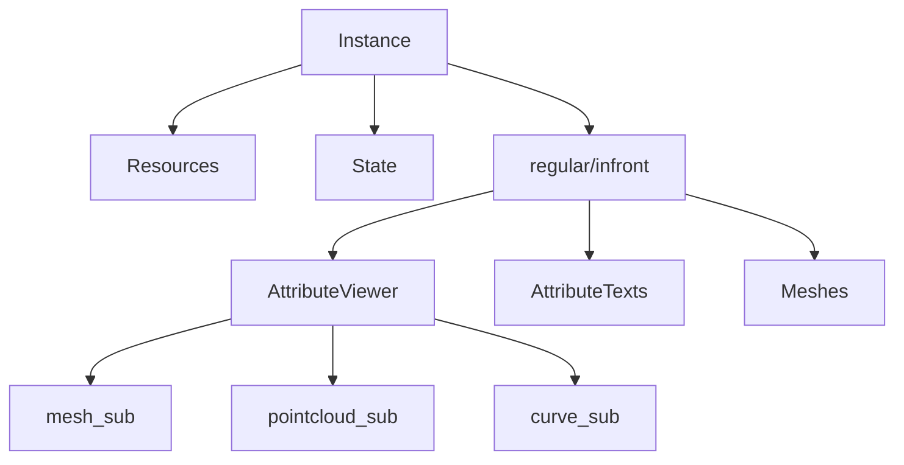
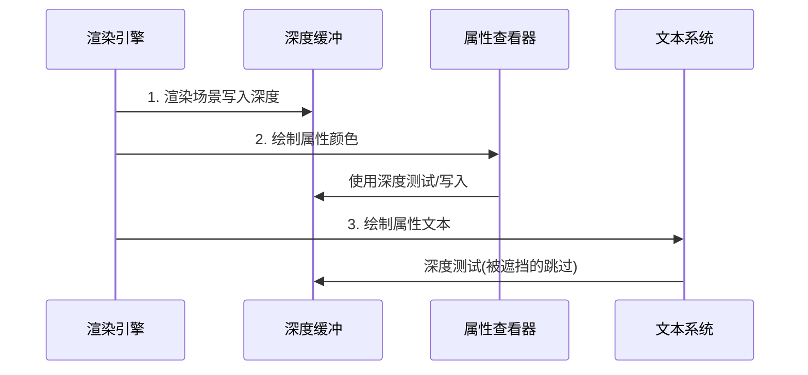

# Overlay引擎详细文档撰写清单

## 📋 任务总览

根据代码分析，我建议创建 **19个文档**，分为 **6个阶段**。

---

## 阶段一：基础核心概念 (3个文档)

### 文档1: 1.Blender渲染系统基础.md
**Agent**: general-purpose
**研究重点**:
- Blender绘制管线整体架构
- GPU渲染流程：顶点→图元→光栅化→片段
- Overlay引擎在Blender中的位置和作用
- OpenGL/Vulkan基础概念

**关键代码位置**:
```
source/blender/draw/intern/draw_manager.cc
source/blender/draw/intern/draw_context_*.cc
source/blender/draw/engines/overlay/overlay_engine.cc
```

**学习产出**:
- blender渲染流程图（mermaid）
- overlay引擎与其他引擎的对比
- GPU vs CPU渲染概念解释

---

### 文档2: 2.矩阵与变换基础.md
**Agent**: general-purpose
**研究重点**:
- Model-View-Projection变换矩阵
- 坐标系转换：对象空间→世界空间→相机空间→裁剪空间
- Blender矩阵运算函数

**关键代码位置**:
```
source/blender/draw/intern/draw_view.cc
source/blender/draw/intern/draw_view.hh
source/blender/BKE_blender.hh (矩阵相关)
```

**数学基础**:
- $P_{clip} = M_{proj} \cdot M_{view} \cdot M_{model} \cdot P_{local}$
- 齐次坐标
- 视锥体裁剪

---

### 文档3: 3.Overlay核心概念速查.md
**Agent**: Explore (快速扫描)
**研究重点**:
- 术语表：PASS, BATCH, SHADER, RESOURCE, HANDLE
- Overlay引擎支持的所有功能分类
- 用户触发属性查看器的流程

**关键代码**:
```cpp
// overlay_private.hh - 基础定义
overlay_attribute_viewer.hh - 属性查看器入口
overlay_instance.hh - 引擎实例管理
```

**输出内容**:
- 功能模块思维导图
- 重要术语解释卡片

---

## 阶段二：架构全景 (2个文档)

### 文档4: 4.Overlay引擎初始化流程详解.md
**Agent**: general-purpose
**研究重点**:
- 从`overlay_engine.cc`开始的调用链
- `Instance::init()`做了什么
- ShaderModule如何初始化

**关键流程**:
```
Overlay Engine启动
    → create_instance()
    → Instance::init()
        → ShaderModule::module_get()
        → Resources::init()
        → 加载所有shader
```

**关键代码分析**:
```cpp
// overlay_engine.cc:17-20
DrawEngine *Engine::create_instance()
{
  return new Instance();
}

// overlay_instance.cc:126-131 (待读)
void Instance::init() final;
```

**重点关注**:
- `Resources::init()`中的shader预编译
- `ShapeCache`的几何体生成
- Selection mode的处理

---

### 文档5: 5.Overlay组件管理架构.md
**Agent**: general-purpose
**研究重点**:
- Overlay组件系统架构
- regular vs infront layer区别
- 各个overlay组件的功能和协作

**关键结构** (来自overlay_instance.hh):
```cpp
struct OverlayLayer {
    Armatures armatures;
    AttributeViewer attribute_viewer;    // ⭐ 目标2,3
    AttributeTexts attribute_texts;      // ⭐ 目标1
    Axes axes;
    Bounds bounds;
    // ... 20+ 组件
} regular, infront;
```

**组件关系图** (mermaid):


---

## 阶段三：核心功能深入 (4个文档)

### 文档6: 6.overlay_private.hh - 资源与状态系统.md
**Agent**: general-purpose
**研究重点**:
- `Resources`类详解（所有GPU资源管理）
- `State`类详解（场景状态）
- `ShapeCache`（预定义几何体）

**关键代码**:
```cpp
// overlay_private.hh:588-978
struct Resources : public select::SelectMap {
    ShaderModule *shaders;
    Framebuffers...
    TextureFromPool...
    Texture...
    UniformBuffer...
    // 详细分析每个成员
};

// overlay_private.hh:125-283
struct State {
    Depsgraph *depsgraph;
    View3D *v3d;
    View3DOverlay overlay;
    // 所有show_...()方法
};
```

**关键点**:
- `State::show_attribute_viewer()`如何工作
- Framebuffer管理：overlay_fb, overlay_line_fb等
- 深度缓冲和X-ray模式

---

### 文档7: 7.overlay_attribute_viewer.hh 详解 - 原理篇
**Agent**: general-purpose
**研究重点**: ⭐ **最重要的文档，目标2和3的关键**

**代码结构分析**:
```cpp
class AttributeViewer : Overlay {
 private:
  PassMain ps_;  // 主渲染Pass
  PassMain::Sub *mesh_sub_;
  PassMain::Sub *pointcloud_sub_;
  PassMain::Sub *curve_sub_;
  PassMain::Sub *curves_sub_;
  PassMain::Sub *instance_sub_;

 public:
  void begin_sync(...);    // 初始化
  void object_sync(...);   // 对象同步
  void pre_draw(...);      // 绘制前
  void draw_line(...);     // 绘制
  void object_sync(...);   // 核心同步逻辑
  void populate_for_geometry(...);  // 目标2核心
  void populate_for_instance(...);  // 实例处理

  // 目标3扩展可能需要
  // draw_vector_lines(...)
};
```

**学习重点**:

1. **begin_sync()流程**:
```cpp
// overlay_attribute_viewer.hh:37-60
ps_.init();
enabled_ = state.is_space_v3d() && !res.is_selection() && state.show_attribute_viewer();
// 绑定UBO、设置状态、创建sub
```

2. **object_sync()决策树**:
```cpp
if (ob_ref.preview_instance_index() >= 0) {
    populate_for_instance();  // 实例预览
} else {
    populate_for_geometry();  // 几何预览
}
```

3. **populate_for_geometry() - 目标2**
```cpp
case OB_MESH:
    gpu::Batch *batch = DRW_cache_mesh_surface_viewer_attribute_get(&object);
    // 问题：只支持面域，需要扩展点/边支持

case OB_POINTCLOUD: // 支持点
case OB_CURVES:     // 支持曲线
```

4. **当前限制分析** (针对您的目标2):
- ✅ Mesh: 只支持面域(表面)
- ❌ Mesh: 不支持点/边
- ✅ PointCloud: 支持点
- ✅ Curve: 支持曲线
- 需要添加：Mesh点/边模式预览

---

### 文档8: 8.overlay_attribute_viewer.hh - Shader与渲染管线篇
**Agent**: 分析shader文件
**研究重点**: 目标3的实现基础

**Shader文件**:
```
source/blender/draw/engines/overlay/shaders/overlay_viewer_attribute_*.glsl
- mesh.vert/.frag
- pointcloud.vert/.frag
- curve.vert/.frag
- curves.vert/.frag
```

**Shader文件分析**:
```cpp
// overlay_private.hh:452-456
StaticShader attribute_viewer_mesh = shader_clippable("overlay_viewer_attribute_mesh");
StaticShader attribute_viewer_pointcloud = shader_clippable("overlay_viewer_attribute_pointcloud");
StaticShader attribute_viewer_curve = shader_clippable("overlay_viewer_attribute_curve");
StaticShader attribute_viewer_curves = shader_clippable("overlay_viewer_attribute_curves");
```

**目标3 - 矢量绘制的Shader修改**:
- 当前的mesh shader输入：顶点位置 + 属性颜色
- 目标：添加矢量(方向)输入 → 生成线段
- 类似：`overlay_edit_mesh_normal_vert.glsl`

---

### 文档9: 9.overlay_text.hh 和 overlay_attribute_text.md
**Agent**: general-purpose
**研究重点**: 目标1的文本渲染

**关键文件**:
```cpp
overlay_text.hh           // 普通文字overlay
overlay_attribute_text.hh // 属性值文本显示
draw_manager_text.hh      // 文本缓存系统
draw_manager_text.cc      // 文本渲染实现
```

**目标1 - 文本遮挡问题**:
```cpp
// overlay_attribute_text.hh - 需要分析
class AttributeTexts : Overlay {
    PassSimple ps_;
    void object_sync(...);
    void draw_line(...);
    // 需要添加深度测试逻辑
};
```

**文本渲染流程** (待研究):
```
1. DRW_text_cache_add() - 添加文字到缓存
2. DRW_text_cache_draw() - 绘制文字
3. 需要分析：深度测试如何配置？
   - DRW_STATE_DEPTH_LESS_EQUAL?
   - 与overlay_fb的关系？
```

---

## 阶段四：绘制系统核心 (4个文档)

### 文档10: 10.draw_manager.hh - 全局管理器
**Agent**: general-purpose
**研究重点**:
- DrawManager的核心职责
- 如何组织和提交绘制命令

**关键定义**:
```cpp
// draw_manager.hh - 核心类
class Manager {
    // PASS管理
    void generate_commands(Pass &pass, View &view);
    void submit_only(Pass &pass, View &view);

    // 资源句柄
    ResourceHandleRange unique_handle(const ObjectRef &ob_ref);

    // 矩阵缓冲
    UniformBuffer<UniformData> matrix_buf;
};
```

**理解绘制命令流**:
```
Manager::generate_commands(pass, view)
    → Pass::generate_commands(view)
        → 每个Sub Pass
            → 收集所有draw call
            → 绑定shader/纹理/缓冲
```

---

### 文档11: 11.draw_pass.hh - Pass系统详解
**Agent**: general-purpose
**研究重点**:
- PassMain vs PassSimple
- Sub Pass的组织方式
- push_constant, bind_texture, draw

```cpp
// draw_pass.hh
class PassMain {
    struct Sub {
        void shader_set(Shader *shader);
        void push_constant(...);
        void bind_texture(...);
        void draw(...);
        void draw_expand(...);  // 几何着色器扩展
    };

    Sub& sub(const char *name);
};
```

**覆盖引擎中的Usage**:
```cpp
// overlay_attribute_viewer.hh
PassMain ps_ = {"attribute_viewer_ps_"};
ps_.bind_ubo(OVERLAY_GLOBALS_SLOT, &res.globals_buf);
ps_.state_set(DRW_STATE_WRITE_COLOR | DRW_STATE_DEPTH_LESS_EQUAL | DRW_STATE_BLEND_ALPHA);

mesh_sub_ = ps_.sub("mesh");
mesh_sub_.shader_set(res.shaders->attribute_viewer_mesh.get());
mesh_sub_.draw(batch, handle);
```

---

### 文档12: 12.draw_command.hh - 命令与资源绑定
**Agent**: general-purpose
**研究重点**:
- GPU资源绑定机制
- UBO/SSBO/Texture的管理
- 命令缓冲区

**关键概念**:
```cpp
// draw_command.hh - 数据结构
struct DrawCommand {
    uint index_count;
    uint instance_count;
    uint base_index;
    // ...
};

// 资源绑定
void bind_ubo(int slot, const void *data);
void bind_ssbo(int slot, gpu::VertBuf *buf);
void bind_texture(int slot, gpu::Texture *tex);
```

**目标3应用场景**:
```
矢量绘制的资源绑定：
1. 顶点缓冲：位置 + 矢量方向
2. 着色器：读取矢量，计算线段端点
3. 绘制：LINES 或 LINE_STRIP
```

---

### 文档13: 13.draw_view.hh - 视图与相机
**Agent**: general-purpose
**研究重点**:
- View矩阵管理
- 视锥体和投影
- 摄像机参数

```cpp
// draw_view.hh
class View {
    float4x4 view_mat();
    float4x4 proj_mat();
    float4x4 win_mat();  // 窗口变换

    float3 forward();    // 视角方向
    Bounds<float3> frustum_bounds();
};
```

**在overlay中的用途**:
```
attribute_viewer.cc: object_sync()需要view信息
- 决定是否在视野内
- 计算合适的文本位置
- 判断遮挡关系
```

---

## 阶段五：GPU底层技术 (4个文档)

### 文档14: 14.draw_manager_text.cc - 文本渲染与遮挡
**Agent**: general-purpose
**研究重点**: ⭐ **目标1的关键代码**

**核心函数**:
```cpp
// draw_manager_text.cc
void DRW_text_cache_add(...);  // 添加文本

void DRW_text_cache_draw(      // 绘制文本
    const DRWTextStore *dt,
    const ARegion *region,
    const View3D *v3d,
    blender::gpu::Texture *depth_tx,  // ⭐ 深度纹理
    const uchar alpha
);
```

**深入分析**:
```cpp
// 需要研究DRW_text_cache_draw内部：
void DRW_text_cache_draw(...) {
    // 1. 设置绘制状态
    // 2. 对于每个文本：
    //    - 投影到屏幕坐标
    //    - 深度测试
    //    - 检查是否被遮挡
    //    - 绘制
}
```

**目标1 - 解决方案思路**:
```cpp
// 可能的修改点
void AttributeTexts::draw_line(...) {
    // 当前：只管绘制，不管遮挡
    // 目标：添加深度测试
    GPU_framebuffer_bind(overlay_fb);
    // 需要确保：
    // 1. 先绘制场景几何体到深度缓冲
    // 2. 在绘制文本时，使用depth_tx进行遮挡测试
}
```

---

### 文档15: 15.DRW_gpu_wrapper.hh - GPU封装层
**Agent**: general-purpose
**研究重点**: Texture和Framebuffer

```cpp
// DRW_gpu_wrapper.hh
class Texture {
    void bind(int slot);
    void acquire(int2 size, GPUTextureFormat format);
};

class Framebuffer {
    void bind();
    void ensure(GPUAttachment depth, GPUAttachment color...);
};
```

**关键分析**:
```
overlay_fb的生命周期：
1. Resources::acquire() 创建
2. Resources::begin_sync() 绑定
3. 各个overlay组件bind()使用
4. 解绑和释放
```

---

### 文档16: 16.着色器管理与编译系统
**Agent**: 分析shader info文件
**研究重点**: shader创建和参数传递

```
source/blender/draw/engines/overlay/shaders/infos/
overlay_viewer_attribute_infos.hh
```

```cpp
// 类似这样的结构
GPU_SHADER_CREATE_INFO(overlay_viewer_attribute_mesh)
    .vertex_in(0, Type::FLOAT3, "pos")
    .vertex_in(1, Type::FLOAT4, "color")
    .fragment_out(0, Type::VEC4, "fragColor")
    .uniform_buf(OVERLAY_GLOBALS_SLOT, "OverlayGuestUBO", "globals")
    .sampler(0, GPUampler::FLOAT_2D, "attribute_tx")
    .define("DRW_DEPTH_LESS_EQUAL")
    .build();
```

---

### 文档17: 17.深度测试与遮挡处理详解
**Agent**: 综合分析多个文件
**研究重点**: **目标1的技术核心**

**关键状态位**:
```cpp
// draw_state.hh
enum {
    DRW_STATE_WRITE_COLOR   = (1 << 0),
    DRW_STATE_DEPTH_LESS    = (1 << 4),
    DRW_STATE_DEPTH_LESS_EQUAL = (1 << 5),  // 文本常用
    DRW_STATE_BLEND_ALPHA   = (1 << 8),
};

// overlay_attribute_viewer.hh:46
ps_.state_set(DRW_STATE_WRITE_COLOR | DRW_STATE_DEPTH_LESS_EQUAL | DRW_STATE_BLEND_ALPHA);
```

**深度缓冲工作原理**:
```
渲染流程(当前问题):
1. 背景 → 深度缓冲
2. 物体 → 深度缓冲(遮挡信息)
3. 属性预览覆盖 → 不一定写入正确深度
4. 文本 → 可能被错误绘制在遮挡物前

解决方案流程图:


---

## 阶段六：实战改造指南 (2个文档)

### 文档18: 18.实战 - 您的三个目标改造方案
**Agent**: 基于以上所有分析，直接给出修改建议

**目标1 - 文本遮挡问题**:
```cpp
// 需要修改：overlay_attribute_text.hh 或 draw_manager_text.cc

// 可能方案A：修改状态设置在overlay_attribute_text.hh
void AttributeTexts::begin_sync(...) {
    // 在overlay_fb基础上绑定深度
    ps_.bind_texture(DEPTH_SLOT, res.depth_target_tx);
    // 修改shader进行深度采样测试
}

// 可能方案B：修改DRW_text_cache_draw
// 添加参数：depth_samples（深度采样位置）
// 修改：在投影计算后，采样深度值比较

// 详细实现步骤和代码替换将在文档中提供
```

**目标2 - 点/边属性预览**:
```cpp
// 需要修改：overlay_attribute_viewer.hh + draw_cache.cc

// 添加新的mesh batch获取函数
gpu::Batch *DRW_cache_mesh_points_viewer_attribute_get(....);
gpu::Batch *DRW_cache_mesh_edges_viewer_attribute_get(....);

// 修改populate_for_geometry
case OB_MESH:
    // 现有代码保持
    if (Vertex选点模式) {
        batch = DRW_cache_mesh_points_viewer_attribute_get();
    } else if (Edge边模式) {
        batch = DRW_cache_mesh_edges_viewer_attribute_get();
    } else {
        batch = DRW_cache_mesh_surface_viewer_attribute_get();
    }
```

**目标3 - 矢量可视化**:
```cpp
// 需要修改：overlay_attribute_viewer.hh + 新shader

// 1. 在AttributeViewer中添加新Sub
PassMain::Sub *vector_display_sub_ = ps_.sub("vector_lines");

// 2. 新的绘制函数
void draw_vectors(...) {
    // 读取矢量属性
    // 计算端点：origin, origin + vector*scale
    // 创建lines batch
    vector_display_sub_.draw(lines_batch, handle);
}

// 3. 新shaders
overlay_viewer_vector_line.vert.glsl
overlay_viewer_vector_line.frag.glsl
// 类似 overlay_edit_mesh_normal_vert.glsl
```

---

### 文档19: 19.开发调试与测试指南
**Agent**: 综合调试经验
**内容**:
- 如何debug overlay绘制
- 视查工具和日志
- 常见的开发陷阱
- 测试方法

**调试技巧**:
```
1. 在GPU DEBUG模式下运行
2. 修改shader临时输出颜色调试
3. 使用framebuffer调试视图
4. 添加BLI_assert检查
5. renderdoc捕获分析
```

---

## 🎯 优化后的文档总计

### 19个文档 ✅
| 阶段 | 数量 | 数据 |
|------|------|------|
| 基础概念 | 3个 | 约30-40页 |
| 架构全景 | 2个 | 约20-30页 |
| 核心功能 | 4个 | ⭐ 最高优先级 |
| 绘制系统 | 4个 | 技术核心 |
| GPU底层 | 3个 | 50-60页 |
| 实战指南 | 2个 | 行动手册 |
| **总计** | **19** | **200-250页** |

---

## 📊 文档时间预算

| 阶段 | 单个文档时间 | 总时间 | 可并行 |
|------|-------------|--------|--------|
| 阶段1 | 深度0.5天/篇 | 1.5天 | 🟢 |
| 阶段2 | 估算1天/篇 | 2天 | 🟢 |
| 阶段3 | 深度2-3天/篇 | 8-12天 | 🔴 |
| 阶段4 | 1.5天/篇 | 6天 | 🟢 |
| 阶段5 | 1-2天/篇 | 5天 | 🔴 |
| 阶段6 | 1天/篇 | 2天 | 🟢 |
| **总计** | - | **25-28天** | **19天** |

<mark style="background-color: #FFF3CD;">**但采用子Agent并行，前15个文档可并行**</mark>

---

## 🚀 执行策略建议

### 方案A：深度并行（推荐）
启动多个子Agent同时撰写：
```
# 基础阶段 - 可并行3个
→ Agent 1: 文档1
→ Agent 2: 文档2
→ Agent 3: 文档3

# 重点核心 - 串行，但不停顿
→ Agent 4: 文档7 (目标2,3)
→ Agent 5: 文档9 (目标1)
→ Agent 6: 文档17 (深度遮挡)

# 剩余文档 - 小组并行
```

### 方案B：问题导向优先
先完成目标相关文档，再补充基础：
```
第一批次：
1. 文档7 overlay_attribute_viewer
2. 文档9 overlay_text
3. 文档17 深度测试

第二批次：其他16个文档
```

---

## 📝 子Agent调用参数模板

所有Task调用参数：
```json
{
    "subagent_type": "general-purpose",
    "description": "写文档X: 标题",
    "prompt": "按照模板要求写文档。\n源码路径: E:\\blender-git\\blender\\...\n要求: 详细注释, 行号引用, mermaid图\n关注目标: [具体目标]\nC++水平: 基础\n文档位置: E:\\blender-git\\blender\\.vscode\\overlay通读-MiMo\\"
}
```

---

**下一步**: 如果您确认这个计划，我将开始启动第一批子Agent！
