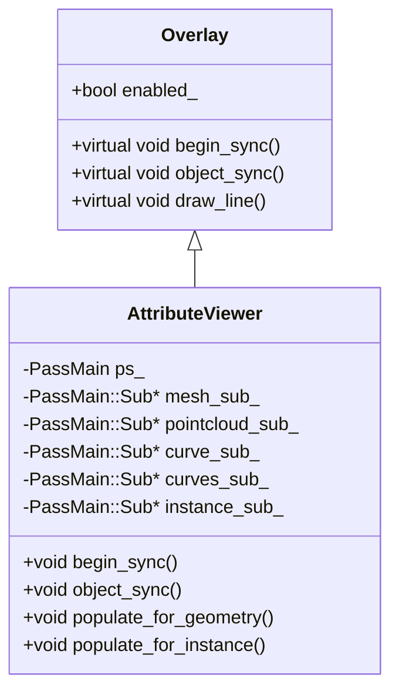
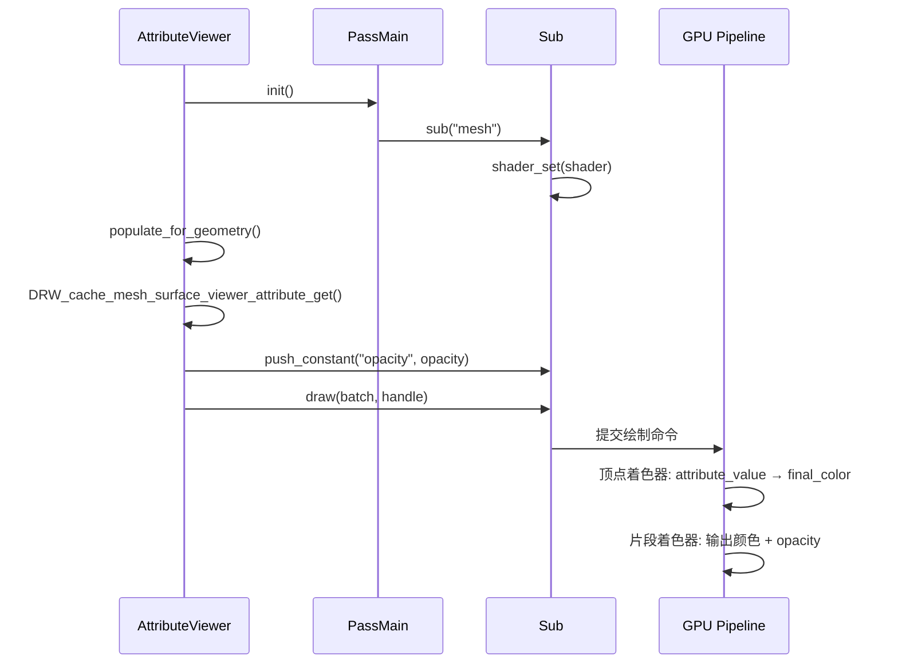
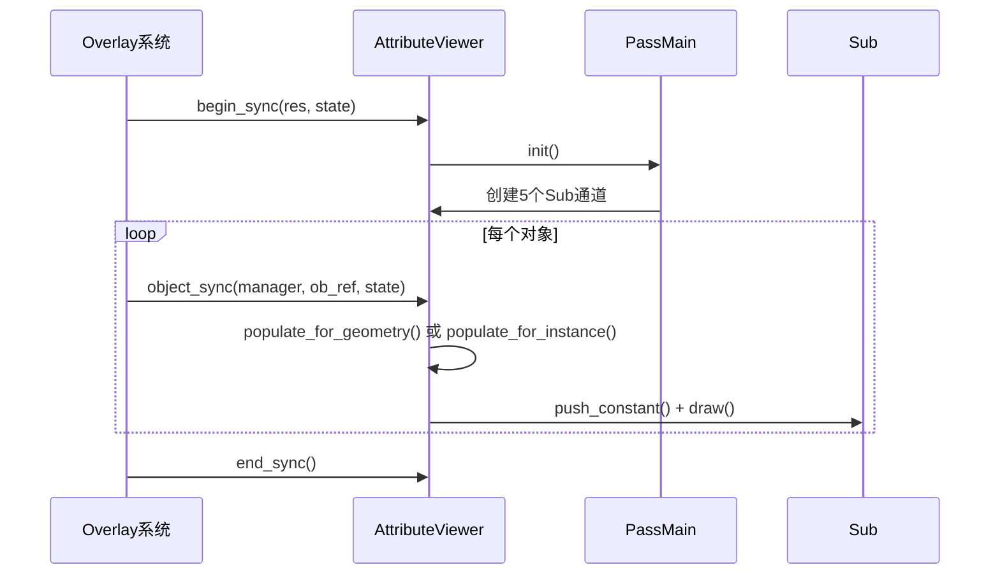

# 10.属性查看器核心分析.md

## 目录
- [1. 类继承结构分析](#1-类继承结构分析)
- [2. begin_sync()初始化流程](#2-beginsync初始化流程)
- [3. object_sync()决策树](#3-objectsync决策树)
- [4. populate_for_geometry()详解](#4-populate_for_geometry详解)
- [5. 当前限制与目标改进](#5-当前限制与目标改进)
- [6. 渲染管线分析](#6-渲染管线分析)
- [7. 代码修改建议](#7-代码修改建议)

---

## 1. 类继承结构分析

### 1.1 AttributeViewer 类定义

**定义位置**: `E:\blender-git\blender\source\blender\draw\engines\overlay\overlay_attribute_viewer.hh:20-60`

```cpp
class AttributeViewer : Overlay {
 private:
  PassMain ps_ = {"attribute_viewer_ps_"};

  PassMain::Sub *mesh_sub_ = nullptr;
  PassMain::Sub *pointcloud_sub_ = nullptr;
  PassMain::Sub *curve_sub_ = nullptr;
  PassMain::Sub *curves_sub_ = nullptr;
  PassMain::Sub *instance_sub_ = nullptr;

 public:
  void begin_sync(Resources &res, const State &state) final;
  void object_sync(Manager &manager, const ObjectRef &ob_ref, Resources &res, const State &state) final;
  void pre_draw(Manager &manager, View &view) final;
  void draw_line(Framebuffer &framebuffer, Manager &manager, View &view) final;
  // ... private methods
};
```

### 1.2 Python类比解释

```python
# Python概念类比（帮助理解C++面向对象概念）
class AttributeViewer(Overlay):  # 继承自Overlay基类
    def __init__(self):
        # PassMain - 类似于绘制批次管理器（Batch Manager）
        # 用来管理所有的绘制命令
        self.ps_ = PassMain("attribute_viewer_ps_")

        # Sub - 子批次，类似子渲染通道
        # 每个Sub绑定特定的着色器和几何类型
        self.mesh_sub_ = None      # 网格子通道
        self.pointcloud_sub_ = None  # 点云子通道
        self.curve_sub_ = None     # 曲线子通道
        self.curves_sub_ = None    # 新曲线系统子通道
        self.instance_sub_ = None  # 实例化子通道

    # begin_sync - 初始化方法，每帧开始时调用
    def begin_sync(self, res, state):
        pass

    # object_sync - 同步单个对象
    def object_sync(self, manager, ob_ref, res, state):
        pass
```

### 1.3 继承关系图



---

## 2. begin_sync()初始化流程

**定义位置**: `E:\blender-git\blender\source\blender\draw\engines\overlay\overlay_attribute_viewer.hh:37-60`

### 2.1 完整代码

```cpp
void begin_sync(Resources &res, const State &state) final
{
  ps_.init();  // 初始化PassMain
  // 检查是否需要启用属性查看器
  enabled_ = state.is_space_v3d() && !res.is_selection() && state.show_attribute_viewer();

  if (!enabled_) {
    return;  // 不在3D视图、或在选择模式、或未启用查看器 → 直接返回
  };

  // 绑定全局UBO（Uniform Buffer Object）
  ps_.bind_ubo(OVERLAY_GLOBALS_SLOT, &res.globals_buf);
  ps_.bind_ubo(DRW_CLIPPING_UBO_SLOT, &res.clip_planes_buf);

  // 设置渲染状态：写入颜色、深度测试、Alpha混合
  ps_.state_set(DRW_STATE_WRITE_COLOR | DRW_STATE_DEPTH_LESS_EQUAL | DRW_STATE_BLEND_ALPHA,
                state.clipping_plane_count);

  // 工厂函数：创建子通道并绑定对应的着色器
  auto create_sub = [&](const char *name, gpu::Shader *shader) {
    auto &sub = ps_.sub(name);  // 创建子通道
    sub.shader_set(shader);      // 绑定着色器
    return ⊂
  };

  // 为每种几何类型创建子通道
  mesh_sub_ = create_sub("mesh", res.shaders->attribute_viewer_mesh.get());
  pointcloud_sub_ = create_sub("pointcloud", res.shaders->attribute_viewer_pointcloud.get());
  curve_sub_ = create_sub("curve", res.shaders->attribute_viewer_curve.get());
  curves_sub_ = create_sub("curves", res.shaders->attribute_viewer_curves.get());
  instance_sub_ = create_sub("instance", res.shaders->uniform_color.get());
}
```

### 2.2 初始化流程图

```mermaid
flowchart TD
    A[begin_sync调用] --> B{ps_.init()}
    B --> C[state.is_space_v3d() && !res.is_selection() && state.show_attribute_viewer()]
    C -->|False| D[enabled_ = False, return]
    C -->|True| E[enabled_ = True]
    E --> F[绑定UBO缓冲区]
    F --> G[设置渲染状态]
    G --> H[创建mesh_sub_子通道]
    H --> I[创建pointcloud_sub_子通道]
    I --> J[创建curve_sub_子通道]
    J --> K[创建curves_sub_子通道]
    K --> L[创建instance_sub_子通道]
    L --> M[完成初始化]
```

### 2.3 关键概念解释

**渲染状态设置**:
- <span style="background-color: #d4edda; padding: 2px 4px; border-radius: 3px;">`DRW_STATE_WRITE_COLOR`</span>: 允许写入颜色缓冲区
- <span style="background-color: #d4edda; padding: 2px 4px; border-radius: 3px;">`DRW_STATE_DEPTH_LESS_EQUAL`</span>: 深度测试使用小于等于
- <span style="background-color: #d4edda; padding: 2px 4px; border-radius: 3px;">`DRW_STATE_BLEND_ALPHA`</span>: 启用Alpha混合

**子通道(Sub)**:
- 相当于Python中的字典或列表，用于组织不同的绘制批次
- 每个Sub绑定特定的着色器程序
- 便于统一管理和调度

---

## 3. object_sync()决策树

**定义位置**: `E:\blender-git\blender\source\blender\draw\engines\overlay\overlay_attribute_viewer.hh:62-85`

### 3.1 完整代码

```cpp
void object_sync(Manager &manager,
                 const ObjectRef &ob_ref,
                 Resources & /*res*/,
                 const State &state) final
{
  const bool is_preview = ob_ref.preview_base_geometry() != nullptr;

  // 快速退出：未启用 或 没有预览数据
  if (!enabled_ || !is_preview) {
    return;
  }

  // 检查是否是实例预览
  if (ob_ref.preview_instance_index() >= 0) {
    const auto &instances = *ob_ref.preview_base_geometry()
        ->get_component<blender::bke::InstancesComponent>();

    if (const std::optional<bke::AttributeMetaData> meta_data =
            instances.attributes()->lookup_meta_data(".viewer"))
    {
      // 检查属性类型是否支持
      if (attribute_type_supports_viewer_overlay(meta_data->data_type)) {
        populate_for_instance(ob_ref, state, manager);  // 实例预览
        return;
      }
    }
  }

  // 默认：几何预览
  populate_for_geometry(ob_ref, state, manager);
}
```

### 3.2 决策流程图

```mermaid
flowchart TD
    A[object_sync调用] --> B{is_preview && enabled_?}
    B -->|False| C[返回不处理]
    B -->|True| D{ob_ref.preview_instance_index() >= 0?}

    D -->|是, 实例预览| E[获取InstancesComponent]
    E --> F[查找.viewer属性元数据]
    F --> G{属性存在?}
    G -->|是| H{类型支持预览?}
    H -->|是| I[populate_for_instance]
    H -->|否] J[跳过]
    G -->|否| K[跳过]

    D -->|否, 几何预览| L[populate_for_geometry]

    I --> M[结束]
    J --> M
    K --> M
    L --> M
```

### 3.3 支持的类型检查

**定义位置**: `overlay_attribute_viewer.hh:161-164`

```cpp
static bool attribute_type_supports_viewer_overlay(const bke::AttrType data_type)
{
  // 不支持Quaternion(四元数)和Float4x4(4x4矩阵)
  return !ELEM(data_type, bke::AttrType::Quaternion, bke::AttrType::Float4x4);
}
```

**<span style="background-color: #d4edda; padding: 2px 4px; border-radius: 3px;">支持类型</span>**:
- Float, Float2, Float3, Float4 - 浮点数/向量
- Int, Int2, Int3, Int4 - 整数
- Byte colors, Short types - 颜色和短整型

**<span style="background-color: #f8d7da; padding: 2px 4px; border-radius: 3px;">不支持类型</span>**:
- Quaternion (四元数)
- Float4x4 (4x4变换矩阵)

---

## 4. populate_for_geometry()详解

**定义位置**: `E:\blender-git\blender\source\blender\draw\engines\overlay\overlay_attribute_viewer.hh:166-249`

### 4.1 核心流程分析

```cpp
void populate_for_geometry(const ObjectRef &ob_ref, const State &state, Manager &manager)
{
  const float opacity = state.overlay.viewer_attribute_opacity;
  Object &object = *ob_ref.object;

  switch (object.type) {
    case OB_MESH: {
      Mesh &mesh = DRW_object_get_data_for_drawing<Mesh>(object);

      // 查找.viewer属性
      if (const std::optional<bke::AttributeMetaData> meta_data =
              mesh.attributes().lookup_meta_data(".viewer"))
      {
        // 检查类型支持
        if (attribute_type_supports_viewer_overlay(meta_data->data_type)) {
          // ⚠️ 关键限制：只能获取表面批次！
          gpu::Batch *batch = DRW_cache_mesh_surface_viewer_attribute_get(&object);
          auto &sub = *mesh_sub_;
          sub.push_constant("opacity", opacity);
          sub.draw(batch, manager.unique_handle(ob_ref));
        }
      }
      break;
    }
    case OB_POINTCLOUD: { /* 点云处理 */ }
    case OB_CURVES_LEGACY: { /* 旧版曲线处理 */ }
    case OB_CURVES: { /* 新版曲线处理 */ }
  }
}
```

### 4.2 着色器绑定与处理流程

#### 4.2.1 Mesh处理流程

**着色器信息**: `E:\blender-git\blender\source\blender\draw\engines\overlay\shaders\infos\overlay_viewer_attribute_infos.hh:32-49`

```cpp
GPU_SHADER_CREATE_INFO(overlay_viewer_attribute_mesh)
  .DO_STATIC_COMPILATION()
  .VERTEX_SOURCE("overlay_viewer_attribute_mesh_vert.glsl")  // 顶点着色器
  .FRAGMENT_SOURCE("overlay_viewer_attribute_frag.glsl")     // 片段着色器
  .VERTEX_IN(0, float3, pos)                                // 输入：位置
  .VERTEX_IN(1, float4, attribute_value)                    // 输入：属性值(颜色)
  .ADDITIONAL_INFO(overlay_viewer_attribute_common)         // 通用信息
GPU_SHADER_CREATE_END()
```

**顶点着色器**: `overlay_viewer_attribute_mesh_vert.glsl`
```glsl
void main()
{
  float3 world_pos = drw_point_object_to_world(pos);
  gl_Position = drw_point_world_to_homogenous(world_pos);
  final_color = attribute_value;  // 直接使用属性值作为颜色
}
```

#### 4.2.2 PointCloud处理流程

```cpp
case OB_POINTCLOUD: {
  PointCloud &pointcloud = DRW_object_get_data_for_drawing<PointCloud>(object);
  if (const std::optional<bke::AttributeMetaData> meta_data =
          pointcloud.attributes().lookup_meta_data(".viewer"))
  {
    if (attribute_type_supports_viewer_overlay(meta_data->data_type)) {
      gpu::VertBuf **vertbuf = DRW_pointcloud_evaluated_attribute(&pointcloud, ".viewer");

      if (pointcloud.totpoint > 0 && vertbuf != nullptr) {
        auto &sub = *pointcloud_sub_;
        gpu::Batch *batch = pointcloud_sub_pass_setup(sub, &object, nullptr);
        sub.push_constant("opacity", opacity);
        sub.bind_texture("attribute_tx", vertbuf);  // 绑定纹理缓冲区
        sub.draw(batch, manager.unique_handle(ob_ref));
      }
    }
  }
  break;
}
```

#### 4.2.3 Curves处理流程

```cpp
case OB_CURVES: {
  ::Curves &curves_id = DRW_object_get_data_for_drawing<::Curves>(object);
  const bke::CurvesGeometry &curves = curves_id.geometry.wrap();

  if (const std::optional<bke::AttributeMetaData> meta_data =
          curves.attributes().lookup_meta_data(".viewer"))
  {
    bool is_point_domain;  // 属性域：点 vs 曲线
    bool is_valid;
    gpu::VertBufPtr &texture = DRW_curves_texture_for_evaluated_attribute(
        &curves_id, ".viewer", is_point_domain, is_valid);

    if (is_valid) {
      auto &sub = *curves_sub_;
      gpu::Batch *batch = curves_sub_pass_setup(sub, state.scene, ob_ref.object, error);
      sub.push_constant("opacity", opacity);
      sub.push_constant("is_point_domain", is_point_domain);  // 域选择
      sub.bind_texture("color_tx", texture);                   // 绑定颜色纹理
      sub.draw(batch, manager.unique_handle(ob_ref));
    }
  }
  break;
}
```

### 4.3 渲染流程图



---

## 5. 当前限制与目标改进

**用户目标回顾**:
- **目标2**: 支持点/边预览改进（当前仅支持面域）
- **目标3**: 矢量绘制支持

### 5.1 当前限制分析

#### 5.1.1 Mesh仅支持表面属性

**定义位置**: `overlay_attribute_viewer.hh:177`

```cpp
// ❌ 问题所在：只获取表面批次
gpu::Batch *batch = DRW_cache_mesh_surface_viewer_attribute_get(&object);
```

**Key问题**:
1. 只调用了 `DRW_cache_mesh_surface_viewer_attribute_get()`
2. 没有对应函数：
   - `DRW_cache_mesh_points_viewer_attribute_get()` - **点预览**
   - `DRW_cache_mesh_edges_viewer_attribute_get()` - **边预览**
   - `DRW_cache_mesh_loose_edges_viewer_attribute_get()` - **松散边预览**

#### 5.1.2 着色器功能局限

当前着色器只支持**顶点颜色输出**，不支持：

| 功能 | 当前 | 需求 |
|------|------|------|
| 面域预览 | ✅ 支持 | - |
| 点预览 | ❌ 不支持 | 需新建批次 |
| 边预览 | ❌ 不支持 | 需新建批次 |
| 矢量箭头 | ❌ 不支持 | 需新建着色器 |

### 5.2 目标2分析：点/边预览改进

#### 5.2.1 问题代码

**当前限制**: `overlay_attribute_viewer.hh:171-182`

```cpp
case OB_MESH: {
  Mesh &mesh = DRW_object_get_data_for_drawing<Mesh>(object);
  if (const std::optional<bke::AttributeMetaData> meta_data =
          mesh.attributes().lookup_meta_data(".viewer"))
  {
    if (attribute_type_supports_viewer_overlay(meta_data->data_type)) {
      // 仅支持表面
      gpu::Batch *batch = DRW_cache_mesh_surface_viewer_attribute_get(&object);
      auto &sub = *mesh_sub_;
      sub.push_constant("opacity", opacity);
      sub.draw(batch, manager.unique_handle(ob_ref));
    }
  }
  break;
}
```

#### 5.2.2 扩展思路

需要在 `draw_cache.cc` 中添加新函数：

```cpp
// 需要新增的函数
gpu::Batch *DRW_cache_mesh_points_viewer_attribute_get(Object *ob);
gpu::Batch *DRW_cache_mesh_edges_viewer_attribute_get(Object *ob);
```

并在 `draw_cache_impl_mesh.cc` 中实现：
```cpp
gpu::Batch *DRW_mesh_batch_cache_get_points_viewer_attribute(Mesh &mesh)
{
  // 类似于 DRW_mesh_batch_cache_get_surface_viewer_attribute
  MeshBatchCache &cache = *mesh_batch_cache_get(mesh);
  cache.batch_requested |= MBC_VIEWER_POINTS_ATTRIBUTE;
  DRW_batch_request(&cache.batch.points_viewer_attribute);
  return cache.batch.points_viewer_attribute;
}
```

#### 5.2.3 在 populate_for_geometry() 中扩展

```cpp
case OB_MESH: {
  Mesh &mesh = DRW_object_get_data_for_drawing<Mesh>(object);
  if (const std::optional<bke::AttributeMetaData> meta_data =
          mesh.attributes().lookup_meta_data(".viewer"))
  {
    if (attribute_type_supports_viewer_overlay(meta_data->data_type)) {
      // 当前：表面预览
      gpu::Batch *batch_surface = DRW_cache_mesh_surface_viewer_attribute_get(&object);
      auto &sub_surface = *mesh_surface_sub_;  // 可能需要新Sub
      sub_surface.push_constant("opacity", opacity);
      sub_surface.draw(batch_surface, manager.unique_handle(ob_ref));

      // 🆕 新增：点预览
      if (batch_points = DRW_cache_mesh_points_viewer_attribute_get(&object)) {
        auto &sub_points = *mesh_points_sub_;
        sub_points.push_constant("opacity", opacity);
        sub_points.draw(batch_points, manager.unique_handle(ob_ref));
      }

      // 🆕 新增：边预览
      if (batch_edges = DRW_cache_mesh_edges_viewer_attribute_get(&object)) {
        auto &sub_edges = *mesh_edges_sub_;
        sub_edges.push_constant("opacity", opacity);
        sub_edges.draw(batch_edges, manager.unique_handle(ob_ref));
      }
    }
  }
  break;
}
```

### 5.3 目标3分析：矢量绘制支持

#### 5.3.1 类比参考：法线绘制

**参考文件**: `overlay_edit_mesh_normal_vert.glsl`

```glsl
void main()
{
  // 矢量生长逻辑
  if ((gl_VertexID & 1) == 0) {
    // 起点：原始位置
    world_pos = drw_point_object_to_world(ls_pos);
  } else {
    // 终点：原始位置 + 法线*长度
    world_pos = drw_point_object_to_world(ls_pos + n * normal_size);
  }
  gl_Position = drw_point_world_to_homogenous(world_pos);
}
```

#### 5.3.2 矢量属性查看器着色器方案

**需要新增的着色器**: `overlay_viewer_attribute_vector_vert.glsl`

```glsl
// 思路1：类似法线 - 显示从点出发的箭头
void main()
{
  bool is_start = (gl_VertexID & 1) == 0;

  float3 pos = gpu_attr_load_float3(pos_attr, gpu_attr_0, vert_i);
  float3 vec = gpu_attr_load_float3(vector_attr, gpu_attr_1, vert_i);

  if (is_start) {
    // 起点：原始位置
    gl_Position = drw_point_world_to_homogenous(drw_point_object_to_world(pos));
  } else {
    // 终点：位置 + 向量*缩放
    float3 end_pos = pos + vec * vector_scale;
    gl_Position = drw_point_world_to_homogenous(drw_point_object_to_world(end_pos));
  }

  final_color = attribute_value;  // 颜色根据向量值
}
```

或者 **思路2：箭头几何** (更复杂)

```glsl
// 生成箭头三角形几何体
void main()
{
  // 需要几何着色器或预生成箭头网格
  // 每个向量生成：线段 + 三角形箭头
}
```

### 5.4 局限总结表

| 项目 | 当前状态 | 目标改进 | 涉及文件 |
|------|---------|---------|---------|
| **Mesh表面属性** | ✅ 已支持 | - | overlay_attribute_viewer.hh:177 |
| **Mesh点属性** | ❌ 未支持 | 需实现 | 需添加 DRW_cache_mesh_points_... |
| **Mesh边属性** | ❌ 未支持 | 需实现 | 需添加 DRW_cache_mesh_edges_... |
| **矢量绘制** | ❌ 无支持 | 需新建着色器 | 需新建 overlay_viewer_attribute_vector_... |
| **实例几何** | ✅ 已支持 | - | populate_for_instance() |
| **曲线几何** | ✅ 已支持 | - | OB_CURVES case |

---

## 6. 渲染管线分析

### 6.1 PassMain 系统架构

根据 `draw_pass.hh` 的描述：

```cpp
/**
 * PassMain:
 * 应该用于重型渲染通道，针对大量绘制调用进行了优化。
 * 但是每个Pass的开销显著，应使用多个PassSub配合一个主Pass来减少开销。
 *
 * PassSub:
 * 轻量级Pass，生命周期自动管理，可创建、填充和丢弃。
 * 命令记录在PassSub内，在提交时插入到父Pass中。
 */
```

### 6.2 渲染管线工作流

#### 6.2.1 同步阶段 (Sync)



#### 6.2.2 绘制阶段 (Draw)

```cpp
// pre_draw：预热（优化：避免首次绘制的管线切换开销）
void pre_draw(Manager &manager, View &view) final {
  if (!enabled_) return;
  manager.generate_commands(ps_, view);  // 生成绘制命令
}

// draw_line：执行绘制
void draw_line(Framebuffer &fb, Manager &manager, View &view) final {
  if (!enabled_) return;
  GPU_framebuffer_bind(fb);
  manager.submit_only(ps_, view);  // 提交命令
}
```

### 6.3 Sub通道的作用域

每个Sub在绘制时的组织方式：

```
PassMain: "attribute_viewer_ps_"
├─ Sub: "mesh" (绑定 attribute_viewer_mesh 着色器)
│   ├─ draw(surface_batch) → 每个Mesh对象
│   └─ 使用坐标的 .viewer 属性作为颜色
├─ Sub: "pointcloud" (绑定 attribute_viewer_pointcloud 着色器)
│   ├─ draw(pointcloud_batch) → 每个PointCloud对象
│   └─ 通过 texture_buffer 获取 .viewer 属性
├─ Sub: "curve" (绑定 attribute_viewer_curve 着色器)
│   └─ draw(curve_batch) → 每个Legacy Curve
├─ Sub: "curves" (绑定 attribute_viewer_curves 着色器)
│   ├─ draw(curves_batch) → 每个新Curves对象
│   ├─ 使用 is_point_domain push constant
│   └─ 通过 color_tx texture 获取属性
└─ Sub: "instance" (绑定 uniform_color 着色器)
    └─ draw(batch) → 每个实例（统一颜色）
```

### 6.4 属性数据流

#### Mesh属性流：
```
Mesh属性(.viewer) → DRW_cache_mesh_surface_viewer_attribute_get()
                  → mesh_sub_.draw()
                  → attribute_value attribute
                  → final_color
                  → out_color (带opacity)
```

#### PointCloud属性流：
```
pointcloud_evaluated_attribute(.viewer) → VertBuf*
                                        → bind_texture("attribute_tx")
                                        → pointcloud_get_customdata_vec4()
                                        → final_color
                                        → out_color
```

#### Curves属性流：
```
evaluated_attribute(.viewer) → VertBufPtr
                             → bind_texture("color_tx")
                             → is_point_domain push constant
                             → texelFetch(color_tx, id)
                             → final_color
                             → out_color
```

---

## 7. 代码修改建议

### 7.1 目标2：点/边预览改进

#### 7.1.1 步骤1：扩展MeshBatchCache

**文件**: `draw_cache_extract.hh`

```cpp
// 在 MeshBatchCache 结构体中添加
struct MeshBatchCache {
  // ... 现有字段 ...
  gpu::Batch *surface_viewer_attribute;
  gpu::Batch *points_viewer_attribute;   // 🆕
  gpu::Batch *edges_viewer_attribute;    // 🆕

  // ... 现有函数 ...
};
```

**添加批次标记**:
```cpp
enum DRWBatchFlag : uint64_t {
  // ... 现有标记 ...
  MBC_VIEWER_ATTRIBUTE_OVERLAY = (1u << MBC_BATCH_INDEX(surface_viewer_attribute)),
  MBC_VIEWER_POINTS_ATTRIBUTE = (1u << MBC_BATCH_INDEX(points_viewer_attribute)),  // 🆕
  MBC_VIEWER_EDGES_ATTRIBUTE = (1u << MBC_BATCH_INDEX(edges_viewer_attribute)),    // 🆕
};
```

#### 7.1.2 步骤2：添加获取函数

**文件**: `draw_cache_impl_mesh.cc`

```cpp
// 新增函数：获取点属性批次
gpu::Batch *DRW_mesh_batch_cache_get_points_viewer_attribute(Mesh &mesh)
{
  MeshBatchCache &cache = *mesh_batch_cache_get(mesh);
  cache.batch_requested |= MBC_VIEWER_POINTS_ATTRIBUTE;
  DRW_batch_request(&cache.batch.points_viewer_attribute);
  return cache.batch.points_viewer_attribute;
}

// 新增函数：获取边属性批次
gpu::Batch *DRW_mesh_batch_cache_get_edges_viewer_attribute(Mesh &mesh)
{
  MeshBatchCache &cache = *mesh_batch_cache_get(mesh);
  cache.batch_requested |= MBC_VIEWER_EDGES_ATTRIBUTE;
  DRW_batch_request(&cache.batch.edges_viewer_attribute);
  return cache.batch.edges_viewer_attribute;
}
```

#### 7.1.3 步骤3：添加C API封装

**文件**: `draw_cache.cc`

```cpp
gpu::Batch *DRW_cache_mesh_points_viewer_attribute_get(Object *ob)
{
  BLI_assert(ob->type == OB_MESH);
  return DRW_mesh_batch_cache_get_points_viewer_attribute(
      DRW_object_get_data_for_drawing<Mesh>(*ob));
}

gpu::Batch *DRW_cache_mesh_edges_viewer_attribute_get(Object *ob)
{
  BLI_assert(ob->type == OB_MESH);
  return DRW_mesh_batch_cache_get_edges_viewer_attribute(
      DRW_object_get_data_for_drawing<Mesh>(*ob));
}
```

#### 7.1.4 步骤4：在 AttributeViewer 中扩展

**文件**: `overlay_attribute_viewer.hh`

修改子通道定义：
```cpp
// 添加新子通道
PassMain::Sub *mesh_points_sub_ = nullptr;  // 🆕
PassMain::Sub *mesh_edges_sub_ = nullptr;   // 🆕
```

修改 `begin_sync()`：
```cpp
mesh_points_sub_ = create_sub("mesh_points", res.shaders->attribute_viewer_mesh_points.get());
mesh_edges_sub_ = create_sub("mesh_edges", res.shaders->attribute_viewer_mesh_edges.get());
```

修改 `populate_for_geometry()` 的 Mesh case：
```cpp
case OB_MESH: {
  // ... 现有代码 ...

  if (attribute_type_supports_viewer_overlay(meta_data->data_type)) {
    // 🆕 表面
    gpu::Batch *batch = DRW_cache_mesh_surface_viewer_attribute_get(&object);
    auto &sub = *mesh_sub_;
    sub.push_constant("opacity", opacity);
    sub.draw(batch, manager.unique_handle(ob_ref));

    // 🆕 点 (可选)
    if (batch = DRW_cache_mesh_points_viewer_attribute_get(&object)) {
      auto &sub = *mesh_points_sub_;
      sub.push_constant("opacity", opacity);
      sub.draw(batch, manager.unique_handle(ob_ref));
    }

    // 🆕 边 (可选)
    if (batch = DRW_cache_mesh_edges_viewer_attribute_get(&object)) {
      auto &sub = *mesh_edges_sub_;
      sub.push_constant("opacity", opacity);
      sub.draw(batch, manager.unique_handle(ob_ref));
    }
  }
  break;
}
```

### 7.2 目标3：矢量绘制支持

#### 7.2.1 创建矢量着色器

**新增文件**: `overlay_viewer_attribute_vector_vert.glsl`

```glsl
#include "infos/overlay_viewer_attribute_infos.hh"

VERTEX_SHADER_CREATE_INFO(overlay_viewer_attribute_vector)

#include "draw_model_lib.glsl"
#include "draw_view_clipping_lib.glsl"

void main()
{
  // 顶点ID的奇偶性确定是起点还是终点
  bool is_start = (gl_VertexID & 1) == 0;

  // 加载位置和向量
  int vertex_id = gpu_index_load(gl_VertexID / 2);  // 每个向量两个顶点
  float3 pos = gpu_attr_load_float3(pos_attr, gpu_attr_0, vertex_id);
  float3 vec = gpu_attr_load_float3(vector_attr, gpu_attr_1, vertex_id);

  float3 world_pos;
  if (is_start) {
    // 起点：原始位置
    world_pos = drw_point_object_to_world(pos);
  } else {
    // 终点：位置 + 向量 * length_scale
    float3 end = pos + vec * vector_scale;
    world_pos = drw_point_object_to_world(end);
  }

  gl_Position = drw_point_world_to_homogenous(world_pos);

  // 颜色基于向量长度或原始属性
  float length = length(vec);
  final_color = vec4(color.rgb, 1.0);
}
```

#### 7.2.2 创建着色器信息

**新增到**: `overlay_viewer_attribute_infos.hh`

```cpp
GPU_SHADER_CREATE_INFO(overlay_viewer_attribute_vector)
  .DO_STATIC_COMPILATION()
  .VERTEX_SOURCE("overlay_viewer_attribute_vector_vert.glsl")
  .FRAGMENT_SOURCE("overlay_viewer_attribute_frag.glsl")
  .VERTEX_IN(0, float3, pos)          // 位置属性
  .VERTEX_IN(1, float3, vector)       // 向量属性 (Vector3类型)
  .PUSH_CONSTANT(float, vector_scale) // 向量长度缩放
  .PUSH_CONSTANT(float4, color)       // 基础颜色
  .VERTEX_OUT(overlay_viewer_attribute_iface)
  .ADDITIONAL_INFO(overlay_viewer_attribute_common)
  .ADDITIONAL_INFO(draw_view)
  .ADDITIONAL_INFO(draw_modelmat)
  .ADDITIONAL_INFO(draw_globals)
GPU_SHADER_CREATE_END()
```

#### 7.2.3 在 AttributeViewer 中集成

```cpp
// 类成员
PassMain::Sub *vector_sub_ = nullptr;

// begin_sync
vector_sub_ = create_sub("vector", res.shaders->attribute_viewer_vector.get());

// 新增方法：检查并绘制矢量
void populate_for_vector(const ObjectRef &ob_ref, const State &state, Manager &manager)
{
  // 检查是否存在向量属性 (例如 ".vector" 或 ".velocity")
  Object &object = *ob_ref.object;
  const char *vector_attr_name = ".vector";

  switch (object.type) {
    case OB_MESH: {
      Mesh &mesh = DRW_object_get_data_for_drawing<Mesh>(object);
      if (auto meta = mesh.attributes().lookup_meta_data(vector_attr_name)) {
        if (meta->data_type == bke::AttrType::Float3 &&
            meta->domain == bke::AttrDomain::Point) {

          // 使用新的批次API
          gpu::Batch *batch = DRW_cache_mesh_vector_get(&object, vector_attr_name);
          auto &sub = *vector_sub_;
          sub.push_constant("vector_scale", 1.0f);  // 可配置
          sub.push_constant("color", float4(1, 0, 0, 1));  // 红色向量
          sub.draw(batch, manager.unique_handle(ob_ref));
        }
      }
      break;
    }
    // 其他类型...
  }
}
```

#### 7.2.4 批次生成函数

```cpp
// draw_cache_impl_mesh.cc
gpu::Batch *DRW_mesh_batch_cache_get_vector(Mesh &mesh, StringRef attr_name)
{
  // 需要实现：
  // 1. 从mesh读取位置属性
  // 2. 读取指定向量属性
  // 3. 创建顶点缓冲：
  //    - 使用 GL_LINES 模式
  //    - 每个点：顶点ID=0(起点),1(终点),2(下一向量起点)...
  // 4. 返回批次
}
```

---

## 总结

通过深度分析 `overlay_attribute_viewer.hh` 和相关文件，我们得出：

### 核心发现：
1. **类结构**: `AttributeViewer` 继承自 `Overlay`，管理5个子通道
2. **初始化**: `begin_sync()` 创建Pass和Sub，绑定UBO和状态
3. **决策逻辑**: `object_sync()` 区分实例预览和几何预览
4. **核心算法**: `populate_for_geometry()` 通过 switch 处理不同类型

### 当前局限：
- **目标2问题**: Mesh仅支持表面 (`DRW_cache_mesh_surface_viewer_attribute_get`)，无点/边支持
- **目标3问题**: 无矢量绘制着色器，不支持箭头显示

### 解决方案：
1. 添加 `DRW_cache_mesh_points/edges_viewer_attribute_get()` 函数族
2. 扩展 `MeshBatchCache` 结构和批次标记
3. 创建新着色器 `overlay_viewer_attribute_vector_vert.glsl`
4. 在 `AttributeViewer` 中添加对应 Sub 和绘制逻辑

### 关键文件：
- `overlay_attribute_viewer.hh`: 核心类定义
- `draw_cache.cc`: C API 封装
- `draw_cache_impl_mesh.cc`: 批次缓存实现
- `overlay_viewer_attribute_*.glsl`: 着色器实现
- `overlay_viewer_attribute_infos.hh`: 着色器信息定义