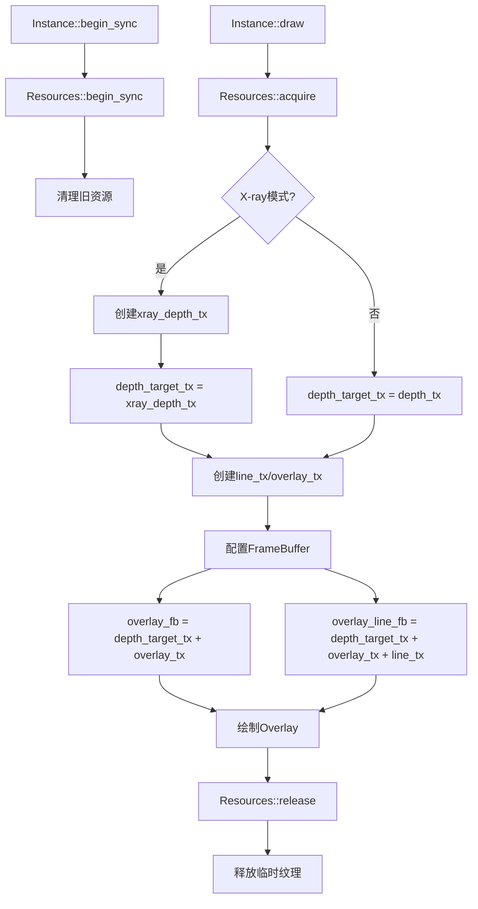
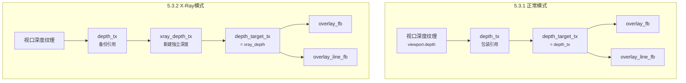
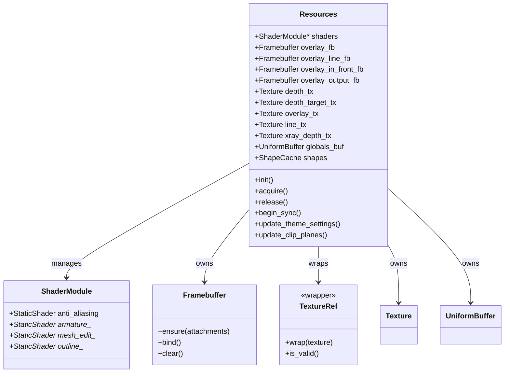
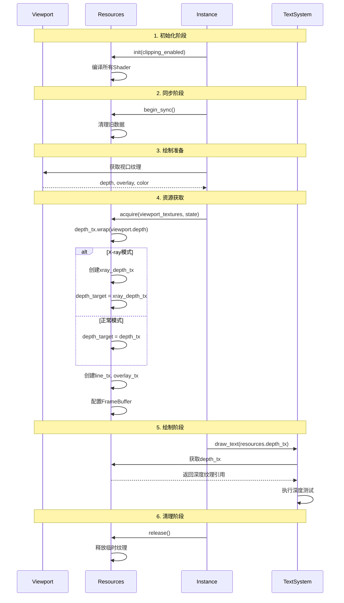

# overlay_private.hh - Resources类详解

## 目录
- [1. 概述](#1-概述)
- [2. Resources类完整定义分析](#2-resources类完整定义分析)
  - [2.1. 类定义与继承关系](#21-类定义与继承关系)
  - [2.2. 成员变量详解](#22-成员变量详解)
    - [2.2.1. Framebuffer成员](#221-framebuffer成员)
    - [2.2.2. Texture成员](#222-texture成员)
    - [2.2.3. 深度纹理传递链相关成员](#223-深度纹理传递链相关成员)
- [3. 关键方法详解](#3-关键方法详解)
  - [3.1. Resources::init() - Shader初始化](#31-resourcesinit-shader初始化)
  - [3.2. Resources::acquire() - 获取viewport资源](#32-resourcesacquire-获取viewport资源)
  - [3.3. Resources::release() - 资源释放](#33-resourcesrelease-资源释放)
  - [3.4. Resources::begin_sync() - 开始同步](#34-resourcesbegin_sync-开始同步)
- [4. Framebuffer系统深度分析](#4-framebuffer系统深度分析)
  - [4.1. overlay_fb vs overlay_line_fb 的区别](#41-overlay_fb-vs-overlay_line_fb-的区别)
  - [4.2. overlay_in_front_fb 的作用](#42-overlay_in_front_fb-的作用)
  - [4.3. Framebuffer生命周期图](#43-framebuffer生命周期图)
- [5. 深度纹理传递链](#5-深度纹理传递链)
  - [5.1. 正常模式的深度传递](#51-正常模式的深度传递)
  - [5.2. X-Ray模式的深度传递](#52-x-ray模式的深度传递)
  - [5.3. 深度纹理传递路径图](#53-深度纹理传递路径图)
- [6. 与文本遮挡目标的关系](#6-与文本遮挡目标的关系)
- [7. Python类比](#7-python类比)
  - [7.1. Resources作为资源管理器](#71-resources作为资源管理器)
  - [7.2. 上下文管理器模式](#72-上下文管理器模式)
- [8. 可视化图表](#8-可视化图表)
  - [8.1. Resources成员关系图](#81-resources成员关系图)
- [9. 实际使用场景](#9-实际使用场景)
  - [9.1. 属性查看器访问Resources](#91-属性查看器访问resources)
  - [9.2. 文本系统获取深度](#92-文本系统获取深度)

---

## 1. 概述

**源文件位置**: `source/blender/draw/engines/overlay/overlay_private.hh` (行588-978)

`Resources`类是Blender Overlay绘制引擎的核心资源管理器，负责：
- 管理所有的Framebuffer和Texture资源
- 协调X-ray模式与正常模式之间的深度纹理传递
- 提供统一的接口给各个overlay组件访问GPU资源
- 管理Shader模块的初始化和编译

<mark style="background-color: #fff3cd; color: #856404;">**关键理解**: Resources是一个GPU资源容器，类似于Python的资源管理器，它将所有Overlay组件需要的FrameBuffer、Texture、Shader集中管理，确保各组件能够正确访问和使用这些资源。</mark>

---

## 2. Resources类完整定义分析

### 2.1. 类定义与继承关系

**定义位置**: `overlay_private.hh:588-680`

```cpp
struct Resources : public select::SelectMap {
  ShaderModule *shaders = nullptr;

  // Framebuffer members...
  // Texture members...
  // ...其他成员

  Resources(const SelectionType selection_type_, const ShapeCache &shapes_);
  ~Resources();

  void update_theme_settings(const DRWContext *ctx, const State &state);
  void update_clip_planes(const State &state);
  void init(bool clipping_enabled);
  void begin_sync(int clipping_plane_count);
  void acquire(const DRWContext *draw_ctx, const State &state);
  void release();
  // ...其他方法
};
```

**继承关系说明**:
- `select::SelectMap`: 提供选择(Selection)功能的基础支持
- 这使Resources同时具备资源管理和选择缓冲的功能

### 2.2. 成员变量详解

#### 2.2.1. Framebuffer成员

**定义位置**: `overlay_private.hh:592-612`

```cpp
/* Overlay Color. */
Framebuffer overlay_color_only_fb = {"overlay_color_only_fb"};
/* Overlay Color, Line Data. */
Framebuffer overlay_line_only_fb = {"overlay_line_only_fb"};
/* Depth, Overlay Color. */
Framebuffer overlay_fb = {"overlay_fb"};
/* Depth, Overlay Color, Line Data. */
Framebuffer overlay_line_fb = {"overlay_line_fb"};
/* Depth In-Front, Overlay Color. */
Framebuffer overlay_in_front_fb = {"overlay_in_front_fb"};
/* Depth In-Front, Overlay Color, Line Data. */
Framebuffer overlay_line_in_front_fb = {"overlay_line_in_front_fb"};

/* Output Color. */
Framebuffer overlay_output_color_only_fb = {"overlay_output_color_only_fb"};
/* Depth, Output Color. */
Framebuffer overlay_output_fb = {"overlay_output_fb"};

/* Render Frame-buffers. */
gpu::FrameBuffer *render_fb = nullptr;
gpu::FrameBuffer *render_in_front_fb = nullptr;
```

| Framebuffer名称 | 描述 | 用途 |
|----------------|------|------|
| `overlay_fb` | 深度+颜色 | 标准Overlay绘制，含深度测试 |
| `overlay_line_fb` | 深度+颜色+线条数据 | 线条扩展和抗锯齿(如骨骼线、网格线) |
| `overlay_in_front_fb` | In-Front深度+颜色 | 绘制在所有物体前面的对象(如选中骨骼) |
| `overlay_line_in_front_fb` | In-Front深度+颜色+线条数据 | In-Front模式的线条绘制 |
| `overlay_color_only_fb` | 仅颜色 | 不需要深度的纯颜色绘制 |
| `overlay_line_only_fb` | 仅颜色+线条数据 | 仅线条数据写入 |
| `overlay_output_fb` | 输出深度+颜色 | 最终输出到视口的帧缓冲 |
| `render_fb` | 渲染引擎的FB | 用于在渲染结果上叠加 |

#### 2.2.2. Texture成员

**定义位置**: `overlay_private.hh:614-661`

```cpp
/* Target containing line direction and data for line expansion and anti-aliasing. */
TextureFromPool line_tx = {"line_tx"};
/* Target containing overlay color before anti-aliasing. */
TextureFromPool overlay_tx = {"overlay_tx"};
/* Target containing depth of overlays when xray is enabled. */
TextureFromPool xray_depth_tx = {"xray_depth_tx"};
TextureFromPool xray_depth_in_front_tx = {"xray_depth_in_front_tx"};

/* Texture that are usually allocated inside. */
TextureFromPool depth_in_front_alloc_tx = {"overlay_depth_in_front_tx"};
TextureFromPool color_overlay_alloc_tx = {"overlay_color_overlay_alloc_tx"};
TextureFromPool color_render_alloc_tx = {"overlay_color_render_alloc_tx"};

/* 1px texture containing only maximum depth. */
Texture dummy_depth_tx = {"dummy_depth_tx"};

/* Wrappers around #DefaultTextureList members. */
TextureRef depth_in_front_tx;
TextureRef color_overlay_tx;
TextureRef color_render_tx;
TextureRef depth_tx;           // ⭐ 关键成员
TextureRef depth_target_tx;    // ⭐ 关键成员
TextureRef depth_target_in_front_tx;
```

<mark style="background-color: #e3f2fd; color: #0d47a1;">**关键Texture成员说明**:</mark>

- **`line_tx`**: 存储线条方向和数据，用于线条扩展和抗锯齿
- **`overlay_tx`**: 存储抗锯齿前的Overlay颜色
- **`xray_depth_tx`**: X-ray模式下存储场景深度的独立纹理
- **`depth_tx`**: <span style="color: #ff6b6b; font-weight: bold;">视口深度纹理(最核心)</span>，用于文本遮挡判断
- **`depth_target_tx`**: 实际的深度目标，可能是`depth_tx`或`xray_depth_tx`

#### 2.2.3. 深度纹理传递链相关成员

**定义位置**: `overlay_private.hh:654-661`

```cpp
/**
 * Scene depth buffer that can also be used as render target for overlays.
 * Can only be bound as a texture if either:
 * - the current frame-buffer has no depth buffer attached.
 * - `state.xray_enabled` is true.
 */
TextureRef depth_tx;

/**
 * Depth target.
 * Can either be default depth buffer texture from #DefaultTextureList
 * or `xray_depth_tx` if X-ray is enabled.
 */
TextureRef depth_target_tx;
TextureRef depth_target_in_front_tx;
```

**关键作用**:
- `depth_tx`: 提供对视口深度缓冲的访问，是<mark style="background-color: #ffebee;">文本系统进行遮挡测试的关键</mark>
- `depth_target_tx`: 实际的绘制目标，根据X-ray模式动态切换

---

## 3. 关键方法详解

### 3.1. Resources::init() - Shader初始化

**定义位置**: `overlay_private.hh:684-758`

```cpp
void Resources::init(bool clipping_enabled)
{
    shaders = &overlay::ShaderModule::module_get(selection_type, clipping_enabled);

    // 异步编译大量Shader
    shaders->anti_aliasing.ensure_compile_async();
    shaders->armature_degrees_of_freedom.ensure_compile_async();
    shaders->armature_envelope_fill.ensure_compile_async();
    // ... 约100+个Shader的异步编译
}
```

**Python类比**:
```python
class Resources:
    def init(self, clipping_enabled):
        # 获取Shader模块单例
        self.shaders = ShaderModule.get(selection_type, clipping_enabled)

        # 预编译所有可能用到的Shader(异步)
        shader_list = [
            "anti_aliasing",
            "armature_degrees_of_freedom",
            "armature_envelope_fill",
            # ... 上百个
        ]
        for shader_name in shader_list:
            self.shaders[shader_name].compile_async()
```

### 3.2. Resources::acquire() - 获取viewport资源

**定义位置**: `overlay_private.hh:766-845`

```cpp
void Resources::acquire(const DRWContext *draw_ctx, const State &state)
{
    // 1. 获取视口纹理引用
    DefaultTextureList &viewport_textures = *draw_ctx->viewport_texture_list_get();
    DefaultFramebufferList &viewport_framebuffers = *draw_ctx->viewport_framebuffer_list_get();

    // 2. 包装视口深度纹理
    this->depth_tx.wrap(viewport_textures.depth);
    this->depth_in_front_tx.wrap(viewport_textures.depth_in_front);
    this->color_overlay_tx.wrap(viewport_textures.color_overlay);
    this->color_render_tx.wrap(viewport_textures.color);

    // 3. 根据X-ray模式处理深度目标
    if (state.xray_enabled) {
        // X-Ray模式: 创建独立深度纹理
        this->xray_depth_tx.acquire(render_size, gpu::TextureFormat::SFLOAT_32_DEPTH_UINT_8);
        this->depth_target_tx.wrap(this->xray_depth_tx);
    } else {
        // 正常模式: 使用视口深度纹理
        this->depth_target_tx.wrap(this->depth_tx);
    }

    // 4. 创建临时渲染纹理
    this->line_tx.acquire(render_size, gpu::TextureFormat::UNORM_8_8_8_8, usage);
    this->overlay_tx.acquire(render_size, gpu::TextureFormat::SRGBA_8_8_8_8, usage);

    // 5. 配置FrameBuffer
    this->overlay_fb.ensure(GPU_ATTACHMENT_TEXTURE(this->depth_target_tx),
                           GPU_ATTACHMENT_TEXTURE(this->overlay_tx));
    this->overlay_line_fb.ensure(GPU_ATTACHMENT_TEXTURE(this->depth_target_tx),
                                GPU_ATTACHMENT_TEXTURE(this->overlay_tx),
                                GPU_ATTACHMENT_TEXTURE(this->line_tx));
}
```

**关键流程**:
1. 获取视口现有的纹理和FrameBuffer
2. 包装视口深度纹理到`depth_tx`
3. **根据X-ray模式决定使用哪个深度目标**:
   - X-ray: 新建`xray_depth_tx` → `depth_target_tx`
   - 正常: 直接引用`depth_tx` → `depth_target_tx`
4. 创建临时渲染纹理
5. 配置各个FrameBuffer使用对应的纹理附件

### 3.3. Resources::release() - 资源释放

**定义位置**: `overlay_private.hh:847-857`

```cpp
void Resources::release()
{
    this->line_tx.release();
    this->overlay_tx.release();
    this->xray_depth_tx.release();
    this->xray_depth_in_front_tx.release();
    this->depth_in_front_alloc_tx.release();
    this->color_overlay_alloc_tx.release();
    this->color_render_alloc_tx.release();
    free_movieclips_textures();
}
```

**Python类比**:
```python
def release(self):
    """释放临时资源，保留视口纹理引用"""
    # 释放acquire()中创建的临时纹理
    self.line_tx.release()
    self.overlay_tx.release()
    self.xray_depth_tx.release()  # X-ray专用深度

    # 释放备用纹理
    self.depth_in_front_alloc_tx.release()
    # ... 其他释放

    # 释放电影片段纹理
    self.free_movieclips_textures()
```

### 3.4. Resources::begin_sync() - 开始同步

**定义位置**: `overlay_private.hh:760-764`

```cpp
void Resources::begin_sync(int clipping_plane_count)
{
    SelectMap::begin_sync(clipping_plane_count);
    free_movieclips_textures();
}
```

**作用**: 开始新的渲染同步周期，重置选择映射并清理电影片段纹理。

---

## 4. Framebuffer系统深度分析

### 4.1. overlay_fb vs overlay_line_fb 的区别

| 对比项 | overlay_fb | overlay_line_fb |
|--------|-----------|----------------|
| **附件** | 深度 + 颜色 | 深度 + 颜色 + <span style="color: #ff6b6b;">线条数据</span> |
| **用途** | 普通三角形/点绘制 | 需要线条扩展和抗锯齿的绘制 |
| **典型Shader** | `overlay_uniform_color` | `overlay_edit_mesh_edge` |
| **线条数据格式** | 无 | `UNORM_8_8_8_8` (RGBA) |

**线条数据的用途**:
```cpp
// 在线条Shader中计算线条方向
// line_tx = overlay_line_fb的第三个附件
// 存储: [dir_x, dir_y, coverage, special_flag]
```

### 4.2. overlay_in_front_fb 的作用

**定义位置**: `overlay_private.hh:599-602`

```cpp
/* Depth In-Front, Overlay Color. */
Framebuffer overlay_in_front_fb = {"overlay_in_front_fb"};
/* Depth In-Front, Overlay Color, Line Data. */
Framebuffer overlay_line_in_front_fb = {"overlay_line_in_front_fb"};
```

**为什么需要In-Front FrameBuffer**:
- 某些对象需要始终显示在最前面(如选中的骨骼)
- 使用独立的深度缓冲，深度测试逻辑不同
- 绘制顺序: 先绘制普通几何体 → 再绘制In-Front对象

### 4.3. Framebuffer生命周期图



---

## 5. 深度纹理传递链

### 5.1. 正常模式的深度传递

```
┌─────────────────────────────────────────────────────┐
│            正常模式 (X-ray disabled)                │
├─────────────────────────────────────────────────────┤
│                                                     │
│   Viewport.depth → depth_tx                        │
│                      ↓                              │
│                depth_target_tx                      │
│                      ↓                              │
│        ┌───────────┴───────────┐                  │
│        ↓                       ↓                  │
│  overlay_fb             overlay_line_fb           │
│  (深度=depth_target)    (附加line_tx)             │
│                                                     │
└─────────────────────────────────────────────────────┘
```

**关键点**:
- `depth_tx` 直接包装视口深度纹理
- `depth_target_tx` 引用 `depth_tx`
- 所有FrameBuffer共享同一个深度目标

### 5.2. X-Ray模式的深度传递

```
┌─────────────────────────────────────────────────────┐
│              X-Ray模式 (X-ray enabled)              │
├─────────────────────────────────────────────────────┤
│                                                     │
│   Viewport.depth → depth_tx                        │
│                      ↓                              │
│   ┌──────────────────┴──────────────────┐          │
│   ↓                                     ↓          │
│ xray_depth_tx (%)                   depth_tx       │
│   ↓                                     (备用)      │
│ depth_target_tx                                    │
│   ↓                                                │
│ ┌──┴─────┐                                        │
│ ↓        ↓                                        │
│ overlay_fb                                        │
│ overlay_line_fb                                   │
│                                                     │
└─────────────────────────────────────────────────────┘
```

**注释**: `xray_depth_tx` 用 `%` 标记，代表它是一个临时的独立深度缓冲。

### 5.3. 深度纹理传递路径图



---

## 6. 与文本遮挡目标的关系

**目标1**的实现依赖于Resources提供`depth_tx`:

### 6.1. 为什么 depth_tx 是解决文本遮挡的关键

**源码位置**: `overlay_instance.cc:1020-1025`
```cpp
// 在Instance::draw_text()中
blender::gpu::Texture *depth_tx = use_depth_test ? resources.depth_tx : nullptr;

DRW_text_cache_draw(state.dt, state.region, state.v3d, depth_tx, alpha);
```

**关键流程**:
1. `Resources::acquire()` 包装视口深度到 `resources.depth_tx`
2. `Instance::draw_text()` 传递 `resources.depth_tx` 给文本系统
3. `DRW_text_cache_draw()` 使用深度纹理进行遮挡测试

### 6.2. 如何在其他Overlay组件中访问depth_tx

```cpp
// 任何Overlay组件都可以通过Resources访问
class MyOverlayComponent {
    void draw(Resources &resources, State &state) {
        // 访问深度纹理
        blender::gpu::Texture *depth = resources.depth_tx;

        // 在Shader中绑定深度纹理
        pass.bind_texture("depth_tx", depth);
    }
}
```

### 6.3. Resources如何在Instance中被传递

**源码位置**: `overlay_instance.cc`
```cpp
class Instance {
    Resources resources;  // 成员变量

    void begin_sync() {
        resources.begin_sync(state.clipping_plane_count);
        // 传递给各组件
        regular.meshes.begin_sync(resources, state);
        regular.text.begin_sync(resources, state);
        // ...
    }

    void object_sync(ObjectRef &ob_ref, Manager &manager) {
        // 传递给对象级同步
        layer.text.object_sync(manager, ob_ref, resources, state);
    }
}
```

---

## 7. Python类比

### 7.1. Resources作为资源管理器

```python
class Resources:
    """
    GPU资源管理器，类似于Python的上下文管理器

    设计模式: 单例模式 + 资源池
    """

    def __init__(self, selection_type, shapes):
        # 继承选择映射功能
        super().__init__(selection_type)

        # Shader模块
        self.shaders = None

        # Framebuffer字典
        self.framebuffers = {
            'overlay_fb': None,
            'overlay_line_fb': None,
            'overlay_in_front_fb': None,
            # ...
        }

        # Texture字典
        self.textures = {
            'depth_tx': None,           # ⭐ 核心: 视口深度
            'depth_target_tx': None,    # ⭐ 实际绘制目标
            'line_tx': None,
            'overlay_tx': None,
            # ...
        }

    def init(self, clipping_enabled):
        """初始化: 编译所有Shader"""
        self.shaders = ShaderModule.get(selection_type, clipping_enabled)
        for shader in ALL_SHADERS:
            self.shaders[shader].compile_async()

    def acquire(self, viewport_textures, state):
        """获取资源: 包装视口纹理"""
        # 包装视口深度
        self.textures['depth_tx'] = viewport_textures.depth

        # 根据X-ray模式处理
        if state.xray_enabled:
            self.textures['depth_target_tx'] = self.create_xray_depth()
        else:
            self.textures['depth_target_tx'] = self.textures['depth_tx']

        # 创建临时纹理
        self.textures['line_tx'] = Texture.create(render_size)
        self.textures['overlay_tx'] = Texture.create(render_size)

        # 配置FrameBuffer
        self.framebuffers['overlay_fb'] = FrameBuffer(
            attachments=[self.textures['depth_target_tx'],
                        self.textures['overlay_tx']]
        )

    def release(self):
        """释放资源: 清理临时纹理"""
        for tex_name in ['line_tx', 'overlay_tx', 'xray_depth_tx']:
            if self.textures[tex_name]:
                self.textures[tex_name].release()
```

### 7.2. 上下文管理器模式

```python
# 类比Python的with语句
class ResourcesContext:
    def __enter__(self):
        self.resources.acquire(viewport, state)
        return self.resources

    def __exit__(self, exc_type, exc_val, exc_tb):
        self.resources.release()

# 使用方式
with ResourcesContext(resources) as res:
    # 在此期间使用resources
    draw_pass(res.depth_tx)
# 自动调用release()
```

---

## 8. 可视化图表

### 8.1. Resources成员关系图



### 8.2. 完整的深度纹理生命周期图



---

## 9. 实际使用场景

### 9.1. 属性查看器访问Resources

**源码位置**: `overlay_instance.cc:466-467`
```cpp
// 在Instance::begin_sync()中
layer.attribute_viewer.begin_sync(resources, state);
```

**假设实现**:
```cpp
class AttributeViewer {
    void begin_sync(Resources &resources, State &state) {
        // 获取Shader
        gpu::Shader *shader = resources.shaders->attribute_viewer_mesh;

        // 获取深度纹理(用于遮挡测试)
        gpu::Texture *depth = resources.depth_tx;

        // 创建绘制通道
        PassSimple pass("AttributeViewer");
        pass.bind_texture("depth_tx", depth);
        pass.draw(mesh_batch);
    }
};
```

### 9.2. 文本系统获取深度

**完整调用链**:
```cpp
// overlay_instance.cc:983
void Instance::draw_text(Framebuffer &framebuffer) {
    if (!state.show_text) return;

    // 决定是否使用深度测试
    bool use_depth_test = !state.xray_enabled;

    // ⭐ 关键: 从Resources获取深度纹理
    blender::gpu::Texture *depth_tx = use_depth_test ? resources.depth_tx : nullptr;

    // 传递给文本系统
    DRW_text_cache_draw(state.dt, state.region, state.v3d, depth_tx, alpha);
}

// draw_manager_text.cc:240
void DRW_text_cache_draw(const DRWTextStore *dt,
                        const ARegion *region,
                        const View3D *v3d,
                        blender::gpu::Texture *depth_tx,  // ← 来自Resources
                        const uchar alpha) {
    if (depth_tx) {
        // 创建深度采样FrameBuffer
        depth_frame_buffer = GPU_framebuffer_create("text_depth_read");
        GPU_framebuffer_texture_attach(depth_frame_buffer, depth_tx, 0, 0);

        // 逐个文本进行深度测试
        BLI_memiter_iter_init(dt->cache_strings, &it);
        while ((vos = static_cast<ViewCachedString *>(BLI_memiter_iter_step(&it)))) {
            bool is_visible = drw_text_depth_test(depth_frame_buffer, ...);
            if (!is_visible) {
                vos->sco[0] = IS_CLIPPED;  // 隐藏被遮挡的文本
            }
        }
    }
}
```

### 9.3. X-Ray模式下的特殊处理

```cpp
// 当X-ray启用时，文本系统仍使用depth_tx而非xray_depth_tx
// 这是因为depth_tx保存的是原始场景深度

void Instance::draw_text(Framebuffer &framebuffer) {
    // 即使在X-ray模式下，depth_tx仍保留原始深度
    // 因此文本系统可以正确判断遮挡关系

    bool use_depth_test = true;  // X-ray下依然启用

    if (state.xray_enabled) {
        // X-ray特殊逻辑：depth_tx保存原始不可见几何体深度
        // xray_depth_tx临时存储可见几何体深度
        // 文本系统使用depth_tx进行更准确的遮挡判断

        use_depth_test = true;  // 继续使用原始深度
    }

    blender::gpu::Texture *depth_tx = resources.depth_tx;
    DRW_text_cache_draw(state.dt, state.region, state.v3d, depth_tx, alpha);
}
```

---

## 总结

`Resources`类是Blender Overlay引擎的**资源中枢**，它：

1. **统一管理GPU资源**: Framebuffer、Texture、Shader
2. **动态适应显示模式**: X-ray/正常模式自动切换深度目标
3. **提供关键深度接口**: `depth_tx`为文本遮挡提供场景深度
4. **支持组件解耦**: 各overlay组件通过Resources访问资源，无需了解实现细节

通过理解Resources，您已经掌握了Overlay引擎的资源管理机制，这对于实现文本遮挡目标至关重要！