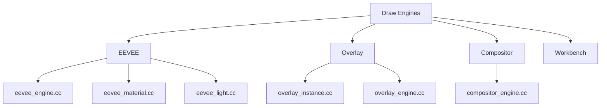
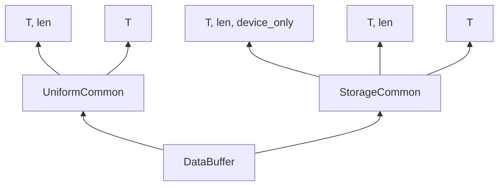
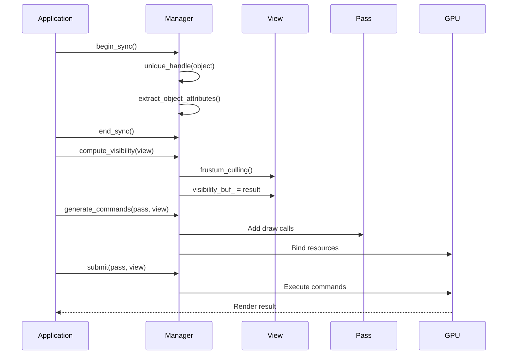
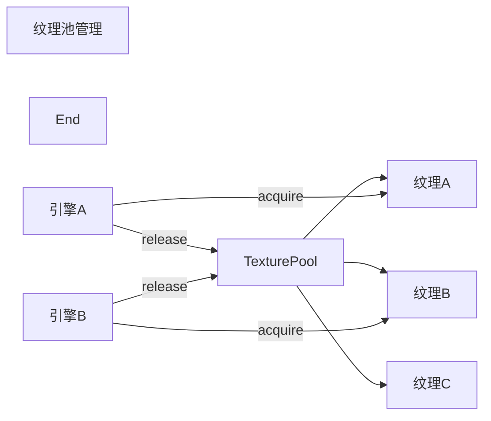

# Blender渲染系统基础

## 目录
- [1. 概述](#概述)
- [2. 核心组件分析](#核心组件分析)
  - [2.1. 绘制引擎架构](#1-绘制引擎架构)
  - [2.2. GPU抽象层](#2-GPU抽象层)
  - [2.3. 渲染管线](#3-渲染管线)
- [3. 核心函数解析](#3-核心函数解析)
  - [3.1. 绘制管理器](#1-绘制管理器)
  - [3.2. 视图管理](#2-视图管理)
  - [3.3. 资源管理](#3-资源管理)
- [4. 实现细节](#4-实现细节)
  - [4.1. Draw Manager文本渲染](#1-draw-manager文本渲染)
  - [4.2. GPU缓冲区包装器](#2-GPU缓冲区包装器)
- [5. 总结](#5-总结)

## 1. 概述

Blender的渲染系统是一个高度模块化和可扩展的架构，位于`source/blender/draw/`目录下。这个系统负责将3D场景数据转换为屏幕上的像素，支持多种渲染引擎（如EEVEE、Workbench、Compositor）并提供统一的接口层。

### 系统架构概览

<div align="center">
  <span style="color: #ff6b6b; font-weight: bold;">GPU抽象层</span> (OpenGL/Vulkan/Metal)<br>
  ↓<br>
  <span style="color: #4ecdc4; font-weight: bold;">Draw Manager</span> (资源管理、调度)<br>
  ↓<br>
  <span style="color: #45b7d1; font-weight: bold;">渲染引擎</span> (EEVEE/Overlay/Compositor)<br>
  ↓<br>
  <span style="color: #f9ca24; font-weight: bold;">最终输出</span>
</div>

### 关键概念说明

- **DRW**: Draw的缩写，是Blender渲染系统的核心命名空间
- **GPU**: Graphics Processing Unit，图形处理单元
- **Engine**: 渲染引擎，负责特定类型的渲染（如EEVEE为实时渲染）
- **Manager**: 管理器，协调资源和渲染流程
- **Resource Handle**: 资源句柄，用于标识和管理GPU资源

## 2. 核心组件分析

### 2.1. 绘制引擎架构

#### 引擎注册和生命周期

**定义位置**: `E:\blender-git\blender\source\blender\draw\DRW_engine.hh:38-43`
```cpp
void DRW_engines_register();
void DRW_engines_free();

void DRW_module_init();
void DRW_module_exit();
```

#### 引擎类型接口

**定义位置**: `E:\blender-git\blender\source\blender\draw\DRW_engine.hh:58-102`
```cpp
// 主要绘制入口点
void DRW_draw_view(const bContext *C);

// 离屏渲染循环
void DRW_draw_render_loop_offscreen(Depsgraph *depsgraph,
                                    RenderEngineType *engine_type,
                                    ARegion *region,
                                    View3D *v3d,
                                    bool is_image_render,
                                    bool draw_background,
                                    bool do_color_management,
                                    GPUOffScreen *ofs,
                                    GPUViewport *viewport);

// 选择循环（用于对象选择）
void DRW_draw_select_loop(Depsgraph *depsgraph,
                          ARegion *region,
                          View3D *v3d,
                          bool use_obedit_skip,
                          bool draw_surface,
                          bool use_nearest,
                          bool do_material_sub_selection,
                          const rcti *rect,
                          DRW_SelectPassFn select_pass_fn,
                          void *select_pass_user_data,
                          DRW_ObjectFilterFn object_filter_fn,
                          void *object_filter_user_data);
```

#### 引擎目录结构



渲染引擎位于 `source/blender/draw/engines/` 目录下，每个引擎都有独立的实现：

- **EEVEE**: 实时渲染引擎，支持PBR材质、光照、阴影等
- **Overlay**: 视口覆盖层，用于编辑器UI显示
- **Compositor**: 合成器，用于后期处理
- **Workbench**: 工作台引擎，用于草稿渲染

### 2.2. GPU抽象层

#### GPU上下文管理

**定义位置**: `E:\blender-git\blender\source\blender\draw\DRW_engine.hh:143-160`
```cpp
void DRW_gpu_context_create();
void DRW_gpu_context_destroy();
void DRW_gpu_context_enable();
bool DRW_gpu_context_try_enable();
bool DRW_gpu_context_is_enabled();
void DRW_gpu_context_disable();
```

#### GPU资源包装器

**定义位置**: `E:\blender-git\blender\source\blender\draw\intern\DRW_gpu_wrapper.hh`

系统提供了多种C++包装器来简化GPU资源的使用：

```cpp
// 统一缓冲区 (Uniform Buffer) - 用于传输少量数据到着色器
template<typename T, int64_t len>
class UniformArrayBuffer;

// 存储缓冲区 (Storage Buffer) - 用于传输大量数据到着色器
template<typename T, int64_t len = (512u + (sizeof(T) - 1)) / sizeof(T), bool device_only = false>
class StorageArrayBuffer;

// 纹理包装器
class Texture;

// 帧缓冲区包装器
class Framebuffer;
```

GPU类型说明：<span style="color: #4ecdc4;">**Uniform Buffer**</span>通常限制为16KB，而<span style="color: #45b7d1;">**Storage Buffer**</span>可以容纳更多数据。所有缓冲区都需要调用 `push_update()` 来上传到GPU内存。

#### GPU缓冲区层次结构



### 3. 渲染管线

#### 渲染工作流程

Blender的渲染管线遵循以下顺序：

1. **Sync阶段**: 准备场景数据，创建资源句柄
2. **可见性计算**: CPU/GPU计算可见性，进行视锥体剔除
3. **命令生成**: 生成绘制命令
4. **提交阶段**: 执行实际的GPU渲染



## 3. 核心函数解析

### 3.1. 绘制管理器

#### Manager类 - 核心管理器

**定义位置**: `E:\blender-git\blender\source\blender\draw\intern\draw_manager.hh`

Manager是绘制系统的核心，负责管理所有资源和渲染流程：

```cpp
class Manager {
    // 资源缓冲区 - 使用SwapChain支持双缓冲
    SwapChain<ObjectMatricesBuf, 2> matrix_buf;
    SwapChain<ObjectBoundsBuf, 2> bounds_buf;
    SwapChain<ObjectInfosBuf, 2> infos_buf;

    // 临时缓冲区
    ObjectAttributeBuf attributes_buf;
    LayerAttributeBuf layer_attributes_buf;

public:
    // 资源句柄创建
    ResourceHandleRange unique_handle(const ObjectRef &ref);
    ResourceHandleRange resource_handle(const ObjectRef &ref, float inflate_bounds = 0.0f);
    ResourceHandle resource_handle(const float4x4 &model_matrix);

    // 渲染流程管理
    void compute_visibility(View &view);
    void generate_commands(PassMain &pass, View &view);
    void submit(PassMain &pass, View &view);

    // 同步管理
    void begin_sync(Object *object_active = nullptr);
    void end_sync();
};
```

**关键概念**:
- <span style="color: #ff6b6b;">**SwapChain**</span>: 双缓冲机制，避免资源竞争
- <span style="color: #4ecdc4;">**ResourceHandle**</span>: 资源索引，用于引用场景中的对象
- <span style="color: #f9ca24;">**ObjectRef**</span>: 对象引用，包含对象和可能的实例化信息

#### 资源句柄创建模式

**内联实现**: `E:\blender-git\blender\source\blender\draw\intern\draw_manager.hh:315-361`

```cpp
inline ResourceHandleRange Manager::resource_handle(const ObjectRef &ref, float inflate_bounds)
{
    bool is_active_object = ref.is_active(object_active);
    bool is_active_edit_mode = object_active &&
                             (DRW_object_is_in_edit_mode(object_active) ||
                              ELEM(object_active->mode, OB_MODE_TEXTURE_PAINT, OB_MODE_SCULPT)) &&
                             ref.object->mode == object_active->mode;

    if (ref.duplis_) {
        // 处理实例化对象（多个副本）
        uint start = resource_len_;
        // ... 为每个实例创建独立的资源句柄
        return ResourceHandleRange(...);
    }
    else {
        // 处理单个对象
        matrix_buf.current().get_or_resize(resource_len_).sync(*ref.object);
        bounds_buf.current().get_or_resize(resource_len_).sync(*ref.object, inflate_bounds);
        infos_buf.current().get_or_resize(resource_len_).sync(ref, is_active_object, is_active_edit_mode);
        return ResourceHandle(resource_len_++, (ref.object->transflag & OB_NEG_SCALE) != 0);
    }
}
```

### 3.2. 视图管理

#### View类 - 视图和相机管理

**定义位置**: `E:\blender-git\blender\source\blender\draw\intern\draw_view.hh`

View类负责管理渲染视角，支持单视图和多视图渲染（如立体渲染）：

```cpp
class View {
protected:
    // 视图矩阵数据 - 支持DRW_VIEW_MAX个视图
    UniformArrayBuffer<ViewMatrices, DRW_VIEW_MAX> data_;
    UniformArrayBuffer<ViewCullingData, DRW_VIEW_MAX> culling_;
    UniformArrayBuffer<ViewMatrices, DRW_VIEW_MAX> data_freeze_;
    UniformArrayBuffer<ViewCullingData, DRW_VIEW_MAX> culling_freeze_;

    // 可见性结果
    VisibilityBuf visibility_buf_;
    uint64_t manager_fingerprint_ = 0;

    int view_len_ = 0;  // 视图数量
    bool do_visibility_ = true;  // 是否进行可见性测试

public:
    void sync(const float4x4 &view_mat, const float4x4 &win_mat, int view_id = 0);

    // 矩阵访问
    const float4x4 &viewmat(int view_id = 0) const;
    const float4x4 &winmat(int view_id = 0) const;
    const float4x4 persmat(int view_id = 0) const;  // 投影矩阵

    // 可见性计算
    virtual void compute_visibility(ObjectBoundsBuf &bounds,
                                   ObjectInfosBuf &infos,
                                   uint resource_len,
                                   bool debug_freeze);
};
```

#### 视图矩阵计算

**投影矩阵公式**:
- **透视投影**: \( P = WinMat \times ViewMat \)
- **视锥体裁剪**: 使用6个平面方程进行裁剪
- **深度范围**: 根据是否为透视投影计算

### 3.3. 资源管理

#### 缓冲区管理策略

Blender使用多种缓冲区策略：

1. **存储缓冲区用于对象数据**:
   - `ObjectMatrices`: 4x4变换矩阵
   - `ObjectBounds`: 包围盒信息
   - `ObjectInfos`: 对象元数据

2. **统一缓冲区用于视图数据**:
   - `ViewMatrices`: 相机矩阵
   - `ViewCullingData`: 裁剪数据

3. **动态调整**:
   ```cpp
   // 自动调整缓冲区大小
   T &get_or_resize(int64_t index)
   {
       if (index >= this->len_) {
           size_t size = power_of_2_max_u(index + 1);
           this->resize(size);
       }
       return this->data_[index];
   }
   ```

## 4. 实现细节

### 4.1. Draw Manager文本渲染

#### 文本缓存系统

**定义位置**: `E:\blender-git\blender\source\blender\draw\intern\draw_manager_text.cc:54-69`

```cpp
struct ViewCachedString {
  float vec[3];           // 3D位置
  union {
    uchar ub[4];          // RGBA颜色
    int pack;
  } col;
  short sco[2];          // 屏幕坐标
  short xoffs, yoffs;    // 偏移量
  short flag;            // 标志位
  int str_len;           // 字符串长度
  bool shadow;           // 阴影显示
  bool align_center;     // 居中对齐

  char str[0];           // 字符串数据（动态分配）
};
```

**关键特性**:
- <span style="color: #4ecdc4;">**延迟渲染**</span>: 先缓存所有文本，最后统一绘制
- <span style="color: #45b7d1;">**3D到2D投影**</span>: 自动将3D坐标投影到屏幕空间
- <span style="color: #f9ca24;">**内存优化**</span>: 使用BLI_memiter进行高效内存管理

#### 文本渲染流程

**核心函数**: `DRW_text_cache_draw()`
**定义位置**: `E:\blender-git\blender\source\blender\draw\intern\draw_manager_text.cc:201-261`

```cpp
void DRW_text_cache_draw(const DRWTextStore *dt, const ARegion *region, const View3D *v3d)
{
    if (v3d) {
        // 3D视图文本渲染
        RegionView3D *rv3d = static_cast<RegionView3D *>(region->regiondata);

        // 1. 项目所有字符串到屏幕空间
        BLI_memiter_iter_init(dt->cache_strings, &it);
        while ((vos = static_cast<ViewCachedString *>(BLI_memiter_iter_step(&it)))) {
            if (ED_view3d_project_short_ex(region,
                (vos->flag & DRW_TEXT_CACHE_GLOBALSPACE) ? rv3d->persmat : rv3d->persmatob,
                (vos->flag & DRW_TEXT_CACHE_LOCALCLIP) != 0,
                vos->vec, vos->sco,
                V3D_PROJ_TEST_CLIP_BB | V3D_PROJ_TEST_CLIP_WIN | V3D_PROJ_TEST_CLIP_NEAR) == V3D_PROJ_RET_OK)
            {
                tot++;
            }
            else {
                vos->sco[0] = IS_CLIPPED;  // 标记为裁剪
            }
        }

        // 2. 绘制可见文本
        if (tot) {
            // 禁用裁剪以显示文本
            if (rv3d_clipping_enabled) {
                GPU_clip_distances(0);
            }
            drw_text_cache_draw_ex(dt, region);
            if (rv3d_clipping_enabled) {
                GPU_clip_distances(6);  // 恢复裁剪
            }
        }
    }
}
```

#### 测量统计功能

**定义位置**: `E:\blender-git\blender\source\blender\draw\intern\draw_manager_text.cc:263-676`

系统提供了详细的几何测量功能：
- 边长测量 (V3D_OVERLAY_EDIT_EDGE_LEN)
- 角度测量 (V3D_OVERLAY_EDIT_EDGE_ANG, V3D_OVERLAY_EDIT_FACE_ANG)
- 面积测量 (V3D_OVERLAY_EDIT_FACE_AREA)
- 索引显示 (V3D_OVERLAY_EDIT_INDICES)

数学公式示例：
- 边长: \(\text{length} = \|\mathbf{v}_1 - \mathbf{v}_2\|\)
- 角度: \(\theta = \arccos\left(\frac{\mathbf{n}_1 \cdot \mathbf{n}_2}{\|\mathbf{n}_1\| \|\mathbf{n}_2\|}\right)\)
- 面积: \(\text{area} = \sum_{i} \text{area}(\triangle_i)\)

### 4.2. GPU缓冲区包装器

#### UniformArrayBuffer 模板类

**定义位置**: `E:\blender-git\blender\source\blender\draw\intern\DRW_gpu_wrapper.hh:276-296`

```cpp
template<typename T, int64_t len>
class UniformArrayBuffer : public detail::UniformCommon<T, len, false> {
public:
    UniformArrayBuffer(const char *name = nullptr)
        : detail::UniformCommon<T, len, false>(name)
    {
        /* 分配内存，16字节对齐 */
        this->data_ = (T *)MEM_mallocN_aligned(len * sizeof(T), 16, this->name_);
    }

    ~UniformArrayBuffer()
    {
        MEM_freeN(static_cast<void *>(this->data_));
    }

    void push_update()
    {
        GPU_uniformbuf_update(this->ubo_, this->data_);
    }
};
```

#### StorageArrayBuffer 模板类

**定义位置**: `E:\blender-git\blender\source\blender\draw\intern\DRW_gpu_wrapper.hh:325-408`

```cpp
template<typename T, int64_t len = (512u + (sizeof(T) - 1)) / sizeof(T), bool device_only = false>
class StorageArrayBuffer : public detail::StorageCommon<T, len, device_only> {
public:
    /* 动态调整大小 */
    void resize(int64_t new_size)
    {
        BLI_assert(new_size > 0);
        if (new_size != this->len_) {
            T *new_data_ = (T *)MEM_mallocN_aligned(new_size * sizeof(T), 16, this->name_);
            memcpy(new_data_, this->data_, min_uu(this->len_, new_size) * sizeof(T));
            MEM_freeN(static_cast<void *>(this->data_));
            this->data_ = new_data_;

            GPU_storagebuf_free(this->ssbo_);
            this->len_ = new_size;
            this->ssbo_ = GPU_storagebuf_create_ex(sizeof(T) * this->len_, nullptr,
                device_only ? GPU_USAGE_DEVICE_ONLY : GPU_USAGE_DYNAMIC, this->name_);
        }
    }

    /* 访问时自动调整 */
    T &get_or_resize(int64_t index)
    {
        BLI_assert(index >= 0);
        if (index >= this->len_) {
            size_t size = power_of_2_max_u(index + 1);
            this->resize(size);
        }
        return this->data_[index];
    }
};
```

#### 纹理管理

**定义位置**: `E:\blender-git\blender\source\blender\draw\intern\DRW_gpu_wrapper.hh:527-1140`

Texture类提供了完整的GPU纹理管理功能：

```cpp
class Texture : NonCopyable {
    gpu::Texture *tx_ = nullptr;

public:
    /* 构造函数族 - 支持各种维度 */
    Texture(const char *name,
            blender::gpu::TextureFormat format,
            eGPUTextureUsage usage,
            int extent,           // 1D
            const float *data = nullptr,
            bool cubemap = false,
            int mip_len = 1);

    Texture(const char *name,
            blender::gpu::TextureFormat format,
            eGPUTextureUsage usage,
            int2 extent,          // 2D
            const float *data = nullptr,
            int mip_len = 1);

    /* 确保纹理存在并正确配置 */
    bool ensure_2d(blender::gpu::TextureFormat format,
                   int2 extent,
                   eGPUTextureUsage usage = GPU_TEXTURE_USAGE_GENERAL,
                   const float *data = nullptr,
                   int mip_len = 1);

    /* 纹理视图 - 用于MIP映射和数组层 */
    bool ensure_mip_views(bool cube_as_array = false);
    gpu::Texture *mip_view(int miplvl);

    /* 操作 */
    void clear(float4 values);
    template<typename T> T *read(eGPUDataFormat format, int miplvl = 0);
};
```

#### 纹理池系统

**高级功能**: `TextureFromPool`类提供了纹理池访问，避免频繁的纹理创建/销毁：

```cpp
class TextureFromPool : public Texture, NonMovable {
public:
    void acquire(int2 extent,
                 blender::gpu::TextureFormat format,
                 eGPUTextureUsage usage = GPU_TEXTURE_USAGE_GENERAL);
    void release();
};
```



### 5. 总结

Blender的渲染系统是一个高度优化和模块化的架构，主要特点包括：

#### 核心设计理念

1. **模块化分层**:
   - <span style="color: #ff6b6b;">**GPU抽象层**</span>提供跨平台支持
   - <span style="color: #4ecdc4;">**Draw Manager**</span>统一资源管理
   - <span style="color: #45b7d1;">**渲染引擎**</span>实现具体渲染算法

2. **高性能模式**:
   - 双缓冲(SwapChain)避免资源竞争
   - 动态缓冲区调整
   - 视锥体裁剪和可见性计算

3. **内存优化**:
   - 使用专用内存分配器
   - 纹理池减少GC压力
   - 缓冲区重用机制

#### 关键技术点

**渲染流程优化**:
```
Sync → Visibility → Commands → Submit
```

**资源管理策略**:
```cpp
资源句柄 → 统一缓冲区 → 存储缓冲区 → GPU提交
```

**性能数学原理**:
- 视锥体裁剪效率: \(O(n)\) 其中n为对象数量
- 资源查找: 使用哈希映射，期望\(O(1)\)
- 内存对齐: 16字节边界，优化SIMD操作

#### 应用场景

这套系统被用于：
- **视口渲染**: 实时显示3D场景
- **编辑器覆盖**: 显示选中框、测量信息等
- **离线渲染**: EEVEE和Workbench引擎
- **后期处理**: 合成器效果

通过这些精心设计的组件，Blender能够在保持代码可维护性的同时，提供高性能的渲染能力。每个组件都经过深度优化，以支持现代GPU特性和复杂的3D场景渲染需求。</think>