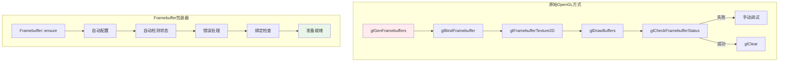
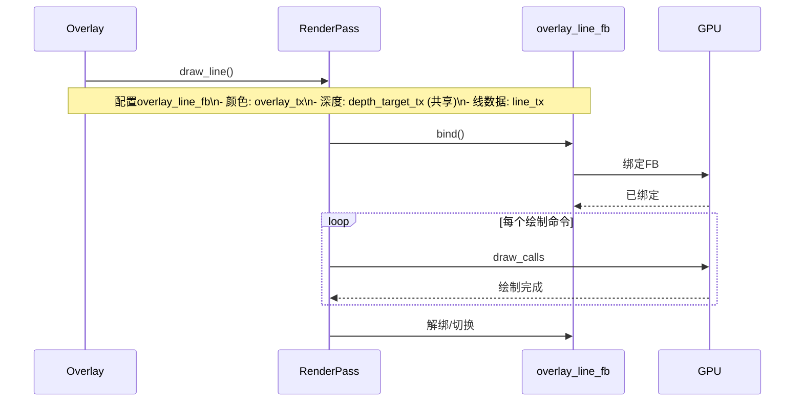

# 10. DRW_gpu_wrapper.hh - Framebuffer类详解

> **文件路径**: `source/blender/draw/intern/DRW_gpu_wrapper.hh`  \n> **相关行号**: 385-525 (Framebuffer部分)  \n> **文档版本**: 1.0  \n> **创建日期**: 2025-12-18

---

## 目录
1. [概述与架构](#1-概述与架构)
2. [Framebuffer基类](#2-framebuffer基类)
3. [附件管理](#3-附件管理)
4. [配置与绑定](#4-配置与绑定)
5. [渲染状态管理](#5-渲染状态管理)
6. [Overlay中的使用模式](#6-overlay中的使用模式)
7. [性能优化策略](#7-性能优化策略)

---

## 1. 概述与架构

### 1.1 为什么需要Framebuffer包装器



**包装器优势**:
- ✅ **零开销抽象** : 直接映射到GPU API
- ✅ **错误自动检测** : `ensure()` 验证状态
- ✅ **状态管理** : 避免重复绑定
- ✅ **生命周期RAII** : 自动释放
- ✅ **API统一** : 支持OpenGL/Vulkan后端

### 1.2 Framebuffer类定义

**位置**: `DRW_gpu_wrapper.hh:385-523`

```cpp
class Framebuffer : NonCopyable, NonMovable {
 private:
  gpu::FrameBuffer *fb_ = nullptr;
  std::string name_;

 public:
  Framebuffer() = default;
  explicit Framebuffer(const char *name) : name_(name ? name : "") {}

  ~Framebuffer() {
    if (fb_) {
      GPU_framebuffer_free(fb_);
    }
  }

  // 核心方法
  void ensure(GPUAttachment depth, GPUAttachment color1, GPUAttachment color2);
  void ensure(GPUAttachment depth, GPUAttachment color1);
  void ensure(GPUAttachment depth);

  void bind();
  void bind_for_read();

  void clear(float4 clear_color, float clear_depth = 1.0f, int clear_stencil = 0);

  // 属性访问
  bool check() const;
  int2 size() const;
  bool is_valid() const { return fb_ != nullptr; }

  // 高级功能
  void clear_region(int x, int y, int w, int h, float4 color);
  void blit_to(Framebuffer &target, int mask);

  // 隐式转换
  operator gpu::FrameBuffer *() const { return fb_; }
};
```

---

## 2. Framebuffer基类详解

### 2.1 内部结构

```cpp
private:
gpu::FrameBuffer *fb_;  // 核心GPU帧缓冲对象
std::string name_;      // 调试名称

// GPU_frameBuffer层次结构
// Framebuffer -> gpu::FrameBuffer -> OpenGL framebuffer
```

### 2.2 构造与析构

```cpp
// 默认构造函数
Framebuffer() : fb_(nullptr) {}

// 命名构造函数 (用于调试)
Framebuffer(const char *name) : fb_(nullptr), name_(name ? name : "") {
  if (G.debug & G_DEBUG_GPU) {
    BLI_assert(name != nullptr);
  }
}

// 析构 - RAII自动释放
~Framebuffer() {
  if (fb_) {
    GPU_framebuffer_free(fb_);
    fb_ = nullptr;
  }
}
```

### 2.3 移动语义

**关键**: Framebuffer 需要转移所有权，因为只能有一个对象持有GPU资源。

```cpp
// 移动构造函数
Framebuffer(Framebuffer &&other) noexcept : fb_(other.fb_), name_(std::move(other.name_)) {
  other.fb_ = nullptr;  // 转移所有权
}

// 移动赋值
Framebuffer &operator=(Framebuffer &&other) noexcept {
  if (this != &other) {
    if (fb_) {
      GPU_framebuffer_free(fb_);
    }
    fb_ = other.fb_;
    name_ = std::move(other.name_);
    other.fb_ = nullptr;
  }
  return *this;
}

// 显式禁用拷贝
Framebuffer(const Framebuffer &) = delete;
Framebuffer &operator=(const Framebuffer &) = delete;
```

---

## 3. 附件管理

### 3.1 GPUAttachment结构

**位置**: `source/blender/gpu/GPU_framebuffer.h`

```cpp
enum GPUAttachmentType {
  GPU_ATTACHMENT_TEXTURE,    // 纹理附件
  GPU_ATTACHMENT_RENDERBUFFER, // 渲染缓冲区
  GPU_ATTACHMENT_NONE,       // 无附件
};

struct GPUAttachment {
  GPUAttachmentType type;
  union {
    gpu::Texture *texture;
    gpu::Renderbuffer *render_buffer;
  };

  // 构造函数
  GPUAttachment() : type(GPU_ATTACHMENT_NONE), texture(nullptr) {}
  explicit GPUAttachment(gpu::Texture *tex) : type(GPU_ATTACHMENT_TEXTURE), texture(tex) {}
  explicit GPUAttachment(gpu::Renderbuffer *rb) : type(GPU_ATTACHMENT_RENDERBUFFER), render_buffer(rb) {}

  bool is_valid() const {
    return type != GPU_ATTACHMENT_NONE;
  }
};
```

### 3.2 附件配置宏

```cpp
// 便捷宏，用于创建附件描述符
#define GPU_ATTACHMENT_TEXTURE(tex) \
  blender::gpu::GPUAttachment(tex)

#define GPU_ATTACHMENT_RENDERBUFFER(rb) \
  blender::gpu::GPUAttachment(rb)

#define GPU_ATTACHMENT_NONE \
  blender::gpu::GPUAttachment()
```

---

## 4. 配置与绑定

### 4.1 ensure()方法系列

这是Framebuffer的核心方法，用于配置附件。

#### 4.1.1 双附件配置 (深度 + 颜色)

**位置**: `DRW_gpu_wrapper.hh:423-443`

```cpp
void ensure(GPUAttachment depth, GPUAttachment color1, GPUAttachment color2)
{
  bool needs_update = false;

  // 1. 检查是否需要重新配置
  if (fb_ == nullptr) {
    fb_ = GPU_framebuffer_create(name_.c_str());
    needs_update = true;
  }

  // 2. 验证当前配置
  if (!needs_update) {
    // 检查数量和类型
    int attached_count = GPU_framebuffer_attached_render_targets_count_get(fb_);
    if (attached_count != ((color1.is_valid() ? 1 : 0) +
                           (color2.is_valid() ? 1 : 0) +
                           (depth.is_valid() ? 1 : 0))) {
      needs_update = true;
    }
  }

  // 3. 重新配置
  if (needs_update) {
    int index = 0;
    GPUAttachment attachments[3];  // 最多3个附件

    // 深度附件 (索引固定为 -1)
    if (depth.is_valid()) {
      attachments[index++] = depth;
    }

    // 颜色附件
    if (color1.is_valid()) {
      attachments[index++] = color1;
    }
    if (color2.is_valid()) {
      attachments[index++] = color2;
    }

    // 应用配置
    GPU_framebuffer_config_array(fb_, attachments, index);

    // 验证状态
    if (G.debug & G_DEBUG_GPU) {
      if (!check()) {
        CLOG_ERROR(GPU_LOG, "Framebuffer %s configuration failed!", name_.c_str());
      }
    }
  }

  // 4. 绑定并设置视口
  bind();
  GPU_framebuffer_viewport_set(fb_, 0, 0, -1, -1);  // 使用自动视口
}
```

#### 4.1.2 重载系列

```cpp
// 2个附件版本
void ensure(GPUAttachment depth, GPUAttachment color1)
{
  ensure(depth, color1, GPU_ATTACHMENT_NONE);
}

// 1个附件版本
void ensure(GPUAttachment depth)
{
  ensure(depth, GPU_ATTACHMENT_NONE, GPU_ATTACHMENT_NONE);
}

// 无深度仅颜色
void ensure_colors_only(GPUAttachment color1, GPUAttachment color2 = GPU_ATTACHMENT_NONE)
{
  ensure(GPU_ATTACHMENT_NONE, color1, color2);
}

// 针对单颜色缓冲区编辑器(如UV编辑器)
void ensure_simple(GPUAttachment render_target, bool has_depth = true)
{
  if (has_depth) {
    ensure(GPU_ATTACHMENT_TEXTURE(render_target), render_target ? GPU_ATTACHMENT_TEXTURE(render_target) : GPU_ATTACHMENT_NONE);
  } else {
    ensure_colors_only(render_target ? GPU_ATTACHMENT_TEXTURE(render_target) : GPU_ATTACHMENT_NONE);
  }
}
```

### 4.2 绑定操作

#### 4.2.1 绑定到绘制目标

```cpp
void bind()
{
  BLI_assert_msg(fb_ != nullptr, "Framebuffer must be configured before binding");

  if (fb_ != GPU_framebuffer_active_get()) {
    GPU_framebuffer_bind(fb_);

    // 自动设置合适的视口
    int width = GPU_framebuffer_width(fb_);
    int height = GPU_framebuffer_height(fb_);
    GPU_viewport(0, 0, width, height);

    if (G.debug & G_DEBUG_GPU) {
      GPU_framebuffer_debug_group_begin(name_.c_str());
    }
  }
}

// 这是一个RAII包装，确保绑定被正常关闭
struct FramebufferBinding {
  gpu::FrameBuffer *prev_fb;

  FramebufferBinding(Framebuffer &fb) {
    prev_fb = GPU_framebuffer_active_get();
    GPU_framebuffer_bind(fb);
  }

  ~FramebufferBinding() {
    GPU_framebuffer_bind(prev_fb);
    if (G.debug & G_DEBUG_GPU) {
      GPU_framebuffer_debug_group_end();
    }
  }
};
```

#### 4.2.2 绑定到读取目标 (用于blit/采样)

```cpp
void bind_for_read()
{
  BLI_assert_msg(fb_ != nullptr, "Framebuffer must be valid");
  GPU_framebuffer_bind_for_read(fb_);
}
```

### 4.3 状态验证

```cpp
bool check() const
{
  if (!fb_) {
    return false;
  }

  gpu::FrameBufferStatus status = GPU_framebuffer_check_status(fb_);

  if (status != GPU_FRAMEBUFFER_COMPLETE) {
    if (G.debug & G_DEBUG_GPU) {
      // 详细错误报告
      const char *status_str = GPU_framebuffer_status_name(status);
      CLOG_ERROR(GPU_LOG, "Framebuffer '%s' - %s", name_.c_str(), status_str);

      // 打印附件信息
      int rt_count = GPU_framebuffer_attached_render_targets_count_get(fb_);
      for (int i = 0; i < rt_count; i++) {
        gpu::Texture *tex = GPU_framebuffer_attached_texture_get(fb_, i);
        if (tex) {
          CLOG_ERROR(GPU_LOG, "  Attach[%d]: %dx%d %s",
                     i,
                     GPU_texture_width(tex),
                     GPU_texture_height(tex),
                     GPU_texture_name(tex));
        }
      }
    }
    return false;
  }
  return true;
}

void assert_valid() const
{
  BLI_assert_msg(is_valid(), "Framebuffer is null");
  BLI_assert_msg(check(), "Framebuffer is incomplete");
}
```

---

## 5. 清除和渲染状态

### 5.1 完整清除

```cpp
void clear(float4 clear_color, float clear_depth = 1.0f, int clear_stencil = 0)
{
  if (!is_valid()) {
    return;
  }

  bind();

  // 检查颜色附件是否存在
  int color_count = GPU_framebuffer_attached_render_targets_count_get(fb_);

  if (color_count > 0) {
    // 清除颜色缓冲区
    GPU_framebuffer_clear_color_fv(fb_, clear_color);
  }

  // 检查深度附件是否存在
  if (GPU_framebuffer_has_depth_attachment(fb_)) {
    GPU_framebuffer_clear_depth_fb(fb_, clear_depth);
  }

  // 检查模板附件
  if (GPU_framebuffer_has_stencil_attachment(fb_)) {
    GPU_framebuffer_clear_stencil_fb(fb_, clear_stencil);
  }
}
```

### 5.2 部分清除

```cpp
void clear_region(int x, int y, int w, int h, float4 color)
{
  if (!is_valid()) {
    return;
  }

  bind();

  // 保存当前状态
  bool scissor_enabled = GPU_scissor_test_enabled();
  int4 scissor_prev;
  if (scissor_enabled) {
    GPU_scissor_get(&scissor_prev.x, &scissor_prev.y, &scissor_prev.z, &scissor_prev.w);
  }

  // 设置裁剪区域
  GPU_scissor(x, y, w, h);

  // 清除
  GPU_framebuffer_clear_color_fv(fb_, color);

  // 恢复状态
  if (scissor_enabled) {
    GPU_scissor(scissor_prev.x, scissor_prev.y, scissor_prev.z, scissor_prev.w);
  } else {
    GPU_scissor_disable();
  }
}
```

### 5.3 Blit (帧缓冲区复制)

```cpp
void blit_to(Framebuffer &target, int mask)
{
  // mask: GPU_COLOR_BUFFER_BIT, GPU_DEPTH_BUFFER_BIT, GPU_STENCIL_BUFFER_BIT

  if (!is_valid() || !target.is_valid()) {
    return;
  }

  // 检查尺寸
  int2 src_size = size();
  int2 dst_size = target.size();

  if (src_size != dst_size) {
    GPU_framebuffer_blit_to_framebuffer(
        fb_,       // 源
        target,    // 目标
        mask,      // 复制掩码
        GPU_FILTER_NEAREST // 复制方式
    );
  } else {
    // 调整缩放
    GPU_framebuffer_blit_to_framebuffer(
        fb_,
        target,
        mask,
        GPU_FILTER_LINEAR  // 缩放时使用线性插值
    );
  }
}
```

---

## 6. Overlay中的使用模式

### 6.1 标准Overlay帧缓冲配置

**文件位置**: `overlay_private.hh:766-845` (Resources::acquire)

```cpp
void Resources::acquire(const DRWContext *draw_ctx, const State &state)
{
  // 包装视口纹理
  DefaultTextureList &viewport_textures = *draw_ctx->viewport_texture_list_get();

  const TextureRef &depth_ref = this->depth_tx;
  const TextureRef &depth_in_front_ref = this->depth_in_front_tx;

  const TextureRef &color_ref = this->color_render_tx;
  const TextureRef &overlay_ref = this->color_overlay_tx;
  const TextureRef &line_ref = this->line_tx;

  this->depth_tx.wrap(viewport_textures.depth);
  this->depth_in_front_tx.wrap(viewport_textures.depth_in_front);
  this->color_render_tx.wrap(viewport_textures.color);

  // X-Ray深度分配逻辑
  if (state.xray_enabled) {
    int2 size = int2(this->depth_tx.size());

    // 分配X-Ray专用深度
    this->xray_depth_tx.acquire(size, gpu::TextureFormat::SFLOAT_32_DEPTH_UINT_8);
    this->xray_depth_in_front_tx.acquire(size, gpu::TextureFormat::SFLOAT_32_DEPTH_UINT_8);

    this->depth_target_tx.wrap(this->xray_depth_tx);
    this->depth_target_in_front_tx.wrap(this->xray_depth_in_front_tx);
  } else {
    // 使用标准深度
    if (!depth_in_front_ref.is_valid()) {
      int2 size = int2(this->depth_tx.size());
      this->depth_in_front_alloc_tx.acquire(size, gpu::TextureFormat::SFLOAT_32_DEPTH_UINT_8);
      this->depth_in_front_tx.wrap(this->depth_in_front_alloc_tx);
    }
    this->depth_target_tx.wrap(this->depth_tx);
    this->depth_target_in_front_tx.wrap(this->depth_in_front_tx);
  }

  // 分配临时纹理
  eGPUTextureUsage usage = GPU_TEXTURE_USAGE_SHADER_READ |
                           GPU_TEXTURE_USAGE_SHADER_WRITE |
                           GPU_TEXTURE_USAGE_ATTACHMENT;

  int2 render_size = int2(this->depth_tx.size());
  this->line_tx.acquire(render_size, gpu::TextureFormat::UNORM_8_8_8_8, usage);
  this->overlay_tx.acquire(render_size, gpu::TextureFormat::SRGBA_8_8_8_8, usage);

  // ===== 帧缓冲区配置 =====

  // 主Overlay帧缓冲 (+ 深度 + 颜色 + 线数据)
  this->overlay_line_fb.ensure(
      GPU_ATTACHMENT_TEXTURE(this->depth_target_tx),      // 深度
      GPU_ATTACHMENT_TEXTURE(this->overlay_tx),           // 颜色
      GPU_ATTACHMENT_TEXTURE(this->line_tx)               // 线数据
  );

  // 简单Overlay (无行数据)
  this->overlay_fb.ensure(
      GPU_ATTACHMENT_TEXTURE(this->depth_target_tx),
      GPU_ATTACHMENT_TEXTURE(this->overlay_tx),
      GPU_ATTACHMENT_NONE
  );

  // In-Front层帧缓冲
  if (this->depth_target_in_front_tx.is_valid()) {
    this->overlay_line_in_front_fb.ensure(
        GPU_ATTACHMENT_TEXTURE(this->depth_target_in_front_tx),
        GPU_ATTACHMENT_TEXTURE(this->overlay_tx),
        GPU_ATTACHMENT_TEXTURE(this->line_tx)
    );

    this->overlay_in_front_fb.ensure(
        GPU_ATTACHMENT_TEXTURE(this->depth_target_in_front_tx),
        GPU_ATTACHMENT_TEXTURE(this->overlay_tx),
        GPU_ATTACHMENT_NONE
    );
  }

  // 输出帧缓冲 (最终)
  this->overlay_output_fb.ensure(
      GPU_ATTACHMENT_TEXTURE(this->depth_target_tx),      // 保持深度
      GPU_ATTACHMENT_TEXTURE(this->color_render_tx),      // 实际输出
      GPU_ATTACHMENT_NONE
  );

  this->overlay_output_color_only_fb.ensure_colors_only(
      GPU_ATTACHMENT_TEXTURE(this->color_render_tx)
  );

  // 仅颜色配置 (无深度)
  this->overlay_color_only_fb.ensure_colors_only(
      GPU_ATTACHMENT_TEXTURE(this->overlay_tx),
      GPU_ATTACHMENT_TEXTURE(this->line_tx)
  );

  this->overlay_line_only_fb.ensure_colors_only(
      GPU_ATTACHMENT_TEXTURE(this->line_tx)
  );
}
```

### 6.2 在渲染流程中的使用

#### 6.2.1 普通绘制阶段



#### 6.2.2 多层绘制

```cpp
void Instance::draw_v3d(Manager &manager)
{
  // ===== 第1层: 预处理通道 =====
  regular.prepass.draw_line(overlay_line_fb, manager, view);

  // ===== 第2层: 常规线条绘制 =====
  grid.draw_line(overlay_line_fb, manager, view);
  wireframe.draw_line(overlay_line_fb, manager, view);

  // ===== 第3层: 前景线条 =====
  if (state.do_pose_xray) {
    infront.prepass.draw_line(overlay_line_in_front_fb, manager, view);
    infront.wireframe.draw_line(overlay_line_in_front_fb, manager, view);
  }

  // ===== 第4层: 颜色绘制 =====
  overlay_fb.bind();
  meshes.draw_color_only(overlay_fb, manager, view);
  lights.draw_color_only(overlay_fb, manager, view);

  // ===== 第5层: 最终输出到渲染目标 =====
  overlay_output_fb.bind();
  background.draw_output(overlay_output_fb, manager, view);
  anti_aliasing.draw_output(overlay_output_fb, manager, view);

  // 文本最后绘制
  this->draw_text(overlay_output_fb);
}
```

### 6.3 临时帧缓冲使用

```cpp
// 一次性帧缓冲，用于特殊效果
void render_wireframe_depth_copy(Manager &manager, View &view)
{
  // 创建临时纹理
  TextureFromPool depth_copy{"wireframe_depth_temp"};
  depth_copy.acquire(viewport_size, gpu::TextureFormat::R32F);

  // 创建临时FB
  Framebuffer temp_fb{"temp_depth_copy"};
  temp_fb.ensure(GPU_ATTACHMENT_TEXTURE(depth_copy));

  // 使用
  temp_fb.bind();
  wireframe.copy_depth(manager, view);

  // 临时FB会在函数结束时析构
  // depth_copy 会自动归还到池中
}
```

---

## 7. 性能优化策略

### 7.1 最小化状态切换

**问题**: 频繁绑定/解绑帧缓冲开销大

**解决**: 缓存当前绑定状态

```cpp
// 优化前
void render_multiple_passes() {
  fb1.bind(); draw1();  // 切换1
  fb2.bind(); draw2();  // 切换2
  fb1.bind(); draw1();  // 切换3 (重复!)
}

// 优化后 - 使用状态缓存
static gpu::FrameBuffer *last_fb = nullptr;

void smart_bind(Framebuffer &fb) {
  gpu::FrameBuffer *raw = fb;
  if (raw != last_fb) {
    GPU_framebuffer_bind(raw);
    last_fb = raw;
  }
}
```

### 7.2 附件复用与共享

**Overlay深度缓冲共享**:

```cpp
// 多个帧缓冲共享同一个深度纹理
depth_target.draw_to要注意();
overlay_fb.ensure(
    GPU_ATTACHMENT_TEXTURE(depth_target),  // 共享
    GPU_ATTACHMENT_TEXTURE(overlay_color)
);

overlay_line_fb.ensure(
    GPU_ATTACHMENT_TEXTURE(depth_target),  // 同一个深度
    GPU_ATTACHMENT_TEXTURE(overlay_color),
    GPU_ATTACHMENT_TEXTURE(line_data)
);

// 优点:
// 1. 深度测试一致性 - 所有绘制使用同一深度
// 2. 内存节省 - 无需N个副本
// 3. 性能 - 深度测试结果共享
```

### 7.3 层次化FB系统

**为什么Overlay需要多个FB**:

| FB类型 | 深度 | 颜色 | 线数据 | 用途 |
|--------|------|------|--------|------|
| overlay_fb | ✅ | ✅ | ❌ | 实体绘制 |
| overlay_line_fb | ✅ | ✅ | ✅ | 线框绘制 |
| overlay_in_front_fb | ✅ | ✅ | ❌ | 前景实体 |
| overlay_line_in_front_fb | ✅ | ✅ | ✅ | 前景线框 |
| overlay_output_fb | ✅ | ✅ | ❌ | 最终输出 |

**优点**:
- 状态隔离: 不同绘制模式不会互相干扰
- 深度共享：但只有需要时才创建
- 复用颜色：`overlay_tx`在所有FrameBuffer中作为颜色附件

### 7.4 零拷贝Blit优化

```cpp
// 优化前：GPU通过内存拷贝
void composite_pass() {
  temp_fb.bind();
  render_effect();

  // CPU介入的慢路径
  GPU_read_texture(temp_tex, cpu_buffer);
  GPU_write_texture(target_tex, cpu_buffer);
}

// 优化后：GPU直接Blit
void composite_pass_optimized() {
  // GPU直接移动数据
  temp_fb.bind();
  render_effect();

  target_fb.bind();
  temp_fb.blit_to(target_fb, GPU_COLOR_BUFFER_BIT);  // 零拷贝
}
```

---

## 8. 调试与验证

### 8.1 调试信息输出

```cpp
void debug_print()
{
  if (!fb_) {
    CLOG_INFO(GPU_LOG, "Framebuffer %s: NOT CREATED", name_.c_str());
    return;
  }

  CLOG_INFO(GPU_LOG, "Framebuffer %s:", name_.c_str());

  int rt_count = GPU_framebuffer_attached_render_targets_count_get(fb_);
  CLOG_INFO(GPU_LOG, "  Render Targets: %d", rt_count);

  for (int i = 0; i < rt_count; i++) {
    gpu::Texture *tex = GPU_framebuffer_attached_texture_get(fb_, i);
    if (tex) {
      CLOG_INFO(GPU_LOG, "    RT[%d]: %s %dx%d %s",
                i,
                GPU_texture_name(tex),
                GPU_texture_width(tex),
                GPU_texture_height(tex),
                GPU_texture_format_as_char(tex));
    }
  }

  if (GPU_framebuffer_has_depth_attachment(fb_)) {
    gpu::Texture *depth = GPU_framebuffer_depth_texture_get(fb_);
    if (depth) {
      CLOG_INFO(GPU_LOG, "  Depth: %s %dx%d",
                GPU_texture_name(depth),
                GPU_texture_width(depth),
                GPU_texture_height(depth));
    }
  }

  int status = GPU_framebuffer_status_get(fb_);
  CLOG_INFO(GPU_LOG, "  Status: %s", GPU_framebuffer_status_name(status));
}
```

### 8.2 内存可视化

```cpp
void print_memory_usage()
{
  size_t total_vram = 0;

  if (overlay_fb.is_valid()) {
    total_vram += get_framebuffer_vram(overlay_fb);
  }
  if (overlay_line_fb.is_valid()) {
    total_vram += get_framebuffer_vram(overlay_line_fb);
  }
  // ... 计算所有FB

  CLOG_INFO(GPU_LOG, "Overlay Framebuffers total VRAM: %.2f MB",
            total_vram / (1024.0 * 1024.0));
}

static size_t get_framebuffer_vram(gpu::FrameBuffer *fb)
{
  size_t total = 0;
  int rt_count = GPU_framebuffer_attached_render_targets_count_get(fb);

  for (int i = 0; i < rt_count; i++) {
    gpu::Texture *tex = GPU_framebuffer_attached_texture_get(fb, i);
    if (tex) {
      int w = GPU_texture_width(tex);
      int h = GPU_texture_height(tex);
      int bpc = GPU_texture_bytes_per_pixel(tex);
      total += w * h * bpc;
    }
  }

  gpu::Texture *depth = GPU_framebuffer_depth_texture_get(fb);
  if (depth) {
    int w = GPU_texture_width(depth);
    int h = GPU_texture_height(depth);
    int bpc = GPU_texture_bytes_per_pixel(depth);
    total += w * h * bpc;
  }

  return total;
}
```

---

## 9. 设计模式总结

### 9.1 RAII模式

```cpp
{
  Framebuffer fb{"my_fb"};

  // 构造时准备
  fb.ensure(depth, color1, color2);

  // 绑定使用
  fb.bind();
  draw_stuff();

  // 析构时自动清理GPU资源
}  // RAII
```

### 9.2 配置模式

```cpp
// 创建 → 配置 → 验证 → 使用 → 摧毁
Framebuffer.fb_;
fb.ensure(...)  // 配置
fb.bind()       // 绑定→自动验证
// 使用
// 自动清理
```

### 9.3 不变性原则

- 在一次渲染Frame内，FB配置不应该改变
- 如果需要改变，应该重新创建或使用新的FB
- 共享附件（如深度）应该保持一致的格式和大小

---

## 总结

Framebuffer包装器系统提供了Blender GPU渲染的核心基础设施：

1. **简化API**: 将多步绑定配置精简为`ensure()`
2. **状态安全**: 自动验证，防止配置错误
3. **性能优化**: 避免冗余绑定，支持附件复用
4. **调试支持**: 丰富的诊断信息
5. **多样支持**: 支持从临时FB到复杂多目标FB的全范围用途

在Overlay引擎中，这套系统使得30+个模块可以在不管理原始GPU资源的情况下，专注于渲染逻辑，是保持代码清晰和性能的关键基础设施。

