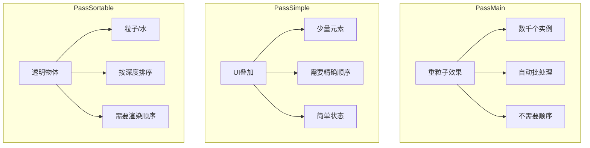
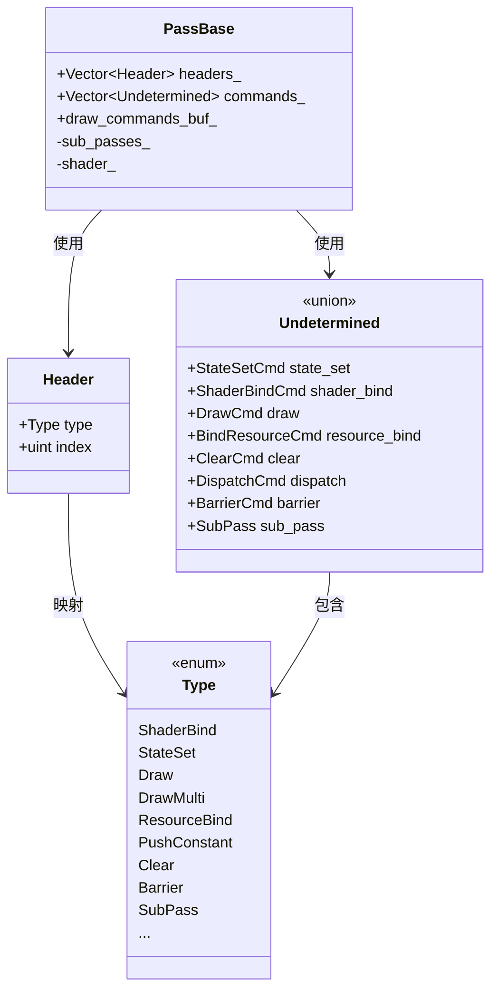
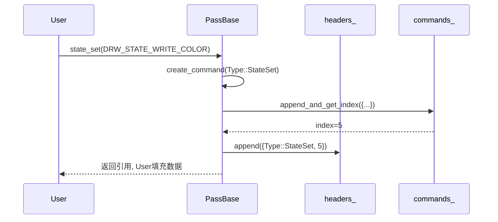
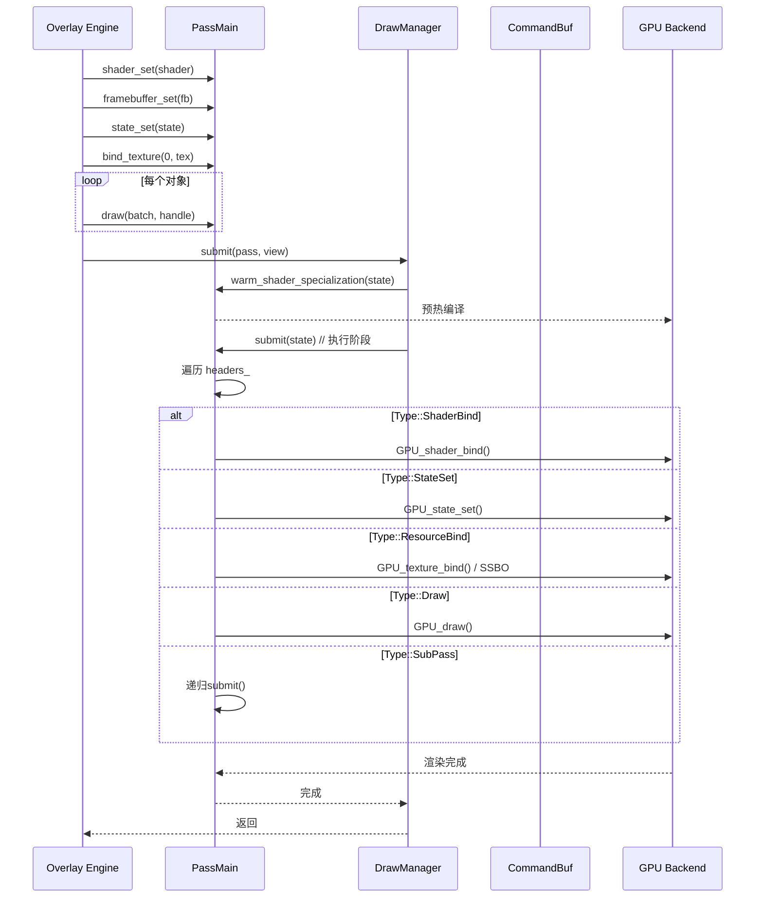
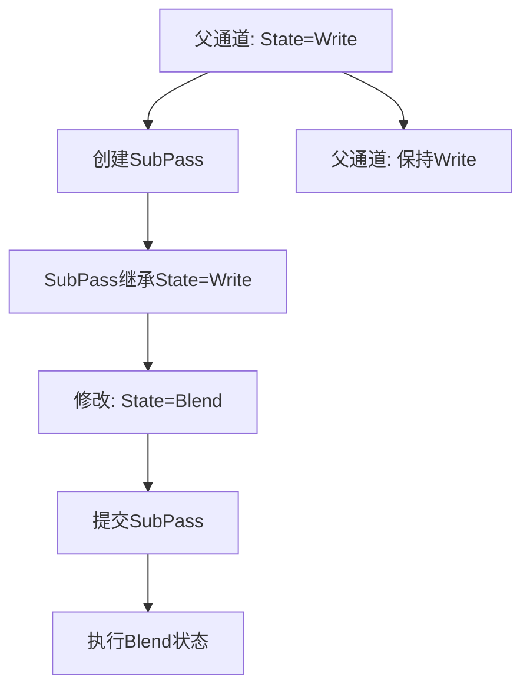

# 11. draw_pass.hh 详解 - 命令录制与执行系统

> **文件路径**: `source/blender/draw/intern/draw_pass.hh`  \n> **总行数**: 1640+ 行  \n> **创建日期**: 2025-12-18

---

## 目录
1. [概述与核心概念](#1-概述与核心概念)
2. [Pass类型系统](#2-pass类型系统)
3. [PassBase模板类详解](#3-passbase模板类详解)
4. [命令录制机制](#4-命令录制机制)
5. [绘制调用API](#5-绘制调用API)
6. [资源绑定系统](#6-资源绑定系统)
7. [提交与执行流程](#7-提交与执行流程)
8. [SubPass子通道系统](#8-subpass子通道系统)
9. [实战示例分析](#9-实战示例分析)

---

## 1. 概述与核心概念

### 1.1 Pass系统的作用

**问题**: GPU渲染需要大量状态设置，如：
- 绑定Shader
- 设置渲染状态 (深度测试、混合等)
- 绑定纹理/缓冲区
- 发送绘制命令

**解决方案**: Pass系统提供**延迟执行**机制：
1. **录制阶段**: 记录所有命令到Command Buffer
2. **提交阶段**: 按顺序/优化后执行命令
3. **优势**:
   - 批量优化 (合并相同状态切换)
   - 状态验证
   - 可序列化调试

### 1.2 核心术语

| 术语 | 全称 | 解释 |
|------|------|------|
| **Pass** | Draw Pass | 命令容器，记录一组绘制指令 |
| **SubPass** | Sub-Pass | Pass内部的嵌套通道，用于组织命令 |
| **Header** | Command Header | 指向具体命令的索引和类型 |
| **Command** | GPU Command | 实际的GPU操作 (绑定、绘制) |
| **Batch** | GPU Batch | 顶点/索引数据的封装 |
| **Submit** | Submission | 执行Pass中记录的所有命令 |

### 1.3 执行流程图

```mermaid
flowchart TD
    A[创建 Pass] --> B[设置状态]
    B --> C[绑定资源]
    C --> D[录制 draw() 命令]
    D --> E{更多对象?}
    E -->|是| C
    E -->|否| F[Pass.init() 重用或结束]
    F --> G[Manager 统一提交]
    G --> H[generate_commands()]
    H --> I[扩展为GPU命令]
    I --> J[execute() 实际执行]
    J --> K[GPU渲染完成]
```

---

## 2. Pass类型系统

### 2.1 三种核心Pass类型

根据文件头部注释 (lines 5-41):

```cpp
/* 三种Pass类型 */

/**
 * PassMain - 优化大量绘制调用和子通道的主通通
 * 用途: 渲染大量对象 (实例化渲染)
 * 特性: 自动批处理 + 可视性优化
 */
PassMain;

/**
 * PassSimple - 简单无优化Pass
 * 用途: 少量命令，需要严格顺序
 * 特性: 零开销，无批处理，顺序保证
 */
PassSimple;  // 基于 Pass<DrawCommandBuf>

/**
 * PassSortable - 带排序功能的透明物体Pass
 * 用途: 需要深度排序的透明物体
 * 特性: 子通道按排序值自动排序
 */
PassSortable; // 继承 PassMain，添加排序
```

### 2.2 使用场景对比



### 2.3 类型别名定义

**重要**: 由于C++模板实现，实际类型别名在文件末尾定义：

```cpp
// 分别在 1642 行之前被定义
namespace blender::draw {
    // PassSimple 使用 DrawCommandBuf (简单命令缓冲)
    using PassSimple = detail::Pass<DrawCommandBuf>;

    // PassMain 使用 DrawMultiBuf (多命令缓冲 + 批处理)
    using PassMain = detail::Pass<DrawMultiBuf>;
}
```

---

## 3. PassBase模板类详解

### 3.1 核心成员变量

**位置**: `draw_pass.hh:135-153`

```cpp
template<typename DrawCommandBufType>
class PassBase {
 protected:
  // ===== 命令存储 =====
  Vector<command::Header, 0> headers_;      // 头部索引 [类型, 数据索引]
  Vector<command::Undetermined, 0> commands_; // 实际命令数据

  // ===== 缓冲区引用 =====
  DrawCommandBufType &draw_commands_buf_;   // 绘制命令缓冲
  SubPassVector<PassBase> &sub_passes_;     // 子通道容器

  // ===== 状态追踪 =====
  gpu::Shader *shader_;                     // 当前绑定的Shader
  uint64_t manager_fingerprint_ = 0;        // Manager状态指纹
  uint64_t view_fingerprint_ = 0;           // View状态指纹
  bool is_empty_ = true;                    // 空Pass优化

 public:
  const char *debug_name;                   // 调试名称
  bool use_custom_ids;                      // 自定义ID标记
};
```

### 3.2 命令头与数据分离设计



**为什么分离?**

| 设计原因 | 详细说明 |
|---------|---------|
| **内存效率** | Header只需4字节(类型+索引)，命令数据按需分配 |
| **类型安全** | Header确定类型，通过Union访问对应命令结构 |
| **快速遍历** | 按需处理特定类型命令，跳过无关命令 |
| **序列化友好** | Header数组可序列化，命令数据可二进制dump |

### 3.3 构造与初始化

```cpp
// 位置: draw_pass.hh:157-165
PassBase(const char *name,
         DrawCommandBufType &draw_command_buf,
         SubPassVector<PassBase<DrawCommandBufType>> &sub_passes,
         gpu::Shader *shader = nullptr)
    : draw_commands_buf_(draw_command_buf),
      sub_passes_(sub_passes),
      shader_(shader),
      debug_name(name),
      use_custom_ids(false) {};

// 位置: draw_pass.hh:511-520 (Pass特化)
void init()
{
  this->manager_fingerprint_ = 0;
  this->view_fingerprint_ = 0;
  this->headers_.clear();
  this->commands_.clear();
  this->sub_passes_.clear();
  this->draw_commands_buf_.clear();
  this->is_empty_ = true;
}
```

### 3.4 空Pass检查

```cpp
// 位置: draw_pass.hh:616-632
bool is_empty() const
{
  if (!is_empty_) {
    return false;
  } // 快速路径

  // 检查所有子通道是否都为空
  for (const command::Header &header : headers_) {
    if (header.type != Type::SubPass) {
      continue;
    }
    if (!sub_passes_[header.index].is_empty()) {
      return false;
    }
  }
  return true;
}
```

---

## 4. 命令录制机制

### 4.1 create_command 工厂方法

**位置**: `draw_pass.hh:634-655`

```cpp
template<typename T>
command::Undetermined &PassBase<T>::create_command(command::Type type)
{
  /* 断言：在提交后不能修改Pass */
  BLI_assert_msg(this->has_generated_commands() == false,
                 "Command added after submission");

  /* 在命令容器中创建新条目 */
  int64_t index = commands_.append_and_get_index({});
  headers_.append({type, uint(index)});

  /* 标记Pass非空用于统计 */
  if (ELEM(type, Type::Barrier, Type::Clear, Type::ClearMulti,
           Type::Dispatch, Type::Draw, Type::DrawIndirect)) {
    is_empty_ = false;
  }

  return commands_[index]; // 返回引用，供后续填充
}
```

**工作流程**:



### 4.2 状态设置命令

```cpp
// 位置: draw_pass.hh:1089-1098
void state_set(DRWState state, int clip_plane_count = 0)
{
  if (clip_plane_count > 0) {
    state |= DRW_STATE_CLIP_PLANES;
  }
  state |= DRW_STATE_PROGRAM_POINT_SIZE;

  create_command(Type::StateSet).state_set = {state, clip_plane_count};
}
```

**DRWState 常见值** (来自 draw_state.hh):
```cpp
DRW_STATE_WRITE_COLOR      // 写入颜色
DRW_STATE_DEPTH_LESS       // 深度测试 <
DRW_STATE_DEPTH_EQUAL      // 深度测试 =
DRW_STATE_CULL_BACK        // 背面剔除
DRW_STATE_BLEND            // 混合启用
DRW_STATE_ALPHA_TO_COVERAGE // Alpha to Coverage
DRW_STATE_STENCIL          // 模板测试
```

### 4.3 Shader绑定

```cpp
// 位置: draw_pass.hh:1106-1110
void shader_set(gpu::Shader *shader)
{
  shader_ = shader;
  create_command(Type::ShaderBind).shader_bind = {shader};
}
```

### 4.4 Framebuffer绑定

```cpp
// 位置: draw_pass.hh:1112-1115
void framebuffer_set(gpu::FrameBuffer **framebuffer)
{
  /* 注意: 传递指针的指针，支持延迟绑定 */
  create_command(Type::FramebufferBind).framebuffer_bind = {framebuffer};
}
```

### 4.5 裁剪平面过渡

```cpp
// 位置: draw_pass.hh:1117-1134
void subpass_transition(GPUAttachmentState depth_attachment,
                        Span<GPUAttachmentState> color_attachments)
{
  uint8_t color_states[8] = {GPU_ATTACHMENT_IGNORE};
  for (auto i : color_attachments.index_range()) {
    color_states[i] = uint8_t(color_attachments[i]);
  }

  create_command(Type::SubPassTransition).subpass_transition = {
      uint8_t(depth_attachment),
      {color_states[0], color_states[1], color_states[2], color_states[3],
       color_states[4], color_states[5], color_states[6], color_states[7]}
  };
}
```

---

## 5. 绘制调用API

### 5.1 标准绘制调用

**位置**: `draw_pass.hh:892-916`

```cpp
template<class T>
void PassBase<T>::draw(gpu::Batch *batch,
                       uint instance_len = -1,
                       uint vertex_len = -1,
                       uint vertex_first = -1,
                       ResourceIndexRange res_index = {},
                       uint custom_id = 0)
{
  if (instance_len == 0 || vertex_len == 0) {
    return; // 空绘制优化掉
  }

  BLI_assert(batch);
  BLI_assert(shader_); // 必须绑定Shader

  draw_commands_buf_.append_draw(headers_,
                                 commands_,
                                 batch,
                                 instance_len,
                                 vertex_len,
                                 vertex_first,
                                 res_index,
                                 custom_id,
                                 GPU_PRIM_NONE,
                                 0);
  is_empty_ = false;
}
```

### 5.2 批处理与资源索引

**关键概念**: `ResourceIndexRange`

```cpp
struct ResourceIndexRange {
  ResourceIndex start;      // 资源起始索引
  ResourceIndex end;        // 资源结束索引

  bool is_valid() const {
    return start != end;
  }
};
```

**用途**: 在Manager的批次系统中将多个绘制调用合并为一次GPU调用

### 5.3 扩展绘制调用 (几何体扩张)

**位置**: `draw_pass.hh:924-949`

```cpp
void draw_expand(gpu::Batch *batch,
                 GPUPrimType primitive_type,  // 新图元类型
                 uint primitive_len,           // 每个实例的图元数
                 uint instance_len,            // 实例数
                 uint vertex_len,              // 顶点数
                 uint vertex_first,            // 起始顶点
                 ResourceIndexRange res_index,
                 uint custom_id)
```

**使用场景**: 几何着色器或顶点着色器中生成额外几何体

示例: 用点生成四边形
```cpp
// 每个点发射4个顶点形成四边形
pass.draw_expand(batch,
                 GPU_PRIM_TRIS,    // 输出三角形
                 2,                // 每个点产生2个三角形(4个顶点)
                 instance_count,   // 点数量
                 1,                // 每个点输入1个顶点
                 0);
```

### 5.4 间接绘制

```cpp
// 位置: draw_pass.hh:985-992
void draw_indirect(gpu::Batch *batch,
                   StorageBuffer<DrawCommand, true> &indirect_buffer,
                   ResourceIndex res_index)
{
  BLI_assert(shader_);
  create_command(Type::DrawIndirect).draw_indirect = {batch, &indirect_buffer, res_index};
}
```

**间接绘制优势**: GPU端生成绘制参数，无需CPU介入

### 5.5 计算调度

**位置**: `draw_pass.hh:1009-1038`

```cpp
void dispatch(int group_len);
void dispatch(int2 group_len);
void dispatch(int3 group_len);
void dispatch(int3 *group_len);

// 示例
pass.dispatch(int3(64, 32, 1));  // 64x32x1工作组
```

---

## 6. 资源绑定系统

### 6.1 绑定方法谱系

Pass提供大量绑定方法，支持**名称绑定**和**槽位绑定**两种模式：

```mermaid
mindmap
  root((绑定API))
    ::icon(fa fa-plug)
    SSBO绑定
      ::icon(fa fa-database)
      名称绑定
        bind_ssbo("name", buffer)
      槽位绑定
        bind_ssbo(slot, buffer)
      指针绑定
        bind_ssbo(slot, &buffer)
    UBO绑定
      ::icon(fa fa-cube)
      绑定到uniform buffer
    纹理绑定
      ::icon(fa fa-image)
      采样器
        bind_texture(slot, tex)
      图像加载
        bind_image(slot, tex)
    常量绑定
      ::icon(fa fa-constant)
      推送常量
        push_constant(name, value)
      特化常量
        specialize_constant(shader, name, value)
```

### 6.2 SSBO绑定示例

**位置**: `draw_pass.hh:1205-1416`

```cpp
// 名称绑定 (自动查询槽位)
void bind_ssbo(const char *name, gpu::StorageBuf *buffer) {
  BLI_assert(buffer != nullptr);
  this->bind_ssbo(GPU_shader_get_ssbo_binding(shader_, name), buffer);
}

// 槽位绑定 (直接指定)
void bind_ssbo(int slot, gpu::StorageBuf *buffer) {
  BLI_assert(buffer != nullptr);
  create_command(Type::ResourceBind).resource_bind = {slot, buffer};
}

// 指针版本 (延迟用于GPU资源变化)
void bind_ssbo(int slot, gpu::StorageBuf **buffer) {
  BLI_assert(buffer != nullptr);
  create_command(Type::ResourceBind).resource_bind = {slot, buffer};
}
```

### 6.3 绑定阶段实际执行

**绑定命令执行**: 在 `execute()` 阶段

```cpp
// 来自 draw_command.hh (简化)
struct ResourceBindCmd {
  int slot;
  union {
    gpu::StorageBuf *ssbo;
    gpu::UniformBuf *ubo;
    gpu::Texture *tex;
    gpu::Texture **tex_ptr; // 延迟版本
  };

  void execute() const {
    // 根据类型调用GPU API
    switch (type) {
      case SSBO:
        GPU_storagebuf_bind(ssbo, slot);
        break;
      case UBO:
        GPU_uniformbuf_bind(ubo, slot);
        break;
      case TEXTURE:
        // 处理指针延迟
        gpu::Texture *actual_tex = tex_ptr ? *tex_ptr : tex;
        GPU_texture_bind(actual_tex, slot);
        break;
    }
  }
}
```

### 6.4 推送常量 (Push Constant)

**用途**: 小型数据直接传给Shader，无需buffer

**位置**: `draw_pass.hh:1440-1558`

支持的类型:
```cpp
void push_constant(const char *name, const float &data);
void push_constant(const char *name, const float2 &data);
void push_constant(const char *name, const float3 &data);
void push_constant(const char *name, const float4 &data);
void push_constant(const char *name, const float4x4 &data);  // 16字节特殊处理
void push_constant(const char *name, const int &data);
// ... 更多类型
```

**特殊处理**: float4x4 (64字节)

```cpp
// 位置: draw_pass.hh:1541-1558
void push_constant(const char *name, const float4x4 &data)
{
  /* 64字节需要3个命令槽位 */
  Undetermined commands[3];

  cmd.location = push_constant_offset(name);
  cmd.array_len = 1;
  cmd.comp_len = 16;
  cmd.type = PushConstant::Type::FloatValue;

  /* 内存覆盖 trick */
  *reinterpret_cast<float4x4 *>(&cmd.float4_value) = data;

  /* 写入3个槽位，后两个设为None */
  create_command(Type::PushConstant) = commands[0];
  create_command(Type::None) = commands[1];
  create_command(Type::None) = commands[2];
}
```

### 6.5 特化常量 (Specialization Constant)

**用途**: 编译期常量，编译前设置 (用于shader变体)

```cpp
void specialize_constant(gpu::Shader *shader,
                         const char *constant_name,
                         const int &constant_value);

void specialize_constant(gpu::Shader *shader,
                         const char *constant_name,
                         const bool &constant_value);
```

**示例**:
```cpp
// 根据是否使用裁剪平面启用不同路径
pass.shader_set(shader);
pass.specialize_constant(shader, "USE_CLIPPING", state.clipping_enabled);
```

---

## 7. 提交与执行流程

### 7.1 工作流程图



### 7.2 warm_shader_specialization

**位置**: `draw_pass.hh:699-751`

预编译所有shader变体，避免首次使用时卡顿:

```cpp
void warm_shader_specialization(command::RecordingState &state) const
{
  GPU_debug_group_begin("warm_shader_specialization");
  GPU_debug_group_begin(this->debug_name);

  for (const command::Header &header : headers_) {
    switch (header.type) {
      case Type::ShaderBind:
        // 触发异步编译
        commands_[header.index].shader_bind.execute(state);
        break;
      case Type::SpecializeConstant:
        // 触发特化
        commands_[header.index].specialize_constant.execute(state);
        break;
      case Type::SubPass:
        // 递归预热
        sub_passes_[header.index].warm_shader_specialization(state);
        break;
      // ... 其他类型忽略
    }
  }

  GPU_debug_group_end();
  GPU_debug_group_end();
}
```

### 7.3 submit - 实际执行

**位置**: `draw_pass.hh:753-821`

```cpp
void submit(command::RecordingState &state) const
{
  if (headers_.is_empty()) {
    return; // 空Pass跳过
  }

  GPU_debug_group_begin(debug_name);

  for (const command::Header &header : headers_) {
    switch (header.type) {
      // 执行所有记录的命令
      case Type::ShaderBind:
        commands_[header.index].shader_bind.execute(state);
        break;
      case Type::FramebufferBind:
        commands_[header.index].framebuffer_bind.execute();
        break;
      case Type::StateSet:
        commands_[header.index].state_set.execute(state);
        break;
      case Type::ResourceBind:
        commands_[header.index].resource_bind.execute();
        break;
      case Type::Draw:
        commands_[header.index].draw.execute(state);
        break;
      case Type::DrawMulti:
        commands_[header.index].draw_multi.execute(state);
        break;
      case Type::Clear:
        commands_[header.index].clear.execute();
        break;
      case Type::Barrier:
        commands_[header.index].barrier.execute();
        break;

      // 递归处理子通道
      case Type::SubPass:
        sub_passes_[header.index].submit(state);
        break;

      case Type::None:
        // 用于填充，忽略
        break;
      default:
        BLI_assert_unreachable();
    }
  }

  GPU_debug_group_end();
}
```

### 7.4 命令序列化

**位置**: `draw_pass.hh:823-884`

```cpp
std::string serialize(std::string line_prefix = "") const
{
  std::stringstream ss;
  ss << line_prefix << "." << debug_name << std::endl;
  line_prefix += "  ";

  for (const command::Header &header : headers_) {
    switch (header.type) {
      case Type::SubPass:
        ss << sub_passes_[header.index].serialize(line_prefix);
        break;
      case Type::ShaderBind:
        ss << line_prefix << "shader_bind: "
           << commands_[header.index].shader_bind.serialize() << std::endl;
        break;
      case Type::Draw:
        ss << line_prefix << commands_[header.index].draw.serialize() << std::endl;
        break;
      // ... 其他命令
    }
  }
  return ss.str();
}
```

**使用示例**:
```cpp
PassMain pass("MyPass");
// ... 录制命令 ...
std::string debug = pass.serialize();
printf("%s\n", debug.c_str());
```

输出:
```
.MyPass
  .state_set: DRW_STATE_WRITE_COLOR | DRW_STATE_DEPTH_LESS
  .shader_bind: overlay_mesh_shader
  .framebuffer_bind: overlay_fb
  .draw: batch(0x1234) instance=100
```

---

## 8. SubPass子通道系统

### 8.1 SubPass设计概念

**位置**: `draw_pass.hh:180-182`

```cpp
PassBase<DrawCommandBufType> &sub(const char *name);
```

**作用**:
- 组织命令逻辑分组
- 继承父通道状态
- 独立状态继承层次

### 8.2 创建SubPass

```cpp
// 位置: draw_pass.hh:690-696
template<class T>
PassBase<T> &PassBase<T>::sub(const char *name)
{
  int64_t index = sub_passes_.append_and_get_index(
      PassBase(name, draw_commands_buf_, sub_passes_, shader_));
  headers_.append({command::Type::SubPass, uint(index)});
  return sub_passes_[index];
}
```

**使用示例**:
```cpp
PassMain pass("Main");

// 透明物体
pass.sub("Transparent").shader_set(transparent_shader);
pass.sub("Transparent").state_set(DRW_STATE_BLEND);

// 不透明物体
pass.sub("Opaque").shader_set(opaque_shader);
pass.sub("Opaque").state_set(DRW_STATE_WRITE_COLOR);

// SubPass自动嵌套
```

### 8.3 状态继承与重写

**规则**:
1. **SubPass继承**创建时的父通道状态
2. **独立修改**不会影响父通道
3. **最终提交**时递归执行

**状态流**:


---

## 9. 实战示例分析

### 9.1 Overlay网格编辑器中的应用

```cpp
void MeshOverlay::draw(Manager &manager, View &view)
{
  PassMain pass("MeshEdit");

  // 1. 设置通用状态
  pass.shader_set(res.shaders->mesh_edit_vert);
  pass.framebuffer_set(&res.overlay_fb);
  pass.state_set(DRW_STATE_WRITE_COLOR);

  // 2. 绑定全局资源
  pass.bind_ubo(MATRIX_SLOT, &view.matrices);
  pass.bind_ubo(THEME_SLOT, res.globals_buf);

  // 3. 按材质分组绘制 (批量优化)
  for (Material *mat : materials) {
    pass.sub(mat->name).bind_texture(0, res.get_material_tex(mat));

    for (Mesh *mesh : mat_meshes[mat]) {
      // 对象批次绑定
      ResourceHandleRange handle = manager.resource_handle(mesh);
      pass.sub(mat->name).draw(mesh->batch, handle);
    }
  }

  // 4. 提交
  manager.submit(pass, view);
}
```

### 9.2 对比: 无Pass vs 有Pass

**无Pass系统**:
```cpp
// 传统直接渲染 - 每帧重复绑定
void render() {
  for (Object *ob : objects) {
    GPU_shader_bind(ob->shader);
    GPU_framebuffer_bind(ob->fb);
    GPU_state_set(ob->state);
    GPU_texture_bind(ob->tex, 0);
    GPU_batch_draw(ob->batch);
    // ... 状态切换 N次
  }
}
// 缺点: 状态切换开销 = 对象数量 × 命令数量
```

**使用Pass系统**:
```cpp
// Pass系统 - 自动优化
void render() {
  PassMain pass("");
  pass.shader_set(common_shader);  // 1次绑定
  pass.framebuffer_set(common_fb); // 1次绑定

  for (Object *ob : objects) {
    pass.draw(ob->batch, ob->handle);
    // 仅记录命令，不切换GPU状态
  }

  // Manager自动批处理相同状态
  manager.submit(pass);
}
// 优势: 状态切换优化为常数
```

### 9.3 错误处理与调试

**常见错误**:

| 错误 | 原因 | 解决 |
|------|------|------|
| `shader_ is null` | 尝试draw但未绑定shader | 先调用 `shader_set()` |
| `Command added after submission` | submit后修改Pass | 调用 `init()` 重置或新建Pass |
| `Invalid framebuffer binding` | fb未配置就绑定 | 使用 `ensure()` 配置Framebuffer |
| `Batch is null` | draw传入空batch | 确保GPU Batch已创建 |

**调试技巧**:

```cpp
// 1. 序列化检查
CLOG_INFO(GPU_LOG, "%s", pass.serialize().c_str());

// 2. 空Pass检查
if (pass.is_empty()) {
  CLOG_WARN(GPU_LOG, "Pass %s is empty!", pass.debug_name);
}

// 3. 检查命令数量
size_t cmd_count = pass.headers_.size();
CLOG_INFO(GPU_LOG, "Pass %s has %zu commands", pass.debug_name, cmd_count);

// 4. 性能分析 (需要编译时启用)
GPU_debug_group_begin("My Pass");
manager.submit(pass, view);
GPU_debug_group_end();
```

---

## 总结

Pass系统是Blender Draw Manager的**核心技术**,提供了:

1. **命令延迟执行**: 分离录制与执行阶段
2. **自动批处理**: 通过ResourceIndexRange合并相似命令
3. **状态管理**: 精确追踪GPU状态变化
4. **资源绑定**: 统一接口处理纹理/缓冲区/常量
5. **调试支持**: 序列化与可视化工具
6. **多Pass类型**: 针对不同场景优化 (Main/Simple/Sortable)

在Overlay引擎中，所有30+模块都通过Pass系统与GPU通信，**模块只需关心"绘制什么"，不用关心"如何绘制"**，Pass系统负责所有底层状态管理和优化。

