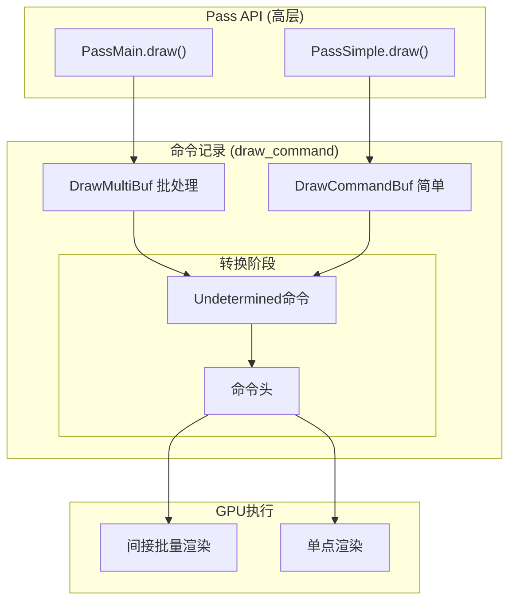
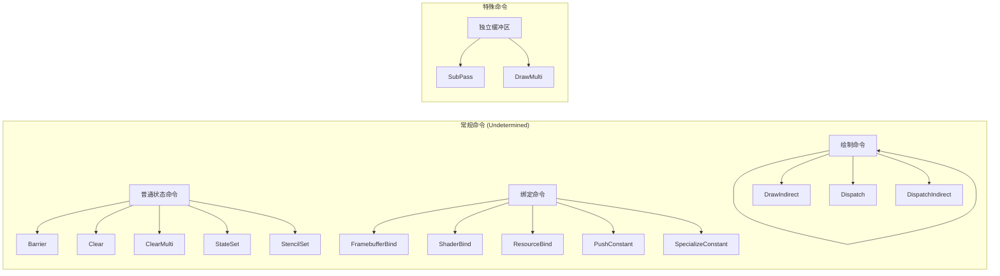
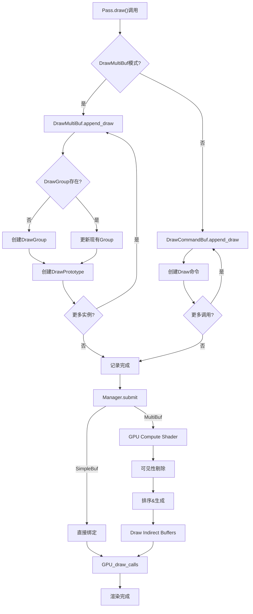

# 12. draw_command.hh 详解 - GPU命令与缓冲管理

> **文件路径**: `source/blender/draw/intern/draw_command.hh`  \n> **总行数**: 760行  \n> **创建日期**: 2025-12-18

---

## 目录
1. [概述与设计哲学](#1-概述与设计哲学)
2. [命令类型枚举](#2-命令类型枚举)
3. [RecordingState 结构体](#3-recordingstate-结构体)
4. [命令数据结构详解](#4-命令数据结构详解)
5. [DrawCommandBuf - 简单绘制](#5-drawcommandbuf---简单绘制)
6. [DrawMultiBuf - 多实例批处理](#6-drawmultibuf---多实例批处理)
7. [执行流程](#7-执行流程)

---

## 1. 概述与设计哲学

### 1.1 核心概念

`draw_command.hh` 定义了Draw Manager的**命令存储机制**，它实现了从高层Pass API到底层GPU命令的转换层。



### 1.2 为什么需要两种缓冲模式?

| DrawCommandBuf | DrawMultiBuf |
|----------------|--------------|
| ✅ 简单直观，顺序执行 | ✅ 自动批处理，减少DrawCall |
| ✅ 适合少量对象 | ✅ 适合大量对象 (1000+) |
| ✅ 可控性强 | ✅ GPU端剔除和排序 |
| ❌ 性能较差 | ❌ 复杂性更高 |

**选择策略**:
- **对象 < 100**: 使用 DrawCommandBuf
- **对象 >= 100**: 使用 DrawMultiBuf
- **Overlay**: 主要用 DrawMultiBuf (场景通常有很多物体)

---

## 2. 命令类型枚举

### 2.1 完整命令列表

**位置**: `draw_command.hh:96-123`

```cpp
enum class Type : uint8_t {
  /* 空命令/数据填充 */
  None = 0,

  /* 常规命令 (存储在Undetermined数组中) */
  Barrier,              // 同步屏障
  Clear,                // 清空帧缓冲
  ClearMulti,           // 多目标清空
  Dispatch,             // 计算调度
  DispatchIndirect,     // 间接计算
  Draw,                 // 简单绘制
  DrawIndirect,         // 间接绘制
  FramebufferBind,      // FB绑定
  PushConstant,         // 推送常量
  SpecializeConstant,   // 特化常量
  ResourceBind,         // 资源绑定 (纹理/缓冲区)
  ShaderBind,           // Shader绑定
  SubPassTransition,    // 子通道过渡
  StateSet,             // 渲染状态
  StencilSet,           // 模板状态

  /* 特殊命令 (存储在单独缓冲区中) */
  SubPass,              // 子通道
  DrawMulti,            // 批处理绘制
};
```

### 2.2 命令分类图



---

## 3. RecordingState 结构体

### 3.1 核心作用

**位置**: `draw_command.hh:46-88`

`RecordingState` 是**命令执行时的上下文状态**，用于：
- 跟踪GPU状态变化，避免冗余调用
- 管理特化常量
- 维护实例偏移
- 调试和清理

### 3.2 成员变量解析

```cpp
struct RecordingState {
  /* 1. 特化常量管理 (Shader变体) */
  gpu::shader::SpecializationConstants specialization_constants;
  bool specialization_constants_in_use = false;  // 有特化常量待设置
  bool shader_use_specialization = false;        // 当前Shader是否使用特化

  /* 2. 当前绑定状态 */
  gpu::Shader *shader = nullptr;                 // 当前Shader
  bool front_facing = true;                      // 正面朝向
  bool inverted_view = false;                    // 视图反转状态

  /* 3. 渲染管道状态 */
  DRWState pipeline_state = DRW_STATE_NO_DRAW;   // DRW状态位
  int clip_plane_count = 0;                      // 裁剪平面数量

  /* 4. 资源索引偏移 (PassSimple模式) */
  int instance_offset = 1;                       // 实例ID起始于1 (0保留给身份)
};
```

### 3.3 状态管理方法

#### 3.3.1 正面朝向设置

**位置**: `draw_command.hh:60-68`

```cpp
void front_facing_set(bool facing)
{
  /* 如果视图是左手系 (左手->右手)，需要反转 */
  facing = this->inverted_view == facing;

  /* 避免冗余调用 */
  if (assign_if_different(this->front_facing, facing)) {
    GPU_front_facing(!facing);
  }
}
```

**为什么要处理**:
- Blender使用右手坐标系
- 某些视图变换会反转坐标系
- GPU需要正确的正面/背面判断

#### 3.3.2 清理函数

**位置**: `draw_command.hh:70-82`

```cpp
void cleanup()
{
  if (front_facing == false) {
    GPU_front_facing(false);  // 恢复默认
  }

  if (G.debug & G_DEBUG_GPU) {
    /* 调试模式：解绑所有资源，便于检测错误 */
    GPU_storagebuf_debug_unbind_all();
    GPU_texture_image_unbind_all();
    GPU_texture_unbind_all();
    GPU_uniformbuf_debug_unbind_all();
  }
}
```

### 3.4 特化常量工作流程

```mermaid
sequenceDiagram
    participant Pass
    participant RecordingState
    participant GPU

    Pass->>RecordingState: specialize_constant("USE_ALPHA", true)
    RecordingState->>RecordingState: specialization_constants["USE_ALPHA"]=true
    RecordingState->>RecordingState: specialization_constants_in_use=true

    Pass->>RecordingState: shader_set(shader)
    RecordingState->>RecordingState: shader=shader

    Pass->>RecordingState: draw(batch)
    Note between RecordingState and GPU: Submit时检查

    RecordingState->>GPU: GPU_specialize_constants()
    GPU->>GPU: 编译特化Shader变体

    RecordingState->>GPU: GPU_shader_bind()
    RecordingState->>GPU: GPU_bind_resources()
    GPU->>GPU: 执行绘制
```

---

## 4. 命令数据结构详解

### 4.1 Header - 命令头

**位置**: `draw_command.hh:130-135`

```cpp
struct Header {
  Type type;    // 命令类型 (1字节)
  uint index;   // 在对应缓冲区中的索引 (4字节)
};
```

**体积**: 5字节 (需要填充到8字节)

**为什么Header和数据分离**:
1. **快速遍历**: 只读Header即可判断类型，跳过不关心的命令
2. **缓存友好**: Header数组连续，索引访问快
3. **内存紧凑**: 不同命令大小不同，分离存储避免浪费

### 4.2 Undetermined - 统一命令容器

**位置**: `draw_command.hh:490-507`

```cpp
union Undetermined {
  /* 所有可能的命令类型 */
  ShaderBind shader_bind;
  ResourceBind resource_bind;
  FramebufferBind framebuffer_bind;
  SubPassTransition subpass_transition;
  PushConstant push_constant;
  SpecializeConstant specialize_constant;
  Draw draw;
  DrawMulti draw_multi;
  DrawIndirect draw_indirect;
  Dispatch dispatch;
  DispatchIndirect dispatch_indirect;
  Barrier barrier;
  Clear clear;
  ClearMulti clear_multi;
  StateSet state_set;
  StencilSet stencil_set;
};
```

**静态断言保证**: `sizeof(Undetermined) <= 24` 字节

### 4.3 ResourceBind - 资源绑定

**位置**: `draw_command.hh:161-230`

这是最复杂的命令，支持多种资源类型:

```cpp
struct ResourceBind {
  GPUSamplerState sampler;  // 采样器状态
  int slot;                 // 绑定槽位
  bool is_reference;        // 是否为引用(延迟绑定)

  enum Type : uint8_t {
    Sampler,                // 纹理采样器
    BufferSampler,          // 缓冲区采样
    Image,                  // 图像加载
    UniformBuf,             // UBO
    StorageBuf,             // SSBO
    VertexAsStorageBuf,     // 顶点缓冲作为SSBO
    IndexAsStorageBuf,      // 索引缓冲作为SSBO
  } type;

  union {
    gpu::UniformBuf *uniform_buf;
    gpu::UniformBuf **uniform_buf_ref;  // 二级指针用于延迟
    gpu::StorageBuf *storage_buf;
    gpu::StorageBuf **storage_buf_ref;
    gpu::Texture *texture;
    gpu::Texture **texture_ref;
    gpu::VertBuf *vertex_buf;
    gpu::VertBuf **vertex_buf_ref;
    gpu::IndexBuf *index_buf;
    gpu::IndexBuf **index_buf_ref;
  };
};
```

**支持的构造函数**:
```cpp
// 直接绑定
ResourceBind(int slot, gpu::UniformBuf *res);  // UBO
ResourceBind(int slot, gpu::Texture *tex, GPUSamplerState state);  // 纹理

// 延迟绑定 (资源指针可能改变)
ResourceBind(int slot, gpu::Texture **tex_ref, GPUSamplerState state);

// 特殊用途: 将顶点/索引作为SSBO使用
ResourceBind(int slot, gpu::VertBuf *res, Type::VertexAsStorageBuf);
```

### 4.4 PushConstant - 推送常量

**位置**: `draw_command.hh:232-311`

支持直接值和引用，支持浮点和整数数组:

```cpp
struct PushConstant {
  int location;           // Shader中的位置
  uint8_t array_len;      // 数组长度
  uint8_t comp_len;       // 分量数量 (1-4 或 16 for mat4)

  enum class Type : uint8_t {
    IntValue, FloatValue, IntReference, FloatReference
  } type;

  union {
    int int1_value;
    int2 int2_value;
    int3 int3_value;
    int4 int4_value;
    float float1_value;
    float2 float2_value;
    float3 float3_value;
    float4 float4_value;
    const int *int_ref;
    const float *float_ref;
    const float4x4 *float4x4_ref;  // 引用矩阵
  };
};
```

**特殊 hack**: 用于 float4x4 (64字节) 存储，实际会占用3个命令槽位

### 4.5 Draw - 绘制命令

**位置**: `draw_command.hh:364-400`

```cpp
struct Draw {
  gpu::Batch *batch;               // 顶点/索引数据
  uint16_t instance_len;           // 实例数量
  uint8_t expand_prim_type;        // 几何扩张类型
  uint8_t expand_prim_len;         // 扩张后图元数量
  uint32_t vertex_first;           // 起始顶点
  uint32_t vertex_len;             // 顶点数量
  ResourceIndex res_index;         // 资源索引

  bool is_primitive_expansion() const {
    return expand_prim_type != GPU_PRIM_NONE;
  }
};
```

**几何扩张 (Primitive Expansion)**:
```cpp
// 普通绘制
Draw(batch, 1, 3, 0, GPU_PRIM_NONE, 0, handle);

// 扩张绘制: 每个点变成4个顶点 (四边形)
Draw(batch, 100, 1, 0, GPU_PRIM_TRIS, 2, handle);
```

---

## 5. DrawCommandBuf - 简单绘制缓冲

### 5.1 设计目的

**位置**: `draw_command.hh:525-587`

用于**少对象**场景，每个`draw()`调用生成一个独立的绘制命令。

```cpp
class DrawCommandBuf {
 private:
  using ResourceIdBuf = StorageArrayBuffer<uint, 128, false>;

  /* 资源ID缓冲 - 每实例一个ID */
  ResourceIdBuf resource_id_buf_;
  uint resource_id_count_ = 0;

 public:
  void clear();  // 清空但保留容量

  void append_draw(/* 参数 */);
  void generate_commands(/* 其他参数 */);
  void bind(RecordingState &state);
};
```

### 5.2 append_draw 实现

**位置**: `draw_command.hh:543-572`

```cpp
void append_draw(Vector<Header, 0> &headers,
                 Vector<Undetermined, 0> &commands,
                 gpu::Batch *batch,
                 uint instance_len,
                 uint vertex_len,
                 uint vertex_first,
                 ResourceIndexRange index_range,
                 uint custom_id,
                 GPUPrimType expanded_prim_type,
                 uint16_t expanded_prim_len)
{
  /* 处理默认值 */
  vertex_first = vertex_first != -1 ? vertex_first : 0;
  instance_len = instance_len != -1 ? instance_len : 1;

  /* Custom ID 在简单模式下不支持 */
  BLI_assert_msg(custom_id == 0, "Custom ID is not supported in PassSimple");

  /* 遍历资源索引范围 */
  for (auto res_index : index_range.index_range()) {
    /* 创建命令 */
    int64_t index = commands.append_and_get_index({});
    headers.append({Type::Draw, uint(index)});

    /* 填充命令 */
    commands[index].draw = {
        batch, instance_len, vertex_len, vertex_first,
        expanded_prim_type, expanded_prim_len,
        ResourceIndex(res_index)
    };
  }
}
```

**时间复杂度**: O(N) 其中 N = 资源索引数量

### 5.3 工作示例

```cpp
// 源码中的使用
PassSimple pass("Test");
pass.shader_set(shader);
pass.draw(batch_1, 10, -1, 0, {0, 10});  // 实例0-9
pass.draw(batch_2, 5, -1, 0, {10, 15});  // 实例10-14

// 生成的命令
Headers:
  [{Draw, 0}, {Draw, 1}, {Draw, 2}, ... , {Draw, 14}]

Commands:
  [0]: {batch_1, 10, 0, 0, GPU_PRIM_NONE, 0, 0}
  [1]: {batch_1, 10, 0, 0, GPU_PRIM_NONE, 0, 1}
  ...
  [9]: {batch_1, 10, 0, 0, GPU_PRIM_NONE, 0, 9}
  [10]: {batch_2, 5, 0, 0, GPU_PRIM_NONE, 0, 10}
  ...
```

---

## 6. DrawMultiBuf - 多实例批处理缓冲

### 6.1 复杂而强大的设计

**位置**: `draw_command.hh:618-755`

用于**大场景渲染**，核心是**自动批处理** + **GPU剔除** + **间接绘制**。

### 6.2 核心数据结构

```cpp
class DrawMultiBuf {
 private:
  /* DrawGroup: 相同状态的绘制批次定义 */
  using DrawGroupBuf = StorageArrayBuffer<DrawGroup, 16>;

  /* DrawPrototype: 原始绘制请求，未排序 */
  using DrawPrototypeBuf = StorageArrayBuffer<DrawPrototype, 16>;

  /* DrawCommand: GPU生成的最终命令 */
  using DrawCommandBuf = StorageArrayBuffer<DrawCommand, 16, true>;

  /* ResourceIdBuf: 每实例的资源ID */
  using ResourceIdBuf = StorageArrayBuffer<uint, 128, true>;

  /* DrawGroup唯一标识: (header_id, gpu::Batch*) */
  using DrawGroupKey = std::pair<uint, gpu::Batch *>;
  using DrawGroupMap = Map<DrawGroupKey, uint>;

  /* 核心存储 */
  DrawGroupMap group_ids_;      // 映射表
  DrawGroupBuf group_buf_;      // 模板
  DrawPrototypeBuf prototype_buf_; // 原始命令
  DrawCommandBuf command_buf_;  // 最终命令 (GPU生成)
  ResourceIdBuf resource_id_buf_; // 资源ID

  uint header_id_counter_ = 0;  // 唯一Header ID
  uint group_count_ = 0;        // 组数量
  uint prototype_count_ = 0;    // 原型数量
  uint resource_id_count_ = 0;  // ID数量
};
```

### 6.3 关键辅助结构

```cpp
/* draw_command_shared.hh 中定义 */

struct DrawGroup {
  uint next;              // 链表中下一组
  uint len;               // 总实例数
  uint front_facing_len;  // 正面实例数
  uint front_facing_counter;  // 计数器 (序列化用)
  uint back_facing_counter;   // 计数器 (序列化用)

  /* 绘制描述 */
  struct {
    gpu::Batch *gpu_batch;
    uint32_t vertex_len;
    uint32_t vertex_first;
    uint expand_prim_type : 3;  // 小位域!
    uint expand_prim_len : 5;
  } desc;
};

struct DrawPrototype {
  uint32_t res_index;     // 资源索引
  uint32_t custom_id;     // 自定义ID
  uint instance_len;      // 实例数量
  uint group_id;          // 所属组
};

struct DrawCommand {
  uint32_t draw_id;       // 实际绘制ID
  uint32_t instance_count; // 实例数
  uint32_t base_instance;  // 基础实例
};
```

### 6.4 append_draw 实现演进

**位置**: `draw_command.hh:664-745`

这是一个**增量批处理**算法:

```cpp
void append_draw(Vector<Header, 0> &headers,
                 Vector<Undetermined, 0> &commands,
                 gpu::Batch *batch,
                 uint instance_len,
                 uint vertex_len,
                 uint vertex_first,
                 ResourceIndexRange index_range,
                 uint custom_id,
                 GPUPrimType expanded_prim_type,
                 uint16_t expanded_prim_len)
{
  /* 1. 判断是否需要创建新DrawMulti命令 */
  bool custom_group = (vertex_first != 0 && vertex_first != -1) || vertex_len != -1;

  if (headers.is_empty() || headers.last().type != Type::DrawMulti) {
    uint index = commands.append_and_get_index({});
    headers.append({Type::DrawMulti, index});
    commands[index].draw_multi = {batch, this, (uint)-1, header_id_counter_++};
  }

  DrawMulti &cmd = commands.last().draw_multi;

  /* 2. 判断DrawGroup是否存在 */
  DrawGroupKey key(cmd.uuid, batch);
  uint &group_id = group_ids_.lookup_or_add(key, uint(-1));

  /* 3. 检查正反手 */
  bool inverted = index_range.has_inverted_handedness();

  /* 4. 为每个资源索引创建/更新原型 */
  for (auto res_index : index_range.index_range()) {
    DrawPrototype &draw = prototype_buf_.get_or_resize(prototype_count_++);
    draw.res_index = uint32_t(res_index);
    draw.custom_id = custom_id;
    draw.instance_len = instance_len;
    draw.group_id = group_id;

    /* 5. 如果组不存在或自定义组，创建新组 */
    if (group_id == uint(-1) || custom_group) {
      uint new_group_id = group_count_++;
      draw.group_id = new_group_id;

      DrawGroup &group = group_buf_.get_or_resize(new_group_id);
      group.next = cmd.group_first;
      group.len = instance_len;
      group.front_facing_len = inverted ? 0 : instance_len;
      group.front_facing_counter = 0;
      group.back_facing_counter = 0;
      group.desc.vertex_len = vertex_len;
      group.desc.vertex_first = vertex_first;
      group.desc.gpu_batch = batch;
      group.desc.expand_prim_type = expanded_prim_type;
      group.desc.expand_prim_len = expanded_prim_len;

      if (!custom_group) {
        group_id = new_group_id;
      }

      /* 更新链表头 */
      cmd.group_first = new_group_id;
    }
    else {
      /* 6. 更新现有组 */
      DrawGroup &group = group_buf_[group_id];
      group.len += instance_len;
      group.front_facing_len += inverted ? 0 : instance_len;
    }
  }
}
```

**关键优化**:
- 使用 `Map` 避免重复创建 `DrawGroup`
- 通过 `custom_group` 标记避免普通绘制和自定义绘制混批
- 所有同一`batch`和状态的绘制自动合并

### 6.5 generate_commands - GPU生成阶段

**位置**: `draw_command.hh:747-752`

此函数在Manager的`submit()`阶段被调用，执行三个关键步骤:

```cpp
void generate_commands(Vector<Header, 0> &headers,
                       Vector<Undetermined, 0> &commands,
                       VisibilityBuf &visibility_buf,  // 可见性结果
                       int visibility_word_per_draw,
                       int view_len,                    // 多视图
                       bool use_custom_ids)
{
  /* 1. CPU端: 计算DrawGroup偏移前缀和 */

  /* 2. GPU Compute Shader执行: */
  /*    foreach DrawPrototype */
  /*      if (visible) */
  /*        atomic_add(group_offset, instance_len) */
  /*    输出到command_buf_和resource_id_buf_ */

  /* 3. 生成最终DrawMulti命令 */
}
```

**GPU计算**伪代码:
```glsl
// Compute Shader
layout(local_size_x = 64) in;

void main() {
  uint draw_id = gl_GlobalInvocationID.x;
  if (draw_id >= prototype_count) return;

  DrawPrototype proto = prototype_buf[draw_id];
  DrawGroup group = group_buf[proto.group_id];

  // 可见性检查 (来自前一阶段)
  if (!is_visible(proto.res_index)) return;

  // 原子分配空间
  uint offset = atomicAdd(group_write_offset[proto.group_id], proto.instance_len);

  // 写入最终命令
  draw_cmd_buf[group.base_offset + offset] = DrawCommand{
    .draw_id = draw_id,
    .instance_count = proto.instance_len,
    .base_instance = offset
  };

  // 写入资源ID
  for (uint i = 0; i < proto.instance_len; i++) {
    resource_id_buf[total_offset + i] = proto.res_index + i;
  }
}
```

### 6.6 性能对比

假设有1000个立方体，每个100个实例:

| 方案 | DrawCall | CPU批次 | GPU批次 | 备注 |
|------|----------|---------|---------|------|
| **无优化** | 100,000 | 100,000 | 100,000 | 完全无批处理 |
| **PassSimple** | 100,000 | 100,000 | 100,000 | 记录但不优化 |
| **DrawMultiBuf** | ~10-20 | ~10-20 | ~10-20 | 自动批处理 |

**性能提升**: 5000-10000x

---

## 7. 执行流程详解

### 7.1 命令生命周期



### 7.2 Simple模式详细执行

```cpp
// 位置: draw_command.hh:578
void DrawCommandBuf::bind(RecordingState &state)
{
  /* PassSimple的bind逻辑 */
  // 1. 绑定Shader
  // 2. 绑定状态
  // 3. 遍历所有Draw命令并执行
}
```

**实际执行在**: `PassBase::submit()` -> `DrawCommandBuf::execute()`

### 7.3 Multi模式详细执行

```cpp
// 位置: draw_command.hh:754
void DrawMultiBuf::bind(RecordingState &state)
{
  /* DrawMultiBuf的bind逻辑 */
  // 1. 确保Compute Shader已运行 (如果之前generate_commands没执行)
  // 2. 绑定Indirect命令缓冲区
  // 3. 执行MultiDrawIndirect
}
```

**Indirect绘制调用**:
```cpp
// 伪代码
for (DrawGroup &group : groups) {
  GPU_draw_indirect_indirect(
      group.desc.gpu_batch,
      command_buf_,           // 间接缓冲
      group.base_offset,      // 偏移
      group.len,              // 绘制次数
      group.front_facing_len  // 正面数量
  );
}
```

---

## 8. 调试与序列化

### 8.1 命令序列化

每个命令结构都有 `serialize()` 方法:

```cpp
// 示例
std::string Draw::serialize() const {
  return stringf("draw batch=%p instances=%u %s%s",
                 batch, instance_len,
                 (vertex_first != 0 || vertex_len != -1) ? "(custom) " : "",
                 is_primitive_expansion() ? "(expand) " : "");
}

std::string StateSet::serialize() const {
  return stringf("state_set %s", DRW_state_as_string(new_state));
}
```

### 8.2 调试验证

**静态断言**: 保证命令大小
```cpp
BLI_STATIC_ASSERT(sizeof(Undetermined) <= 24,
                  "One of the command type is too large.");
```

**调试宏**:
```cpp
if (G.debug & G_DEBUG_GPU) {
  // 打印命令流
  for (Header &h : headers) {
    // 验证类型有效性
  }
}
```

---

## 总结

`draw_command.hh` 是Draw Manager的**核心执行层**:

### 关键设计

1. **双模式架构**: Simple (直接) vs Multi (批处理)
2. **Header-Command分离**: 高效遍历和类型标记
3. **Union存储**: 节省内存
4. **间接Draw**: GPU端生成最终命令，零CPU干预
5. **智能批处理**: 自动合并相同状态

### Overlay中的使用

```cpp
// Overlay引擎根据对象数量选择模式
if (total_instances < 100) {
  use PassSimple;  // 简单高效
} else {
  use PassMain;    // DrawMultiBuf自动优化
}
```

这套系统使得Blender可以处理从几十到数百万个实例的渲染，而上层代码保持一致。

