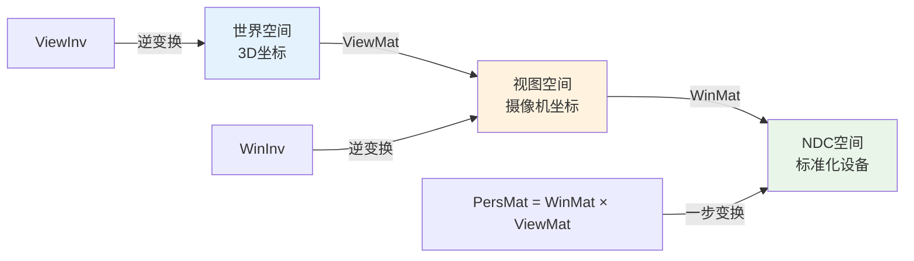
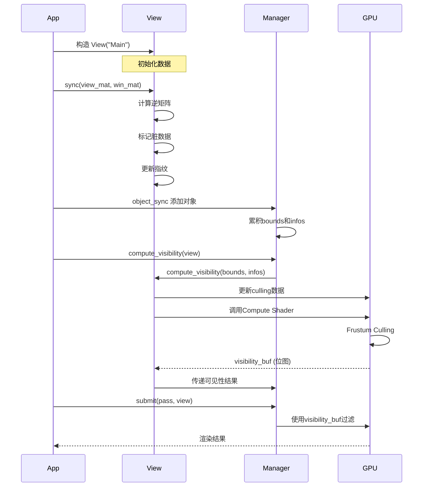

# 13. draw_view.hh - View类与视图系统详解

> **文件路径**: `source/blender/draw/intern/draw_view.hh`  \n> **总行数**: 264行  \n> **创建日期**: 2025-12-18

---

## 目录
1. [概述与核心概念](#1-概述与核心概念)
2. [View类架构](#2-view类架构)
3. [矩阵与摄像机系统](#3-矩阵与摄像机系统)
4. [可见性计算 (Culling)](#4-可见性计算-culling)
5. [裁剪与多视图渲染](#5-裁剪与多视图渲染)
6. [OffsetData与多边形偏移](#6-offsetdata与多边形偏移)
7. [生命周期与同步](#7-生命周期与同步)

---

## 1. 概述与核心概念

### 1.1 View的作用

在Draw Manager中，`View` 类是**摄像机和视图状态的抽象**，负责：

- ✅ **矩阵管理**: View矩阵、投影矩阵及其逆矩阵
- ✅ **裁剪计算**: 视锥体平面和包围盒
- ✅ **可见性剔除**: GPU端Frustum Culling
- ✅ **多视图支持**: 立体渲染、多角度渲染
- ✅ **多边形偏移**: 用于消隐和Overlay层分离

### 1.2 核心术语

| 术语 | 全称 | 解释 |
|------|------|------|
| **ViewMat** | View Matrix | 世界 → 视图空间 (World→View) |
| **WinMat** | Window Matrix | 视图 → NDC空间 (View→NDC) = 投影矩阵 |
| **PersMat** | Perspective Matrix | 世界 → NDC (WinMat × ViewMat) |
| **ViewInv** | View Inverse | 视图 → 世界 (View→World) |
| **WinInv** | Window Inverse | NDC → 视图 (NDC→View) |
| **Frustum** | 视锥体 | 摄像机可见空间 |
| **Culling** | 剔除 | 去除摄像机外的物体 |

### 1.3 矩阵关系图



---

## 2. View类架构

### 2.1 核心成员变量

**位置**: `draw_view.hh:37-68`

```cpp
class View {
 protected:
  /* 矩阵数据 (双缓冲，便于调试) */
  UniformArrayBuffer<ViewMatrices, DRW_VIEW_MAX> data_;
  UniformArrayBuffer<ViewCullingData, DRW_VIEW_MAX> culling_;

  /* 调试用：冻结的数据副本 */
  UniformArrayBuffer<ViewMatrices, DRW_VIEW_MAX> data_freeze_;
  UniformArrayBuffer<ViewCullingData, DRW_VIEW_MAX> culling_freeze_;

  /* 可见性计算结果 */
  VisibilityBuf visibility_buf_;
  uint64_t manager_fingerprint_ = 0;  // 状态指纹

  /* 诊断信息 */
  const char *debug_name_;
  int view_len_ = 0;

  /* 标志位 */
  bool is_inverted_ = false;      // 正反手反转
  bool do_visibility_ = true;     // 是否进行可见性计算
  bool dirty_ = true;             // 数据是否需要更新
  bool frozen_ = false;           // 是否冻结 (调试)
  bool procedural_ = false;       // 程序化模式
```

### 2.2 ViewMatrices 结构

**定义在**: `draw_shader_shared.hh` (未直接展示，但从使用推断)

```cpp
struct ViewMatrices {
  float4x4 viewmat;   // World → View
  float4x4 winmat;    // View → NDC
  float4x4 viewinv;   // View → World (逆)
  float4x4 wininv;    // NDC → View (逆)

  // 辅助追踪
  float4x4 persmat;   // 快速计算
};
```

### 2.3 ViewCullingData 结构

**推断自函数使用**

```cpp
struct ViewCullingData {
  float3 camera_pos;          // 摄像机位置
  float3 camera_forward;      // 前进方向
  float4 frustum_planes[6];   // 裁剪平面 (Ax+By+Cz+D=0)
  float3 frustum_corners[8];  // 视锥体角点
  float ndc_offset_factor;    // 用于偏移的因子
};
```

---

## 3. 矩阵与摄像机系统

### 3.1 sync - 矩阵同步

**位置**: `draw_view.hh:78`

```cpp
void sync(const float4x4 &view_mat, const float4x4 &win_mat, int view_id = 0);
```

**关键实现** (在 `draw_view.cc` 中):

```cpp
void View::sync(const float4x4 &view_mat, const float4x4 &win_mat, int view_id)
{
  BLI_assert(view_id < view_len_);

  /* 1. 存储矩阵 */
  data_[view_id].viewmat = view_mat;
  data_[view_id].winmat = win_mat;

  /* 2. 计算逆矩阵 */
  data_[view_id].viewinv = view_mat.inverted();
  data_[view_id].wininv = win_mat.inverted();

  /* 3. 检测是否反手系 */
  is_inverted_ = determine_if_inverted(view_mat);

  /* 4. 处理多视图 */
  if (view_id == 0 && view_len_ > 1) {
    /* 传播到所有视图 */
    for (int i = 1; i < view_len_; i++) {
      data_[i] = data_[0];
    }
  }

  /* 5. 标记脏数据 */
  dirty_ = true;

  /* 6. 增加同步计数器 (指纹) */
  sync_counter_ = ++global_sync_counter_;

  /* 7. 更新视口大小 */
  update_viewport_size();
}
```

### 3.2 矩阵访问器

**位置**: `draw_view.hh:124-165`

```cpp
const float4x4 &viewmat(int view_id = 0) const {
  return data_[view_id].viewmat;
}

const float4x4 &winmat(int view_id = 0) const {
  return data_[view_id].winmat;
}

const float3 &location(int view_id = 0) const {
  return data_[view_id].viewinv.location();
}

/* 计算合成矩阵 */
const float4x4 persmat(int view_id = 0) const {
  return data_[view_id].winmat * data_[view_id].viewmat;
}
```

### 3.3 正反手检测

**推断代码**:

```cpp
bool View::determine_if_inverted(const float4x4 &view_mat)
{
  /* 检查第三个基向量(上方)的符号 */
  float3 up = view_mat.y_axis();

  /* 在右手系中，Up是向上；但在某些变换后可能翻转 */
  return up.z < 0;  // 简化判断，实际更复杂
}
```

---

## 4. 可见性计算 (Culling)

### 4.1 visibility_test - 可见性开关

**位置**: `draw_view.hh:81-85`

```cpp
void visibility_test(bool enable)
{
  do_visibility_ = enable;
}
```

**使用场景**:
```cpp
// 默认所有对象都可见 (无剔除)
manager.compute_visibility(view, objects);

// 临时禁用
view.visibility_test(false);
manager.compute_visibility(view, objects);

// 恢复
view.visibility_test(true);
```

### 4.2 compute_visibility - 核心剔除

**位置**: `draw_view.hh:233-236` (纯虚函数)

```cpp
virtual void compute_visibility(ObjectBoundsBuf &bounds,
                                ObjectInfosBuf &infos,
                                uint resource_len,
                                bool debug_freeze);
```

**实际实现在**: `draw_view.cc`

```cpp
void View::compute_visibility(ObjectBoundsBuf &bounds,
                              ObjectInfosBuf &infos,
                              uint resource_len,
                              bool debug_freeze)
{
  if (!do_visibility_test_) {
    metadata_buf_.clear();  // 全部可见
    return;
  }

  /* 1. 如果数据脏了，更新Culling数据 */
  if (dirty_) {
    for (int i = 0; i < view_len_; i++) {
      frustum_culling_planes_calc(i);
      // frustum_boundbox_calc(i);  // 备用
    }
    dirty_ = false;
  }

  /* 2. 绑定视图矩阵到Compute Shader */
  bind();

  /* 3. 调用Compute Shader进行剔除 */
  GPUComputeShader *cull_shader = get_culling_shader();

  cull_shader->bind();
  cull_shader->uniform("resource_len", resource_len);
  cull_shader->bind_ssbo(0, culling_);         // 视锥体平面
  cull_shader->bind_ssbo(1, bounds);           // 对象包围盒
  cull_shader->bind_ssbo(2, visibility_buf_);  // 输出结果

  int groups = (resource_len + 63) / 64;  // 每64个对象一组
  cull_shader->dispatch(groups);

  if (debug_freeze) {
    /* 冻结数据用于调试 */
    data_freeze_.copy_from(data_);
    culling_freeze_.copy_from(culling_);
  }

  manager_fingerprint_ = manager->get_fingerprint();
}
```

### 4.3 Frustum Culling 算法

**Compute Shader 核心逻辑**:

```glsl
// culling.glsl
layout(local_size_x = 64) in;

void main() {
  uint res_id = gl_GlobalInvocationID.x;
  if (res_id >= resource_len) return;

  ObjectBounds bounds = bounds_buf[res_id];

  // 仅测试包围球 (最快速)
  float3 center = bounds.sphere_center;
  float radius = bounds.sphere_radius;

  bool visible = true;
  for (int i = 0; i < 6; i++) {
    float4 plane = culling_planes[i];
    float dist = dot(plane.xyz, center) + plane.w;
    if (dist < -radius) {
      visible = false;  // 完全在平面外
      break;
    }
  }

  // 写入结果 (位图)
  if (visible) {
    word = res_id / 32;
    bit = res_id % 32;
    atomicOr(visibility_buf[word], 1u << bit);
  }
}
```

### 4.4 可见性结果格式

**位置**: `draw_view.hh:167-170`

```cpp
int visibility_word_per_draw() const
{
  /* 多视图时每32个对象需要一个word */
  return (view_len_ == 1) ? 0 : divide_ceil_u(view_len_, 32);
}
```

**存储格式**:
```
单视图: uint数组, 每位代表一个对象的可见性
多视图: [View0_0..31], [View1_0..31], ... 每个view_id一组
```

---

## 5. 裁剪与多视图渲染

### 5.1 基础信息查询

**位置**: `draw_view.hh:93-123`

```cpp
bool is_persp(int view_id = 0) const {
  /* 透视矩阵的[3][3]元素为0 */
  return data_[view_id].winmat[3][3] == 0.0f;
}

float far_clip(int view_id = 0) const {
  if (is_persp) {
    // 透视投影的远平面计算公式
    return -winmat[3][2] / (winmat[2][2] + 1.0f);
  }
  // 正交投影
  return -(winmat[3][2] - 1.0f) / winmat[2][2];
}

float near_clip(int view_id = 0) const {
  if (is_persp) {
    return -winmat[3][2] / (winmat[2][2] - 1.0f);
  }
  return -(winmat[3][2] + 1.0f) / winmat[2][2];
}
```

### 5.2 视锥体平面计算

**位置**: `draw_view.hh:257-260` (受保护)

```cpp
void frustum_culling_planes_calc(int view_id)
{
  const float4x4 &winmat = data_[view_id].winmat;

  /* 从合成矩阵提取6个平面 */
  // 参考: https://www8.cs.umu.se/kurser/5DV051/HT13/lab/frustum.pdf
  const float4x4 &pm = winmat * data_[view_id].viewmat;

  // 左
  culling_[view_id].planes[0] = pm[3] + pm[0];
  // 右
  culling_[view_id].planes[1] = pm[3] - pm[0];
  // 下
  culling_[view_id].planes[2] = pm[3] + pm[1];
  // 上
  culling_[view_id].planes[3] = pm[3] - pm[1];
  // 近
  culling_[view_id].planes[4] = pm[3] + pm[2];
  // 远
  culling_[view_id].planes[5] = pm[3] - pm[2];

  /* 归一化平面 (A,B,C,D) */
  for (int i = 0; i < 6; i++) {
    float len = length(culling_[view_id].planes[i].xyz);
    culling_[view_id].planes[i] /= len;
  }
}
```

### 5.3 提取视锥体角点

**位置**: `draw_view.hh:225-228`

```cpp
std::array<float3, 8> frustum_corners_get(int view_id = 0)
{
  std::array<float3, 8> corners;

  /* NDC的8个角点 */
  const float3 ndc_corners[8] = {
    {-1, -1, -1}, {1, -1, -1}, {1, 1, -1}, {-1, 1, -1},   // 近平面
    {-1, -1,  1}, {1, -1,  1}, {1, 1,  1}, {-1, 1,  1}    // 远平面
  };

  /* 逆变换到世界空间 */
  float4x4 inv_persp = data_[view_id].wininv * data_[view_id].viewinv;

  for (int i = 0; i < 8; i++) {
    float4 world = inv_persp * float4(ndc_corners[i], 1.0f);
    corners[i] = world.xyz / world.w;  // 透视除法
  }

  return corners;
}
```

### 5.4 多视图渲染

**构造函数**: `View(name, view_len, procedural)`

```cpp
View::View(const char *name, int view_len, bool procedural)
    : visibility_buf_(name), debug_name_(name), view_len_(view_len), procedural_(procedural)
{
  BLI_assert(view_len <= DRW_VIEW_MAX);  // 通常是8
}

// 使用示例
View stereo_view("Stereo", 2);
stereo_view.sync(left_view_mat, left_winmat, 0);   // 左眼
stereo_view.sync(right_view_mat, right_winmat, 1); // 右眼
```

**适用场景**:
- VR/AR立体渲染
- 3D电影
- 多角度预览
- 深度立方体贴图 (6面)

---

## 6. OffsetData与多边形偏移

### 6.1 OffsetData结构

**位置**: `draw_view.hh:183-223`

```cpp
struct OffsetData {
  float dist;       // rv3d->dist
  char persp;       // rv3d->persp
  bool is_persp;    // rv3d->is_persp

  OffsetData(const RegionView3D &rv3d)
      : dist(rv3d.dist), persp(rv3d.persp), is_persp(rv3d.is_persp != 0) {}
};
```

### 6.2 多边形偏移计算

**核心函数**:

```cpp
float4x4 winmat_polygon_offset(const float4x4 &winmat, float offset)
{
  /* 特殊处理正交相机 */
  float view_dist = dist;
  if (persp == RV3D_CAMOB && is_persp == false) {
    view_dist = 1.0f / max_ff(fabsf(winmat[0][0]), fabsf(winmat[1][1]));
  }

  /* 计算Z轴偏移 */
  float4x4 result = winmat;
  result[3][2] -= GPU_polygon_offset_calc(winmat.ptr(), view_dist, offset);
  return result;
}

float polygon_offset_factor(const float4x4 &winmat)
{
  float view_dist = dist;
  if (persp == RV3D_CAMOB && is_persp == false) {
    view_dist = 1.0f / max_ff(fabsf(winmat[0][0]), fabsf(winmat[1][1]));
  }
  return GPU_polygon_offset_calc(winmat.ptr(), view_dist, 1.0);
}
```

### 6.3 实际应用

**用于Overlay层分离**:

```cpp
// 1. 常规层
View main_view("Main");
main_view.sync(view_mat, win_mat);

// 2. 带偏移的前景层 (避免Z-fighting)
OffsetData off_data(*rv3d);
float4x4 offset_winmat = off_data.winmat_polygon_offset(win_mat, 1.0f);

View overlaid_view("Overlaid");
overlaid_view.sync(view_mat, offset_winmat);

// 使用不同深度缓冲区渲染，避免重叠
```

**Overlay层偏移值**:
- **Wireframe**: +1.0
- **Selection**: +2.0
- **InFront**: +5.0
- **Cursor**: +10.0

---

## 7. 生命周期与同步

### 7.1 完整工作流程



### 7.2 指纹机制

**位置**: `draw_view.hh:239-245`

```cpp
bool has_computed_visibility() const
{
  return manager_fingerprint_ != 0;
}
```

**指纹检查**:
```cpp
// 检查是否需要重新计算可见性
if (view.has_computed_visibility() &&
    view.fingerprint_get() == manager_fingerprint) {
  // 复用上帧结果，跳过Culling
}
```

### 7.3 调试支持

**冻结模式** 用于验证Culling正确性:

```cpp
void View::compute_visibility(... , bool debug_freeze)
{
  if (debug_freeze) {
    data_freeze_.copy_from(data_);
    culling_freeze_.copy_from(culling_);
  }
  // ... 计算
}

// 使用
view.compute_visibility(buf, len, true);  // 冻结当前状态
// 之后可以比较 data_ 和 data_freeze_
```

### 7.4 默认View管理

**静态方法**:

```cpp
// draw_view.cc 中实现
static View *default_view = nullptr;

View& View::default_get()
{
  if (!default_view) {
    default_view = new View("DefaultView");
  }
  return *default_view;
}

void View::default_set(const float4x4 &view_mat, const float4x4 &win_mat)
{
  default_get().sync(view_mat, win_mat);
}
```

**Overlay中的使用**:
```cpp
void Instance::draw(Manager &manager)
{
  View &view = View::default_get();  // 获取当前视口视图
  manager.submit(grid_ps_, view);
  manager.submit(meshes_ps_, view);
}
```

---

## 总结

`draw_view.hh` 定义了Blender Draw系统的**摄像机抽象层**:

### 核心功能

1. **矩阵管理**: View/Proj及其逆矩阵的存储与计算
2. **多视图渲染**: 支持VR、立方体贴图等场景
3. **GPU剔除**: Compute Shader加速的视锥体剔除
4. **偏移系统**: 多层Overlay的Z-fighting解决
5. **状态追踪**: 指纹机制避免冗余计算

### 架构优势

- **统一接口**: 一个View对象管理所有矩阵需求
- **GPU加速**: 大规模剔除完全在GPU并行执行
- **灵活扩展**: 多视图、程序化视图、调试模式
- **解耦设计**: Manager只需View，无需关心具体实现

### Overlay应用

```cpp
// Overlay引擎使用View进行深度管理
View regular_view("OverlayRegular");
View infront_view("OverlayInFront", 1, false);

// 不同层使用不同偏移的投影矩阵
regular_view.sync(view, offset_winmat(0));
infront_view.sync(view, offset_winmat(5));  // 前景层

// 通过View分离渲染，避免深度冲突
```

这套系统是理解Blender渲染管线的关键，连接了场景数据与GPU执行。

