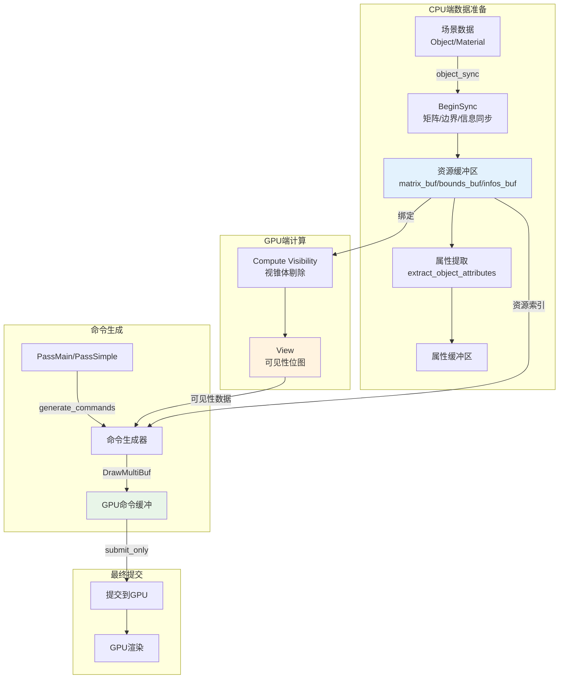
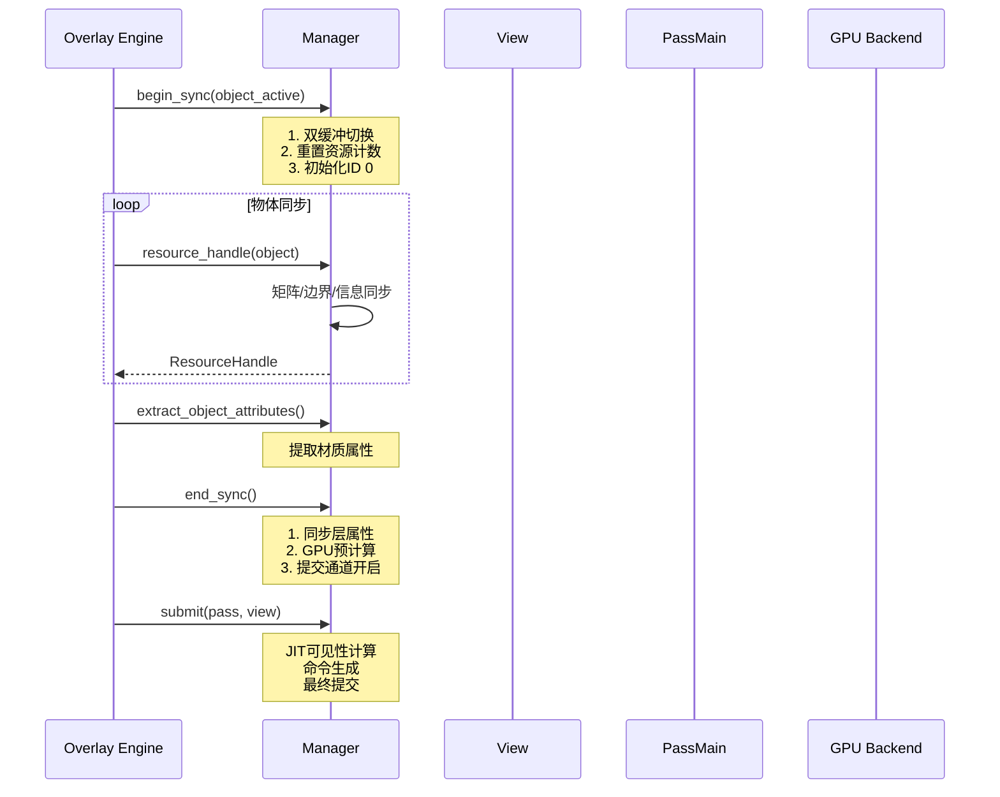
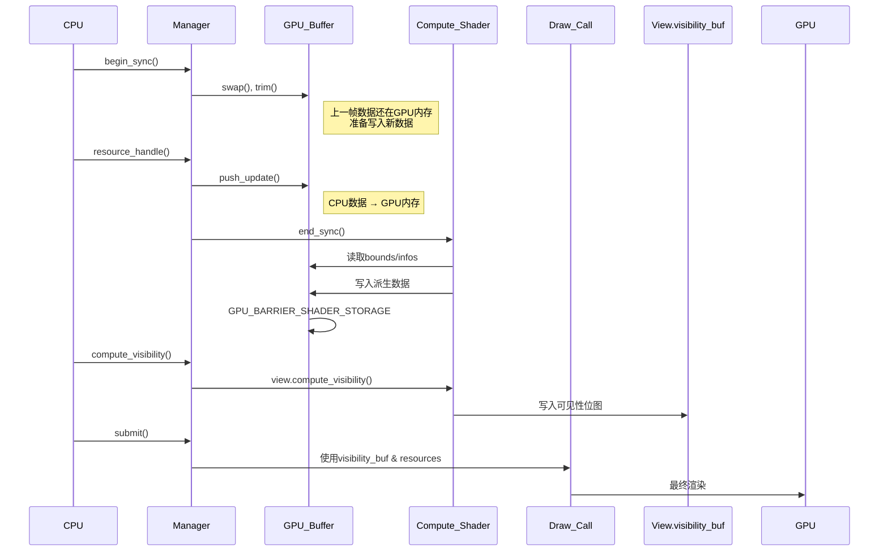

# 14. draw_manager.hh - Manager类详解

> **文件路径**: `source/blender/draw/intern/draw_manager.hh` 和 `source/blender/draw/intern/draw_manager.cc`
> **总行数**: hh: 503行, cc: 422行
> **创建日期**: 2025-12-18

---

## 目录
1. [概述与核心作用](#1-概述与核心作用)
2. [Manager类架构](#2-manager类架构)
3. [资源句柄系统](#3-资源句柄系统)
4. [生命周期管理](#4-生命周期管理)
5. [可见性计算流程](#5-可见性计算流程)
6. [命令生成流程](#6-命令生成流程)
7. [提交与执行流程](#7-提交与执行流程)
8. [高级功能](#8-高级功能)
9. [性能优化机制](#9-性能优化机制)

---

## 1. 概述与核心作用

### 1.1 Manager的角色

`Manager`是Draw Manager的**中央控制器**，负责：

- ✅ **资源生命周期管理**: matrices, bounds, infos, attributes缓冲区的分配和同步
- ✅ **GPU资源绑定**: 将数据缓冲区绑定到GPU槽位
- ✅ **可见性计算**: 协调View与数据缓冲区的可见性剔除
- ✅ **命令生成**: 将高层Pass命令转换为底层GPU绘制命令
- ✅ **提交调度**: 管理完整的渲染提交流程
- ✅ **状态指纹**: 跟踪资源变化，避免冗余计算

### 1.2 核心数据流



### 1.3 核心术语

| 术语 | 全称 | 解释 |
|------|------|------|
| **ResourceHandle** | 资源句柄 | 唯一标识一个物体的GPU资源索引 |
| **Fingerprint** | 指纹 | 状态哈希，用于检测变化 |
| **SwapChain** | 双缓冲 | 每帧切换的缓冲区，避免读写冲突 |
| **Sync cycle** | 同步周期 | begin_sync到end_sync之间的时间段 |

---

## 2. Manager类架构

### 2.1 核心成员变量

**位置**: `draw_manager.hh:98-120`

```cpp
class Manager {
 protected:
  /* ===== 资源数据缓冲区 (SwapChain) ===== */
  /* 双缓冲结构：current() 和 next() 交替使用 */
  using ObjectMatricesBuf = StorageArrayBuffer<ObjectMatrices, 128>;
  using ObjectBoundsBuf = StorageArrayBuffer<ObjectBounds, 128>;
  using ObjectInfosBuf = StorageArrayBuffer<ObjectInfos, 128>;
  using ObjectAttributeBuf = StorageArrayBuffer<ObjectAttribute, 128>;
  using LayerAttributeBuf = UniformArrayBuffer<LayerAttribute, 512>;

  /* Double-buffered resources for matrices, bounds, and infos */
  SwapChain<ObjectMatricesBuf, 2> matrix_buf;
  SwapChain<ObjectBoundsBuf, 2> bounds_buf;
  SwapChain<ObjectInfosBuf, 2> infos_buf;

  ObjectAttributeBuf attributes_buf;      // 材质属性 (颜色, 透明度等)
  LayerAttributeBuf layer_attributes_buf; // 图层属性 (层名, 类型等)

  /* ===== 状态追踪 ===== */
  Map<uint32_t, GPULayerAttr> layer_attributes_;  // 图层属性缓存
  Vector<gpu::Texture*> acquired_textures_;       // 引用计数的纹理

  uint resource_len_ = 0;      // 已分配的资源数量
  uint attribute_len_ = 0;     // 已分配的属性数量
  Object *object_active = nullptr;  // 活跃对象 (用于编辑模式高亮)

  /* ===== 指纹与同步 ===== */
  uint64_t sync_counter_ = 1;  // Manager的同步计数器
  static std::atomic<uint32_t> global_sync_counter_; // 全局静态计数器
};
```

### 2.2 SwapChain设计

**核心优势**: 每帧双缓冲，避免GPU读写冲突

```cpp
// 使用示例
void Manager::begin_sync(Object *object_active)
{
  matrix_buf.swap();    // 切换到下一帧的缓冲区
  bounds_buf.swap();
  infos_buf.swap();

  /* 当前帧数据清空/重置 */
  resource_len_ = 0;
  attribute_len_ = 0;
}
```

**工作流程**:
```
帧N:
  matrix_buf.current()   ← 读取: 帧N-1的数据 (GPU正在使用)
  matrix_buf.next()      ← 写入: 帧N的数据 (CPU填充)

帧N+1:
  matrix_buf.current()   ← 读取: 刚写入的帧N数据
  matrix_buf.next()      ← 写入: 帧N+1的数据
```

### 2.3 资源缓冲区结构

#### ObjectMatrices
```cpp
struct ObjectMatrices {
  float4x4 model;      // 对象 → 世界 (world_from_object)
  float4x4 viewmat;    // 特殊用途 (法线矩阵等)

  void sync(const Object &ob);
  void sync(const float4x4 &mat);
};
```

#### ObjectBounds
```cpp
struct ObjectBounds {
  float3 bounds_center;      // 包围盒中心
  float3 bounds_half_extent; // 半边长
  float sphere_radius;       // 包围球半径

  void sync(const Object &ob, float inflate = 0.0f);
  void sync(const float3 ¢er, const float3 &half_ext);
  void sync(); // 清空
};
```

#### ObjectInfos
```cpp
struct ObjectInfos {
  uint32_t random;           // 随机ID (用于抖动)
  uint32_t selection_id;     // 选择ID
  uint32_t object_attrs_offset; // 属性在attributes_buf中的偏移
  uint32_t object_attrs_len;    // 属性数量

  /* 标志位 (位域) */
  uint object_info;          // 对象类型、状态
  uint custom_id;            // 用户自定义ID

  void sync(const ObjectRef &ref, bool is_active, bool is_edit_mode);
  void sync(); // 清空
};
```

---

## 3. 资源句柄系统

### 3.1 ResourceHandle

**位置**: `draw_manager.hh:33-60`

```cpp
struct ResourceHandle {
  uint32_t resource_index : 24;  // 资源索引 (最大16M对象)
  uint32_t is_inverted : 1;      // 正反手反转
  uint32_t : 7;                  // 填充位

  bool is_valid() const { return resource_index != 0; }
};

struct ResourceHandleRange {
  ResourceHandle start;
  uint32_t length;

  // 支持迭代多个实例
  ResourceHandle operator[](int i) const {
    return {start.resource_index + i, start.is_inverted};
  }
};
```

### 3.2 资源分配流程

#### 2.2.1 普通对象

```cpp
// draw_manager.hh:324-361
inline ResourceHandleRange Manager::resource_handle(const ObjectRef &ref,
                                                    float inflate_bounds)
{
  bool is_active_object = ref.is_active(object_active);

  /* 1. 矩阵同步 */
  matrix_buf.current().get_or_resize(resource_len_)
    .sync(*ref.object);

  /* 2. 包围盒同步 (可膨胀) */
  bounds_buf.current().get_or_resize(resource_len_)
    .sync(*ref.object, inflate_bounds);

  /* 3. 信息同步 */
  infos_buf.current().get_or_resize(resource_len_)
    .sync(ref, is_active_object, is_edit_mode);

  /* 4. 返回句柄 */
  resource_len_++;
  return ResourceHandle(resource_len_ - 1,
                       (ref.object->transflag & OB_NEG_SCALE) != 0);
}
```

#### 3.2.2 实例化对象 (Dupliverts)

```cpp
// draw_manager.hh:331-352
if (ref.duplis_) {
  uint start = resource_len_;

  /* 1. 原型数据预计算 */
  ObjectBounds proto_bounds;
  proto_bounds.sync(*ref.object, inflate_bounds);

  ObjectInfos proto_info;
  proto_info.sync(ref, is_active_object, is_edit_mode);

  /* 2. 为每个实例分配资源 */
  for (const DupliObject *dupli : *ref.duplis_) {
    matrix_buf.current().get_or_resize(resource_len_)
      .sync(float4x4(dupli->mat));
    bounds_buf.current().get_or_resize(resource_len_) = proto_bounds;

    ObjectInfos &info = infos_buf.current().get_or_resize(resource_len_);
    info = proto_info;
    info.random = dupli->random_id * (1.0f / 0xFFFFFFFF);

    resource_len_++;
  }

  return ResourceHandleRange(
    ResourceHandle(start, neg_scale),
    resource_len_ - start
  );
}
```

#### 3.2.3 几何节点属性预览

```cpp
// draw_manager.hh:363-390
ResourceHandleRange Manager::resource_handle(
  const ObjectRef &ref,
  const float4x4 *model_matrix,
  const float3 *bounds_center,
  const float3 *bounds_half_extent)
{
  /* 自定义矩阵和边界 */
  if (model_matrix) {
    matrix_buf.current().get_or_resize(resource_len_)
      .sync(*model_matrix);
  }

  if (bounds_center && bounds_half_extent) {
    bounds_buf.current().get_or_resize(resource_len_)
      .sync(*bounds_center, *bounds_half_extent);
  }

  /* ... 信息同步 ... */
  return ResourceHandle(resource_len_++, false);
}
```

### 3.3 延迟句柄分配

```cpp
// draw_manager.hh:315-322
inline ResourceHandleRange Manager::unique_handle(const ObjectRef &ref)
{
  if (!ref.handle_.is_valid()) {
    /* 延迟分配，避免未使用对象的开销 */
    const_cast<ObjectRef &>(ref).handle_ = resource_handle(ref);
  }
  return ref.handle_;
}
```

**优势**: 只有在实际绘制时才分配句柄，节省内存和计算。

---

## 4. 生命周期管理

### 4.1 完整的三阶段流程



### 4.2 begin_sync - 开始同步周期

**位置**: `draw_manager.cc:35-81`

```cpp
void Manager::begin_sync(Object *object_active)
{
  /* 1. 更新同步计数器 (确保非零) */
  sync_counter_ = (global_sync_counter_ += 2);

  /* 2. 双缓冲切换 */
  matrix_buf.swap();
  bounds_buf.swap();
  infos_buf.swap();

  /* 3. 内存优化: 修剪到下一个2的幂 */
  matrix_buf.current().trim_to_next_power_of_2(resource_len_);
  bounds_buf.current().trim_to_next_power_of_2(resource_len_);
  infos_buf.current().trim_to_next_power_of_2(resource_len_);
  attributes_buf.trim_to_next_power_of_2(attribute_len_);

  /* 4. 释放上帧的纹理引用 */
  for (gpu::Texture *texture : acquired_textures_) {
    GPU_texture_free(texture);
  }
  acquired_textures_.clear();

  /* 5. 清理层属性 */
  layer_attributes_.clear();

  /* 6. 调试: 填充未初始化数据模式 */
  #if !defined(NDEBUG) && !defined(_M_ARM64)
    memset(matrix_buf.current().data(), 0xF0, ...);
  #endif

  /* 7. 重置计数器 */
  resource_len_ = 0;
  attribute_len_ = 0;

  this->object_active = object_active;

  /* 8. 初始化ID 0 (占位符) */
  resource_handle(float4x4::identity());
}
```

**关键点**:
- ID 0总是存在，作为默认/无效资源
- 每帧切换缓冲区避免GPU/CPU冲突
- 内存池化: 不释放缓冲区，只重用

### 4.3 end_sync - 结束同步周期

**位置**: `draw_manager.cc:113-145`

```cpp
void Manager::end_sync()
{
  GPU_debug_group_begin("Manager.end_sync");

  /* 1. 同步并排序图层属性 */
  sync_layer_attributes();

  /* 2. 推送更新到GPU */
  matrix_buf.current().push_update();
  bounds_buf.current().push_update();
  infos_buf.current().push_update();
  attributes_buf.push_update();
  layer_attributes_buf.push_update();

  /* 3. GPU端资源预计算 */
  uint thread_groups = divide_ceil_u(resource_len_, DRW_FINALIZE_GROUP_SIZE);

  gpu::Shader *shader = DRW_shader_draw_resource_finalize_get();
  GPU_shader_bind(shader);
  GPU_shader_uniform_1i(shader, "resource_len", resource_len_);

  /* 绑定SSBO */
  GPU_storagebuf_bind(matrix_buf.current(),
                      GPU_shader_get_ssbo_binding(shader, "matrix_buf"));
  GPU_storagebuf_bind(bounds_buf.current(),
                      GPU_shader_get_ssbo_binding(shader, "bounds_buf"));
  GPU_storagebuf_bind(infos_buf.current(),
                      GPU_shader_get_ssbo_binding(shader, "infos_buf"));

  /* 执行Compute Shader */
  GPU_compute_dispatch(shader, thread_groups, 1, 1);

  /* 等待存储屏障 */
  GPU_memory_barrier(GPU_BARRIER_SHADER_STORAGE);

  DRW_submission_end();  // 标记提交开始
  GPU_debug_group_end();
}
```

**GPU预计算做什么**:
- 计算最终的模型-视图-投影矩阵
- 计算法线矩阵
- 某些情况下计算包围球
- 填充info缓冲区的派生字段

### 4.4 层属性同步

**位置**: `draw_manager.cc:83-111`

```cpp
void Manager::sync_layer_attributes()
{
  /* 1. 收集所有属性ID */
  Vector<uint32_t> id_list;
  id_list.reserve(layer_attributes_.size());
  for (uint32_t id : layer_attributes_.keys()) {
    id_list.append(id);
  }

  /* 2. 排序 (二分查找优化) */
  std::sort(id_list.begin(), id_list.end());

  /* 3. 同步属性值到缓冲区 */
  int count = 0;
  for (uint32_t id : id_list) {
    GPULayerAttr *attr = layer_attributes_.lookup_ptr(id);
    if (layer_attributes_buf[count].sync(drw_get().scene,
                                         drw_get().view_layer,
                                         *attr)) {
      if (++count == DRW_LAYER_ATTR_MAX)
        break;
    }
  }

  /* 4. 记录实际使用的数量 */
  layer_attributes_buf[0].buffer_length = count;
}
```

---

## 5. 可见性计算流程

### 5.1 compute_visibility - 核心剔除

**位置**: `draw_manager.cc:190-203`

```cpp
void Manager::compute_visibility(View &view)
{
  bool freeze_culling = (USER_DEVELOPER_TOOL_TEST(&U, use_viewport_debug) &&
                         drw_get().v3d &&
                         (drw_get().v3d->debug_flag & V3D_DEBUG_FREEZE_CULLING) != 0);

  /* 断言：确保资源已变化，避免冗余计算 */
  BLI_assert_msg(view.manager_fingerprint_ != this->fingerprint_get(),
                 "Resources did not changed, no need to update");

  /* 1. 更新View中的指纹 */
  view.manager_fingerprint_ = this->fingerprint_get();

  /* 2. 绑定视图数据 */
  view.bind();

  /* 3. 调用View的Compute Shader剔除 */
  view.compute_visibility(
    bounds_buf.current(),      // 包围盒数据
    infos_buf.current(),       // 对象信息
    resource_len_,             // 资源数量
    freeze_culling);           // 冻结调试
}
```

**流程图**:
```
Manager.compute_visibility(view)
  ↓
view.bind()
  ↓
View.compute_visibility(bounds, infos, count)
  ↓
  [GPU Compute Shader]
  foreach resource (并行):
    if (object_bounds.intersect(frustum_planes)):
      visibility_buf[resource_index] = 1
  ↓
  [结果存储在View中]
```

### 5.2 指纹机制

**位置**: `draw_manager.cc:169-173`

```cpp
uint64_t Manager::fingerprint_get()
{
  /* 高32位: 资源数量 | 低32位: 同步计数器 */
  return sync_counter_ | (uint64_t(resource_len_) << 32);
}
```

**指纹检查点**:
```cpp
// compute_visibility
BLI_assert_msg(view.manager_fingerprint_ != this->fingerprint_get(), ...);

// generate_commands
BLI_assert_msg((pass.manager_fingerprint_ != this->fingerprint_get()) ||
               (pass.view_fingerprint_ != view.fingerprint_get()), ...);

// submit_only
BLI_assert_msg(pass.manager_fingerprint_ == this->fingerprint_get(), ...);
```

### 5.3 ensure_visibility - JIT计算

```cpp
void Manager::ensure_visibility(View &view)
{
  if (view.manager_fingerprint_ != this->fingerprint_get()) {
    compute_visibility(view);
  }
}
```

**用途**: 在需要时自动计算，避免手动跟踪状态。

---

## 6. 命令生成流程

### 6.1 generate_commands - Main模式

**位置**: `draw_manager.cc:212-234`

```cpp
void Manager::generate_commands(PassMain &pass, View &view)
{
  if (pass.is_empty()) {
    return;
  }

  /* 断言检查 */
  BLI_assert_msg(
    (pass.manager_fingerprint_ != this->fingerprint_get()) ||
    (pass.view_fingerprint_ != view.fingerprint_get()),
    "Resources and view did not changed no need to update"
  );
  BLI_assert_msg(
    (view.manager_fingerprint_ == this->fingerprint_get()) &&
    (view.fingerprint_get() != 0),
    "compute_visibility was not called"
  );

  /* 1. 更新指纹 */
  pass.manager_fingerprint_ = this->fingerprint_get();
  pass.view_fingerprint_ = view.fingerprint_get();

  /* 2. 调用Pass的命令生成 */
  pass.draw_commands_buf_.generate_commands(
    pass.headers_,
    pass.commands_,
    view.get_visibility_buffer(),   // 之前计算的可见性数据
    view.visibility_word_per_draw(),
    view.view_len_,
    pass.use_custom_ids
  );
}
```

**实际工作在**: `draw_command.hh:747-752` (DrawMultiBuf)

```cpp
void DrawMultiBuf::generate_commands(
  Vector<Header, 0> &headers,
  Vector<Undetermined, 0> &commands,
  VisibilityBuf &visibility_buf,
  int visibility_word_per_draw,
  int view_len,
  bool use_custom_ids)
{
  /* 1. CPU端: 计算DrawGroup偏移前缀和 */

  /* 2. GPU Compute Shader执行: */
  /*    foreach DrawPrototype */
  /*      if (visible) */
  /*        atomic_add(group_offset, instance_len) */

  /* 3. 输出到command_buf_和resource_id_buf_ */
}
```

### 6.2 generate_commands - Simple模式

**位置**: `draw_manager.cc:246-257`

```cpp
void Manager::generate_commands(PassSimple &pass)
{
  if (pass.is_empty()) {
    return;
  }

  BLI_assert_msg(pass.manager_fingerprint_ != this->fingerprint_get(), ...);

  pass.manager_fingerprint_ = this->fingerprint_get();

  /* CPU端直接生成，不经过GPU */
  pass.draw_commands_buf_.generate_commands(
    pass.headers_,
    pass.commands_,
    pass.sub_passes_
  );
}
```

### 6.3 generate_commands - Sortable模式

**位置**: `draw_manager.cc:236-244`

```cpp
void Manager::generate_commands(PassSortable &pass, View &view)
{
  if (pass.is_empty()) {
    return;
  }

  /* 1. 按深度排序子通道 */
  pass.sort();

  /* 2. 转换为PassMain处理 */
  generate_commands(static_cast<PassMain &>(pass), view);
}
```

**排序逻辑**: 按物体中心到摄像机的距离排序，用于透明物体渲染。

---

## 7. 提交与执行流程

### 7.1 submit - 完整JIT流程

**位置**: `draw_manager.cc:310-327`

```cpp
void Manager::submit(PassMain &pass, View &view)
{
  if (pass.is_empty()) {
    return;
  }

  /* 1. JIT可见性计算 */
  if (view.manager_fingerprint_ != this->fingerprint_get()) {
    compute_visibility(view);
  }

  /* 2. JIT命令生成 */
  if (pass.manager_fingerprint_ != this->fingerprint_get() ||
      pass.view_fingerprint_ != view.fingerprint_get())
  {
    generate_commands(pass, view);
  }

  /* 3. 提交执行 */
  this->submit_only(pass, view);
}
```

**完整工作流程**:
```
1. 检查View指纹 → 如果变化 → compute_visibility()
2. 检查Pass指纹 → 如果变化 → generate_commands()
3. submit_only() → 实际GPU执行
```

### 7.2 submit_only - 执行阶段

**位置**: `draw_manager.cc:277-308`

```cpp
void Manager::submit_only(PassMain &pass, View &view)
{
  /* 所有预处理必须已完成 */
  BLI_assert_msg(view.manager_fingerprint_ == this->fingerprint_get(), ...);
  BLI_assert_msg(pass.manager_fingerprint_ == this->fingerprint_get(), ...);
  BLI_assert_msg(pass.view_fingerprint_ == view.fingerprint_get(), ...);

  /* 1. 绑定调试资源 */
  debug_bind();

  /* 2. 准备执行状态 */
  command::RecordingState state;
  state.inverted_view = view.is_inverted();

  /* 3. 绑定View矩阵 */
  view.bind();

  /* 4. 绑定绘制命令缓冲 */
  pass.draw_commands_buf_.bind(state);

  /* 5. 绑定资源SSBO */
  resource_bind();

  /* 6. 执行Pass */
  pass.submit(state);

  /* 7. 清理状态 */
  state.cleanup();
}
```

### 7.3 resource_bind - 资源绑定

**位置**: `draw_manager.cc:161-167`

```cpp
void Manager::resource_bind()
{
  /* 绑定到固定GPU槽位 (在shader中定义) */
  GPU_storagebuf_bind(matrix_buf.current(), DRW_OBJ_MAT_SLOT);
  GPU_storagebuf_bind(infos_buf.current(), DRW_OBJ_INFOS_SLOT);
  GPU_storagebuf_bind(attributes_buf, DRW_OBJ_ATTR_SLOT);
  GPU_uniformbuf_bind(layer_attributes_buf, DRW_LAYER_ATTR_UBO_SLOT);
}
```

**对应Shader中的绑定**:
```glsl
// draw_shader_shared.hh
layout(std430, binding = 0) readonly buffer matrix_buf {
  ObjectMatrix matrices[];
};

layout(std430, binding = 1) readonly buffer bounds_buf {
  ObjectBounds bounds[];
};

layout(std430, binding = 2) readonly buffer infos_buf {
  ObjectInfos infos[];
};

// 属性和图层属性通过UBO绑定
```

### 7.4 内存屏障时序图



---

## 8. 高级功能

### 8.1 纹理引用管理

**位置**: `draw_manager.hh:286-290`

```cpp
void acquire_texture(gpu::Texture *texture)
{
  GPU_texture_ref(texture);         // 增加引用计数
  acquired_textures.append(texture); // 记录到清理列表
}
```

**释放时机**: 在`begin_sync()`时自动释放上帧纹理。

### 8.2 调试输出

#### 8.2.1 submit_debug - 提交调试

```cpp
struct SubmitDebugOutput {
  Span<uint> resource_id;    // 每个绘制调用的资源ID
  Span<uint> visibility;     // 可见性位图
};

// 针对PassSimple
SubmitDebugOutput Manager::submit_debug(PassSimple &pass, View &view)
{
  submit(pass, view);

  pass.draw_commands_buf_.resource_id_buf_.read();

  return {
    .resource_id = {data, count},
    .visibility = {nullptr, 0}  // Simple模式无可见性数据
  };
}

// 针对PassMain
SubmitDebugOutput Manager::submit_debug(PassMain &pass, View &view)
{
  submit(pass, view);

  GPU_memory_barrier(GPU_BARRIER_BUFFER_UPDATE);

  pass.draw_commands_buf_.resource_id_buf_.read();
  view.get_visibility_buffer().read();

  return {
    .resource_id = {pass.draw_commands_buf_.resource_id_buf_.data(),
                    pass.draw_commands_buf_.resource_id_count_},
    .visibility = {(uint *)view.get_visibility_buffer().data(),
                   divide_ceil_u(resource_len_, 32)}
  };
}
```

#### 8.2.2 data_debug - 数据调试

```cpp
struct DataDebugOutput {
  Span<ObjectMatrix> matrices;
  Span<ObjectBounds> bounds;
  Span<ObjectInfos> infos;
};

DataDebugOutput Manager::data_debug()
{
  /* 强制读回GPU数据 */
  matrix_buf.current().read();
  bounds_buf.current().read();
  infos_buf.current().read();

  return {
    .matrices = {matrix_buf.current().data(), resource_len_},
    .bounds = {bounds_buf.current().data(), resource_len_},
    .infos = {infos_buf.current().data(), resource_len_}
  };
}
```

### 8.3 图层属性系统

**注册阶段**:
```cpp
// draw_manager.hh:485-496
inline void Manager::register_layer_attributes(GPUMaterial *material)
{
  const ListBase *attr_list = GPU_material_layer_attributes(material);

  if (attr_list != nullptr) {
    LISTBASE_FOREACH (const GPULayerAttr *, attr, attr_list) {
      /* 全局收集，不重复 */
      layer_attributes.add(attr->hash_code, *attr);
    }
  }
}
```

**同步阶段**: 见`sync_layer_attributes()`，在`end_sync()`中执行。

---

## 9. 性能优化机制

### 9.1 内存优化

#### 9.1.1 缓冲区修剪

```cpp
// trim_to_next_power_of_2
matrix_buf.current().trim_to_next_power_of_2(resource_len_);
```

**目的**: 将缓冲区大小调整为2的幂，优化GPU访存和分配。

#### 9.1.2 惰性句柄分配

```cpp
// unique_handle: 仅在需要时分配
if (!ref.handle_.is_valid()) {
  const_cast<ObjectRef &>(ref).handle_ = resource_handle(ref);
}
```

**收益**: 避免不绘制对象的资源开销。

### 9.2 计算优化

#### 9.2.1 GPU预计算 (end_sync)

```cpp
/* 在end_sync中提前计算 */
GPU_compute_dispatch(shader, thread_groups, 1, 1);
GPU_memory_barrier(GPU_BARRIER_SHADER_STORAGE);
```

**好处**:
- 分散计算负载，避免峰值
- 减少后续提交的CPU开销

#### 9.2.2 可见性缓存

```cpp
// view.manager_fingerprint_ 追踪
if (view.manager_fingerprint_ != this->fingerprint_get()) {
  compute_visibility(view);  // 仅在需要时计算
}
```

**避免**: 重复剔除同一帧。

### 9.3 调试优化

#### 9.3.1 模式检测

```cpp
bool freeze_culling = (USER_DEVELOPER_TOOL_TEST(&U, use_viewport_debug) &&
                       drw_get().v3d &&
                       (drw_get().v3d->debug_flag & V3D_DEBUG_FREEZE_CULLING) != 0);
```

**用途**: 在调试时冻结剔除结果，验证可见性计算。

#### 9.3.2 未初始化数据检测

```cpp
#if !defined(NDEBUG) && !defined(_M_ARM64)
  /* 填充0xF0模式 */
  memset(matrix_buf.current().data(), 0xF0, ...);
#endif
```

**目的**: 检测未正确同步的数据。

---

## 10. 与其他类的交互

### 10.1 Manager → Manager (自身)

```
begin_sync() → resource_handle() → end_sync() → submit()
```

### 10.2 Manager → View

```
Manager.compute_visibility(view)
  → view.bind()
  → view.compute_visibility(bounds, infos, len, freeze_culling)
  → view.get_visibility_buffer()
```

### 10.3 Manager → Pass

```
Manager.generate_commands(pass, view)
  → Pass.generate_commands(headers, commands, ...)

Manager.submit(pass, view)
  → Pass.submit(state)
```

### 10.4 Manager ↔ GPU

```
Manager.end_sync()
  → GPU_compute_dispatch()
  → GPU_memory_barrier()

Manager.resource_bind()
  → GPU_storagebuf_bind(matrix_buf, DRW_OBJ_MAT_SLOT)
  → GPU_storagebuf_bind(infos_buf, DRW_OBJ_INFOS_SLOT)
```

---

## 总结

### 核心职责

1. **资源管理**: 双缓冲矩阵/边界/信息/属性数据
2. **生命周期**: 三阶段同步 (begin_sync → resource_sync → end_sync)
3. **剔除协调**: 绑定数据，触发View的GPU剔除
4. **命令生成**: 管理Pass的命令生成流程
5. **状态追踪**: 指纹机制避免冗余计算
6. **提交调度**: JIT处理整个渲染管线

### 核心模式

#### 1. SwapChain双缓冲
```cpp
matrix_buf.swap();
matrix_buf.current().push_update();  // 当前帧写入
// 下一帧自动成为读取源
```

#### 2. 指纹状态跟踪
```cpp
uint64_t fingerprint = sync_counter_ | (uint64_t(resource_len_) << 32);
condition ? recompute() : reuse();
```

#### 3. 零拷贝GPU绑定
```cpp
GPU_storagebuf_bind(matrix_buf.current(), DRW_OBJ_MAT_SLOT);
// 直接绑定，不复制
```

### 性能特性和优化

| 优化项 | 实现方式 | 效果 |
|--------|----------|------|
| **内存池** | SwapChain + trim_to_power_of_2 | 减少分配开销 |
| **计算分摊** | end_sync预计算 | 避免提交峰值 |
| **惰性分配** | unique_handle | 节省未使用资源 |
| **JIT剔除** | 指纹检测 | 避免重复计算 |
| **GPU并行** | Compute Shader | 加速剔除 |

### Overlay中的应用模式

```cpp
void OverlayEngine::render()
{
  Manager &manager = *DRW_manager_get();

  // 1. 开始同步
  manager.begin_sync(active_object);

  // 2. 遍历所有模块
  for (auto &module : modules) {
    module.sync(manager);
  }

  // 3. 结束同步 (GPU预计算)
  manager.end_sync();

  // 4. 为各Pass生成命令
  for (auto &pass : passes) {
    manager.generate_commands(pass, view);
  }

  // 5. 提交所有Pass
  for (auto &pass : passes) {
    manager.submit(pass, view);
  }
}
```

**关键点**: Manager是整个Draw系统的**协调中心**，连接了数据准备、剔除计算和命令执行三大部分。所有30+个Overlay模块都通过同一个Manager进行GPU资源管理。

---

**下篇预告**: `draw_manager_text.cc` - 文本渲染系统的GPU管线，详解文本缓存、变换和投影计算。
