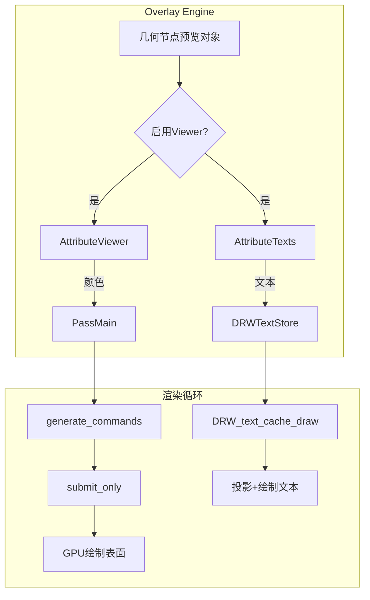
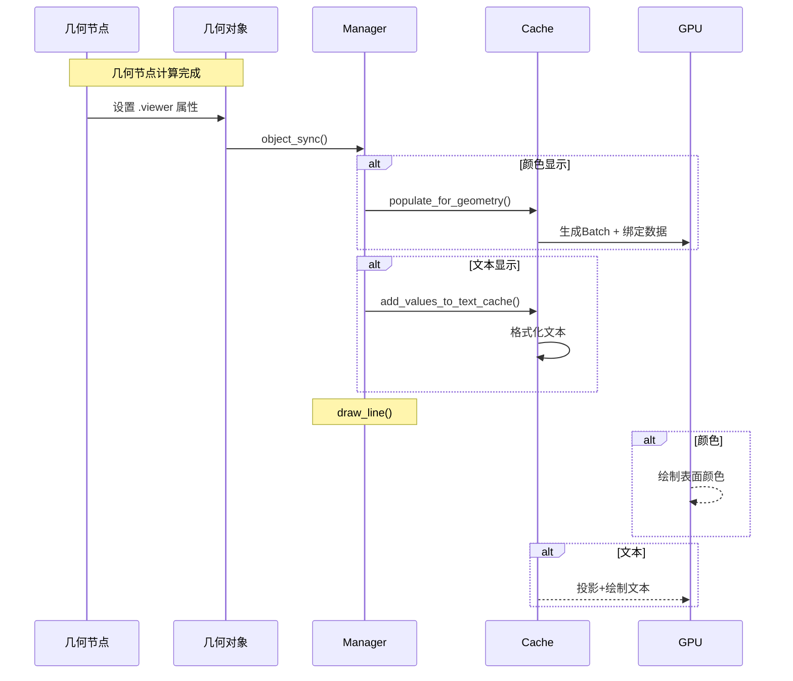

# 17. overlay_attribute_viewer.hh - 几何节点颜色属性显示

> **文件路径**: `source/blender/draw/engines/overlay/overlay_attribute_viewer.hh`
> **总行数**: 252行
> **创建日期**: 2025-12-18

## 核心功能

几何节点Viewer的**颜色渲染**系统，将节点输出值渲染为几何体表面的顶点/面颜色。

## 与文本系统的区别

| 特性 | overlay_attribute_text | overlay_attribute_viewer |
|------|------------------------|--------------------------|
| **显示方式** | 3D空间文字标注 | 表面色/顶点色 |
| **数据类型** | 所有类型 | 排除Quaternion/Matrix (仅数值向量) |
| **渲染位置** | 文本缓存系统 | PassMain绘制命令 |
| **适用场景** | 少量关键值查看 | 批量数据显示 |

## 类结构

```cpp
class AttributeViewer : public Overlay {
  PassMain ps_ = {"attribute_viewer_ps_"};

  /* 不同几何类型的SubPass */
  PassMain::Sub *mesh_sub_ = nullptr;
  PassMain::Sub *pointcloud_sub_ = nullptr;
  PassMain::Sub *curve_sub_ = nullptr;
  PassMain::Sub *curves_sub_ = nullptr;
  PassMain::Sub *instance_sub_ = nullptr;

  void begin_sync(...) override;
  void object_sync(...) override;
  void pre_draw(...) override;
  void draw_line(...) override;
};
```

## 渲染流程

### 1. 初始化 (begin_sync)

```cpp
void begin_sync(Resources &res, const State &state) final
{
  ps_.init();
  enabled_ = state.is_space_v3d() &&
             !res.is_selection() &&
             state.show_attribute_viewer();

  if (!enabled_) return;

  /* 绑定全局UBO */
  ps_.bind_ubo(OVERLAY_GLOBALS_SLOT, &res.globals_buf);
  ps_.bind_ubo(DRW_CLIPPING_UBO_SLOT, &res.clip_planes_buf);

  /* 设置渲染状态 */
  ps_.state_set(
    DRW_STATE_WRITE_COLOR |
    DRW_STATE_DEPTH_LESS_EQUAL |
    DRW_STATE_BLEND_ALPHA,
    state.clipping_plane_count
  );

  /* 为每种几何类型创建SubPass */
  mesh_sub_ = create_sub("mesh", res.shaders->attribute_viewer_mesh.get());
  pointcloud_sub_ = create_sub("pointcloud", res.shaders->attribute_viewer_pointcloud.get());
  curve_sub_ = create_sub("curve", res.shaders->attribute_viewer_curve.get());
  curves_sub_ = create_sub("curves", res.shaders->attribute_viewer_curves.get());
  instance_sub_ = create_sub("instance", res.shaders->uniform_color.get());
}
```

**Shader选择逻辑**:
- `mesh_sub_`: 使用`attribute_viewer_mesh` (支持插值)
- `pointcloud_sub_`: 使用`attribute_viewer_pointcloud` (点精灵)
- `curve_sub_`: 使用`attribute_viewer_curve` (线渲染)
- `curves_sub_`: 使用`attribute_viewer_curves` (带纹理)
- `instance_sub_`: 使用`uniform_color` (单色填充)

### 2. 对象同步 (object_sync)

```cpp
void object_sync(Manager &manager,
                 const ObjectRef &ob_ref,
                 Resources &res,
                 const State &state) final
{
  const bool is_preview = ob_ref.preview_base_geometry() != nullptr;
  if (!enabled_ || !is_preview) return;

  /* 检查是否有viewer属性且支持显示 */
  auto check_viewer = [&]() -> bool {
    // 检查属性元数据
    auto meta_data = attributes.lookup_meta_data(".viewer");
    if (!meta_data) return false;

    // 过滤不支持的类型
    return attribute_type_supports_viewer_overlay(meta_data->data_type);
  };

  if (ob_ref.preview_instance_index() >= 0) {
    populate_for_instance(ob_ref, state, manager);
  } else {
    populate_for_geometry(ob_ref, state, manager);
  }
}
```

### 3. 几何数据处理 (populate_for_geometry)

#### Mesh类型
```cpp
case OB_MESH: {
  Mesh &mesh = DRW_object_get_data_for_drawing<Mesh>(object);
  if (auto meta_data = mesh.attributes().lookup_meta_data(".viewer")) {
    if (attribute_type_supports_viewer_overlay(meta_data->data_type)) {
      gpu::Batch *batch = DRW_cache_mesh_surface_viewer_attribute_get(&object);
      auto &sub = *mesh_sub_;
      sub.push_constant("opacity", opacity);
      sub.draw(batch, manager.unique_handle(ob_ref));
    }
  }
  break;
}
```

**关键**: `DRW_cache_mesh_surface_viewer_attribute_get(&object)`
这会生成一个特殊的Batch，其中顶点属性绑定为`.viewer`数据。

#### PointCloud类型
```cpp
case OB_POINTCLOUD: {
  PointCloud &pointcloud = DRW_object_get_data_for_drawing<PointCloud>(object);
  if (auto meta_data = pointcloud.attributes().lookup_meta_data(".viewer")) {
    if (attribute_type_supports_viewer_overlay(meta_data->data_type)) {
      gpu::VertBuf **vertbuf = DRW_pointcloud_evaluated_attribute(&pointcloud, ".viewer");

      if (pointcloud.totpoint > 0 && vertbuf != nullptr) {
        auto &sub = *pointcloud_sub_;
        gpu::Batch *batch = pointcloud_sub_pass_setup(sub, &object, nullptr);
        sub.push_constant("opacity", opacity);
        sub.bind_texture("attribute_tx", vertbuf);  /* 绑定为纹理 */
        sub.draw(batch, manager.unique_handle(ob_ref));
      }
    }
  }
  break;
}
```

**特殊机制**: PointCloud将属性数据绑定为**纹理**，GPU shader通过纹理采样获取值。

#### Curves类型 (新)
```cpp
case OB_CURVES: {
  ::Curves &curves_id = DRW_object_get_data_for_drawing<::Curves>(object);
  const bke::CurvesGeometry &curves = curves_id.geometry.wrap();

  bool is_point_domain, is_valid;
  gpu::VertBufPtr &texture = DRW_curves_texture_for_evaluated_attribute(
      &curves_id, ".viewer", is_point_domain, is_valid);

  if (is_valid) {
    auto &sub = *curves_sub_;
    gpu::Batch *batch = curves_sub_pass_setup(sub, state.scene, ob_ref.object, error);

    sub.push_constant("opacity", opacity);
    sub.push_constant("is_point_domain", is_point_domain);
    sub.bind_texture("color_tx", texture);
    sub.draw(batch, manager.unique_handle(ob_ref));
  }
  break;
}
```

**支持点域和参数域**:
- `is_point_domain = true`: 每个控制点一个颜色值
- `is_point_domain = false`: 沿曲线插值

### 4. 实例数据处理 (populate_for_instance)

```cpp
void populate_for_instance(const ObjectRef &ob_ref,
                           const State &state,
                           Manager &manager)
{
  /* 获取单个实例的颜色 */
  const bke::InstancesComponent &instances = ...;
  VArray attribute = *instance_attributes.lookup<ColorGeometry4f>(".viewer");
  ColorGeometry4f color = attribute.get(ob_ref.preview_instance_index());
  color.a *= state.overlay.viewer_attribute_opacity;

  /* 批量绘制 */
  switch (object.type) {
    case OB_MESH:
      gpu::Batch *batch = DRW_cache_mesh_surface_get(&object);
      auto &sub = *instance_sub_;
      sub.push_constant("ucolor", float4(color));  /* 单色统一 */
      sub.draw(batch, manager.unique_handle(ob_ref));
      break;
    // ... 其他类型类似
  }
}
```

**关键区别**: 实例模式下，所有顶点使用**同一个颜色**，而不是逐顶点颜色。

### 5. 绘制执行

```cpp
void pre_draw(Manager &manager, View &view) final
{
  if (!enabled_) return;
  manager.generate_commands(ps_, view);  /* 生成GPU命令 */
}

void draw_line(Framebuffer &framebuffer, Manager &manager, View &view) final
{
  if (!enabled_) return;
  GPU_framebuffer_bind(framebuffer);
  manager.submit_only(ps_, view);  /* 提交到GPU */
}
```

## Shader选择与功能

| Shader名称 | 用途 | 数据输入方式 |
|-----------|------|------------|
| `attribute_viewer_mesh` | Mesh表面颜色 | 顶点属性 |
| `attribute_viewer_pointcloud` | 点云颜色 | 纹理采样 |
| `attribute_viewer_curve` | 旧版曲线颜色 | 顶点属性 |
| `attribute_viewer_curves` | 新版曲线颜色 | 纹理+插值 |
| `uniform_color` | 实例单色 | Push Constant |

## 支持的数据类型限制

```cpp
static bool attribute_type_supports_viewer_overlay(const bke::AttrType data_type)
{
  /* 过滤不支持显示的类型 */
  return !ELEM(data_type,
               bke::AttrType::Quaternion,  /* 四元数: 无法转为RGB */
               bke::AttrType::Float4x4);   /* 矩阵: 过于复杂 */
}
```

**实际支持的类型**:
- ✅ 标量: int, float, bool
- ✅ 向量: int2, float2, float3
- ✅ 颜色: ColorGeometry4b/4f

## 坐标空间处理

### Mesh/Curves
```
顶点位置 → 世界变换 → 投影裁剪 → 片段着色器
     ↓
  viewer属性 → 渲染为颜色
```

### PointCloud
```
[0] Position → 世界变换 → 投影
[1] Viewer属性 → 纹理采样 → 颜色插值
```

### 实例
```
[单个颜色值] → 所有顶点 → 统一填充
```

## 与文本系统的协同



**使用建议**:
- 需要精确值 → 文本显示
- 需要趋势/分布 → 颜色显示

## 性能优化

### 1. 类型过滤
```cpp
if (!attribute_type_supports_viewer_overlay(meta_data->data_type)) {
  return;  // 不处理不支持的类型
}
```

### 2. 稀疏数据
```cpp
if (!attributes.contains(".viewer")) {
  return;  // 无viewer属性，直接跳过
}
```

### 3. 预计算Batch
```cpp
// DRW_cache_mesh_surface_viewer_attribute_get()
// 缓存生成的Batch，避免每帧重新计算
```

### 4. 按需启用
```cpp
enabled_ = state.show_attribute_viewer();
// 未启用时跳过所有处理
```

## 常见问题

### Q1: 为什么四元数和矩阵不支持?
**A**: 无法直接映射到RGB颜色。四元数是4D，矩阵是16D，而颜色是3D/4D。

### Q2: 同时开启文本和颜色会怎样?
**A**: 两者并行显示。文本在颜色上方，提供精确值。

### Q3: PointCloud为什么用纹理?
**A**: 点云数据GPU上传方式。VertBuf作为纹理采样比SSBO更灵活。

### Q4: 实例模式的区别?
**A**: 实例模式显示选中实例的值，几何模式显示所有元素的值。

## 完整流程图



## 核心价值

**Problem**: 几何节点输出难以直观理解
**Solution**:
- 颜色显示 → 快速了解数据分布
- 文本显示 → 查看精确值
- 结合使用 → 完整的数据分析

**使用场景**:
1. 调试节点网络
2. 验证变换结果
3. 检查属性连续性
4. 理解算法效果
