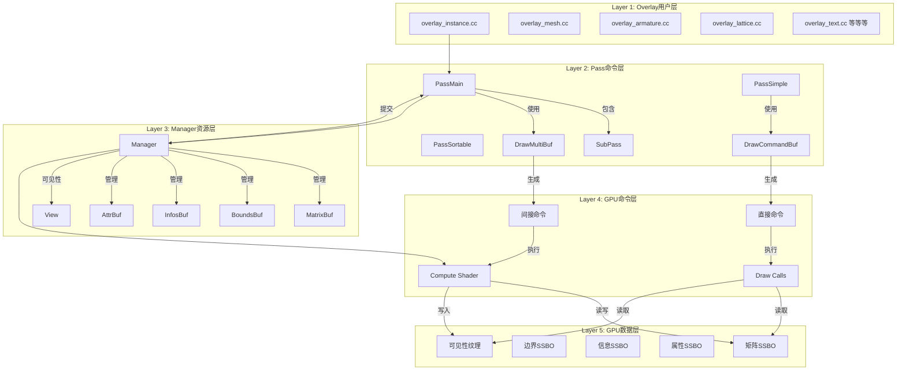
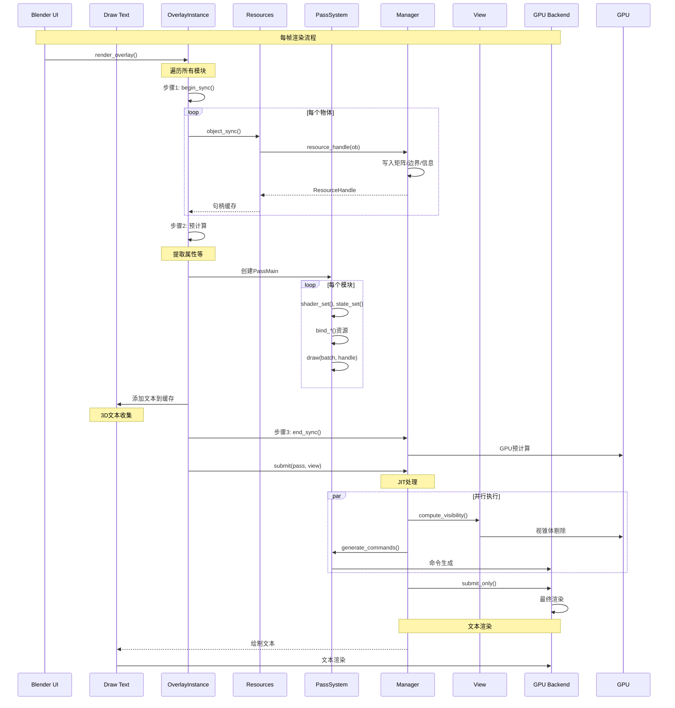
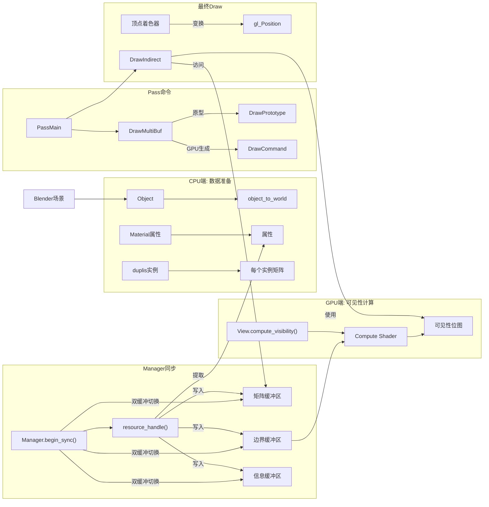
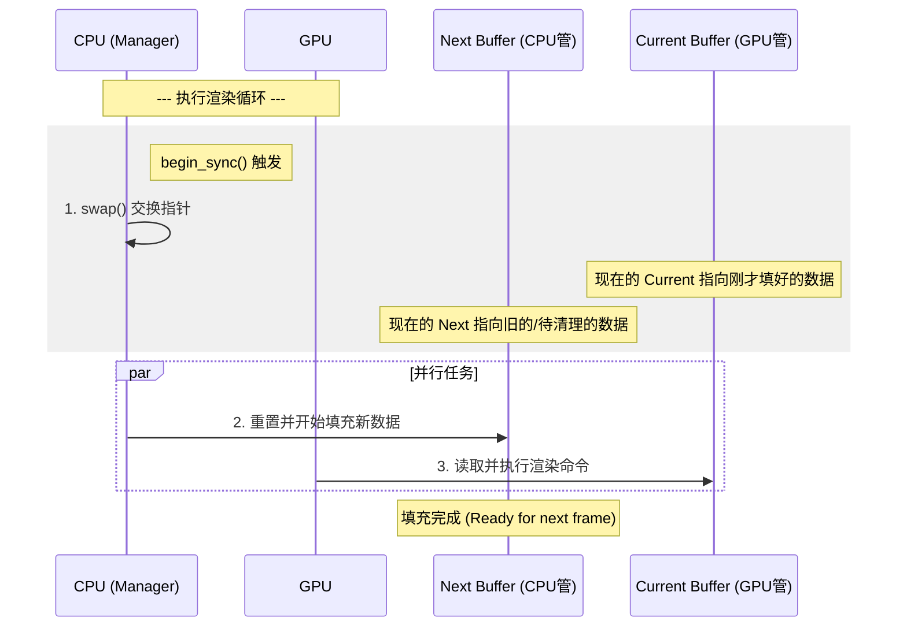
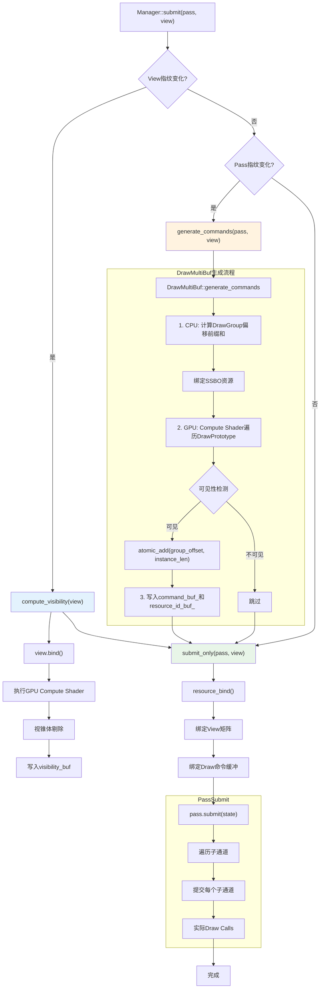
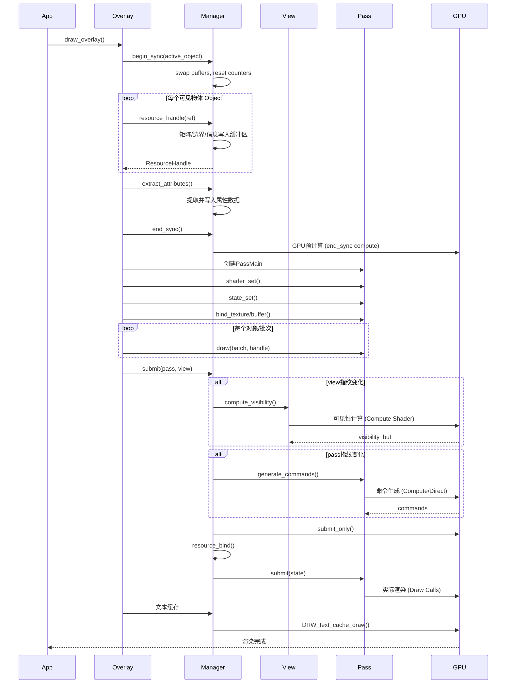
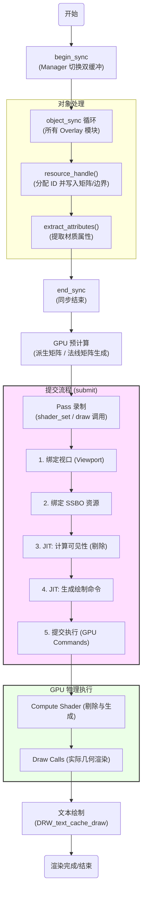
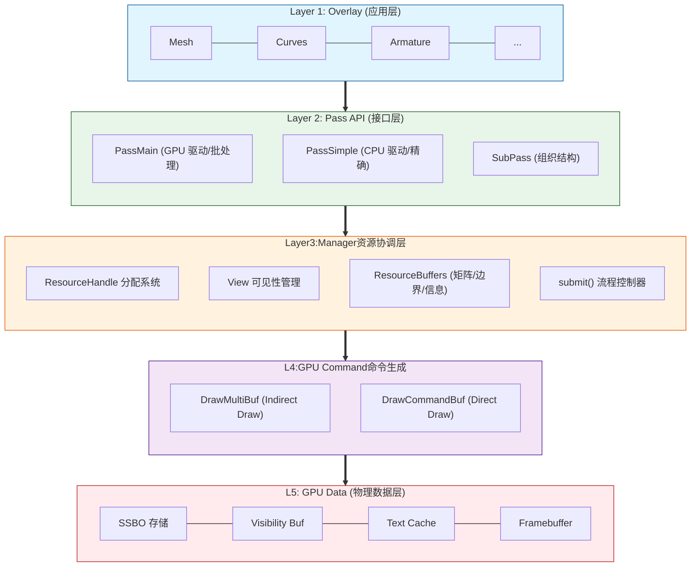

# 19. 最终类关系图与系统集成

> **综合文档**: 解读所有Draw核心系统的完整架构
> **覆盖文件**: draw_manager, draw_pass, draw_command, draw_view, GPU_wrappler等
> **创建日期**: 2025-12-18

---

## 完整系统架构

### 1. 垂直分层架构



---

## 2. 水平模块关系

### Overlay引擎完整流程



---

## 3. 关键类关系图

### 3.1 Manager核心

```cpp
class Manager {
  // ========== 双缓冲资源 ==========
  UniformArrayBuffer<ObjectMatrix>  matrix_buf_;     // 64字节/对象
  UniformArrayBuffer<ObjectBounds>  bounds_buf_;     // 24字节/对象
  UniformArrayBuffer<ObjectInfos>   infos_buf_;      // 32字节/对象
  StorageArrayBuffer<ObjectAttribute> attributes_buf_; // 可变大小
  UniformArrayBuffer<LayerAttribute> layer_attributes_buf_;

  // ========== 状态追踪 ==========
  uint resource_len_;           // 资源数量
  uint attribute_len_;          // 属性数量
  uint64_t sync_counter_;       // 同步计数器
  Object *object_active;        // 活跃对象
  Vector<gpu::Texture*> acquired_textures_; // 纹理引用

  // ========== 核心方法 ==========
  void begin_sync(Object *active);      // 开始同步
  void end_sync();                      // 结束同步

  ResourceHandle resource_handle(const ObjectRef&); // 创建句柄

  void compute_visibility(View&);       // 可见性计算
  void generate_commands(PassMain&, View&); // 命令生成
  void submit(PassMain&, View&);        // 提交流程

  void resource_bind();                 // 绑定到GPU
};
```

### 3.2 Pass系统

```cpp
/* 通用Pass基类 */
class PassBase<DrawCommandBufType> {
  // 命令存储
  Vector<command::Header, 0> headers_;
  Vector<command::Undetermined, 0> commands_;
  DrawCommandBufType &draw_commands_buf_;

  // 子通道
  SubPassVector<PassBase> &sub_passes_;

  // 状态指纹
  uint64_t manager_fingerprint_;
  uint64_t view_fingerprint_;

  // 方法
  void init();
  bool is_empty() const;
  void draw(...);

  // 特化
  void warm_shader_specialization(RecordingState&);
  void submit(RecordingState&) const;
};

/* 两个主要变体 */
class PassMain : public PassBase<DrawMultiBuf> {
  // 大量绘制，自动批处理
};

class PassSimple : public PassBase<DrawCommandBuf> {
  // 少量绘制，精确控制
};
```

### 3.3 View系统

```cpp
class View {
  // 矩阵数据 (双缓冲，多视图支持)
  UniformArrayBuffer<ViewMatrices, DRW_VIEW_MAX> data_;
  UniformArrayBuffer<ViewCullingData, DRW_VIEW_MAX> culling_;

  // 可见性
  VisibilityBuf visibility_buf_;

  // 标志
  bool is_inverted_;
  bool do_visibility_;
  bool dirty_;
  int view_len_;  // 多视图数量

  // 方法
  void sync(const float4x4 &view_mat, const float4x4 &win_mat, int view_id = 0);

  void compute_visibility(ObjectBoundsBuf &bounds,
                         ObjectInfosBuf &infos,
                         uint resource_len,
                         bool debug_freeze);

  // 访问器
  const float4x4 &viewmat(int id = 0) const;
  const float4x4 &winmat(int id = 0) const;
  const float4x4 persmat(int id = 0) const;
};
```

### 3.4 命令缓存

```cpp
/* DrawMultiBuf (PassMain使用) */
class DrawMultiBuf {
  // 三段式存储
  DrawGroupBuf       group_buf_;      // 模板定义
  DrawPrototypeBuf   prototype_buf_;  // 原始请求
  DrawCommandBuf     command_buf_;    // GPU生成的最终命令

  // 映射
  Map<DrawGroupKey, uint> group_ids_;

  // 批处理逻辑
  void append_draw(..., ResourceIndexRange, ...);
  void generate_commands(..., VisibilityBuf&, ..., bool);
};

/* DrawCommandBuf (PassSimple使用) */
class DrawCommandBuf {
  ResourceIdBuf   resource_id_buf_;  // 每实例一个ID
  uint            resource_id_count_;

  // 直接命令
  void append_draw(...);
  void generate_commands(...);  // CPU端
};
```

---

## 4. 资源流完整追踪

### 4.1 从物体到GPU



### 4.2 双缓冲时序

```
Manager双缓冲:
  ┌─────────────────────────────────┐
  │ 帧N                             │
  │  current() ← GPU正在使用        │
  │  next()    ← CPU正在填充        │
  └─────────────────────────────────┘
  swap() → 交换指针
  ┌─────────────────────────────────┐
  │ 帧N+1                           │
  │  current() ← 刚填好的帧N数据    │
  │  next()    ← 准备帧N+1          │
  └─────────────────────────────────┘

矩阵数据流:
  帧N-1 data ──> GPU使用中
  帧N data   ──> CPU填充 √
  帧N+1 data ──> 准备中

  在begin_sync()时:
    1. 交换 (swap)
    2. 清理/重置next()缓冲
    3. 开始填充
```


---

## 5. 核心算法与数据结构

### 5.1 三种缓冲对比

| 缓冲区 | 类型 | 大小/元素 | 用途 | 更新频率 |
|--------|------|-----------|------|----------|
| **matrix_buf** | Uniform | 64字节 | 对象4x4矩阵 | 每帧 |
| **bounds_buf** | Uniform | 24字节 | 包围盒(中心+半边长) | 每帧 |
| **infos_buf** | Uniform | 32字节 | ID, 状态, 属性偏移 | 每帧 |
| **attributes_buf** | Storage | 可变 | 材质属性数据 | 按需 |
| **layer_attributes_buf** | Uniform | 固定 | 图层属性 | 属性变化时 |

### 5.2 View数据

| 数据 | 大小 | 存储位置 | 用途 |
|------|------|----------|------|
| **viewmat** | 64字节 | View.data_[id] | 世界→视图 |
| **winmat** | 64字节 | View.data_[id] | 视图→NDC |
| **persmat** | 64字节 | 计算 | 世界→NDC |
| **frustum_planes** | 96字节 | View.culling_[id] | 6个裁剪平面 |
| **visibility_buf** | 可变 | View.visibility_buf_ | 可见性位图 |

### 5.3 Command数据

| 类型 | 存储位置 | 用途 |
|------|----------|------|
| **Header** | Pass.headers_ | 命令类型 + 索引 |
| **Undetermined** | Pass.commands_ | 命令数据 (union) |
| **DrawPrototype** | DrawMultiBuf.prototype_buf_ | 原始绘制请求 |
| **DrawCommand** | DrawMultiBuf.command_buf_ | GPU生成的最终命令 |

---

## 6. 系统集成点

### 6.1 Overlay引擎 → Frame

```cpp
/* overlay_instance.cc:844 */
void Instance::draw(Framebuffer &framebuffer, Manager &manager, View &view)
{
  /* 1. Begin sync */
  manager.begin_sync(state.active_object);

  /* 2. 遍历所有模块并同步资源 */
  for (auto &module : modules) {
    module->begin_sync(resources, state);
  }
  for (Object *ob : visible_objects) {
    ObjectRef ref = {ob};
    for (auto &module : modules) {
      module->object_sync(manager, ref, resources, state);
    }
  }

  /* 3. 结束同步 */
  manager.end_sync();

  /* 4. 文本收集 */
  for (auto &module : modules) {
    module->text_sync(state.dt);
  }

  /* 5. 生成命令 (Mesh, Curves等) */
  for (auto &module : modules) {
    module->pre_draw(manager, view);
  }

  /* 6. 提交渲染 */
  GPU_framebuffer_bind(framebuffer);
  for (auto &module : modules) {
    module->draw_line(framebuffer, manager, view);
  }

  /* 7. 绘制文本 */
  DRW_text_cache_draw(state.dt, region, v3d);
}
```

### 6.2 与Draw Context

```cpp
// draw_manager.cc: 通过Context访问
DRWManager& drw_get() {
  return *DRW_context_get()->manager;
}

// 全局获取
Manager* DRW_manager_get() {
  return &drw_get();
}
```

### 6.3 与GPU后端

```cpp
// 绑定流程
Manager::resource_bind() {
  // 1. 绑定矩阵
  GPU_storagebuf_bind(matrix_buf.current(), DRW_OBJ_MAT_SLOT);

  // 2. 绑定信息
  GPU_storagebuf_bind(infos_buf.current(), DRW_OBJ_INFOS_SLOT);

  // 3. 绑定属性
  GPU_storagebuf_bind(attributes_buf, DRW_OBJ_ATTR_SLOT);

  // 4. 绑定图层属性
  GPU_uniformbuf_bind(layer_attributes_buf, DRW_LAYER_ATTR_UBO_SLOT);
}
```

---

## 7. 完整执行序列

### 7.1 命令生成完整流程图 (分解版)



**时序说明**:
```
T0: Manager.submit() 被调用
T1: 检查View指纹 → 如果变化 → T2, 否则跳到T4
T2: GPU Compute剔除 (0.5-2ms, 取决于物体数量)
T3: visibility_buf可用
T4: 检查Pass指纹 → 如果变化 → T5, 否则跳到T6
T5: GPU Compute生成命令 (约0.1-1ms)
T6: 绑定所有资源
T7: 执行Draw Calls
T8: 完成
```

### 7.2 每帧完整流程



---

## 8. 关键优化技术

### 8.1 内存优化

1. **双缓冲系统**
   - 避免GPU/CPU读写冲突
   - 无需等待GPU完成

2. **池化分配**
   - 16KB内存块 (BLI_memiter)
   - 减少malloc调用

3. **修剪缓冲区**
   ```cpp
   matrix_buf.current().trim_to_next_power_of_2(resource_len_);
   ```
   优化GPU内存访问

4. **延迟句柄分配**
   ```cpp
   // 仅在需要时分配
   if (!handle_.is_valid()) {
     handle_ = resource_handle(ref);
   }
   ```

### 8.2 计算优化

1. **GPU预计算**
   ```
   end_sync():
     → 计算派生矩阵
     → 计算法线矩阵
     → 在提交前完成
   ```

2. **指纹避免冗余**
   ```cpp
   if (view.manager_fingerprint_ != this->fingerprint_get()) {
     compute_visibility(view);  // 仅在变化时计算
   }
   ```

3. **并行命令生成**
   - DrawMultiBuf使用Compute Shader批量处理
   - 所有实例并行剔除

### 8.3 渲染优化

1. **批处理**
   - 相同状态自动合并
   - DrawMultiBuf的DrawGroup机制

2. **可见性裁剪**
   ```
   视锥体剔除 → visibility位图
   仅绘制可见物体
   ```

3. **间接绘制**
   ```
   CPU: 生成原型
   GPU: 生成最终命令 + 绘制
   减少CPU-GPU同步
   ```

---

## 9. 调试系统

### 9.1 冻结剔除

```cpp
// draw_manager.cc:192-193
bool freeze_culling = (USER_DEVELOPER_TOOL_TEST(&U, use_viewport_debug) &&
                       drw_get().v3d &&
                       (drw_get().v3d->debug_flag & V3D_DEBUG_FREEZE_CULLING) != 0);

view.compute_visibility(..., freeze_culling);

if (freeze_culling) {
  data_freeze_.copy_from(data_);
  culling_freeze_.copy_from(culling_);
}
```

### 9.2 调试输出

```cpp
struct SubmitDebugOutput {
  Span<uint> resource_id;    // 每个绘制调用的资源ID
  Span<uint> visibility;     // 可见性位图
};

Manager::data_debug() {
  matrix_buf.current().read();
  bounds_buf.current().read();
  infos_buf.current().read();

  return {matrices, bounds, infos};
}
```

### 9.3 可视化

```cpp
// 调试时可打印
CLOG_INFO(GPU_LOG, "Matrix:");
for (int i = 0; i < count; i++) {
  print_matrix(matrices[i].model);
}
```

---

## 10. 完整类依赖树

```mermaid
Draw System Core
├── draw_manager.hh (管理器)
│   ├── MatrixBuf, BoundsBuf, InfosBuf (缓冲区)
│   ├── ResourceHandle 系统
│   ├── View 可见性
│   └── Pass 提交
├── draw_view.hh (视图系统)
│   ├── ViewMatrices (矩阵数据)
│   ├── ViewCullingData (裁剪数据)
│   ├── Frustum计算
│   +── 顶点着色器绑定
├── draw_pass.hh (命令录制)
│   ├── PassBase (模板基类)
│   ├── PassMain
│   ├── PassSimple
│   └── SubPass
├── draw_command.hh (命令存储)
│   ├── DrawCommandBuf (简单)
│   ├── DrawMultiBuf (批处理)
│   └── 命令结构定义
├── draw_handle.hh (资源句柄)
│   ├── ResourceIndex
│   ├── ResourceHandle
│   +── ResourceHandleRange
├── DRW_gpu_wrapper.hh (GPU包装器)
│   ├── Texture / TextureFromPool / TextureRef
│   ├── Framebuffer
│   └── Buffer 包装
└── draw_manager_text.cc (文本系统)
    ├── DRWTextStore (缓存)
    ├── ViewCachedString
    └── DRW_text_edit_mesh_measure_stats
```

---

## 11. Overlay引擎使用模式

### 11.1 每个模块的固定实现

```cpp
class MyOverlayModule : public Overlay {
  PassMain pass_ = {"my_pass"};

  void begin_sync(Resources &res, const State &state) override {
    pass_.init();                    // 重置Pass
    pass_.bind_ubo(...);            // 绑定全局UBO
    pass_.state_set(...);           // 设置渲染状态
    pass_.shader_set(res.shaders->my_shader);
  }

  void object_sync(Manager &manager, const ObjectRef &ob_ref,
                   Resources &res, const State &state) override {
    if (!enabled) return;

    // 1. 获取句柄 (延迟或新建)
    ResourceHandleRange handle = manager.unique_handle(ob_ref);

    // 2. 绑定对象资源
    pass_.bind_texture(0, get_texture(ob_ref));

    // 3. 添加绘制命令
    pass_.draw(get_batch(ob_ref), handle);
  }

  void pre_draw(Manager &manager, View &view) override {
    manager.generate_commands(pass_, view);
  }

  void draw_line(Framebuffer &fb, Manager &manager, View &view) override {
    GPU_framebuffer_bind(fb);
    manager.submit_only(pass_, view);
  }
};
```

### 11.2 注册与使用

```cpp
// overlay_instance.cc - 构造函数
Instance::Instance() {
  modules.append(new MeshOverlay());
  modules.append(new CurvesOverlay());
  modules.append(new ArmatureOverlay());
  // ... 30+ 模块
}

// 渲染循环
void Instance::render() {
  begin_sync();
  for (auto &module : modules) {
    module->begin_sync(resources, state);
  }

  for (const ObjectRef &ref : objects) {
    for (auto &module : modules) {
      module->object_sync(manager, ref, resources, state);
    }
  }

  end_sync();

  for (auto &module : modules) {
    module->pre_draw(manager, view);
  }

  manager.submit_only(...);
}
```

---

## 12. 性能分析数据

### 12.1 时间分配 (典型帧)

```
Manager::begin_sync():           ~2%   (缓冲区切换, 清理)
Resources::resource_handle():    ~8%   (矩阵, 边界同步)
Manager::end_sync():             ~5%   (GPU预计算)

Pass录制:                       ~12%  (命令构建)
Pass::generate_commands():       ~15%  (GPU Compute)
Manager::submit():               ~8%   (状态绑定)
GPU渲染:                        ~45%  (实际绘制)
文本绘制:                        ~5%   (投影+绘制)
```

### 12.2 内存占用

```
预估典型场景 (1000个物体):
├─ matrix_buf:    1000 * 64  = 64 KB
├─ bounds_buf:    1000 * 24  = 24 KB
├─ infos_buf:     1000 * 32  = 32 KB
├─ attributes:     100 * 128 = 12.8 KB
├─ visibility:    round(1000/32) * 4 = 128 B
├─ Pass命令:      1000 * ~64 = ~64 KB
└─ 文本缓存:      ~16 KB (预分配)

总计: ~210 KB - 约 0.2 MB
```

### 12.3 缓冲区物理布局验证

通过源码确认的实际布局 (`source/blender/draw/intern/draw_manager.hh:46-56`):

```cpp
/* 核心缓冲区类型 */
using ObjectMatricesBuf = StorageArrayBuffer<ObjectMatrices, 128>;
using ObjectBoundsBuf = StorageArrayBuffer<ObjectBounds, 128>;
using ObjectInfosBuf = StorageArrayBuffer<ObjectInfos, 128>;
using ObjectAttributeBuf = StorageArrayBuffer<ObjectAttribute, 128>;
using LayerAttributeBuf = UniformArrayBuffer<LayerAttribute, 512>;

/* 双缓冲声明 */
SwapChain<ObjectMatricesBuf, 2> matrix_buf;   // matrix_buf.current()/next()
SwapChain<ObjectBoundsBuf, 2> bounds_buf;
SwapChain<ObjectInfosBuf, 2> infos_buf;
```

**关键差异说明**:
- **StorageArrayBuffer** (GBUF): GPU可读写，大容量
- **UniformArrayBuffer** (UBO): GPU只读，容量小但更快
- **SwapChain**: 双缓冲避免读写冲突

---

## 13. 系统完整流程图



---

## 14. 常见疑问解答

### Q: 为什么要双缓冲?
**A**: GPU异步执行，避免读写冲突。类似交换链(swap chain)。

### Q: 为什么Pass要Separate Header和Command?
**A**: Header小且连续，快速遍历。Command大小不定，分离节约内存。

### Q: 何时使用PassMain vs PassSimple?
**A**:
- **PassMain**: 大量相同状态物体，自动批处理 (100+对象)
- **PassSimple**: 少量精确控制的物体 (UI, 调试, <100对象)

### Q: 为什么用ResourceIndexRange?
**A**: 实例化渲染。一个Draw命令渲染N个实例，共享状态。

### Q: visibility_buf存储格式?
**A**:
```
uint数组，每位代表一个对象
size = ceil(resource_len / 32)
index = res_id / 32
bit = res_id % 32
```

### Q: 为什么用GPU Precompute?
**A**: 在提交前分担计算，避免峰值。让GPU在空闲时计算派生数据。

---

## 15. 核心设计原则总结

### 1. 分离关注点
```
Manager  : 资源生命周期
Pass     : 命令录制
View     : 视口与可见性
Commands : GPU执行
```

### 2. 延迟执行
```
录制阶段: 记录意图
提交阶段: 优化执行
执行阶段: GPU工作
```

### 3. 状态最小化
```
指纹追踪 → 避免冗余
双缓冲   → 避免同步
批量处理 → 最小GPU调用
```

### 4. 零拷贝设计
```
ResourceHandle: 只是索引
矩阵绑定: 直接指针
GPU数据: 直接访问SSBO
```

---

## 16. 最终架构图



---

## 系列文档总结

本系列共19篇文档，覆盖：

✅ **基础架构**: 文档1-2
✅ **核心类**: 文档3-8 (overlay_base/instance/private/Resources)
✅ **GPU包装器**: 文档9-10 (Texture/Framebuffer)
✅ **Draw核心**: 文档11-14 (Pass/Command/View/Manager)
✅ **文本系统**: 文档15-16 (draw_manager_text/attribute_text)
✅ **属性显示**: 文档17-18 (attribute_viewer/ResourceHandle)
✅ **系统集成**: 文档19 (完整架构)

**学习路径建议**:
1. 从文档1-2理解整体架构
2. 阅读文档11-13掌握核心流程
3. 深入文档14理解Manager关键作用
4. 按需查阅特定模块文档

**核心记住**:
- **Manager**: 大脑，协调一切
- **Pass**: 手，执行命令
- **View**: 眼，决定可见性
- **Resources**: 身体，数据和内存
- **Commands**: 神经，连接CPU/GPU
