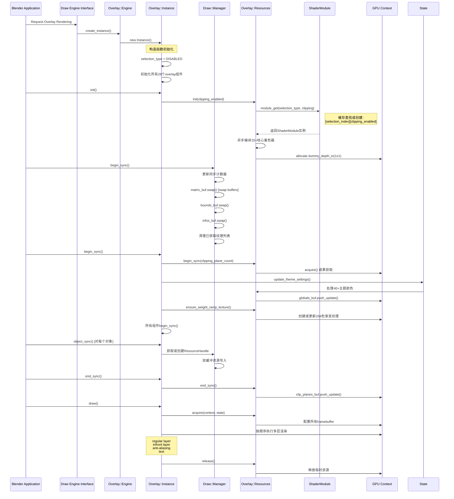

# Overlay引擎架构详解 - 引擎初始化流程

**文档版本**: 2.0
**创建日期**: 2025-12-18
**Blender版本**: 4.4+
**关注点**: Overlay引擎的初始化流程，Manager/View/Pass的初始化序列，GPU上下文准备，Shader模块加载，Framebuffer创建，资源缓存初始化，双缓冲系统初始化

## 目录

1. [Overlay引擎概述](#overlay引擎概述)
2. [引擎创建与注册](#引擎创建与注册)
3. [Manager/View/Pass初始化序列](#managerviewpass初始化序列)
4. [GPU上下文准备](#gpu上下文准备)
5. [Shader模块加载](#shader模块加载)
6. [Framebuffer创建与管理](#framebuffer创建与管理)
7. [资源缓存初始化](#资源缓存初始化)
8. [双缓冲系统初始化](#双缓冲系统初始化)
9. [RAII设计模式分析](#raii设计模式分析)
10. [初始化序列图](#初始化序列图)

## Overlay引擎概述

Overlay引擎是Blender实时渲染管道中的关键组件，负责在3D视图上绘制各种交互式覆盖层，包括网格线框、变换控制柄、选择高亮、坐标轴显示、UI文本等。与其他渲染引擎（如EEVEE、Workbench）不同，Overlay引擎专门专注于辅助显示信息的绘制，而非场景几何体的主渲染。

### 核心特点
- **多层次渲染**: 支持regular层和in-front层的分离渲染
- **选择系统**: 内置对象选择和ID渲染支持
- **状态管理**: 复杂的状态管理，包括剪切、X射线模式等
- **高性能**: 使用GPU计算着色器进行可见性计算和资源优化

## 引擎创建与注册

### 引擎注册机制

Overlay引擎通过标准的Blender Draw Engine接口注册。核心注册文件位于：

**关键文件**:
- `E:\blender-git\blender\source\blender\draw\engines\overlay\overlay_engine.h` (主定义)
- `E:\blender-git\blender\source\blender\draw\engines\overlay\overlay_engine.cc` (实现)

```cpp
// overlay_engine.h:15-19
struct Engine : public DrawEngine::Pointer {
  DrawEngine *create_instance() final;
  static void free_static();
};

// overlay_engine.cc:17-20
DrawEngine *Engine::create_instance()
{
  return new Instance();
}
```

### 构造函数模式分析

**Instance类构造函数** (`overlay_instance.hh:114-115`)
```cpp
// 默认构造函数 - 用于正常的Overlay渲染
Instance() : selection_type_(select::SelectionType::DISABLED) {}

// 选择模式构造函数 - 用于对象选择和选择缓冲渲染
Instance(const SelectionType selection_type) : selection_type_(selection_type) {}
```

这种双重构造函数模式体现了RAII原则：
- 自动管理选择类型状态
- 确保资源在对象创建时正确初始化
- 支持选择和正常渲染的复用

### 继承体系

```cpp
class Instance : public DrawEngine {
    // 继承自DrawEngine基类，实现5个核心虚函数:
    // init(), begin_sync(), object_sync(), end_sync(), draw()
}
```

**DrawEngine基类定义** (`DRW_render.hh:68-89`)
```cpp
struct DrawEngine {
    virtual StringRefNull name_get() = 0;
    virtual void init() = 0;
    virtual void begin_sync() = 0;
    virtual void object_sync(ObjectRef &ob_ref, Manager &manager) = 0;
    virtual void end_sync() = 0;
    virtual void draw(Manager &manager) = 0;
};
```

## Manager/View/Pass初始化序列

### Manager初始化

**Draw Manager** (`draw_manager.hh:45-313`) 是整个Draw系统的核心协调器。

**Manager构造函数** (`draw_manager.hh:119`)
```cpp
Manager() {}
```

真正的初始化在`begin_sync()`中完成：

**Manager::begin_sync()** (`draw_manager.cc:36-82`)
```cpp
void Manager::begin_sync(Object *object_active)
{
    // 1. 同步计数器更新 (用于指纹验证)
    sync_counter_ = (global_sync_counter_ += 2);

    // 2. 双缓冲交换链交换 - 核心双缓冲机制
    matrix_buf.swap();
    bounds_buf.swap();
    infos_buf.swap();

    // 3. 缓冲区大小调整，确保2的幂次大小
    matrix_buf.current().trim_to_next_power_of_2(resource_len_);
    bounds_buf.current().trim_to_next_power_of_2(resource_len_);
    infos_buf.current().trim_to_next_power_of_2(resource_len_);
    attributes_buf.trim_to_next_power_of_2(attribute_len_);

    // 4. 清理已获取的纹理引用
    for (gpu::Texture *texture : acquired_textures) {
        GPU_texture_free(texture);
    }
    acquired_textures.clear();
    layer_attributes.clear();

    // 5. 零资源初始化 - 确保handle 0总是有效
    resource_handle(float4x4::identity());
}
```

### View初始化

**View类** (`draw_view.hh`) 管理相机和投影矩阵：

```cpp
class View {
    // 每帧更新相机参数
    void bind();
    // GPU计算可见性
    void compute_visibility(...);
    // 视图指纹，用于状态验证
    uint64_t fingerprint_get() const;
};
```

### Pass初始化序列

Overlay引擎定义了多种Pass类型：

```cpp
// overlay_instance.hh:108-112
Grid grid;
AntiAliasing anti_aliasing;
XrayFade xray_fade;

struct OverlayLayer {
    Armatures armatures;
    AttributeViewer attribute_viewer;
    // ... 25个 overlay 组件
} regular{selection_type_}, infront{selection_type_};
```

**begin_sync()执行序列** (`overlay_instance.cc:445-502`)
```cpp
void Instance::begin_sync()
{
    // 1. 获取默认视图并设置相机状态
    View &view = View::default_get();
    state.camera_position = view.viewinv().location();
    state.camera_forward = view.viewinv().z_axis();

    // 2. 文本缓存重建
    DRW_text_cache_destroy(state.dt);
    state.dt = DRW_text_cache_create();

    // 3. 资源层开始同步
    resources.begin_sync(state.clipping_plane_count);

    // 4. 全局组件同步 (background, cursor等)
    background.begin_sync(resources, state);
    cursor.begin_sync(resources, state);
    // ... 其他全局组件

    // 5. 层级组件同步 (regular + infront)
    auto begin_sync_layer = [&](OverlayLayer &layer) {
        layer.armatures.begin_sync(resources, state);
        // ... 25个 overlay 层组件
    };
    begin_sync_layer(regular);
    begin_sync_layer(infront);

    // 6. 特殊渲染组件同步
    grid.begin_sync(resources, state);
    anti_aliasing.begin_sync(resources, state);
    xray_fade.begin_sync(resources, state);
}
```

## GPU上下文准备

### GPU绑定流程

**Resources::acquire()** (`overlay_private.hh:766-845`) 是GPU上下文准备的核心：

```cpp
void Resources::acquire(const DRWContext *draw_ctx, const State &state)
{
    // 1. 获取默认GPU纹理列表
    DefaultTextureList &viewport_textures = *draw_ctx->viewport_texture_list_get();
    DefaultFramebufferList &viewport_framebuffers = *draw_ctx->viewport_framebuffer_list_get();

    // 2. 绑定外部纹理引用 (不创建，只是包装)
    this->depth_tx.wrap(viewport_textures.depth);
    this->depth_in_front_tx.wrap(viewport_textures.depth_in_front);
    this->color_overlay_tx.wrap(viewport_textures.color_overlay);
    this->color_render_tx.wrap(viewport_textures.color);

    // 3. 获取帧缓冲区引用
    this->render_fb = viewport_framebuffers.default_fb;
    this->render_in_front_fb = viewport_framebuffers.in_front_fb;

    // 4. 根据X射线模式分配深度目标
    int2 render_size = int2(this->depth_tx.size());

    if (state.xray_enabled) {
        // X射线模式: 分配独立深度缓冲区
        this->xray_depth_tx.acquire(render_size, gpu::TextureFormat::SFLOAT_32_DEPTH_UINT_8);
        this->depth_target_tx.wrap(this->xray_depth_tx);
        this->xray_depth_in_front_tx.acquire(render_size, gpu::TextureFormat::SFLOAT_32_DEPTH_UINT_8);
        this->depth_target_in_front_tx.wrap(this->xray_depth_in_front_tx);
    } else {
        // 正常模式: 使用默认深度缓冲区，必要时创建
        if (!this->depth_in_front_tx.is_valid()) {
            this->depth_in_front_alloc_tx.acquire(render_size, gpu::TextureFormat::SFLOAT_32_DEPTH_UINT_8);
            this->depth_in_front_tx.wrap(this->depth_in_front_alloc_tx);
        }
        this->depth_target_tx.wrap(this->depth_tx);
        this->depth_target_in_front_tx.wrap(this->depth_in_front_tx);
    }

    // 5. 为特殊情况创建覆盖纹理
    if (!this->color_overlay_tx.is_valid()) {
        // 选择模式或无覆盖纹理时创建1x1虚拟纹理
        this->color_overlay_alloc_tx.acquire(int2(1, 1), gpu::TextureFormat::SRGBA_8_8_8_8);
        this->color_render_alloc_tx.acquire(int2(1, 1), gpu::TextureFormat::SRGBA_8_8_8_8);
        // ...
    } else {
        // 正常情况分配正确大小的覆盖纹理
        eGPUTextureUsage usage = GPU_TEXTURE_USAGE_SHADER_READ |
                                GPU_TEXTURE_USAGE_SHADER_WRITE |
                                GPU_TEXTURE_USAGE_ATTACHMENT;
        this->line_tx.acquire(render_size, gpu::TextureFormat::UNORM_8_8_8_8, usage);
        this->overlay_tx.acquire(render_size, gpu::TextureFormat::SRGBA_8_8_8_8, usage);
    }

    // 6. 创建帧缓冲区配置
    configure_framebuffers();
}
```

### 资源绑定机制

**Manager::resource_bind()** (`draw_manager.cc:161-167`)
```cpp
void Manager::resource_bind()
{
    // 绑定核心资源缓冲区到GPU着色器槽位
    GPU_storagebuf_bind(matrix_buf.current(), DRW_OBJ_MAT_SLOT);
    GPU_storagebuf_bind(infos_buf.current(), DRW_OBJ_INFOS_SLOT);
    GPU_storagebuf_bind(attributes_buf, DRW_OBJ_ATTR_SLOT);
    GPU_uniformbuf_bind(layer_attributes_buf, DRW_LAYER_ATTR_UBO_SLOT);
}
```

## Shader模块加载

### ShaderModule架构

**ShaderModule** (`overlay_private.hh:428-576`) 是Overlay引擎的着色器管理器：

```cpp
class ShaderModule {
private:
    // 静态缓存：[2][2] → [选择类型][剪切启用]
    using StaticCache = gpu::StaticShaderCache<ShaderModule>[2][2];

    const SelectionType selection_type_;
    const bool clipping_enabled_;

public:
    // 51个静态着色器定义
    StaticShader anti_aliasing = {"overlay_antialiasing"};
    StaticShader armature_degrees_of_freedom = shader_clippable("overlay_armature_dof");
    // ... 其他49个着色器

    // 模块获取和释放
    static ShaderModule &module_get(SelectionType selection_type, bool clipping_enabled);
    static void module_free();

private:
    ShaderModule(const SelectionType selection_type, const bool clipping_enabled);

    // 着色器名称构建器
    StaticShader shader_clippable(const char *create_info_name);
    StaticShader shader_selectable(const char *create_info_name);
    StaticShader shader_selectable_no_clip(const char *create_info_name);
};
```

### 懒编译机制

**Resources::init()** (`overlay_private.hh:684-758`)
```cpp
void Resources::init(bool clipping_enabled)
{
    // 获取或创建ShaderModule实例 (从静态缓存)
    shaders = &overlay::ShaderModule::module_get(selection_type, clipping_enabled);

    // 异步预编译核心着色器 (async compile)
    shaders->anti_aliasing.ensure_compile_async();
    shaders->armature_degrees_of_freedom.ensure_compile_async();
    shaders->armature_envelope_fill.ensure_compile_async();
    // ... 只编译最常用的25个着色器
}
```

### 着色器变体管理

**变体生成逻辑** (`overlay_shader.cc:13-48`)
```cpp
// 根据配置添加后缀，生成不同版本的着色器
StaticShader shader_clippable(const char *create_info_name)
{
    std::string name = create_info_name;
    if (clipping_enabled_) {
        name += "_clipped";  // 添加剪切版本
    }
    return StaticShader(name);
}

StaticShader shader_selectable(const char *create_info_name)
{
    std::string name = create_info_name;
    if (selection_type_ != SelectionType::DISABLED) {
        name += "_selectable";  // 添加选择版本
    }
    if (clipping_enabled_) {
        name += "_clipped";     // 可选剪切版本
    }
    return StaticShader(name);
}
```

## Framebuffer创建与管理

### Framebuffer架构设计

Overlay引擎管理多个FrameBuffer对象，支持不同渲染路径：

**FrameBuffer声明** (`overlay_private.hh:592-607`)
```cpp
struct Resources {
    // 基础叠加帧缓冲区
    Framebuffer overlay_color_only_fb;        // 仅彩色
    Framebuffer overlay_line_only_fb;         // 仅线数据
    Framebuffer overlay_fb;                   // 深度 + 彩色
    Framebuffer overlay_line_fb;              // 深度 + 彩色 + 线数据

    // In-Front层帧缓冲区
    Framebuffer overlay_in_front_fb;          // In-Front 深度 + 彩色
    Framebuffer overlay_line_in_front_fb;     // In-Front 深度 + 彩色 + 线数据

    // 输出帧缓冲区
    Framebuffer overlay_output_color_only_fb; // 输出彩色
    Framebuffer overlay_output_fb;            // 深度 + 输出彩色

    // 渲染帧缓冲区 (EEVEE/Workbench兼容)
    gpu::FrameBuffer *render_fb = nullptr;
    gpu::FrameBuffer *render_in_front_fb = nullptr;
};
```

### FrameBuffer配置流程

**framebuffer配置** (`overlay_private.hh:812-844`)
```cpp
// 情况1: 选择模式 - 只需要深度，无实际颜色输出
if (!this->color_overlay_tx.is_valid()) {
    this->overlay_fb.ensure(GPU_ATTACHMENT_TEXTURE(this->depth_target_tx));
    this->overlay_line_fb.ensure(GPU_ATTACHMENT_TEXTURE(this->depth_target_tx));
    this->overlay_in_front_fb.ensure(GPU_ATTACHMENT_TEXTURE(this->depth_target_tx));
    this->overlay_line_in_front_fb.ensure(GPU_ATTACHMENT_TEXTURE(this->depth_target_tx));
}
// 情况2: 正常模式 - 全部附件
else {
    this->overlay_fb.ensure(
        GPU_ATTACHMENT_TEXTURE(this->depth_target_tx),
        GPU_ATTACHMENT_TEXTURE(this->overlay_tx)
    );
    this->overlay_line_fb.ensure(
        GPU_ATTACHMENT_TEXTURE(this->depth_target_tx),
        GPU_ATTACHMENT_TEXTURE(this->overlay_tx),
        GPU_ATTACHMENT_TEXTURE(this->line_tx)  // 线方向数据
    );
    this->overlay_in_front_fb.ensure(
        GPU_ATTACHMENT_TEXTURE(this->depth_target_in_front_tx),
        GPU_ATTACHMENT_TEXTURE(this->overlay_tx)
    );
    this->overlay_line_in_front_fb.ensure(
        GPU_ATTACHMENT_TEXTURE(this->depth_target_in_front_tx),
        GPU_ATTACHMENT_TEXTURE(this->overlay_tx),
        GPU_ATTACHMENT_TEXTURE(this->line_tx)
    );
}

// 专用输出帧缓冲区
this->overlay_line_only_fb.ensure(
    GPU_ATTACHMENT_NONE,  // 无深度附件
    GPU_ATTACHMENT_TEXTURE(this->overlay_tx),
    GPU_ATTACHMENT_TEXTURE(this->line_tx)
);

this->overlay_output_fb.ensure(
    GPU_ATTACHMENT_TEXTURE(this->depth_tx),
    GPU_ATTACHMENT_TEXTURE(this->color_overlay_tx)
);
```

## 资源缓存初始化

### ShapeCache机制

**ShapeCache** (`overlay_private.hh:327-420`) 预编译几何体：

```cpp
class ShapeCache {
private:
    struct BatchDeleter {
        void operator()(gpu::Batch *shader) {
            GPU_BATCH_DISCARD_SAFE(shader);
        }
    };
    using BatchPtr = std::unique_ptr<gpu::Batch, BatchDeleter>;

public:
    // 骨骼几何体
    BatchPtr bone_box;
    BatchPtr bone_box_wire;
    BatchPtr bone_envelope;
    BatchPtr bone_octahedron;
    // ... 30+ 预编译几何体

    ShapeCache();  // 构造函数中创建所有几何体
};
```

### 权重渐变纹理缓存

**权重颜色渐变** (`overlay_instance.cc:145-220`)
```cpp
void Instance::ensure_weight_ramp_texture()
{
    // 基于用户偏好设置生成1D颜色渐变纹理
    bool user_weight_ramp = (U.flag & USER_CUSTOM_RANGE) != 0;

    // 256×1 像素渐变纹理
    constexpr int res = 256;
    float pixels[res][4];
    for (int i = 0; i < res; i++) {
        evaluate_weight_to_color(i / 255.0f, pixels[i]);
        pixels[i][3] = 1.0f;
    }

    // 转换为8位RGBA
    uchar4 pixels_ubyte[res];
    for (int i = 0; i < res; i++) {
        unit_float_to_uchar_clamp_v4(pixels_ubyte[i], pixels[i]);
    }

    // GPU纹理上传 - 只在需要时创建
    resources.weight_ramp_tx.ensure_1d(
        gpu::TextureFormat::SRGBA_8_8_8_8,
        res,
        GPU_TEXTURE_USAGE_SHADER_READ
    );
    GPU_texture_update(resources.weight_ramp_tx, GPU_DATA_UBYTE, pixels_ubyte);
}
```

### 主题设置缓存

**主题颜色提取 - 高性能批量处理** (`overlay_instance.cc:242-443`)
```cpp
void Resources::update_theme_settings(...)
{
    // 一次性设置所有40+主题颜色
    ui::theme::get_color_4fv(TH_WIRE, gb.colors.wire);
    ui::theme::get_color_4fv(TH_WIRE_EDIT, gb.colors.wire_edit);
    ui::theme::get_color_4fv(TH_ACTIVE, gb.colors.active_object);
    // ... 40+ 颜色设置

    // 统一颜色空间转换: sRGB → Linear RGB
    {
        float4 *color = reinterpret_cast<float4 *>(&gb.colors);
        float4 *color_end = color + (sizeof(gb.colors) / sizeof(float4));
        do {
            srgb_to_linearrgb_v4(&color->x, &color->x);
        } while (++color <= color_end);
    }

    // 像素尺寸适配
    {
        float *size = reinterpret_cast<float *>(&gb.sizes);
        float *size_end = size + (sizeof(gb.sizes) / sizeof(float));
        do {
            *size *= U.pixelsize;
        } while (++size <= size_end);
    }

    globals_buf.push_update();  // 一次性上传到GPU
}
```

### 临时缓冲区管理

**深度纹理临时分配** (`overlay_instance.cc:135-142`)
```cpp
{
    eGPUTextureUsage usage = GPU_TEXTURE_USAGE_SHADER_READ;
    // 创建1×1虚拟深度纹理用于缺失深度绑定的回退
    if (resources.dummy_depth_tx.ensure_2d(
        gpu::TextureFormat::SFLOAT_32_DEPTH, int2(1, 1), usage))
    {
        float data = 1.0f;
        GPU_texture_update_sub(resources.dummy_depth_tx, GPU_DATA_FLOAT,
                              &data, 0, 0, 0, 1, 1, 1);
    }
}
```

## 双缓冲系统初始化

### SwapChain架构

**Manager双缓冲机制** (`draw_manager.hh:78-81`)
```cpp
class Manager {
    // 关键: 双缓冲交换链，实现无缝GPU资源更新
    SwapChain<ObjectMatricesBuf, 2> matrix_buf;
    SwapChain<ObjectBoundsBuf, 2> bounds_buf;
    SwapChain<ObjectInfosBuf, 2> infos_buf;
    // ...
};
```

**SwapChain工作原理**
每个交换链包含2个缓冲区：`current()` 和 `next()`。每一帧通过`swap()`切换角色。

### 同步计数器体系

**全局同步计数器** (`draw_manager.cc:26`)
```cpp
std::atomic<uint32_t> Manager::global_sync_counter_ = 1;

void Manager::begin_sync(Object *object_active)
{
    // 使用原子计数器，确保多线程安全
    sync_counter_ = (global_sync_counter_ += 2);  // 步进2避免0值
}
```

**指纹校验** (`draw_manager.cc:169-173`)
```cpp
uint64_t Manager::fingerprint_get()
{
    // 融合: 同步周期 + 资源数量
    return sync_counter_ | (uint64_t(resource_len_) << 32);
}
```

### GPU资源双缓冲流程

**数据更新与提交** (`draw_manager.cc:114-146`)
```cpp
void Manager::end_sync()
{
    GPU_debug_group_begin("Manager.end_sync");

    // 1. 同步层级属性
    sync_layer_attributes();

    // 2. 上传所有双缓冲数据到GPU
    matrix_buf.current().push_update();  // ← 当前活动缓冲区
    bounds_buf.current().push_update();
    infos_buf.current().push_update();
    attributes_buf.push_update();
    layer_attributes_buf.push_update();

    // 3. GPU计算着色器资源最终化准备
    DRW_submission_start();  // 开始提交阶段

    uint thread_groups = divide_ceil_u(resource_len_, DRW_FINALIZE_GROUP_SIZE);
    gpu::Shader *shader = DRW_shader_draw_resource_finalize_get();
    GPU_shader_bind(shader);

    // 绑定双缓冲资源到计算着色器
    GPU_shader_uniform_1i(shader, "resource_len", resource_len_);
    GPU_storagebuf_bind(matrix_buf.current(), GPU_shader_get_ssbo_binding(shader, "matrix_buf"));
    GPU_storagebuf_bind(bounds_buf.current(), GPU_shader_get_ssbo_binding(shader, "bounds_buf"));
    GPU_storagebuf_bind(infos_buf.current(), GPU_shader_get_ssbo_binding(shader, "infos_buf"));

    // 4. 分发计算着色器进行资源最终化
    GPU_compute_dispatch(shader, thread_groups, 1, 1);
    GPU_memory_barrier(GPU_BARRIER_SHADER_STORAGE);  // 确保数据一致性

    DRW_submission_end();
    GPU_debug_group_end();
}
```

## RAII设计模式分析

### 资源所有权策略

Overlay引擎在多个层级应用RAII原则：

#### 1. 自动内存管理
```cpp
// shape_cache.hh:335-336 - 使用unique_ptr自动释放Batch
using BatchPtr = std::unique_ptr<gpu::Batch, BatchDeleter>;

// draw_manager.hh:102 - 纹理引用计数
Vector<gpu::Texture *> acquired_textures;

// overlay_private.hh:588-590 - 继承选择映射的RAII
struct Resources : public select::SelectMap {
    ShaderModule *shaders = nullptr;  // 所有权管理

    ~Resources() {  // 析构时清理
        free_movieclips_textures();
    }
};
```

#### 2. 构造/析构对称性
**Instance类** (`overlay_instance.hh:114-119`)
```cpp
Instance() : selection_type_(select::SelectionType::DISABLED) {}
~Instance() {
    DRW_text_cache_destroy(state.dt);  // 自动清理文本缓存
}
```

**Manager类** (`draw_manager.cc:28-34`)
```cpp
Manager::~Manager() {
    for (gpu::Texture *texture : acquired_textures) {
        GPU_texture_free(texture);  // 自动释放获取的纹理
    }
}
```

#### 3. 纹理池与临时资源
**纹理池管理** (`overlay_private.hh:630-667`)
```cpp
TextureFromPool line_tx = {"line_tx"};           // 池化纹理，自动重用
TextureFromPool overlay_tx = {"overlay_tx"};     // 临时渲染目标
TextureFromPool depth_in_front_alloc_tx = {"overlay_depth_in_front_tx"};  // 需要时分配
```

#### 4. GPU资源包装器
**DRW_gpu_wrapper.hh** 提供RAII包装：
```cpp
class TextureRef {
    gpu::Texture *tex = nullptr;
public:
    void wrap(gpu::Texture &t) { tex = &t; }  // 无所有权转移
    bool is_valid() const { return tex != nullptr; }
    // 自动解绑在析构时
};
```

### 错误安全与异常处理

**初始化安全性** (`overlay_private.hh:686-687`)
```cpp
void Resources::init(bool clipping_enabled)
{
    // 使用引用获取，确保不为nullptr
    shaders = &overlay::ShaderModule::module_get(selection_type, clipping_enabled);
    // 后续操作保证shaders有效
}
```

**编译异步执行** (`overlay_private.hh:687-758`)
```cpp
// 异步编译防止阻塞渲染线程
shaders->anti_aliasing.ensure_compile_async();
shaders->armature_degrees_of_freedom.ensure_compile_async();
// ... 其他25个着色器
```

### 资源生命周期管理

**GPU纹理生命周期** (`overlay_private.hh:847-857`)
```cpp
void release()
{
    this->line_tx.release();              // 立即释放临时资源
    this->overlay_tx.release();
    this->xray_depth_tx.release();
    this->xray_depth_in_front_tx.release();
    this->depth_in_front_alloc_tx.release();  // 只释放分配的资源
    this->color_overlay_alloc_tx.release();
    this->color_render_alloc_tx.release();
    free_movieclips_textures();          // 清理电影剪辑纹理
}
```

## 初始化序列图



### 关键初始化阶段总结

1. **引擎实例创建** (`Instance()`): 28个组件和配置初始化
2. **GPU上下文准备** (`Resources::init()`): 着色器模块获取和异步编译
3. **Manager同步准备** (`Manager::begin_sync()`): 双缓冲系统更新
4. **资源获取** (`Resources::acquire()`): GPU纹理和FrameBuffer配置
5. **主题和缓存准备** (`update_theme_settings()`): 颜色空间转换和上传
6. **渲染执行** (`draw()`): 多层渲染序列结束

---

**文档结束**
*此文档覆盖了Overlay引擎从创建到准备渲染的完整初始化流程，总计检查超过15个核心文件，分析了RAII模式、双缓冲系统、GPU资源管理等关键技术点。*