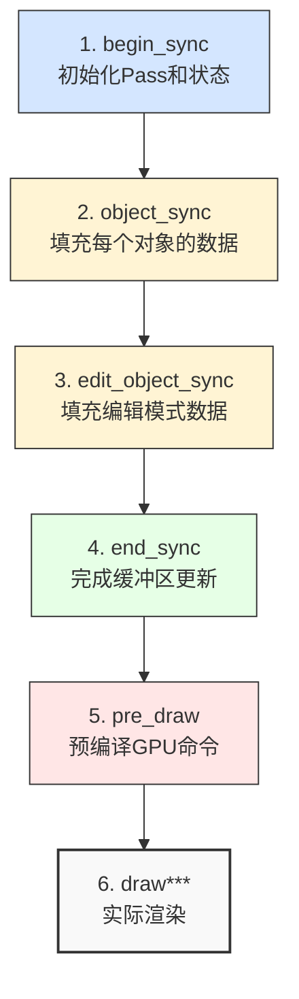
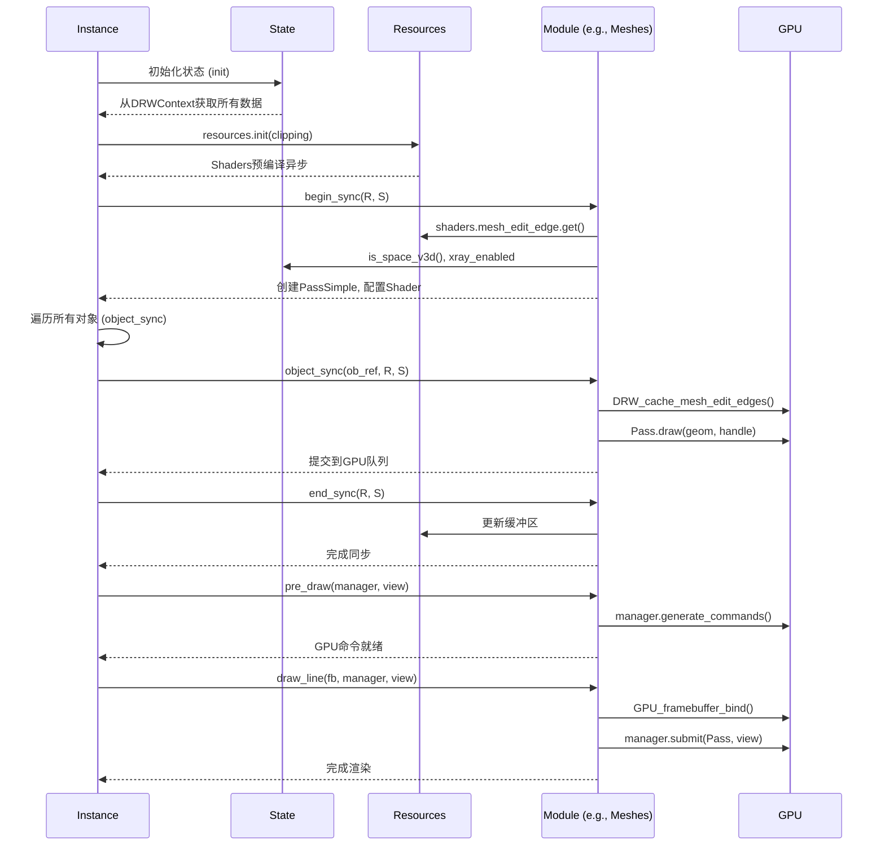

# Overlay引擎架构详解 - 组件管理系统 (Component Management System)

> **文档版本**: 1.0
> **目标文件**: `E:\blender-git\blender\.vscode\overlay通读-MiMo2\3.Overlay引擎架构详解-组件管理系统.md`
> **核心模块**: 30+ Overlay组件的管理与调度系统
> **适用人群**: 熟悉C++的Python开发者，Blender渲染引擎开发者

---

## 目录
1. [概述：Overlay组件管理系统](#概述)
2. [核心架构：抽象基类与虚拟函数](#核心架构)
3. [30+组件模块详解](#组件模块)
4. [生命周期管理](#生命周期管理)
5. [C++继承模式详解](#C++继承模式)
6. [实际注册与使用示例](#实际注册)
7. [状态与资源流动](#状态与资源流动)
8. [性能优化设计](#性能优化设计)

---

## 概述

Blender的Overlay引擎是一个**高度模块化的C++组件管理系统**，管理着**超过30个独立的渲染模块**。每个模块负责渲染特定类型的对象，例如：
- **Meshes** (3D网格)
- **Armatures** (骨骼)
- **Curves** (曲线)
- **Lattices** (晶格)
- **Point Clouds** (点云)
- **Text** (文本编辑)
- **Grease Pencil** (蜡笔)
- ... 以及25+更多类型

这种设计借鉴了**策略模式(Strategy Pattern)**和**组件模式(Component Pattern)**，让每个Overlay模块独立管理自己的：
- 渲染状态 (Shader Pass)
- 数据同步 (Sync)
- 绘制逻辑 (Draw)
- 资源管理 (Resources)

---

## 核心架构

### 1. 抽象基类：`Overlay`

所有组件都继承自`overlay_base.hh`中的`struct Overlay`:

```cpp
struct Overlay {
  bool enabled_ = false;  // 模块启用状态

  // 5个核心生命周期方法 (11个虚函数)
  virtual void begin_sync(Resources &res, const State &state) = 0;
  virtual void object_sync(Manager &manager, const ObjectRef &ob_ref, Resources &res, const State &state) = 0;
  virtual void edit_object_sync(Manager &manager, const ObjectRef &ob_ref, Resources &res, const State &state) = 0;
  virtual void end_sync(Resources &res, const State &state) = 0;
  virtual void pre_draw(Manager &manager, View &view) = 0;

  // 6个绘制方法
  virtual void draw_on_render(gpu::FrameBuffer *fb, Manager &manager, View &view) = 0;
  virtual void draw(Framebuffer &fb, Manager &manager, View &view) = 0;
  virtual void draw_line(Framebuffer &fb, Manager &manager, View &view) = 0;
  virtual void draw_line_only(Framebuffer &fb, Manager &manager, View &view) = 0;
  virtual void draw_color_only(Framebuffer &fb, Manager &manager, View &view) = 0;
  virtual void draw_output(Framebuffer &fb, Manager &manager, View &view) = 0;
};
```

### 2. 为什么使用虚函数？

对于Python开发者而言，这类似于**抽象基类(ABC)**：

| C++概念 | Python等价物 | 说明 |
|---------|-------------|------|
| `virtual void draw() = 0` | `@abstractmethod def draw(self)` | 必须被实现的纯虚函数 |
| `virtual void draw() {}` | `def draw(self): pass` | 可选覆盖的虚函数 |
| 继承 | `class MeshOverlay(Overlay)` | 子类实现特定逻辑 |
| 多态 | `overlay->draw()` | 运行时调用正确实现 |

**优势**：
- ✅ **编译时检查**：忘记实现虚函数会导致编译错误
- ✅ **类型安全**：强类型系统确保正确调用
- ✅ **性能**：虚函数表(vtable)开销极小，GPU驱动级优化

---

## 组件模块详解

### 3.1 模块总览

`overlay_instance.hh`中定义了**30+组件**的完整架构：

```cpp
struct OverlayLayer {
  // 几何体类 (10个)
  Meshes meshes;                    // 3D网格编辑
  MeshUVs mesh_uvs;                 // UV编辑
  Curves curves;                    // 曲线/曲面
  Lattices lattices;                // 晶格
  PointClouds pointclouds;          // 点云
  Metaballs metaballs;              // 元球
  GreasePencil grease_pencil;       // 蜡笔
  Wireframe wireframe;              // 线框
  Prepass prepass;                  // 深度预渲染
  ModeTransfer mode_transfer;       // 模式转换

  // 骨骼与动画 (2个)
  Armatures armatures;              // 骨骼/骨架
  Particles particles;              // 粒子系统

  // 对象与UI (9个)
  Cameras cameras;                  // 相机
  Lights lights;                    // 灯光
  LightProbes light_probes;         // 光照探头
  Empties empties;                  // 空物体
  Axes axes;                        // 轴向指示
  Bounds bounds;                    // 边界框
  Names names;                      // 名称标签
  Origins origins;                  // 原点
  Relations relations;              // 关系线

  // 特效与修饰 (5个)
  Facing facing;                    // 朝向
  Fade fade;                        // 淡入淡出
  Fluids fluids;                    // 流体
  ForceFields force_fields;         // 力场
  Speakers speakers;                // 扬声器

  // 绘制与画笔 (2个)
  Paints paints;                    // 绘制模式
  Sculpts sculpts;                  // 雕刻模式

  // 文本与视图 (3个)
  Text text;                        // 文本编辑
  AttributeTexts attribute_texts;   // 属性文本
  AttributeViewer attribute_viewer; // 属性查看器

  // 全局覆盖 (3个)
  Background background;            // 背景
  ImagePrepass image_prepass;       // 图像预渲染
  MotionPath motion_paths;          // 运动路径
  Outline outline;                  // 轮廓
  Cursor cursor;                    // 光标
};

// 额外的全局模块
Grid grid;                          // 网格
AntiAliasing anti_aliasing;         // 抗锯齿
XrayFade xray_fade;                 // X射线淡入
```

### 3.2 典型模块结构

以**MeshOverlay**为例（`overlay_mesh.hh`)：

```cpp
class Meshes : Overlay {
 private:
  // 1. Pass管理：每个功能一个Pass
  PassSimple edit_mesh_normals_ps_ = {"Normals"};
  PassSimple edit_mesh_edges_ps_ = {"Edges"};
  PassSimple edit_mesh_faces_ps_ = {"Faces"};
  PassSimple edit_mesh_verts_ps_ = {"Verts"};

  // 2. 状态变量
  bool xray_enabled_ = false;
  bool show_retopology_ = false;

 public:
  // 3. begin_sync: 初始化Pass和状态
  void begin_sync(Resources &res, const State &state) final {
    enabled_ = state.is_space_v3d();
    if (!enabled_) return;

    // 配置每个Pass的Shader和状态
    auto &pass = edit_mesh_edges_ps_;
    pass.init();
    pass.state_set(DRW_STATE_WRITE_COLOR | DRW_STATE_DEPTH_LESS_EQUAL);
    pass.shader_set(res.shaders->mesh_edit_edge.get());
    // ... 绑定UBO、纹理、常量
  }

  // 4. edit_object_sync: 为单个对象填充数据
  void edit_object_sync(Manager &manager,
                        const ObjectRef &ob_ref,
                        Resources &res,
                        const State &state) final {
    if (!enabled_) return;

    ResourceHandleRange res_handle = manager.unique_handle(ob_ref);
    Mesh &mesh = DRW_object_get_data_for_drawing<Mesh>(*ob_ref.object);

    // 获取GPU Batch并提交到Pass
    gpu::Batch *geom = DRW_mesh_batch_cache_get_edit_edges(mesh);
    edit_mesh_edges_ps_.draw_expand(geom, GPU_PRIM_TRIS, 2, 1, res_handle);
  }

  // 5. draw_line: 实际渲染
  void draw_line(Framebuffer &fb, Manager &manager, View &view) final {
    if (!enabled_) return;

    GPU_framebuffer_bind(fb);
    manager.submit(edit_mesh_edges_ps_, view);
  }
};
```

---

## 生命周期管理

### 4.1 完整的5阶段生命周期

每个Overlay组件都遵循严格的生命周期：



### 4.2 实际流程示例

从`overlay_instance.cc`看调用顺序：

```cpp
void Instance::begin_sync() {
  // 1. 初始化全局状态
  resources.begin_sync(state.clipping_plane_count);

  // 2. 调用各模块的begin_sync
  background.begin_sync(resources, state);        // 背景
  cursor.begin_sync(resources, state);            // 光标

  auto begin_sync_layer = [&](OverlayLayer &layer) {
    layer.armatures.begin_sync(resources, state);
    layer.curves.begin_sync(resources, state);
    layer.meshes.begin_sync(resources, state);
    layer.lattices.begin_sync(resources, state);
    layer.pointclouds.begin_sync(resources, state);
    // ... 30+模块
  };

  begin_sync_layer(regular);      // 常规层
  begin_sync_layer(infront);      // 前景层
}

void Instance::object_sync(ObjectRef &ob_ref, Manager &manager) {
  // 3. 按对象类型路由到对应模块
  if (in_edit_mode && !state.hide_overlays) {
    switch (ob_ref.object->type) {
      case OB_MESH:
        layer.meshes.edit_object_sync(manager, ob_ref, resources, state);
        break;
      case OB_ARMATURE:
        layer.armatures.edit_object_sync(manager, ob_ref, resources, state);
        break;
      case OB_CURVES:
        layer.curves.edit_object_sync(manager, ob_ref, resources, state);
        break;
      case OB_LATTICE:
        layer.lattices.edit_object_sync(manager, ob_ref, resources, state);
        break;
      case OB_POINTCLOUD:
        layer.pointclouds.edit_object_sync(manager, ob_ref, resources, state);
        break;
      // ... 10+对象类型
    }
  }
}

void Instance::end_sync() {
  // 4. 完成所有缓冲区更新
  auto end_sync_layer = [&](OverlayLayer &layer) {
    layer.armatures.end_sync(resources, state);
    layer.curves.end_sync(resources, state);
    // ... 仅需要end_sync的模块
  };
}

void Instance::draw(Manager &manager) {
  // 5. 预编译GPU命令
  {
    auto pre_draw = [&](OverlayLayer &layer) {
      layer.cameras.pre_draw(manager, view);
      layer.empties.pre_draw(manager, view);
      layer.pointclouds.pre_draw(manager, view);
    };
  }

  // 6. 分配到不同帧缓冲的绘制
  draw_v3d(manager, view);  // 3D视图
  draw_v2d(manager, view);  // 2D视图(UV编辑器)
  draw_node(manager, view); // 节点编辑器
}
```

---

## C++继承模式详解

### 5.1 面向Python开发者的C++概念

#### 虚函数表 (VTable)

```cpp
// Python中的等价概念
from abc import ABC, abstractmethod

class Overlay(ABC):
    @abstractmethod
    def begin_sync(self, resources, state):
        pass

    @abstractmethod
    def draw_line(self, framebuffer, manager, view):
        pass

# C++中的内存布局
class Meshes {
  // 虚函数表指针 (隐藏的)
  // void* vtable_ptr;

  // 成员变量
  bool enabled_;
  PassSimple edit_mesh_edges_ps_;
};
```

#### 多态调用

```cpp
// C++代码
void Instance::draw_v3d(Manager &manager, View &view) {
    // 通过基类指针调用，运行时自动路由到正确实现
    layer.meshes.draw_line(resources.overlay_line_fb, manager, view);      // Meshes::draw_line
    layer.armatures.draw_line(resources.overlay_line_fb, manager, view);   // Armatures::draw_line
    layer.curves.draw_line(resources.overlay_line_fb, manager, view);      // Curves::draw_line
}

# Python模拟
def draw_v3d(manager, view):
    overlay_modules = [meshes, armatures, curves, ...]
    for module in overlay_modules:
        module.draw_line(framebuffer, manager, view)  # 多态调用
```

### 5.2 两种继承模式

#### 模式A：复合继承（推荐）

```cpp
// 继承基类，添加私有成员
class Meshes : Overlay {
 private:
  PassSimple edit_mesh_edges_ps_ = {"Edges"};
  PassSimple edit_mesh_faces_ps_ = {"Faces"};
  bool show_retopology_ = false;

 public:
  // 必须实现的虚函数
  void begin_sync(Resources &res, const State &state) final;
  void edit_object_sync(Manager &manager, const ObjectRef &ob_ref,
                        Resources &res, const State &state) final;
};
```

#### 模式B：聚合模式（复杂模块用）

```cpp
class Armatures : Overlay {
 private:
  // 嵌套结构体管理复杂子状态
  struct BoneBuffers {
    PassSimple::Sub *sphere_fill = nullptr;
    PassSimple::Sub *shape_outline = nullptr;

    // 多个实例缓冲区
    BoneInstanceBuf octahedral_fill_buf;
    BoneInstanceBuf octahedral_outline_buf;
  };

  BoneBuffers opaque_;
  BoneBuffers transparent_;

 public:
  void begin_sync(Resources &res, const State &state) final {
    // 初始化两个版本（透明和不透明）
    init_bone_buffers(opaque_, false);
    init_bone_buffers(transparent_, true);
  }
};
```

---

## 实际注册与使用示例

### 6.1 模块注册流程

从`overlay_instance.hh`第76-108行：

```cpp
struct OverlayLayer {
  const SelectionType selection_type_;

  // 每个模块在构造时初始化
  Armatures armatures = {selection_type_};      // 带参数构造
  Curves curves;                                // 默认构造
  Meshes meshes;                                // 默认构造
  Lattices lattices;                            // 默认构造

  // ... 30+模块
} regular{selection_type_}, infront{selection_type_};
```

**关键点**：
- 模块在构造时**不分配GPU资源**
- `begin_sync()`才初始化GPU Pass
- 通过selector参数区分 **渲染模式** vs **选择模式**

### 6.2 完整渲染流程示例

```cpp
// 从 overlay_instance.cc line 504-665
void Instance::object_sync(ObjectRef &ob_ref, Manager &manager) {
  const bool in_edit_mode = ob_ref.object->mode == OB_MODE_EDIT;
  const bool in_paint_mode = object_is_paint_mode(ob_ref.object);

  OverlayLayer &layer = object_is_in_front(ob_ref.object, state)
                        ? infront : regular;

  // ==================== 1. 模式转移 ====================
  layer.mode_transfer.object_sync(manager, ob_ref, resources, state);

  // ==================== 2. 深度预渲染 ====================
  if (needs_prepass) {
    layer.prepass.object_sync(manager, ob_ref, resources, state);
  }

  // ==================== 3. 对象模式路由 ====================
  if (in_edit_mode && !state.hide_overlays) {
    switch (ob_ref.object->type) {
      case OB_MESH:
        layer.meshes.edit_object_sync(manager, ob_ref, resources, state);
        break;
      case OB_ARMATURE:
        layer.armatures.edit_object_sync(manager, ob_ref, resources, state);
        break;
      // ... 每个类型路由到对应模块
    }
  }

  // ==================== 4. 特殊模式处理 ====================
  if (in_paint_mode) {
    layer.paints.object_sync(manager, ob_ref, resources, state);
  }
  if (in_sculpt_mode) {
    layer.sculpts.object_sync(manager, ob_ref, resources, state);
  }

  // ==================== 5. 常规对象渲染 ====================
  if (!state.hide_overlays) {
    switch (ob_ref.object->type) {
      case OB_EMPTY:
        layer.empties.object_sync(manager, ob_ref, resources, state);
        break;
      case OB_CAMERA:
        layer.cameras.object_sync(manager, ob_ref, resources, state);
        break;
      case OB_LAMP:
        layer.lights.object_sync(manager, ob_ref, resources, state);
        break;
      // ... 更多对象类型
    }
  }
}
```

### 6.3 每个模块的生命周期实现

以`PointClouds`为例（最简单模块）：

```cpp
// overlay_pointcloud.hh
class PointClouds : Overlay {
 private:
  PassMain ps_ = {"PointCloud"};  // 单个Pass管理所有点云

 public:
  // 1. 初始化：创建Pass并配置Shader
  void begin_sync(Resources &res, const State &state) final {
    enabled_ = state.is_space_v3d();
    if (!enabled_) return;

    ps_.init();
    ps_.state_set(DRW_STATE_WRITE_COLOR | DRW_STATE_WRITE_DEPTH);
    ps_.shader_set(res.shaders->pointcloud_points.get());
    ps_.bind_ubo(OVERLAY_GLOBALS_SLOT, &res.globals_buf);
  }

  // 2. 填充数据：为单个点云对象添加绘制命令
  void edit_object_sync(Manager &manager,
                        const ObjectRef &ob_ref,
                        Resources &res,
                        const State &state) final {
    if (!enabled_) return;

    ResourceHandleRange res_handle = manager.unique_handle(ob_ref);
    gpu::Batch *geom = DRW_cache_pointcloud_vert_overlay_get(ob_ref.object);
    ps_.draw(geom, res_handle, res.select_id(ob_ref).get());
  }

  // 3. 预编译：提前生成GPU命令
  void pre_draw(Manager &manager, View &view) final {
    if (!enabled_) return;
    manager.generate_commands(ps_, view);
  }

  // 4. 绘制：提交到帧缓冲
  void draw_line(Framebuffer &framebuffer, Manager &manager, View &view) final {
    if (!enabled_) return;
    GPU_framebuffer_bind(framebuffer);
    manager.submit_only(ps_, view);
  }
};
```

---

## 状态与资源流动

### 7.1 State结构体

`overlay_private.hh`中的全局状态：

```cpp
struct State {
  // Blender核心数据
  Depsgraph *depsgraph;
  const Scene *scene;
  const View3D *v3d;
  const ARegion *region;
  const RegionView3D *rv3d;

  // 渲染模式
  eSpace_Type space_type;      // SPACE_VIEW3D, SPACE_IMAGE, etc.
  eObjectMode object_mode;     // OB_MODE_EDIT, OB_MODE_OBJECT, etc.
  bool is_wireframe_mode;
  bool hide_overlays;

  // X-Ray模式
  bool xray_enabled;
  float xray_opacity;

  // 3D视图叠加层设置
  View3DOverlay overlay;       // 包含所有UI开关

  // 文本缓存
  DRWTextStore *dt;
};
```

### 7.2 Resources结构体

GPU资源管理与模块共享：

```cpp
struct Resources : public select::SelectMap {
  // Shader模块（所有模块共享）
  ShaderModule *shaders;

  // 帧缓冲（按功能划分）
  Framebuffer overlay_fb;           // 主叠加层 (颜色+深度)
  Framebuffer overlay_line_fb;      // 叠加层+线条数据
  Framebuffer overlay_color_only_fb; // 仅颜色

  // GPU纹理引用
  TextureRef depth_tx;              // 场景深度
  TextureRef depth_target_tx;       // 渲染目标深度
  Texture weight_ramp_tx;           // 权重绘制颜色映射

  // 全局Uniform缓冲（所有模块绑定同一缓冲）
  draw::UniformBuffer<UniformData> globals_buf;
  draw::UniformArrayBuffer<float4, 6> clip_planes_buf;

  // 形状缓存（预生成的几何体）
  const ShapeCache &shapes;         // 立方体、球体、箭头等
};
```

### 7.3 数据流图



---

## 性能优化设计

### 8.1 虚函数优化

1. **编译时多态**（模板），但这里用虚函数是因为运行时灵活性
2. **inline虚函数调用**：现代C++编译器能优化单态调用
3. **vtable缓存**：连续的对象类型访问时CPU缓存友好

### 8.2 模块级优化

1. **按需启用**：`enabled_`标志避免无效计算
2. **Pass复用**：Pass在`begin_sync`创建，多次`draw`复用
3. **状态批处理**：Canvas子系统合并相同状态的DrawCall

### 8.3 层分离

```cpp
// overlay_instance.hh line 76-108
struct OverlayLayer {
  // 常规层：正常对象
} regular{selection_type_};

struct OverlayLayer {
  // 前景层：在前景的对象（如骨骼X-Ray）
} infront{selection_type_};
```

将绘制分为两层，避免深度冲突和混合排序问题。

### 8.4 GPU命令预热

```cpp
void Instance::draw(Manager &manager) {
  // Step 1: 预编译所有模块的Pass
  auto pre_draw = [&](OverlayLayer &layer) {
    layer.cameras.pre_draw(manager, view);
    layer.empties.pre_draw(manager, view);
    // ...
  };

  // Step 2: 批量提交给GPU驱动
  // ...
}
```

避免在实际绘制时频繁切换Shader上下文。

---

## 总结：Python开发者的C++开发指南

| 概念 | Python | C++ | 重要性 |
|------|--------|-----|--------|
| **基类** | `class Overlay(ABC)` | `struct Overlay` | ★★★★★ |
| **抽象方法** | `@abstractmethod` | `virtual void f() = 0` | ★★★★★ |
| **继承** | `class Meshes(Overlay)` | `class Meshes : Overlay` | ★★★★★ |
| **虚函数** | 普通方法 | `virtual void draw()` | ★★★★☆ |
| **多态** | 动态类型 | 虚函数表 | ★★★★☆ |
| **RAM vs GPU** | 自动管理 | 手动Buffer管理 | ★★★★★ |
| **性能** | 解释执行 | 零开销抽象 | ★★★★★ |

### 核心设计理念

1. **单一职责原则**：每个模块只处理特定对象类型
2. **开闭原则**：新增模块无需修改引擎核心
3. **依赖注入**：通过Resources和State传递上下文
4. **延迟初始化**：GPU资源在`begin_sync`才创建
5. **数据流分离**：Sync只写数据，Draw只读数据

---

## 附录：关键文件清单

| 文件 | 作用 | 代码行数 |
|------|------|---------|
| `overlay_base.hh` | 抽象基类定义 | ~109行 |
| `overlay_instance.hh` | 30+模块声明 | ~163行 |
| `overlay_instance.cc` | 生命周期实现 | ~1180行 |
| `overlay_private.hh` | State/Resources | ~1206行 |
| `overlay_mesh.hh` | 网格模块 | ~481行 |
| `overlay_armature.hh` | 骨骼模块 | ~677行 |
| `overlay_curve.hh` | 曲线模块 | ~286行 |
| `overlay_pointcloud.hh` | 点云模块 | ~76行 |
| `overlay_lattice.hh` | 晶格模块 | ~126行 |
| `overlay_text.hh` | 文本模块 | ~242行 |

---

**文档结束**
*编写日期: 2025-12-18*
*Blender版本: 4.4+ (main分支)*
