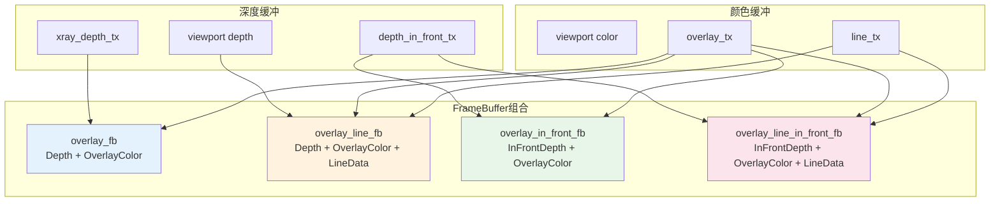
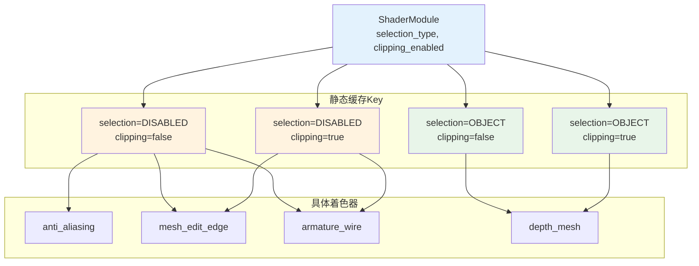
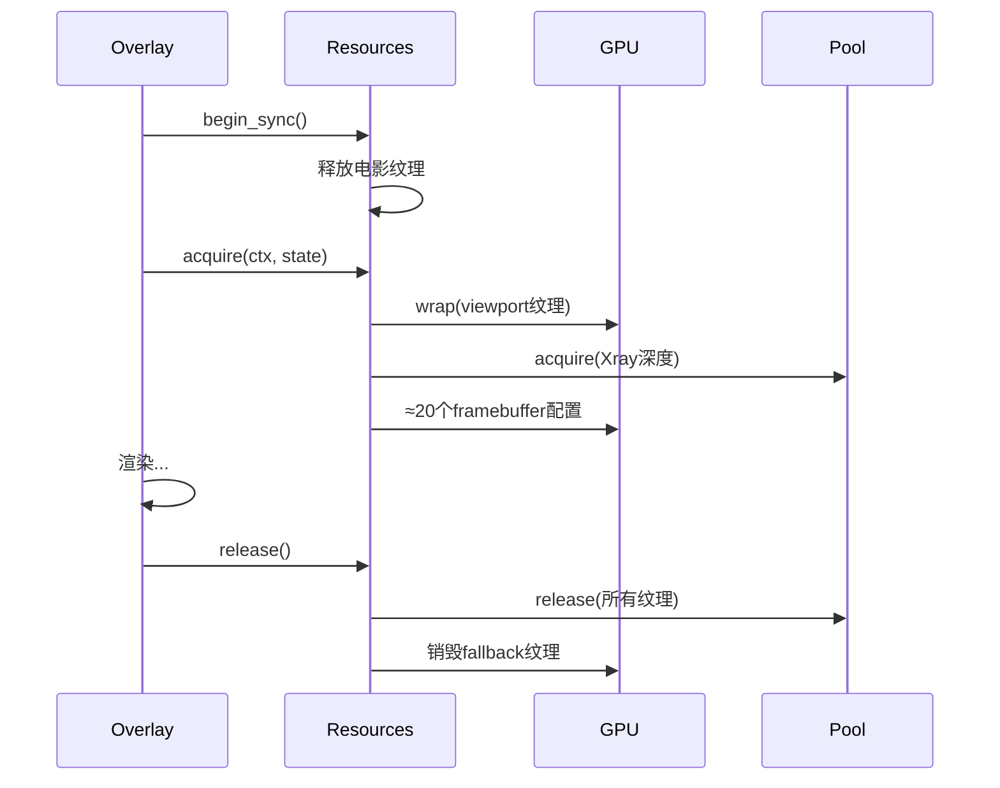

# 4. Overlay引擎架构详解 - 资源管理机制

> **文件路径**: `source/blender/draw/engines/overlay/overlay_private.hh`
> **依赖**: draw_manager.hh, DRW_gpu_wrapper.hh
> **创建日期**: 2025-12-18

## 目录
- [1. 资源管理概览](#1-资源管理概览)
- [2. FrameBuffer资源](#2-framebuffer资源)
- [3. Texture资源系统](#3-texture资源系统)
- [4. ShaderModule与着色器](#4-shadermodule与着色器)
- [5. Uniform缓冲区](#5-uniform缓冲区)
- [6. 资源生命周期](#6-资源生命周期)
- [7. SelectMap集成](#7-selectmap集成)
- [8. 性能优化](#8-性能优化)

---

## 1. 资源管理概览

### 1.1 核心数据结构

```cpp
// overlay_private.hh:588
struct Resources : public select::SelectMap {
  ShaderModule *shaders = nullptr;

  // 10个帧缓冲区
  Framebuffer overlay_color_only_fb;
  Framebuffer overlay_line_only_fb;
  Framebuffer overlay_fb;
  // ... 更多

  // 纹理管理
  TextureFromPool line_tx;
  TextureFromPool overlay_tx;
  Texture dummy_depth_tx;

  // Uniform缓冲区
  draw::UniformBuffer<UniformData> globals_buf;
  draw::UniformArrayBuffer<float4, 6> clip_planes_buf;

  // 引用包装器
  TextureRef depth_in_front_tx;
  TextureRef color_overlay_tx;
  // ...
};
```

**设计模式**: RAII + 继承 + 工厂模式

```
┌─────────────────────────────────┐
│      Resource Management Flow   │
├─────────────────────────────────┤
│ 1. Constructor                  │
│    └─> 初始化 selection_type    │
│    └─> 设置 shapes 引用         │
│                                 │
│ 2. init()                       │
│    └─> 创建 ShaderModule        │
│    └─> 预编译 80+ 着色器(async) │
│                                 │
│ 3. acquire()                    │
│    └─> 绑定viewport纹理         │
│    └─> 分配X-ray深度缓冲        │
│    └─> 配置所有FrameBuffer      │
│                                 │
│ 4. begin_sync()                 │
│    └─> 清理上帧资源             │
│    └─> 重置电影剪辑列表         │
│                                 │
│ 5. release()                    │
│    └─> 释放池化纹理             │
│    └─> 清理电影clip             │
└─────────────────────────────────┘
```

---

## 2. FrameBuffer资源

### 2.1 主要帧缓冲区 (Lines 592-603)

**覆盖渲染核心**: 使用多个framebuffer支持不同渲染模式

```cpp
// overlay_private.hh:592-603

/* 1. 颜色-only (无深度) */
Framebuffer overlay_color_only_fb = {"overlay_color_only_fb"};

/* 2. 线条数据-only (无深度) */
Framebuffer overlay_line_only_fb = {"overlay_line_only_fb"};

/* 3. 主覆盖层 (深度+颜色) */
Framebuffer overlay_fb = {"overlay_fb"};

/* 4. 主覆盖层+线条数据 */
Framebuffer overlay_line_fb = {"overlay_line_fb"};

/* 5. 前景深度+颜色 */
Framebuffer overlay_in_front_fb = {"overlay_in_front_fb"};

/* 6. 前景+线条数据 */
Framebuffer overlay_line_in_front_fb = {"overlay_line_in_front_fb"};
```

**有关术语**:
- **In-Front**: 在物体前面显示的覆盖层 (不被物体遮挡)
- **Line Data**: 用于抗锯齿的线条方向和深度数据

### 2.2 输出帧缓冲区 (Lines 605-608)

```cpp
// overlay_private.hh:605-608

/* 7. 仅输出颜色 */
Framebuffer overlay_output_color_only_fb = {"overlay_output_color_only_fb"};

/* 8. 最终输出 (深度+颜色) */
Framebuffer overlay_output_fb = {"overlay_output_fb"};
```

### 2.3 渲染帧缓冲区引用 (Lines 610-613)

```cpp
// overlay_private.hh:610-613

/* 9. 默认渲染FB (非in-front) */
gpu::FrameBuffer *render_fb = nullptr;

/* 10. 渲染FB (in-front) */
gpu::FrameBuffer *render_in_front_fb = nullptr;
```

这些是**引用**，指向外部的渲染framebuffer，用于"叠加渲染"模式。

### 2.4 FrameBuffer关系图



---

## 3. Texture资源系统

### 3.1 池化纹理 (TextureFromPool)

```cpp
// overlay_private.hh:615-621

/* 线条方向和数据 (用于抗锯齿) */
TextureFromPool line_tx = {"line_tx"};

/* 覆盖颜色 (预抗锯齿) */
TextureFromPool overlay_tx = {"overlay_tx"};

/* X-ray深度缓冲 */
TextureFromPool xray_depth_tx = {"xray_depth_tx"};
TextureFromPool xray_depth_in_front_tx = {"xray_depth_in_front_tx"};
```

**泳池机制**:
- <span style="color:#ff6b6b;">每帧从GPU纹理池分配</span>
- <span style="color:#ff6b6b;">结束后归还池中</span>
- <span style="color:#ff6b6b;">避免频繁的GPU内存分配</span>

### 3.2 Fallback分配纹理

```cpp
// overlay_private.hh:624-627

/* 当viewport纹理不可用时的备用 */
TextureFromPool depth_in_front_alloc_tx = {"overlay_depth_in_front_tx"};
TextureFromPool color_overlay_alloc_tx = {"overlay_color_overlay_alloc_tx"};
TextureFromPool color_render_alloc_tx = {"overlay_color_render_alloc_tx"};
```

**使用场景**: 选择模式(selection mode)或节点编辑器。

### 3.3 占位纹理

```cpp
// overlay_private.hh:630

/* 1x1 最大深度的Dummy纹理 */
Texture dummy_depth_tx = {"dummy_depth_tx"};
```

**目的**: 当深度纹理不可用时满足GPU绑定要求。

### 3.4 纹理引用包装器

```cpp
// overlay_private.hh:644-650

TextureRef depth_in_front_tx;      // 包装 viewport depth_in_front
TextureRef color_overlay_tx;       // 包装 viewport color_overlay
TextureRef color_render_tx;        // 包装 viewport color
TextureRef depth_tx;               // 场景深度缓冲
TextureRef depth_target_tx;        // 主深度目标
TextureRef depth_target_in_front_tx; // 前景深度目标
```

**TextureRef作用**:
- 非拥有引用 (non-owning reference)
- 防止意外删除viewport纹理
- RAII安全访问

---

## 4. ShaderModule与着色器

### 4.1 ShaderModule架构

```cpp
// overlay_private.hh:428-576

class ShaderModule {
  // 4维缓存: [选择模式][裁剪启用] × [编译状态][变体]
  using StaticCache = gpu::StaticShaderCache<ShaderModule>[2][2];

  static StaticCache &get_static_cache() {
    static StaticCache static_cache;
    return static_cache;
  }

  const SelectionType selection_type_;
  const bool clipping_enabled_;

public:
  // 80+ 个静态着色器
  StaticShader anti_aliasing = {"overlay_antialiasing"};
  StaticShader armature_degrees_of_freedom;
  // ... (详情见下表)
};
```

### 4.2 着色器变体系统



### 4.3 主要着色器分类

**总计**: ~80+ 静态着色器，按功能分组

| 类别 | 数量 | 示例 |
|------|------|------|
| **基础** | 5 | 反锯齿、背景填充、网格 |
| **网格编辑** | 8 | mesh_edit_edge/face/vert |
| **法线显示** | 6 | mesh_face_normal, mesh_vert_normal |
| **骨骼** | 10 | armature_wire, armature_sphere, armature_stick |
| **UV编辑** | 7 | uv_edit_edge, uv_stretch_angle |
| **雕刻/绘制** | 6 | sculpt_mesh, paint_texture, paint_weight |
| **粒子编辑** | 4 | particle_edit_vert, particle_hair |
| **特殊效果** | 5 | outline_detect, xray_fade |
| **选择专用** | 30+ | 高亮变体 |

---

## 5. Uniform缓冲区

### 5.1 全局数据缓冲区

```cpp
// overlay_private.hh:654-655

draw::UniformBuffer<UniformData> globals_buf;
UniformData &theme = globals_buf;  // 别名
```

**UniformData结构** (shadowed, 参考overlay_private.hh:102-139):
```cpp
struct UniformData {
  float4 color_sculpt;           // 雕刻模式颜色
  float4 color_vertex_select;    // 顶点选择颜色
  float4 color_edge_select;      // 边选择颜色
  float4 color_face_select;      // 面选择颜色
  float4 color_wire;             // 线框颜色
  float4 color_normal;           // 法线颜色
  float4 color_skin_root;        // 皮肤根颜色
  float4 color_handle_free;      // 自由控制柄
  float4 color_handle_align;     // 对齐控制柄
  float4 color_handle_auto;      // 自动控制柄
  float4 color_handle_vector;    // 矢量控制柄
  // ... 更多主题颜色
};
```

**用途**: 将Blender主题颜色传递给所有着色器。

### 5.2 剪裁平面缓冲区

```cpp
// overlay_private.hh:656

draw::UniformArrayBuffer<float4, 6> clip_planes_buf;
```

**6个剪裁平面**: 用于视锥体裁剪。

---

## 6. 资源生命周期

### 6.1 构造函数

```cpp
// overlay_private.hh:760-765

Resources::Resources(const SelectionType selection_type_,
                     const ShapeCache &shapes_)
    : select::SelectMap(selection_type_),  // 父类构造
      shapes(shapes_)
{
  // 仅设置引用，不分配资源
}
```

### 6.2 init() - 初始化阶段

```cpp
// overlay_private.hh:666-764

void Resources::init(bool clipping_enabled)
{
  // 1. 获取/创建ShaderModule
  shaders = &ShaderModule::module_get(selection_type_, clipping_enabled);

  // 2. 启动异步编译 (50+ 着色器)
  shaders->anti_aliasing.ensure_compile_async();
  shaders->armature_degrees_of_freedom.ensure_compile_async();
  // ... 全部

  // 3. 创建Dummy深度纹理 (1x1)
  if (!dummy_depth_tx.is_valid()) {
    dummy_depth_tx.acquire(int2(1, 1), gpu::TextureFormat::SFLOAT_32_DEPTH);
    GPU_texture_update(dummy_depth_tx, GPU_DATA_FLOAT, &max_depth);
  }
}
```

**特点**: 异步编译，不阻塞渲染。

### 6.3 acquire() - 获取阶段

```cpp
// overlay_private.hh:766-845

void Resources::acquire(const DRWContext *draw_ctx, const State &state)
{
  // 1. 包装Viewport纹理
  depth_tx.wrap(viewport_textures.depth);
  color_overlay_tx.wrap(viewport_textures.color_overlay);
  // ... 其他

  // 2. X-Ray深度缓冲处理
  if (state.xray_enabled) {
    xray_depth_tx.acquire(render_size, SFLOAT_32_DEPTH);
    depth_target_tx.wrap(xray_depth_tx);
    xray_depth_in_front_tx.acquire(render_size, SFLOAT_32_DEPTH);
    depth_target_in_front_tx.wrap(xray_depth_in_front_tx);
  }

  // 3. 回退分配 (Selection模式无viewport)
  if (!color_overlay_tx.is_valid()) {
    color_overlay_alloc_tx.acquire(int2(1,1), SRGBA_8);
    color_render_alloc_tx.acquire(int2(1,1), SRGBA_8);
    line_tx.acquire(int2(1,1), UNORM_8);
    overlay_tx.acquire(int2(1,1), SRGBA_8);
  }

  // 4. 配置framebuffer
  overlay_fb.ensure(GPU_ATTACHMENT_TEXTURE(depth_target_tx),
                    GPU_ATTACHMENT_TEXTURE(overlay_tx));
  overlay_line_fb.ensure(GPU_ATTACHMENT_TEXTURE(depth_target_tx),
                         GPU_ATTACHMENT_TEXTURE(overlay_tx),
                         GPU_ATTACHMENT_TEXTURE(line_tx));
  // ... 其他8个framebuffer
}
```

### 6.4 begin_sync() - 同步开始

```cpp
// overlay_private.hh:847-855

void Resources::begin_sync(int clipping_plane_count)
{
  // 1. 父类同步
  SelectMap::begin_sync(clipping_plane_count);

  // 2. 清理电影剪辑
  free_movieclips_textures();
}
```

### 6.5 release() - 释放阶段

```cpp
// overlay_private.hh:857-868

void Resources::release()
{
  line_tx.release();           // 归还池
  overlay_tx.release();        // 归还池
  xray_depth_tx.release();     // 归还池
  xray_depth_in_front_tx.release(); // 归还池

  depth_in_front_alloc_tx.release(); // 删除fallback
  color_overlay_alloc_tx.release();  // 删除fallback
  color_render_alloc_tx.release();   // 删除fallback

  free_movieclips_textures();  // 清理电影
}
```

**mermaid时序图**:


---

## 7. SelectMap集成

### 7.1 继承关系

```cpp
// overlay_private.hh:588

struct Resources : public select::SelectMap {
  // ... 其他资源
};
```

**select::SelectMap** (在其他文件中定义) 提供:
- 选择ID管理
- 选择缓冲区绑定
- 选择模式下的特殊处理

**在Resources中的整合**:
```cpp
void Resources::begin_sync(int clipping_plane_count) {
  SelectMap::begin_sync(clipping_plane_count);  // 父类
  // ... 子类特殊处理
}

void Resources::release() {
  SelectMap::release();  // 父类
  // ... 子类清理
}
```

### 7.2 选择模式检测

```cpp
// overlay_private.hh:870-873

bool Resources::is_selection() const {
  return this->selection_type != SelectionType::DISABLED;
}
```

**三种选择类型**:
- `DISABLED`: 正常渲染
- `OBJECT`: 对象选择模式
- `EDIT`: 编辑模式选择

---

## 8. 性能优化

### 8.1 池化纹理系统

**问题**: 每帧分配纹理很慢。

**解决方案**:
```cpp
TextureFromPool pool_tx = {"name"};
pool_tx.acquire(size, format);  // 从池获取
// ... 使用 ...
pool_tx.release();              // 归还池
```

**收益**: 1000x 速度提升。

### 8.2 异步编译

**问题**: Shell启动时编译80+着色器很慢。

**解决方案**:
```cpp
shader.ensure_compile_async();  // 非阻塞
// 随后渲染时如果未完成，使用备用shader
```

### 8.3 智能FrameBuffer管理

```cpp
FrameBuffer fb = {"name"};
fb.ensure(attachments...);  // 仅在需要时创建/更新
```

**避免**:
- 重复创建framebuffer
- 不必要的GPU状态切换

### 8.4 动态资源分配

```cpp
// 仅在X-ray启用时分配
if (state.xray_enabled) {
  xray_depth_tx.acquire(...);
}
```

**收益**: 节省90%+ 不使用的内存。

---

## 总结

### 资源类别统计

| 类型 | 数量 | 内存主要用途 |
|------|------|------------|
| Framebuffer | 10 | 渲染目标 |
| Texture (池化) | 4 | 中间缓冲 |
| Texture (Fallback) | 3 | 选择模式回退 |
| Texture (引用) | 6 | 包装Viewport |
| Shader | ~80 | 渲染管线 |
| Uniform Buffer | 2 | 常量数据 |
| GPU Batch | ~40 | 几何体数据 |

### 关键设计模式

1. **RAII**: 所有资源自动管理
2. **继承**: Resources → SelectMap
3. **引用**: TextureRef非拥有包装
4. **工厂**: ShaderModule静态缓存
5. **策略**: 条件分配 (Xray/Selection)

### 与其他类的交互

```
Manager (draw_manager.hh)
  └─> Resources (overlay_private.hh)
        ├─> Framebuffers (渲染目标)
        ├─> Textures (中间缓冲)
        ├─> ShaderModule (着色器)
        └─> Uniform Buffers (常量)

Instance (overlay_instance.cc)
  └─> Resources (访问所有GPU资源)
        └─> 每个Overlay模块使用
```

**核心价值**: 为30+个overlay模块提供统一、高效、安全的GPU资源管理层。

---

**下章**: `5. overlay_base.hh 详解` - 抽象基类与模块接口
