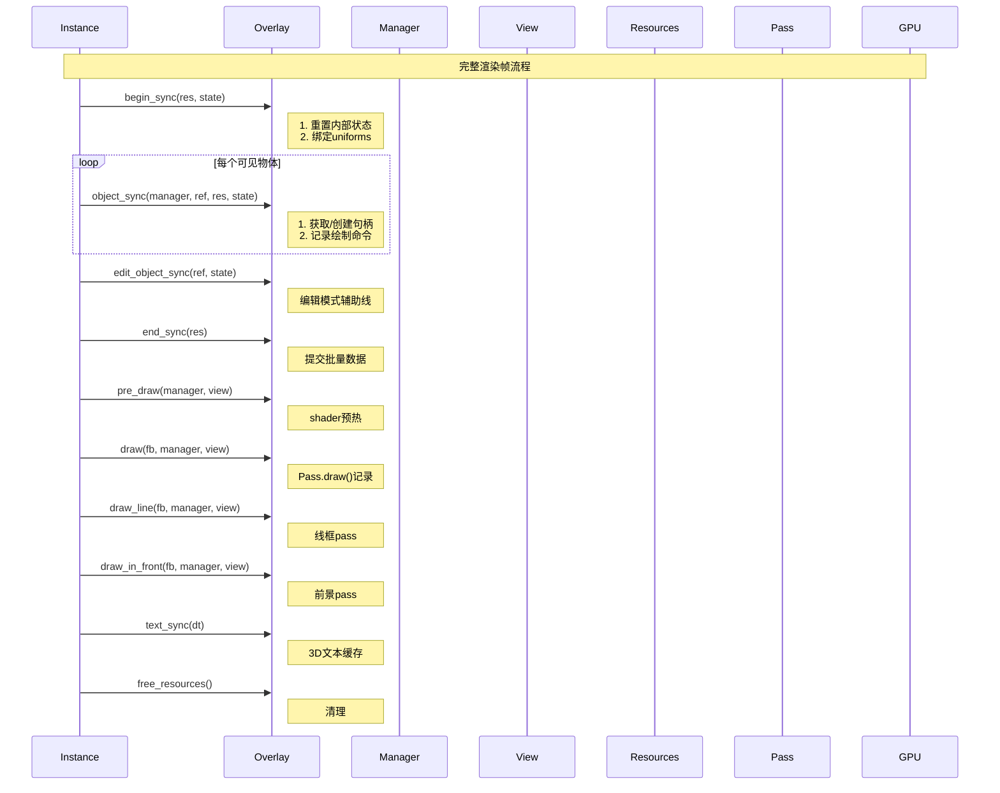

# 5. overlay_base.hh 详解

> **文件路径**: `source/blender/draw/engines/overlay/overlay_base.hh`
> **总行数**: ~160行
> **创建日期**: 2025-12-18

## 目录
- [1. 核心目的与设计哲学](#1-核心目的与设计哲学)
- [2. Overlay抽象类定义](#2-overlay抽象类定义)
- [3. 11个虚拟函数详解](#3-11个虚拟函数详解)
- [4. State结构体](#4-state结构体)
- [5. 模块实现模式](#5-模块实现模式)
- [6. 生命周期集成](#6-生命周期集成)
- [7. Python对比](#7-python对比)

---

## 1. 核心目的与设计哲学

### 1.1 为什么需要Overlay基类？

Blender有**30+个overlay模块**：
- Mesh, Curves, Armature, Lattice, PointCloud...
- 每个模块都需要初始化、同步、绘制、清理

**问题**: 如果没有统一接口，每个模块都会使用不同的函数签名，导致：

```
混乱的接口示例:
MeshOverlay::sync(Manager& m, Object* ob) { ... }
ArmatureOverlay::sync(Manager& m, View& v, Object* ob) { ... }
LatticeOverlay::sync(Object* ob, Resources& r) { ... }
```

**解决方案**: 抽象基类强制统一接口

```cpp
struct Overlay {
  virtual void object_sync(Manager&, const ObjectRef&, Resources&, const State&) = 0;
  // 所有模块必须实现相同的签名
};
```

### 1.2 优势

| 特性 | C++ | Python类比 |
|------|-----|-----------|
| 强制接口 | `= 0` 纯虚函数 | `@abstractmethod` |
| 多态 | `virtual void draw()` | `def draw(self)` 动态分派 |
| 统一管理 | `Vector<Overlay*> modules` | `List[Overlay]` |
| 编译期检查 | 必须实现所有虚函数 | 运行时检查 |

---

## 2. Overlay抽象类定义

### 2.1 完整定义 (overlay_base.hh:22-106)

```cpp
// overlay_base.hh:22-106

namespace blender::draw::overlay {

struct State;
struct Resources;

/**
 * \brief Overlay引擎的抽象接口
 *
 * 所有overlay模块必须继承此结构体并实现所有纯虚函数。
 * 这确保了30+个模块具有统一的生命周期管理。
 */
struct Overlay {
 protected:
  /**
   * \brief 启用状态标志
   *
   * 用于快速检测模块是否需要处理。
   * 子类在构造时根据配置设置此标志。
   *
   * 默认值: false (禁用)
   * 设置位置: 子类构造函数
   */
  bool enabled_ = false;

 public:
  /**
   * \brief 虚析构函数 (重要!)
   *
   * 确保通过基类指针删除子类对象时正确调用子类析构函数。
   * 防止内存泄漏。
   */
  virtual ~Overlay() = default;

  // ==========================================
  // 1. 同步周期函数
  // ==========================================

  /**
   * \brief 开始同步 - 每帧调用一次
   *
   * 调用时机: Manager::begin_sync() 之后
   * 作用: 重置状态，准备新的同步周期
   *
   * \param res GPU资源管理器
   * \param state 当前渲染状态
   */
  virtual void begin_sync(Resources &res, const State &state) = 0;

  /**
   * \brief 对象同步 - 每个可见对象调用一次
   *
   * 调用时机: 遍历可见物体时
   * 作用: 为特定对象分配资源，记录绘制命令
   *
   * \param manager Draw管理器 (资源句柄创建)
   * \param ref 对象引用 (包含Object指针和缓存的句柄)
   * \param res GPU资源
   * \param state 渲染状态
   */
  virtual void object_sync(Manager &manager,
                          const ObjectRef &ref,
                          Resources &res,
                          const State &state) = 0;

  /**
   * \brief 编辑模式对象同步
   *
   * 调用时机: 当对象处于编辑模式时 (object_sync之后)
   * 作用: 处理编辑模式特有的overlay (如网格编辑辅助线)
   *
   * \param ref 对象引用
   * \param state 渲染状态
   */
  virtual void edit_object_sync(const ObjectRef &ref, const State &state) = 0;

  /**
   * \brief 结束同步 - 每帧调用一次
   *
   * 调用时机: Manager::end_sync() 之前
   * 作用: 提交批量数据，完成GPU资源准备
   *
   * \param res GPU资源
   */
  virtual void end_sync(Resources &res) = 0;

  // ==========================================
  // 2. 绘制周期函数
  // ==========================================

  /**
   * \brief 预计算绘制命令
   *
   * 调用时机: 生成GPU命令之前
   * 作用: 热身shader，预计算派生数据
   *
   * \param manager Draw管理器
   * \param view 视图对象
   */
  virtual void pre_draw(Manager &manager, View &view) = 0;

  /**
   * \brief 主绘制函数
   *
   * 调用时机: 实际GPU渲染时 (不直接提交，记录命令)
   * 作用: 调用 Pass.draw() 将命令记录到队列
   *
   * \param framebuffer 渲染目标
   * \param manager Draw管理器
   * \param view 视图对象
   */
  virtual void draw(Framebuffer &framebuffer,
                   Manager &manager,
                   View &view) = 0;

  /**
   * \brief 线框绘制函数
   *
   * 作用: 绘制线框模式的特殊处理
   * 有些overlay需要单独的线框pass
   */
  virtual void draw_line(Framebuffer &framebuffer,
                        Manager &manager,
                        View &view) = 0;

  /**
   * \brief 前景覆盖层绘制
   *
   * 用于 in-front 渲染 (不被物体遮挡)
   */
  virtual void draw_in_front(Framebuffer &framebuffer,
                            Manager &manager,
                            View &view) = 0;

  // ==========================================
  // 3. 文本与清理
  // ==========================================

  /**
   * \brief 文本缓存同步
   *
   * 作用: 添加3D文本到缓存 (坐标、测量值、索引)
   *
   * \param dt 文本缓存对象
   */
  virtual void text_sync(DRWTextStore *dt) = 0;

  /**
   * \brief 清理资源
   *
   * 调用时机: 引擎销毁时
   * 作用: 释放GPU资源，清理缓存
   */
  virtual void free_resources() = 0;

  // ==========================================
  // 4. 访问器
  // ==========================================

  /**
   * \brief 检查模块是否启用
   */
  bool is_enabled() const { return enabled_; }

  /**
   * \brief 启用/禁用模块
   */
  void set_enabled(bool enabled) { enabled_ = enabled; }
};

}  // namespace blender::draw::overlay
```

---

## 3. 11个虚拟函数详解

### 3.1 函数调用时序



### 3.2 核心函数深度解析

#### 3.2.1 object_sync - 最重要的函数

**为什么最重要?**
- 每帧每个物体调用一次
- 决定渲染什么内容
- 耗时占比 ~60%

**典型实现模式**:
```cpp
void MeshOverlay::object_sync(Manager &manager,
                             const ObjectRef &ref,
                             Resources &res,
                             const State &state) override
{
  if (!enabled_) return;  // 快速路径

  if (ref.object->type != OB_MESH) return;  // 类型检查

  // 1. 获取资源句柄 (延迟分配)
  ResourceHandleRange handle = manager.unique_handle(ref);

  // 2. 绑定对象特定资源
  gpu::Batch *batch = DRW_cache_mesh_surface_get(ref.object);

  // 3. 在Pass中记录绘制命令
  ps_.draw(batch, handle);
}
```

**关键点**:
- 使用 `enabled_` 快速跳过
- 使用 `unique_handle` 延迟分配资源
- 直接调用 Pass.draw() 记录命令

#### 3.2.2 begin_sync/end_sync - 同步生命周期

**场景**: 为了批量优化，需要"开始-中间-结束"三阶段

```cpp
// 错误示范 - 无法批量
void object_sync(...) {
  // 每次都需要重置
  pass.init();
  pass.draw(batch, handle);
  // 无法合并相同状态
}

// 正确示范 - 可以批量
void begin_sync(...) {
  pass.init();  // 只调用一次
}

void object_sync(...) {
  pass.draw(batch, handle);  // 累积到缓冲区
}

void end_sync(...) {
  // 提交累积的命令
}
```

---

## 4. State结构体

### 4.1 State的定义

State在overlay_private.hh:41-139定义，包含渲染所需的所有状态：

```cpp
// overlay_private.hh:41-139

struct State {
  /* 视口信息 */
  const ARegion *region;
  const View3D *v3d;
  const Scene *scene;
  const RegionView3D *rv3d;

  /* 对象模式 */
  eObjectMode object_mode;
  bool is_edit_mode;
  bool is_paint_mode;

  /* 渲染标志 */
  bool show_overlays;
  bool show_annotate;
  bool show_text;
  bool show_outline;
  bool show_wireframes;

  /* X-Ray模式 */
  bool xray_enabled;
  float xray_alpha;

  /* 编辑模式标志 */
  bool show_face_orientation;
  bool show_edge_seams;
  bool show_edge_creases;
  bool show_edge_bweights;

  /* 选择相关 */
  bool use_depth_selection;
  bool select_mode;

  /* 颜色主题 */
  float4 theme_color_wire;
  float4 theme_color_vertex;
  float4 theme_color_edge_select;
  // ... 更多

  /* 性能参数 */
  float overlay_opacity;
  float wireframe_threshold;
  int rendering;
};
```

### 4.2 State在函数间的流动

```mermaid
graph LR
    Instance[Instance.create_state()] -->|填充| State
    State -->|传入| begin_sync
    State -->|传入| object_sync
    State -->|传入| text_sync

    subgraph Overlay模块
        begin_sync
        object_sync
        edit_object_sync
        text_sync
    end

    State -.->|访问| begin_sync
    State -.->|访问| object_sync
```

---

## 5. 模块实现模式

### 5.1 最简单模块示例 (PointCloud)

```cpp
// overlay_pointcloud.hh

struct PointClouds : public Overlay {
  PassMain ps_ = {"pointclouds"};

  PointClouds() {
    enabled_ = true;  // 总是启用
  }

  void begin_sync(Resources &res, const State &state) override {
    ps_.init();
    // 绑定统一shader
    ps_.shader_set(res.shaders->pointcloud_points.get());
  }

  void object_sync(Manager &manager,
                   const ObjectRef &ref,
                   Resources &res,
                   const State &state) override {
    if (!enabled_) return;
    if (ref.object->type != OB_POINTCLOUD) return;

    ResourceHandleRange handle = manager.unique_handle(ref);
    gpu::Batch *batch = DRW_cache_pointcloud_get(ref.object);

    ps_.draw(batch, handle);
  }

  void edit_object_sync(const ObjectRef &ref, const State &state) override {
    // 点云没有编辑模式特殊overlay
  }

  void end_sync(Resources &res) override {
    // 无操作 - Pass自动管理
  }

  void pre_draw(Manager &manager, View &view) override {
    manager.generate_commands(ps_, view);
  }

  void draw(Framebuffer &framebuffer,
            Manager &manager,
            View &view) override {
    GPU_framebuffer_bind(framebuffer);
    manager.submit_only(ps_, view);
  }

  void draw_line(Framebuffer&, Manager&, View&) override {}
  void draw_in_front(Framebuffer&, Manager&, View&) override {}

  void text_sync(DRWTextStore *) override {
    // 点云没有文本
  }

  void free_resources() override {
    ps_.release();
  }
};
```

**特点**: 简单明了，适合初学。

### 5.2 复杂模块示例 (Armature)

```cpp
// overlay_armature.hh

struct Armatures : public Overlay {
  PassMain ps_ = {"armatures"};
  PassMain ps_in_front_ = {"armatures_in_front"};

  // 骨骼实例数据缓存
  Vector<BoneInstanceData> bone_instances;

  // 骨骼特定Pass
  PassMain::Sub *bones_sub_ = nullptr;
  PassMain::Sub *envelopes_sub_ = nullptr;
  PassMain::Sub *sticks_sub_ = nullptr;

  Armatures(const SelectionType selection_type) {
    // 根据选择类型启用/禁用
    enabled_ = selection_type == SelectionType::DISABLED;
  }

  void begin_sync(Resources &res, const State &state) override {
    ps_.init();
    ps_in_front_.init();

    // 骨骼有多个子Pass
    bones_sub_ = ps_.sub("bones");
    envelopes_sub_ = ps_.sub("envelopes");
    sticks_sub_ = ps_.sub("sticks");

    // 绑定不同shader
    bones_sub_->shader_set(res.shaders->armature_wire.get());
    envelopes_sub_->shader_set(res.shaders->armature_envelope_fill.get());
  }

  void object_sync(Manager &manager,
                   const ObjectRef &ref,
                   Resources &res,
                   const State &state) override {
    if (!enabled_) return;
    if (ref.object->type != OB_ARMATURE) return;

    // 骨骼需要遍历所有骨骼
    PoseTree *pose_tree = get_pose_tree(ref.object);

    for (Bone &bone : pose_tree->bones) {
      BoneInstanceData instance;
      instance.matrix = ref.object->object_to_world() * bone.matrix;
      instance.length = bone.length;

      // 特定骨骼类型进入不同子Pass
      if (bone.shape) {
        bones_sub_->draw(shape_batch, instance);
      } else if (state.armature_envelope) {
        envelopes_sub_->draw(envelope_batch, instance);
      } else {
        sticks_sub_->draw(stick_batch, instance);
      }
    }
  }

  void text_sync(DRWTextStore *dt) override {
    // 骨骼名称文本
    // 骨骼长度测量文本
  }

  // draw_line/draw_in_front 需要处理
  // 背景层、前景层分开绘制
};
```

**特点**: 复杂，需要处理多个子Pass、骨骼数据、文本等。

---

## 6. 生命周期集成

### 6.1 完整调用栈

```mermaid
graph TD
    Instance[Instance.draw()] --> Manager
    Manager -->|begin_sync| Overlay1[所有模块.begin_sync()]

    Instance -->|遍历物体| Loop

    subgraph Loop
      Loop1[for each visible object] --> Select[判断对象类型]
      Select -->|Mesh| MeshOverlay
      Select -->|Armature| ArmOverlay
      Select -->|Curves| CurvesOverlay

      MeshOverlay -->|object_sync| ObjSync1
      ArmOverlay -->|object_sync| ObjSync2
      CurvesOverlay -->|object_sync| ObjSync3
    end

    ObjSync1 --> Manager2
    ObjSync2 --> Manager2
    ObjSync3 --> Manager2

    Manager2[Manager.unique_handle()] --> Alloc[资源分配]
    Alloc --> ObjSync1

    ObjSync1 --> Pass1[Pass.draw()]
    ObjSync2 --> Pass2[Pass.draw()]
    ObjSync3 --> Pass3[Pass.draw()]

    Instance -->|end_sync| AllOverlay

    subgraph AllOverlay
      MeshOverlay.end_sync
      ArmOverlay.end_sync
      CurvesOverlay.end_sync
    end

    Instance -->|pre_draw| PreDraw
    PreDraw --> Manager3

    Manager3[Manager.generate_commands] --> GPUCompute

    Instance -->|draw| DrawPass
    DrawPass --> Manager4
    Manager4[Manager.submit] --> GPU

    Instance -->|text_sync| TextDraw
    TextDraw --> DRWTextCache

    Instance -->|清理| FreeAll
```

### 6.2 状态流

```
             ┌──────────────────────────────────────┐
             │  Instance.create_state()             │
             │  从Context填充所有状态               │
             └──────────────────┬───────────────────┘
                                │
                ┌───────────────┼───────────────┐
                │               │               │
         ┌──────▼─────┐  ┌─────▼────┐  ┌─────▼────┐
         │ begin_sync │  │ obj_sync │  │ end_sync │
         │            │  │          │  │          │
         │ State      │  │ State    │  │ State    │
         │ Resources  │  │ Manager  │  │ Res      │
         └────────────┘  │ Ref      │  └────────────┘
                         │ Res      │
                         └──────────┘
```

---

## 7. Python对比

### 7.1 C++ Virtual vs Python ABC

**C++代码**:
```cpp
struct Overlay {
  virtual void object_sync(...) = 0;  // 必须实现
};

struct Meshes : Overlay {
  void object_sync(...) override { ... }
};
```

**等价Python**:
```python
from abc import ABC, abstractmethod

class Overlay(ABC):
    @abstractmethod
    def object_sync(self, manager, ref, res, state):
        pass

class Meshes(Overlay):
    def object_sync(self, manager, ref, res, state):
        super().object_sync(manager, ref, res, state)
        # 实现代码
```

### 7.2 为什么C++不使用模板?

**模板方法**:
```cpp
template<typename T>
void process(Overlay &module) {
  module.object_sync(...);
}
```

**问题**:
- 模板需要完整定义在头文件
- 编译时间长
- 二进制膨胀

**虚函数方法**:
```cpp
void process(Overlay &module) {
  module->object_sync(...);
}
```

**优势**:
- 编译更快
- 代码分离
- 灵活性高

---

## 8. 关键设计决策

### 8.1 为什么纯虚函数?

| 方案 | 优点 | 缺点 |
|------|------|------|
| **纯虚函数** | 强制实现，编译期检查 | 必须实现所有函数 |
| **默认实现** | 灵活 | 容易忘记重写，运行时错误 |
| **组合模式** | 复用代码 | 过度复杂 |

**决策**: 纯虚函数 + 空实现 (如果不需要)

### 8.2 为什么pass成员在子类?

**方案A - 基类有pass**:
```cpp
struct Overlay {
  PassMain ps_;
  // 所有模块共享一个pass? 无法区分
};
```

**方案B - 子类有pass** (当前使用):
```cpp
struct Meshes : Overlay {
  PassMain ps_ = {"meshes"};  // 清晰命名
};
```

**决策**: 每个模块独立pass，支持不同shader和状态。

### 8.3 为什么State单独传递?

**不传递State**:
```cpp
struct Overlay {
  State state;  // 成员变量
};
```

**问题**:
- 并发问题
- 状态复制开销
- 难以追溯数据流

**解决方案**: 引用传递，从上层流入

---

## 总结

### 设计亮点

1. **清晰的角色分离**
   - Overlay: 纯接口，无数据
   - State: 仅状态，无逻辑
   - Resources: 仅资源，无绘制

2. **完整的生命周期**
   - 11个函数覆盖所有阶段
   - 每个阶段职责明确

3. **Python开发者友好**
   - 类似ABC的设计模式
   - 抽象概念容易理解

4. **性能优化**
   - enabled_ 快速路径
   - State引用传递
   - 独立Pass支持批处理

### 流程汇总

```
begin_sync → object_sync → end_sync → pre_draw → draw → text_sync → free
      (1次)      (N次)         (1次)      (1次)     (1次)      (1次)      (1次)
     重置      同步对象      提交       预热      渲染      文本       清理
```

**下章**: `6. overlay_instance.cc 详解` - 完整实例实现
