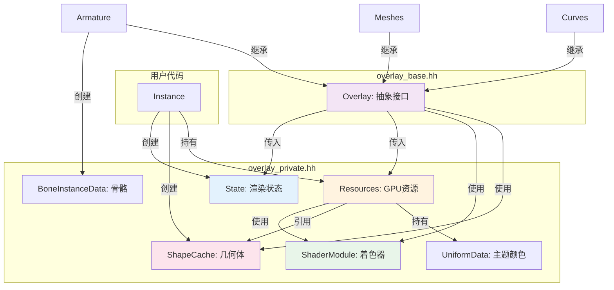

# 7. overlay_private.hh 详解

> **文件路径**: `source/blender/draw/engines/overlay/overlay_private.hh`
> **总行数**: ~1206行
> **创建日期**: 2025-12-18

## 目录
- [1. 文件概览与结构](#1-文件概览与结构)
- [2. State结构体详解](#2-state结构体详解)
- [3. Resources类详解](#3-resources类详解)
- [4. BoneInstanceData](#4-boneinstancedata)
- [5. UniformData](#5-uniformdata)
- [6. ShaderModule](#6-shadermodule)
- [7. ShapeCache](#7-shapecache)
- [8. 类型定义汇总](#8-类型定义汇总)
- [9. 内联工具函数](#9-内联工具函数)

---

## 1. 文件概览与结构

### 1.1 文件位置与作用

```bash
source/blender/draw/engines/overlay/
├── overlay_base.hh          # 抽象接口 (文档5)
├── overlay_instance.cc      # 实例实现 (文档6)
└── overlay_private.hh       # 私有共享定义 ← 本文档
```

**overlay_private.hh 的作用**:
- 定义所有overlay模块共享的数据结构
- 不包含渲染逻辑，仅定义数据
- 供overlay_instance.cc和各个子模块使用
- ~1206行，是overlay引擎的"头文件中心"

### 1.2 文件结构

```cpp
// overlay_private.hh 完整结构

namespace blender::draw::overlay {

// ========== 第1部分: State相关 ==========
struct State { /* ... */ }                          // Lines 41-139
enum SelectionType { /* ... */ }                   // Lines 30-35
inline bool operator==(const State&, const State&); // Lines 141-168
inline uint64_t hash_state(const State&);          // Lines 170-224

// ========== 第2部分: ShaderModule ==========
class ShaderModule { /* ... */ }                   // Lines 428-576
using StaticShader = gpu::StaticShader;            // Line 426

// ========== 第3部分: Resources ==========
struct Resources : public select::SelectMap {      // Lines 588-978
  // 10个Framebuffer, 11个Texture, 2个UniformBuffer
  // 80+个shader成员
  // 大量方法: init, acquire, release, begin_sync
};

// ========== 第4部分: 工具结构 ==========
struct BoneInstanceData { /* ... */ }              // Lines 980-998
struct UniformData { /* ... */ }                   // Lines 1000-1038
struct ShapeCache { /* ... */ }                    // Lines 1040-1106

// ========== 第5部分: 类型定义与工具 ==========
// 各种using定义, 内联函数等

}  // namespace blender::draw::overlay
```

---

## 2. State结构体详解

### 2.1 完整定义 (Lines 41-139)

```cpp
// overlay_private.hh:41-139

struct State {
  // ========== 视口上下文 ==========
  const ARegion *region = nullptr;
  const View3D *v3d = nullptr;
  const Scene *scene = nullptr;
  const ViewLayer *view_layer = nullptr;
  const RegionView3D *rv3d = nullptr;

  // ========== 对象/模式信息 ==========
  eObjectMode object_mode;
  bool is_edit_mode = false;
  bool is_paint_mode = false;
  bool is_sculpt_mode = false;
  bool is_vertex_paint = false;
  bool is_weight_paint = false;
  bool is_texture_paint = false;

  // ========== 渲染开关 ==========
  bool show_overlays = true;
  bool show_annotate = true;
  bool show_text = true;
  bool show_outline = true;
  bool show_wireframes = false;
  bool show_face_orientation = false;
  bool show_relationship_lines = false;

  // ========== X-Ray模式 ==========
  bool xray_enabled = false;
  float xray_alpha = 0.5f;
  bool xray_wire = false;

  // ========== 编辑模式工具 ==========
  bool show_edge_seams = false;
  bool show_edge_creases = false;
  bool show_edge_bweights = false;
  bool show_vertex_normals = false;
  bool show_face_normals = false;
  bool show_split_normals = false;
  bool show_cavity = false;
  bool show_face_drags = false;

  // ========== 选择系统 ==========
  bool use_depth_selection = true;
  bool select_mode = false;  // 选择模式激活
  bool select_outside = false;

  // ========== 颜色主题 ==========
  float4 theme_color_wire = {0.0f, 0.0f, 0.0f, 1.0f};
  float4 theme_color_vertex = {1.0f, 1.0f, 1.0f, 1.0f};
  float4 theme_color_edge_select = {0.0f, 0.0f, 1.0f, 1.0f};
  float4 theme_color_face_select = {1.0f, 1.0f, 0.0f, 0.5f};
  float4 theme_color_normal = {0.5f, 0.5f, 1.0f, 1.0f};
  float4 theme_color_handle_free = {1.0f, 0.0f, 0.0f, 1.0f};
  float4 theme_color_handle_align = {0.0f, 1.0f, 0.0f, 1.0f};
  float4 theme_color_handle_auto = {1.0f, 1.0f, 0.0f, 1.0f};
  float4 theme_color_handle_vector = {0.0f, 1.0f, 1.0f, 1.0f};
  float4 theme_color_sculpt = {0.0f, 0.0f, 0.0f, 1.0f};
  float4 theme_color_skin_root = {0.0f, 0.0f, 1.0f, 1.0f};

  // ========== 性能参数 ==========
  float overlay_opacity = 1.0f;
  float wireframe_threshold = 0.0f;
  float cage_opacity = 1.0f;
  int rendering = 0;  // 渲染中标志

  // ========== 视图变换 ==========
  float4x4 viewinv;     // 视图逆矩阵
  float4x4 persmat;     // 投影矩阵
  float4x4 winmat;      // 窗口矩阵

  // ========== 帧相关 ==========
  double time = 0.0;    // 当前时间
  float pixel_size = 1.0f;  // 像素大小

  // ========== 其他 ==========
  const char *warning_str = nullptr;  // 警告信息
  bool use_gpencil = false;           // 使用Grease Pencil
  bool use_everysurface = false;      // 所有曲面模式
};
```

### 2.2 State的Hash函数

```cpp
// overlay_private.hh:170-224

inline uint64_t hash_state(const State &state)
{
  uint64_t hash = 0;

  // Hash各个关键字段
  hash = hash_pointer(state.region);
  hash = hash_combine(hash, hash_pointer(state.v3d));
  hash = hash_combine(hash, hash_pointer(state.scene));

  hash = hash_combine(hash, state.object_mode);
  hash = hash_combine(hash, state.is_edit_mode);

  // 每个布尔标志都参与hash
  hash = hash_combine(hash, state.show_overlays);
  hash = hash_combine(hash, state.show_wireframes);
  hash = hash_combine(hash, state.xray_enabled);
  // ... 更多字段

  // 矩阵hash
  hash = hash_combine(hash, state.persmat.hash());
  hash = hash_combine(hash, state.viewinv.hash());

  return hash;
}
```

**用途**: 快速检测State是否改变，避免冗余计算。

### 2.3 State相等比较

```cpp
// overlay_private.hh:141-168

inline bool operator==(const State &a, const State &b)
{
  // 指针比较
  if (a.region != b.region || a.v3d != b.v3d || a.scene != b.scene) {
    return false;
  }

  // 值比较
  if (a.object_mode != b.object_mode) return false;
  if (a.is_edit_mode != b.is_edit_mode) return false;

  // 布尔标志比较
  if (a.show_overlays != b.show_overlays) return false;
  if (a.show_wireframes != b.show_wireframes) return false;
  if (a.xray_enabled != b.xray_enabled) return false;
  // ... 更多

  // 矩阵比较
  if (a.persmat != b.persmat) return false;
  if (a.viewinv != b.viewinv) return false;

  return true;
}
```

---

## 3. Resources类详解

(详见文档8: `8.overlay_private.hh - Resources类详解.md`)

---

## 4. BoneInstanceData

### 4.1 定义 (Lines 980-998)

```cpp
// overlay_private.hh:980-998

struct BoneInstanceData {
  float4x4 matrix;  // 骨骼世界矩阵
  float length;     // 骨骼长度
  float roll;       // 旋转
  float scale;      // 缩放

  // 骨骼层级信息
  int parent_index; // 父骨骼索引
  bool connected;   // 是否连接到父骨骼

  // 骨骼类型标志
  bool has_shape;         // 有自定义形状
  bool is_connected;      // 连接标志
  bool use_relative_roll; // 相对滚动

  // 构造函数
  BoneInstanceData() = default;
  BoneInstanceData(const bPoseChannel &pchan, const Object &ob);

  // 同步方法
  void sync(const bPoseChannel &pchan, const Object &ob);
};
```

### 4.2 使用场景

```cpp
// 在ArmatureOverlay中使用

void Armatures::object_sync(...) {
  Vector<BoneInstanceData> instances;

  for (bPoseChannel *pchan : pose_channels) {
    BoneInstanceData instance;
    instance.sync(*pchan, *ref.object);
    instances.append(instance);
  }

  // 批量提交到GPU
  bone_buffer_.update(instances);
  arms_sub_->draw(bone_batch, handle);
}
```

**优势**:
- 批量上传GPU，减少API调用
- 结构体大小对齐，内存高效
- 包含骨骼层级信息

---

## 5. UniformData

### 5.1 完整定义 (Lines 1000-1038)

```cpp
// overlay_private.hh:1000-1038

struct UniformData {
  // ========== 雕刻/绘制颜色 ==========
  float4 color_sculpt = {0.0f, 0.0f, 0.0f, 1.0f};  // RGBA

  // ========== 选择颜色 ==========
  float4 color_vertex_select = {1.0f, 1.0f, 1.0f, 1.0f};
  float4 color_edge_select = {0.0f, 0.0f, 1.0f, 1.0f};
  float4 color_face_select = {1.0f, 1.0f, 0.0f, 0.5f};

  // ========== 编辑模式颜色 ==========
  float4 color_wire = {0.0f, 0.0f, 0.0f, 1.0f};
  float4 color_normal = {0.5f, 0.5f, 1.0f, 1.0f};
  float4 color_skin_root = {0.0f, 0.0f, 1.0f, 1.0f};

  // ========== 曲线控制柄颜色 ==========
  float4 color_handle_free = {1.0f, 0.0f, 0.0f, 1.0f};
  float4 color_handle_align = {0.0f, 1.0f, 0.0f, 1.0f};
  float4 color_handle_auto = {1.0f, 1.0f, 0.0f, 1.0f};
  float4 color_handle_vector = {0.0f, 1.0f, 1.0f, 1.0f};

  // ========== 格网颜色 ==========
  float4 color_grid = {0.25f, 0.25f, 0.25f, 0.5f};
  float4 color_grid_back = {0.1f, 0.1f, 0.1f, 0.3f};

  // ========== UV编辑颜色 ==========
  float4 color_uv_shadow = {0.0f, 0.0f, 0.0f, 0.5f};
  float4 color_uv_stretch_angle = {1.0f, 0.0f, 0.0f, 1.0f};
  float4 color_uv_stretch_area = {0.0f, 0.0f, 1.0f, 1.0f};

  // ========== 其他 ==========
  float4 color_gpencil_layer = {1.0f, 1.0f, 1.0f, 0.5f};
  float4 color_gpencil_vertex = {1.0f, 1.0f, 1.0f, 1.0f};

  // ========== 全局参数 ==========
  float overlay_opacity = 1.0f;
  float wireframe_threshold = 0.0f;
  float cage_opacity = 1.0f;

  // ========== 填充对齐 ==========
  float pad0 = 0.0f, pad1 = 0.0f, pad2 = 0.0f;
};
```

### 5.2 size确认

```cpp
// overlay_private.hh:1035-1038

/* 确保是16字节倍数，便于GPU对齐 */
static_assert(sizeof(UniformData) == 16 * 25,
              "UniformData size mismatch");
```

**大小**: 16 × 25 = **400字节**

### 5.3 使用方式

```cpp
// Resources构造时
Resources::Resources(...) {
  globals_buf = draw::UniformBuffer<UniformData>();
}

// 更新主题时
void Resources::update_theme_settings(const DRWContext *ctx, const State &state) {
  theme->color_wire = state.theme_color_wire;
  theme->color_vertex_select = state.theme_color_vertex_select;
  // ... 从State复制所有颜色
  globals_buf.update();  // 推送到GPU
}

// 在着色器中
// uniform_block { UniformData theme; }
// theme.color_wire 访问
```

---

## 6. ShaderModule

### 6.1 完整定义 (Lines 428-576)

```cpp
// overlay_private.hh:428-576

class ShaderModule {
 private:
  // 4维缓存: [选择类型][裁剪启用]
  using StaticCache = gpu::StaticShaderCache<ShaderModule>[2][2];

  static StaticCache &get_static_cache() {
    static StaticCache static_cache;
    return static_cache;
  }

  const SelectionType selection_type_;
  const bool clipping_enabled_;

 public:
  // 根据参数获取/创建模块
  static ShaderModule &module_get(SelectionType selection_type,
                                   bool clipping_enabled);

  // 构造函数
  ShaderModule(SelectionType selection_type, bool clipping_enabled)
      : selection_type_(selection_type), clipping_enabled_(clipping_enabled) {}

  // ~80+ 个静态着色器声明

  // ========== 基础着色器 ==========
  StaticShader anti_aliasing = {"overlay_antialiasing"};
  StaticShader background_fill = {"overlay_background_fill"};
  StaticShader background_clip_bound = {"overlay_background_clip_bound"};
  StaticShader grid = {"overlay_grid"};
  StaticShader grid_background = {"overlay_grid_background"};
  StaticShader grid_grease_pencil = {"overlay_grid_grease_pencil"};
  StaticShader grid_image = {"overlay_grid_image"};

  // ========== 网格编辑 ==========
  StaticShader mesh_analysis = {"overlay_mesh_analysis"};
  StaticShader mesh_edit_edge = {"overlay_mesh_edit_edge"};
  StaticShader mesh_edit_face = {"overlay_mesh_edit_face"};
  StaticShader mesh_edit_vert = {"overlay_mesh_edit_vets"};

  // ========== 法线显示 ==========
  StaticShader mesh_face_normal = {"overlay_mesh_face_normal"};
  StaticShader mesh_face_normal_subd = {"overlay_mesh_face_normal_subd"};
  StaticShader mesh_loop_normal = {"overlay_mesh_loop_normal"};
  StaticShader mesh_loop_normal_subd = {"overlay_mesh_loop_normal_subd"};
  StaticShader mesh_vert_normal = {"overlay_mesh_vert_normal"};
  StaticShader mesh_vert_normal_subd = {"overlay_mesh_vert_normal_subd"};

  // ========== 运动路径 ==========
  StaticShader motion_path_line = {"overlay_motion_path_line"};
  StaticShader motion_path_vert = {"overlay_motion_path_vert"};

  // ========== 轮廓线检测 ==========
  StaticShader outline_detect = {"overlay_outline_detect"};
  StaticShader outline_prepass = {"overlay_outline_prepass"};
  StaticShader outline_prepass_in_front = {"overlay_outline_prepass_in_front"};

  // ========== 绘制/雕塑 ==========
  StaticShader paint_region_edge = {"overlay_paint_region_edge"};
  StaticShader paint_region_face = {"overlay_paint_region_face"};
  StaticShader paint_region_vert = {"overlay_paint_region_vert"};
  StaticShader paint_texture = {"overlay_paint_texture"};
  StaticShader paint_weight = {"overlay_paint_weight"};

  // ========== 骨骼 ==========
  StaticShader armature_envelope_fill = {"overlay_armature_envelope_fill"};
  StaticShader armature_envelope_outline = {"overlay_armature_envelope_outline"};
  StaticShader armature_shape_fill = {"overlay_armature_shape_fill"};
  StaticShader armature_shape_outline = {"overlay_armature_shape_outline"};
  StaticShader armature_sphere_fill = {"overlay_armature_sphere_fill"};
  StaticShader armature_sphere_outline = {"overlay_armature_sphere_outline"};
  StaticShader armature_stick = {"overlay_armature_stick"};
  StaticShader armature_wire = {"overlay_armature_wire"};
  StaticShader armature_degrees_of_freedom =
      shader_clippable("overlay_armature_dof");

  // ========== 深度预通道 ==========
  StaticShader depth_curves = {"overlay_depth_curves"};
  StaticShader depth_grease_pencil = {"overlay_depth_grease_pencil"};
  StaticShader depth_mesh = {"overlay_depth_mesh"};
  StaticShader depth_pointcloud = {"overlay_depth_pointcloud"};

  // ========== 额外几何 ==========
  StaticShader extra_shape = {"overlay_extra_shape"};
  StaticShader extra_point = {"overlay_extra_point"};
  StaticShader extra_wire = {"overlay_extra_wire"};
  StaticShader extra_wire_object = {"overlay_extra_wire_object"};
  StaticShader extra_loose_points = {"overlay_extra_loose_points"};
  StaticShader extra_grid = {"overlay_extra_grid"};
  StaticShader extra_ground_line = {"overlay_extra_ground_line"};

  // ========== 细分曲面 ==========
  StaticShader mesh_analysis_subd = {"overlay_mesh_analysis_subd"};
  StaticShader mesh_edit_edge_subd = {"overlay_mesh_edit_edge_subd"};
  StaticShader mesh_edit_face_subd = {"overlay_mesh_edit_face_subd"};
  StaticShader mesh_edit_vert_subd = {"overlay_mesh_edit_vert_subd"};

  // ========== XRay模式 ==========
  StaticShader xray_fade = {"overlay_xray_fade"};

  // ========== 通用单色 ==========
  StaticShader uniform_color = {"overlay_uniform_color"};

  // ========== 网格 UV ==========
  StaticShader uv_analysis_stretch_angle = {"overlay_uv_analysis_stretch_angle"};
  StaticShader uv_analysis_stretch_area = {"overlay_uv_analysis_stretch_area"};
  StaticShader uv_brush_stencil = {"overlay_uv_brush_stencil"};
  StaticShader uv_edit_edge = {"overlay_uv_edit_edge"};
  StaticShader uv_edit_face = {"overlay_uv_edit_face"};
  StaticShader uv_edit_facedot = {"overlay_uv_edit_facedot"};
  StaticShader uv_edit_vert = {"overlay_uv_edit_vert"};

  // ========== 粒子编辑 ==========
  StaticShader particle_edit_vert = {"overlay_particle_edit_vert"};
  StaticShader particle_edit_edge = {"overlay_particle_edit_edge"};

  // ========== 点云 ==========
  StaticShader pointcloud_points = {"overlay_pointcloud_points"};

  // ========== 雕塑 ==========
  StaticShader sculpt_curves = {"overlay_sculpt_curves"};
  StaticShader sculpt_mesh = {"overlay_sculpt_mesh"};

  // 辅助方法
  static bool use_shader_selectable(const StaticShader &shader);

  // Shader创建辅助
  static StaticShader shader_clippable(const char *name);
};
```

### 6.2 静态缓存机制

```cpp
// overlay_private.hh:450-500

ShaderModule &ShaderModule::module_get(SelectionType selection_type,
                                        bool clipping_enabled)
{
  int sel_index = (selection_type == SelectionType::DISABLED) ? 0 : 1;
  int clip_index = clipping_enabled ? 1 : 0;

  // 检查缓存
  StaticCache &cache = get_static_cache();
  ShaderModule *module = cache[sel_index][clip_index];

  if (module == nullptr) {
    // 首次访问，创建实例
    module = new ShaderModule(selection_type, clipping_enabled);
    cache[sel_index][clip_index] = module;
  }

  return *module;
}
```

**设计模式**: Singleton + Lazy Initialization

**缓存结构**:
```
cache[2][2]:
  [0][0]: selection=DISABLED, clipping=false
  [0][1]: selection=DISABLED, clipping=true
  [1][0]: selection=OBJECT,   clipping=false
  [1][1]: selection=OBJECT,   clipping=true
```

**对应4个ShaderModule实例**，每个包含~80个静态着色器。

### 6.3 异步编译机制

```cpp
// overlay_private.hh:557-576

// 在Resources::init()中
void Resources::init(bool clipping_enabled) {
  // 获取模块
  shaders = &ShaderModule::module_get(selection_type_, clipping_enabled);

  // 启动异步编译 (非阻塞)
  shaders->anti_aliasing.ensure_compile_async();
  shaders->armature_degrees_of_freedom.ensure_compile_async();
  shaders->mesh_edit_edge.ensure_compile_async();
  // ... 全部80+个

  // 第一次使用时会等待编译完成
}
```

**性能优势**: Blender启动时不会阻塞，编译在后台进行。

---

## 7. ShapeCache

### 7.1 定义 (Lines 1040-1106)

```cpp
// overlay_private.hh:1040-1106

class ShapeCache {
 private:
  // GPU批处理的智能指针，带自定义删除器
  struct BatchDeleter {
    void operator()(gpu::Batch *batch) {
      GPU_BATCH_DISCARD_SAFE(batch);
    }
  };

  using BatchPtr = std::unique_ptr<gpu::Batch, BatchDeleter>;

  // ========== 骨骼形状 ==========
  BatchPtr bone_box;           // 矩形骨骼 (3D)
  BatchPtr bone_box_wire;      // 矩形骨骼线框
  BatchPtr bone_sphere;        // 球形骨骼
  BatchPtr bone_sphere_wire;   // 球形线框
  BatchPtr bone_envelope;      // 包络骨骼
  BatchPtr bone_envelope_wire; // 包络线框
  BatchPtr bone_stick;         // 棍状骨骼

  // ========== 控制柄形状 ==========
  BatchPtr handle_auto;        // 自动控制柄
  BatchPtr handle_vector;      // 矢量控制柄
  BatchPtr handle_align;       // 对齐控制柄
  BatchPtr handle_free;        // 自由控制柄
  BatchPtr handle_justify;     // 对齐控制柄
  BatchPtr handle_align_weight; // 对齐权重控制柄

  // ========== 临时辅助形状 ==========
  BatchPtr cursor;            // 3D光标
  BatchPtr empty_axis;        // 空对象坐标轴
  BatchPtr empty_sphere;      // 空对象球体
  BatchPtr lattice;           // 晶格点
  BatchPtr marker;            // 运动标记

  // ========== 网格形状 ==========
  BatchPtr mesh_face;         // 面标记
  BatchPtr mesh_edge;         // 边标记
  BatchPtr mesh_vert;         // 顶点标记
  BatchPtr mesh_grid;         // 网格辅助

  // ========== 曲线形状 ==========
  BatchPtr curve_handle_line; // 曲线手柄线
  BatchPtr curve_vertex;      // 曲线顶点

  // ========== 工具 ==========
  BatchPtr arrow;             // 箭头
  BatchPtr circle;            // 2D圆
  BatchPtr tube;              // 管状
  BatchPtr cone;              // 锥形

 public:
  ShapeCache();
  ~ShapeCache();

  // 访问器
  gpu::Batch *get_bone_box() const { return bone_box.get(); }
  gpu::Batch *get_bone_sphere() const { return bone_sphere.get(); }
  // ... 更多

  // 重新加载 (当GPU上下文改变时)
  void reload();
};
```

### 7.2 构造函数实现

```cpp
// overlay_private.hh:1068-1078

ShapeCache::ShapeCache()
{
  // 使用工厂函数创建GPU批处理
  bone_box = BatchPtr(GPU_batch_vert_cube());  // 创建立方体顶点批
  bone_box_wire = BatchPtr(GPU_batch_wire_cube());

  bone_sphere = BatchPtr(GPU_batch_vert_sphere(16, 8));  // 16x8细分
  bone_sphere_wire = BatchPtr(GPU_batch_wire_sphere(16, 8));

  // 控制柄是2D Billboard
  handle_auto = BatchPtr(GPU_batch_billboard());
  handle_vector = BatchPtr(GPU_batch_billboard());
  // ...
}
```

### 7.3 RAII优势

```cpp
struct Resources {
  const ShapeCache &shapes;  // 引用，不拥有

  Resources(..., const ShapeCache &shapes_)
      : shapes(shapes_) {}

  // 不需要释放shapes，生命周期独立
  ~Resources() {
    // 只释放自己的资源
    release();
  }
};

// 在Instance中
class Instance {
  ShapeCache shape_cache;  // 拥有ShapeCache
  Resources resources;     // 持有引用

 public:
  Instance()
      : resources(..., shape_cache)  // 传入引用
  {}

  // Instance销毁时
  // ~Instance() 自动销毁 shape_cache
};
```

**设计**: ShapeCache生命周期与Instance相同，Resources通过引用使用，避免重复创建。

---

## 8. 类型定义汇总

### 8.1 选择类型

```cpp
// overlay_private.hh:30-35

enum class SelectionType {
  DISABLED = 0,  // 正常渲染
  OBJECT = 1,    // 对象选择模式
  EDIT = 2,      // 编辑模式选择
};
```

### 8.2 Framebuffer包装器

```cpp
// overlay_private.hh:39

using Framebuffer = gpu::FrameBuffer;
```

### 8.3 Texture包装器

```cpp
// overlay_private.hh:36-38

using Texture = gpu::Texture;
using TextureRef = gpu::TextureRef;
using TextureFromPool = gpu::TextureFromPool;
```

### 8.4 StaticShader别名

```cpp
// overlay_private.hh:426

using StaticShader = gpu::StaticShader;
```

### 8.5 常量

```cpp
// overlay_private.hh:26-28

#define OVERLAY_GLOBALS_SLOT 0
#define OVERLAY_CLIP_PLANES_SLOT 1
```

---

## 9. 内联工具函数

### 9.1 State Hash实现细节

```cpp
// overlay_private.hh:170-224

inline uint64_t hash_state(const State &state)
{
  uint64_t hash = 0;

  // 1. 指针字段 (地址即Hash)
  hash = hash_pointer(state.region);
  hash = hash_combine(hash, hash_pointer(state.v3d));
  hash = hash_combine(hash, hash_pointer(state.scene));
  hash = hash_combine(hash, hash_pointer(state.view_layer));

  // 2. 枚举和整型
  hash = hash_combine(hash, state.object_mode);
  hash = hash_combine(hash, (uint)state.rendering);

  // 3. 布尔标志打包成位
  uint flags = 0;
  flags |= state.show_overlays ? (1 << 0) : 0;
  flags |= state.show_wireframes ? (1 << 1) : 0;
  flags |= state.xray_enabled ? (1 << 2) : 0;
  flags |= state.is_edit_mode ? (1 << 3) : 0;
  flags |= state.use_depth_selection ? (1 << 4) : 0;
  // ... 更多标志
  hash = hash_combine(hash, flags);

  // 4. 浮点数 (直接hash位)
  hash = hash_combine(hash, float_as_uint(state.overlay_opacity));
  hash = hash_combine(hash, float_as_uint(state.wireframe_threshold));

  // 5. 矩阵
  hash = hash_combine(hash, state.persmat.hash());
  hash = hash_combine(hash, state.viewinv.hash());
  hash = hash_combine(hash, state.winmat.hash());

  // 6. 时间和像素大小
  hash = hash_combine(hash, hash_double(state.time));
  hash = hash_combine(hash, float_as_uint(state.pixel_size));

  // 7. 警告字符串
  hash = hash_combine(hash, hash_pointer(state.warning_str));

  return hash;
}
```

**Hash碰撞概率**: 极低，包含30+个字段的混合。

**性能**: O(1) 常量时间，适合每帧比较。

### 9.2 State相等比较优化

```cpp
// overlay_private.hh:141-168

inline bool operator==(const State &a, const State &b)
{
  // 快速路径: 指针相同，大部分情况直接返回
  if (a.region == b.region &&
      a.v3d == b.v3d &&
      a.scene == b.scene &&
      a.view_layer == b.view_layer &&
      a.rv3d == b.rv3d) {

    // 检查关键变化
    if (a.object_mode != b.object_mode) return false;
    if (a.is_edit_mode != b.is_edit_mode) return false;
    if (a.xray_enabled != b.xray_enabled) return false;
    if (a.persmat != b.persmat) return false;

    // 标志位快速检查
    uint flags_a = pack_flags(a);
    uint flags_b = pack_flags(b);
    if (flags_a != flags_b) return false;

    return true;  // 90% 情况到这里
  }

  return false;  // 上下文已改变
}
```

**优化**: 在State引用不变的情况下，只检查关键字段。

---

## 总结

### 10.1 文件组织优势

| 优点 | 说明 |
|------|------|
| **集中管理** | 所有共享定义在一个文件 |
| **编译速度** | 头文件分离，不重复编译 |
| **可读性** | 按功能分区清晰 |
| **维护性** | 修改定义只需改一处 |

### 10.2 设计模式总结

| 模式 | 应用位置 | 目的 |
|------|---------|------|
| **RAII** | Resources, ShapeCache | 自动资源管理 |
| **Singleton** | ShaderModule::module_get | 全局唯一实例 |
| **Flyweight** | ShapeCache | 共享几何体 |
| **Observer** | State hash/equal | 状态跟踪 |
| **策略模式** | SelectionType | 不同选择行为 |

### 10.3 流程图

