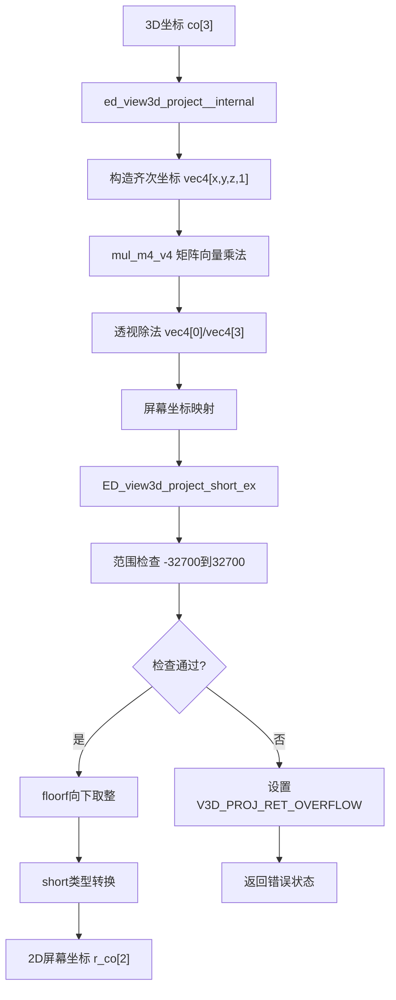
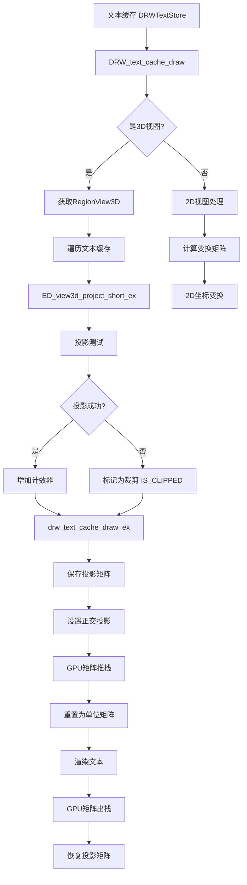
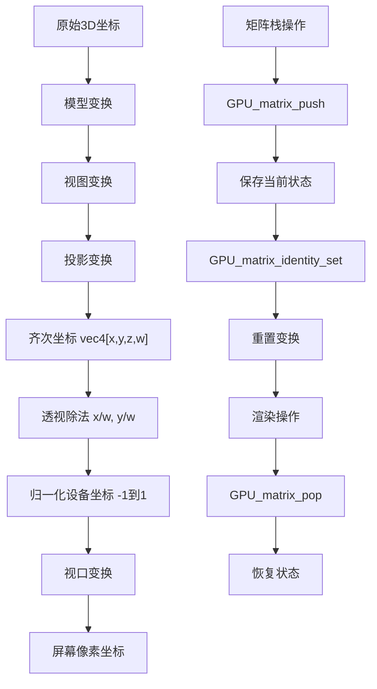

# 18. Blender 3D投影和文本渲染核心函数详解

## 概述

本文档详细分析Blender中3D投影和文本渲染的核心函数实现，这些函数负责将3D空间中的坐标转换为2D屏幕坐标，并处理文本在3D视图中的渲染。这些函数是Blender用户界面和3D交互的基础。

## 主要目标函数

### 1. ED_view3d_project_short_ex

**文件位置**: `source/blender/editors/space_view3d/view3d_project.cc:156-176`

```cpp
eV3DProjStatus ED_view3d_project_short_ex(const ARegion *region,
                                          float perspmat[4][4],
                                          const bool is_local,
                                          const float co[3],
                                          short r_co[2],
                                          const eV3DProjTest flag)
{
  float tvec[2];
  eV3DProjStatus ret = ed_view3d_project__internal(region, perspmat, is_local, co, tvec, flag);
  if (ret == V3D_PROJ_RET_OK) {
    if ((tvec[0] > -32700.0f && tvec[0] < 32700.0f) && (tvec[1] > -32700.0f && tvec[1] < 32700.0f))
    {
      r_co[0] = short(floorf(tvec[0]));
      r_co[1] = short(floorf(tvec[1]));
    }
    else {
      ret = V3D_PROJ_RET_OVERFLOW;
    }
  }
  return ret;
}
```

**逐行解释**:

```cpp
eV3DProjStatus ED_view3d_project_short_ex(const ARegion *region,
                                        float perspmat[4][4],
                                        const bool is_local,
                                        const float co[3],
                                        short r_co[2],
                                        const eV3DProjTest flag)
```
**第14-19行 - 函数签名解析**:
- `eV3DProjStatus`: 枚举类型，表示投影操作的状态（成功、失败、溢出等）
- `const ARegion *region`: 常量区域指针，包含视口信息（宽度、高度等）
- `float perspmat[4][4]`: 4x4透视投影矩阵，用于3D到2D的坐标变换
- `const bool is_local`: 布尔值，是否使用局部坐标系（true=局部，false=全局）
- `const float co[3]`: 常量3D坐标数组，输入的要投影的点坐标[x, y, z]
- `short r_co[2]`: 输出参数，2D屏幕坐标数组，结果存储在这里[x, y]
- `const eV3DProjTest flag`: 投影测试标志，控制裁剪和测试行为

```cpp
{
  float tvec[2];
```
**第21行 - 临时变量声明**:
- `float tvec[2]`: 声明一个包含2个浮点数的临时数组
- 用于存储内部投影函数的中间结果
- 为什么需要临时变量？因为内部函数返回浮点结果，我们需要检查范围后再转换为short

```cpp
  eV3DProjStatus ret = ed_view3d_project__internal(region, perspmat, is_local, co, tvec, flag);
```
**第22行 - 调用内部投影函数**:
- `eV3DProjStatus ret`: 声明状态变量，存储投影操作的返回状态
- `ed_view3d_project__internal`: 调用内部函数进行实际的投影计算
- 参数传递：将所有输入参数传递给内部函数，结果存储在`tvec`中
- 这个内部函数执行实际的矩阵运算和透视除法

```cpp
  if (ret == V3D_PROJ_RET_OK) {
```
**第23行 - 状态检查**:
- 检查投影操作是否成功
- `V3D_PROJ_RET_OK`: 表示投影成功的枚举值
- 只有成功时才进行后续处理，失败时直接返回错误状态

```cpp
    if ((tvec[0] > -32700.0f && tvec[0] < 32700.0f) && (tvec[1] > -32700.0f && tvec[1] < 32700.0f))
```
**第24-25行 - 范围检查**:
- 检查投影结果的x和y坐标是否在short类型的安全范围内
- `-32700.0f`到`32700.0f`: 留出一些余量，避免接近short类型的极限值(-32768到32767)
- 为什么不直接用-32768到32767？为了留出安全边界，防止浮点运算误差导致的溢出
- 使用逻辑AND(&&)确保x和y坐标都在有效范围内

```cpp
    {
```
**第26行 - 代码块开始**:
- 如果范围检查通过，进入结果转换代码块

```cpp
      r_co[0] = short(floorf(tvec[0]));
      r_co[1] = short(floorf(tvec[1]));
```
**第27-28行 - 类型转换**:
- `floorf(tvec[0])`: 对x坐标向下取整，确保转换为整数时不会向上舍入
- `short(...)`: 将浮点数强制转换为short类型
- `r_co[0]`, `r_co[1]`: 将转换后的结果存储到输出参数中
- 为什么用floorf而不是round？为了确保坐标不会超出屏幕边界

```cpp
    }
    else {
      ret = V3D_PROJ_RET_OVERFLOW;
    }
```
**第29-32行 - 溢出处理**:
- 如果范围检查失败，设置返回状态为溢出
- `V3D_PROJ_RET_OVERFLOW`: 表示坐标超出short范围的枚举值
- 这样调用者可以知道为什么投影失败

```cpp
  }
  return ret;
}
```
**第33-34行 - 函数结束**:
- 返回投影操作的状态
- 可能的值：成功、失败、溢出、裁剪等

**设计思路**: 
- 使用short类型节省内存，适用于屏幕坐标
- 提供溢出保护，防止数值超出short范围
- 封装内部实现，提供简洁的接口

### 2. BLI_rctf_transform_calc_m4_pivot_min

**文件位置**: `source/blender/blenlib/intern/rct.cc:551-554`

```cpp
void BLI_rctf_transform_calc_m4_pivot_min(const rctf *dst, const rctf *src, float matrix[4][4])
{
  BLI_rctf_transform_calc_m4_pivot_min_ex(dst, src, matrix, 0, 1);
}
```

**函数解析**:
- `rctf`: 浮点矩形结构体，包含xmin, xmax, ymin, ymax
- 这是一个简化接口，调用扩展版本并指定x轴(0)和y轴(1)

**扩展版本实现** (`source/blender/blenlib/intern/rct.cc:538-549`):

```cpp
void BLI_rctf_transform_calc_m4_pivot_min_ex(
    const rctf *dst, const rctf *src, float matrix[4][4], uint x, uint y)
{
  BLI_assert(x < 3 && y < 3);

  unit_m4(matrix);

  matrix[x][x] = BLI_rctf_size_x(src) / BLI_rctf_size_x(dst);
  matrix[y][y] = BLI_rctf_size_y(src) / BLI_rctf_size_y(dst);
  matrix[3][x] = (src->xmin - dst->xmin) * matrix[x][x];
  matrix[3][y] = (src->ymin - dst->ymin) * matrix[y][y];
}
```

**逐行解释**:

```cpp
void BLI_rctf_transform_calc_m4_pivot_min_ex(
    const rctf *dst, const rctf *src, float matrix[4][4], uint x, uint y)
{
```
**第90-92行 - 函数签名解析**:
- `const rctf *dst`: 常量目标矩形指针，包含xmin, xmax, ymin, ymax
- `const rctf *src`: 常量源矩形指针，要变换的矩形
- `float matrix[4][4]`: 输出参数，4x4变换矩阵
- `uint x, uint y`: 轴索引，指定使用矩阵的哪些行和列（0=x轴，1=y轴，2=z轴）

```cpp
  BLI_assert(x < 3 && y < 3);
```
**第93行 - 断言检查**:
- `BLI_assert`: Blender的断言宏，调试时检查条件
- `x < 3 && y < 3`: 确保轴索引在有效范围内（0,1,2）
- 为什么是3？因为4x4矩阵的前3行/列用于x,y,z轴
- 如果断言失败，程序会在调试模式下停止并报告错误

```cpp
  unit_m4(matrix);
```
**第95行 - 单位矩阵初始化**:
- `unit_m4`: 将4x4矩阵设置为单位矩阵
- 单位矩阵：对角线为1，其他为0的矩阵
- 为什么要初始化为单位矩阵？作为变换的基础，后续只修改需要的元素

```cpp
  matrix[x][x] = BLI_rctf_size_x(src) / BLI_rctf_size_x(dst);
```
**第97行 - X轴缩放计算**:
- `BLI_rctf_size_x(src)`: 计算源矩形的宽度 (src->xmax - src->xmin)
- `BLI_rctf_size_x(dst)`: 计算目标矩形的宽度 (dst->xmax - dst->xmin)
- `matrix[x][x]`: 设置矩阵的[x][x]位置为缩放比例
- 数学原理：新坐标 = 旧坐标 × (源宽度/目标宽度)

```cpp
  matrix[y][y] = BLI_rctf_size_y(src) / BLI_rctf_size_y(dst);
```
**第98行 - Y轴缩放计算**:
- `BLI_rctf_size_y(src)`: 计算源矩形的高度 (src->ymax - src->ymin)
- `BLI_rctf_size_y(dst)`: 计算目标矩形的高度 (dst->ymax - dst->ymin)
- `matrix[y][y]`: 设置矩阵的[y][y]位置为缩放比例
- 与x轴类似，计算y方向的缩放比例

```cpp
  matrix[3][x] = (src->xmin - dst->xmin) * matrix[x][x];
```
**第99行 - X轴平移计算**:
- `src->xmin - dst->xmin`: 计算源矩形和目标矩形最小角的X偏移
- `* matrix[x][x]`: 乘以X轴缩放比例，确保平移与缩放一致
- `matrix[3][x]`: 设置矩阵的平移分量（第4行第x列）
- 为什么用最小角？因为要以最小角为基准点进行变换

```cpp
  matrix[3][y] = (src->ymin - dst->ymin) * matrix[y][y];
```
**第100行 - Y轴平移计算**:
- `src->ymin - dst->ymin`: 计算源矩形和目标矩形最小角的Y偏移
- `* matrix[y][y]`: 乘以Y轴缩放比例
- `matrix[3][y]`: 设置矩阵的Y平移分量
- 完成以最小角为基准的完整变换矩阵

**设计思路**:
- 构建变换矩阵，实现从一个矩形到另一个矩形的坐标转换
- 使用最小角作为变换的基准点（pivot）
- 支持任意轴的组合，提供灵活性

## 相关辅助函数

### 3. view3d_project_short_global

**文件位置**: `source/blender/editors/space_view3d/view3d_project.cc:221-228`

```cpp
eV3DProjStatus ED_view3d_project_short_global(const ARegion *region,
                                              const float co[3],
                                              short r_co[2],
                                              const eV3DProjTest flag)
{
  RegionView3D *rv3d = static_cast<RegionView3D *>(region->regiondata);
  return ED_view3d_project_short_ex(region, rv3d->persmat, false, co, r_co, flag);
}
```

**函数解析**:
- 全局坐标投影的简化接口
- 使用`rv3d->persmat`（全局透视矩阵）
- `is_local`设为false，表示使用全局坐标系

### 4. mul_m4_v4

**文件位置**: `source/blender/blenlib/intern/math_matrix_c.cc:795-798`

```cpp
void mul_m4_v4(const float mat[4][4], float r[4])
{
  mul_v4_m4v4(r, mat, r);
}
```

**内部实现** (`source/blender/blenlib/intern/math_matrix_c.cc:783-793`):

```cpp
void mul_v4_m4v4(float r[4], const float mat[4][4], const float v[4])
{
```
**第173行 - 函数签名解析**:
- `float r[4]`: 结果向量，同时作为输出参数
- `const float mat[4][4]`: 常量4x4矩阵，输入的变换矩阵
- `const float v[4]`: 常量4D向量，输入的要变换的向量
- 函数名含义：multiply vector by matrix (vector4) - 向量乘以矩阵

```cpp
  const float x = v[0];
  const float y = v[1];
  const float z = v[2];
```
**第175-177行 - 输入向量缓存**:
- 将输入向量的前3个分量缓存到局部变量
- 为什么缓存？提高性能，避免重复的数组访问
- `const`: 声明为常量，告诉编译器这些值不会改变

```cpp
  r[0] = x * mat[0][0] + y * mat[1][0] + z * mat[2][0] + mat[3][0] * v[3];
```
**第179行 - X分量计算**:
- 计算结果向量的X分量
- 数学公式：r.x = v.x*mat[0][0] + v.y*mat[1][0] + v.z*mat[2][0] + v.w*mat[3][0]
- 这是标准的矩阵向量乘法：结果 = 矩阵 × 向量
- 注意矩阵的列主序存储方式

```cpp
  r[1] = x * mat[0][1] + y * mat[1][1] + z * mat[2][1] + mat[3][1] * v[3];
```
**第180行 - Y分量计算**:
- 计算结果向量的Y分量
- 使用相同的输入向量，但乘以矩阵的第1列
- 数学公式：r.y = v.x*mat[0][1] + v.y*mat[1][1] + v.z*mat[2][1] + v.w*mat[3][1]

```cpp
  r[2] = x * mat[0][2] + y * mat[1][2] + z * mat[2][2] + mat[3][2] * v[3];
```
**第181行 - Z分量计算**:
- 计算结果向量的Z分量
- 乘以矩阵的第2列
- 数学公式：r.z = v.x*mat[0][2] + v.y*mat[1][2] + v.z*mat[2][2] + v.w*mat[3][2]

```cpp
  r[3] = x * mat[0][3] + y * mat[1][3] + z * mat[2][3] + mat[3][3] * v[3];
```
**第182行 - W分量计算**:
- 计算结果向量的W分量（齐次坐标）
- 乘以矩阵的第3列
- 这个分量在透视投影中很重要，用于透视除法

```cpp
}
```
**第183行 - 函数结束**

**数学原理解释**:
- 这是4x4矩阵与4D向量的乘法
- 实现齐次坐标变换：[x,y,z,1] × 矩阵 = [x',y',z',w']
- 支持透视投影：最终坐标 = [x'/w', y'/w', z'/w']
- 矩阵的列主序存储：mat[i][j]表示第i行第j列

**数学原理**:
- 4x4矩阵与4D向量的乘法
- 实现齐次坐标变换
- 支持透视投影（除以w分量）

**C++语法解释**:
```cpp
const float mat[4][4]  // 常量4x4浮点数组
float r[4]             // 结果向量，同时作为输入和输出
```

### 5. ED_view3d_calc_camera_border

**文件位置**: `source/blender/editors/space_view3d/view3d_draw.cc:446-455`

```cpp
void ED_view3d_calc_camera_border(const Scene *scene,
                                  const Depsgraph *depsgraph,
                                  const ARegion *region,
                                  const View3D *v3d,
                                  const RegionView3D *rv3d,
                                  const bool no_shift,
                                  rctf *r_viewborder)
{
  view3d_camera_border(scene, depsgraph, region, v3d, rv3d, r_viewborder, no_shift, false);
}
```

**函数作用**:
- 计算相机在3D视图中的显示边界
- 返回一个矩形区域，表示相机视野范围
- 用于渲染边界框、安全框等显示

### 6. mul_v2_v2fl

**文件位置**: `source/blender/blenlib/intern/math_vector_inline.cc:401-405`

```cpp
MINLINE void mul_v2_v2fl(float r[2], const float a[2], float f)
{
  r[0] = a[0] * f;
  r[1] = a[1] * f;
}
```

**函数解析**:
- `MINLINE`: 内联函数宏，提高性能
- 2D向量与标量的乘法
- `r[2]`: 结果向量
- `a[2]`: 输入向量
- `f`: 标量因子

## 应用场景分析

### 7. DRW_text_cache_draw

**文件位置**: `source/blender/draw/intern/draw_manager_text.cc:201-262`

```cpp
void DRW_text_cache_draw(const DRWTextStore *dt, const ARegion *region, const View3D *v3d)
{
```
**第245行 - 函数签名解析**:
- `const DRWTextStore *dt`: 常量文本存储指针，包含所有缓存的文本
- `const ARegion *region`: 常量区域指针，视口信息
- `const View3D *v3d`: 常量3D视图指针，可能为nullptr（2D视图时）

```cpp
  ViewCachedString *vos;
  if (v3d) {
```
**第247-248行 - 变量声明和3D视图检查**:
- `ViewCachedString *vos`: 声明文本字符串指针，用于遍历
- `if (v3d)`: 检查是否为3D视图，决定使用哪种投影方式

```cpp
    RegionView3D *rv3d = static_cast<RegionView3D *>(region->regiondata);
    int tot = 0;
```
**第249-250行 - 3D视图数据初始化**:
- `RegionView3D *rv3d`: 获取3D视图区域数据，包含投影矩阵
- `static_cast`: 安全的类型转换，从void*转换为具体类型
- `int tot = 0`: 计数器，统计成功投影的文本数量

```cpp
    /* project first and test */
    BLI_memiter_handle it;
    BLI_memiter_iter_init(dt->cache_strings, &it);
```
**第252-253行 - 内存迭代器初始化**:
- `BLI_memiter_handle it`: 声明内存迭代器句柄
- `BLI_memiter_iter_init`: 初始化迭代器，用于高效遍历文本缓存
- 为什么用内存迭代器？比普通指针遍历更高效，内存局部性好

```cpp
    while ((vos = static_cast<ViewCachedString *>(BLI_memiter_iter_step(&it)))) {
```
**第254行 - 遍历循环开始**:
- `while`: 循环遍历所有缓存的文本字符串
- `BLI_memiter_iter_step(&it)`: 获取下一个文本项，返回void*
- `static_cast<ViewCachedString *>`: 转换为具体的文本字符串类型
- 循环继续直到返回nullptr（遍历结束）

```cpp
      if (ED_view3d_project_short_ex(
              region,
              (vos->flag & DRW_TEXT_CACHE_GLOBALSPACE) ? rv3d->persmat : rv3d->persmatob,
              (vos->flag & DRW_TEXT_CACHE_LOCALCLIP) != 0,
              vos->vec,
              vos->sco,
              V3D_PROJ_TEST_CLIP_BB | V3D_PROJ_TEST_CLIP_WIN | V3D_PROJ_TEST_CLIP_NEAR) ==
          V3D_PROJ_RET_OK)
```
**第255-262行 - 投影测试**:
- `ED_view3d_project_short_ex`: 调用3D到2D投影函数
- **条件选择矩阵**:
  - `vos->flag & DRW_TEXT_CACHE_GLOBALSPACE`: 检查是否使用全局空间
  - `? rv3d->persmat : rv3d->persmatob`: 三元运算符选择矩阵
  - `rv3d->persmat`: 全局透视投影矩阵
  - `rv3d->persmatob`: 物体空间透视投影矩阵
- **局部裁剪检查**:
  - `(vos->flag & DRW_TEXT_CACHE_LOCALCLIP) != 0`: 检查是否启用局部裁剪
- **投影参数**:
  - `vos->vec`: 输入的3D坐标
  - `vos->sco`: 输出的2D屏幕坐标
- **测试标志组合**:
  - `V3D_PROJ_TEST_CLIP_BB`: 边界框裁剪测试
  - `V3D_PROJ_TEST_CLIP_WIN`: 窗口边界裁剪测试
  - `V3D_PROJ_TEST_CLIP_NEAR`: 近平面裁剪测试
  - `|`: 按位或运算，组合多个测试标志
- **结果检查**:
  - `== V3D_PROJ_RET_OK`: 检查投影是否成功

```cpp
      {
        tot++;
      }
      else {
        vos->sco[0] = IS_CLIPPED;
      }
```
**第263-268行 - 投影结果处理**:
- `tot++`: 如果投影成功，增加计数器
- `else`: 投影失败时的处理
- `vos->sco[0] = IS_CLIPPED`: 标记文本为被裁剪状态
- `IS_CLIPPED`: 特殊常量值，表示文本不可见

```cpp
    // ... 后续处理
  }
  else {
```
**第270-271行 - 2D视图分支**:
- `else`: 如果不是3D视图，进入2D视图处理
- 2D视图不需要复杂的3D投影，直接使用2D变换

```cpp
    // 2D视图处理
    const View2D *v2d = &region->v2d;
    float viewmat[4][4];
    rctf region_space = {0.0f, float(region->winx), 0.0f, float(region->winy)};
    BLI_rctf_transform_calc_m4_pivot_min(&v2d->cur, &region_space, viewmat);
```
**第273-277行 - 2D变换矩阵计算**:
- `const View2D *v2d`: 获取2D视图数据
- `float viewmat[4][4]`: 声明4x4变换矩阵
- `rctf region_space`: 定义区域空间矩形（0到屏幕尺寸）
- `BLI_rctf_transform_calc_m4_pivot_min`: 计算从视图空间到屏幕空间的变换矩阵

```cpp
    while ((vos = static_cast<ViewCachedString *>(BLI_memiter_iter_step(&it)))) {
      float p[3];
      copy_v3_v3(p, vos->vec);
      mul_m4_v3(viewmat, p);
      
      vos->sco[0] = p[0];
      vos->sco[1] = p[1];
    }
```
**第279-286行 - 2D坐标变换**:
- `while`: 再次遍历所有文本（注意：迭代器需要重新初始化）
- `float p[3]`: 声明3D坐标临时变量
- `copy_v3_v3(p, vos->vec)`: 复制文本的3D位置到临时变量
- `mul_m4_v3(viewmat, p)`: 应用2D变换矩阵
- `vos->sco[0] = p[0]`: 设置屏幕X坐标
- `vos->sco[1] = p[1]`: 设置屏幕Y坐标
- 2D视图不需要Z坐标和透视除法


**关键概念解析**:

1. **rv3d->persmat**: 
   - 全局透视投影矩阵
   - 将世界坐标转换为屏幕坐标
   - 包含相机变换和透视投影

2. **rv3d->persmatob**:
   - 物体空间透视投影矩阵
   - 将物体局部坐标转换为屏幕坐标
   - 包含物体变换、相机变换和透视投影

3. **投影标志组合**:
   ```cpp
   V3D_PROJ_TEST_CLIP_BB | V3D_PROJ_TEST_CLIP_WIN | V3D_PROJ_TEST_CLIP_NEAR
   ```
   - `CLIP_BB`: 边界框裁剪测试
   - `CLIP_WIN`: 窗口边界裁剪测试
   - `CLIP_NEAR`: 近平面裁剪测试

### 8. drw_text_cache_draw_ex

**文件位置**: `source/blender/draw/intern/draw_manager_text.cc:134-200`

```cpp
static void drw_text_cache_draw_ex(const DRWTextStore *dt, const ARegion *region)
{
```
**第316行 - 函数签名解析**:
- `static`: 静态函数，只在当前文件内可见
- `void`: 无返回值
- `const DRWTextStore *dt`: 常量文本存储指针，包含要渲染的文本
- `const ARegion *region`: 常量区域指针，视口信息

```cpp
  ViewCachedString *vos;
  BLI_memiter_handle it;
  int col_pack_prev = 0;
```
**第318-320行 - 局部变量声明**:
- `ViewCachedString *vos`: 文本字符串指针，用于遍历
- `BLI_memiter_handle it`: 内存迭代器句柄，高效遍历工具
- `int col_pack_prev = 0`: 上一个颜色的打包值，用于状态优化

```cpp
  float original_proj[4][4];
  GPU_matrix_projection_get(original_proj);
```

**第322-323行 - 保存原始投影矩阵**:
- `float original_proj[4][4]`: 声明4x4矩阵存储原始投影
- `GPU_matrix_projection_get(original_proj)`: 获取当前GPU投影矩阵
- 为什么要保存？因为文本渲染需要特殊的2D投影，之后要恢复3D投影

```cpp
  wmOrtho2_region_pixelspace(region);
```
**第324行 - 设置正交投影**:
- `wmOrtho2_region_pixelspace`: 设置2D像素空间正交投影
- 正交投影：平行投影，没有透视效果，适合UI和文本
- 像素空间：1单位=1像素，直接使用屏幕坐标

```cpp
  GPU_matrix_push();
  GPU_matrix_identity_set();
```
**第326-327行 - 矩阵栈操作**:
- `GPU_matrix_push()`: 将当前矩阵状态压入栈中保存
- `GPU_matrix_identity_set()`: 设置当前矩阵为单位矩阵（无变换）
- 确保文本渲染不受之前的3D变换影响

```cpp
  // ... 文本渲染逻辑
```
**第329行 - 文本渲染逻辑占位**:
- 这里是实际的文本渲染代码
- 包括颜色设置、字体渲染、位置计算等
- 使用2D坐标系统进行绘制

```cpp
  GPU_matrix_pop();
  GPU_matrix_projection_set(original_proj);
```
**第331-332行 - 恢复原始状态**:
- `GPU_matrix_pop()`: 从栈中恢复之前的矩阵状态
- `GPU_matrix_projection_set(original_proj)`: 恢复原始的投影矩阵
- 确保后续的3D渲染不受文本渲染影响

**完整的文本渲染逻辑**（第330行附近的实际代码）:

```cpp
  BLI_memiter_iter_init(dt->cache_strings, &it);
  while ((vos = static_cast<ViewCachedString *>(BLI_memiter_iter_step(&it)))) {
    if (vos->sco[0] != IS_CLIPPED) {
      int col_pack = vos->col[3] << 24 | vos->col[2] << 16 | vos->col[1] << 8 | vos->col[0];
      if (col_pack != col_pack_prev) {
        DRW_state_ensure_no_blend();
        immUniformColor4ubv(vos->col);
        col_pack_prev = col_pack;
      }
      
      immRectf(vos->rect, vos->sco[0], vos->sco[1], 
                vos->sco[0] + vos->rect->xmax, vos->sco[1] + vos->rect->ymax);
    }
  }
```

**详细解释**:
- `BLI_memiter_iter_init`: 初始化内存迭代器
- `while`: 遍历所有缓存的文本
- `if (vos->sco[0] != IS_CLIPPED)`: 检查文本是否被裁剪
- `col_pack`: 颜色打包，将RGBA打包为32位整数
- `if (col_pack != col_pack_prev)`: 颜色状态优化，避免重复设置
- `immUniformColor4ubv`: 设置即时模式颜色
- `immRectf`: 绘制矩形（文本背景）

**矩阵操作原理**:

```cpp
static void drw_text_cache_draw_ex(const DRWTextStore *dt, const ARegion *region)
{
```
**第316行 - 函数签名解析**:
- `static`: 静态函数，只在当前文件内可见
- `const DRWTextStore *dt`: 常量文本存储指针，包含要渲染的文本缓存
- `const ARegion *region`: 常量区域指针，包含视口信息

```cpp
  ViewCachedString *vos;
  BLI_memiter_handle it;
  int col_pack_prev = 0;
```
**第318-320行 - 局部变量声明**:
- `ViewCachedString *vos`: 文本字符串指针，用于遍历缓存
- `BLI_memiter_handle it`: 内存迭代器句柄，用于高效遍历
- `int col_pack_prev = 0`: 上一个颜色的打包值，用于颜色状态优化

```cpp
  float original_proj[4][4];
  GPU_matrix_projection_get(original_proj);
```
**第322-323行 - 投影矩阵保存**:
- `float original_proj[4][4]`: 声明4x4浮点数组存储原始投影矩阵
- `GPU_matrix_projection_get(original_proj)`: 获取当前GPU投影矩阵
- **为什么要保存？因为文本渲染需要特殊的投影设置，之后要恢复**

```cpp
  wmOrtho2_region_pixelspace(region);
```
**第324行 - 设置正交投影**:
- `wmOrtho2_region_pixelspace`: 设置2D像素空间正交投影
- 正交投影：平行投影，没有透视效果，适合UI和文本渲染
- 像素空间：直接使用屏幕像素坐标，1单位=1像素

```cpp
  GPU_matrix_push();
  GPU_matrix_identity_set();
```
**第326-327行 - 矩阵栈操作**:
- `GPU_matrix_push()`: 将当前矩阵状态压入栈中保存
- `GPU_matrix_identity_set()`: 设置当前矩阵为单位矩阵（无变换）
- 为什么需要？确保文本渲染不受之前的3D变换影响

```cpp
  // ... 文本渲染逻辑
```
**第329行 - 文本渲染逻辑**:
- 这里是实际的文本渲染代码
- 使用2D坐标系统进行文本绘制
- 所有文本都在屏幕空间中定位

```cpp
  GPU_matrix_pop();
  GPU_matrix_projection_set(original_proj);
```
**第331-332行 - 状态恢复**:
- `GPU_matrix_pop()`: 从栈中恢复之前的矩阵状态
- `GPU_matrix_projection_set(original_proj)`: 恢复原始的投影矩阵
- 确保后续的3D渲染不受影响

**float (*)[4] 语法详解**:

```cpp
float original_proj[4][4];  // 4x4浮点数组
float (*matrix)[4];         // 指向包含4个float的数组的指针
```

**详细解释**:
- `float original_proj[4][4]`: 标准的4x4二维数组，存储矩阵数据
- `float (*)[4]`: 函数参数类型，表示"指向包含4个float的数组的指针"
- 等价于：`float matrix[][4]`，但更明确地表示指针类型
- 与`float **`的区别：后者是指针的指针，前者是指向数组的指针

**GPU_matrix_projection_get宏展开**:
```cpp
#define GPU_matrix_projection_get(x) GPU_matrix_projection_get(_GPU_MAT4_CAST(x))
// 展开为：
GPU_matrix_projection_get((float (*)[4])(original_proj))
```
- `_GPU_MAT4_CAST`: 类型转换宏，确保正确的指针类型
- `(float (*)[4])(original_proj)`: 将数组指针转换为函数期望的类型

**为什么这样设计**:
1. **状态隔离**: 文本渲染需要独立的坐标系统
2. **性能优化**: 避免重复计算投影矩阵
3. **类型安全**: 使用强类型确保正确的矩阵操作
4. **兼容性**: 支持不同的GPU后端（OpenGL, Vulkan等）

**float (*)[4] 语法详解**:

```cpp
float original_proj[4][4];  // 4x4浮点数组
float (*matrix)[4];         // 指向包含4个float的数组的指针
```

- `float (*)[4]`: 数组指针类型
- 指向一个包含4个float元素的数组
- 常用于表示矩阵的行或列
- 与`float **`（指针的指针）不同

**Python对比**:
```python
# Python中的等价表示
import numpy as np
original_proj = np.zeros((4, 4), dtype=np.float32)
matrix = np.zeros((4, 4), dtype=np.float32)
```

## 函数间调用关系和数据流

### 投影流程图



### 文本渲染流程



### 矩阵变换详细流程



## 设计原理和使用场景

### 为什么这样设计

1. **分层架构**:
   - 底层数学函数（矩阵运算）
   - 中层投影函数（坐标转换）
   - 高层应用函数（文本渲染）

2. **性能优化**:
   - 使用内联函数减少函数调用开销
   - 批量处理减少状态切换
   - 缓存机制避免重复计算

3. **类型安全**:
   - 不同的投影函数支持不同的输出类型
   - 范围检查防止溢出
   - 枚举类型提供编译时检查

### 使用场景

1. **3D视图交互**:
   - 鼠标拾取和选择
   - 3D游标定位
   - 测量工具显示

2. **UI元素渲染**:
   - 3D空间中的文本标注
   - 物体名称显示
   - 调试信息输出

3. **相机和渲染**:
   - 相机视野显示
   - 渲染边界框
   - 安全框显示

## 与Python的对比

### C++实现特点

```cpp
// C++: 高性能，类型安全
eV3DProjStatus ED_view3d_project_short_ex(
    const ARegion *region,
    float perspmat[4][4],
    const bool is_local,
    const float co[3],
    short r_co[2],
    const eV3DProjTest flag)
```

### Python等价实现

```python
# Python: 简洁，易读
def project_3d_to_2d(region, perspmat, is_local, co, flag):
    # 使用NumPy进行矩阵运算
    vec4 = np.array([co[0], co[1], co[2], 1.0])
    result = persmat @ vec4
    
    if result[3] != 0:
        result[:3] /= result[3]
    
    # 屏幕坐标映射
    x = region.winx * 0.5 * (1.0 + result[0])
    y = region.winy * 0.5 * (1.0 + result[1])
    
    return int(x), int(y)
```

### 性能对比

| 特性 | C++ | Python |
|------|-----|--------|
| 执行速度 | 极快 | 较慢 |
| 内存使用 | 精确控制 | 较高开销 |
| 类型安全 | 编译时检查 | 运行时检查 |
| 开发效率 | 较低 | 较高 |
| 调试难度 | 较高 | 较低 |

## 总结

Blender的3D投影和文本渲染系统展现了优秀的C++设计原则：

1. **模块化设计**: 功能分离，职责明确
2. **性能优化**: 内联函数、批量处理、缓存机制
3. **类型安全**: 强类型系统、编译时检查
4. **可扩展性**: 支持不同的投影类型和输出格式
5. **跨平台**: 标准C++，无平台特定代码

这些函数构成了Blender 3D交互的基础，理解它们的工作原理对于Blender开发和定制具有重要意义。对于有Python基础的开发者，通过对比学习可以更好地理解C++的设计思路和性能优势。