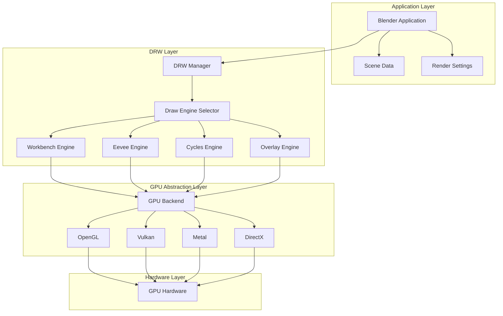
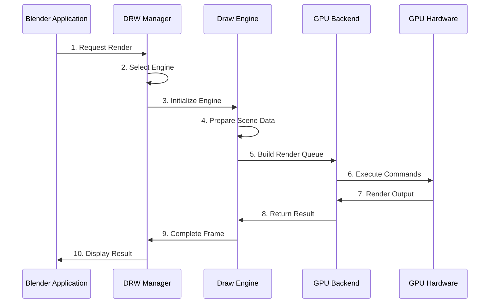
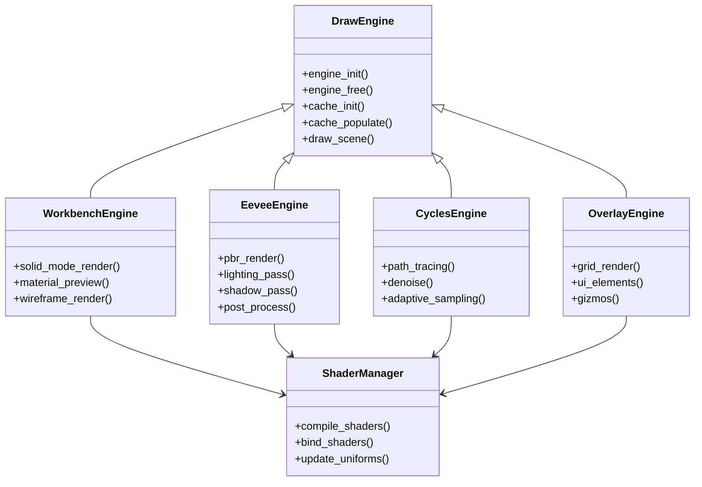
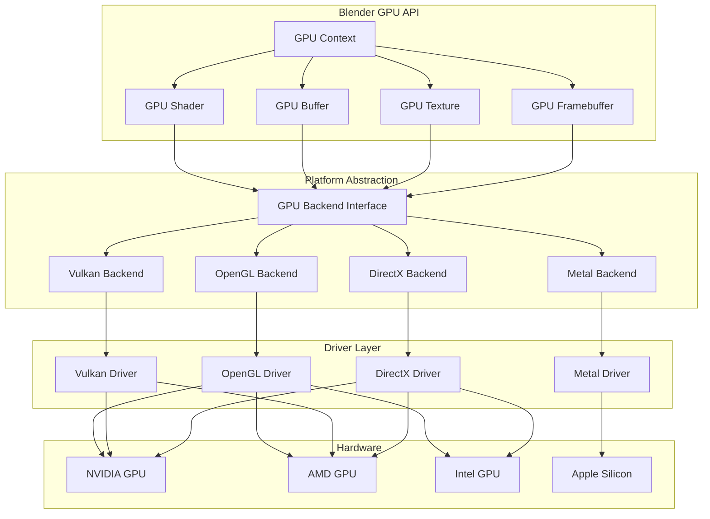

# Blender渲染系统基础

## 概述

Blender的渲染系统是一个复杂的多层次架构，支持多种渲染后端和渲染技术。本文档介绍Blender渲染系统的核心概念和架构。

## 渲染管线架构

Blender的渲染管线基于DRW（Draw）模块构建，提供了一个统一的渲染抽象层。渲染管线的主要组件包括：

### 核心组件

1. **DRW Manager**: 渲染管线的核心管理器
2. **Draw Engine**: 特定渲染模式的引擎实现
3. **GPU Backend**: GPU抽象层
4. **Shader System**: 着色器管理系统

### 渲染管线架构图

### 渲染流程

1. **场景数据准备**: 收集和准备场景数据
2. **渲染引擎选择**: 根据渲染模式选择合适的Draw Engine
3. **渲染队列构建**: 构建渲染命令队列
4. **GPU执行**: 在GPU上执行渲染命令

### 渲染流程时序图

## Draw Engine系统

Draw Engine是Blender渲染系统的核心抽象，每个Draw Engine负责特定的渲染模式：

### 主要Draw Engine类型

- **Workbench**: 用于工作台渲染（实体、材质预览等）
- **Eevee**: 基于物理的实时渲染引擎
- **Cycles**: 基于路径追踪的光线追踪渲染引擎
- **Overlay**: 用于覆盖层渲染（UI元素、网格线等）

### Draw Engine系统组件关系图

### Draw Engine接口

每个Draw Engine都需要实现以下接口：
- `engine_init()`: 引擎初始化
- `engine_free()`: 引擎清理
- `cache_init()`: 缓存初始化
- `cache_populate()`: 填充缓存数据
- `draw_scene()`: 场景渲染

## GPU抽象层

Blender提供了统一的GPU抽象层，支持多种图形API：

### 支持的图形API

- **OpenGL**: 跨平台支持
- **Vulkan**: 现代图形API（实验性）
- **Metal**: macOS平台支持
- **DirectX**: Windows平台支持

### GPU抽象层层次结构图

### GPU模块组件

- **GPU Context**: GPU上下文管理
- **GPU Shader**: 着色器编译和管理
- **GPU Buffer**: 缓冲区管理
- **GPU Texture**: 纹理管理

## 渲染技术

### 实时渲染

- **前向渲染**: 传统的实时渲染方式
- **延迟渲染**: 用于复杂光照场景
- **基于物理的渲染(PBR)**: Eevee引擎的核心

### 光线追踪

- **路径追踪**: Cycles引擎的核心算法
- **双向路径追踪**: 提高渲染效率
- **降噪技术**: 减少渲染噪点

## 性能优化

### GPU优化

- **实例化渲染**: 减少绘制调用
- **遮挡剔除**: 提高渲染效率
- **LOD系统**: 距离相关的细节层次

### 内存管理

- **GPU内存池**: 减少内存分配开销
- **纹理压缩**: 节省显存
- **几何数据压缩**: 优化内存使用

## 总结

Blender的渲染系统通过模块化设计，提供了灵活、高效的渲染解决方案。从简单的实时渲染到复杂的光线追踪，Blender都能提供相应的技术支持。