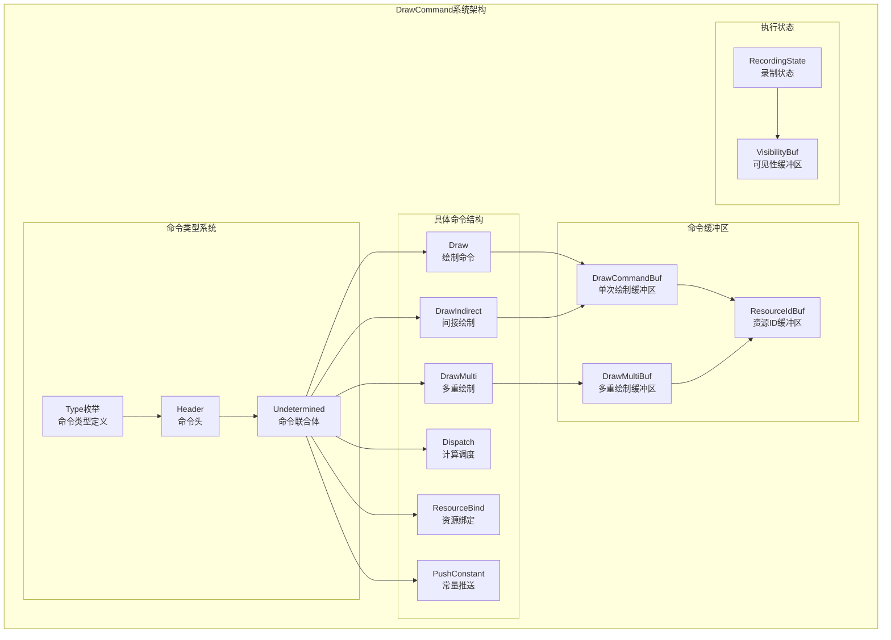
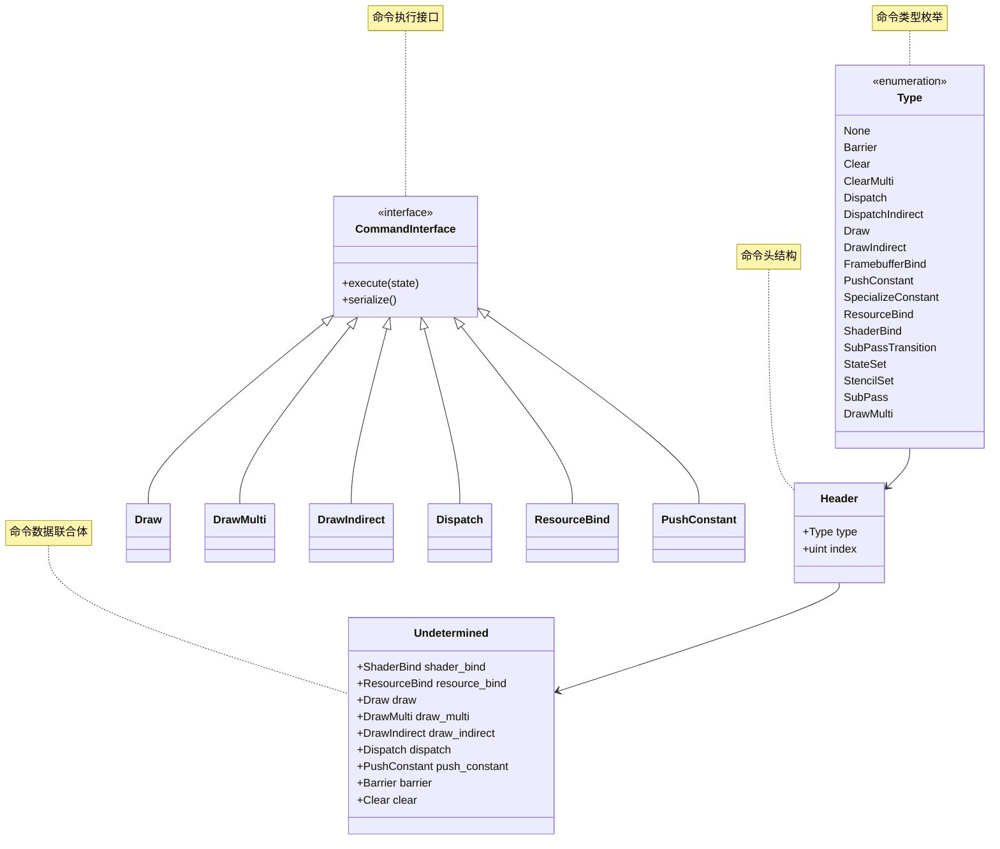
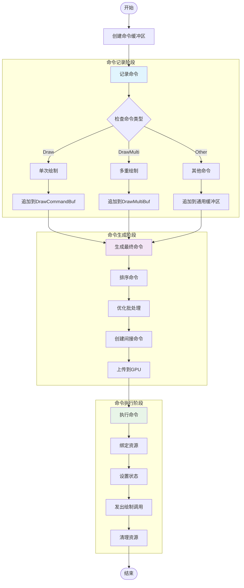
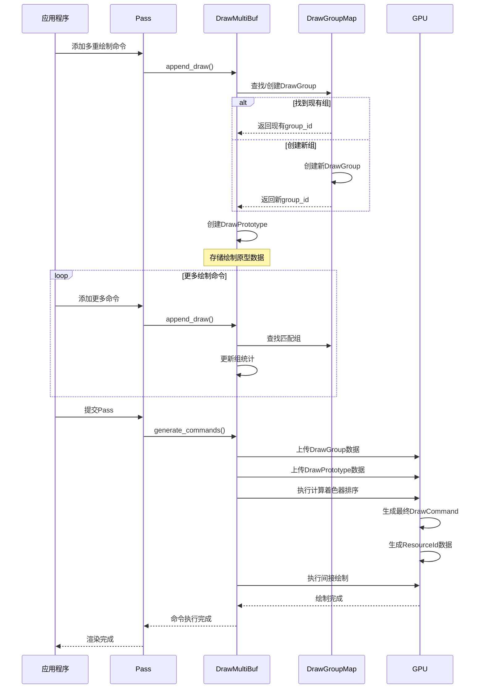
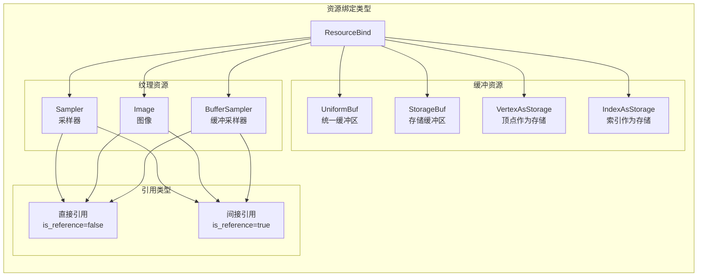
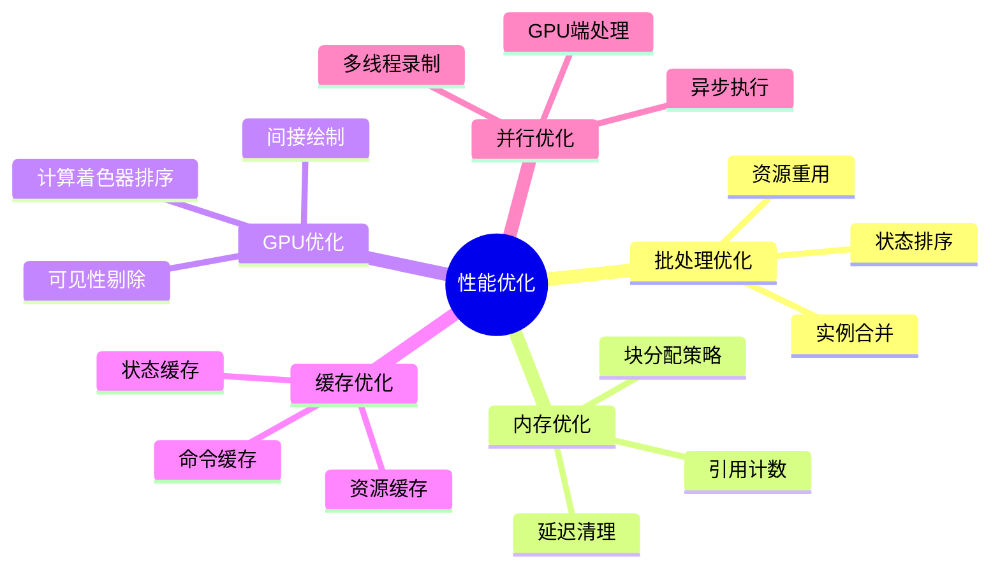
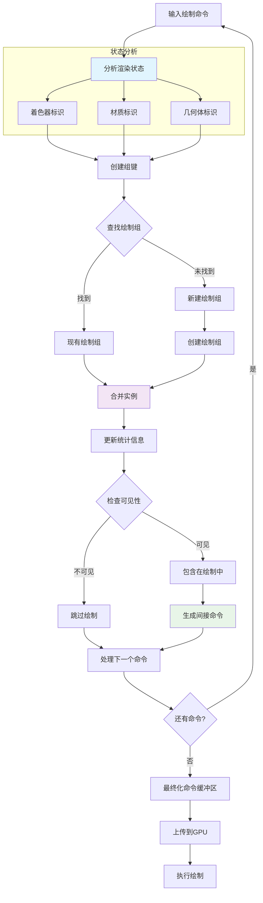
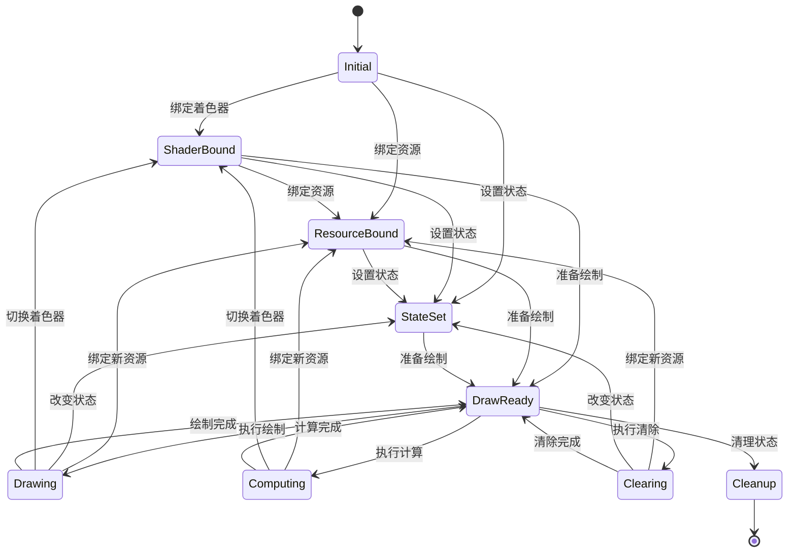

# draw_command.hh 详解

## 概述

`draw_command.hh` 定义了Blender绘制系统中的命令结构和管理机制。该文件包含了所有GPU绘制命令的定义、命令缓冲区管理以及命令执行逻辑，是连接高级渲染API和底层GPU操作的关键桥梁。

## 核心概念

### DrawCommand系统架构



*图1: DrawCommand系统整体架构*

### 命令类型层次结构



*图2: 命令类型类图*

## 命令缓冲区流程

### 命令缓冲区管理流程



*图3: 命令缓冲区完整处理流程*

### 多重绘制缓冲区详细流程



*图4: 多重绘制缓冲区处理时序图*

## 核心命令详解

### 绘制命令系统

```mermaid
graph TD
    subgraph "绘制命令层次"
        DrawCommands[绘制命令]
        
        subgraph "直接绘制"
            SingleDraw[Draw<br/>单次绘制]
            IndirectDraw[DrawIndirect<br/>间接绘制]
        end
        
        subgraph "批量绘制"
            MultiDraw[DrawMulti<br/>多重绘制]
            PrototypeDraw[DrawPrototype<br/>绘制原型]
        end
        
        subgraph "计算命令"
            ComputeDispatch[Dispatch<br/>计算调度]
            IndirectDispatch[DispatchIndirect<br/>间接计算]
        end
    end
    
    DrawCommands --> SingleDraw
    DrawCommands --> IndirectDraw
    DrawCommands --> MultiDraw
    DrawCommands --> ComputeDispatch
    DrawCommands --> IndirectDispatch
    
    MultiDraw --> PrototypeDraw
    
    note for SingleDraw "简单的单次绘制调用"
    note for IndirectDraw "使用间接缓冲区的绘制"
    note for MultiDraw "批量优化的多重绘制"
    note for PrototypeDraw "绘制原型，用于GPU端处理"
    note for ComputeDispatch "计算着色器调度"
    note for IndirectDispatch "间接计算调度"
```

*图5: 绘制命令分类*

### 资源绑定系统



*图6: 资源绑定类型系统*

## 性能优化策略

### 性能优化策略图



*图7: DrawCommand系统性能优化策略*

### 批处理优化详细流程



*图8: 批处理优化详细流程*

## 录制状态管理

### RecordingState状态机



*图9: RecordingState状态转换图*

### 状态优化策略

```mermaid
graph TD
    subgraph "状态优化"
        StateTracking[状态跟踪]
        
        subgraph "冗余检测"
            ShaderCheck[着色器检查]
            ResourceCheck[资源检查]
            StateCheck[状态检查]
        end
        
        subgraph "优化策略"
            BatchState[批量状态变更]
            LazyBinding[延迟绑定]
            CacheReuse[缓存重用]
        end
    end
    
    StateTracking --> ShaderCheck
    StateTracking --> ResourceCheck
    StateTracking --> StateCheck
    
    ShaderCheck --> BatchState
    ResourceCheck --> LazyBinding
    StateCheck --> CacheReuse
    
    note for StateTracking "跟踪当前GPU状态"
    note for ShaderCheck "避免重复绑定相同着色器"
    note for ResourceCheck "避免重复绑定相同资源"
    note for StateCheck "避免重复设置相同状态"
    note for BatchState "批量处理状态变更"
    note for LazyBinding "延迟资源绑定到实际使用时"
    note for CacheReuse "重用已缓存的状态设置"
```

*图10: 状态优化策略*

## 内存管理

### 内存布局优化

```mermaid
graph TB
    subgraph "内存布局"
        CommandBuffer[命令缓冲区]
        
        subgraph "Header区域"
            Headers[Header数组<br/>固定大小结构]
        end
        
        subgraph "Command区域"
            Commands[Command联合体<br/>变长结构]
        end
        
        subgraph "数据区域"
            DrawData[绘制数据]
            ResourceData[资源数据]
            ConstantData[常量数据]
        end
        
        subgraph "GPU缓冲区"
            DrawGroupBuf[DrawGroup缓冲区]
            PrototypeBuf[Prototype缓冲区]
            ResourceIdBuf[ResourceId缓冲区]
        end
    end
    
    CommandBuffer --> Headers
    CommandBuffer --> Commands
    Commands --> DrawData
    Commands --> ResourceData
    Commands --> ConstantData
    
    DrawData --> DrawGroupBuf
    ResourceData --> PrototypeBuf
    ConstantData --> ResourceIdBuf
    
    note for Headers "命令头，包含类型和索引"
    note for Commands "实际命令数据，使用联合体节省空间"
    note for DrawData "绘制相关数据"
    note for ResourceData "资源绑定数据"
    note for ConstantData "常量数据"
    note for DrawGroupBuf "GPU端绘制组数据"
    note for PrototypeBuf "GPU端绘制原型"
    note for ResourceIdBuf "实例资源ID"
```

*图11: 内存布局优化*

## 使用示例

### 基本命令创建

```cpp
// 创建绘制命令
Draw draw_cmd(batch, instance_count, vertex_count, vertex_first, 
              GPU_PRIM_NONE, 0, resource_index);

// 创建资源绑定命令
ResourceBind resource_cmd(slot, texture, sampler_state);

// 创建常量推送命令
PushConstant constant_cmd(location, float4_value);

// 添加到命令缓冲区
Header header = {Type::Draw, command_index};
headers.append(header);
commands[command_index].draw = draw_cmd;
```

### 多重绘制使用

```cpp
// 创建多重绘制缓冲区
DrawMultiBuf multi_buf;

// 添加绘制命令（自动批处理）
multi_buf.append_draw(headers, commands, batch, 
                     instance_len, vertex_len, vertex_first,
                     resource_range, custom_id, prim_type, prim_len);

// 生成最终命令
multi_buf.generate_commands(headers, commands, 
                           visibility_buf, visibility_word_per_draw,
                           view_count, use_custom_ids);
```

## 总结

`draw_command.hh` 提供了一个高效、灵活的GPU命令管理系统，具有以下特点：

1. **类型安全**: 使用强类型系统和联合体确保命令数据的正确性
2. **性能优化**: 自动批处理、状态缓存、内存优化等多种优化策略
3. **灵活扩展**: 模块化设计便于添加新的命令类型
4. **GPU友好**: 支持间接绘制、计算着色器等现代GPU特性
5. **内存高效**: 紧凑的内存布局和智能的内存管理

这个系统是Blender高性能渲染的核心基础设施，为复杂的渲染场景提供了强大的支持。