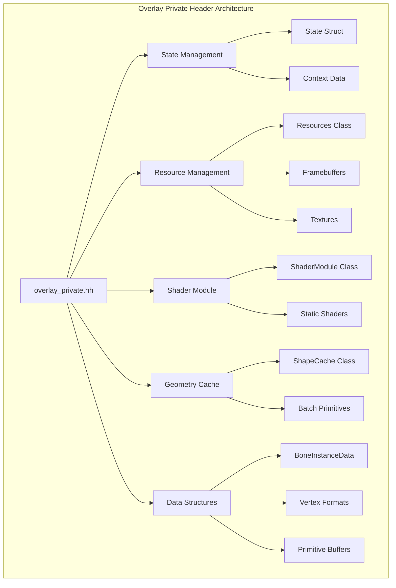
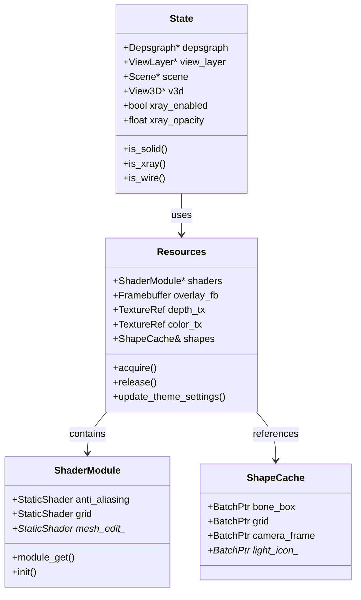
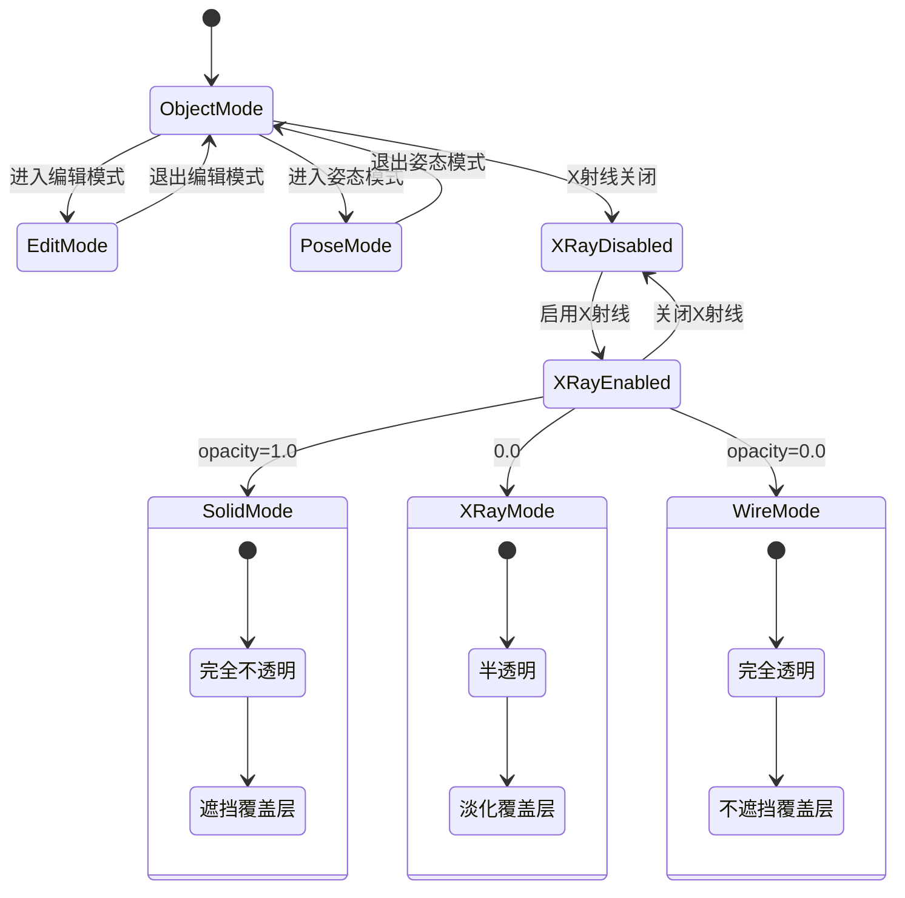
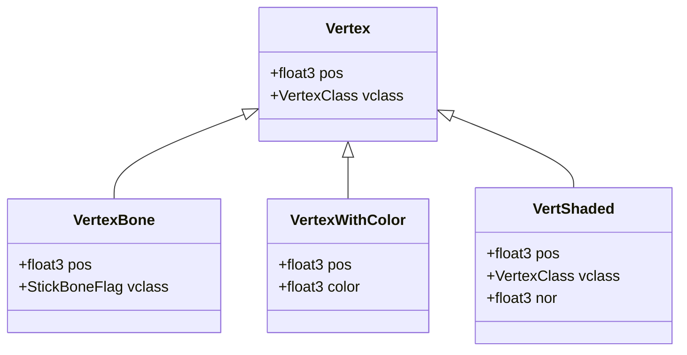
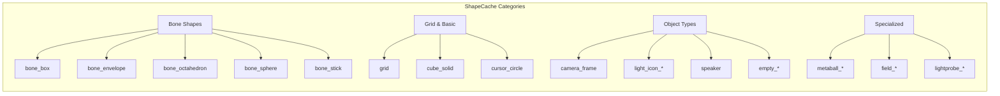
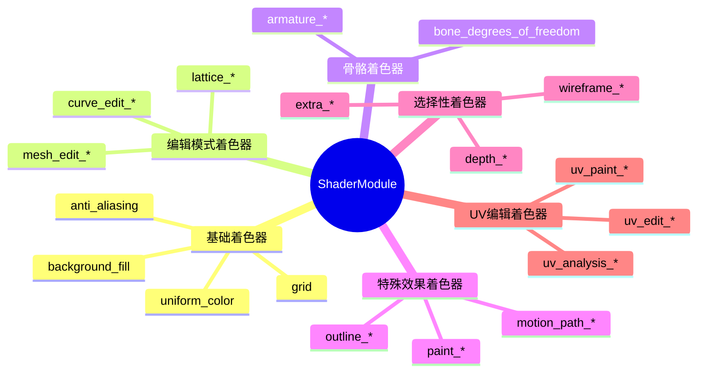
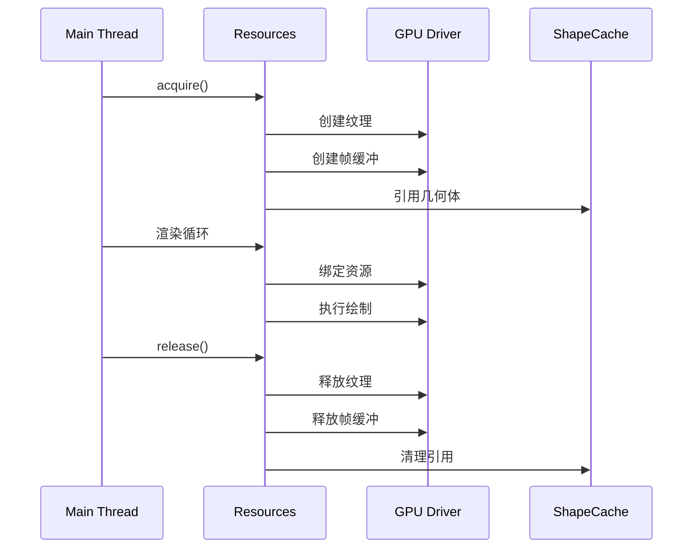
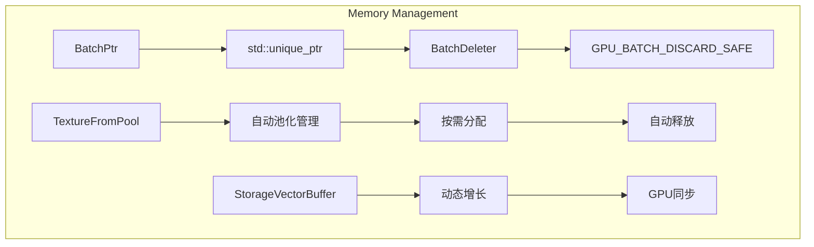
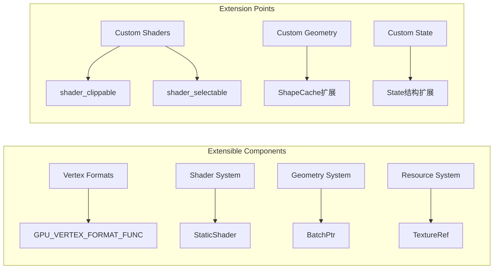

# 11. overlay_private.hh 详解

## 概述

`overlay_private.hh` 是Blender Overlay引擎的核心私有头文件，定义了Overlay渲染所需的所有内部数据结构、类和接口。该文件包含了状态管理、资源管理、着色器模块、几何体缓存等关键组件。

## 核心组件架构



## 主要数据结构关系



## BoneInstanceData 结构详解

```mermaid
graph TB
    subgraph "BoneInstanceData Union Structure"
        A[BoneInstanceData] --> B[Matrix Union]
        B --> C[float4x4 mat44]
        B --> D[float mat[4][4]]
        
        B --> E[Color Union]
        E --> F[color_hint_a]
        E --> G[color_hint_b]
        E --> H[color_a]
        E --> I[color_b]
        
        B --> J[MinMax Union]
        J --> K[amin_a]
        J --> L[amin_b]
        J --> M[amax_a]
        J --> N[amax_b]
        
        O[Constructors] --> A
        P[Color Methods] --> A
        Q[Encoding Methods] --> A
    end
```

### BoneInstanceData 特性

- **联合体设计**: 使用union实现内存高效的数据存储
- **颜色编码**: 将RGBA颜色编码为两个float以节省uniform空间
- **多种构造函数**: 支持不同的骨骼渲染需求
- **矩阵变换**: 内置4x4变换矩阵支持

## 状态管理系统



## 顶点格式定义

### 基础顶点格式



## 几何体缓存系统

### ShapeCache 架构



## 着色器模块

### ShaderModule 分类



## 资源管理机制

### 资源生命周期



## 内存管理策略

### 智能指针使用



## 性能优化特性

### 关键优化点

1. **静态着色器缓存**: 使用StaticShaderCache避免重复编译
2. **几何体实例化**: ShapeCache提供预构建的几何体
3. **内存池管理**: TextureFromPool实现纹理复用
4. **延迟编译**: 着色器异步编译减少启动时间
5. **条件渲染**: 基于状态的动态渲染路径

## 扩展性设计

### 插件化架构



## 总结

`overlay_private.hh` 是一个设计精良的渲染引擎核心文件，具有以下特点：

- **模块化设计**: 清晰的组件分离和职责划分
- **高性能**: 多层次的缓存和优化策略
- **可扩展性**: 灵活的插件化架构
- **内存安全**: 智能指针和RAII模式
- **GPU友好**: 针对现代GPU优化的数据结构

该文件为整个Overlay引擎提供了坚实的基础，支持复杂的3D视口覆盖层渲染需求。